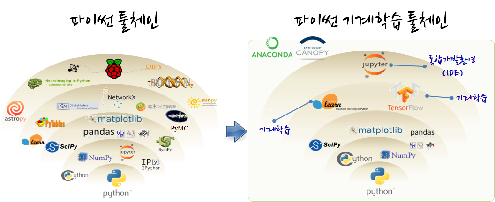

> ## 학습목표 {.objectives}
>
> * 파이썬으로 기계학습 툴체인을 구축한다.

## 파이썬기반 기계학습 툴체인(toolchain) [^china-version] [^scipy-stack-install]

[^china-version]: [Python Ecosystem for Machine Learning](http://www.shellsec.com/news/15785.html)
[^scipy-stack-install]: [Installing the SciPy Stack](http://scipy.org/install.html)

파이썬 기계학습을 위해서 먼저 언어로 [파이썬](https://www.python.org/)이 필요하고, 데이터 처리를 위해서 [넘파이(NumPy)](http://www.numpy.org/)가 필요하고, 과학컴퓨팅을 위한 기본 라이브러리를 [SciPy](http://scipy.org/)가 지원하고, 시각화를 위해 [Matplotlib](http://matplotlib.org/) 라이브러리가 필요하다. 물론, 그 하단에는 C/C++, 포트란 언어로 개발된 라이브러리 혹은 원시 소스코드를 컴파일해서 파이썬에서 가져다 사용할 수 있는 [Cython](http://cython.org/)같은 수많은 팩키지가 숨겨져 있다.

* 과학 파이썬 배포판
    * [아나콘다(Anaconda)](https://www.continuum.io/downloads): 리눅스, 윈도우, 맥
    * [캐노피(Enthought Canopy)](https://www.enthought.com/products/canopy/): 리눅스, 윈도우, 맥
    * 기타: [파이썬(x,y)](http://python-xy.github.io/), [윈파이썬(WinPython)](http://winpython.github.io/), [파이조(Pyzo)](http://www.pyzo.org/)

> ### feature engineering {.callout}
> 
> [Feature engineering](https://en.wikipedia.org/wiki/Feature_engineering)