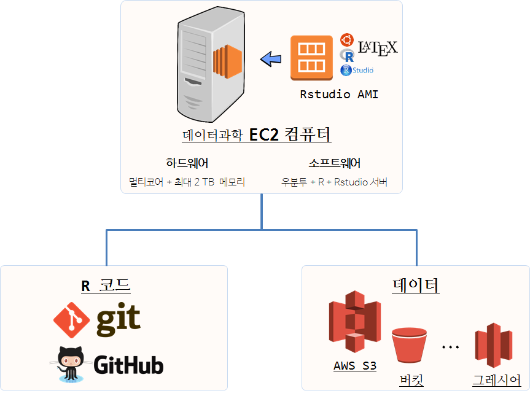
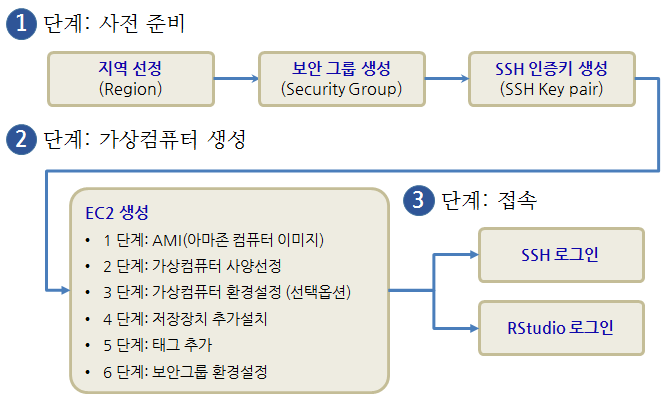
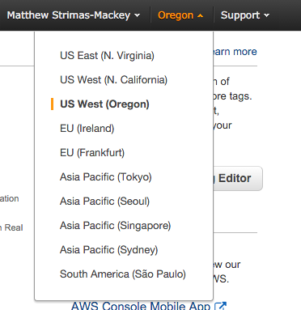
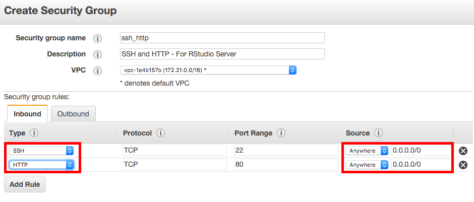
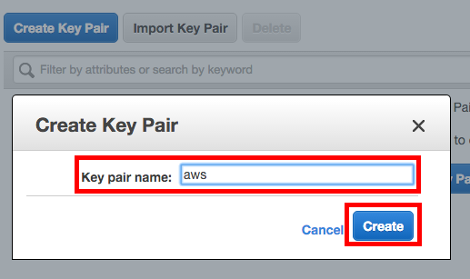
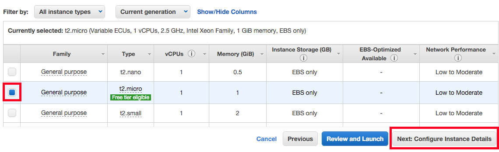
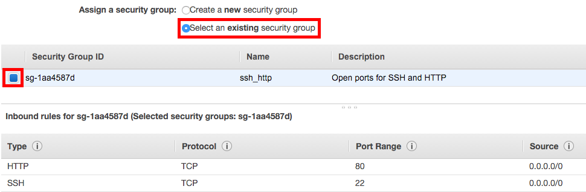
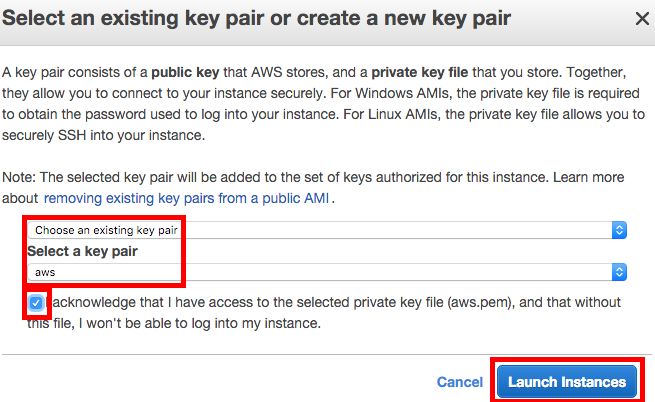
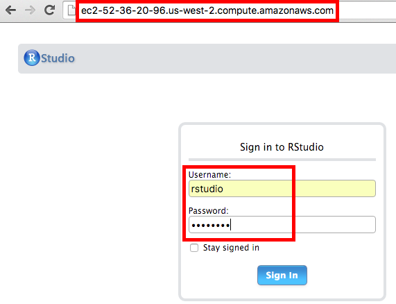
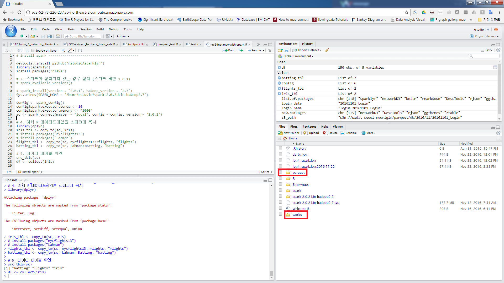

> ## 학습 목표 {.objectives}
>
> * AWS 클라우드 플랫폼 위에 데이터과학 환경을 이해한다.
> * AWS 데이터과학 컴퓨팅을 위한 서버를 생성한다.
> * AWS EC2 인스턴스에 S3 버킷 저장소를 동기화한다.
> * AMI 이미지를 활용 신속하게 검증된 RStudio 서버를 준비하여 데이터 분석을 클라우드 환경에서 실행한다.

## 0. AWS 클라우드 플랫폼 기반 데이터 과학 환경 {#epilog}

컴퓨터를 한대만 사용한다면 굳이 클라우드를 사용할 이유는 없다. 
하지만, 클라우드를 활용하여 데이터 과학 작업을 수행하는 경우 몇가지 기본적인 개념 정립이 필요하다.

다른 클라우드 서비스와 동일하게 아마존에서 AWS를 통해 컴퓨터를 빌려사용한다는 개념으로 다른 사람이 부당하게 혹은 부정하게 사용하면 되지 않기 때문에
컴퓨팅 자원을 사용하는 만큼 이용대금을 지불해야 되기에 우선 보안설정을 통해 본인 인증을 확실히 한다.
그 다음 컴퓨터는 하드웨어와 소프트웨어로 구성되기 때문에 하드웨어를 신경써서 선택한다. 

더 큰 데이터를 더 빠른 시간에 더 많은 분석을 위해서는 물론 경우에 따라 다르겠지만, R의 메모리 제약을 벗어나고자 하는 경우
[Amazon EC2 요금](https://aws.amazon.com/ko/ec2/pricing/)을 확인하고 **메모리 최적화** 컴퓨터를 선택한다. 
`r3.4xlarge`, vCPU(가상 CPU) 16, 메모리 122 GB 사양을 갖는 EC2 컴퓨터를 시간당 $1.596 에 이용가능하고,
`x1.32xlarge`, vCPU(가상 CPU) 128, **메모리 1952 GB (2TB)** 사양을 갖는 EC2 컴퓨터를 시간당 $19.341 에 이용가능하다.

하드웨어 선택이 끝났으면 운영체제, R, RStudio, R 서버, LaTeX 등 R 기반 데이터과학 툴체인을 구축해야 한다. 상당히 시간이 많이 걸리고 힘든 과정을 거치게 되고,
매번 컴퓨터를 바꿀 때마다 이를 반복해야하는 어려움이 상존하다. 
일부 본인 작업과 관련없는 소프트웨어가 설치되어 있기는 하지만, [RStudio AMI](http://www.louisaslett.com/RStudio_AMI/) 이미지를 통해 거의 대부분의 문제점을 해결해 준다.
[Louis Aslett](http://www.louisaslett.com/) 박사님이 유지보수를 담당하여 주시고 꾸준히 최신 R 툴체인을 관리하여 주시고 있다.

하드웨어와 기반 소프트웨어가 설정이 되고 나면 R 툴체인을 활용하여 데이터를 분석하는 누구나 공통적으로 겪게 되는 작업 상당수가 해결되었다.
추가로 두가지 작업이 필요한데, 하나는 R 코드 관리고, 또 다른 하나는 데이터 관리다. 
R 코드 관리를 위해서 **[Git/Github](https://github.com/)**을 통해 시간여행이 가능한 버젼관리와 더불어 협업작업 환경도 설정이 가능하다. 
Git/Github에 대한 자세한 사항은 [소프트웨어 카펜트리 교재](http://statkclee.github.io/git-novice/index-kr.html)를 참고한다.
**[AWS S3](https://aws.amazon.com/ko/s3/)**를 활용하여 [저렴한 비용](https://aws.amazon.com/ko/blogs/aws/aws-storage-update-s3-glacier-price-reductions/)으로 데이터를 저장할 수 있고, 
[s3fs-fuse](https://github.com/s3fs-fuse/s3fs-fuse)를 연결할 경우 마치 로컬 디스크처럼 마운트하여 올려서 활용이 가능하다.

## 1. AWS 클라우드 데이터 과학 서버 [^aws-rstudio-part-1] [^aws-rstudio-part-2] {#why-data-science-server}

[^aws-rstudio-part-1]: [RStudio in the Cloud I - Amazon Web Services](http://strimas.com/r/rstudio-cloud-1/)
[^aws-rstudio-part-2]: [RStudio in the Cloud II - Syncing Code & Data with AWS](http://strimas.com/r/rstudio-cloud-2/)

[아마존 웹서비스(Amazon Web Services, AWS)](http://aws.amazon.com/)는 다양한 컴퓨팅 자원을 클라우드 인터넷을 통해 제공하고 있다.
데이터 과학을 위해 필요한 컴퓨팅 자원을 사용한만큼 비용을 지불하고 서비스를 받을 수 있다.
고가 PC 혹은 노트북을 사용해서 초기 부담을 많이 부담하고 나서 거의 전기료만 지불하고 데이터 과학을 수행하던 것과 비교하여 
꼭 필요한 부분을 정확히 이해하지 않고 AWS 클라우드 서비스를 사용하는 경우 낭패를 볼 수도 있으니, 사전에 면밀히 혹은 충분한 사전 학습을 하고서
활용하는 것을 권장한다. 

### 1.1. 왜 AWS 클라우드 환경을 사용해야 하나. {#aws-cloud}

AWS 혹은 IBM 소프트레이어, MS 애져 클라우드 서비스, 구글 클라우드를 사용해서도 대동소이하다. 즉, 클라우드에 RStudio를 올려 사용할 경우 다음과 같은 
좋은 점을 기대해도 좋다.

1. **장소에 구애받지 않고 데이터 과학 작업 수행:** 인터넷에 연결만 된다고 하면 AWS 클라우드에 가상 컴퓨터에 RStudio 서버를 설치하여 언제든 장소에 구애받지 않고
자유로이 데이터 과학 분석작업을 수행할 수 있다.
1. **컴퓨팅 자원:** 데이터 과학을 수행할 경우 컴퓨팅 자원을 특정 모형, 예를 들어 `Random Forest`를 규모가 있는 데이터에 적용할 경우 상당한 컴퓨팅 자원이 소요된다.
이런 경우 멀티코어 EC2 가상 컴퓨터를 주문하여 사용하고 나서 컴퓨터를 종료시키게 되면 사용한 시간만큼만 비용을 지불하게 된다. 이런 경우 두가지 장점이 있는데,
아주 고성능 고가의 컴퓨터를 사용한 측면과 더불어, 더이상 무거운 하드웨어를 관리하지 않아도 된다는 편리성이 있고, 특히 아주 저렴하고 편리하게 대여할 수 있다는 점이 
상당한 매력이다. 경우에 따라서는 빅데이터를 빠르게 병렬, 분산처리를 수행하는 경우 다른 유형의 컴퓨터 필요할 수 있다. 따라서 필요에 따라 작업성격에 맞추어 
컴퓨팅 자원을 잘 활용할 수 있다는 점이 클라우드에 RStudio를 올려 사용하는 매력이다.

## 2. EC2 인스턴스(가상 컴퓨터) 설치 {#ec2-instance}

AWS 클라우드에 EC2 가상컴퓨터를 생성하는 과정은 다음과 같이 3단계로 구분된다.

- [아마존 웹서비스(Amazon Web Services, AWS)](http://aws.amazon.com/) 계정 생성과 신용카드 등록.
- 사전 준비과정으로 가상컴퓨터를 배포할 지역(region) 선정, 보안그룹 생성, SSH 인증키 생성.
- EC2 가상컴퓨터 사양선정: 가상컴퓨터 하드웨어 사양 선정, 운영체제와 데이터과학 소프트웨어는 AMI RStudio 이미지로 대체.
- 컴퓨터 접속: 직접 `ssh` 로그인 혹은 웹브라우져 RStudio 서버 접속.

### 2.1. 지역(Region) 선택. {#ec2-region}

[AWS 콘솔](http://console.aws.amazon.com)에서 로그인한 후에 **Compute** 아래 **EC2** 아이콘을 클릭한다.
가상컴퓨터를 설치할 지역(Region)을 선정한다. 지역은 아마존 실제 컴퓨터 클러스터가 위치한 지역으로 
어느 지역이나 가능하지만 물리적인 한계를 고려하여 실제 가상컴퓨터를 실행시킬 수 있는 지역을 선정한다.
한국에서는 **Asia Pacific (Seoul)**을 선정한다.

### 2.2. 보안 그룹(Security Group) 설정 {#ec2-security}

[보안 그룹(Security Group)](http://docs.aws.amazon.com/AWSEC2/latest/UserGuide/using-network-security.html)은 
**가상 방화벽(Virtual Firewalls)** 역할을 하여 AWS 인스턴스(가상컴퓨터)에 대한 원격제어를 수행한다.
가상 컴퓨터에 접근이 허용된 IP 대역과 가능한 서비스(SSH, HTTP) 등을 명세한다.
데이터 과학을 위해서는 가상컴퓨터에 SSH 접근과 RStudio 서버를 위한 HTTP 접근만 허용되면 된다.

1. Type: **SSH**, Source: **Anywhere** 를 설정한다.
1. Type: **HTTP**, Source: **Anywhere** 를 설정한다.

주의할 점은 `Source`에 임의 IP 주소 범위를 허용했다. 만약 보안에 좀더 신경을 쓴다면 특정 IP 주소로 접속을 제한하는 것도 가능하다.

### 2.3. SSH 인증키 {#ec2-ssh}

AWS 가상컴퓨터에 접속하는데 비밀번호 대신에 [인증키(Key pair)](https://docs.aws.amazon.com/AWSEC2/latest/UserGuide/ec2-key-pairs.html?console_help=true)를 
사용해서 로그인해야만 된다. **인증키(Key pair)**는 공개키(public key)와 비밀키(private key)로 구성되는데 공개키로 가상컴퓨터를 걸어잠구고,
비밀키를 통해 가상컴퓨터를 풀어 로그인하는 구조를 갖게 된다. 따라서, 비밀키를 잃어버리게 되는 경우 가상컴퓨터에 로그인을 할 수 없게 되고,
비밀키를 다른 누군가 갖게 되면 비밀키를 갖는 누구나 가상컴퓨터에 접속할 수 있는 권한을 갖게 된다.

EC2 가상컴퓨터에 대한 인증키를 생성시키려면, 좌측 패널에 **Key Pairs**를 선택하고 나서, **Create key Pair** 버튼을 생성한다.
`.pem` 확장자를 갖는 파일을 다운로드하게 되는데 이것이 가상컴퓨터에 걸린 자물쇠(공개키)를 풀 수 있는 열쇠(개인키)가 된다. 
따라서 이 개인키를 안전한 곳에 잘 보관해야만 된다.

### 2.4. 가상컴퓨터(인스턴스) 생성 {#ec2-virtual-instance-creation} 

EC2 가상컴퓨터를 생성하려면, 좌측 패널에 **Instance** 버튼을 클릭하고 나서, **Launch Instance** 버튼을 클릭한다.
용산이나 인터넷 쇼핑몰에서 컴퓨터를 주문할 경우 하드웨어 사양과 더불어 운영체제, 오피스 등 소프트웨어를 선정해야 한다.
데이터 과학에서 하드웨어 못지않게 중요한 것이 소프트웨어라 **아마존 컴퓨터 이미지(Amazon Machine Images, AMIs)**를 
사용하여 처리하면 별도 번거로운 설정없이도 바로 데이터과학을 위한 가상컴퓨터를 손에 넣을 수 있다.

#### 2.4.1. 아마존 컴퓨터 이미지(Amazon Machine Images, AMIs)

아마존 컴퓨터 이미지(Amazon Machine Images, AMIs)를 사용하면 운영체제부터 특정 컴퓨터 작업에 필요한 모든 소프트웨어가
잘 설치되어 있고, 환경까지 맞춰져 있어 컴퓨터가 망가지더라도 다시 추가 작업없이 활용가능한 장점이 있다.

 [Louis Aslett](http://www.louisaslett.com/RStudio_AMI/)님이 RStudio AMI를 잘 만들어 주셨다. 
 이를 활용하여 우분투부터 RStudio까지 한방에 설치가 가능하다. **Community AMIs** &rarr; `rstudio aslett`을 검색하여 이를 선택한다.

 #### 2.4.2. 가상컴퓨터(인스턴스) 사양선정

 가상 컴퓨터지만 실제 컴퓨터와 마찬가지로 하드웨어 사양을 선정해야 된다. 코어가 40, 메모리가 160GB를 갖는 컴퓨터 생성도 가능하지만,
 무료로 사용가능한 `Free Tier (t2.micro)` 가상컴퓨터를 골라 생성시킨다.

 

#### 2.4.3. 가상컴퓨터 환경설정(추가옵션)

기본 설정 사항은 그대로 두고, `Advanced section`으로 가서 **User Data** 텍스트 상자에 쉘스크립트를 복사해서 넣거나 입력하여 
가상컴퓨터가 생성될 때 필요한 소프트웨어를 설치한다.

#### 2.4.4. 저장장치 추가설치

대용량 저장소 혹은 별도 저장장치가 필요한 경우 선택하여 붙인다. 물론 추가 요금이 발생될 수 있다.

#### 2.4.5. 태그 추가

가상컴퓨터에 태그 이름을 붙여 가독성을 부여한다. 예를 들어 `rstudio-for-data-science`.

#### 2.4.6. 보안그룹(Security Group) 환경설정

지금까지 가상컴퓨터를 AWS 내부적으로 생성시켰다. 이제 가상컴퓨터를 현실세계와 연결시키는 것이 필요한데,
보안그룹 환경설정을 통해 연결작업을 완성한다. 앞서 생성한 보안그룹을 선택하여 가상컴퓨터에 적용시키면 연결작업은 완료된다.

마지막으로 가상컴퓨터에 로그인하는데 필요한 보안키를 설정하라는 안내가 나오면 앞서 생성한 인증키를 선택한다.

### 2.5. 가상컴퓨터 생성 확인 {#ec2-check}

AWS가 사용자가 주문한 모든 주문사항을 확인하고 이상이 없으면 가상컴퓨터를 생성시키는 작업을 수행한다.
몇분정도 소요가 되고 나면 **EC2 Console** &rarr; **Instances** 화면에 가상컴퓨터(인스턴스)가 녹색불로 바뀌어 **running**으로 표시된 것이 확인이 될 것이다.
가상 컴퓨터 **Public DNS**를 확인하고 이 정보를 활용하여 SSH 로그인 혹은 HTTP를 통해 RStudio 서버로 접속한다.

## 3. EC2 가상컴퓨터 로그인 {#login-ec2}

### 3.1. SSH 로그인 {#login-ec2-ssh}

**Public DNS** 주소를 바탕으로, 앞서 다운로드받은 `.pem` 비밀키를 사용하여 가상컴퓨터에 로그인한다.

~~~{.r}
ssh -i ~/aws.pem ubuntu@ec2-52-36-52-70.us-west-2.compute.amazonaws.com
~~~

만약 다음과 같은 오류가 생기면 다른 사람이 비밀키에 접근해서 조작을 할 수 있기 때문에 `chmod 400 ~/aws.pem` 명령어로 보안설정을 바꿔 놓고 상기 명령어로 다시 접속한다.
`ubuntu`가 사용자 명이 되고, AWS 가상컴퓨터에는 비밀키(`.pem`)를 갖고 로그인한다.

~~~{.r}
@@@@@@@@@@@@@@@@@@@@@@@@@@@@@@@@@@@@@@@@@@@@@@@@@@@@@@@@@@@
@         WARNING: UNPROTECTED PRIVATE KEY FILE!          @
@@@@@@@@@@@@@@@@@@@@@@@@@@@@@@@@@@@@@@@@@@@@@@@@@@@@@@@@@@@
Permissions 0640 for 'aws.pem' are too open.
It is required that your private key files are NOT accessible by others.
This private key will be ignored.
Load key "aws.pem": bad permissions
Permission denied (publickey).
~~~

### 3.2. RStudio 로그인 {#ec2-rstudio-login}

앞서 설치된 AWS AMI에는 [RStudio](https://www.rstudio.com/products/rstudio/)가 내장되어 있다. 또한 RStudio 서버 사용자로 `rstudio`가 
생성되어 있어서 비밀번호만 변경하면 된다. 혹은 RStudio 서버 IDE가 열리면 `RStudioAMI::passwd()` 명령어로 비밀번호를 변경한다.

~~~{.r}
sudo passwd rstudio
~~~

**Public DNS** 주소를 웹브라우져에 입력하고 엔터를 치면 로그인 인증화면이 나오는데 기본설정으로 사용자명: `rstudio`, 비밀번호: `rstudio`가 
설정되어 있고, **Public DNS** 주소를 통해 접속이 되지 않는 경우 포트번호를 `:8787`을 붙여 RStudio 서버에 접속한다.

## 4. S3 버킷 EC2 인스턴스 연결 {#connect-ec2-s3}

데이터가 저장된 S3 버킷과 EC2 인스턴스를 연결하는데 몇가지 설정 작업이 선행되어야 한다.

### 4.1. AWS CLI 설치 {#install-aws-cli}

아마존 리눅스를 사용해서 EC2 인스턴스를 생성하게 되는 경우 기본으로 `aws cli`가 설치되어 있지만, 
우분투가 설치된 RStudio AMI 이미지의 경우 `python-pip` 팩키지를 통해 `aws cli`를 설치한다.

~~~{.r}
$ sudo apt-get update
$ sudo apt-get install -y python-pip
$ sudo pip install awscli
~~~

### 4.2. `s3fs-fuse` 설치 [^s3fs-fuse] {#install-s3fs-fuse}

[^s3fs-fuse]: [FUSE-based file system backed by Amazon S3](https://github.com/s3fs-fuse/s3fs-fuse)

S3 버킷과 리눅스 EC2 인스턴스를 동기화하는데 `s3fs-fuse`를 사용한다.
설치과정은 연관된 소프트웨어를 먼저 설치하고 나서, `GitHub`에서 `s3fs-fuse`를 복제하여 가져온 다음 
`make install` 명령어를 통해 설치하는 단계를 거친다.

~~~{.r}
sudo apt-get install build-essential git libfuse-dev libcurl4-openssl-dev libxml2-dev mime-support automake libtool 
sudo apt-get install pkg-config libssl-dev 
git clone https://github.com/s3fs-fuse/s3fs-fuse
cd s3fs-fuse/
./autogen.sh
./configure --prefix=/usr --with-openssl
make
sudo make install
~~~

### 4.3. RStudio 서버 설치된 EC2 인스턴스 동기화 [^rstudio-ec2-s3fs] {#s3fs-sync}

[^rstudio-ec2-s3fs]: [s3fsを使ってEC2からS3をマウントしたときにうまくいかなくて調べた事まとめ](http://dev.classmethod.jp/cloud/aws/s3fs-ec2-mount-s3/) 

RStudio 서버가 설치된 EC2 인스턴스를 S3 버킷과 동기화하는데 환경설정을 하고 나서 동기화 명령어를 실행한다.

#### 4.3.1. `s3fs-fuse` AWS S3 버킷 접속 인증 설정

`aws cli`를 설치했으면, `aws configure` 명령어를 통해 환경설정을 한다.
IAM &rarr; Users &rarr; Security Credentials &rarr; Create access key 를 통해 `Access key ID`, 
`AWS Secret Access Key`를 입력하고 지역(region)을 설정한다: 서울(ap-northeast-2), 도쿄(ap-northeast-1) 등.
출력형식은 원하는 것으로 설정한다. 

- AWS Access Key ID [None]: 접속키
- AWS Secret Access Key [None]: 비밀키
- Default region name [None]: ap-northeast-2
- Default output format [None]: JSON

환경변수 설정을 통해 AWS S3 버킷 접속 인증을 하는 방법은 다음과 같다.

~~~{.r}
$ aws configure
AWS Access Key ID [None]: AXXXXXXXXXXXX
AWS Secret Access Key [None]: oW7XXXXXXXXXXXXXXXXXXXXXXXXXXX
Default region name [None]: ap-northeast-2
Default output format [None]: 
~~~

설정된 내용이 `~/.aws/credentials` 파일에 저장된 내용과 동일한지 확인한다.

~~~{.r}
~/.aws/credentials
aws_access_key_id = AXXXXXXXXXXXX
aws_secret_access_key = oW7XXXXXXXXXXXXXXXXXXXXXXXXXXX
~~~

#### 4.3.2. `s3fs-fuse` 접속 인증 설정

사용자 `/home/rstudio/` 디렉토리에 `.passwd-s3fs` 파일에 접속키와 비밀키를 저장하는 방법은 다음과 같다.
여기서 `~/works` 디렉토리에 S3 버킷과 동기화된다.

~~~{.r}
echo -e "AXXXXXXXXXXXX:oW7XXXXXXXXXXXXXXXXXXXXXXXXXXX" > ~/.passwd-s3fs
chmod 600 ~/.passwd-s3fs
mkdir ~/works
~~~

### 4.4. `rstudio` 사용자 설정 {#rstudio-user}

AWS S3 버킷에서 사용자명도 함께 검사를 하기 때문에 `uid=`, `gid=`를 확인한다.
`rstudio` 사용자 `uid=`, `gid=`는 **1001** 이라 이를 설정에 반영한다.

~~~{.r}
rstudio@ip-172-XX-XXX-XXX:~$ id rstudio
uid=1001(rstudio) gid=1001(rstudio) groups=1001(rstudio)
~~~

AWS S3 버킷으로 생성한 `s3-bucket-name`의 모든 하위 디렉토리와 앞서 생성시킨 
EC2 인스턴스 `works` 디텍토리를 `s3fs` 명령어를 통해 동기화시키고, 
`-o rw, allow_other` 인자값을 넘겨 읽기쓰기와 더불어 rstudio 사용자에게도 권한을 부여한다.

> ### `allow_other` 설정 적용  [^allow-other] {.callout}
>
> `rstudio` 계정으로 s3fs-fuse를 통해 S3 버킷에 접근하기 위해서는 
> `allow_other` 설정을 인자로 넘겨야 하는데 이 경우에
> `/etc/fuse.conf` 파일을 `nano` 편집기로 열어서, **user_allow_other** 주석을 없애서 활성화 시키면 된다.

[^allow-other]: [Allowing permission using S3FS bucket directory for other users](https://stackoverflow.com/questions/17544139/allowing-permission-using-s3fs-bucket-directory-for-other-users)

~~~{.r}
$ pwd
/home/rstudio/
$ s3fs s3-bucket-name works -o rw, allow_other, uid=1001, gid=1001
~~~

> ### `uid=1001` 오류가 나고 디렉토리 접근이 되지 않는 경우  [^allow-other] {.callout}
>
> `s3fs` 명령어를 통해 버킷과 rstudio 계정 작업 디렉토리를 연결시켰으나, 
> 
> `d---------. 1 root root 0 Jan 8 2017 works` 처럼
> 
> RStudio 서버에서 디렉토리에 읽거나 쓸 수 없는 경우 `-oumask=0022` 인자를 넣어준다.
>  
> 
> ~~~{.r}
> $ s3fs s3-bucket-name ~/works -o allow_other -oumask=0022
> ~~~

### 4.5. 기타 {#s3fs-etc}

S3 버킷과 연결된 디렉토리를 해제할 경우 `sudo fusermount -u` 명령어를 사용한다.

~~~{.r}
 sudo fusermount -u /works
~~~

운영체제 부팅시 S3버킷을 자동으로 연결시킬 경우 `/etc/fstab`에 환경을 설정한다.

~~~{.r}
s3fs#s3-bucket-name /works fuse auto,rw,allow_other,uid=1001,gid=1001 0 0
~~~
