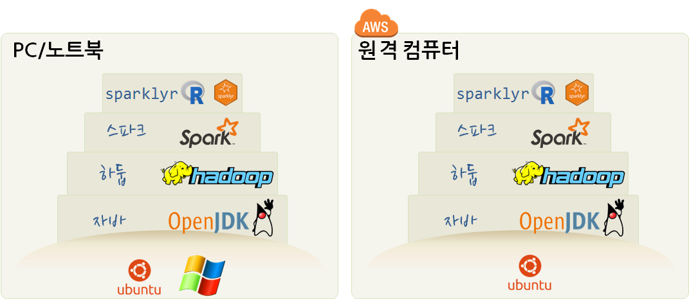
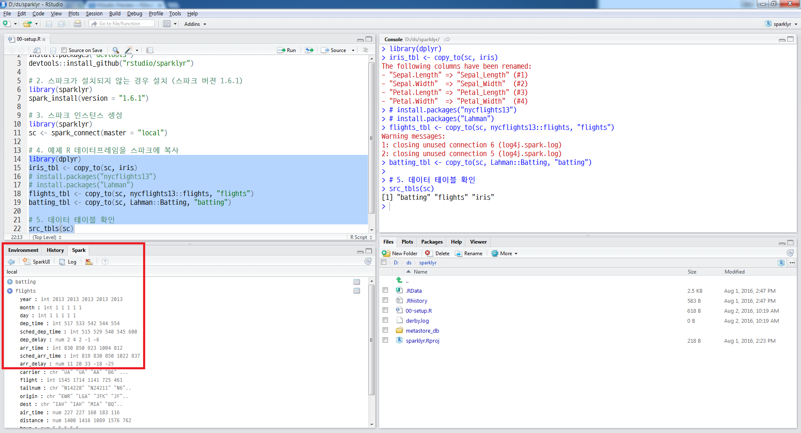
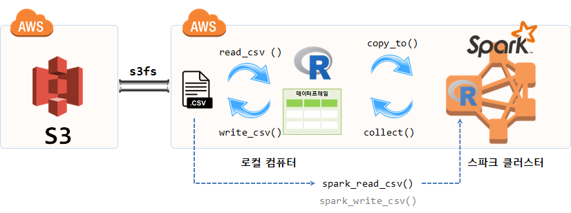

```{r, include=FALSE}
source("tools/chunk-options.R")
```

> ## 학습 목표 {.objectives}
>
> * 로컬 컴퓨터 윈도우, 리눅스, 맥 환경에서 `sparklyr` 팩키지를 설치한다.
> * 로컬 머신의 경우 RStudio 프리뷰 버젼을 설치에 적극활용한다.
> * AWS 클라우드 EC2 인스턴스에 스파크를 설치한다.



## 1. 로컬 컴퓨터 스파크 설치 {#install-spark}

### 1.1. `sparklyr` 설치 (윈도우) [^sparklyr-windows] {#install-spark-windows}

[^sparklyr-windows]: [Running Apache Spark with sparklyr and R in Windows](http://yokekeong.com/running-apache-spark-with-sparklyr-and-r-in-windows/)

`sparklyr`는 `dplyr`을 스파크 환경에서 사용할 수 있도록 구현된 팩키지다.

> ### 윈도우 사전 준비 {.callout}
> 
> 윈도우 환경에서 `sparklyr`을 설치하려면 [Microsoft Visual C++ 2010 SP1 Redistributable Package](https://www.microsoft.com/en-us/download/details.aspx?id=13523)을 다운로드받아 > 설치한다.

1. [Download Apache Spark](http://spark.apache.org/downloads.html) 사이트를 방문하여 스파크-하둡을 다운로드 한다.
    * 스파크 버젼 1.6.2. : `spark-1.6.2-bin-hadoop2.6.tgz` 버전을 다운로드 받아 설치한다.
    * 스파크 버젼 2.0.0. : `spark-2.0.0-bin-hadoop2.7.tgz` 버전은 설치가 안되는 경우가 있다.
1. 다운로드 받은 파일의 압축을 풀게 되면 `spark-1.6.2-bin-hadoop2.6` 디렉토리가 생성된다.
    * 작업하기 편한 장소로 압축 푼 스파크-하둡 디렉토리를 이동시킨다. 예를 들어, `C:/spark-1.6.2-bin-hadoop2.6`
1. RStudio에서 `sparklyr` 팩키지를 설치한다.

```{r windows-install, eval=FALSE}
# 0. 설정환경 확인
## JAVA 설정
Sys.getenv("JAVA_HOME")
## HADOOP 설정
Sys.getenv("HADOOP_HOME")
Sys.setenv(HADOOP_HOME = "C:/Users/<사용자명>/AppData/Local/rstudio/spark/Cache/spark-2.1.0-bin-hadoop2.7")
## SPARK 설정
Sys.getenv("SPARK_HOME")
spark_home_dir()

## 설치된 SPARK 버젼확인 설정
spark_installed_versions()
# spark hadoop                       dir
# 1 2.1.0    2.7 spark-2.1.0-bin-hadoop2.7

# 1. sparklyr 설치
devtools::install_github("rstudio/sparklyr")
library(sparklyr)

# 2. 스파크 클러스터 로컬에 설치 
# 가능한 설정 확인
spark_available_versions()
sc <- spark_connect(master="local")

# 3. iris 데이터셋 작업 준비 완료
library(dplyr)
iris_tbl <- copy_to(sc, iris)
# The following columns have been renamed:
# - "Sepal.Length" => "Sepal_Length" (#1)
# - "Sepal.Width"  => "Sepal_Width"  (#2)
# - "Petal.Length" => "Petal_Length" (#3)
# - "Petal.Width"  => "Petal_Width"  (#4)
src_tbls(sc)
# [1] "iris"
```

### 1.2. `sparklyr` 설치 유닉스 계열 [^sparklyr] [^install-jdk-on-mac-osx] {#install-spark-unix}

[^sparklyr]: [sparklyr — R interface for Apache Spark](http://spark.rstudio.com/)

유닉스 계열(맥, 리눅스)에서 `sparklyr` 설치는 더욱 쉽다. [sparklyr - R interface for Apache Spark](http://spark.rstudio.com/) 안내지침에 따라 명령어를 타이핑하거나 복사하여 붙여 넣으면 된다.

[^install-jdk-on-mac-osx]: [MAC OS X 에 JDK 설치하는 방법](http://ishappy.tistory.com/entry/MAC-OS-X-에-JDK-설치하는-방법)

> ### 맥 사전 준비 {.callout}
> 
> 맥 환경에서 `sparklyr`을 설치하려면 자바를 설치해야 하고, `sparklyr`을 실행할 때 발생하는 자바 오류도 잡아줘야 된다.

1. 자바 JDK 설치는 `.dmg` 파일을 제공해 주기 때문에 [오라클 자바 다운로드](http://www.oracle.com/technetwork/java/javase/downloads/index.html?ssSourceSiteId=otnjp) 사이트에서 
라이선스 동의를 하고 가장 최신 [jdk-8u111-macosx-x64.dmg](http://download.oracle.com/otn-pub/java/jdk/8u111-b14/jdk-8u111-macosx-x64.dmg) 파일을 다운로드 받아 설치한다.
1. 터미널을 열고 `java -version` 명령어로 버젼을 확인힌다.
1. `cd /Library/Java/JavaVirtualMachines/` 명령어를 통해 JDK가 설치된 디렉토리를 확인한다.
1. `cd jdk1.8.0_111.jdk/Contents/Home/` 명령어로 자바 홈(JAVA_HOME)까지 들어가서 경로를 확인한다.
	- JAVA_HOME 경로를 확인하고 나면 환경변수로 설정을 할 수 있다.
	- `pwd` 명령어로 `/Library/Java/JavaVirtualMachines/jdk1.8.0_111.jdk/Contents/Home` 경로명을 확인한다.
1. `nano ~/.bash_profile` 명령어를 통해 나노 편집기에 `JAVA_HOME`, `JAVA_CPPFLAGS` 환경설정을 하단에 붙여 넣는다.
    - `export JAVA_HOME="/Library/Java/JavaVirtualMachines/jdk1.8.0_111.jdk/Contents/Home"`
    - `export JAVA_CPPFLAGS="/Library/Java/JavaVirtualMachines/jdk1.8.0_111.jdk/include"`
1. `source ~/.bash_profile` 명령어를 통해 변경사항을 바로 적용시킨다.

``` {r install-mac, eval=FALSE}
$ java -version
java version "1.8.0_111"
Java(TM) SE Runtime Environment (build 1.8.0_111-b14)
Java HotSpot(TM) 64-Bit Server VM (build 25.111-b14, mixed mode)
$ cd /Library/Java/JavaVirtualMachines/
JavaVirtualMachines $ ls
jdk1.8.0_111.jdk
JavaVirtualMachines $ cd jdk1.8.0_111.jdk/Contents/Home/
Home $ pwd
/Library/Java/JavaVirtualMachines/jdk1.8.0_111.jdk/Contents/Home
Home $ nano ~/.bash_profile
Home $ source ~/.bash_profile
```

R로 통계분석을 할 때 `JAVA_HOME`을 설정했지만, 오류가 생기는 경우가 있다. [^konlp-error] 이런 경우 
`/Library/Java/JavaVirtualMachines/jdk1.8.0_111.jdk/Contents` 디렉토리 `Info.plist` 파일의 내용을 다음과 같이 변경한다.
자세한 사항은 [Java SE 8 on Mac OS X](https://oliverdowling.com.au/2014/03/28/java-se-8-on-mac-os-x/)을 참조한다.

[^konlp-error]: [KoNLP에서 아래와 같은 에러가 나올 경우 대처 방법](http://freesearch.pe.kr/archives/3081)

``` {r java-error, eval=FALSE}
Home $ pwd
/Library/Java/JavaVirtualMachines/jdk1.8.0_111.jdk/Contents
Contents $ nano Info.plist

# 변경전 
<key>JVMCapabilities</key>
<array>
    <string>CommandLine</string>
</array>
-------------------------------
# 변경후 
<key>JVMCapabilities</key>
<array>
    <string>CommandLine</string>
    <string>JNI</string>
    <string>BundledApp</string>
</array>
```

`sparklyr` 팩키지 설치과정은 윈도우 설치과정과 대동소이하다.

``` {r spark, eval=FALSE}
# 1. sparklyr 팩키지 설치
install.packages("devtools")
devtools::install_github("rstudio/sparklyr")

# 2. 스파크가 설치되지 않는 경우 설치 (스파크 버젼 1.6.1)
library(sparklyr)
spark_install(version = "1.6.1")

# 3. 스파크 인스턴스 생성
library(sparklyr)
sc <- spark_connect(master = "local")

# 4. 예제 R 데이터프레임을 스파크에 복사
library(dplyr)
iris_tbl <- copy_to(sc, iris)
install.packages("nycflights13")
install.packages("Lahman")
flights_tbl <- copy_to(sc, nycflights13::flights, "flights")
batting_tbl <- copy_to(sc, Lahman::Batting, "batting")

# 5. 데이터 테이블 확인
src_tbls(sc)
# [1] "batting" "flights" "iris"  
```

### 1.3. `sparklyr` RStudio 활용 {#sparklyr-rstudio}

`sparklyr` RStudio 에서 편한게 사용할 수 있도록 다양한 기능을 제공하고 있다. 이를 위해서 [RStudio v0.99.1273 Preview](https://www.rstudio.com/products/rstudio/download/preview/) 버젼을 다운로드해서 설치한다. **Spark** 탭이 별도로 생성되고 이를 통해 스파크에 대한 전반적인 상황을 확인할 수 있다.




## 2. AWS 클라우드 스파크 설치 [^ec2-standalone-ec2] {#aws-ec2-spark}

[^ec2-standalone-ec2]: [Using Spark Standalone Mode and S3](https://spark.rstudio.com/example-s3.html)

### 2.1. 우분투 자바 설치 [^aws-ubuntu-java] {#aws-ec2-java}

[^aws-ubuntu-java]: [How To Install Java with Apt-Get on Ubuntu 16.04](https://www.digitalocean.com/community/tutorials/how-to-install-java-with-apt-get-on-ubuntu-16-04)

준비한 AWS EC2 인스턴스 `ssh`를 통해 `ubuntu` 계정으로 로그인한후 자바를 설치한다. 
`JDK`는 `JRE`를 포함하고 있어서 `sudo apt-get install default-jdk` 를 통해 함께 설치하는 것을 권장한다.
그런 경우는 없겠지만, 여러버젼의 자바가 설치된 경우 `sudo update-alternatives --config java` 명령어를 통해 다양한 자바 버젼을 관리한다.

``` {r eval=FALSE}
$ sudo apt-get update
$ # sudo apt-get install default-jre 
$ sudo apt-get install default-jdk # JDK는 JRE를 포함 
```

다음으로 `JAVA_HOME`을 설정하는데 `sudo update-alternatives --config java` 명령어로 나온 자바홈 경로를 복사해서 `sudo nano /etc/environment` 에 붙여넣는다.
`JAVA_HOME="/usr/lib/jvm/java-8-openjdk-amd64"` 마지막으로 `source /etc/environment` 명령어로 변경사항을 적용시킨다.

``` {r eval=FALSE}
$ sudo update-alternatives --config java
There is only one alternative in link group java (providing /usr/bin/java): /usr/lib/jvm/java-8-openjdk-amd64/jre/bin/java
Nothing to configure.
$ sudo nano /etc/environment
$ source /etc/environment
$ echo $JAVA_HOME
/usr/lib/jvm/java-8-openjdk-amd64/jre/bin/java
```

> ### JAVA_HOME 찾는 방법 [^java-home] {.callout}
> 
> > Error in get_java(throws = TRUE) : 
> >  Java is required to connect to Spark. JAVA_HOME is set but does not point to a valid version. 
> >  Please fix JAVA_HOME or reinstall from: https://www.java.com/en/
> 
> 상기와 같이 JAVA_HOME 관련 오류가 발생되는 경우 조치 방법은 다음과 같다.
> 
> 1. `find /usr/lib/jvm/java-1.x.x-openjdk`
> 1. `sudo nano /etc/environment`
> 1. JAVA_HOME="/usr/lib/jvm/java-8-openjdk-amd64" 추가
> 1. source /etc/environment

[^java-home]: [How to set JAVA_HOME in Linux for all users](https://stackoverflow.com/questions/24641536/how-to-set-java-home-in-linux-for-all-users)

### 2.2. 스파크 설치 {#aws-ec2-spark-install}

[Download Apache Spark™](https://spark.apache.org/downloads.html) 사이트를 방문하여 아파치 스파크를 다운로드 한다. 물론 스파크내부에 하둡도 같이 포함되어 있는 것을 다운로드 받으면 편리하다.
`tar xvf` 명령어로 압축을 풀고 나서 스파크가 설치된 환경변수 디렉토리를 기억해 둔다. 

``` {r eval=FALSE}
$ wget http://d3kbcqa49mib13.cloudfront.net/spark-2.1.0-bin-hadoop2.7.tgz
$ tar xvf spark-2.1.0-bin-hadoop2.7.tgz
$ cd spark-2.1.0-bin-hadoop2.7
$ pwd
/home/rstudio/spark-2.1.0-bin-hadoop2.7
```

### 2.3. RStudio 스파크 환경설정 {#aws-ec2-sparklyr}

`SPARK_HOME =` 디렉토리 설정을 맞춰주면 스파크를 `sparklyr` 명령어를 통해 활용이 가능하다.
[EC2 인스턴스 사양](https://aws.amazon.com/ko/ec2/pricing/on-demand/)에 맞춰 스파크 클러스터 환경을 `spark_config()`에 맞춰 설정한다. 

- 하드웨어 사양: M4 Double Extra Large [^ec2-instance-info]
    - m4.2xlarge  
    - 메모리: 32.0 GiB
    - CPU: 8 vCPUs 
    - 가격(On Demand): $0.492 hourly   
    - 가격(Reserved): $0.294 hourly

[^ec2-instance-info]: [EC2Instances.info - Easy Amazon EC2 Instance Comparison](http://www.ec2instances.info/)

- 환경설정 시 유용한 명령어
    - spark_home_dir()
    - spark_installed_versions()

`org.apache.hadoop:hadoop-aws:2.7.3` 팩키지는 AWS S3 연결에 필요한 팩키지가 된다.
`nycflights13`, `Lahman` 팩키지 R 데이터프레임을 스파크 클러스터에 넣어 스파크에서 데이터를 분석한다. 
데이터프레임을 스파크 클러스터에 던질 때 사용하는 `copy_to()` 명령어를 사용하여 스파크 분산 환경에서 데이터를 처리한다.
정반대로 스파크 클러스터에서 꺼내 데이터프레임에서 분석하는 것이 `collect()` 명령어를 사용하는 것이다.

``` {r install-sparklyr, eval=FALSE}
# 1. 환경설정 ------------------------------------
library(sparklyr)
library(tidyverse)
# install.packages("nycflights13")
# install.packages("Lahman")

Sys.setenv(SPARK_HOME = '/home/rstudio/spark-2.1.0-bin-hadoop2.7')
Sys.setenv(JAVA_HOME = '/usr/lib/jvm/java-8-openjdk-amd64')

config <- spark_config()
config$sparklyr.defaultPackages <- "org.apache.hadoop:hadoop-aws:2.7.3"
config$sparklyr.cores.local <- 6
config$spark.driver.memory <- "30G"

sc <- spark_connect(master = "local", config = config, spark_home=spark_home_dir(version = "2.1.0"))

# 2. 예제 R 데이터프레임을 스파크에 복사 ------------

iris_tbl <- copy_to(sc, iris)
flights_tbl <- copy_to(sc, nycflights13::flights, "flights")
batting_tbl <- copy_to(sc, Lahman::Batting, "batting")

# 3. 데이터 테이블 확인 -----------------------------
src_tbls(sc)
df <- collect(iris)
```

### 2.4. `.csv` 파일 스파크 분석 {#aws-csv-sparklyr}

AWS S3 저장소에 데이터를 저장해서 활용하고, 스파크 클러스터를 별도 EC2 인스턴스로 묶어 
데이터를 분석하는 것이 많이 활용되는 패턴 중 하다.
특히 S3를 `s3fs`로 EC2와 동기화(sync)한 경우 마치 로컬 파일처럼 접근해서 데이터를 분석하는 것도 가능하다.



``` {r read-csv-with-sparklyr, eval=FALSE}
# 4. 로컬 CSV 파일 불러오기 -------------------------

flights <- spark_read_csv(sc, "flights_spark", 
                          path =  "~/works/GF/spark/data/", 
                          memory = TRUE, 
                          columns = list(
                            Year = "character",
                            Month = "character",
                            DayofMonth = "character",
                            DayOfWeek = "character",
                            DepTime = "character",
                            CRSDepTime = "character",
                            ArrTime = "character",
                            CRSArrTime = "character",
                            UniqueCarrier = "character",
                            FlightNum = "character",
                            TailNum = "character",
                            ActualElapsedTime = "character",
                            CRSElapsedTime = "character",
                            AirTime = "character",
                            ArrDelay = "character",
                            DepDelay = "character",
                            Origin = "character",
                            Dest = "character",
                            Distance = "character",
                            TaxiIn = "character",
                            TaxiOut = "character",
                            Cancelled = "character",
                            CancellationCode = "character",
                            Diverted = "character",
                            CarrierDelay = "character",
                            WeatherDelay = "character",
                            NASDelay = "character",
                            SecurityDelay = "character",
                            LateAircraftDelay = "character"), 
                          infer_schema = FALSE)

tidy_flights <- tbl(sc, "flights_spark") %>%
  mutate(ArrDelay = as.integer(ArrDelay),
         DepDelay = as.integer(DepDelay),
         Distance = as.integer(Distance)) %>%
  filter(!is.na(ArrDelay)) %>%
  select(DepDelay, ArrDelay, Distance) %>%
  sdf_register("tidy_spark")

tbl_cache(sc, "tidy_spark")

tbl(sc, "tidy_spark") %>% tally

simple_model <- tidy_flights %>%
  ml_linear_regression(DepDelay~.)

summary(simple_model)

spark_disconnect(sc)
```


