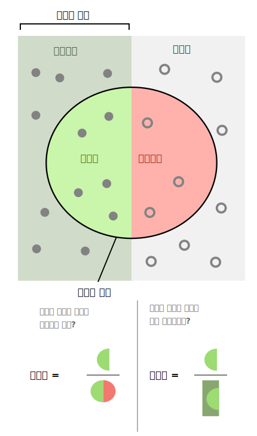
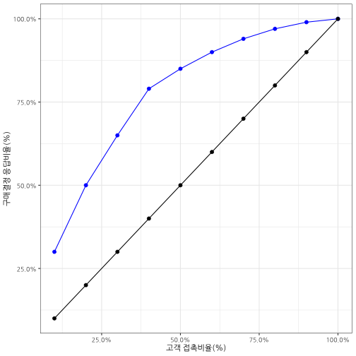
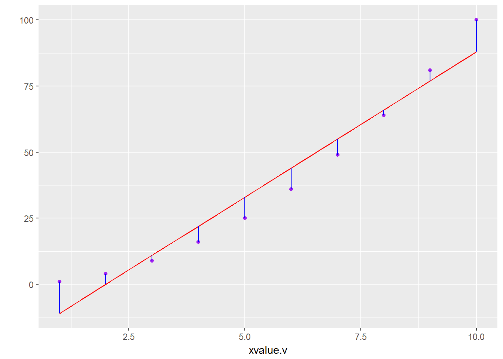

 

# 기계학습 알고리즘 성능평가 [^data-science-live-book] {#algo-performance}

[^data-science-live-book]: [Pablo Casas (July 2018), "Data Science Live Book"](https://livebook.datascienceheroes.com/)

기계학습 알고리즘 성능평가는 데이터를 이용해서 풀려는 문제에 따라 다르다.
기계학습 팩키지로 유명한 `caret` 팩키지도 결국 데어터에 내재된 예측과 분류 문제를 풀려고 제작되었다.
기계학습 알고리듬 성능평가를 이해하고, 범주형, 연속형, 지도학습/비지도학습 알고리즘 성능평가를 R 코드로 구현해본다.

* 분류(Classification) 
* 예측(Prediction)

# 분류(Classification) 성능평가 [^roc-curve-with-r] {#classification-performance}

[^roc-curve-with-r]: [ROC Curve & Area Under Curve (AUC) with R - Application Example](https://www.youtube.com/watch?v=ypO1DPEKYFo)

전자우편을 스팸(spam)이냐 정상햄(ham)이냐를 분류한 기계학습 알고리즘의 성능을 평가할 때 정량화된 측도가 필요하다. 
일견 스팸전자우편을 스팸이라고 분류하고, 정상 전자우편을 정상으로 분류하면 되는 간단한 문제로 보이지만 사실 그렇게 간단한 것은 아니다.
기업부도예측이나, 신용분량, 사기탐지 등을 보면, 정상적인 사례가 99% 이상이고, 사기나 해킹, 신용분량, 부도 등의 사례는 
채 1%가 되지 않는 경우가 허다하다. 통계학 이항 회귀분석 및 검색엔진, 의학정보학 등 다양한 분야에서 이 문제에 관심을 가지고 다뤄왔다.

먼저, 용어정의를 정의하자.

* TP(True Positive) : **참양성**, 통계상 실제 양성인데 검사 결과 양성.
* FP(False Positive) : **거짓양성(1종 오류)**,  통계상 실제로는 음성인데 검사 결과는 양성. 위양성, 거짓 경보(False Alarm).
* FN(False Negative) : **거짓음성(2종 오류)**, 통계상 실제로는 양성인데 검사 결과는 음성
* TN(True Negative) : **참음성**, 통계상 실제 음성인데 검사 결과 음성.

기계학습을 통해 나온 결과를 상기 옹어로 정리한 것이 **오차행렬(confusion matrix)** 이 된다. 2가지 이상되는 분류문제에도 적용될 수 있다. 

|                |                            |    **실제 정답**     |   (Reference)         | 
|----------------|----------------------------|----------------------|-----------------------|
|                |                            | 참(True): Event      | 거짓(False): No Event | 
| **실험 결과**  | 양성(Positive): Event      | TP(True Positive): A | FP(False Positive): B | 
| (Predicted)    | 음성(Negative): No Event   | FN(False Negative): C| TN(True Negative): D  |

 [^wiki-walber]

[^wiki-walber]: [Precision and recall SVG 파일](https://commons.wikimedia.org/wiki/File:Precisionrecall.svg)

범주형 자료를 목적으로 분류하는 기계학습 알고리즘의 경우 정확도, 정밀도, 재현율, 통상적인 추적 모니터링 대상 측도가 된다.

* 정확도(Accuracy): 1 에서 빼면 오분류율이 된다. $$정확도 = \frac{TP+TN}{TP+TN+FP+FN}, 정확도 = \frac{A+D}{A+B+C+D}$$
* 재현율(Recall) 혹은 민감도(Sensitivity): 예를 들어, 환자가 실제 암이 있는데, 양성으로 검진될 확률. 연관된 항목이 얼마나 많이 선택되었는지 측정. 
$$재현율 = \frac{TP}{TP+FN}, 민감도 = \frac{A}{A+C}$$
* 특이성(Specificity): 예를 들어, 환자가 정상인데, 음성으로 검질될 확률. $$특이성 = \frac{TN} {TN+FP}, Specificity = \frac{D}{B+D}$$
* 정밀도(Precision): 선택된 항목이 얼마나 연관성이 있나를 측정,  PPV(positive predictive value)로도 불림. $$정밀도 = \frac{TP}{TP+FP}$$

이를 하나의 숫자로 바꾼것이 $F_1$ 점수($F_1$ Score, $F$-Score, $F$-Measure)로 불리는 것으로 정밀도와 재현율을 조화평균한 것이다.

$$F_1 = \frac{2}{\frac{1}{정밀도}+\frac{1}{재현율}} = 2 \times \frac{정밀도 \times 재현율}{정밀도 + 재현율}$$

## 범주형 예측 모형 평가 {#classification-category-performance}

범주형 예측모형의 성능평가를 위해 도입되는 척도는 다음과 같다.

* 정확도
* 카파($\kappa$) 통계량
* 범주가 두가지인 경우 수신자 조작 특성(ROC, Receiver Operating Characteristic) 곡선

카파($\kappa$) 통계량은 최초 두평가자가 일치하는지에 대한 척도로 개발되었으나, 예측모형에서는 예측모형의 일치여부를 판정하는 통계량으로 사용한다. 

$$\kappa = \frac {O - E}{1- E}$$

- **부츠트랩핑(Bootstrapping)**은 모수를 추정할 때 많이 사용된다.  Bootstrapping is mostly used when estimating a parameter.
- **교차검증(Cross-Validation)**은 서로 다른 예측모형을 선택할 때 선택지가 된다. Cross-Validation is the choice when choosing among different predictive models.

- $\text{오차(error) = 편이(bias) + 분산(variance)}$ [^random-forest-gbm]
    - **랜덤 포리스트(Random Forest)**는 분산을 줄이는데 초점을 둔다.
    - **Gradient boosting machine**은 편이(Bias)에 초점을 둔다. 

부스팅(Boosting)은 순차적(sequential)으로 나무를 뻗어가는 반면에 RF는 병렬(parallel)로 뻗어나간다.

[^random-forest-gbm]: [“Gradient boosting machine vs random forest” (stats.stackexchange.com 2015)](https://stats.stackexchange.com/questions/173390/gradient-boosting-tree-vs-random-forest)

## ROC 곡선, PR 그래프 {#classification-performance-roc}

[ROC 곡선](https://en.wikipedia.org/wiki/Receiver_operating_characteristic)은 오인식률(1종오류)과 
오거부률(2종오류) 간의 상충관계를 시각적으로 나타낸 그래프로, 정밀도(Precision)와 재현율(Recall)을 유사하게 표현한 것이 PR 그래프로 시각화를 하고, 
아래 면적을 측정하여 성능을 평가하기도 한다.

## 독일신용평가 사례 {#classification-performance-german}

`caret` 팩키지에 포함된 `data("GermanCredit")` 신용평가 데이터를 통해 좀더 직접적인 사례를 확인해 보자.

1. 데이터 준비 단계
    * 훈련데이터와 검증데이터 분리: 70% 훈련데이터, 30% 검증데이터
1. 이항회귀모형 적합
    * 이항회귀모형 변수 설정: 종속변수 Class, 독립변수 그외.
    * 이항회귀모형 적합
1. 신용불량확률 예측
    * 훈련데이터 신용불량확률예측, 검증데이터 신용불량확률예측
1. 모형 성능평가
    * `ggplot` 통한 신용불량고객과 정상고객 확률분포 도식화
    * 컷오프 50% 설정 시 모형이 갖는 함의 파악

~~~{.r}
# 0. 환경설정 ------
library(tidyverse)
library(caret)
~~~

~~~{.output}
Error in library(caret): there is no package called 'caret'

~~~

~~~{.r}
library(funModeling)
~~~

~~~{.output}
Error in library(funModeling): there is no package called 'funModeling'

~~~

~~~{.r}
library(extrafont)
loadfonts()

# 1. 데이터 ------
## 1.1. 데이터 가져오기 
data(GermanCredit)

gc_df <- GermanCredit %>% tbl_df %>% 
    mutate(Class = 2 - as.integer(Class))
~~~

~~~{.output}
Error in eval(lhs, parent, parent): 객체 'GermanCredit'를 찾을 수 없습니다

~~~

~~~{.r}
## 1.2. 훈련데이터와 검증데이터 분리: 70% 훈련데이터, 30% 검증데이터
ind <- createDataPartition(gc_df$Class, p=0.7, list=FALSE)
~~~

~~~{.output}
Error in createDataPartition(gc_df$Class, p = 0.7, list = FALSE): 함수 "createDataPartition"를 찾을 수 없습니다

~~~

~~~{.r}
train_df <- gc_df[ind,]
~~~

~~~{.output}
Error in eval(expr, envir, enclos): 객체 'gc_df'를 찾을 수 없습니다

~~~

~~~{.r}
test_df <- gc_df[-ind,]
~~~

~~~{.output}
Error in eval(expr, envir, enclos): 객체 'gc_df'를 찾을 수 없습니다

~~~

~~~{.r}
# 2. 예측모형 적합 -----
## 2.1. 이항회귀모형 변수 설정: 종속변수 Class, 독립변수 그외.
credit_var <- setdiff(colnames(train_df), list('Class'))
~~~

~~~{.output}
Error in is.data.frame(x): 객체 'train_df'를 찾을 수 없습니다

~~~

~~~{.r}
credit_formula <- as.formula(paste('Class', paste(credit_var, collapse=' + '), sep=' ~ '))
~~~

~~~{.output}
Error in paste(credit_var, collapse = " + "): 객체 'credit_var'를 찾을 수 없습니다

~~~

~~~{.r}
## 2.2. 이항회귀모형 적합
credit_m <- glm(credit_formula, data=train_df, family=binomial)
~~~

~~~{.output}
Error in stats::model.frame(formula = credit_formula, data = train_df, : 객체 'credit_formula'를 찾을 수 없습니다

~~~

~~~{.r}
credit_var_m <- step(credit_m, trace=FALSE)
~~~

~~~{.output}
Error in terms(object): 객체 'credit_m'를 찾을 수 없습니다

~~~

~~~{.r}
# 3. 예측 -----
# 훈련데이터 신용불량확률예측, 검증데이터 신용불량확률예측
train_df$pred_prob <- predict(credit_var_m, newdata=train_df, type='response')
~~~

~~~{.output}
Error in predict(credit_var_m, newdata = train_df, type = "response"): 객체 'credit_var_m'를 찾을 수 없습니다

~~~

~~~{.r}
test_df$pred_prob  <- predict(credit_var_m, newdata=test_df, type='response')
~~~

~~~{.output}
Error in predict(credit_var_m, newdata = test_df, type = "response"): 객체 'credit_var_m'를 찾을 수 없습니다

~~~

~~~{.r}
# 4. 예측 시각화 -----
# 검증데이터 속 신용고객 확률밀도분포 도식화
test_df %>% 
    ggplot(aes(x=pred_prob, color=as.factor(Class))) +
        geom_density() +
        geom_vline(xintercept = 0.5, color="green", linetype="dashed") +
        labs(x="채무 불이행 예측확률", y="밀도", title="독일 신용데이터 - 채무불이행 시각화") +
        theme_bw(base_family = "NanumGothic")
~~~

~~~{.output}
Error in eval(lhs, parent, parent): 객체 'test_df'를 찾을 수 없습니다

~~~

## Lift 그래프 [^lift-german] [^lift-reference] {#classification-performance-german-lift}

[^lift-german]: [Pablo Casas(July 2018), "Data Science Live Book - 4. Assesing Model Performance""](https://livebook.datascienceheroes.com/model-performance.html)

[^lift-reference]: [Cumulative Gains and Lift Charts](http://www2.cs.uregina.ca/~dbd/cs831/notes/lift_chart/lift_chart.html)

`Gain` 칼럼은 전체 신용 담보대출 신청자를 10%씩 10조각을 내서 각 10분위마다 
해당되는 신용불량자를 모형예측결과 통계지표를 제시하고 있다.
예를 들어, 상위 30%를 선택할 경우 신용불량 예측율을 66.7%까지 할 수 있다는 계산이 된다.

~~~{.r}
gain_lift(data=train_df, score='pred_prob', target='Class')
~~~

~~~{.output}
Error in gain_lift(data = train_df, score = "pred_prob", target = "Class"): 함수 "gain_lift"를 찾을 수 없습니다

~~~

예측모형 적합에 대해서 사용되는 비용 대비 효과를 Lift 그래프로 표현한다.

~~~{.r}
lift_df <- tribble(
~cost_dollar, ~customers_contacted, ~positive_responses,
10000, 10000, 6000,
20000, 20000, 10000,
30000, 30000, 13000,
40000, 40000, 15800,
50000, 50000, 17000,
60000, 60000, 18000,
70000, 70000, 18800,
80000, 80000, 19400,
90000, 90000, 19800,
100000, 100000,20000)

lift_df %>% 
    mutate(base_line = seq(0.1,1,0.1),
           gains = positive_responses / 20000) %>% 
    ggplot(aes(x=base_line, y=gains)) +
       geom_line(color="blue") +
       geom_point(color="blue", size=2) +
       geom_line(aes(x= base_line, y= base_line)) +
       geom_point(aes(x= base_line, y= base_line), size=2) +
       labs(x="고객 접촉비율(%)", y="구매결정 응답비율(%)") +
       theme_bw(base_family = "NanumGothic") +
       scale_x_continuous(labels = scales::percent) +
       scale_y_continuous(labels = scales::percent)
~~~

# 특정 측도 최적화 [^metric-opt] {#classification-performance-opt}

[^metric-opt]: [A HopStat and Jump Away, A small introduction to the ROCR package](https://hopstat.wordpress.com/2014/12/19/a-small-introduction-to-the-rocr-package/)

분류를 위한 예측모형에서 정확도(accuracy)만이 최적화해야 되는 측도는 아니다. 
경우에 따라서는 오분류 1종 오류를 최소화하거나 2종 오류를 최소화해야 하는 것이 예측모형 본래의 취지에 더 부합되는 경우가 있다.

`ROCR` 팩키지의 `prediction()`, `performance()` 함수를 활용하여 정확도, 재현율, 민감도 등 특정 측도를 기준이 최대화되는 컷오프(cutoff)를 결정할 수 있다.

## 정확도 최적 분류기준 {#classification-performance-opt-acc}

 `performance()` 함수에 인자로 `acc`를 넣어 정확도가 최대화되는 컷오프를 찾아본다.

~~~{.r}
library(ROCR)
~~~

~~~{.output}
Error in library(ROCR): there is no package called 'ROCR'

~~~

~~~{.r}
# 2. 모형성능 최적화 -------------
test_rocr <- prediction(test_df$pred_prob, test_df$Class)
~~~

~~~{.output}
Error in prediction(test_df$pred_prob, test_df$Class): 함수 "prediction"를 찾을 수 없습니다

~~~

~~~{.r}
## 2.1. 정확도가 최대가 되는 기준: Accuracy
test_rocr_acc <- performance(test_rocr, "acc")
~~~

~~~{.output}
Error in performance(test_rocr, "acc"): 함수 "performance"를 찾을 수 없습니다

~~~

~~~{.r}
test_rocr_acc_df <- data_frame(cutoff = test_rocr_acc@x.values %>% unlist, accuracy = test_rocr_acc@y.values %>% unlist)
~~~

~~~{.output}
Error in eval(lhs, parent, parent): 객체 'test_rocr_acc'를 찾을 수 없습니다

~~~

~~~{.r}
test_rocr_acc_v <- test_rocr_acc_df %>% 
    arrange(desc(accuracy)) %>% 
    filter(row_number()==1)
~~~

~~~{.output}
Error in eval(lhs, parent, parent): 객체 'test_rocr_acc_df'를 찾을 수 없습니다

~~~

~~~{.r}
par(family = 'NanumGothic') 
plot(test_rocr_acc, main="정확도 기준으로 최적 컷오프 설정", xlab="컷오프 (Cutoff)", ylab="정확도 (Accuracy)") 
~~~

~~~{.output}
Error in plot(test_rocr_acc, main = "정확도 기준으로 최적 컷오프 설정", : 객체 'test_rocr_acc'를 찾을 수 없습니다

~~~

~~~{.r}
abline(v=test_rocr_acc_v$cutoff, h=test_rocr_acc_v$accuracy, col="green")
~~~

~~~{.output}
Error in int_abline(a = a, b = b, h = h, v = v, untf = untf, ...): 객체 'test_rocr_acc_v'를 찾을 수 없습니다

~~~

~~~{.r}
text(x=0.5, y=0.4, paste0("컷오프:", round(test_rocr_acc_v$cutoff,2), "\n",
                          "측도:", round(test_rocr_acc_v$accuracy,2)))
~~~

~~~{.output}
Error in paste0("컷오프:", round(test_rocr_acc_v$cutoff, 2), "\n", : 객체 'test_rocr_acc_v'를 찾을 수 없습니다

~~~

## 예측모형에서 활용도 높은 지표 기준 컷오프 시각화 {#classification-performance-opt-viz}

예측모형에서 활용도 높아 많이 살펴보는 지표인 "acc", "f", "spec", "sens"를 넣어 각 지표가 제안하는 최적 지점을 시각화한다. 

- "acc": 정확도(Accuracy)
- "f": $F_1$ 점수
- "spec": 특이성(Specificity)
- "sens": 민감도(Sensitivity)

~~~{.r}
## 2.2. 특정 지표를 기준을 최대화하는 컷오프 설정 -----

find_optimal_cutoff <- function(rocr_dat, metric_label) {
    # 기준별 모형성능
    test_rocr_metric <- performance(rocr_dat, metric_label)
    
    # 컷오프와 기준별 모형성능 데이터프레임 변환
    test_rocr_metric_df <- data_frame(cutoff = test_rocr_metric@x.values %>% unlist, metric = test_rocr_metric@y.values %>% unlist)
    
    # 기준지표에 따른 최적 컷오프(Cutoff)
    test_rocr_metric_v <- test_rocr_metric_df %>% 
        arrange(desc(metric)) %>% 
        filter(row_number()==1)
    
    # 컷오프에 따른 
    par(family = 'NanumGothic') 
    plot(test_rocr_metric, main=paste0(metric_label, " 기준으로 최적 컷오프 설정"), 
         xlab="컷오프 (Cutoff)", ylab=metric_label) 
    abline(v=test_rocr_metric_v$cutoff, h=test_rocr_metric_v$metric, col="green")
    text(x=0.5, y=0.4, paste0("컷오프: ", round(test_rocr_metric_v$cutoff,2), "\n",
                              metric_label, " : ", round(test_rocr_metric_v$metric,2)))
}

par(mfrow=c(2,2))
find_optimal_cutoff(test_rocr, "acc")
~~~

~~~{.output}
Error in performance(rocr_dat, metric_label): 함수 "performance"를 찾을 수 없습니다

~~~

~~~{.r}
find_optimal_cutoff(test_rocr, "f")
~~~

~~~{.output}
Error in performance(rocr_dat, metric_label): 함수 "performance"를 찾을 수 없습니다

~~~

~~~{.r}
find_optimal_cutoff(test_rocr, "spec")
~~~

~~~{.output}
Error in performance(rocr_dat, metric_label): 함수 "performance"를 찾을 수 없습니다

~~~

~~~{.r}
find_optimal_cutoff(test_rocr, "sens")
~~~

~~~{.output}
Error in performance(rocr_dat, metric_label): 함수 "performance"를 찾을 수 없습니다

~~~

## 오분류 비용 혹은 수익 고려 {#classification-performance-opt-cost}

과학기술분야에서 정확도, 재현율, 정밀도, $F_1$ 점수가 중요한 측도가 되지만, **1종 오류**, **2종 오류** 함의도 중요하다.

### 1종 오류가 중요한 기계학습 알고리즘 설계 {#classification-performance-opt-cost-type1}

보안이 중요한 경우 1종 오류가 매우 중요할 수 있다. 왜냐하면, 1종 오류를 범하게 되면,
들어오지 말아야 되는 사람, 예를 들어 악성 해커가 기계학습 모형의 예측결과로 잘못되어 들어오게 되면 큰 문제가 야기될 수도 있기 때문이다.
이런 경우, 1종오류에 대한 비용을 매우 높게 잡는 반면에, 2종오류는 낮게 잡는다.
이유는 정상적으로 승인되어 들어와야 하는 사람인데, 기계학습 알고리즘의 거부로 말미암아 
생기는 문제는 시간을 갖고 추후 적절한 조치를 취하면 되기 때문이다. 
물론 일부 비용이 발생되기는 하지만 악성 해커가 잠입해서 생기는 것보다는 훨씬 낫다고 판단한다.

|                |                | **실제 결과** |               | 
|----------------|----------------|---------------|---------------|
|                |                |     참(True)  |  거짓(False)  | 
| **모형 예측**  |  양성          |     0         | 100 (1종오류) | 
|                |  음성          |  1 (2종오류)  |       0       |

### 2종 오류가 중요한 기계학습 알고리즘 설계 {#classification-performance-opt-cost-type2}

반대의 경우로 2종 오류가 더 중요할 수도 있다. 왜냐하면, 전형적인 마케팅 사례가 여기에 해당된다.
1종오류를 범하게 되면, 캠페인에 포함되지 않는 사람이 기계학습 모형이 잘못되어 들어오게 되면 큰 문제가 되지 않는다.
캠페인 비용만큼만 손해가 발생되고, 혹시나 나중에 충성심 높은 고객이 될 수도 있다.
반면에, 이런 경우 2종오류는 큰 문제가 될 수 있다.
당연히 캠페인에 포함되어 초대를 받은 고객이 지속적으로 기계학습 알고리즘에 의해서 
거절되면, 화를 내고 고객센터에 연락을 취하거나, 다른 회사로 고객이 도망가게 된다.

|                |                | **실제 결과** |              | 
|----------------|----------------|---------------|--------------|
|                |                |     참(True)  |  거짓(False) | 
| **모형 예측**  |  양성          |     0         |  1 (1종오류) | 
|                |  음성          |  10 (2종오류) |       0      |

~~~{.r}
## 2.3. 비용을 고려한 최적 컷오프 -----
# 비용고려 모형성능
cost_metric <- performance(test_rocr, "cost", cost_fp=1, cost_fn=10)
~~~

~~~{.output}
Error in performance(test_rocr, "cost", cost_fp = 1, cost_fn = 10): 함수 "performance"를 찾을 수 없습니다

~~~

~~~{.r}
# 컷오프와 비용고려 모형성능 데이터프레임 변환
cost_metric_df <- data_frame(cutoff = cost_metric@x.values %>% unlist, cost = cost_metric@y.values %>% unlist)
~~~

~~~{.output}
Error in eval(lhs, parent, parent): 객체 'cost_metric'를 찾을 수 없습니다

~~~

~~~{.r}
# 기준지표에 따른 최적 컷오프(Cutoff)
cost_metric_v <- cost_metric_df %>%
    arrange(cost) %>%
    filter(row_number()==1)
~~~

~~~{.output}
Error in eval(lhs, parent, parent): 객체 'cost_metric_df'를 찾을 수 없습니다

~~~

~~~{.r}
# 컷오프에 따른 시각화
plot(cost_metric, main=paste0("비용 기준으로 최적 컷오프 설정"),
     xlab="컷오프 (Cutoff)", ylab="비용")
~~~

~~~{.output}
Error in plot(cost_metric, main = paste0("비용 기준으로 최적 컷오프 설정"), : 객체 'cost_metric'를 찾을 수 없습니다

~~~

~~~{.r}
abline(v=cost_metric_v$cutoff, h=cost_metric_v$cost, col="green")
~~~

~~~{.output}
Error in int_abline(a = a, b = b, h = h, v = v, untf = untf, ...): 객체 'cost_metric_v'를 찾을 수 없습니다

~~~

~~~{.r}
text(x=0.5, y=0.4, paste0("컷오프: ", round(cost_metric_v$cutoff,2), "\n",
                          "비용 : ", round(cost_metric_v$cost,2)))
~~~

~~~{.output}
Error in paste0("컷오프: ", round(cost_metric_v$cutoff, 2), "\n", "비용 : ", : 객체 'cost_metric_v'를 찾을 수 없습니다

~~~

# 연속형 성능평가 {#prediction-performance}

## 연속형 성능평가 측정 &rarr; RMSE {#prediction-performance-numeric}

평균 제곱근 오차(Root Mean Squared Error, RMSE)가 가장 일반적인 연속형 성능평가 측도가 된다.
특히, RMSE는 측정 종속변수와 동일한 단위라서 설명하기 쉽고, 표준편차처럼 예측이 얼마나 벗어났는지 정보를 제공한다.
따라서, 고객당 오차가 10,000원 아래가 되는 고객평생가치(Lifetime value) 모형을 개발하시오... 이런 주문이 가능하다.

$$\operatorname{RMSE}=\sqrt{\frac{\sum_{t=1}^n (\hat y_t - y_t)^2}{n}}$$

$y = x^2$ 모형에서 나온 데이터를 $y=\alpha + \beta \times x$ 모형으로 학습시킬 때 오차를 확인하면 다음과 같다.

~~~{.r}
# 데이터프레임 데이터 생성
yvalue.v <- (1:10)**2
xvalue.v <- 1:10

dat.df <- data.frame(xvalue.v, yvalue.v)

# 선형모형 적합
reg.m <- lm(yvalue.v ~ xvalue.v, data=dat.df)

# 데이터 프레임에 선형모형 적합값을 부착
dat.df$pred <- predict(reg.m, newdata=dat.df)

# ggplot2 팩키지로 선형모형 적합에 따른 오차를 시각화
library('ggplot2')

ggplot(data=dat.df) + geom_point(aes(x=xvalue.v, y=yvalue.v), color='purple') +
  geom_line(aes(x=xvalue.v, y=pred), color='red') +
  geom_segment(aes(x=xvalue.v, y=pred, yend=yvalue.v, xend=xvalue.v), color='blue') +
  scale_y_continuous('')
~~~

~~~{.r}
# 평균제곱근 오차
sqrt(mean((dat.df$pred-dat.df$yvalue.v)^2))
~~~

~~~{.output}
[1] 7.266361

~~~

## 연속형 성능평가 모니터링 {#prediction-performance-numeric-monitoring}

회귀분석 등을 통해서 연속형 변수 성능을 평가하고 모니터링할 경우, 평균제곱오차(Mean Squared Error)를 사용한다. 
그렇다고 평균제곱오차가 가장 좋다는 의미는 아니다. 다만, 기본적인 성능평가 추정 모니터링 방법은 다음과 같다.

$(\hat{y} -y)^2 = \epsilon$으로 오차가 되고, 오차 평균은 $\bar{\epsilon}_n = \frac{\epsilon_1 + \epsilon_2 + \dots + \epsilon_n}{n}$ 와 같이 되고, 
새로 추가되는 오차는 $\overline{\epsilon_{n+1}} = \frac{\epsilon_1 + \epsilon_2 + \dots + \epsilon_n + \epsilon_{n+1}}{n+1}$와 같이 되고, 정리하면, 

$$\overline{\epsilon_{n+1}} = \frac{n\times\bar{\epsilon_n} + \epsilon_{n+1}}{n+1}$$

기계학습 알고리즘이 새로운 데이터에서 산출해내는 평균제곱오차를 상기 공식에 맞춰 추적 모니터링한다.

