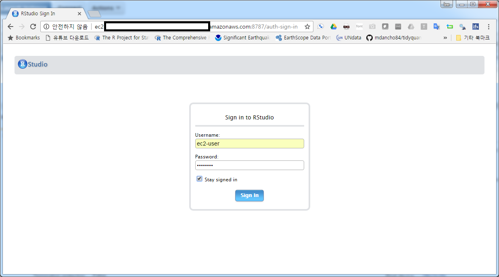

> ## 학습 목표 {.objectives}
>
> * AWS 위에 생성된 스파크 EC2 클러스터에 데이터 과학 툴체인을 구축한다.
> * R, RStudio 서버, sparklyr 혹은 sparkr 데이터 과학 툴체인을 설치한다.
> * 사용자를 등록시키고 포트(port)를 열어 웹인터페이스를 통해 데이터 과학을 위한 환경을 구축한다.

``` {r, include=FALSE}
source("tools/chunk-options.R")
knitr::opts_chunk$set(error = TRUE)
```

## 스파크 EC2 클러스터 - 데이터과학 툴체인(R, sparklyr) 구축 [^aws-reference-01] [^aws-reference-02] [^aws-reference-03]

[^aws-reference-01]: [BUILDING A DATA SCIENCE PLATFORM FOR R&D, PART 1 – SETTING-UP AWS](https://alexioannides.com/2016/08/16/building-a-data-science-platform-for-rd-part-1-setting-up-aws/)
[^aws-reference-02]: [BUILDING A DATA SCIENCE PLATFORM FOR R&D, PART 2 – DEPLOYING SPARK ON AWS USING FLINTROCK](https://alexioannides.com/2016/08/18/building-a-data-science-platform-for-rd-part-2-deploying-spark-on-aws-using-flintrock/)
[^aws-reference-03]: [BUILDING A DATA SCIENCE PLATFORM FOR R&D, PART 3 – R, R STUDIO SERVER, SPARKR & SPARKLYR](https://alexioannides.com/2016/08/22/building-a-data-science-platform-for-rd-part-3-r-r-studio-server-sparkr-sparklyr/)

### R 설치

아마존 AMI 이미지로 리눅스를 설치했다면 `R` 설치를 시작한다.
[Curl](https://curl.haxx.se/), [OpenSSL](https://www.openssl.org/)이 사전에 설치되어야 함. 
다양한 R 팩키지를 설치하는데  `httr`, `curl`이 운영체제에 설치된 소프트웨어를 활용하여 작업을 수행하기 때문.


``` {r, aws-spark-ec2-r-install, eval=FALSE}
$ sudo yum update
$ sudo yum install R
$ sudo yum install libcurl libcurl-devel # Curl이 사전에 설치되어야 함.
$ sudo yum install openssl openssl-devel # OpenSSL이 사전에 설치되어야 함.
```

### RStudio 서버 설치

로컬 컴퓨터에서 RStudio를 설치해서 사용하는 것이 아니라 원격으로 AWS 클라우드에 설치된 RStudio를 사용할 것이기 때문에 [RStudio Preview](https://www.rstudio.com/products/rstudio/download/preview/)
혹은 [RStudio 배포](https://www.rstudio.com/products/rstudio/download-server/) 버젼을 설치한다.


``` {r, aws-spark-ec2-rstudio-install, eval=FALSE}
$ [ec2-user@ip-172-31-30-45 ~]$ wget https://s3.amazonaws.com/rstudio-dailybuilds/rstudio-server-rhel-1.0.136-x86_64.rpm
$ sudo yum install --nogpgcheck rstudio-server-rhel-1.0.136-x86_64.rpm
```

설치가 끝났으며... RStudio 서버에 접속할 수 있도록 물론 웹으로 ... 사용자를 등록한다.

ssh 비밀키로 로그인 했다면 `ec2-user`에 대한 비번이 설정되어 있지 않기 때문에 비밀번호를 설정한다.
여러명이 스파크 EC2 클러스터를 사용하는 경우 사용자를 추가(`xwmooc`)로 추가하고 비번을 설정한다.
추가 사용자도 동일한 환경을 사용할 수 있도록 환경설정과 관련된 파일을 복사를 한다.

``` {r, aws-spark-ec2-rstudio-login, eval=FALSE}
$ sudo passwd ec2-user # 비밀번호 설정
$ sudo useradd xwmooc # 사용자 추가
$ sudo passwd xmmooc
$ cd /home/ec2-user # 추가 사용자에 대한 환경설정
$ sudo cp -r spark /usr/local/lib
```

### AWS 스파크 EC2 클러스터 RStudio 서버 접속

AWS 스파크 EC2 클러스터 RStudio 서버 접속하기 위해서 몇가지 추가 작업이 더 필요하다.
가장 먼저 `ssh` 포트를 열어 놔서 `putty`나 리눅스 CLI를 사용할 수 있도록 한다.
[Installing RStudio Shiny Server on AWS](https://www.r-bloggers.com/installing-rstudio-shiny-server-on-aws/)에서 
Shiny 서버를 설정하듯이 `ssh` 포트번호 **22**, `rstudio` 서버 포트번호 **8787** 를 설정해야 접속할 수 있다.


그리고 나서 웹브라우져를 열고 `http://ec2-52-XXX-XX-X15.ap-northeast-1.compute.amazonaws.com:8787` 주소를 입력하면 
RStudio IDE 작업환경으로 들어가게 된다.
8787 포트번호를 제외한 `http://ec2-52-XXX-XX-X15.ap-northeast-1.compute.amazonaws.com` 주소는 스파크 EC2 클러스터 마스터 노드를 
클릭하면 **EC2 Dashboard** &rarr; INSTANCES &rarr; Instances 화면에서 스파크 클러스터 EC2 마스터를 클릭하면 **Public DNS (IPv4)
**에 웹주소가 나온다. 이를 복사하고 포트번호 8787 붙여 접속하면 로그인 화면이 나오고 준비된 사용자명과 비번을 입력하면 바로 R로 작업할 수 있는 
작업환경이 나타난다.




