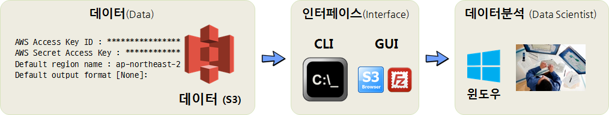

# 기계학습

> ## 학습 목표 {.objectives}
>
> * AWS 컴퓨팅 자원을 시나리오별로 활용하는 방법을 살펴본다.
> * PC에서 AWS S3 자원만 활용하는 사례를 실습한다.
> * 클라우드 S3 데이터를 끌어내어 PC에 분석과 기계학습 알고리즘 개발 환경을 구축한다.

## 1. AWS를 활용하는 세가지 시나리오

데이터분석을 위해 AWS 활용하는 시나리오는 세가지 방법이 크게 존재한다. 

- 시나리오 1. : AWS 클라우드의 저장소 기능(S3)만 활용
- 시나리오 2. : AWS 클라우드의 연산기능(EC2)만 활용
- 시나리오 3. : AWS 클라우드의 저장소 기능(S3)과 연산기능(EC2) 모두 활용

각 시나리오별 장단점과 필요성은 각자 직면한 환경에 따라 차이가 나기 때문에 우열을 가리는 것은 무의미하다.

## 2. 첫번째 시나리오 - AWS S3만 활용한 시나리오

데이터 분석을 위한 AWS 시나리오는 여러가지가 존재한다. 가장 먼저 떠오르는 작업 방식은 

- AWS S3 데이터를 가져와서 로컬 PC에서 분석하는 시나리오

탐색적 데이터 분석에 적합한 방식으로 S3 적재된 데이터를 CLI나 GUI를 활용하여 꺼내와서 로컬 PC에서 분석한다.
이와 유사하게 개인용으로 드롭박스나 구글 드라이브를 사용하는 경우가 이와 유사하다고 볼 수 있다.

### 2.1. 환경설정 

`AWS Commmand Line Interface` (AWS CLI)를 운영체제에 설치를 하고 파이썬을 설치한다. 
중요한 것은 `aws --version` 명령어를 쳤을 때 환경저보가 출력되어야 한다. 

~~~{.r}
C:\Windows\System32> aws --version
aws-cli/1.11.64 Python/3.4.3 Windows/7 botocore/1.5.27
~~~

- AWS CLI 툴체인 설치 
    - [AWS CLI 윈도우즈 설치](http://docs.aws.amazon.com/cli/latest/userguide/awscli-install-windows.html)
    - [파이썬 3.X 설치](https://www.python.org/downloads/release/python-343/)
    - 파이썬 PIP: `pip install --upgrade --user awscli`
- 환경설정
    - 윈도우 단축키 ÿ + R 단축키를 누르고 나서 `cmd` 명령어를 쳤을 때 `aws --version` 명령어가 실행되려면,
    환경변수로 **경로(Path)**가 파이썬 AWS CLI 모두 추가되어야 한다.

### 2.2. S3 접근 설정

S3 버킷에 접근하기 위해서는 AWS에서 발급한 토큰이 필요하다. 
통상 AWS Access Key와 AWS Secret Access Key 즉 접근키와 접근비번으로 구성된다.

`ap-northeast-2` 지역명(Region Name)은 [AWS Regions and Endpoints](http://docs.aws.amazon.com/general/latest/gr/rande.html)에서 확인이 가능하다.
데이터센터가 위치한 지역과 동일하게 생각하는 것도 한 방법이다. 즉, 데이터센터가 위치한 지역에 있는 특정 컴퓨터에 S3 형태로 데이터가 저장되어 있다.

- AWS Access Key ID : ****************
- AWS Secret Access Key : ****************
- Default region name : ap-northeast-2
- Default output format [None]:

상기 정보를 CLI의 경우 `asw configure` 명령어를 실행하고 채워넣거나, S3 브라우저 GUI를 사용하는 경우 메뉴를 찾아 입력시키면 S3에 접속할 수 있다.

### 2.3. 데이터 분석 환경

AWS S3 버킷 인증키와 S3버킷에서 데이터를 로컬 PC로 가져올 준비가 완료되면 다음으로 데이터를 분석할 환경을 갖춰야 한다.
가장 많이 사용되는 데이터 분석 언어는 R과 파이썬이다. 물론 이 언어를 데이터 분석 엔진으로 사용을 하지만 개발환경을 갖추어 사용하는 것이 대부분이다.
R의 경우 RStudio, 파이썬의 경우 쥬피터가 데이터 분석(과학) 통합개발환경이 된다.

기계학습과 연관된 과학컴퓨팅을 목적으로 파이썬을 사용하는 경우 [아나콘다(ANACONDA)](https://www.continuum.io/Downloads)를 설치하면 편하다.
파이썬 외에도 기계학습, 데이터 과학을 위해서 분석해야 되는 경우 다수 팩키지를 설치해야 하는데 충돌이나 설치가 되지 않는 문제를 개발사에서 
해결하여 제공하기 때문에 성가신 문제는 넘어가고 데이터 분석과 알고리즘 개발에 전념할 수 있다.

결국 클라우드 S3 저장된 데이터 `.csv`, `.json`, `.parquet` 파일을 CLI, GUI 인터페이스를 통해 로컬 컴퓨터로 가져와서 R이나 파이썬 모두
데이터프레임 형태로 데이터를 가공하여 분석이나 모형개발 작업을 추진한다.

### 2.4. 통합개발환경(IDE) 설치 

파이썬의 경우 CLI 상에서 `pip install Jupyter` 명령어를 실행하면 간단히 쥬피터가 설치된다.
쥬피터 설치가 완료되면 `jupyter notebook` 명령어를 실행시키면 웹브라우져가 실행되고 데이터를 분석할 수 있는 준비가 모두 완료된다.

> ### `Microsoft Visual C++ 10.0 is required (Unable to find vcvarsall.bat)` 오류 {.callout}
> 
> - `pip install Jupyter` 설치하면서 오류가 발생되면 **Visual C++ Studio 2010 Express**를 설치한다.
> - 필요시 `c:\Program Files (x86)\Microsoft Visual Studio 10.0\VC\bin` 디렉토리로 이동하여 `vcvars32.bat`을 실행한다.

R을 데이터분석환경을 사용하는 경우 [RStudio](https://www.rstudio.com/)를 다운로드 받아 설치한다.

### 2.5. S3와 통합개발환경 RStudio, 쥬피터 데이터 동기화

PC에서 S3 데이터를 다운로드 받아 RStudio 혹은 아나콘다 쥬피터 노트북으로 통해 데이터를 분석하거나 알고리즘을 개발하는 경우 
특정 디렉토리를 작업 폴더로 지정하는 것이 프로젝트로 관리 측면에서 편리성이 있다.

- S3와 PC 디렉토리 동기화: `aws s3 sync . s3://버킷명` 명령어를 통해 현재 작업디렉토리와 S3 버킷을 동기화한다.
- PC 디렉토리와 RStudio, 쥬피터 노트북 동기화: RStudio의 경우 프로젝트를 생성하여 특정 디렉토리를 동기화한다. 쥬피터 노트북의 경우 
작업 디렉토리로 이동하여 `jupyter notebook` 실행 명령어를 사용하던가, 쥬피터 노트북 실행 아이콘을 우클릭하여 시작 경로를 설정한다.

## 3. 두번째 시나리오 - EC2 분석 컴퓨터에서 데이터 분석 [^aws-filezilla] [^aws-filezilla-screenshot]

[^aws-filezilla]: [AWS - EC2 인스턴스 FileZilla(sftp)로 접속하기, Fall in IT](http://ithub.tistory.com/48)
[^aws-filezilla-screenshot]: [Transferring Files between your laptop and Amazon instance](http://angus.readthedocs.io/en/2014/amazon/transfer-files-between-instance.html)

두번째 시나리오는 로컬 컴퓨터나 노트북이 너무 구형이라 속도가 늦거나 데이터분석으로 인하여 불필요한 
소프트웨어를 너무 많이 깔아 더럽히지 않고자 할 때 AWS 클라우드에 분석용 EC2 컴퓨터를 별도로 갖추고 분석작업을 진행하는 경우다.

AWS 클라우드에 생성시킨 R과 RStudio가 설치된 분석전용 컴퓨터에 접속하기 위해서는 크게 세가지 방법이 많이 사용된다.

- SSH(Secure SHell): 컴퓨터 관리를 위해 포트번호 22를 통해 접속
    - R, RStudio, 스파크, `xgboost`, 텐서플로우, 케라스 설치 등 데이터분석에 필요한 프로그램 추가 삭제 및 사용자 계정관리 등
- sFTP(SSH File Transfer Protocol): 로컬 컴퓨터와 클라우드 원격 EC2 컴퓨터 간에 데이터를 주고 받기 위해 접속
- RStudio 웹포트(8787): 데이터 분석 환경(R, RStudio 등)이 원격 EC2 컴퓨터에 설정이 끝나고 sFTP를 통해 분석에 대한 데이터가 준비되면, 
  원격 EC2 컴퓨터에서 열어논 8787 RStudio 서버를 통해 분석을 웹브라우져 인터페이스를 통해 실시.

컴퓨터 관리를 위한 SSH 로그인 화면과, 파일질라(FileZilla)를 통해 데이터를 로컬 컴퓨터와 주고 받는 화면, 
데이터를 포함한 분석환경이 모두 갖춰진 상태에서 8787포트를 통해 RStudio 서버에 웹인터페이스로 접속하여 분석준비를 모두 마친 상황은 다음과 같다.

### 3.1. SSH 접속  

AWS에서 제공하는 EC2 컴퓨터는 기본적인 운영체제(리눅스)가 깔려 제공된다. 
그외 필요한 설정은 본인이 직접 해야 된다. 마치 새로 컴퓨터를 구매한 상황이라고 보면 된다.
데이터 과학을 위해 기본적으로 설치해야 될 소프트웨어가 제법된다. 이런 경우 R, RStudio 등 필요한 소프트웨어를 
설치할 때 도움이 많이 되는 것이 `ssh` 접속이다. 

`Services` &rarr; `EC2` &rarr; `INSTANCES` &rarr; `instances` 로 따라가면 AWS에서 생성시킨 EC2 인스턴스가 나타나는데,
마우스 우클릭하게 되면 메뉴가 나오는데 `Connect`를 클릭하면 다음과 같이 EC2 인스턴스에 접속할 수 있는 방법이 친절하게 나와있다.

### 3.2. sFTP 접속  

EC2 컴퓨터에 FTP가 설치되지 않는 경우 먼저 이를 설치해야 된다.

~~~{.r}
$ sudo apt-get install vsftpd
~~~

FTP 프로그램이 설치되어 로컬 컴퓨터에서 EC2 컴퓨터에 sFTP 로 붙을 준비가 되었다.
파일질라(FileZilla)의 sFTP를 사용하는데 주로 전송시 암호화시켜서 전송하여 보안이 높아진다.
그리고 EC2 컴퓨터 SSH와 동일한 22번 포트를 열어 파일을 주고 받는다.

좌측 상단에 `Site Manager`를 클릭해서 필요한 설정을 한다.

- 호스트(Host): EC2 컴퓨터 IP주소 입력
- 포트(Port): SSH와 동일한 22
- 프로토콜(Protocol): SFTP - SSH File Transfer Protocol 선택
- 로그온 유형(Logon Type): 키 파일(Key File) 선택
- 사용자(User): `ubuntu`
- 키 파일(Key File): 인스턴스 생성 시 다운로드한 `.pem`파일로 설정

> ### 루트(`root`) 계정 로그인 {.callout}
>
> 금지된 `root` 계정 로그인을 하는 방법은 다음과 같다.
> 
> 1. `root` 권한으로 로그인 할 수 있도록 권한을 수정
>     - `sudo nano /etc/ssh/sshd_config` 파일을 열고, `PermitRootLogin prohibit-password` &rarr; `PermitRootLogin yes` 로 수정
> 1. `root` 비밀번호 설정
>     - `sudo passwd` 명령어로 `ubuntu` 유저 비밀번호 설정
>     - `su root` 비밀번호를 입력하여 `root` 계정으로 바꿈 
> 1. `authorized_keys` 파일 복사
>     - `root` 계정 `~/.ssh/authorized_keys` 파일을 `~/.ssh/authorized_keys_bak`로 이동
>         1. `su root`
>         1. `cd ~/.ssh/`
>         1. `mv authorized_keys authorized_keys_bak`
>     - `ubuntu` 계정 `/home/ubuntu/.ssh/authorized_keys` 파일 복사
>         1. `cp /home/ubuntu/.ssh/authorized_keys /home/root/.ssh/`        
>              - EC2 컴퓨터 생성시 생성한 `.pem` 파일을 그대로 사용해서 FileZilla `root` 계정으로 로그인하기 위함.
> 1. 서비스 재시작
>     - `service sshd restart`
>     - `ubuntu` 계정 대신 `root` 계정으로 로그인 가능하게 됨.
> 
> 
> ~~~{.r}
> $ ssh -i "vxxxxxxxxx.pem" root@ec2-1xx-xx-22-xxx.ap-northeast-2.compute.amazonaws.com
> Welcome to Ubuntu 16.04.3 LTS (GNU/Linux 4.4.0-92-generic x86_64)
> 
>  * Documentation:  https://help.ubuntu.com
>  * Management:     https://landscape.canonical.com
>  * Support:        https://ubuntu.com/advantage
> 
>   Get cloud support with Ubuntu Advantage Cloud Guest:
>     http://www.ubuntu.com/business/services/cloud
> 
> 0 packages can be updated.
> 0 updates are security updates.
> 
> root@ip-1xx-xx-22-xxx:~#
> ~~~

`rstudio` 계정에 `root` 권한을 부여할 경우 보안에는 다소 문제가 있을 수 있으나 데이터 과학 작업을 수행하는데 
나름 편리한 점은 있다. [^ask-ubuntu-root-privileges]

[^ask-ubuntu-root-privileges]: [How do I grant sudo privileges to an existing user?](https://askubuntu.com/questions/168280/how-do-i-grant-sudo-privileges-to-an-existing-user)

> ### `rstudio` 계정에 루트(`root`) 권한 부여 {.callout}
>
> `rstudio` 뿐만 아니라 특정 계정에 `root` 권한을 부여하는 명령어는 다음과 같다. 
> 
> 
> ~~~{.r}
> root@ip-172-31-22-122:~$ sudo usermod -a -G sudo rstudio
> ~~~

> ### `rstudio` 권한 아래 디렉토리 관리 {.callout}
>
> `root`, `ubuntu`, `rstudio` 등 여러 계정이 혼재된 경우 `rstudio` 계정으로 디렉토리 관리를 일원화 하고자 하는 경우 다음 
> 명령어를 사용한다. `/home/rstudio/network_data/` 디렉토리를 `rstudio` 관할로 변경시킴.
> 
> 
> ~~~{.r}
> root@ip-172-31-22-122:~$ sudo chown -R rstudio ./network_data/
> ~~~

### 3.3. RStudio 8787 접속 {#rstudio-connect}

데이터분석 환경과 데이터를 모두 전달했다면 EC2 컴퓨터에서 데이터분석을 위한 모든 준비가 되었다.
EC2 컴퓨터 IP주소 입력를 포트번호 `8787`을 붙여 접속하게 되면 친숙한 RStudio 개발환경이 나타난다.
로그인을 해야 되기 때문에 rstudio/rstudio 계정으로 로그인하면 된다.

## 4. 세번째 시나리오 - AWS 클라우드의 저장소 기능(S3)과 연산기능(EC2) 모두 활용 {#ec2-s3-s3fs-fuse}

세번째 시나리오는 데이터도 보안이나 용량문제 등 다양한 사유로 S3에 저장되어 있고,
로컬 컴퓨터나 노트북으로 데이터 분석 작업을 진행하기 곤란한 경우 AWS 클라우드 연산기능(EC2)을 활용하여 
데이터 분석 및 모형개발 작업을 수행한다.

데이버 분석 연산을 담당하는 EC2 컴퓨터와 데이터가 저장된 저장소는 S3로 이 둘을 연결해 주는 도구는 
[`s3fs-fuse`](https://github.com/s3fs-fuse/s3fs-fuse)로 속도는 많이 느리지만 오랜동안 검증되어 왔고,
다양한 설치방법이 존재하기 때문에 처음 시작하기 딱 좋다. [^s3fs-korean-tutorial]
이에 대한 대안으로 [goofys를 이용해 AWS S3 mount 해서 사용하기](http://bluese05.tistory.com/23)도 있으니 참조한다.

[^s3fs-korean-tutorial]: [s3fs를 이용해 AWS S3 mount 해서 사용하기](http://bluese05.tistory.com/22)

1. S3 만 이용하기 위한 사용자를 생성시킨다. 향후 유출이 되더라도 피해를 최소화할 수 있다.
    - aws_access_key_id = Axxxxxxxxxxxxxxxxxxxxxxxxxxx
    - aws_secret_access_key = Yfaxxxxxxxxxxxxxxxxxxxxxxxx
2. S3 만 전용으로 접속하여 활용되기 때문에 **AmazonS3FullAccess** 정책(policy)을 적용시킨다.
3. S3 서비스트 내부에 EC2 인스턴스와 동기화시킬 버킷(bucket)을 하나 생성시킨다.
4. S3 와 EC2 인스턴스를 연결해주는 `s3fs-fuse`를 설치한다. `s3fs-fuse` 설치에 필요한 연관 소프트웨어를 우선 설치한다.

~~~{.r}
$ sudo apt-get install build-essential git libfuse-dev libcurl4-openssl-dev libxml2-dev mime-support automake libtool 
$ sudo apt-get install pkg-config libssl-dev 
$ git clone https://github.com/s3fs-fuse/s3fs-fuse
$ cd s3fs-fuse/
$ ./autogen.sh
$ ./configure --prefix=/usr --with-openssl
$ make
$ sudo make install
~~~

5. aws_access_key_id/aws_secret_access_key를 EC2 컴퓨터에 반영시킨다.
6. s3fs 명령어를 실행하여 S3 버킷과 EC2 컴퓨터 디렉토리를 동기화시킨다.

~~~{.r}
rstudio@ip-172-00-00-000:~$ mkdir -p works
rstudio@ip-172-00-00-000:~$ cd works
rstudio@ip-172-00-00-000:~/works$ s3fs victor-seoul ~/works -o allow_other -oumask=0022
~~~
