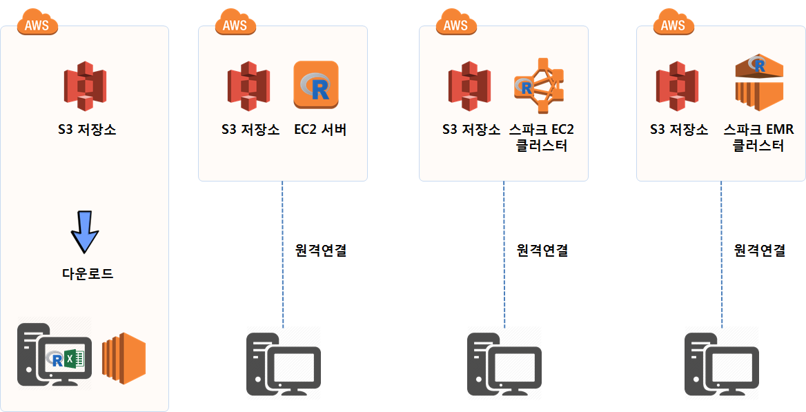
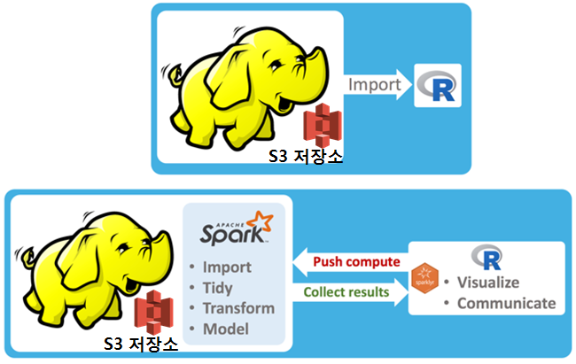

> ## 학습 목표 {.objectives}
>
> * AWS에 다양한 스파크 분석환경을 구축하는 시나리오를 검토한다.
> * 컴퓨터 한대와 클러스터에 분석환경을 구축하는 차이점을 살펴본다.

## 기계학습을 위한 AWS 클라우드 환경 

데이터 로그가 AWS S3에 저장되면 대용량 데이터를 바로 `S3 Browser` 혹은 AWS CLI 복사 명령어를 통해 로컬 컴퓨터에 저장하여 
R, 파이썬 엑셀로 분석하는 형태부터 단속적으로 스파크 EMR 클러스터를 잠시 띄워 작업하고 없애는 방식까지 다양한 스펙트럼이 존재한다.

- S3 + 로컬 컴퓨터 : 기존 MySQL 데이터베이스에서 데이터를 추출하여 PC에서 분석하는 전형적인 형태
- S3 + EC2 서버: 데이터를 로컬PC등으로 내려 분석하지 않고 모든 데이터를 클라우드 EC2에서 데이터 분석
- S3 + 스파크 EC2 클러스터: 상태정보를 항시 보유하고 있는 EC2 클러스터를 구성하여 S3 데이터를 분석
- S3 + 스파크 EMR 클러스터: 단속적으로 필요시 대량 EMR 클러스터를 구축하여 S3 데이터를 분석

### 클라우드 S3 데이터 저장

개인이 식별될 수 있는 데이터는 모형개발과 데이터 분석에는 도움이 되지 않는다. 
개인이 식별되는 유일한 정보는 하나이기 때문에 데이터 분석이 끝나 뒤나 실행에 옮기기 위해서 필요한 정보이기 때문에 데이터 분석과 모형 개발을 위해서는 
개인정보를 난독화하는 해쉬함수를 활용하여 난독화 과정을 거치 데이터를 폐쇄 개발망에서 오픈된 인터넷망에서 분석환경을 별도로 구축하는 것도 가능하다.

폐쇄망에서 인터넷망으로 가져오는 과정에서 `.csv` 파일을 파케이 파일로 변환하여 저장공간을 대폭줄여 이동시키고 나서 EC2, 
EMR 스파크 클러스터를 통해 데이터 분석 및 모형개발 작업을 수행한다.

### 데이터 과학 분석 R 인프라 [^aws-sparklyr-hadoop]

[^aws-sparklyr-hadoop]: [Data Science using a Data Lake](http://spark.rstudio.com/implement-yarn.html)

작업장 분석에 필요한 데이터가 준비되면 이를 분석할 수 있는 데이터 과학 인프라 구축이 필요하다.

- 스몰데이터(일회성, 분석속도, 동일하지 않는 데이터) : S3에서 데이터를 `S3 Browser`를 통해 다운받아 데이터 분석가 분석 PC에서 작업 [^s3-pc]
- 중형데이터: 데이터 분석가 PC는 단순한 터미널 기능을 수행하고 S3 데이터와 EC2 컴퓨터는 모두 AWS 클라우드에 위치 [^s3-ec2]
- 빅데이터 (동일한, 반복적인, 서버별 대용량 데이터) 및 예측모형 개발 [^s3-ec2-spark]
    - AWS S3 + 스파크 + EC2 스파크 클러스터
    - AWS S3 + 스파크 + EMR 스파크 클러스터

데이터가 넘처나는 상황에서 데이터를 저장할 저장소가 필요한데 AWS S3가 가능한 저장소 중의 하나가 될 것이다.
AWS S3에 저장된 데이터를 하둡으로 데이터관리시스템으로 활용할 경우 분석을 위해서 너무 큰 데이터 중 일부를 표본추출하는 방법도 있지만,
스파크를 활용하는 것도 가능하다. 스파크를 R에서 사용할 수 있도록 `sparklyr` 팩키지를 설치하여 R에서 대용량 데이터를 분석한다.

데이터도 방대하여 분석할 수 있는 분석환경도 스파크 클러스터를 꾸리지 않으면 병목현상으로 상당한 시간이 소요될 수 있으니 이점을 유념한다.

## 대용량 데이터 분석 환경 비교 [^ms-azure-spark-tutorial]

[^ms-azure-spark-tutorial]: [Tutorial: Scalable R on Spark with SparkR, sparklyr and RevoScaleR](http://blog.revolutionanalytics.com/2016/10/tutorial-scalable-r-on-spark.html)

대용량 데이터를 분산처리작업을 진행하기 전에 현존하는 분산기술에 대해 살펴보자.

접근방법     |  확장성(Scalability)        | 스파크 | 하둡   | SQL    | 라이선스 |
-------------|-----------------------------|--------|--------|--------|----------|
CRAN $R_1$   |  컴퓨터 1 대                |        |        |        | 오픈     |
bigmemory    |  컴퓨터 1 대                |        |        |        | 오픈     |
ff           |  컴퓨터 1 대                |        |        |        | 오픈     |
SparkR       |  컴퓨터 1 대 + 분산 컴퓨팅  |   X    |        |   X    | 오픈     |   
sparklyr     |  컴퓨터 1 대 + 분산 컴퓨팅  |   X    |        |   X    | 오픈     |
RevoScaleR   |  컴퓨터 1 대 + 분산 컴퓨팅  |   X    |   X    |   X    | 기업     |

스파크 클러스터가 구축되면 R 환경은 다음과 같다. [^sparklyr-spark-ML-library]

- 데이터 저장: Hive
- 스파크 응용프로그램 실행: YARN 클러스터
- 데이터 코드: dplyr이 지원되는 R

[^sparklyr-spark-ML-library]: [Extending sparklyr to Compute Cost for K-means on YARN Cluster with Spark ML Library](http://r-addict.com/2016/08/25/Extending-Sparklyr.html)

