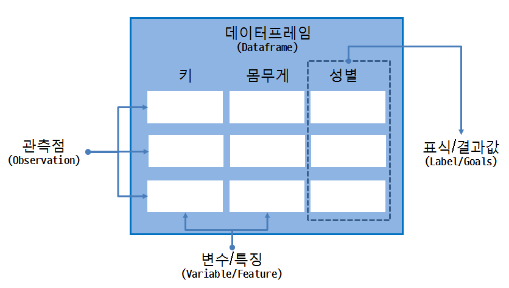
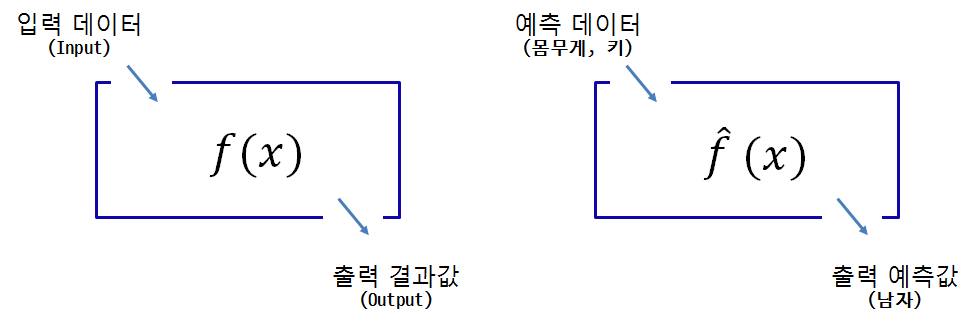

> ## 학습목표 {.objectives}
>
> * 자주 사용되는 기계학습 알고리즘에 대해 살펴본다.

### 1. 기계학습 개요

기계학습 알고리즘을 데이터에서 학습하는 알고리즘을 만들어 내거나 활용하는 것으로 정의되는데
이전 해법은 경험으로 축적되고 데이터가 많아지면 성능이 좋아지게 된다.

기계학습을 위한 자료구조는 보통 데이터프레임으로 구현된다. 데이터프레임은 변수/특징을 나타내는 열과
관측점으로 표현되는 행으로 구성되는데, 특정 변수가 표식/결과값에 대한 정보를 담고 있다. 즉, 여러 특징으로 표현되는 
관측점을 바탕으로 표식/결과값을 예측하는 모형을 데이터에서 찾아내는 것이 기계학습을 좀더 구체화한 것으로 볼 수 있다.

입력데이터를 넣어 함수값을 계산하면 출력결과값이 도출되는 것이다. 키와 몸무게 정보를 넣어 성별을 예측하고자 하면
기계학습이 잘된 알고리즘이 함수로 들어가 있다면, 키와 몸무게 정보를 넣으면 출력 예측값이 도출된다.

> ### 통계와 기계학습의 차이점 {.callout}
>
> 통계와 기계학습의 가장 큰 차이점은 통계는 **설명과 이해** 를 위해 데이터를 활용하는 것이고,
> 기계학습은 **예측(prediction)** 을 위한다는 점에서 차이가 있다.

### 2. 자주 사용되는 기계학습 알고리즘

기계학습 알고리즘이 자주 적용되는 문제는 다음과 같이 구분된다.

* 분류 (Classification)
* 회귀 (Regression)
* 군집화 (Clustering)

**분류 문제** 는 의료진단을 통해 병을 진단(결핵 혹은 결핵아님)하거나, 손글씨로 쓴 숫자(0~9)를 분류하는 것을 예를 들 수 있는데 중요한 것은 예측하고자 하는 
결과값이 이산형이라는 점이다. **회귀 문제** 는 사전에 입력과 출력이 정의되어 있고, 이 관계를 통해 연속형 결과값을 예측하는 문제로 귀결된다. **군집 문제** 는 
유사한 관측점은 군집내에 군집간은 서로 다르게 군집화하는 알고리즘으로 표식/결과값이 없어 정답이 없어 군집화 결과값은 다양하게 정의된다.

### 3. 기계학습 모형

함수, 즉 기계학습 모형은 데이터가 주어지면 다양하게 개발할 수 있는데 **정확도**, **계산 시간**, **해석 용이성** 에 따라 자주 사용되는 기계학습의 유용성을 판단하게 된다.
기계학습 모형의 성능은 기계학습 알고리즘에 따라 달리 평가하게 된다.

* 분류 문제: 오차 행렬(Confusion Matrix)을 통해 **정확도(Accuracy)**, **정밀도(Precision)**, **재현율(Recall)** 을 계산해서 성능평가.
* 회귀 문제: 평균 제곱근 오차(Root Mean Squared Error, RMSE)로 $\sqrt{\frac{1}{N} \Sigma_{i=1}^{N} {(y_i - \hat{y_i})^2}}$ 을 계산해서 성능평가.
* 군집화: 정답이 없는 문제로 관측점들 간 거리측도를 정의해서 측정한다. 군집내 관측점 유사도는 크게 하고, 군집간 유사도는 떨어뜨리는 방향으로 성능을 평가. 즉, 집단내(Within Sum of Squares) 거리는 최소화하고 집단간(Between Sum of Square) 거리는 최대가 되게 한다. Dunn 지수(Dunn's Index), $\frac {군집간 거리}{군집내 거리}$를 활용한다.
