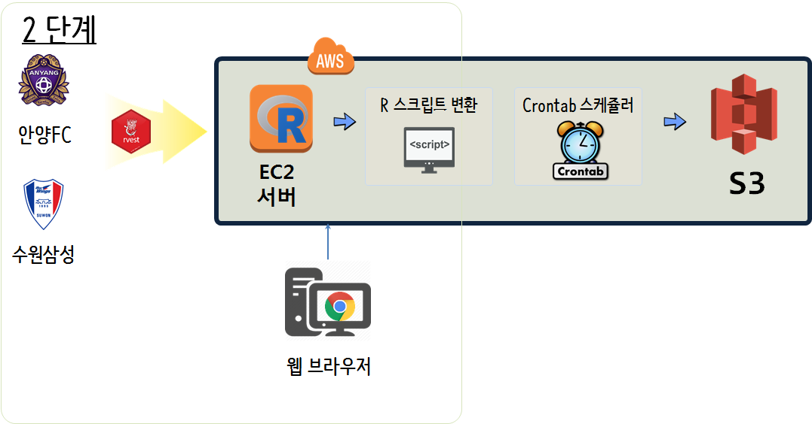
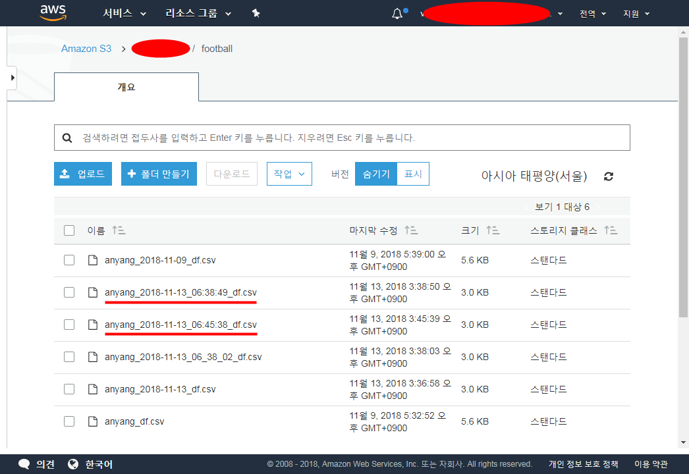
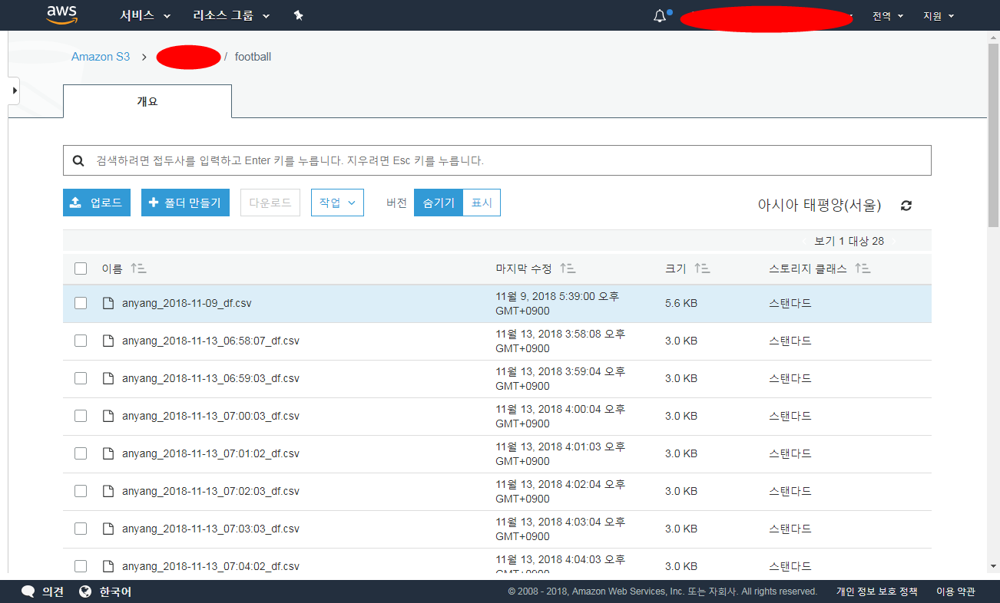

 
``` {r setup, include=FALSE}
# source("tools/chunk-options.R")

knitr::opts_chunk$set(echo = TRUE, message=FALSE, warning=FALSE,
                      comment="", digits = 3, tidy = FALSE, prompt = FALSE, fig.align = 'center')

```


# AWS 클라우드 {#epl-data-crawl}

외부에서 데이터를 클라우드로 가져올 경우 우선 로컬 컴퓨터로 작업을 하고 S3에 옮겨 작업을 하는 경우가 크롤링 프로그램 기능구현 및 테스트를 위해서 우선되어야 한다.
크롤링 프로그램의 기능이 구현되고 테스트를 통해 검증이 되었다면, 
다음 단계로 EC2 인스턴스에 크롤링 프로그램을 이관하여 정기적으로 크롤링되어 데이터를 S3 버킷에 쌓는 과정이 후속과정으로 수반된다.
로컬 컴퓨터에서 데이터를 클롤링하여 S3 버킷에 저장하는 방법은 [데이터 크롤링 &rarr; S3](ml-crawling-s3.html)을 참조한다.



AWS EC2 인스턴스에서 웹사이트를 크롤링하여 S3에 저장하기 위해서는 우선 로컬 컴퓨터에서 
작업한 R코드를 R스크립트로 작성한다. 그리고 나서 우분투 스케쥴러 프로그램인 `crontab`을 사용하여 주기적으로 크롤링하여 가져온다.


# 크롤링 R 코드 스크립트 변환 {#k-league-data-crawl-script}

[네이버 축구 K리그](https://sports.news.naver.com/kfootball/schedule/index.nhn?year=2018&category=kleague) 및 
[다음 축구 K리그](https://sports.media.daum.net/sports/schedule/kl)를 통해서 데이터를 제공하고 있지만, 
[FC안양](http://www.fc-anyang.com/), [삼성블루윙즈](http://www.bluewings.kr/home) 웹사이트를 통해서 직접 데이터를 긁어오는 것도 좋은 방법인듯 싶다. 
이유는 웹사이트가 단순해서 크롤링 기본기술로 쉽게 데이터를 긁어올 수 있다는 점이 장점이 된다. 
유사한 방식으로 전구단 웹사이트에서 데이터를 가져와서 정제하면 K리그 전체 경기데이터를 얻을 수 있을 것으로 파악된다. 
기술적으로 그렇다는 것으로 저작권을 비롯한 각종 법률적인 사항은 사전에 충분히 확인할 것을 추천한다.

`anyang_crawl.R` 파일명으로 쉘에서 호출하면 독립적으로 돌아갈 수 있도록 팩키지 설치부터 크롤링 결과 저장까지 자동화시킨다.

```{r kleague-crawl-data, eval=FALSE}
# 파일명: anyang_crawl.R
# If not installed, install packages -----
list.of.packages <- c("httr", "rvest", "tidyverse")
new.packages <- list.of.packages[!(list.of.packages %in% installed.packages()[,"Package"])]
if(length(new.packages)) install.packages(new.packages)

## libraries
library(httr)
library(rvest)
library(tidyverse)


## Crawl website
anyang_url <- "http://www.fc-anyang.com/match/match.asp?searchLeague=K%EB%A6%AC%EA%B7%B82"

anyang_resp <- POST(url = anyang_url)

status_code(x = anyang_resp)

anyang_df <- anyang_resp %>% 
  read_html() %>% 
  html_nodes(xpath= '//*[@id="container"]/div/table')  %>% 
  html_table() %>% 
  .[[1]] %>% 
  tbl_df()

## clean data
anyang_df <- anyang_df %>% 
  setNames(c("날짜", "구장", "리그", "X1", "홈팀", "홈점수", "X2", "원정점수", "원정팀", "X3", "승부")) %>% 
  select_at(vars(-contains("X")))
## 크롤링 결과 csv 파일 저장
anyang_filename <- paste0("anyang_", Sys.time(), "_df.csv")
anyang_df %>% write_csv(anyang_filename)
```

`anyang_crawl.R` R 스크립트를 `R CMD BATCH` 명령어로 실행시키게 되면 `anyang_crawl.log` 로그파일에 실행과정 로그가 찍히게 되고,
크롤링 R 스크립트가 실행된 시간이 기록된 `.csv` 파일이 생성된다.

```{r kleague-crawl-data-result, eval=FALSE}
rstudio@ip-172-xx-xxx-239:~$ R CMD BATCH anyang_crawl.R anyang_crawl.log
rstudio@ip-172-xx-xxx-239:~$ ls -al
total 76
drwxr-xr-x  8 rstudio rstudio 4096 Nov 13 06:12 .
drwxr-xr-x  5 root    root    4096 Sep 18 12:51 ..
-rw-r--r--  1 rstudio rstudio 3102 Nov 13 06:09 anyang_2018-11-13 06:09:35_df.csv
-rw-r--r--  1 rstudio rstudio 3102 Nov 13 06:12 anyang_2018-11-13 06:12:04_df.csv
-rw-r--r--  1 rstudio rstudio 3102 Nov 13 05:37 anyang_2018-11-13_df.csv
-rw-r--r--  1 rstudio rstudio 3212 Nov 13 06:12 anyang_crawl.log
-rw-r--r--  1 rstudio rstudio  984 Nov 13 06:09 anyang_crawl.R
-rw-r--r--  1 rstudio rstudio  220 Aug 31  2015 .bash_logout
-rw-r--r--  1 rstudio rstudio 3771 Aug 31  2015 .bashrc
drwxr-xr-x  2 rstudio rstudio 4096 Sep 18 12:36 .dropbox-ami
drwxr-xr-x  3 rstudio rstudio 4096 Sep 11 11:44 .dropbox-dist
-rw-r--r--  1 rstudio rstudio  655 May 16  2017 .profile
drwxr-xr-x  3 rstudio rstudio 4096 Sep 18 13:42 R
-rw-r--r--  1 rstudio rstudio 8233 Nov 13 06:12 .RData
-rw-r--r--  1 rstudio rstudio    0 Sep 18 18:18 .Rhistory
drwxr-xr-x 14 rstudio rstudio 4096 Sep 18 18:18 .rstudio
drwxr-xr-x  3 rstudio rstudio 4096 Sep 18 12:53 ShinyApps
drwxr-xr-x  3 rstudio rstudio 4096 Sep 18 13:42 .subversion
```


# EC2에서 S3 저장 {#k-league-data-crawl-to-s3-ec2}

[Amazon Simple Storage Service (S3) API Client](https://github.com/cloudyr/aws.s3)를 팩키지를 활용하여 S3 버킷에 RStudio IDE를 통해 접근이 가능하다. 

S3 버킷 접근을 위한 키값 설정을 한 후에 `put_object()` 함수를 사용해서 아마존 AWS S3 버킷에 EC2 인스턴스에 저장된 데이터를 이동시킨다. 
버킷명과 디렉토리는 `swcarpentry/football`이 된다.

S3 버킷 접근을 위한 키값 설정을 EC2 인스턴스에도 동일하게 해준다. 예를 들어,

> `Rprofile.site` 파일 설정
> 
> ```{r football-s3-ec2-rprofile, eval=FALSE}
> root@ip-172-XXX-XXX-239:/# find . -name "Rprofile.site"
> ./usr/lib/R/etc/Rprofile.site
> ./etc/R/Rprofile.site
> ```
> 
> `Rprofile.site` 파일에 "AWS_ACCESS_KEY_ID", "AWS_SECRET_ACCESS_KEY", 자격증명(credentials)을 저장시킨다.


```{r football-s3-ec2, eval=FALSE}
# 파일명: anyang_crawl.R
# If not installed, install packages -----
list.of.packages <- c("httr", "rvest", "tidyverse", "aws.s3")
new.packages <- list.of.packages[!(list.of.packages %in% installed.packages()[,"Package"])]
if(length(new.packages)) install.packages(new.packages)

## libraries
library(httr)
library(rvest)
library(tidyverse)

## Crawl website
anyang_url <- "http://www.fc-anyang.com/match/match.asp?searchLeague=K%EB%A6%AC%EA%B7%B82"

anyang_resp <- POST(url = anyang_url)

status_code(x = anyang_resp)

anyang_df <- anyang_resp %>% 
  read_html() %>% 
  html_nodes(xpath= '//*[@id="container"]/div/table')  %>% 
  html_table() %>% 
  .[[1]] %>% 
  tbl_df()

## clean data
anyang_df <- anyang_df %>% 
  setNames(c("날짜", "구장", "리그", "X1", "홈팀", "홈점수", "X2", "원정점수", "원정팀", "X3", "승부")) %>% 
  select_at(vars(-contains("X")))
## 크롤링 결과 csv 파일 저장
# anyang_filename <- paste0("anyang_", Sys.Date(), "_df.csv")
anyang_filename <- paste0("anyang_", str_replace_all(Sys.time(), "\\s", "_"), "_df.csv")
anyang_df %>% write_csv(anyang_filename)

## 크롤링 결과를 S3버킷에 저장
library(aws.s3) # devtools::install_github("cloudyr/aws.s3")

# S3 버킷 접근을 위한 키값 설정
Sys.setenv("AWS_ACCESS_KEY_ID" = AWS_ACCESS_KEY_ID,
           "AWS_SECRET_ACCESS_KEY" = AWS_SECRET_ACCESS_KEY,
           "AWS_DEFAULT_REGION" = "ap-northeast-2")

put_object(file = anyang_filename, object = anyang_filename, bucket = "software-carpentry/football")
```

동일하게 실생시키게 되면 파일이 시각까지 넣어 EC2 인스턴스에도 저장됨이 확인된다.
S3 버킷도 동일하게 확인해 보자.

```{r kleague-crawl-data-s3-run, eval=FALSE}
rstudio@ip-172-xx-xxx-239:~$ R CMD BATCH anyang_crawl.R anyang_crawl.log
total 92
drwxr-xr-x  8 rstudio rstudio 4096 Nov 13 06:38 .
drwxr-xr-x  5 root    root    4096 Sep 18 12:51 ..
-rw-r--r--  1 rstudio rstudio 3102 Nov 13 06:09 anyang_2018-11-13 06:09:35_df.csv
-rw-r--r--  1 rstudio rstudio 3102 Nov 13 06:12 anyang_2018-11-13 06:12:04_df.csv
-rw-r--r--  1 rstudio rstudio 3102 Nov 13 06:37 anyang_2018-11-13_06_37_49_df.csv
-rw-r--r--  1 rstudio rstudio 3102 Nov 13 06:38 anyang_2018-11-13_06_38_02_df.csv
-rw-r--r--  1 rstudio rstudio 3102 Nov 13 06:38 anyang_2018-11-13_06:38:49_df.csv
-rw-r--r--  1 rstudio rstudio 3102 Nov 13 05:37 anyang_2018-11-13_df.csv
-rw-r--r--  1 rstudio rstudio 3755 Nov 13 06:38 anyang_crawl.log
-rw-r--r--  1 rstudio rstudio 1494 Nov 13 06:38 anyang_crawl.R
-rw-------  1 rstudio rstudio  176 Nov 13 06:28 .bash_history
-rw-r--r--  1 rstudio rstudio  220 Aug 31  2015 .bash_logout
-rw-r--r--  1 rstudio rstudio 3771 Aug 31  2015 .bashrc
drwxr-xr-x  2 rstudio rstudio 4096 Sep 18 12:36 .dropbox-ami
drwxr-xr-x  3 rstudio rstudio 4096 Sep 11 11:44 .dropbox-dist
-rw-r--r--  1 rstudio rstudio  655 May 16  2017 .profile
drwxr-xr-x  3 rstudio rstudio 4096 Sep 18 13:42 R
-rw-r--r--  1 rstudio rstudio 8257 Nov 13 06:38 .RData
-rw-r--r--  1 rstudio rstudio    0 Sep 18 18:18 .Rhistory
drwxr-xr-x 14 rstudio rstudio 4096 Nov 13 06:28 .rstudio
drwxr-xr-x  3 rstudio rstudio 4096 Sep 18 12:53 ShinyApps
drwxr-xr-x  3 rstudio rstudio 4096 Sep 18 13:42 .subversion
```

`S3 Management Console`로 들어가서 제대로 크롤링 결과가 저장되는지 확인한다.




# `crontab` 자동화 {#k-league-data-crawl-to-s3-ec2-crontab}

마지막으로 crontab 명령어를 실행하여 1분마다 실행되도록 자동화시킨다.
이를 위해서 `crontab -e` 명령어를 통해서 `anyang_crawl.sh`을 최초 1분마다 테스트한다.

```{r kleague-crawl-data-s3-run-crontab, eval=FALSE}
* * * * * /home/rstudio/anyang_crawl.sh`
```

`anyang_crawl.sh` 파일은 앞서 쉘 명령라인에서 실행시킨 명령어를 절대경로로 지정하여 쉘스크립트를 작성한다.

```{r kleague-crawl-data-s3-run-crontab-batch, eval=FALSE}
## anyang_crawl.sh
#!/bin/sh

R CMD BATCH /home/rstudio/anyang_crawl.R /home/rstudio/anyang_crawl.log
```

1분단위로 정상적으로 웹페이지를 크롤링하여 가져오는 것이 확인되면 
`0 7 * * * /home/rstudio/anyang_crawl.sh` 와 같이 `crontab` 명령어를 변경시켜 매일 아침 7시에 
크롤링하도록 작업을 바꿔 안정화 시킨다.




