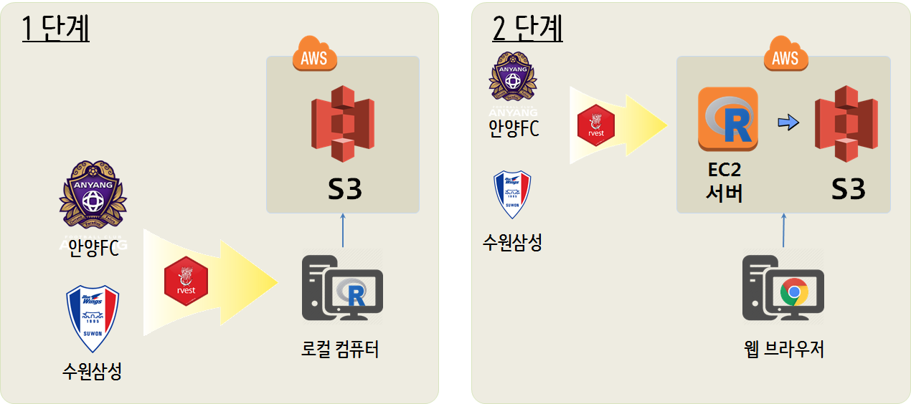
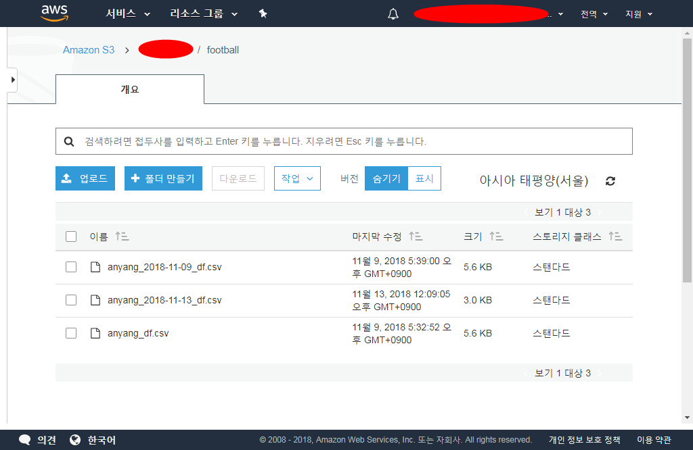

 
``` {r setup, include=FALSE}
# source("tools/chunk-options.R")

knitr::opts_chunk$set(echo = TRUE, message=FALSE, warning=FALSE,
                      comment="", digits = 3, tidy = FALSE, prompt = FALSE, fig.align = 'center')

```


# AWS 클라우드 {#epl-data-crawl}

외부에서 데이터를 클라우드로 가져올 경우 우선 로컬 컴퓨터로 작업을 하고 S3에 옮겨 작업을 하는 경우가 크롤링 프로그램 기능구현 및 테스트를 위해서 우선되어야 한다.
크롤링 프로그램의 기능이 구현되고 테스트를 통해 검증이 되었다면 다음 단계로 EC2 인스턴스에 크롤링 프로그램을 이관하여 정기적으로 크롤링되어 데이터를 S3 버킷에 쌓는 과정이 후속과정으로 수반된다.



# 축구 데이터 {#epl-data-crawl-import}

[축구데이터(`engsoccerdata`)](https://github.com/jalapic/engsoccerdata) 팩키지를 통해서 영국 프리미어 리그를 비롯한 스페인, 이탈리아 등 축구리그 데이터를 가져올 수 있다. 다음은 영국 `england_current()` 리그 데이터를 가져오는 사례를 보여주고 있는데, `spain_current()` 명령어로 스페인 리그도 가져올 수 있다. 아쉽게도 K-리그, J-리그는 찾을 수가 없다.

- england 
- england1939 
- england5 
- facup 
- playoffs 
- spain 
- italy 
- germany 
- holland 
- champs 
- france 
- scotland 
- portugal 
- belgium 
- turkey 
- greece 
- mls 
- safrica 
- teamnames 
- mlsconfs 


```{r epl-data-import}
library(httr)
library(rvest)
library(tidyverse)
library(engsoccerdata) # install_github('jalapic/engsoccerdata', username = "jalapic")

epl_df <- england_current()

epl_df %>% tbl_df %>% 
    arrange(desc(Date)) %>% 
    DT::datatable()
```


## 안양축구 경기 크롤링 {#k-league-data-crawl}

[네이버 축구 K리그](https://sports.news.naver.com/kfootball/schedule/index.nhn?year=2018&category=kleague) 및 [다음 축구 K리그](https://sports.media.daum.net/sports/schedule/kl)를 통해서 데이터를 제공하고 있지만, [FC안양](http://www.fc-anyang.com/), [삼성블루윙즈](http://www.bluewings.kr/home) 웹사이트를 통해서 직접 데이터를 긁어오는 것도 좋은 방법인듯 싶다. 이유는 웹사이트가 단순해서 크롤링 기본기술로 쉽게 데이터를 긁어올 수 있다는 점이 장점이 된다. 유사한 방식으로 전구단 웹사이트에서 데이터를 가져와서 정제하면 K리그 전체 경기데이터를 얻을 수 있을 것으로 파악된다. 기술적으로 그렇다는 것으로 저작권을 비롯한 각종 법률적인 사항은 사전에 충분히 확인할 것을 추천한다.

```{r kleague-crawl-data}
anyang_url <- "http://www.fc-anyang.com/match/match.asp?searchLeague=K%EB%A6%AC%EA%B7%B82"

anyang_resp <- POST(url = anyang_url)

status_code(x = anyang_resp)

anyang_df <- anyang_resp %>% 
  read_html() %>% 
  html_nodes(xpath= '//*[@id="container"]/div/table')  %>% 
  html_table() %>% 
  .[[1]] %>% 
  tbl_df()

anyang_df <- anyang_df %>% 
  setNames(c("날짜", "구장", "리그", "X1", "홈팀", "홈점수", "X2", "원정점수", "원정팀", "X3", "승부")) %>% 
  select_at(vars(-contains("X")))
  
DT::datatable(anyang_df)
```

크롤링 결과 `.csv` 파일로 저장시키고 나서 이를 바로 `system()` 명령어로 확인한다.

```{r kleague-crawl-data-save}
## 크롤링 결과 csv 파일 저장
anyang_filename <- paste0("anyang_", Sys.Date(), "_df.csv")
anyang_df %>% write_csv(anyang_filename)

## csv 파일 저장 확인
command <- "dir *_df.csv"
system(paste("cmd.exe /c", command), intern = TRUE) %>% 
  str_match(".+_df.csv")
```

# 아마존 AWS S3 저장 {#k-league-data-crawl-to-s3}

[Amazon Simple Storage Service (S3) API Client](https://github.com/cloudyr/aws.s3)를 팩키지를 활용하여 S3 버킷에 RStudio IDE를 통해 접근이 가능하다. 

S3 버킷 접근을 위한 키값 설정을 한 후에 `put_object()` 함수를 사용해서 아마존 AWS S3 버킷에 로컬 컴퓨터에 저장된 데이터를 이동시킨다. 버킷명과 디렉토리는 `swcarpentry/football`이 된다.

```{r football-s3, eval=FALSE}
library(aws.s3) # devtools::install_github("cloudyr/aws.s3")

# S3 버킷 접근을 위한 키값 설정
Sys.setenv("AWS_ACCESS_KEY_ID" = AWS_ACCESS_KEY_ID,
           "AWS_SECRET_ACCESS_KEY" = AWS_SECRET_ACCESS_KEY,
           "AWS_DEFAULT_REGION" = "ap-northeast-2")

put_object(file = anyang_filename, object = anyang_filename, bucket = "swcarpentry/football")
```

