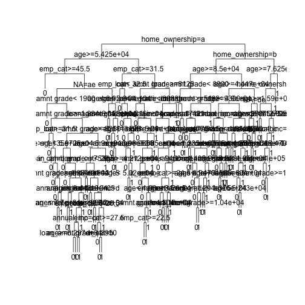

 

> ### 학습 목표 {.getready}
>
> * 

### 1. 전략곡선(Strategy Curve)

~~~{.r}
##=====================================================================
## 01. 렌딩클럽 데이터 가져오기
##=====================================================================
# http://rstudio-pubs-static.s3.amazonaws.com/3588_81e2ebd4de1b41bc9ac2f29f5f7dab2e.html
library(readr)
library(dplyr)
~~~

~~~{.output}

Attaching package: 'dplyr'

~~~

~~~{.output}
The following objects are masked from 'package:stats':

    filter, lag

~~~

~~~{.output}
The following objects are masked from 'package:base':

    intersect, setdiff, setequal, union

~~~

~~~{.r}
setwd("D:/docs/ml")
~~~

~~~{.output}
Error in setwd("D:/docs/ml"): 작업디렉토리를 변경할 수 없습니다

~~~

~~~{.r}
loan.dat <- read_fwf("data/lendingclub_loan_sample.txt", fwf_widths(c(6,11,10,6,15,11,4,8,8)), skip=1)
~~~

~~~{.output}
Parsed with column specification:
cols(
  X1 = col_integer(),
  X2 = col_integer(),
  X3 = col_integer(),
  X4 = col_character(),
  X5 = col_character(),
  X6 = col_double(),
  X7 = col_integer(),
  X8 = col_character(),
  X9 = col_character()
)

~~~

~~~{.r}
names(loan.dat) <- c("seq","loan_status", "loan_amnt grade", "home_ownership", "annual_inc", "age", "emp_cat", "ir_cat")
loan.dat$seq <- NULL

dim(loan.dat)
~~~

~~~{.output}
[1] 6570    8

~~~

~~~{.r}
names(loan.dat)
~~~

~~~{.output}
[1] "loan_status"     "loan_amnt grade" "home_ownership"  "annual_inc"     
[5] "age"             "emp_cat"         "ir_cat"          NA               

~~~

~~~{.r}
glimpse(loan.dat)
~~~

~~~{.output}
Observations: 6,570
Variables: 8
$ loan_status     <int> 1, 1, 1, 1, 1, 1, 1, 1, 1, 1, 1, 1, 1, 1, 1, 1...
$ loan_amnt grade <int> 15000, 6600, 2200, 24250, 2500, 5000, 10000, 1...
$ home_ownership  <chr> "E", "D", "A", "D", "C", "B", "C", "B", "C", "...
$ annual_inc      <chr> "RENT", "RENT", "MORTGAGE", "RENT", "RENT", "R...
$ age             <dbl> 62000.0, 30000.0, 45000.0, 136000.0, 18984.0, ...
$ emp_cat         <int> 21, 29, 31, 31, 22, 45, 36, 28, 27, 37, 22, 25...
$ ir_cat          <chr> "0-15", "0-15", "0-15", "0-15", "15-30", "0-15...
$ NA              <chr> "13.5+", "13.5+", "0-8", "13.5+", "13.5+", "Mi...

~~~

~~~{.r}
summary(loan.dat)
~~~

~~~{.output}
  loan_status     loan_amnt grade home_ownership      annual_inc       
 Min.   :0.0000   Min.   : 1000   Length:6570        Length:6570       
 1st Qu.:0.0000   1st Qu.: 5000   Class :character   Class :character  
 Median :0.0000   Median : 8000   Mode  :character   Mode  :character  
 Mean   :0.3333   Mean   : 9494                                        
 3rd Qu.:1.0000   3rd Qu.:12000                                        
 Max.   :1.0000   Max.   :35000                                        
      age            emp_cat         ir_cat               NA           
 Min.   :  4080   Min.   :20.00   Length:6570        Length:6570       
 1st Qu.: 38000   1st Qu.:23.00   Class :character   Class :character  
 Median : 55000   Median :26.00   Mode  :character   Mode  :character  
 Mean   : 64800   Mean   :27.62                                        
 3rd Qu.: 79150   3rd Qu.:30.00                                        
 Max.   :900000   Max.   :78.00                                        

~~~

~~~{.r}
##=====================================================================
## 02. 의사결정나무
##=====================================================================

train_index <- sample(nrow(loan.dat), 2/3*nrow(loan.dat))
train_set <- loan.dat[train_index,]
test_set <- loan.dat[-train_index,]

library(rpart)
# 02-03.손실함수 설정
loan_loss_dt <- rpart(loan_status ~ ., method = "class", data =  train_set, 
                      control = rpart.control(cp = 0.001),
                      parms = list(loss = matrix(c(0, 10, 1, 0), ncol=2)))

plot(loan_loss_dt, uniform = TRUE)
text(loan_loss_dt)
~~~

~~~{.r}
#---------------------------------------------------------------------
# 02-1. 의사결정나무: 가지치기(Prune)
#---------------------------------------------------------------------

# 01. 가지치기 사례
plotcp(loan_loss_dt)
~~~

~~~{.r}
printcp(loan_loss_dt)
~~~

~~~{.output}

Classification tree:
rpart(formula = loan_status ~ ., data = train_set, method = "class", 
    parms = list(loss = matrix(c(0, 10, 1, 0), ncol = 2)), control = rpart.control(cp = 0.001))

Variables actually used in tree construction:
[1] age             annual_inc      emp_cat         home_ownership 
[5] ir_cat          loan_amnt grade NA             

Root node error: 2939/4380 = 0.671

n= 4380 

          CP nsplit rel error  xerror    xstd
1  0.0034781      0   1.00000 10.0000 0.10580
2  0.0030623     15   0.93603  9.5046 0.10807
3  0.0026370     17   0.92991  9.2974 0.10887
4  0.0026086     22   0.91596  9.2137 0.10916
5  0.0024668     27   0.90201  9.1262 0.10946
6  0.0023818     31   0.89214  8.8904 0.11015
7  0.0022683     42   0.86560  8.7496 0.11052
8  0.0020415     46   0.85607  8.5747 0.11088
9  0.0019281     56   0.83532  8.3702 0.11122
10 0.0018714     59   0.82953  8.3702 0.11122
11 0.0017013     64   0.82001  8.3052 0.11129
12 0.0015311     67   0.81490  8.2110 0.11144
13 0.0013610     71   0.80810  8.1980 0.11145
14 0.0012476     84   0.78598  8.0490 0.11160
15 0.0011909     91   0.77407  7.9721 0.11162
16 0.0011058     96   0.76557  7.9721 0.11162
17 0.0010208    105   0.75094  7.8860 0.11167
18 0.0010000    115   0.74073  7.8765 0.11167

~~~

~~~{.r}
ptree_loss <- prune(loan_loss_dt, cp = 0.0020548)

library(rattle)
~~~

~~~{.output}
Error in library(rattle): there is no package called 'rattle'

~~~

~~~{.r}
library(rpart.plot)
library(RColorBrewer)

fancyRpartPlot(ptree_loss)
~~~

~~~{.output}
Error in eval(expr, envir, enclos): 함수 "fancyRpartPlot"를 찾을 수 없습니다

~~~

~~~{.r}
##=====================================================================
## 03. 전략곡선 도출
##=====================================================================

prob_default_loss <- predict(ptree_loss, newdata = test_set)[ ,2]

cutoff_loss <- quantile(prob_default_loss, 0.8)  
binary_pred_loss_80 <- ifelse(prob_default_loss > cutoff_loss, 1, 0)

accepted_status_loss_80 <- test_set$loan_status[binary_pred_loss_80 == 0]
sum(accepted_status_loss_80) / length(accepted_status_loss_80)
~~~

~~~{.output}
[1] 0.3423465

~~~

~~~{.r}
strategy_default_loss <- strategy_bank(prob_default_loss)
strategy_default_loss$table
~~~

~~~{.output}
      accept_rate cutoff bad_rate
 [1,]        1.00 0.7500   0.3420
 [2,]        0.95 0.4497   0.3423
 [3,]        0.90 0.4497   0.3423
 [4,]        0.85 0.4497   0.3423
 [5,]        0.80 0.4497   0.3423
 [6,]        0.75 0.4497   0.3423
 [7,]        0.70 0.4497   0.3423
 [8,]        0.65 0.4497   0.3423
 [9,]        0.60 0.3333   0.2850
[10,]        0.55 0.3303   0.2838
[11,]        0.50 0.3303   0.2838
[12,]        0.45 0.3303   0.2838
[13,]        0.40 0.3303   0.2838
[14,]        0.35 0.3303   0.2838
[15,]        0.30 0.2751   0.2270
[16,]        0.25 0.2751   0.2270
[17,]        0.20 0.2751   0.2270
[18,]        0.15 0.1839   0.2173
[19,]        0.10 0.0000   0.1870
[20,]        0.05 0.0000   0.1870
[21,]        0.00 0.0000   0.1870

~~~

~~~{.r}
plot(strategy_default_loss$accept_rate, strategy_default_loss$bad_rate, 
     type = "l", xlab = "승인율", ylab = "부실율", 
     lwd = 2, main = "의사결정나무")
~~~

#### 1.1. 신용평가 모형 전처리

범주형 데이터를 요인변수로 처리해야 하거나, 숫자형 `as.numeric` 혹은 `as.double`로 처리한다. 특히, 연속형 변수를 범주형으로 처리하면 성능향상이 된다는 연구결과도 있다.

~~~{.r}
# 변수 --> 요인(factor)
data$property <-as.factor(data$property)
# 변수 --> 숫자
data$age <-as.numeric(data$age)
# 변수 --> 숫자(double)
data$amount<-as.double(data$amount)

# 연속형 변수 --> 범주형 (구간 쪼갬)
data$amount<-as.factor(ifelse(data$amount<=2500,'0-2500',ifelse(data$amount<=5000,'2600-5000','5000+')))
~~~

#### 1.2. 컷오프 결정

컷오프 결정, 신용카드를 발급할 것인지 말것인지 결정하는데 산업계에서 KS(Kolmogorov-Smirnov) 통계량이 많이 사용되지만, Hand가 KS를 사용하는 것은 잘못되었다는 것을 보였고, 컷오프 결정에 유일한 통계량은 **신용카드 발급이 결정된 상태에서 조건부 부실율** 이 되어야 한다는 것을 보였다. [^hand-2005]

[^hand-2005]: Hand, D. J. (2005). Good practice in retail credit score-card assessment. Journal of the Operational Research Society, 56, 1109–1117.

#### 1.3 신용평점에 영향을 주는 변수 식별

신용카드 발급이 되지 않는 경우 어떤 사유로 카드발급이 되지 않았는지 이유를 제시하여야 한다.

~~~{.r}
## 신용점수함수에 가장 영향을 주는 변수 3개 추출
g <- predict(m, type='terms', test)

ftopk<- function(x,top=3){
  res <- names(x)[order(x, decreasing = TRUE)][1:top]
  paste(res, collapse=";", sep="")
}
# 상위 변수 3개를 추출
topk <- apply(g, 1, ftopk, top=3)
# 테스트 테스트 데이터에 사유가 되는 변수를 부착
test <- cbind(test, topk)
~~~

### 3. 신용평가 모형 배포 

최적의 성능을 자랑하는 기계학습 신용평가 알고리듬 구축이 완료되었으면, 다음 단계로 실운영 시스템(production)으로 이관하는 것이다. 통상 규칙엔진(Rule Engine)을 사용하거나, SQL 문장으로 작성하여 실운영 시스템에 내장되어 활용된다. [^convert-tree-to-rules]
학습된 나무모형을 SQL 혹은 규칙엔진으로 전환하면 다음과 같은 결과를 실운영 시스템에서 사용하게 된다.

~~~ {.output}
Rule number: 16 [yval=bad cover=220 N=121 Y=99 (37%) prob=0.04]
     checking< 2.5
     afford< 54
     history< 3.5
     coapp< 2.5

Rule number: 34 [yval=bad cover=7 N=3 Y=4 (1%) prob=0.06]
     checking< 2.5
     afford< 54
     history< 3.5
     coapp>=2.5
     age< 27
~~~

[^convert-tree-to-rules]: [DATA MINING Desktop Survival Guide by Graham Williams, Convert Tree to Rules](http://www.togaware.com/datamining/survivor/Convert_Tree.html)

~~~{.r}
list.rules.rpart(rpart.fit)

list.rules.rpart <- function(model)
{
  if (!inherits(model, "rpart")) stop("Not a legitimate rpart tree")
  #
  # Get some information.
  #
  frm     <- model$frame
  names   <- row.names(frm)
  ylevels <- attr(model, "ylevels")
  ds.size <- model$frame[1,]$n
  #
  # Print each leaf node as a rule.
  #
  for (i in 1:nrow(frm))
  {
    if (frm[i,1] == "<leaf>")
    {
      # The following [,5] is hardwired - needs work!
      cat("\n")
      cat(sprintf(" Rule number: %s ", names[i]))
      cat(sprintf("[yval=%s cover=%d (%.0f%%) prob=%0.2f]\n",
                  ylevels[frm[i,]$yval], frm[i,]$n,
                  round(100*frm[i,]$n/ds.size), frm[i,]$yval2[,5]))
      pth <- path.rpart(model, nodes=as.numeric(names[i]), print.it=FALSE)
      cat(sprintf("   %s\n", unlist(pth)[-1]), sep="")
    }
  }
}
~~~

