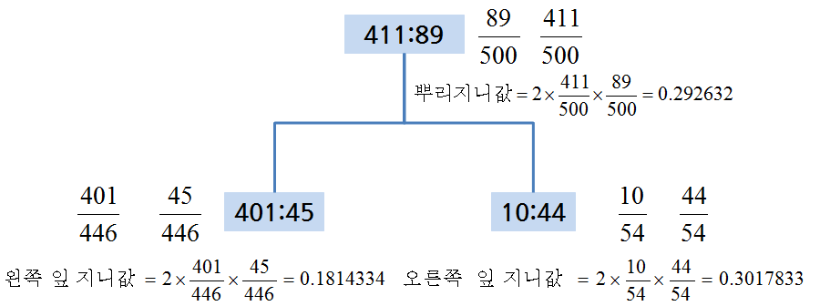

 
``` {r, include=FALSE}
source("tools/chunk-options.R")
```

> ### 학습목표 {.getready}
>
> * 신용평점모형을 위해 사용되는 로지스틱 회귀모형과 의사결정나무를 이해한다.
> * 렌딩클럽 대출 데이터에 로지스틱 회귀모형을 적합시키고 계수 및 모형성능에 대해 살펴본다.


### 1. 로지스틱 회귀 [^lendingclub-nyc-data-science] [^lendingclub-yhat]

[^lendingclub-nyc-data-science]: [LendingClub Loan Data Analysis and Visualization using Lending Club Data](http://blog.nycdatascience.com/r/p2p-loan-data-analysis-using-lending-club-data/)
[^lendingclub-yhat]: [Machine Learning for Predicting Bad Loans](http://blog.yhat.com/posts/machine-learning-for-predicting-bad-loans.html)

앞선 탐색적 데이터 분석과정과 피쳐 공학 등을 통해 모형적합을 시킬 준비는 사전에 맞춰졌다고 가정한다. 
따라서, 종속변수 채무 불이행에 대한 정의가 완료되었고, 기계학습 모형론을 적합시킬 준비 즉, 훈련데이터와 테스트 데이터 구분도 마무리했다. 이제
로지스틱 회귀분석을 실행하여 모형적합결과를 해석하는 과정을 거쳐본다.

``` {r lendingclub-logistic-basic, warning=FALSE, tidy=FALSE}

##=====================================================================
## 01. 렌딩클럽 데이터 가져오기
##=====================================================================

suppressMessages(library(readr))
suppressMessages(library(dplyr))
setwd("~")
loan.dat <- read_csv("lending-club-loan-data/loan.csv", col_names = TRUE)

##=====================================================================
## 02. 렌딩클럽 데이터 변환
##=====================================================================
library(gmodels)

# 종속변수 설정
bad_indicators <- c("Charged Off",
                    "Default",
                    "Does not meet the credit policy. Status:Charged Off",
                    "In Grace Period", 
                    "Default Receiver", 
                    "Late (16-30 days)",
                    "Late (31-120 days)")

loan.dat$loan_status_yn <- ifelse(loan.dat$loan_status %in% bad_indicators, 1, 0)

##=====================================================================
## 03. 렌딩클럽 데이터 기계학습
##=====================================================================

# 0. 훈련과 테스트 데이터셋 분리
index_train <- sample(1:nrow(loan.dat), 2/3*nrow(loan.dat))
training_set <- loan.dat[index_train, ]
test_set <- loan.dat[-index_train,]

#---------------------------------------------------------------------
# 01. 이항 로지스틱 회귀 모형
#---------------------------------------------------------------------

logit_mod <- glm(loan_status_yn ~ int_rate, family="binomial", data=training_set)
summary(logit_mod)
```

이항 로지스틱 회귀분석은 종속변수가 `0`과 `1`, 즉 정상(`0`) 혹은 채무불이행(`1`)이 되고
이를 다수의 설명변수 혹은 예측변수로 적합시키는 모형이다.

$$P(\text{loan_status_yn} = 1 | x_1 , x_2 , \cdots , x_m ) = \frac{1}{1+e^{-(\beta_0 + \beta_1 x_1 + \cdots + \beta_m x_m)}}$$

회귀분석의 결과는 확률값로 표현되고, $x_1 , x_2 , \cdots , x_m$은 설명변수, 즉 데이터가 되고, 
$\beta_0 , \beta_1 , \cdots , \beta_m$은 추정해야 되는 회귀 계수가 되고 이를 결합한
$\beta_0 + \beta_1 x_1 + \cdots + \beta_m x_m$은 선형 예측변수가 된다.


#### 1.1. 로지스틱 회귀 적합과 예측

로지스틱 회귀분석에 데이터를 넣어 적합시킬 경우 `glm` 함수를 사용하고 `family=binomial`을 인자로 넣고 종속변수와 설명변수는 R 모형식에 맞춰 집어넣는다. 그리고 결과를 `logit_mod` 모형에 저장하면 로지스틱 회귀모형에 대한 모든 
정보가 담기게 된다.

`summary(logit_mod)` 명령어로 이자율로 채무 불이행을 예측한 모형을 살펴본다.
$\beta_0$ `(Intercept)` 절편은 -4.498306, $\beta_1$ `int_rate` 이자율은 0.139891 으로 추정되고 이를 수식으로 표현하면 다음과 같다.

$$P(\text{loan_status_yn} = 1 | \text{이자율(int_rate)} ) 
= \frac{1}{1+e^{-(-4.498306+0.139891 \times 
  \text{이자율(int_rate)} )}}$$

로지스틱 모형이 완성되어 이자율에 따른 채무 불이행 확률을 계산해본다.


``` {r lendingclub-logistic-basic-pred, warning=FALSE, tidy=FALSE}
check.obs <- as.data.frame(training_set[1,]) # 이자율 19.99
predict(logit_mod, check.obs)
predict(logit_mod, check.obs, type="response")
summary(logit_mod)

1/(1+exp(-(-4.498306+0.139891*19.99)))
```

이자율을 설명변수로 넣어 채무불이행을 예측하는데 `predict` 함수를 사용한다.
먼저 예측에 사용될 데이터를 준비한다. `check.obs`로 `training_set`에서 첫번째 관측점을 뽑아낸다.
그리고 나서 `predict(logit_mod, check.obs)` 명령어를 실행시키면 `-1.701879` 값이 나온다. 
이는 선형 예측변수 값과 일치(소수점 아래 4자리 까지)한다.

$\beta_0 + \beta_1 \times \text{이자율(int_rate)  = -4.498306+0.139891*19.99 = -1.701885 $

원하는 확률을 계산하기 위해서는 `predict(logit_mod, check.obs, type="response")` 처럼 `type="response"`
인자를 전달하면 확률값이 계산된다.

R로 계산된 이자율 19.99에 대한 채무 불이행 확률은 `0.15422`으로 확인된다.
수식으로 확인하면 거의 동일한 결과를 얻게 된다.

$$P(\text{loan_status_yn} = 1 | \text{이자율(int_rate)} ) = 
\frac{1}{1+e^{-(-4.498306+0.139891 \times \text{이자율(int_rate)} )}} = \frac{1}{1+e^{-(-4.498306+0.139891 \times 19.99 )}} = 0.1542192$$

#### 1.2. $\beta$ 회귀계수 해석

통계모형이 다른 기계학습 모형 혹은 알고리즘과 비교해서 많이 사랑받는 이유 중의 하나가 설명이 가능하다는 점이다.
즉, $\beta$가 갖는 의미를 이해하고 이를 기반으로 설명이 가능하다.

$$P(\text{loan_status_yn} = 1 | x_1 , x_2 , \cdots , x_m ) = \frac{1}{1+e^{-(\beta_0 + \beta_1 x_1 + \cdots + \beta_m x_m)}} = \frac{e^{\beta_0 + \beta_1 x_1 + \cdots + \beta_m x_m}}{1+e^{\beta_0 + \beta_1 x_1 + \cdots + \beta_m x_m}}$$

$$P(\text{loan_status_yn} = 0 | x_1 , x_2 , \cdots , x_m ) = 1- \frac{1}{1+e^{-(\beta_0 + \beta_1 x_1 + \cdots + \beta_m x_m)}} = \frac{1}{1+e^{\beta_0 + \beta_1 x_1 + \cdots + \beta_m x_m}}$$

`loan_status_yn` 이 `0`에 대한 `1`의 비율을 오즈비(Odds Ratio)라고 정의하고, 채무불이행이 없는 것과 비교하여 채무불이행이 얼마나 높은지 혹은 낮은지를 정량화한다.

$$\frac {P(\text{loan_status_yn} = 1 | x_1 , x_2 , \cdots , x_m )} {P(\text{loan_status_yn} = 0 | x_1 , x_2 , \cdots , x_m )} = e^{\beta_0 + \beta_1 x_1 + \cdots + \beta_m x_m}$$

* 만약 $x_i$ 가 1 단위 증가하게 되면, $e^{\beta_i}$을 오즈값에 곱하게 된다.
    * $\beta_i < 0$ 작게 되면, $e^{\beta_i}<1$ 이 되어, 오즈값은 $x_i$ 가 증가하면 오즈값은 감소한다. 
    * $\beta_i > 0$ 크게 되면, $e^{\beta_i}>1$ 이 되어, 오즈값은 $x_i$ 가 증가하면 오즈값은 증가한다.
* 이자율 모형에 적용하면, 다음과 같은 결과가 도출된다.
    * 이자율이 1만큼 증가하게 되면 (1% 증가하게 되면), 회귀계수 `0.139891`을 곱해야 되고 양수이기 때문에 채무불이행은 확률은 높아진다.
    * 오즈에 $e^{0.139891}$ 을 곱하게 되면, `1.150148` 값이 도출되고, 동일한 조건에 정상인과 비교하여 약 15% 높게 채무 불이행 확률이 예측된다.

#### 1.3. 로지스틱 회귀 모형 성능평가

로지스틱 회귀모형에 대한 성능을 평가하기 위해서 채무불이행은 채무불이행으로, 정상고객은 정상고객으로 예측하는가를 갖고 성능을 평가한다. 이를 위해서 예측된 확률값(0에서 1사이)을 정상(`0`)과 채무불이행(`1`)으로 구분하는 것이 필요하다. 이를 위해서 도입되는 것이 **컷오프(cutoff)** 혹은 **임계값(threshold value)**을 설정하게 된다. 0.5를 임계값으로 설정하여 채무불이행 확률값이 이보다 작으면 채무불이행 위험 없음 `0`으로 0.5 보다 크면 `1` 채무불이행으로 각기 설정한다.

하지만, 채무불이행은 흔하지 않은 사건으로 0.5 보다 훨씬 적은 값을 설정하여 채무불이행 여부를 판단하고 이를 기준으로 **오차행렬(Confusion Matrix)** 을 생성하여 성능을 평가하는 것이 일반적이다.


``` {r lendingclub-logistic-prediction, warning=FALSE, tidy=FALSE}
logit_mod_two_var <- glm(loan_status_yn ~ revol_util + int_rate, family="binomial", data=training_set)
pred_two_var <- predict(logit_mod_two_var, newdata = test_set, type = "response")

pred_cutoff_15 <- ifelse(pred_two_var > 0.15, 1, 0)
table(test_set$loan_status_yn, pred_cutoff_15)


data.frame(training_set[1:10, c("loan_status_yn", "revol_util", "int_rate")], 
           pred_two_var[1:10], pred_cutoff_15[1:10])
```

`loan_status_yn` 채무불이행 종속변수와 `revol_util`, `int_rate` 설명변수가 함께 나와 있다.
두 설명변수를 통해 예측한 채무불이행 확률과 컷오프로 15%를 적용한 결과 채무불이행 모형예측 결과가 
`0`과 `1`로 나타나 있고 실제 채무불이행 데이터와 비교도 가능하다.

``` {r lendingclub-logistic-confusion, warning=FALSE, tidy=FALSE}
cutoff <- 0.15
pred_cutoff_logit <- ifelse(pred_two_var > cutoff, 1, 0)

tab_class_logit <- table(test_set$loan_status_yn, pred_cutoff_15)
sum(diag(tab_class_logit))/nrow(test_set)
```


### 2. 의사결정나무




~~~ {.output}
지니 이득 = 뿌리 지니값 - 좌측 잎 비율 * 좌측 지니값 -  우측 잎 비율 * 우측 지니값   
          = 0.292632 – 446/500 * 0.1814334 – 54/500 * 0.3017833   
          = 0.09820084   
~~~

``` {r lendingclub-rpart, warning=FALSE, tidy=FALSE}
##=====================================================================
## 01. 렌딩클럽 데이터 가져오기
##=====================================================================
# http://rstudio-pubs-static.s3.amazonaws.com/3588_81e2ebd4de1b41bc9ac2f29f5f7dab2e.html
library(readr)
library(dplyr)
setwd("D:/docs/ml")
loan.dat <- read_fwf("data/lendingclub_loan_sample.txt", fwf_widths(c(6,11,10,6,15,11,4,8,8)), skip=1)
names(loan.dat) <- c("seq","loan_status", "loan_amnt grade", "home_ownership", "annual_inc", "age", "emp_cat", "ir_cat")
loan.dat$seq <- NULL

dim(loan.dat)
names(loan.dat)

glimpse(loan.dat)
summary(loan.dat)


##=====================================================================
## 02. 의사결정나무
##=====================================================================
library(rpart)

# 02-01. cp값 0.001 설정
loan_dt <- rpart(loan_status ~ ., method = "class", data =  loan.dat, 
                 control = rpart.control(cp = 0.001))

plot(loan_dt, uniform = TRUE)
text(loan_dt)

# 02-02.사전 확률 설정
loan_prior_dt <- rpart(loan_status ~ ., method = "class", data =  loan.dat, 
                       control = rpart.control(cp = 0.001),
                       parms = list(prior=c(0.7, 0.3)))

plot(loan_prior_dt, uniform = TRUE)
text(loan_prior_dt)

# 02-03.손실함수 설정
loan_loss_dt <- rpart(loan_status ~ ., method = "class", data =  loan.dat, 
                      control = rpart.control(cp = 0.001),
                      parms = list(loss = matrix(c(0, 10, 1, 0), ncol=2)))

plot(loan_loss_dt, uniform = TRUE)
text(loan_loss_dt)

# 02-04. CP, 사전확률, 손실함수 모두 설정
loan_prior_loss_dt <- rpart(loan_status ~ ., method = "class", data =  loan.dat, 
                            control = rpart.control(cp = 0.001),
                            parms = list(prior=c(0.7, 0.3),
                                         loss = matrix(c(0, 10, 1, 0), ncol=2)))

plot(loan_prior_loss_dt, uniform = TRUE)
text(loan_prior_loss_dt)

#---------------------------------------------------------------------
# 02-1. 의사결정나무: 가지치기(Prune)
#---------------------------------------------------------------------

# 01. 가지치기 사례
plotcp(loan_dt)
printcp(loan_dt)

index <- which.min(loan_dt$cptable[ , "xerror"])
tree_min <- loan_dt$cptable[index, "CP"]

ptree_prior <- prune(loan_dt, cp = tree_min)

library(rpart.plot)
prp(ptree_prior, extra=1)

# 02. 손실함수 가지치기 사례

library(rattle)
library(rpart.plot)
library(RColorBrewer)

loan_loss_dt <- rpart(loan_status ~ ., method = "class", data =  loan.dat, 
                      control = rpart.control(cp = 0.001),
                      parms = list(prior=c(0.90, 0.10),
                                   loss = matrix(c(0, 10, 1, 0), ncol=2)))

printcp(loan_loss_dt) # 0.0020928
ptree_loss_dt <- prune(loan_loss_dt, cp = 0.0020928)

fancyRpartPlot(ptree_loss_dt)

# 03. 자주 사용되는 추가 선택옵션

case_weights <- ifelse(loan.dat$loan_status==1, 3, 1)

loan_loss_wgt_dt <- rpart(loan_status ~ ., method = "class", data =  loan.dat, 
                          control = rpart.control(minsplit = 5, minbucket = 2, cp = 0.0001), 
                          weights=case_weights,
                          parms = list(prior=c(0.90, 0.10),
                                       loss = matrix(c(0, 10, 1, 0), ncol=2)))

plotcp(loan_loss_wgt_dt)
printcp(loan_loss_wgt_dt) # 0.00306951

ptree_weights <- prune(loan_loss_wgt_dt, cp=0.00306951)

prp(loan_loss_wgt_dt, extra = 1)
```


