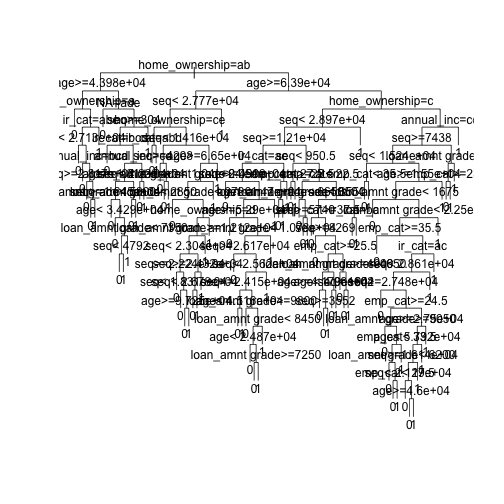
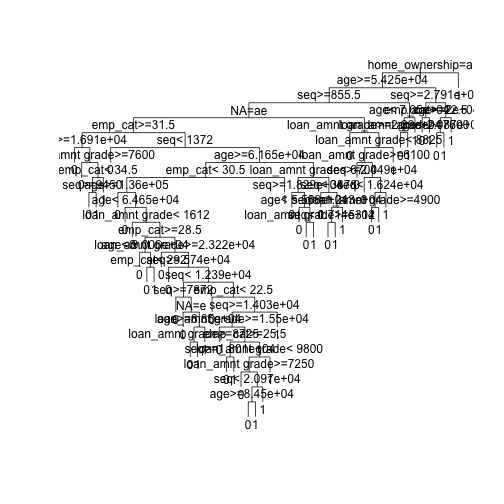
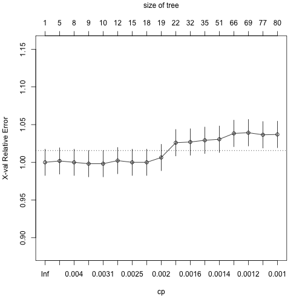

 

> ### 학습목표 {.getready}
>
> * 

### 1. 로지스틱 회귀 [^lendingclub-nyc-data-science] [^lendingclub-yhat]

[^lendingclub-nyc-data-science]: [LendingClub Loan Data Analysis and Visualization using Lending Club Data](http://blog.nycdatascience.com/r/p2p-loan-data-analysis-using-lending-club-data/)

[^lendingclub-yhat]: [Machine Learning for Predicting Bad Loans](http://blog.yhat.com/posts/machine-learning-for-predicting-bad-loans.html)

~~~{.r}
##=====================================================================
## 01. 렌딩클럽 데이터 가져오기
##=====================================================================

library(readr)
library(dplyr)
~~~

~~~{.output}

Attaching package: 'dplyr'

~~~

~~~{.output}
The following objects are masked from 'package:stats':

    filter, lag

~~~

~~~{.output}
The following objects are masked from 'package:base':

    intersect, setdiff, setequal, union

~~~

~~~{.r}
setwd("D:/")
~~~

~~~{.output}
Error in setwd("D:/"): 작업디렉토리를 변경할 수 없습니다

~~~

~~~{.r}
loan.dat <- read_csv("lending-club-loan-data/loan.csv", col_names = TRUE)
~~~

~~~{.output}
Error: 'lending-club-loan-data/loan.csv' does not exist in current working directory ('/Users/statkclee/swc/ml').

~~~

~~~{.r}
dim(loan.dat)
~~~

~~~{.output}
Error in eval(expr, envir, enclos): 객체 'loan.dat'를 찾을 수 없습니다

~~~

~~~{.r}
names(loan.dat)
~~~

~~~{.output}
Error in eval(expr, envir, enclos): 객체 'loan.dat'를 찾을 수 없습니다

~~~

~~~{.r}
glimpse(loan.dat)
~~~

~~~{.output}
Error in glimpse(loan.dat): 객체 'loan.dat'를 찾을 수 없습니다

~~~

~~~{.r}
summary(loan.dat)
~~~

~~~{.output}
Error in summary(loan.dat): 객체 'loan.dat'를 찾을 수 없습니다

~~~

~~~{.r}
##=====================================================================
## 02. 렌딩클럽 데이터 변환
##=====================================================================
library(gmodels)

# 종속변수 설정
bad_indicators <- c("Charged Off",
                    "Default",
                    "Does not meet the credit policy. Status:Charged Off",
                    "In Grace Period", 
                    "Default Receiver", 
                    "Late (16-30 days)",
                    "Late (31-120 days)")

loan.dat$loan_status_yn <- ifelse(loan.dat$loan_status %in% bad_indicators, 1, 0)
~~~

~~~{.output}
Error in match(x, table, nomatch = 0L): 객체 'loan.dat'를 찾을 수 없습니다

~~~

~~~{.r}
##=====================================================================
## 03. 렌딩클럽 데이터 기계학습
##=====================================================================

# 0. 훈련과 테스트 데이터셋 분리
index_train <- sample(1:nrow(loan.dat), 2/3*nrow(loan.dat))
~~~

~~~{.output}
Error in nrow(loan.dat): 객체 'loan.dat'를 찾을 수 없습니다

~~~

~~~{.r}
training_set <- loan.dat[index_train, ]
~~~

~~~{.output}
Error in eval(expr, envir, enclos): 객체 'loan.dat'를 찾을 수 없습니다

~~~

~~~{.r}
test_set <- loan.dat[-index_train,]
~~~

~~~{.output}
Error in eval(expr, envir, enclos): 객체 'loan.dat'를 찾을 수 없습니다

~~~

~~~{.r}
#---------------------------------------------------------------------
# 01. 이항 로지스틱 회귀 모형
#---------------------------------------------------------------------

logit_mod <- glm(loan_status_yn ~ int_rate, family="binomial", data=training_set)
~~~

~~~{.output}
Error in is.data.frame(data): 객체 'training_set'를 찾을 수 없습니다

~~~

~~~{.r}
summary(logit_mod)
~~~

~~~{.output}
Error in summary(logit_mod): 객체 'logit_mod'를 찾을 수 없습니다

~~~

이항 로지스틱 회귀분석은 종속변수가 `0`과 `1`, 즉 정상(`0`) 혹은 채무불이행(`1`)이 되고
이를 다수의 설명변수 혹은 예측변수로 적합시키는 모형이다.

$$P(\text{loan_status_yn} = 1 | x_1 , x_2 , \cdots , x_m ) = \frac{1}{1+e^{-(\beta_0 + \beta_1 x_1 + \cdots + \beta_m x_m)}}$$

회귀분석의 결과는 확률값로 표현되고, $x_1 , x_2 , \cdots , x_m$은 설명변수, 즉 데이터가 되고, 
$\beta_0 , \beta_1 , \cdots , \beta_m$은 추정해야 되는 회귀 계수가 되고 이를 결합한
$\beta_0 + \beta_1 x_1 + \cdots + \beta_m x_m$은 선형 예측변수가 된다.

#### 1.1. 로지스틱 회귀 적합과 예측

로지스틱 회귀분석에 데이터를 넣어 적합시킬 경우 `glm` 함수를 사용하고 `family=binomial`을 인자로 넣고 종속변수와 설명변수는 R 모형식에 맞춰 집어넣는다. 그리고 결과를 `logit_mod` 모형에 저장하면 로지스틱 회귀모형에 대한 모든 
정보가 담기게 된다.

`summary(logit_mod)` 명령어로 이자율로 채무 불이행을 예측한 모형을 살펴본다.
$\beta_0$ `(Intercept)` 절편은 -4.498306, $\beta_1$ `int_rate` 이자율은 0.139891 으로 추정되고 이를 수식으로 표현하면 다음과 같다.

$$P(\text{loan_status_yn} = 1 | \text{이자율(int_rate)} ) = \frac{1}{1+e^{-(-4.498306+0.139891 \times \text{이자율(int_rate) )}}$$

로지스틱 모형이 완성되어 이자율에 따른 채무 불이행 확률을 계산해본다.

~~~{.r}
check.obs <- as.data.frame(training_set[1,]) # 이자율 19.99
~~~

~~~{.output}
Error in as.data.frame(training_set[1, ]): 객체 'training_set'를 찾을 수 없습니다

~~~

~~~{.r}
predict(logit_mod, check.obs)
~~~

~~~{.output}
Error in predict(logit_mod, check.obs): 객체 'logit_mod'를 찾을 수 없습니다

~~~

~~~{.r}
predict(logit_mod, check.obs, type="response")
~~~

~~~{.output}
Error in predict(logit_mod, check.obs, type = "response"): 객체 'logit_mod'를 찾을 수 없습니다

~~~

~~~{.r}
summary(logit_mod)
~~~

~~~{.output}
Error in summary(logit_mod): 객체 'logit_mod'를 찾을 수 없습니다

~~~

~~~{.r}
1/(1+exp(-(-4.498306+0.139891*19.99)))
~~~

~~~{.output}
[1] 0.1542192

~~~

이자율을 설명변수로 넣어 채무불이행을 예측하는데 `predict` 함수를 사용한다.
먼저 예측에 사용될 데이터를 준비한다. `check.obs`로 `training_set`에서 첫번째 관측점을 뽑아낸다.
그리고 나서 `predict(logit_mod, check.obs)` 명령어를 실행시키면 `-1.701879` 값이 나온다. 
이는 선형 예측변수 값과 일치(소수점 아래 4자리 까지)한다.

$\beta_0 + \beta_1 \times \text{이자율(int_rate)  = -4.498306+0.139891*19.99 = -1.701885 $

원하는 확률을 계산하기 위해서는 `predict(logit_mod, check.obs, type="response")` 처럼 `type="response"`
인자를 전달하면 확률값이 계산된다.

R로 계산된 이자율 19.99에 대한 채무 불이행 확률은 `0.15422`으로 확인된다.
수식으로 확인하면 거의 동일한 결과를 얻게 된다.

$$P(\text{loan_status_yn} = 1 | \text{이자율(int_rate)} ) = \frac{1}{1+e^{-(-4.498306+0.139891 \times \text{이자율(int_rate) )}} = \frac{1}{1+e^{-(-4.498306+0.139891 \times 19.99 )}} = 0.1542192$$

#### 1.2. $\beta$ 회귀계수 해석

통계모형이 다른 기계학습 모형 혹은 알고리즘과 비교해서 많이 사랑받는 이유 중의 하나가 설명이 가능하다는 점이다.
즉, $\beta$가 갖는 의미를 이해하고 이를 기반으로 설명이 가능하다.

$$P(\text{loan_status_yn} = 1 | x_1 , x_2 , \cdots , x_m ) = \frac{1}{1+e^{-(\beta_0 + \beta_1 x_1 + \cdots + \beta_m x_m)}} = \frac{e^{\beta_0 + \beta_1 x_1 + \cdots + \beta_m x_m}}{1+e^{\beta_0 + \beta_1 x_1 + \cdots + \beta_m x_m}}$$

$$P(\text{loan_status_yn} = 0 | x_1 , x_2 , \cdots , x_m ) = 1- \frac{1}{1+e^{-(\beta_0 + \beta_1 x_1 + \cdots + \beta_m x_m)}} = \frac{1}{1+e^{\beta_0 + \beta_1 x_1 + \cdots + \beta_m x_m}}$$

`loan_status_yn` 이 `0`에 대한 `1`의 비율을 오즈비(Odds Ratio)라고 정의하고, 채무불이행이 없는 것과 비교하여 채무불이행이 얼마나 높은지 혹은 낮은지를 정량화한다.

$$\frac {P(\text{loan_status_yn} = 1 | x_1 , x_2 , \cdots , x_m )} {P(\text{loan_status_yn} = 0 | x_1 , x_2 , \cdots , x_m )} = e^{\beta_0 + \beta_1 x_1 + \cdots + \beta_m x_m}$$

* 만약 $x_i$ 가 1 단위 증가하게 되면, $e^{\beta_i}$을 오즈값에 곱하게 된다.
    * $beta_i < 0$ 작게 되면, $e^{\beta_i}<1$ 이 되어, 오즈값은 $x_i$ 가 증가하면 오즈값은 감소한다. 
    * $beta_i > 0$ 크게 되면, $e^{\beta_i}>1$ 이 되어, 오즈값은 $x_i$ 가 증가하면 오즈값은 증가한다.
* 이자율 모형에 적용하면, 다음과 같은 결과가 도출된다.
    * 이자율이 1만큼 증가하게 되면 (1% 증가하게 되면), 회귀계수 `0.139891`을 곱해야 되고 양수이기 때문에 채무불이행은 확률은 높아진다.
    * 오즈에 $e^{0.139891}$ 을 곱하게 되면, `1.150148` 값이 도출되고, 동일한 조건에 정상인과 비교하여 약 15% 높게 채무 불이행 확률이 예측된다.

#### 1.3. 로지스틱 회귀 모형 성능평가

로지스틱 회귀모형에 대한 성능을 평가하기 위해서 채무불이행은 채무불이행으로, 정상고객은 정상고객으로 예측하는가를 갖고 성능을 평가한다. 이를 위해서 예측된 확률값(0에서 1사이)을 정상(`0`)과 채무불이행(`1`)으로 구분하는 것이 필요하다. 이를 위해서 도입되는 것이 **컷오프(cutoff)** 혹은 **임계값(threshold value)**을 설정하게 된다. 0.5를 임계값으로 설정하여 채무불이행 확률값이 이보다 작으면 채무불이행 위험 없음 `0`으로 0.5 보다 크면 `1` 채무불이행으로 각기 설정한다.

하지만, 채무불이행은 흔하지 않은 사건으로 0.5 보다 훨씬 적은 값을 설정하여 채무불이행 여부를 판단하고 이를 기준으로 **오차행렬(Confusion Matrix)** 을 생성하여 성능을 평가하는 것이 일반적이다.

~~~{.r}
logit_mod_two_var <- glm(loan_status_yn ~ revol_util + int_rate, family="binomial", data=training_set)
~~~

~~~{.output}
Error in is.data.frame(data): 객체 'training_set'를 찾을 수 없습니다

~~~

~~~{.r}
pred_two_var <- predict(logit_mod_two_var, newdata = test_set, type = "response")
~~~

~~~{.output}
Error in predict(logit_mod_two_var, newdata = test_set, type = "response"): 객체 'logit_mod_two_var'를 찾을 수 없습니다

~~~

~~~{.r}
pred_cutoff_15 <- ifelse(pred_two_var > 0.15, 1, 0)
~~~

~~~{.output}
Error in ifelse(pred_two_var > 0.15, 1, 0): 객체 'pred_two_var'를 찾을 수 없습니다

~~~

~~~{.r}
table(test_set$loan_status_yn, pred_cutoff_15)
~~~

~~~{.output}
Error in table(test_set$loan_status_yn, pred_cutoff_15): 객체 'test_set'를 찾을 수 없습니다

~~~

~~~{.r}
data.frame(training_set[1:10, c("loan_status_yn", "revol_util", "int_rate")], 
           pred_two_var[1:10], pred_cutoff_15[1:10])
~~~

~~~{.output}
Error in data.frame(training_set[1:10, c("loan_status_yn", "revol_util", : 객체 'training_set'를 찾을 수 없습니다

~~~

`loan_status_yn` 채무불이행 종속변수와 `revol_util`, `int_rate` 설명변수가 함께 나와 있다.
두 설명변수를 통해 예측한 채무불이행 확률과 컷오프로 15%를 적용한 결과 채무불이행 모형예측 결과가 
`0`과 `1`로 나타나 있고 실제 채무불이행 데이터와 비교도 가능하다.

~~~{.r}
cutoff <- 0.15
pred_cutoff_logit <- ifelse(pred_two_var > cutoff, 1, 0)
~~~

~~~{.output}
Error in ifelse(pred_two_var > cutoff, 1, 0): 객체 'pred_two_var'를 찾을 수 없습니다

~~~

~~~{.r}
tab_class_logit <- table(test_set$loan_status_yn, pred_cutoff_15)
~~~

~~~{.output}
Error in table(test_set$loan_status_yn, pred_cutoff_15): 객체 'test_set'를 찾을 수 없습니다

~~~

~~~{.r}
sum(diag(tab_class_logit))/nrow(test_set)
~~~

~~~{.output}
Error in diag(tab_class_logit): 객체 'tab_class_logit'를 찾을 수 없습니다

~~~

### 2. 의사결정나무

~~~ {.output}
지니 이득 = 뿌리 지니값 - 좌측 잎 비율 * 좌측 지니값 -  우측 잎 비율 * 우측 지니값   
          = 0.292632 – 446/500 * 0.1814334 – 54/500 * 0.3017833   
          = 0.09820084   
~~~

~~~{.r}
##=====================================================================
## 01. 렌딩클럽 데이터 가져오기
##=====================================================================
# http://rstudio-pubs-static.s3.amazonaws.com/3588_81e2ebd4de1b41bc9ac2f29f5f7dab2e.html
library(readr)
library(dplyr)
setwd("D:/docs/ml")
~~~

~~~{.output}
Error in setwd("D:/docs/ml"): 작업디렉토리를 변경할 수 없습니다

~~~

~~~{.r}
loan.dat <- read_fwf("data/lendingclub_loan_sample.txt", fwf_widths(c(6,11,10,6,15,11,4,8,8)), skip=1)
~~~

~~~{.output}
Parsed with column specification:
cols(
  X1 = col_integer(),
  X2 = col_integer(),
  X3 = col_integer(),
  X4 = col_character(),
  X5 = col_character(),
  X6 = col_double(),
  X7 = col_integer(),
  X8 = col_character(),
  X9 = col_character()
)

~~~

~~~{.r}
names(loan.dat) <- c("seq","loan_status", "loan_amnt grade", "home_ownership", "annual_inc", "age", "emp_cat", "ir_cat")
loan.dat$seq <- NULL

dim(loan.dat)
~~~

~~~{.output}
[1] 6570    8

~~~

~~~{.r}
names(loan.dat)
~~~

~~~{.output}
[1] "loan_status"     "loan_amnt grade" "home_ownership"  "annual_inc"     
[5] "age"             "emp_cat"         "ir_cat"          NA               

~~~

~~~{.r}
glimpse(loan.dat)
~~~

~~~{.output}
Observations: 6,570
Variables: 8
$ loan_status     <int> 1, 1, 1, 1, 1, 1, 1, 1, 1, 1, 1, 1, 1, 1, 1, 1...
$ loan_amnt grade <int> 15000, 6600, 2200, 24250, 2500, 5000, 10000, 1...
$ home_ownership  <chr> "E", "D", "A", "D", "C", "B", "C", "B", "C", "...
$ annual_inc      <chr> "RENT", "RENT", "MORTGAGE", "RENT", "RENT", "R...
$ age             <dbl> 62000.0, 30000.0, 45000.0, 136000.0, 18984.0, ...
$ emp_cat         <int> 21, 29, 31, 31, 22, 45, 36, 28, 27, 37, 22, 25...
$ ir_cat          <chr> "0-15", "0-15", "0-15", "0-15", "15-30", "0-15...
$ NA              <chr> "13.5+", "13.5+", "0-8", "13.5+", "13.5+", "Mi...

~~~

~~~{.r}
summary(loan.dat)
~~~

~~~{.output}
  loan_status     loan_amnt grade home_ownership      annual_inc       
 Min.   :0.0000   Min.   : 1000   Length:6570        Length:6570       
 1st Qu.:0.0000   1st Qu.: 5000   Class :character   Class :character  
 Median :0.0000   Median : 8000   Mode  :character   Mode  :character  
 Mean   :0.3333   Mean   : 9494                                        
 3rd Qu.:1.0000   3rd Qu.:12000                                        
 Max.   :1.0000   Max.   :35000                                        
      age            emp_cat         ir_cat               NA           
 Min.   :  4080   Min.   :20.00   Length:6570        Length:6570       
 1st Qu.: 38000   1st Qu.:23.00   Class :character   Class :character  
 Median : 55000   Median :26.00   Mode  :character   Mode  :character  
 Mean   : 64800   Mean   :27.62                                        
 3rd Qu.: 79150   3rd Qu.:30.00                                        
 Max.   :900000   Max.   :78.00                                        

~~~

~~~{.r}
##=====================================================================
## 02. 의사결정나무
##=====================================================================
library(rpart)

# 02-01. cp값 0.001 설정
loan_dt <- rpart(loan_status ~ ., method = "class", data =  loan.dat, 
                 control = rpart.control(cp = 0.001))

plot(loan_dt, uniform = TRUE)
text(loan_dt)
~~~

~~~{.r}
# 02-02.사전 확률 설정
loan_prior_dt <- rpart(loan_status ~ ., method = "class", data =  loan.dat, 
                       control = rpart.control(cp = 0.001),
                       parms = list(prior=c(0.7, 0.3)))

plot(loan_prior_dt, uniform = TRUE)
text(loan_prior_dt)
~~~

~~~{.r}
# 02-03.손실함수 설정
loan_loss_dt <- rpart(loan_status ~ ., method = "class", data =  loan.dat, 
                      control = rpart.control(cp = 0.001),
                      parms = list(loss = matrix(c(0, 10, 1, 0), ncol=2)))

plot(loan_loss_dt, uniform = TRUE)
text(loan_loss_dt)
~~~

~~~{.r}
# 02-04. CP, 사전확률, 손실함수 모두 설정
loan_prior_loss_dt <- rpart(loan_status ~ ., method = "class", data =  loan.dat, 
                            control = rpart.control(cp = 0.001),
                            parms = list(prior=c(0.7, 0.3),
                                         loss = matrix(c(0, 10, 1, 0), ncol=2)))

plot(loan_prior_loss_dt, uniform = TRUE)
text(loan_prior_loss_dt)
~~~

~~~{.r}
#---------------------------------------------------------------------
# 02-1. 의사결정나무: 가지치기(Prune)
#---------------------------------------------------------------------

# 01. 가지치기 사례
plotcp(loan_dt)
~~~

~~~{.r}
printcp(loan_dt)
~~~

~~~{.output}

Classification tree:
rpart(formula = loan_status ~ ., data = loan.dat, method = "class", 
    control = rpart.control(cp = 0.001))

Variables actually used in tree construction:
[1] age             annual_inc      emp_cat         home_ownership 
[5] ir_cat          loan_amnt grade NA             

Root node error: 2190/6570 = 0.33333

n= 6570 

          CP nsplit rel error  xerror     xstd
1  0.0059361      0   1.00000 1.00000 0.017447
2  0.0044140      4   0.97443 0.99680 0.017433
3  0.0036530      7   0.96119 0.99635 0.017431
4  0.0031963      8   0.95753 0.99315 0.017417
5  0.0029680      9   0.95434 0.99406 0.017421
6  0.0025114     11   0.94840 0.99589 0.017429
7  0.0024353     14   0.94018 0.99863 0.017441
8  0.0022831     17   0.93288 0.99954 0.017445
9  0.0016743     18   0.93059 0.99863 0.017441
10 0.0015982     21   0.92557 1.01553 0.017514
11 0.0015221     31   0.90548 1.01735 0.017522
12 0.0014840     34   0.90091 1.02146 0.017539
13 0.0013699     50   0.87671 1.02283 0.017545
14 0.0012177     65   0.85525 1.03059 0.017576
15 0.0011416     68   0.85160 1.03973 0.017613
16 0.0010654     76   0.84247 1.04155 0.017620
17 0.0010000     79   0.83927 1.04155 0.017620

~~~

~~~{.r}
index <- which.min(loan_dt$cptable[ , "xerror"])
tree_min <- loan_dt$cptable[index, "CP"]

ptree_prior <- prune(loan_dt, cp = tree_min)

library(rpart.plot)
prp(ptree_prior, extra=1)
~~~

~~~{.r}
# 02. 손실함수 가지치기 사례

library(rattle)
~~~

~~~{.output}
Error in library(rattle): there is no package called 'rattle'

~~~

~~~{.r}
library(rpart.plot)
library(RColorBrewer)

loan_loss_dt <- rpart(loan_status ~ ., method = "class", data =  loan.dat, 
                      control = rpart.control(cp = 0.001),
                      parms = list(prior=c(0.90, 0.10),
                                   loss = matrix(c(0, 10, 1, 0), ncol=2)))

printcp(loan_loss_dt) # 0.0020928
~~~

~~~{.output}

Classification tree:
rpart(formula = loan_status ~ ., data = loan.dat, method = "class", 
    parms = list(prior = c(0.9, 0.1), loss = matrix(c(0, 10, 
        1, 0), ncol = 2)), control = rpart.control(cp = 0.001))

Variables actually used in tree construction:
[1] age             annual_inc      emp_cat         home_ownership 
[5] ir_cat          loan_amnt grade NA             

Root node error: 5913/6570 = 0.9

n= 6570 

          CP nsplit rel error  xerror     xstd
1  0.1428716      0   1.00000 10.0000 0.087237
2  0.0351598      1   0.85713  3.6823 0.078942
3  0.0033105      2   0.82197  5.1736 0.087557
4  0.0032851      5   0.81142  4.7348 0.085540
5  0.0030695     10   0.79396  4.7484 0.085608
6  0.0029427     12   0.78782  4.7483 0.085609
7  0.0022958     13   0.78488  4.8254 0.085987
8  0.0020928     15   0.78029  4.8001 0.085869
9  0.0020294     17   0.77610  4.8795 0.086249
10 0.0018011     29   0.74800  5.0418 0.087000
11 0.0017123     30   0.74619  5.0732 0.087141
12 0.0015855     33   0.74099  5.0403 0.086983
13 0.0014460     35   0.73782  5.0135 0.086859
14 0.0013952     37   0.73493  4.9844 0.086725
15 0.0012684     41   0.72872  4.9755 0.086682
16 0.0012007     42   0.72745  4.9054 0.086358
17 0.0010908     53   0.70898  4.8222 0.085954
18 0.0010401     56   0.70571  4.8179 0.085930
19 0.0010000     59   0.70259  4.8363 0.086015

~~~

~~~{.r}
ptree_loss_dt <- prune(loan_loss_dt, cp = 0.0020928)

fancyRpartPlot(ptree_loss_dt)
~~~

~~~{.output}
Error in eval(expr, envir, enclos): 함수 "fancyRpartPlot"를 찾을 수 없습니다

~~~

~~~{.r}
# 03. 자주 사용되는 추가 선택옵션

case_weights <- ifelse(loan.dat$loan_status==1, 3, 1)

loan_loss_wgt_dt <- rpart(loan_status ~ ., method = "class", data =  loan.dat, 
                          control = rpart.control(minsplit = 5, minbucket = 2, cp = 0.0001), 
                          weights=case_weights,
                          parms = list(prior=c(0.90, 0.10),
                                       loss = matrix(c(0, 10, 1, 0), ncol=2)))

plotcp(loan_loss_wgt_dt)
~~~

~~~{.r}
printcp(loan_loss_wgt_dt) # 0.00306951
~~~

~~~{.output}

Classification tree:
rpart(formula = loan_status ~ ., data = loan.dat, weights = case_weights, 
    method = "class", parms = list(prior = c(0.9, 0.1), loss = matrix(c(0, 
        10, 1, 0), ncol = 2)), control = rpart.control(minsplit = 5, 
        minbucket = 2, cp = 1e-04))

Variables actually used in tree construction:
[1] age             annual_inc      emp_cat         home_ownership 
[5] ir_cat          loan_amnt grade NA             

Root node error: 9855/6570 = 1.5

n= 6570 

            CP nsplit rel error  xerror     xstd
1   0.14287164      0   1.00000 10.0000 0.117041
2   0.03515982      1   0.85713  4.0419 0.087355
3   0.00331050      2   0.82197  5.3920 0.097927
4   0.00328513      5   0.81142  4.8274 0.093880
5   0.00306951     10   0.79396  4.8887 0.094339
6   0.00294267     12   0.78782  4.9518 0.094811
7   0.00229579     13   0.78488  5.1197 0.096023
8   0.00209285     15   0.78029  5.2065 0.096653
9   0.00202943     17   0.77610  5.2315 0.096827
10  0.00180112     29   0.74800  5.1666 0.096363
11  0.00171233     30   0.74619  5.1236 0.096058
12  0.00158549     32   0.74277  5.1079 0.095945
13  0.00157281     34   0.73960  4.9589 0.094860
14  0.00144597     35   0.73803  4.9409 0.094725
15  0.00126839     37   0.73513  4.8915 0.094354
16  0.00120074     38   0.73387  4.8942 0.094369
17  0.00115846     47   0.71816  4.8984 0.094404
18  0.00109082     52   0.71126  4.9165 0.094539
19  0.00109082     54   0.70908  4.8598 0.094116
20  0.00101471     55   0.70799  4.8393 0.093964
21  0.00098935     56   0.70698  4.8144 0.093775
22  0.00092170     57   0.70599  4.8443 0.093996
23  0.00091324     60   0.70322  4.8221 0.093822
24  0.00089633     64   0.69957  4.8380 0.093942
25  0.00087942     73   0.68899  4.8248 0.093837
26  0.00081177     85   0.67557  4.8249 0.093837
27  0.00081177     87   0.67395  4.8432 0.093973
28  0.00080331     92   0.66989  4.8478 0.094007
29  0.00079909     95   0.66748  4.8457 0.093989
30  0.00078640     99   0.66428  4.8525 0.094040
31  0.00078640    100   0.66350  4.8548 0.094057
32  0.00074835    101   0.66271  4.8684 0.094159
33  0.00071030    109   0.65616  4.7850 0.093523
34  0.00071030    116   0.65081  4.7714 0.093419
35  0.00069762    120   0.64754  4.7666 0.093386
36  0.00069339    122   0.64614  4.7688 0.093403
37  0.00068493    142   0.62927  4.7260 0.093072
38  0.00065956    153   0.62083  4.7174 0.092999
39  0.00064688    159   0.61687  4.6320 0.092324
40  0.00064688    163   0.61398  4.6160 0.092200
41  0.00063420    165   0.61268  4.6205 0.092236
42  0.00063420    168   0.61078  4.6049 0.092109
43  0.00062151    173   0.60761  4.6120 0.092162
44  0.00060883    176   0.60550  4.6100 0.092142
45  0.00060883    177   0.60490  4.6326 0.092321
46  0.00058980    180   0.60307  4.6145 0.092178
47  0.00058346    184   0.60071  4.6032 0.092089
48  0.00057078    186   0.59954  4.5720 0.091834
49  0.00055809    200   0.58765  4.5046 0.091285
50  0.00055809    201   0.58709  4.5706 0.091812
51  0.00055809    204   0.58541  4.5706 0.091812
52  0.00053780    208   0.58290  4.5573 0.091702
53  0.00053272    214   0.57953  4.5507 0.091647
54  0.00052427    219   0.57686  4.5416 0.091574
55  0.00052004    222   0.57529  4.5353 0.091518
56  0.00050736    228   0.57139  4.5038 0.091260
57  0.00050736    231   0.56958  4.3283 0.089797
58  0.00049467    240   0.56502  4.2068 0.088751
59  0.00049214    253   0.55736  4.1978 0.088672
60  0.00048199    283   0.53539  4.1909 0.088614
61  0.00048199    290   0.53146  4.1910 0.088614
62  0.00047882    298   0.52684  4.1887 0.088594
63  0.00045662    311   0.51877  4.1416 0.088178
64  0.00044394    367   0.49252  4.1579 0.088314
65  0.00043125    369   0.49163  4.1243 0.088015
66  0.00041857    379   0.48727  4.1853 0.088550
67  0.00041857    382   0.48597  4.1338 0.088093
68  0.00040589    389   0.48300  4.1315 0.088073
69  0.00040589    397   0.47938  4.1360 0.088113
70  0.00040226    398   0.47897  4.1204 0.087973
71  0.00039320    421   0.46824  4.1183 0.087952
72  0.00039320    425   0.46667  4.1478 0.088210
73  0.00039320    427   0.46588  4.1478 0.088210
74  0.00038686    445   0.45705  4.1478 0.088210
75  0.00038052    453   0.45396  4.1412 0.088150
76  0.00038052    458   0.45183  4.0314 0.087161
77  0.00036361    464   0.44937  4.0178 0.087039
78  0.00036361    471   0.44604  4.0225 0.087079
79  0.00034669    477   0.44386  4.0226 0.087078
80  0.00034500    481   0.44226  3.9871 0.086748
81  0.00034247    487   0.44013  3.9871 0.086748
82  0.00033824    562   0.40386  3.9871 0.086748
83  0.00033824    565   0.40284  3.9854 0.086725
84  0.00032978    570   0.40076  3.9810 0.086683
85  0.00032133    573   0.39977  3.9993 0.086847
86  0.00031710    590   0.39018  3.9880 0.086744
87  0.00031710    614   0.38011  3.9676 0.086559
88  0.00031287    618   0.37884  3.9676 0.086559
89  0.00031287    624   0.37653  3.9676 0.086559
90  0.00031287    628   0.37524  3.9676 0.086559
91  0.00030441    639   0.37067  4.1973 0.088616
92  0.00030441    641   0.37007  4.2359 0.088948
93  0.00029680    651   0.36692  4.2268 0.088870
94  0.00029173    734   0.32656  4.2428 0.089006
95  0.00029173    741   0.32382  4.2451 0.089025
96  0.00029173    759   0.31413  4.2451 0.089025
97  0.00028750    762   0.31299  4.2721 0.089258
98  0.00027905    765   0.31213  4.2926 0.089431
99  0.00027905    766   0.31185  4.2994 0.089488
100 0.00027905    844   0.29008  4.2994 0.089488
101 0.00027905    853   0.28757  4.2994 0.089488
102 0.00027397    857   0.28645  4.3016 0.089508
103 0.00026213    862   0.28508  4.3130 0.089603
104 0.00026213    871   0.28272  4.3176 0.089641
105 0.00026002    875   0.28166  4.3176 0.089641
106 0.00025368    883   0.27938  4.3221 0.089679
107 0.00024353    894   0.27522  4.1309 0.088017
108 0.00024099    902   0.27275  4.1311 0.088016
109 0.00022831    906   0.27136  4.1290 0.087995
110 0.00022469   1035   0.23803  4.1268 0.087975
111 0.00022197   1045   0.23488  4.1361 0.088054
112 0.00021563   1052   0.23326  4.1361 0.088054
113 0.00021140   1058   0.23194  4.1203 0.087914
114 0.00020928   1061   0.23130  4.1249 0.087954
115 0.00020294   1069   0.22963  4.1454 0.088133
116 0.00020294   1076   0.22727  4.1453 0.088133
117 0.00020294   1082   0.22542  4.1453 0.088133
118 0.00020294   1102   0.22045  4.1453 0.088133
119 0.00019660   1108   0.21908  4.1385 0.088073
120 0.00018603   1120   0.21672  4.0213 0.087024
121 0.00017757   1123   0.21616  4.0326 0.087126
122 0.00017757   1132   0.21456  4.0348 0.087147
123 0.00016489   1146   0.21208  4.0257 0.087065
124 0.00015855   1158   0.20974  4.0056 0.086881
125 0.00015855   1162   0.20911  4.0056 0.086881
126 0.00015728   1166   0.20847  4.0056 0.086881
127 0.00015221   1172   0.20741  4.0371 0.087167
128 0.00013952   1200   0.20312  4.0393 0.087187
129 0.00013530   1227   0.19921  4.0394 0.087187
130 0.00012684   1230   0.19881  4.0485 0.087268
131 0.00011838   1231   0.19868  4.0371 0.087167
132 0.00010993   1236   0.19805  4.0530 0.087309
133 0.00010993   1243   0.19721  4.0530 0.087309
134 0.00010000   1252   0.19622  4.0530 0.087309

~~~

~~~{.r}
ptree_weights <- prune(loan_loss_wgt_dt, cp=0.00306951)

prp(loan_loss_wgt_dt, extra = 1)
~~~

