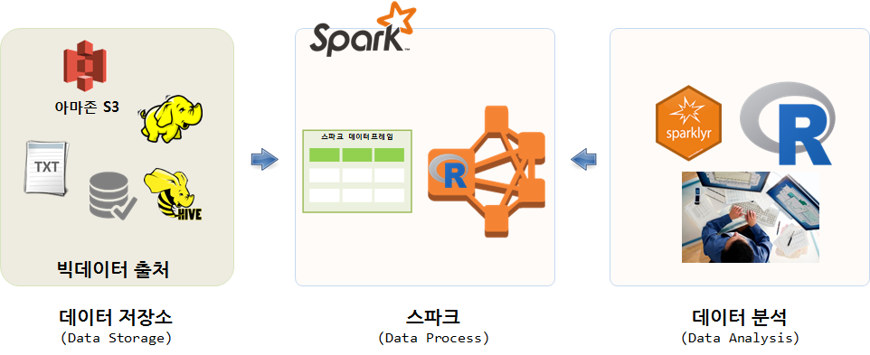
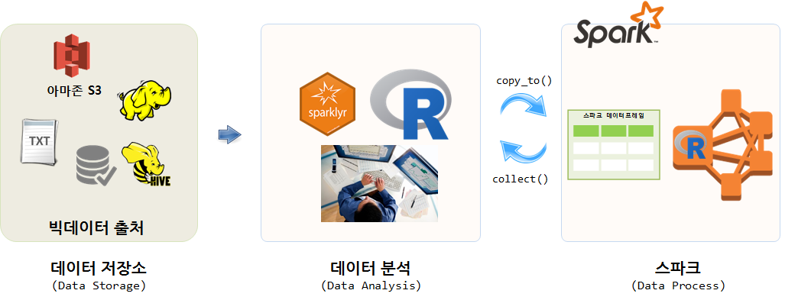
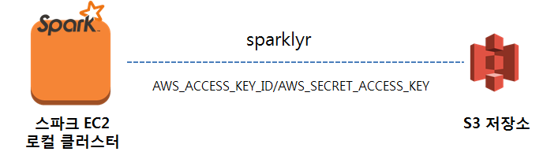
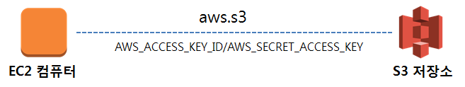
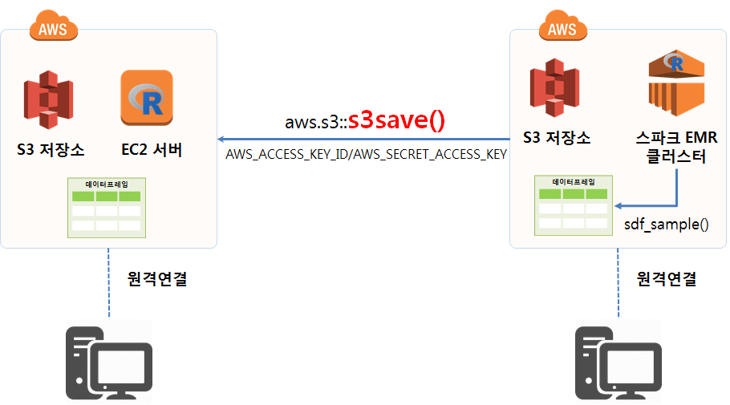

> ## 학습 목표 {.objectives}
>
> * 스파크 클러스터에 데이터를 적재하는 두가지 방법을 이해한다.
> * AWS EC2에서 S3 버킷에 저장된 데이터를 데이터분석에 활용한다.
> * AWS 스파크 EC2 클러스터에서 S3 버킷에 저장된 데이터를 데이터분석에 활용한다.


``` {r, include=FALSE}
source("tools/chunk-options.R")
knitr::opts_chunk$set(error = TRUE)
```

## 1. 스파크에 데이터를 적재하는 두가지 방법 [^load-data-on-spark] {#load-data-on-spark}

[^load-data-on-spark]: [RStudio Webinar - Understanding sparklyr deployment modes](https://www.rstudio.com/resources/webinars/understanding-sparklyr-deployment-modes/)

가장 이상적으로 AWS S3, 하둡, RDBMS 등 데이터를 스파크 클러스터를 통해 가져오는 것이 이상적인 방법이다.
즉, `sparkly` 팩키지를 활용하여 스파크 클러스터가 원천 데이터의 위치를 파악하고 이를 매핑하여 불러와서 분석작업을 수행시키는 방법으로,
대용량 데이터 분석에 적합하지만, 모든 노드가 URL, 네트워크 경로 등을 맞춰야 하는 수고스러움도 있다.



또 다른 방법은 원천 데이터를 R로 불러읽어온다. 그리고 나서 `copy_to()` 명령어를 활용하여 스파크에 데이터를 넘겨 빅데이터를 분석한다.
상대적으로 데이터 크기가 적은 경우 유용한 방법이 될 수 있다.




## AWS S3 데이터를 읽어오는 전략

AWS S3에 저장된 대용량 데이터를 읽어오는 전략은 다음과 크게 4가지 방식이 존재한다.

- EC2 컴퓨터에서 직접 `aws.s3` 팩키지를 통해 직접 S3 저장소 접근
- 스파크 클러스터를 EC2 컴퓨터를 로컬 컴퓨터로 생성시켜 S3 저장소 접근 
- EC2 컴퓨터를 `flintrock` 유형의 도구를 활용하여 스파크 클러스터를 생성시켜 S3 저장소 접근 
- AWS EMR을 활용하여 단속으로 필요시 마다 스파크 클러스터를 생성시켜 S3 저장소 접근 

첫번째 방식은 많이 활용되는 방식으로 아래 매뉴얼을 활용하여 따라가면 문제가 없고, 
AWS EMR 방식도 AWS에서 EMR 스파크 클러스터를 생성시킬 때 설정을 잘 맞춰놔서 필요한 일부 설정만으로도 S3 저장소에 접근할 수 있다.
EC2에 스파크 클러스터를 직접 설치하는 경우 S3 저장소에 설정을 잘 맞춰놓는 것이 그렇게 쉽지만은 않다.




## AWS S3 데이터를 EC2 RStudio에서 읽어오기 [^aws-s3-read-write] [^cloudyr-aws-s3]

[^aws-s3-read-write]: [Read and Write Data To and From Amazon S3 Buckets in Rstudio](http://datascience.ibm.com/blog/read-and-write-data-to-and-from-amazon-s3-buckets-in-rstudio/)

[^cloudyr-aws-s3]: [Amazon Simple Storage Service (S3) API Client](https://github.com/cloudyr/aws.s3)


EC2에 RStudio 서버가 설치되면 AWS S3 저장소의 데이터를 불러와서 작업을 해야한다.



### 환경설정 

`aws.s3` 팩키지를 통해 AWS S3와 R이 작업을 할 수 있도록 한다. `devtools::install_github("cloudyr/aws.s3")` 명령어를 통해 팩키지를 설치한다.
`Sys.setenv` 명령어를 통해 `AWS_ACCESS_KEY_ID`, `AWS_SECRET_ACCESS_KEY` 을 설정한다.


``` {r, aws-s3-setup, eval=FALSE}
# aws.s3 설치
devtools::install_github("cloudyr/aws.s3")

library(aws.s3)

# S3 버킷 접근을 위한 키값 설정
Sys.setenv("AWS_ACCESS_KEY_ID" = "xxx",
           "AWS_SECRET_ACCESS_KEY" = "xxx",
           "AWS_DEFAULT_REGION" = "ap-northeast-2")
````

### 설정환경 확인

`AWS_ACCESS_KEY_ID`, `AWS_SECRET_ACCESS_KEY`에 부여된 권한에 맞춰 제대로 S3 버킷에 접근할 수 있는지 확인한다.
접근 권한이 있는 모든 S3 버킷 정보가 화면에 출력된다.


``` {r, aws-s3-test, eval=FALSE}
bucketlist()
```

### 설정환경 확인

`get_object` 명령어를 통해 `v-seoul` 버킷 최상위 디렉토리에 있는 `iris.csv` 파일을 불러온다.
바이러니 형태라 사람이 읽을 수 있는 문자형으로 변환시키고 `textConnection` 함수를 통해 `.csv` 파일을 
R에서 작업할 수 있는 데이터프레임 형태로 변환시킨다.

``` {r, aws-s3-csv-import, eval=FALSE}
iris_dat <- get_object("iris.csv", bucket = "v-seoul")

iris_obj <- rawToChar(iris_dat)  
con <- textConnection(iris_obj)  
iris_df <- read.csv(con)  
close(con)  

iris_df
```

## AWS S3 데이터를 스파크 EMR 클러스터 RStudio에서 읽어오기

AWS EMR 클러스터를 통해 S3에 저장된 대용량 데이터 특히 `.parquet` 형태로 압축된 데이터인 경우, 
우선 다음 작업과정을 거쳐 분석 가능한 형태 데이터로 정제한다.

1. `.parquet` 데이터를 `spark_read_parquet` 함수로 스파크 데이터프레임으로 읽어온다.
1. `sparklyr` 팩키지 `sdf_sample()` 함수를 활용하여 표본 추출한다. 
    - 1억건이 넘어가는 데이터의 경우 100 GB를 쉽게 넘고 0.1% 표본추출해도 수백MB가 된다.
1. `collect()` 함수를 통해 스파크 데이터프레임을 R 데이터프레임으로 변환한다.
1. `aws.s3` 팩키지 `s3save()` 함수로 인메모리 S3객체를 `.Rdata` 파일로 S3 버킷에 저장시킨다.
    - 상기 과정을 `save_s3_from_parquet` 함수로 만들어 활용한 사례가 아래 나와 있다.
1. 마지막으로 `aws.s3` 팩키지 `s3load()` 함수를 통해 EC2 컴퓨터에서 불러와서 R로 후속 작업을 이어간다.




``` {r, aws-s3-save-workaround, eval=FALSE}
save_s3_from_parquet <- function(spark_df, parquet_file, frac) {
  tmp_df <- spark_read_parquet(sc, paste0("df_", spark_df), parquet_file)
  tmp_df_smpl <- sdf_sample(tmp_df, fraction = frac, replacement = FALSE, seed = NULL)
  tmp_df_smpl_df <- collect(tmp_df_smpl)
  s3save(tmp_df_smpl_df, bucket = "S3버킷명/경로명", object = paste0(spark_df, "_smpl_df.Rdata"))
}

save_s3_from_parquet("df_0325", "s3://버킷명/2017/03/action_20170326.parquet", 0.01)
```

