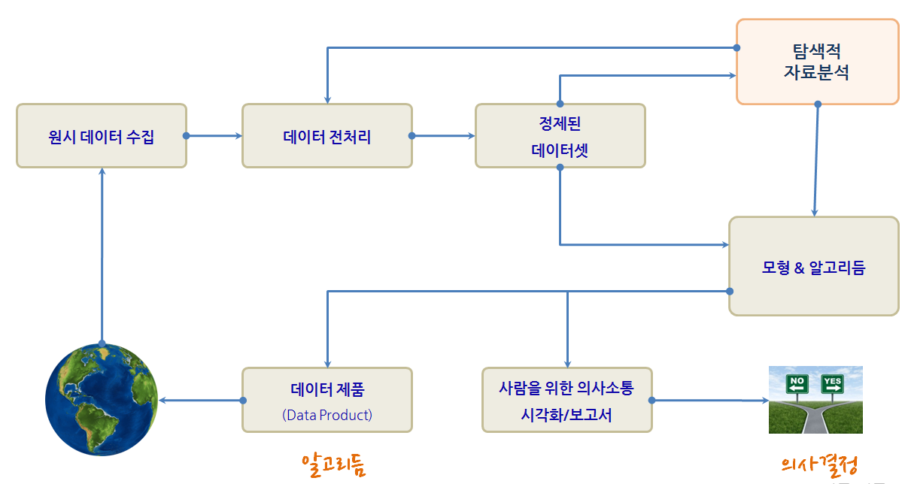

 
> ## 학습목표 {.objectives}
>
> * 기계학습 모형구축에 적용될 데이터를 이해한다.
> * 탐색적 데이터 분석(EDA)을 적용한다.

```{r, include=FALSE}
source("tools/chunk-options.R")
options(warn=-1)
```
```

## 1. [탐색적 데이터 분석](https://en.wikipedia.org/wiki/Exploratory_data_analysis) [^r-marketing]

[^r-marketing]: [ Chapman, Christopher N., McDonnell Feit, Elea (2005), R for Marketing Research and Analytics, Springer Press](http://www.springer.com/us/book/9783319144351)

데이터 과학 프로세스는 현실세계에서 데이터를 수집하고, 데이터를 전처리하고, 정제된 데이터셋을 만든 뒤에 모형과 알고리듬을 개발하여 데이터 과학 결과물을 사람을 위한 의사결정에 사용하는 것이 하나고, 데이터제품을 통해 알고리듬으로 현실세계에 영향을 주는 것이 또 하나다.
특히, 정제된 데이터셋과 모형 & 알고리듬 개발 과정에서 탐색적 자료분석 과정이 꼭 수반된다.

탐색적 자료 분석과정은 미국의 튜키박사에 의해 창안되었고, 가설검증이나 모형을 적용하기 전에 데이터가 스스로에 대해 사람에게 정보를 전달하도록 만드는 방법으로 시각적인 기법을 사용도 하고 5-숫자요약(5-number summary) 등 다양한 방법을 적용한다.



## 2. 데이터 탐색과정

수십년에 걸쳐 개발된 R언어는 수많은 통계학자를 비롯한 다양한 연구자와 실무담당자가 만들어 낸 팩키지와 그들만의 사용법이 존재한다는 사실을 인정하고, 나름대로 효율적이고 효과적인 나만의 방법론을 만들어 나갈 것을 추천한다. 다음에 제시되는 데이터 탐색과정은 그 과정 중 하나일 뿐이니 참고로 활용한다.

1. `readr` 팩키지의 `read_csv` 함수를 사용해서 데이터를 불러오고, 이는 자동으로 `tlb_df` 데이터프레임으로 가져온다. 
1. `tlb_df` 자료형은 기존 전통적인 R을 활용한 자료분석과정을 많이 단축할 수 있다.
    * `dim()` 함수를 사용하여 차원정보, 즉 행과 열 정보를 불러온다.
    * `head()`, `tail()` 함수를 사용해서 데이터프레임 처음과 끝을 살펴본다.
    * `car` 팩키지의 `some()` 함수를 사용해서 임의 행을 추출하여 살펴볼 수 있다.
    * `str()` 함수를 사용해서 데이터프레임 자료구조를 파악한다. 특히, `factor` 요인 범주형 자료를 문자열 자료구조대신 필요하면 변환한다.
1. `summary()` 함수를 사용해서 전체적으로 데이터프레임에 들어있는 데이터셋에 대한 정보를 한번에 확인한다.
    * 동일한 기능이지만, `psych` 라이브러리에 있는 `describe()` 함수를 사용해 기초통계량을 한번에 뽑아낸다.

`store.df` 데이터는 "R for Marketing Research and Analytics" 책에 소개된 데이터를 예제로 사용한다.

```{r store-eda, tidy=FALSE, eval=FALSE}
# tbl_df 자료구조를 데이터프레임 대신 사용한 사례 
library(readr)
store.df <- read_csv("http://r-marketing.r-forge.r-project.org/data/rintro-chapter3.csv")
store.df

# 전체적인 데이터프레임 자료 이해
library("psych")
psych::describe(store.df)
```

```

> ### 마케팅에서 활용되는 일반적인 변환 {.callout}
> 
> 박스-코스 변환(Box-Cox transformation)을 통해 $\lambda$ 변수에 값을 설정해서 정규분포에 대한
> 최적변환을 파악할 수 있는데, `car` 팩키지 `powerTransform()`와 짝궁 함수 `bcPower()`를 사용해도 되지만,
> 일반적으로 마케팅에서 자주 목도되는 일반적인 변환은 다음과 같다.
> 
> |   변수   | 일반적인 변환 |
> |-----------------|--------------------|
> | 매출, 판매수량, 가격, 가구소득 | $log(x)$  |
> | 지리적 거리 | $\frac{1}{x}$, $\frac{1}{x^2}$, $log(x)$ |
> | 효용에 근거한 시장점유율, 선호점유율 | $\frac {e^x}{1+e^x}$ |
> | 우측으로 꼬리가 긴 분포 | $\sqrt{x}, log(x)$ |
> | 좌측으로 꼬리가 긴 분포 | $x^2$ |


> ### R 공식 {.callout}
> 
> 수학공식을 R공식으로 변환해서 표현해야 되는 사유는 자판을 통해 수식을 입력해야 한다는 한계에 기인한다.
> 따라서, 자판에 있는 키보드의 특수기호를 잘 활용하여 가장 가독성이 좋고 입력이 용이하게 나름대로 R에서 
> 구현한 방식은 다음과 같다.
> 
> 1. 주효과에 대해 변수를 입력으로 넣을 `+`를 사용한다.
> 1. 교호작용을 변수간에 표현할 때 `:`을 사용한다. 예를 들어 `x*y`는 `x+y+x:z`와 같다.
> 1. 모든 변수를 표기할 때 `.`을 사용한다. 
> 1. 종속변수와 예측변수를 구분할 때 `~`을 사용한다. `y ~ .`은 데이터프레임에 있는 모든 변수를 사용한다는 의미가 된다.
> 1. 특정변수를 제거할 때는 `-`를 사용한다. `y ~ . -x`는 모든 예측변수를 사용하고, 특정 변수 `x`를 제거한다는 의미가 된다.
> 1. 상수항을 제거할 때는 `-1`을 사용한다.
> 
> 
> | R 공식구문 | 수학 모형 | 설명 |
> |------------|---------------|-----------------------------|
> |`y~x`       | $y_i = \beta_0 + \beta_1 x_i + \epsilon_i$ | `x`를 `y`에 적합시키는 1차 선형회귀식 |
> |`y~x -1`       | $y_i = \beta_1 x_i + \epsilon_i$ | `x`를 `y`에 적합시 절편 없는 1차 선형회귀식 |
> |`y~x+z`       | $y_i = \beta_0 + \beta_1 x_i + \beta_2 z_i +\epsilon_i$ | `x`와 `z`를 `y`에 적합시키는 > 1차 선형회귀식 |
> |`y~x:z`       | $y_i = \beta_0 + \beta_1 x_i \times z_i +\epsilon_i$ | `x`와 `z` 교호작용 항을 `y`에 > 적합시키는 1차 선형회귀식 |
> |`y~x*z`       | $y_i = \beta_0 + \beta_1 x_i + \beta_2 z_i + \beta_1 x_i \times z_i +\epsilon_i$ | > `x`와 `z`, 교호작용항을 `y`에 적합시키는 1차 선형회귀식 |


## 3. 통계 모형 개발과정

통계모형 개발과정은 데이터 과학 프로세스에서 크게 차이가 나지 않는다. 다만, 일반적인 통계모형을 개발할 경우 다음과 같은 과정을 거치게 되고, 지난한 과정이 될 수도 있다.

1. 데이터를 정제하고, 모형에 적합한 데이터(R과 모형 팩키지와 소통이 될 수 있는 데이터형태)가 되도록 준비한다.
1. 변수에 대한 분포를 분석하고 기울어짐이 심한 경우 변수변환도 적용한다.
1. 변수와 변수간에, 종속변수와 설명변수간에 산점도와 상관계수를 계산한다. 특히 변수간 상관관계가 $r > 0.9$ 혹은 근처인 경우 변수를 빼거나 다른 방법을 강구한다.
1. 동일한 척도로 회귀계수를 추정하고 평가하려는 경우, `scale()` 함수로 척도로 표준화한다.
1. 모형을 적합시킨 후에 잔차를 보고, 백색잡음(whitenoise)인지 확인한다. 만약, 잔차에 특정한 패턴이 보이는 경우 패턴을 잡아내는 모형을 새로 개발한다.
    1. `plot()` 함수를 사용해서 이상점이 있는지, 비선형관계를 잘 잡아냈는지 시각적으로 확인한다.
    1. 다양한 모형을 적합시키고 `R^2` 와 `RMSE`, 정확도 등 모형평가 결과가 가장 좋은 것을 선정한다.
    1. 절약성의 원리(principle of parsimony)를 필히 준수하여 가장 간결한 모형이 되도록 노력한다.
1. 최종 모형을 선택하고 모형에 대한 해석결과와 더불어 신뢰구간 정보를 넣어 마무리한다.    


