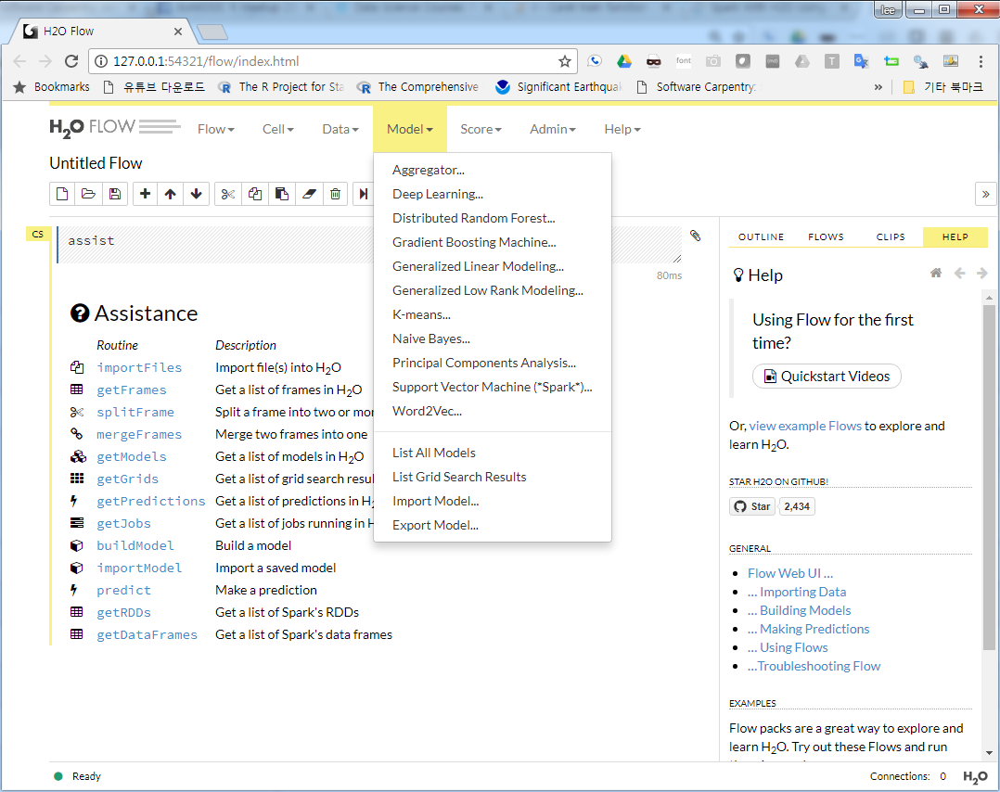

```{r, include=FALSE}
source("tools/chunk-options.R")

library(tidyverse)
library(sparklyr)
library(rsparkling)
library(h2o)
library(caret)

```

## 1. 스파크 기계학습(MLlib) {#spark-mllib}

### 1.1. 스파크 설치 {#spark-setup}

오픈소스 프로젝트에 기반해서 작업을 하는 경우 매우 빠르고 활발하게 작업이 진행되고 있기 때문에
데이터분석에 활용할 스파크 버젼이 무엇인지 정확히 파악하는 것이 중요하다. 
아마도 시작은 설치가능한 버젼확인부터 시작된다.

`spark_available_versions()` 함수를 통해 설치할 적합한 스파크 하둡버전을 선택하고 나서, 
`spark_install()` 명령어를 통해 선택한 버젼을 설치한다.

- `spark_available_versions()`
- `spark_install(version = "2.0.2", hadoop_version = "2.7")`

스파크가 설치되면 설치된 스파크와 자바를 확인해야 하기 때문에 다음 명령어가 특히 유용하다.

- `spark_home_dir()`
- `spark_installed_versions()`
- `Sys.getenv("SPARK_HOME")`
- `Sys.getenv("JAVA_HOME")`
- `spark_disconnect(sc)`: 마지막으로 자원을 반환

``` {r spark-mllib-setup, warning=FALSE, message=FALSE}
# 0. 환경설정 --------------------------------

# 1. 스파크 설정 -----------------------------
## 1.1. 스파크 설치 --------------------------
# spark_available_versions()
# spark_install(version = "2.0.2", hadoop_version = "2.7")

## 1.2. 스파크 실행 --------------------------
config <- spark_config()

config[["spark.sql.hive.thriftServer.singleSession"]] <- "true"
config$sparklyr.cores.local <- 3
config$spark.driver.memory <- "4G"

sc <- spark_connect(master = "local", config = config, spark_home=spark_home_dir(version = "2.0.2"))

# spark_disconnect(sc)

## 1.3. 유용한 명령어 --------------------------
spark_home_dir()
spark_installed_versions()
# Sys.getenv("SPARK_HOME")
Sys.getenv("JAVA_HOME")
```

### 1.2. 붓꽃 예측모형 {#iris-spark-mllib}

`copy_to()` 명령어로 iris 데이터프레임으로 스파크 데이터프레임으로 전달한다. 그리고 나서
이를 `cache`하여 속도를 비약적으로 향상시킨다. 다음으로 전형적인 기계학습 모형 학습과정을
진행하고 나서 예측모형 시각화를 위해 다시 R 데이터프레임으로 가져와서 시각화한다.

``` {r spark-mllib-iris}
# 2. 데이터프레임을 스파크로 전달 ------------
copy_to(sc, iris, "iris_sdf", overwrite = TRUE)
src_tbls(sc)

tbl_cache(sc, "iris_sdf")
iris_tbl <- tbl(sc, 'iris_sdf')

# 3. 기계학습 모형  ------------
## 3.1. 훈련/검증 분할 ---------

iris_split_tbl <- iris_tbl %>% 
  sdf_partition(training = 0.7, testing = 0.3)

iris_split_tbl$training %>% count
iris_split_tbl$testing %>% count

## 3.3. 모형적합 ---------

feature_columns <- iris_split_tbl$training %>% 
  colnames(iris_split_tbl$training) %>% 
  stringr::str_subset("[^Species]")

iris_rf <- iris_split_tbl$training %>%
  ml_random_forest("Species", feature_columns, type = "classification")

iris_responses <- iris_split_tbl$testing %>%
  select(Species) %>%
  collect() %>%
  mutate(
    predicted_species = predict(iris_rf, iris_split_tbl$testing)
  )

table(iris_responses)

## 3.4. 모형 성능 시각화 -----------

ggplot(iris_responses, aes(Species, predicted_species)) +
  geom_jitter(width = 0.15, height=0.15, aes(colour = Species), alpha=0.3) +
  geom_abline(intercept=0, slope=1)

DT::datatable(iris_responses)
```

## 2. 스파크 $H_2 O$ {#spark-h2o}

### 2.1. $H_2 O$ 설치 {#spark-h2o-setup}

$H_2 O$ 는 MLlib에서 지원하는 알고리즘이 상대적으로 한정되어 있어 이를 확장한 고급 기계학습 알고리즘을 제공한다.
`h2o`와 `rsparkling` 팩키지를 설치하고 환경을 설정하면 로컬 컴퓨터에서도 스파크에 고급 기계학습 알고리즘을 
적용시켜 예측성 높은 모형을 개발할 수 있다.

$H_2 O$는 나름 친절하다. `h2o`와 `rsparkling` 설치과정에서 필요한 절차에 대해서 친절하게 설명하고 있어, 
시스템에서 제시하는 내용을 복사하여 붙여넣으면 설치가 간단히 된다.

``` {r spark-h2o-setup, warning=FALSE, message=FALSE}
# 0. 환경설정 --------------------------------

library(tidyverse)
library(sparklyr)
library(rsparkling)
library(h2o)
library(caret)

# https://dzone.com/articles/spark-with-h2o-using-rsparkling-and-sparklyr-in-r

# # The following two commands remove any previously installed H2O packages for R.
# if ("package:h2o" %in% search()) { detach("package:h2o", unload=TRUE) }
# if ("h2o" %in% rownames(installed.packages())) { remove.packages("h2o") }
# 
# # Next, we download packages that H2O depends on.
# pkgs <- c("methods","statmod","stats","graphics","RCurl","jsonlite","tools","utils")
# for (pkg in pkgs) {
#   if (! (pkg %in% rownames(installed.packages()))) { install.packages(pkg) }
# }
# 
# # Now we download, install, and initialize the H2O package for R. 
# # In this case we are using rel-tverberg 2 (3.10.3.2).
# install.packages("h2o", type = "source", repos = "http://h2o-release.s3.amazonaws.com/h2o/rel-tverberg/2/R")
# install.packages("rsparkling")

# detach("package:rsparkling", unload = TRUE)
# if ("package:h2o" %in% search()) { detach("package:h2o", unload = TRUE) }
# if (isNamespaceLoaded("h2o")){ unloadNamespace("h2o") }
# remove.packages("h2o")
# install.packages("h2o", type = "source", repos = "http://h2o-release.s3.amazonaws.com/h2o/rel-ueno/8/R")

# 1. 스파크 설정 -----------------------------
## 1.1. 스파크 설치 --------------------------
# spark_available_versions()
# spark_install(version = "2.1.0", hadoop_version = "2.7")

## 1.2. 스파크 실행 --------------------------

spark_disconnect(sc)

options(rsparkling.sparklingwater.version = "2.0.2")

config <- spark_config()

config[["spark.sql.hive.thriftServer.singleSession"]] <- "true"
config$sparklyr.cores.local <- 3
config$`sparklyr.shell.driver-memory` <- "10G"

sc <- spark_connect(master = "local", config = config, spark_home=spark_home_dir(version = "2.0.2"))

# h2o_flow(sc, strict_version_check = FALSE)
```

`h2o_flow`를 실행시키면 GUI 환경에서 기계학습 모형을 개발할 수 있고 다양한 모형이 지원됨을 시각적으로 확인할 수 있다.



### 2.2. $H_2 O$ Stacking {#spark-h2o-run-model}

GBM, Random Forest 알고리즘으로 독일신용평가 데이터에 예측모형을 개발한다.
그리고 개별적으로 개발된 신용평가 알고리즘을 `Stacking`하여 추가로 예측모형을 만들고 이를 검증데이터에 넣어 성능을 비교한다.


``` {r spark-h2o-stack, warning=FALSE, message=FALSE}
# 2. 신용평가 데이터를 H2O 데이터프레임으로 적재 ------------

data(GermanCredit)
GermanCredit <- GermanCredit %>% 
  select(Class, everything())
assign("credit_df", GermanCredit)

# 3. 예측모형 개발 ------------------
## 3.1. 훈련/검증 데이터 분할 -------

credit_tbl <- copy_to(sc, credit_df, "credit_sdf", overwrite = TRUE)

credit_hf <- as_h2o_frame(sc, credit_tbl, strict_version_check = FALSE)

credit_hf[,1] <- as.factor(credit_hf[,1])

credit_splits <- h2o.splitFrame(credit_hf, c(0.6,0.2))

train <- h2o.assign(credit_splits[[1]], "train.hex")   
valid <- h2o.assign(credit_splits[[2]], "valid.hex")
test  <- h2o.assign(credit_splits[[3]], "test.hex")

## 3.2. GBM -------
credit_gbm <- h2o.gbm(y = "Class",
                  training_frame = train,
                  distribution = "bernoulli",
                  ntrees = 10,
                  max_depth = 3,
                  min_rows = 2,
                  learn_rate = 0.2,
                  nfolds = 10,
                  fold_assignment = "Modulo",
                  keep_cross_validation_predictions = TRUE)
credit_gbm

## 3.3. Random Forest -------
credit_rf <- h2o.randomForest(y = "Class" ,
                          training_frame = train,
                          ntrees = 50,
                          stopping_metric = "AUTO",
                          nfolds = 10,
                          fold_assignment = "Modulo",
                          keep_cross_validation_predictions = TRUE)
credit_rf
```


``` {r spark-h2o-stack-ensemble, warning=FALSE, message=FALSE, eval=FALSE}
## 3.4. 앙상블 : GBM + Random Forest -------
credit_ensemble <- h2o.stackedEnsemble(y="Class",
                                training_frame = train,
                                model_id = "credit_ensemble",
                                selection_strategy = c("choose_all"),
                                base_models = list(credit_gbm@model_id, credit_rf@model_id))

## 3.5. 검증데이터 성능 평가 ---------------
(credit_perf <- h2o.performance(credit_ensemble, newdata = test))
```