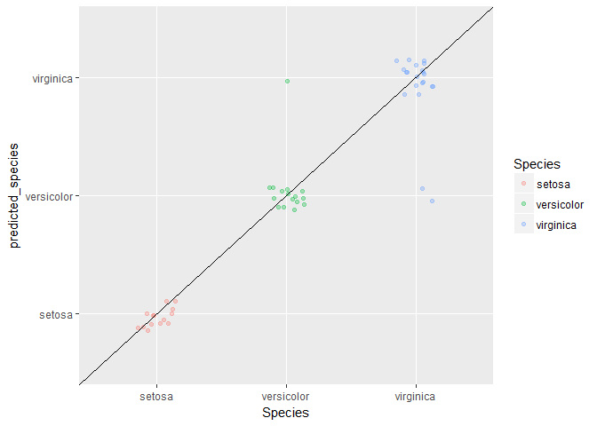

# 기계 학습

## 1. 스파크 기계학습(MLlib) {#spark-mllib}

### 1.1. 스파크 설치 {#spark-setup}

오픈소스 프로젝트에 기반해서 작업을 하는 경우 매우 빠르고 활발하게 작업이 진행되고 있기 때문에
데이터분석에 활용할 스파크 버젼이 무엇인지 정확히 파악하는 것이 중요하다. 
아마도 시작은 설치가능한 버젼확인부터 시작된다.

`spark_available_versions()` 함수를 통해 설치할 적합한 스파크 하둡버전을 선택하고 나서, 
`spark_install()` 명령어를 통해 선택한 버젼을 설치한다.

- `spark_available_versions()`
- `spark_install(version = "2.0.2", hadoop_version = "2.7")`

스파크가 설치되면 설치된 스파크와 자바를 확인해야 하기 때문에 다음 명령어가 특히 유용하다.

- `spark_home_dir()`
- `spark_installed_versions()`
- `Sys.getenv("SPARK_HOME")`
- `Sys.getenv("JAVA_HOME")`
- `spark_disconnect(sc)`: 마지막으로 자원을 반환

~~~{.r}
# 0. 환경설정 --------------------------------

# 1. 스파크 설정 -----------------------------
## 1.1. 스파크 설치 --------------------------
# spark_available_versions()
# spark_install(version = "2.0.2", hadoop_version = "2.7")

## 1.2. 스파크 실행 --------------------------
config <- spark_config()

config[["spark.sql.hive.thriftServer.singleSession"]] <- "true"
config$sparklyr.cores.local <- 3
config$spark.driver.memory <- "4G"

sc <- spark_connect(master = "local", config = config, spark_home=spark_home_dir(version = "2.0.2"))

# spark_disconnect(sc)

## 1.3. 유용한 명령어 --------------------------
spark_home_dir()
~~~

~~~{.output}
[1] "C:\\Users\\chongmu\\AppData\\Local/spark/spark-2.1.0-bin-hadoop2.7"

~~~

~~~{.r}
spark_installed_versions()
~~~

~~~{.output}
  spark hadoop                       dir
1 2.1.0    2.7 spark-2.1.0-bin-hadoop2.7
2 2.0.2    2.7 spark-2.0.2-bin-hadoop2.7

~~~

~~~{.r}
# Sys.getenv("SPARK_HOME")
Sys.getenv("JAVA_HOME")
~~~

~~~{.output}
[1] "C:\\Program Files\\Java\\jdk1.7.0_79"

~~~

### 1.2. 붓꽃 예측모형 {#iris-spark-mllib}

`copy_to()` 명령어로 iris 데이터프레임으로 스파크 데이터프레임으로 전달한다. 그리고 나서
이를 `cache`하여 속도를 비약적으로 향상시킨다. 다음으로 전형적인 기계학습 모형 학습과정을
진행하고 나서 예측모형 시각화를 위해 다시 R 데이터프레임으로 가져와서 시각화한다.

~~~{.r}
# 2. 데이터프레임을 스파크로 전달 ------------
copy_to(sc, iris, "iris_sdf", overwrite = TRUE)
~~~

~~~{.output}
# Source:   table<iris_sdf> [?? x 5]
# Database: spark_connection
   Sepal_Length Sepal_Width Petal_Length Petal_Width Species
          <dbl>       <dbl>        <dbl>       <dbl>   <chr>
 1          5.1         3.5          1.4         0.2  setosa
 2          4.9         3.0          1.4         0.2  setosa
 3          4.7         3.2          1.3         0.2  setosa
 4          4.6         3.1          1.5         0.2  setosa
 5          5.0         3.6          1.4         0.2  setosa
 6          5.4         3.9          1.7         0.4  setosa
 7          4.6         3.4          1.4         0.3  setosa
 8          5.0         3.4          1.5         0.2  setosa
 9          4.4         2.9          1.4         0.2  setosa
10          4.9         3.1          1.5         0.1  setosa
# ... with more rows

~~~

~~~{.r}
src_tbls(sc)
~~~

~~~{.output}
[1] "iris_sdf"

~~~

~~~{.r}
tbl_cache(sc, "iris_sdf")
iris_tbl <- tbl(sc, 'iris_sdf')

# 3. 기계학습 모형  ------------
## 3.1. 훈련/검증 분할 ---------

iris_split_tbl <- iris_tbl %>% 
  sdf_partition(training = 0.7, testing = 0.3)

iris_split_tbl$training %>% count
~~~

~~~{.output}
# Source:   lazy query [?? x 1]
# Database: spark_connection
      n
  <dbl>
1    99

~~~

~~~{.r}
iris_split_tbl$testing %>% count
~~~

~~~{.output}
# Source:   lazy query [?? x 1]
# Database: spark_connection
      n
  <dbl>
1    51

~~~

~~~{.r}
## 3.3. 모형적합 ---------

feature_columns <- iris_split_tbl$training %>% 
  colnames(iris_split_tbl$training) %>% 
  stringr::str_subset("[^Species]")

iris_rf <- iris_split_tbl$training %>%
  ml_random_forest("Species", feature_columns, type = "classification")
~~~

~~~{.output}
* No rows dropped by 'na.omit' call

~~~

~~~{.r}
iris_responses <- iris_split_tbl$testing %>%
  select(Species) %>%
  collect() %>%
  mutate(
    predicted_species = predict(iris_rf, iris_split_tbl$testing)
  )

table(iris_responses)
~~~

~~~{.output}
            predicted_species
Species      setosa versicolor virginica
  setosa         14          0         0
  versicolor      0         15         1
  virginica       0          2        19

~~~

~~~{.r}
## 3.4. 모형 성능 시각화 -----------

ggplot(iris_responses, aes(Species, predicted_species)) +
  geom_jitter(width = 0.15, height=0.15, aes(colour = Species), alpha=0.3) +
  geom_abline(intercept=0, slope=1)
~~~

~~~{.r}
DT::datatable(iris_responses)
~~~

<!--html_preserve-->

<!--/html_preserve-->

## 2. 스파크 $H_2 O$ {#spark-h2o}

### 2.1. $H_2 O$ 설치 {#spark-h2o-setup}

$H_2 O$ 는 MLlib에서 지원하는 알고리즘이 상대적으로 한정되어 있어 이를 확장한 고급 기계학습 알고리즘을 제공한다.
`h2o`와 `rsparkling` 팩키지를 설치하고 환경을 설정하면 로컬 컴퓨터에서도 스파크에 고급 기계학습 알고리즘을 
적용시켜 예측성 높은 모형을 개발할 수 있다.

$H_2 O$는 나름 친절하다. `h2o`와 `rsparkling` 설치과정에서 필요한 절차에 대해서 친절하게 설명하고 있어, 
시스템에서 제시하는 내용을 복사하여 붙여넣으면 설치가 간단히 된다.

~~~{.r}
# 0. 환경설정 --------------------------------

library(tidyverse)
library(sparklyr)
library(rsparkling)
library(h2o)
library(caret)

# https://dzone.com/articles/spark-with-h2o-using-rsparkling-and-sparklyr-in-r

# # The following two commands remove any previously installed H2O packages for R.
# if ("package:h2o" %in% search()) { detach("package:h2o", unload=TRUE) }
# if ("h2o" %in% rownames(installed.packages())) { remove.packages("h2o") }
# 
# # Next, we download packages that H2O depends on.
# pkgs <- c("methods","statmod","stats","graphics","RCurl","jsonlite","tools","utils")
# for (pkg in pkgs) {
#   if (! (pkg %in% rownames(installed.packages()))) { install.packages(pkg) }
# }
# 
# # Now we download, install, and initialize the H2O package for R. 
# # In this case we are using rel-tverberg 2 (3.10.3.2).
# install.packages("h2o", type = "source", repos = "http://h2o-release.s3.amazonaws.com/h2o/rel-tverberg/2/R")
# install.packages("rsparkling")

# detach("package:rsparkling", unload = TRUE)
# if ("package:h2o" %in% search()) { detach("package:h2o", unload = TRUE) }
# if (isNamespaceLoaded("h2o")){ unloadNamespace("h2o") }
# remove.packages("h2o")
# install.packages("h2o", type = "source", repos = "http://h2o-release.s3.amazonaws.com/h2o/rel-ueno/8/R")

# 1. 스파크 설정 -----------------------------
## 1.1. 스파크 설치 --------------------------
# spark_available_versions()
# spark_install(version = "2.1.0", hadoop_version = "2.7")

## 1.2. 스파크 실행 --------------------------

spark_disconnect(sc)

options(rsparkling.sparklingwater.version = "2.0.2")

config <- spark_config()

config[["spark.sql.hive.thriftServer.singleSession"]] <- "true"
config$sparklyr.cores.local <- 3
config$`sparklyr.shell.driver-memory` <- "10G"

sc <- spark_connect(master = "local", config = config, spark_home=spark_home_dir(version = "2.0.2"))

# h2o_flow(sc, strict_version_check = FALSE)
~~~

`h2o_flow`를 실행시키면 GUI 환경에서 기계학습 모형을 개발할 수 있고 다양한 모형이 지원됨을 시각적으로 확인할 수 있다.

### 2.2. $H_2 O$ Stacking {#spark-h2o-run-model}

GBM, Random Forest 알고리즘으로 독일신용평가 데이터에 예측모형을 개발한다.
그리고 개별적으로 개발된 신용평가 알고리즘을 `Stacking`하여 추가로 예측모형을 만들고 이를 검증데이터에 넣어 성능을 비교한다.

~~~{.r}
# 2. 신용평가 데이터를 H2O 데이터프레임으로 적재 ------------

data(GermanCredit)
GermanCredit <- GermanCredit %>% 
  select(Class, everything())
assign("credit_df", GermanCredit)

# 3. 예측모형 개발 ------------------
## 3.1. 훈련/검증 데이터 분할 -------

credit_tbl <- copy_to(sc, credit_df, "credit_sdf", overwrite = TRUE)

credit_hf <- as_h2o_frame(sc, credit_tbl, strict_version_check = FALSE)

credit_hf[,1] <- as.factor(credit_hf[,1])

credit_splits <- h2o.splitFrame(credit_hf, c(0.6,0.2))

train <- h2o.assign(credit_splits[[1]], "train.hex")   
valid <- h2o.assign(credit_splits[[2]], "valid.hex")
test  <- h2o.assign(credit_splits[[3]], "test.hex")

## 3.2. GBM -------
credit_gbm <- h2o.gbm(y = "Class",
                  training_frame = train,
                  distribution = "bernoulli",
                  ntrees = 10,
                  max_depth = 3,
                  min_rows = 2,
                  learn_rate = 0.2,
                  nfolds = 10,
                  fold_assignment = "Modulo",
                  keep_cross_validation_predictions = TRUE)
~~~

~~~{.output}

  |                                                                       
  |                                                                 |   0%
  |                                                                       
  |==============                                                   |  22%
  |                                                                       
  |=================================================================| 100%

~~~

~~~{.r}
credit_gbm
~~~

~~~{.output}
Model Details:
==============

H2OBinomialModel: gbm
Model ID:  GBM_model_R_1505962523945_1 
Model Summary: 
  number_of_trees number_of_internal_trees model_size_in_bytes min_depth
1              10                       10                1620         3
  max_depth mean_depth min_leaves max_leaves mean_leaves
1         3    3.00000          8          8     8.00000

H2OBinomialMetrics: gbm
** Reported on training data. **

MSE:  0.1384082
RMSE:  0.3720326
LogLoss:  0.4385317
Mean Per-Class Error:  0.2533495
AUC:  0.8876135
Gini:  0.775227

Confusion Matrix (vertical: actual; across: predicted) for F1-optimal threshold:
       Bad Good    Error      Rate
Bad    100   89 0.470899   =89/189
Good    15  404 0.035800   =15/419
Totals 115  493 0.171053  =104/608

Maximum Metrics: Maximum metrics at their respective thresholds
                        metric threshold    value idx
1                       max f1  0.503012 0.885965 267
2                       max f2  0.451031 0.935659 287
3                 max f0point5  0.666685 0.882512 176
4                 max accuracy  0.540459 0.830592 246
5                max precision  0.927072 1.000000   0
6                   max recall  0.339711 1.000000 319
7              max specificity  0.927072 1.000000   0
8             max absolute_mcc  0.617214 0.589820 203
9   max min_per_class_accuracy  0.649440 0.794749 186
10 max mean_per_class_accuracy  0.666685 0.807011 176

Gains/Lift Table: Extract with `h2o.gainsLift(<model>, <data>)` or `h2o.gainsLift(<model>, valid=<T/F>, xval=<T/F>)`

H2OBinomialMetrics: gbm
** Reported on cross-validation data. **
** 10-fold cross-validation on training data (Metrics computed for combined holdout predictions) **

MSE:  0.1726399
RMSE:  0.4154995
LogLoss:  0.5182024
Mean Per-Class Error:  0.3910735
AUC:  0.7716975
Gini:  0.5433951

Confusion Matrix (vertical: actual; across: predicted) for F1-optimal threshold:
       Bad Good    Error      Rate
Bad     52  137 0.724868  =137/189
Good    24  395 0.057279   =24/419
Totals  76  532 0.264803  =161/608

Maximum Metrics: Maximum metrics at their respective thresholds
                        metric threshold    value idx
1                       max f1  0.467492 0.830705 347
2                       max f2  0.285537 0.920475 391
3                 max f0point5  0.696124 0.816993 187
4                 max accuracy  0.565032 0.743421 287
5                max precision  0.930133 1.000000   0
6                   max recall  0.285537 1.000000 391
7              max specificity  0.930133 1.000000   0
8             max absolute_mcc  0.696124 0.407058 187
9   max min_per_class_accuracy  0.662493 0.703704 214
10 max mean_per_class_accuracy  0.696124 0.719697 187

Gains/Lift Table: Extract with `h2o.gainsLift(<model>, <data>)` or `h2o.gainsLift(<model>, valid=<T/F>, xval=<T/F>)`
Cross-Validation Metrics Summary: 
                              mean          sd cv_1_valid cv_2_valid
accuracy                0.75822407  0.03518893 0.78688526 0.72131145
auc                     0.77977586 0.031376038 0.79642856 0.69055945
err                     0.24177596  0.03518893 0.21311475 0.27868852
err_count                     14.7   2.1459265       13.0       17.0
f0point5                0.78730243  0.03244072  0.8114035  0.7414449
f1                       0.8451035 0.025603542 0.85057473  0.8210526
f2                       0.9129778 0.020557296  0.8937198  0.9198113
lift_top_group           1.4581895  0.07291327      1.525  1.5641025
logloss                 0.51816195  0.03923615  0.5252186 0.61503017
max_per_class_error     0.70695186  0.09509299 0.47619048 0.77272725
mcc                     0.37891233  0.07519153  0.5070943  0.3978432
mean_per_class_accuracy  0.6291873  0.04093588 0.72440475  0.6136364
mean_per_class_error     0.3708127  0.04093588 0.27559525 0.38636363
mse                     0.17262794  0.01643208 0.17465311 0.20946606
precision                0.7532538 0.036492653 0.78723407  0.6964286
r2                      0.18755902 0.036957473 0.22632828 0.09158135
recall                   0.9653264 0.022699159      0.925        1.0
rmse                    0.41453293 0.019879285  0.4179152 0.45767462
specificity             0.29304814  0.09509299 0.52380955 0.22727273
                        cv_3_valid cv_4_valid cv_5_valid cv_6_valid
accuracy                 0.6721311 0.73770493  0.8196721  0.8360656
auc                      0.7488345  0.7714286  0.8138889  0.8318841
err                     0.32786885 0.26229507 0.18032786 0.16393442
err_count                     20.0       16.0       11.0       10.0
f0point5                0.71428573   0.766129  0.8364312 0.85877866
f1                      0.78723407 0.82608694  0.8910891        0.9
f2                      0.87677723  0.8962264  0.9533898  0.9453781
lift_top_group           1.5641025      1.525  1.3555555   1.326087
logloss                 0.56551194 0.54227716 0.44716564 0.44254246
max_per_class_error      0.8181818  0.6666667     0.6875        0.6
mcc                      0.2104832 0.37958968 0.50111485 0.51105785
mean_per_class_accuracy 0.56526804 0.64166665    0.65625  0.6891304
mean_per_class_error    0.43473193 0.35833332    0.34375 0.31086957
mse                     0.19514203 0.18236114 0.14153007 0.14050592
precision                0.6727273  0.7307692  0.8035714  0.8333333
r2                      0.15370221  0.1921836  0.2685647 0.24228613
recall                  0.94871795       0.95        1.0  0.9782609
rmse                    0.44174883 0.42703763 0.37620482  0.3748412
specificity             0.18181819 0.33333334     0.3125        0.4
                        cv_7_valid cv_8_valid cv_9_valid cv_10_valid
accuracy                  0.704918 0.78688526 0.73333335  0.78333336
auc                      0.7471396 0.84492755    0.75171   0.8009576
err                     0.29508197 0.21311475 0.26666668  0.21666667
err_count                     18.0       13.0       16.0        13.0
f0point5                 0.7352941 0.81560284  0.7706093  0.82304525
f1                      0.79545456  0.8761905 0.84313726  0.86021507
f2                      0.86633664 0.94650203 0.93073595   0.9009009
lift_top_group           1.6052631   1.326087  1.3953488   1.3953488
logloss                 0.57391864 0.45821205  0.5254805  0.48626274
max_per_class_error     0.65217394  0.8666667  0.9411765   0.5882353
mcc                     0.33894622 0.32242024 0.20705406   0.4135198
mean_per_class_accuracy 0.63443935 0.56666666  0.5294118  0.67099863
mean_per_class_error    0.36556065 0.43333334 0.47058824  0.32900137
mse                     0.19727182 0.14734238   0.178104   0.1599028
precision                      0.7   0.779661  0.7288136         0.8
r2                      0.16012765 0.20541884 0.12288041  0.21251704
recall                  0.92105263        1.0        1.0   0.9302326
rmse                    0.44415292 0.38385203  0.4220237  0.39987847
specificity              0.3478261 0.13333334 0.05882353   0.4117647

~~~

~~~{.r}
## 3.3. Random Forest -------
credit_rf <- h2o.randomForest(y = "Class" ,
                          training_frame = train,
                          ntrees = 50,
                          stopping_metric = "AUTO",
                          nfolds = 10,
                          fold_assignment = "Modulo",
                          keep_cross_validation_predictions = TRUE)
~~~

~~~{.output}

  |                                                                       
  |                                                                 |   0%
  |                                                                       
  |=                                                                |   1%
  |                                                                       
  |=====================                                            |  33%
  |                                                                       
  |============================================                     |  68%
  |                                                                       
  |=======================================================          |  84%
  |                                                                       
  |=================================================================| 100%

~~~

~~~{.r}
credit_rf
~~~

~~~{.output}
Model Details:
==============

H2OBinomialModel: drf
Model ID:  DRF_model_R_1505962523945_475 
Model Summary: 
  number_of_trees number_of_internal_trees model_size_in_bytes min_depth
1              50                       50               85041        12
  max_depth mean_depth min_leaves max_leaves mean_leaves
1        20   16.96000        116        148   129.58000

H2OBinomialMetrics: drf
** Reported on training data. **
** Metrics reported on Out-Of-Bag training samples **

MSE:  0.1752964
RMSE:  0.4186841
LogLoss:  0.628012
Mean Per-Class Error:  0.4210516
AUC:  0.7596444
Gini:  0.5192888

Confusion Matrix (vertical: actual; across: predicted) for F1-optimal threshold:
       Bad Good    Error      Rate
Bad     33  156 0.825397  =156/189
Good     7  412 0.016706    =7/419
Totals  40  568 0.268092  =163/608

Maximum Metrics: Maximum metrics at their respective thresholds
                        metric threshold    value idx
1                       max f1  0.333333 0.834853 183
2                       max f2  0.333333 0.918004 183
3                 max f0point5  0.558824 0.815091 124
4                 max accuracy  0.521739 0.761513 136
5                max precision  0.960000 0.957447   3
6                   max recall  0.125000 1.000000 208
7              max specificity  1.000000 0.989418   0
8             max absolute_mcc  0.521739 0.417771 136
9   max min_per_class_accuracy  0.657895 0.684964  89
10 max mean_per_class_accuracy  0.564815 0.701506 121

Gains/Lift Table: Extract with `h2o.gainsLift(<model>, <data>)` or `h2o.gainsLift(<model>, valid=<T/F>, xval=<T/F>)`

H2OBinomialMetrics: drf
** Reported on cross-validation data. **
** 10-fold cross-validation on training data (Metrics computed for combined holdout predictions) **

MSE:  0.1756828
RMSE:  0.4191453
LogLoss:  0.5777053
Mean Per-Class Error:  0.3710018
AUC:  0.7598528
Gini:  0.5197055

Confusion Matrix (vertical: actual; across: predicted) for F1-optimal threshold:
       Bad Good    Error      Rate
Bad     65  124 0.656085  =124/189
Good    36  383 0.085919   =36/419
Totals 101  507 0.263158  =160/608

Maximum Metrics: Maximum metrics at their respective thresholds
                        metric threshold    value idx
1                       max f1  0.472000 0.827214 120
2                       max f2  0.240000 0.920475 156
3                 max f0point5  0.708333 0.809141  66
4                 max accuracy  0.530000 0.743421 110
5                max precision  0.908333 0.945055  19
6                   max recall  0.240000 1.000000 156
7              max specificity  1.000000 0.994709   0
8             max absolute_mcc  0.708333 0.392748  66
9   max min_per_class_accuracy  0.660000 0.687831  80
10 max mean_per_class_accuracy  0.708333 0.712120  66

Gains/Lift Table: Extract with `h2o.gainsLift(<model>, <data>)` or `h2o.gainsLift(<model>, valid=<T/F>, xval=<T/F>)`
Cross-Validation Metrics Summary: 
                              mean          sd cv_1_valid cv_2_valid
accuracy                 0.7567213 0.037745703 0.73770493  0.7704918
auc                     0.76803946 0.040450066  0.7797619 0.68648016
err                     0.24327868 0.037745703 0.26229507 0.22950819
err_count                     14.8   2.3194828       16.0       14.0
f0point5                 0.7881361 0.037964888  0.7708333  0.7768924
f1                      0.84527475 0.024472434 0.82222223 0.84782606
f2                       0.9133809 0.014972528 0.88095236 0.93301433
lift_top_group            1.145369   0.4097535      1.525        0.0
logloss                 0.57737964  0.13902542  0.5296731  1.1462053
max_per_class_error      0.7050754  0.13102019 0.61904764  0.6363636
mcc                     0.37609005  0.08648083 0.37810475  0.5172828
mean_per_class_accuracy  0.6308418 0.056141216  0.6529762  0.6818182
mean_per_class_error     0.3691582 0.056141216 0.34702381  0.3181818
mse                     0.17563058 0.016481157 0.17734563 0.20731471
precision               0.75480145  0.04566057       0.74  0.7358491
r2                      0.17314719  0.03830502 0.21440104 0.10091139
recall                  0.96675897 0.024309646      0.925        1.0
rmse                     0.4181441 0.019825457 0.42112425 0.45531824
specificity             0.29492462  0.13102019  0.3809524 0.36363637
                        cv_3_valid cv_4_valid cv_5_valid cv_6_valid
accuracy                 0.6721311  0.6885246 0.75409836  0.8032787
auc                     0.69289047  0.7297619 0.74722224 0.84927535
err                     0.32786885  0.3114754 0.24590164 0.19672132
err_count                     20.0       19.0       15.0       12.0
f0point5                 0.7090909  0.7246377  0.7894737  0.8396947
f1                      0.79591835  0.8080808 0.85714287       0.88
f2                      0.90697676   0.913242     0.9375 0.92436975
lift_top_group                 0.0      1.525  1.3555555   1.326087
logloss                  0.6047508  0.5637623  0.5056074   0.430703
max_per_class_error     0.90909094  0.9047619     0.9375  0.6666667
mcc                     0.24513762 0.25410274 0.21650635  0.3916152
mean_per_class_accuracy 0.54545456 0.54761904    0.53125 0.64492756
mean_per_class_error    0.45454547 0.45238096    0.46875 0.35507247
mse                      0.2049954 0.19331348 0.16768973 0.13802642
precision               0.66101694  0.6779661       0.75  0.8148148
r2                      0.11096985 0.14366731  0.1333702 0.25565755
recall                         1.0        1.0        1.0 0.95652175
rmse                    0.45276418  0.4396743 0.40949935 0.37151906
specificity             0.09090909  0.0952381     0.0625 0.33333334
                        cv_7_valid cv_8_valid cv_9_valid cv_10_valid
accuracy                0.72131145  0.8196721       0.75        0.85
auc                     0.74313504  0.8369565 0.76675785  0.84815323
err                     0.27868852 0.18032786       0.25        0.15
err_count                     17.0       11.0       15.0         9.0
f0point5                0.74786323       0.86  0.7818182  0.88105726
f1                       0.8045977 0.88659793 0.85148513   0.8988764
f2                       0.8706468  0.9148936  0.9347826   0.9174312
lift_top_group           1.6052631   1.326087  1.3953488   1.3953488
logloss                 0.57197726 0.46438715  0.4973201   0.4594097
max_per_class_error      0.6086956 0.53333336 0.88235295   0.3529412
mcc                      0.3808187 0.46694973 0.29533216  0.61505055
mean_per_class_accuracy  0.6561785 0.70072466  0.5588235   0.7886457
mean_per_class_error     0.3438215 0.29927537 0.44117647  0.21135432
mse                     0.19666086 0.15143563 0.17076987  0.14875413
precision               0.71428573 0.84313726  0.7413793   0.8695652
r2                      0.16272879 0.18334493 0.15899928  0.26742148
recall                  0.92105263  0.9347826        1.0   0.9302326
rmse                     0.4434646  0.3891473 0.41324311  0.38568658
specificity             0.39130434 0.46666667 0.11764706  0.64705884

~~~

~~~{.r}
## 3.4. 앙상블 : GBM + Random Forest -------
credit_ensemble <- h2o.stackedEnsemble(y="Class",
                                training_frame = train,
                                model_id = "credit_ensemble",
                                selection_strategy = c("choose_all"),
                                base_models = list(credit_gbm@model_id, credit_rf@model_id))

## 3.5. 검증데이터 성능 평가 ---------------
(credit_perf <- h2o.performance(credit_ensemble, newdata = test))
~~~
