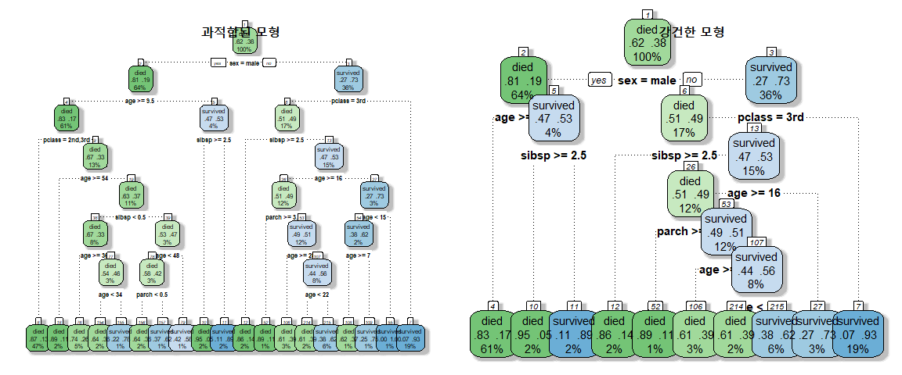
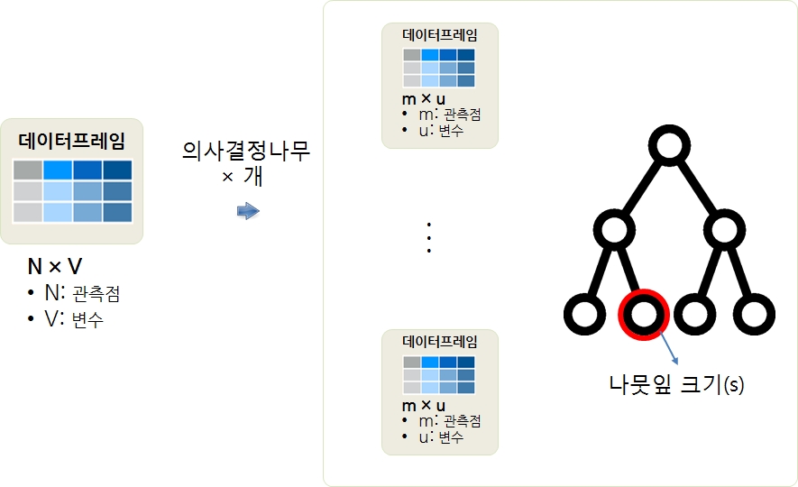

# 기계 학습

## 1. 지도학습 예측모형 [^lime-meetup] {#from-reg-to-h2o-overview}

예측할 결과가 주어진 지도학습 모형을 전통적인 회귀모형에서 정확도를 획기적으로 높인 
기계학습모형까지 살펴본다. 선형 회귀모형은 설명을 통한 커뮤니케이션하기는 좋으나, 
정확도가 상대적으로 떨어지고, 신경망 모형을 필두로한 최근 예측모형은 정확도는 높으나 
설명을 통한 커뮤니케이션 능력이 좋지 않다.

이를 극복하기 위해서 전통적으로 GAM, MARS, SLIM(supersparse linear integer models), Rule lists 방법론이 제시되었고, 다른 한편으로는 [LIME](https://github.com/marcotcr/lime)도 동일한 목적 성취를 위한 다른 접근방법을 취하고 있다.

[^lime-meetup]: [Interpretability in conversation with Patrick Hall and Sameer Singh](http://blog.fastforwardlabs.com/2017/09/11/interpretability-webinar.html)

## 2. 붓꽃 데이터 {#iris-data}

[UCI 데이터 저장소](https://archive.ics.uci.edu/ml/datasets/Iris)에서 붓꽃데이터를 가져와서 데이터를 전처리한다.
그리고, 회귀모형부터 $H2O$에서 제공하는 고급 예측모형까지 적합한다.

~~~{.r}
# 0. 환경설정 --------------------------------

#library(tidyverse)
#library(stringr)

# 1. 데이터 가져오기 --------------------------------
# https://archive.ics.uci.edu/ml/datasets/Iris

iris_df <- read_csv("https://archive.ics.uci.edu/ml/machine-learning-databases/iris/iris.data", col_names = FALSE)
~~~

~~~{.output}
Parsed with column specification:
cols(
  X1 = col_double(),
  X2 = col_double(),
  X3 = col_double(),
  X4 = col_double(),
  X5 = col_character()
)

~~~

~~~{.r}
# 2. 데이터 전처리 --------------------------------

iris_df <- iris_df %>% rename(sepal_length = X1,
                   sepal_width = X2,
                   petal_length = X3,
                   petal_width = X4,
                   class = X5) %>% 
  mutate(class = str_replace(class, "Iris-", "")) %>% 
  mutate(class = factor(class, levels = c("setosa", "versicolor", "virginica")))

DT::datatable(iris_df)
~~~

<!--html_preserve-->

<!--/html_preserve-->

~~~{.r}
# 3. 데이터프레임 저장 --------------------------------

#dir.create("data_processed")
#saveRDS(iris_df, "data_processed/iris_df.rds")
~~~

## 3. 예측모형 {#predictive-model}

### 3.1. 의사결정나무 모형 [^iris-tree] {#iris-tree}

[^iris-tree]: [Building a classification tree in R](https://davetang.org/muse/2013/03/12/building-a-classification-tree-in-r/)

가장 먼저, 탐색적 데이터 분석을 통해서 붓꽃 종류를 분류할 수 있는 변수를 시각적으로 확연히 확인할 수 있다.
특히 평렬그래프(`parallelplot`)을 통해서 보면 확연한 붓꽃종을 분류하는데 중요한 역할을 하는 변수를 확인할 수 있다.

~~~{.r}
# 0. 환경설정 --------------------------------

# library(rpart)
# library(lattice)
# library(tree)
# library(rpart)
# library(rattle)

# 2. 탐색적 데이터 분석 -----------------------------

super.sym <- trellis.par.get("superpose.symbol")

splom( ~ iris_df[1:4], groups = class, data = iris_df,
      panel = panel.superpose,
      key = list(title = "붓꽃 3종 산점도",
                 columns = 3, 
                 points = list(pch = super.sym$pch[1:3],
                               col = super.sym$col[1:3]),
                 text = list(c("Setosa", "Versicolor", "Virginica"))))
~~~

~~~{.r}
parallelplot( ~ iris_df[1:4], iris_df, groups = class,
              horizontal.axis = FALSE, scales = list(x = list(rot = 90))) 
~~~

나무모형을 적합시켜 보면 150 관측점 중 4개만 오분류가 되어 성능도 좋은 것으로 판별할 수 있다.
`class ~ .` 공식을 활용하여 전체 변수를 모두 사용해도 별반 차이는 없다. 

~~~{.r}
# 3. 나무모형 -----------------------------
## 3.1. `tree` 모형 시각화 ----------------
iris_tree <- tree(class ~ petal_length + petal_width, data = iris_df)
summary(iris_tree)
~~~

~~~{.output}

Classification tree:
tree(formula = class ~ petal_length + petal_width, data = iris_df)
Number of terminal nodes:  5 
Residual mean deviance:  0.157 = 22.77 / 145 
Misclassification error rate: 0.02667 = 4 / 150 

~~~

~~~{.r}
plot(iris_tree)
text(iris_tree)
~~~

~~~{.r}
## `tree` 모형 시각화
with(iris_df,
     plot(petal_length, petal_width, pch=19, col=class))

partition.tree(iris_tree, label="class",add=TRUE)

par(xpd=TRUE)
legend(7.5, 2.5,legend=unique(iris_df$class), col=unique(as.numeric(iris_df$class)), pch=19)
~~~

~~~{.r}
## 3.2. `tree` 모형 ----------------
iris_full_tree <- tree(class ~ ., data = iris_df)
summary(iris_full_tree)
~~~

~~~{.output}

Classification tree:
tree(formula = class ~ ., data = iris_df)
Variables actually used in tree construction:
[1] "petal_length" "petal_width"  "sepal_length"
Number of terminal nodes:  6 
Residual mean deviance:  0.1253 = 18.05 / 144 
Misclassification error rate: 0.02667 = 4 / 150 

~~~

`rpart`와 `tree`는 거의 차이가 없고, `tree`가 작성된 사유는 오래전에 S로 구현된 버그 추적용으로 
개발된 것이고, `rpart`는 C로 작성되어 훨씬 더 빠르고 기능도 확장되었다. [^rpart-tree-comp]

[^rpart-tree-comp]: [Brian Ripley - Difference between "tree" and "rpart"](https://stat.ethz.ch/pipermail/r-help/2005-May/070922.html)

~~~{.r}
# 4. rpart 나무모형 -----------------------------

iris_rpart <- rpart(class ~ ., data=iris_df, method="class")
summary(iris_rpart)
~~~

~~~{.output}
Call:
rpart(formula = class ~ ., data = iris_df, method = "class")
  n= 150 

    CP nsplit rel error xerror       xstd
1 0.50      0      1.00   1.12 0.05326662
2 0.44      1      0.50   0.67 0.06088788
3 0.01      2      0.06   0.10 0.03055050

Variable importance
 petal_width petal_length sepal_length  sepal_width 
          34           31           21           13 

Node number 1: 150 observations,    complexity param=0.5
  predicted class=setosa      expected loss=0.6666667  P(node) =1
    class counts:    50    50    50
   probabilities: 0.333 0.333 0.333 
  left son=2 (50 obs) right son=3 (100 obs)
  Primary splits:
      petal_length < 2.45 to the left,  improve=50.00000, (0 missing)
      petal_width  < 0.8  to the left,  improve=50.00000, (0 missing)
      sepal_length < 5.45 to the left,  improve=34.16405, (0 missing)
      sepal_width  < 3.35 to the right, improve=18.05556, (0 missing)
  Surrogate splits:
      petal_width  < 0.8  to the left,  agree=1.000, adj=1.00, (0 split)
      sepal_length < 5.45 to the left,  agree=0.920, adj=0.76, (0 split)
      sepal_width  < 3.35 to the right, agree=0.827, adj=0.48, (0 split)

Node number 2: 50 observations
  predicted class=setosa      expected loss=0  P(node) =0.3333333
    class counts:    50     0     0
   probabilities: 1.000 0.000 0.000 

Node number 3: 100 observations,    complexity param=0.44
  predicted class=versicolor  expected loss=0.5  P(node) =0.6666667
    class counts:     0    50    50
   probabilities: 0.000 0.500 0.500 
  left son=6 (54 obs) right son=7 (46 obs)
  Primary splits:
      petal_width  < 1.75 to the left,  improve=38.969400, (0 missing)
      petal_length < 4.75 to the left,  improve=37.353540, (0 missing)
      sepal_length < 6.15 to the left,  improve=10.686870, (0 missing)
      sepal_width  < 2.45 to the left,  improve= 3.555556, (0 missing)
  Surrogate splits:
      petal_length < 4.75 to the left,  agree=0.91, adj=0.804, (0 split)
      sepal_length < 6.15 to the left,  agree=0.73, adj=0.413, (0 split)
      sepal_width  < 2.95 to the left,  agree=0.67, adj=0.283, (0 split)

Node number 6: 54 observations
  predicted class=versicolor  expected loss=0.09259259  P(node) =0.36
    class counts:     0    49     5
   probabilities: 0.000 0.907 0.093 

Node number 7: 46 observations
  predicted class=virginica   expected loss=0.02173913  P(node) =0.3066667
    class counts:     0     1    45
   probabilities: 0.000 0.022 0.978 

~~~

~~~{.r}
iris_rpart_pred <- predict(iris_rpart, type="class")
table(iris_rpart_pred, iris_df$class)
~~~

~~~{.output}
               
iris_rpart_pred setosa versicolor virginica
     setosa         50          0         0
     versicolor      0         49         5
     virginica       0          1        45

~~~

~~~{.r}
fancyRpartPlot(iris_rpart, main="Iris", caption="")
~~~

데이터를 바꾸어서 과적합 방지를 위해 나무의 가지를 쳐내야만 한다.
이를 위해서는 기준이 필요하고 대체로 `which.min` 함수를 사용해서 "xerror"가 최소화되는 
"CP" 값을 선정하고 `prune` 함수를 사용해서 가지를 쳐낸다.

[]: [Quick-R, Tree-Based Models](http://www.statmethods.net/advstats/cart.html)

~~~{.r}
# 5. 강건한 나무모형  -----------------------------
library(rpart.plot)
data("ptitanic")
titanic_rpart <- rpart(survived ~ ., data = ptitanic, method="class", control = rpart.control(cp = 0.0001))
printcp(titanic_rpart)
~~~

~~~{.output}

Classification tree:
rpart(formula = survived ~ ., data = ptitanic, method = "class", 
    control = rpart.control(cp = 1e-04))

Variables actually used in tree construction:
[1] age    parch  pclass sex    sibsp 

Root node error: 500/1309 = 0.38197

n= 1309 

         CP nsplit rel error xerror     xstd
1 0.4240000      0     1.000  1.000 0.035158
2 0.0210000      1     0.576  0.576 0.029976
3 0.0150000      3     0.534  0.568 0.029825
4 0.0113333      5     0.504  0.556 0.029595
5 0.0025714      9     0.458  0.512 0.028701
6 0.0020000     16     0.440  0.528 0.029035
7 0.0001000     18     0.436  0.524 0.028952

~~~

~~~{.r}
## 과적합을 방지한 강건한 모형
bestcp <- titanic_rpart$cptable[which.min(titanic_rpart$cptable[,"xerror"]),"CP"]
titanic_rpart_pruned <- prune(titanic_rpart, cp = bestcp)

## 두 모형 비교표
titanic_rpart_pred <- predict(titanic_rpart, type="class")
table(titanic_rpart_pred, ptitanic$survived)
~~~

~~~{.output}
                  
titanic_rpart_pred died survived
          died      744      153
          survived   65      347

~~~

~~~{.r}
titanic_rpart_pruned_pred <- predict(titanic_rpart_pruned, type="class")
table(titanic_rpart_pruned_pred, ptitanic$survived)
~~~

~~~{.output}
                         
titanic_rpart_pruned_pred died survived
                 died      749      169
                 survived   60      331

~~~

~~~{.r}
## 두 모형 시각화
par(mfrow=c(1,2))
fancyRpartPlot(titanic_rpart, main="과적합된 모형", caption="", tweak=1.5, uniform=TRUE)
fancyRpartPlot(titanic_rpart_pruned, main="강건한 모형", caption="", tweak=2.0, uniform=TRUE)
~~~

### 3.2. Random Forest 모형 [^iris-randomforest] [^rf-tuning-r] {#iris-randomforest}

[^iris-randomforest]: [Tuning the parameters of your Random Forest model](https://www.analyticsvidhya.com/blog/2015/06/tuning-random-forest-model/)
[^rf-tuning-r]: [Tune Machine Learning Algorithms in R (random forest case study)](https://machinelearningmastery.com/tune-machine-learning-algorithms-in-r/)

모형에 대한 해석능력(Interpretability)은 다소 희생하더라도 예측 정확성을 높이는데 방점을 둔다고 하면 Random Forest 모형을 돌려볼 수 있다.
하지만, 의사결정나무 모형에서 과적합 방지를 위해서 가지치기(Pruning) 외에도 결정해야 되는 사항이 몇가지 더 있다.

- `ntree`: 의사결정나무 갯수
- `mtry`: 변수 갯수
- `node_size`: 의사결정나무 노드(나뭇잎) 크기, 기본설정으로 `1` 로 설정됨.

가장 정확도가 높은 `best_param`를 선정하고 이를 예측모형으로 선정해서 모형을 예측함.

~~~{.r}
# 0. 환경설정 --------------------------------

# library(randomForest)

# 2. Random Forest 모수튜닝 -------------------------

rf_accuracy <- function(actual, predict){
  (table(actual, predict)[1,1] + table(actual, predict)[2,2] + table(actual, predict)[3,3])/sum(table(iris_df$class, predict))
}

rf_tuning_df <- data.frame(mtry=numeric(0), 
                           ntree=numeric(0), 
                           node_size=numeric(0), 
                           accuracy=numeric(0))

for(mtry in c(2,3,4)){
  for(ntree in c(10, 50, 100, 150)){
    for(node_size in c(3, 5, 10)){
      iris_rf <- randomForest(class ~ ., ntree=ntree, mtry=mtry, node_size=node_size, data=iris_df)
      iris_rf_pred <- predict(iris_rf, method="class")
      rf_tuning_df[nrow(rf_tuning_df)+1,] = c(mtry, ntree, node_size, rf_accuracy(iris_df$class, iris_rf_pred))
      cat("mtry:", mtry, " | ntree: ", ntree, " | node_size", node_size, "  | accuracy:", rf_accuracy(iris_df$class, iris_rf_pred), "\n")
    }
  }
}
~~~

~~~{.output}
mtry: 2  | ntree:  10  | node_size 3   | accuracy: 0.9395973 
mtry: 2  | ntree:  10  | node_size 5   | accuracy: 0.9533333 
mtry: 2  | ntree:  10  | node_size 10   | accuracy: 0.9455782 
mtry: 2  | ntree:  50  | node_size 3   | accuracy: 0.9533333 
mtry: 2  | ntree:  50  | node_size 5   | accuracy: 0.9466667 
mtry: 2  | ntree:  50  | node_size 10   | accuracy: 0.9533333 
mtry: 2  | ntree:  100  | node_size 3   | accuracy: 0.9533333 
mtry: 2  | ntree:  100  | node_size 5   | accuracy: 0.96 
mtry: 2  | ntree:  100  | node_size 10   | accuracy: 0.96 
mtry: 2  | ntree:  150  | node_size 3   | accuracy: 0.9533333 
mtry: 2  | ntree:  150  | node_size 5   | accuracy: 0.9533333 
mtry: 2  | ntree:  150  | node_size 10   | accuracy: 0.9533333 
mtry: 3  | ntree:  10  | node_size 3   | accuracy: 0.94 
mtry: 3  | ntree:  10  | node_size 5   | accuracy: 0.9597315 
mtry: 3  | ntree:  10  | node_size 10   | accuracy: 0.9328859 
mtry: 3  | ntree:  50  | node_size 3   | accuracy: 0.9533333 
mtry: 3  | ntree:  50  | node_size 5   | accuracy: 0.9533333 
mtry: 3  | ntree:  50  | node_size 10   | accuracy: 0.9533333 
mtry: 3  | ntree:  100  | node_size 3   | accuracy: 0.9533333 
mtry: 3  | ntree:  100  | node_size 5   | accuracy: 0.96 
mtry: 3  | ntree:  100  | node_size 10   | accuracy: 0.9533333 
mtry: 3  | ntree:  150  | node_size 3   | accuracy: 0.9666667 
mtry: 3  | ntree:  150  | node_size 5   | accuracy: 0.96 
mtry: 3  | ntree:  150  | node_size 10   | accuracy: 0.9533333 
mtry: 4  | ntree:  10  | node_size 3   | accuracy: 0.9662162 
mtry: 4  | ntree:  10  | node_size 5   | accuracy: 0.952381 
mtry: 4  | ntree:  10  | node_size 10   | accuracy: 0.9798658 
mtry: 4  | ntree:  50  | node_size 3   | accuracy: 0.9466667 
mtry: 4  | ntree:  50  | node_size 5   | accuracy: 0.9466667 
mtry: 4  | ntree:  50  | node_size 10   | accuracy: 0.9533333 
mtry: 4  | ntree:  100  | node_size 3   | accuracy: 0.96 
mtry: 4  | ntree:  100  | node_size 5   | accuracy: 0.96 
mtry: 4  | ntree:  100  | node_size 10   | accuracy: 0.9533333 
mtry: 4  | ntree:  150  | node_size 3   | accuracy: 0.9533333 
mtry: 4  | ntree:  150  | node_size 5   | accuracy: 0.96 
mtry: 4  | ntree:  150  | node_size 10   | accuracy: 0.9533333 

~~~

~~~{.r}
best_param <- rf_tuning_df[which.max(rf_tuning_df[,"accuracy"]),]

# 3. Random Forest 모형 -------------------------
## 3.1. Random Forest 모형 적합 -----------------
iris_tuned_rf <- randomForest(class ~ ., 
                              ntree=best_param$ntree, 
                              mtry=best_param$mtry,
                              node_size=best_param$node_size, 
                              importance=TRUE,
                              data=iris_df)

## 3.2. 중요 변수 -----------------

importance(iris_tuned_rf)
~~~

~~~{.output}
               setosa versicolor virginica MeanDecreaseAccuracy
sepal_length 0.000000   1.054093 -1.534487            0.4557631
sepal_width  0.000000  -1.054093  2.018790            1.0591472
petal_length 3.065033   7.581090  6.930530            6.8699744
petal_width  3.095416   5.413208  4.526766            4.5855810
             MeanDecreaseGini
sepal_length         1.253786
sepal_width          1.255451
petal_length        56.124215
petal_width         40.591882

~~~

~~~{.r}
varImpPlot(iris_tuned_rf)
~~~

~~~{.r}
## 3.3. 모형 예측/평가 -----------------

iris_tuned_rf_pred <- predict(iris_tuned_rf, method="class")
table(iris_df$class, iris_tuned_rf_pred)
~~~

~~~{.output}
            iris_tuned_rf_pred
             setosa versicolor virginica
  setosa         48          0         0
  versicolor      0         47         2
  virginica       0          4        46

~~~
