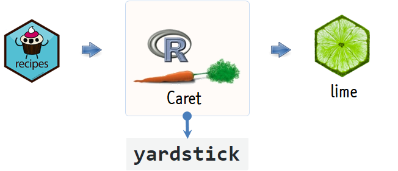

 

``` {r, include=FALSE}
source("tools/chunk-options.R")
knitr::opts_chunk$set(echo=TRUE, message=FALSE, warning=FALSE)
```

# 지방선거 광역단체장 {#역대-광역단체장-선거}

역대 지방선거 광역단체장에 대한 선거결과를 위키백과사전에서 확인이 가능하고, 
현재 시점 `r Sys.Date()` 여론조사결과를 바탕으로 제7회 지방선거 광역단체장 지지율은 
[대한민국 제7회 지방 선거 여론조사](https://namu.wiki/w/제7회 전국동시지방선거/여론조사)에서 확인이 가능하다.

- [대한민국 제4회 지방 선거](https://ko.wikipedia.org/wiki/대한민국_제4회_지방_선거)
- [대한민국 제5회 지방 선거](https://ko.wikipedia.org/wiki/대한민국_제5회_지방_선거)
- [대한민국 제6회 지방 선거](https://ko.wikipedia.org/wiki/대한민국_제6회_지방_선거)
- [대한민국 제7회 지방 선거 여론조사](https://namu.wiki/w/제7회 전국동시지방선거/여론조사)

제7회 지방선거 후보자 명부가 공식적인 지방선거 운동이 시작됨에 따라 
중앙선거관리위원회 [선거통계시스템](http://info.nec.go.kr/)을 통해서 후보로 입후보한 정보가 공개되었다.

이를 바탕으로 제7회지방선거 광역단체장으로 등록된 후보의 지지율을 중앙선거관리위원회 [선거통계시스템](http://info.nec.go.kr/)에 공개된 정보를 바탕으로 예측해 보자. 
수식으로 표현하면 광역단체장 지지율을 각 후보가 속한 정당, 나이, 학력, 전과횟수 등의 정보로 나타내고, 
이를 기계학습 알고리즘을 적용하여 적합한 모형을 찾아내고 과거 해석불가능한 모형인 경우 최신 모형설명 기법을 적용하여 풀어보자.

$$\text{지지율} = f(\text{정당}, \text{재산신고액}, \text{학력}, \cdots) + \epsilon$$

# 데이터 {#지지율-선거통계시스템-데이터} 

상기 지지율 모형을 구축하는데 필요한 데이터를 지지율은 
[대한민국 제7회 지방 선거 여론조사](https://namu.wiki/w/제7회 전국동시지방선거/여론조사), 
각 후보별 인적정보는 중앙선거관리위원회 후보자 명부 [선거통계시스템](http://info.nec.go.kr/)에서 가져온다.

웹에서 데이터를 가져오는 구체적인 방법은 다음 웹사이트를 참조한다.

- [데이터 과학자가 바라본 제7회 지방선거 - 정당별 광역단체장 추세](http://statkclee.github.io/politics/sido-party-history.html)


# 지지율 예측 모형 [^eRum-recipes] {#지지율예측-모형} 

[^eRum-recipes]: [Talk at eRum2018 Budapest and accompanying blog post](https://github.com/EdwinTh/recipe_for_recipes)

지지율 예측 기계학습 모형을 구축하는데 있어 데이터 전처리와 모형 설계행렬 구축을 위해서 준비된 
`recipes` 팩키지를 활용한다. 그리고 나서 `caret` 팩키지를 활용하여 다양한 기계학습모형을 학습시킨다.
`yardstick` 팩키지로 `RMSE` 기준으로 최종 모형을 선정한다. 
그리고 나서 선정된 모형을 바탕으로 지지율에 중요한 역할을 하는 것이 어떤 변수이고,
주요 후보를 선정하여 어떤 변수가 지지율에 긍정적인 부정적인 역할을 하는지 파악해본다.



## 데이터 준비 {#recipes-local-election}

[대한민국 제7회 지방 선거 여론조사](https://namu.wiki/w/제7회 전국동시지방선거/여론조사)와 
중앙선거관리위원회 후보자 명부 [선거통계시스템](http://info.nec.go.kr/)에서 가져온 데이터를 병합한다.
그리고 나서 기계학습 모형에 학습시킬 데이터 형태로 변환시킨다.

- 지방선거 지지율 데이터에 대한 새로운 조리법을 생성: `recipe()`
- 데이터 요리법 절차를 등록: `step_center()`, `step_dummy()` 등
- 요리 준비: `prep()`
- 조리 시작: `bake()`

``` {r local-pm-setup}
# 0. 환경설정 -----
library(rvest)
library(tidyverse)
library(glue)
library(recipes)
library(caret)
library(yardstick)
library(plotly)
library(lime)
library(randomForest)
library(gridExtra)

# 1. 데이터 가져오기 -----
xy_dat <- read_rds("data/reg_xy_df.rds")

xy_df <- xy_dat %>% 
    select(-c("시도명", "성명", "학교"))

# 2. 모형데이터 생성 -----
## 2.1. 새로운 데이터 조리법: 지방선거 지지율 데이터
lcoal_rec <- recipe(xy_df, 지지율 ~ .) %>% 
    add_role(정당명, 성별, 전과, 병역, 재산, 납부액, 입후보횟수, 나이, 학위,
             new_role = "predictor") %>%
    add_role(지지율, new_role = "outcome")

## 2.2. 지방선거 요리법 절차
local_rec_with_steps <- lcoal_rec %>% 
    step_center(all_numeric(), -지지율) %>%
    step_scale(all_numeric(), -지지율) %>% 
    step_dummy(all_nominal())

## 2.3. 지방선거 요리 준비
local_rec_prepped <- local_rec_with_steps %>% 
    prep()

## 2.4. 지방선거 데이터 요리 시작
local_dm <- bake(local_rec_prepped, newdata = xy_df)

DT::datatable(local_dm)
```


## 지지율 기계학습  {#local-election-caret}

`caret` 팩키지를 기계학습 엔진으로 활용하고  
다양한 모형 아케텍처를 대표하는 "선형회귀모형", "부분최소자승모형", 
"의사결정나무모형(rpart)", "확률숲(Random Forest)", "gbm", "xgBoost", 
6개 알고리즘을 순차적으로 적합시킨다.

``` {r local-pm-caret}
# 3. 예측모형 -----
## 3.1. 회귀 모형 수식 --------------------------------
y_var <- "지지율"
x_var <- setdiff(names(local_dm), c(y_var, "지지율"))

local_fmla <- as.formula(paste(y_var, "~", paste(x_var, collapse="+")))

## 3.2. 교차타당도 제어조건 설정
ml_control <- trainControl(method = "repeatedcv", 
                           number = 5, 
                           repeats = 1,
                           verboseIter=FALSE)

## 3.3. 모형
### 3.3.1. 선형회귀모형
local_caret_glm <- train(local_fmla, data = local_dm, 
                      method = "glm", 
                      trControl = ml_control)

### 3.3.2. 부분최소자승모형
local_caret_plsr <- train(local_fmla, data = local_dm, 
                        method = "pls",
                        tuneLength = 20, 
                        trControl = ml_control)

### 3.3.3. 의사결정나무모형(rpart)
local_caret_rpart <- train(local_fmla, data = local_dm,
                method = "rpart",
                trControl = ml_control)

### 3.3.4. 확률숲(Random Forest)
local_caret_rf <- train(local_fmla, data = local_dm,
              method = "rf",
              importance = TRUE,
              trControl = ml_control)

### 3.3.5. gbm
local_caret_gbm <- train(local_fmla, data = local_dm,
               method = "gbm",
               trControl = ml_control,
               verbose = FALSE)

### 3.3.6. xgBoost
local_caret_xgboost <- train(local_fmla, data = local_dm,
                   method = "xgbLinear",
                   trControl = ml_control)
```

## 모형 아키텍처 선정  {#local-election-caret-model-arch}

"선형회귀모형", "부분최소자승모형", "의사결정나무모형(rpart)", "확률숲(Random Forest)", "gbm", "xgBoost", 
6개 알고리즘을 적합시킨 후 RMSE, RSQ 기준으로 모형을 비교한 후에 
상대적으로 우수한 성능을 보이는 "확률숲(Random Forest)"를 선정한다.

``` {r local-pm-caret-arch-selection}
## 3.4. 모형비교
local_caret_comp <- resamples(list( 
    GLM = local_caret_glm,
    PLS = local_caret_plsr,
    RPART = local_caret_rpart,
    RF = local_caret_rf,
    GBM = local_caret_gbm,
    XgBoost = local_caret_xgboost))

bwplot(local_caret_comp, layout = c(3, 1), scales = list(relation = "free"))

## 3.5. 모형선정
model_arch <- local_dm %>%
    mutate(GLM = predict(local_caret_glm, local_dm),
           PLS = predict(local_caret_plsr, local_dm),
           RPART = predict(local_caret_rpart, local_dm),
           RF = predict(local_caret_rf, local_dm),
           GBM = predict(local_caret_gbm, local_dm),
           XgBoost = predict(local_caret_xgboost, local_dm))


glm_metric_df <- metrics(model_arch, truth = 지지율, estimate = GLM) %>% 
    mutate(model = 'GLM')
pls_metric_df <- metrics(model_arch, truth = 지지율, estimate = PLS) %>% 
    mutate(model = 'PLS')
rpart_metric_df <- metrics(model_arch, truth = 지지율, estimate = RPART) %>% 
    mutate(model = 'RPART')
rf_metric_df <- metrics(model_arch, truth = 지지율, estimate = RF) %>% 
    mutate(model = 'RF')
gbm_metric_df <- metrics(model_arch, truth = 지지율, estimate = GBM) %>% 
    mutate(model = 'GBM')
xgboost_metric_df <- metrics(model_arch, truth = 지지율, estimate = XgBoost) %>% 
    mutate(model = 'XgBoost')

bind_rows(glm_metric_df, pls_metric_df) %>% 
    bind_rows(rpart_metric_df) %>% 
    bind_rows(rf_metric_df) %>% 
    bind_rows(gbm_metric_df) %>% 
    bind_rows(xgboost_metric_df) %>% 
    DT::datatable() %>% 
    DT::formatRound(c("rmse", "rsq"), digits=2)
```

## 모형 아키텍처 선정  {#local-election-caret-model-arch}

모형 성능을 시각화하고자 예측모형의 지지율 예측값과 실제 지지율값을 `ggplot`으로 시각화한다.
일반화선형모형과 비교하여 확률숲(randomForest) 모형이 좀더 오차가 적은 것이 시각적으로도 확인된다.

``` {r local-pm-caret-model-viz}
## 3.6. 모형성능 시각화 -----
### GLM
local_glm <- glm(local_fmla, data = local_dm)

local_dm_pred <- local_dm %>% 
    mutate(예측지지율 = predict(local_glm))

local_dm_pred %>% 
    mutate(잔차 = 예측지지율 - 지지율) %>% 
    summarise(rmse = sqrt(mean(잔차^2)))

local_glm_g <- ggplot(local_dm_pred, aes(x = 예측지지율, y = 지지율)) +
    geom_point() +
    geom_abline(color = "darkblue", size=2) +
    theme_bw(base_family="NanumGothic") +
    labs(title="여론조사 지지율과 예측 지지율", 
         subtitle="선형회귀모형", x="예측지지율", y="여론조사 지지율") +
    scale_y_continuous(labels=scales::comma) +
    scale_x_continuous(labels=scales::comma)

### RF
local_dm_pred <- local_dm %>% 
    mutate(예측지지율 = round(predict(local_caret_rf),1))

local_dm_pred %>% 
    mutate(잔차 = 예측지지율 - 지지율) %>% 
    summarise(rmse = sqrt(mean(잔차^2)))

local_rf_g <- ggplot(local_dm_pred, aes(x = 예측지지율, y = 지지율)) +
    geom_point() +
    geom_abline(color = "darkblue", size=2) +
    theme_bw(base_family="NanumGothic") +
    labs(title="여론조사 지지율과 예측 지지율", 
         subtitle="확률숲(randomForest)", x="예측지지율", y="여론조사 지지율") +
    scale_y_continuous(labels=scales::comma) +
    scale_x_continuous(labels=scales::comma)

grid.arrange(local_glm_g, local_rf_g, nrow =1)
```

## 예측지지율 시각화  {#local-election-caret-model-arch-viz}

기계학습모형으로 선정된 예측값을 실제 데이터와 병합하여 각 후보별로 살펴볼 수 있도록
`DT` 팩키지로 표로 나타내고 `plotly` 팩키지로 인터랙티브 시각화한다.

``` {r local-pm-caret-model-viz-predict}
# 4. 지지율 모형 배포 -----
## 4.1. 표
local_prod_df <- local_dm_pred %>% 
    select(예측지지율) %>% 
    bind_cols(xy_dat) %>% 
    mutate(정당명 = factor(정당명, levels = c("더불어민주당", "자유한국당", "바른미래당", "민주평화당", "정의당", "무소속")))
    
DT::datatable(local_prod_df)

## 4.2. 그래프
local_g <- ggplot(local_prod_df, aes(x = 예측지지율, y = 지지율, color = 정당명,
                                     text=paste0("시도명:  ", 시도명, "\n",
                                                 "정당  :  ", 정당명, "\n",
                                                 "후보  :  ", 성명, "\n",
                                                 "나이  :  ", 나이, "\n",
                                                 "성별  :  ", 성별 ))) +
    geom_point() +
    geom_abline(color = "darkblue", size=2) +
    theme_bw(base_family="NanumGothic") +
    labs(title="여론조사 지지율과 예측 지지율", 
         subtitle="", x="예측지지율", y="여론조사 지지율") +
    scale_y_continuous(labels=scales::comma) +
    scale_x_continuous(labels=scales::comma) +
    scale_color_manual(values=c("blue", "red", "cyan", "green", "yellow", "gray"))

ggplotly(local_g, tooltip = 'text')
```

# 지지율 예측모형 설명  {#local-election-caret-model-arch-explanation}

## 주요후보 {#local-election-caret-model-arch-explanation-row}

`lime` 팩키지 `explain()` 함수로 5개 변수를 뽑아서 제7회 지방선거에서 관심을 많이 받고 있는 
후보 "박원순", "이재명", "김경수", "남경필", "김태호", "안철수" 총 6명을 뽑아서 어떤 변수가 
지지율에 긍적인 영향을 주고, 어떤 변수가 부정적인 영향을 주는지 살펴본다.

- Case 1: 박원순
- Case 2: 이재명
- Case 3: 김경수
- Case 4: 남경필
- Case 5: 김태호
- Case 6: 안철수

``` {r local-pm-caret-model-explanation-row, fig.height=8}
# 5. 모형설명
## 5.1. 지지율 후보별 ----
focused_candidate <- local_prod_df %>% 
    mutate(row_num = row_number()) %>% 
    filter(성명 %in% c("박원순", "이재명", "김경수", "남경필", "김태호", "안철수"))

focused_candidate_df <- local_dm %>% 
    filter(row_number() %in% focused_candidate$row_num) %>% # 이재명 추가 
    select(-지지율)

local_explainer <- lime(focused_candidate_df, local_caret_rf, bin_continuous = TRUE, n_bins = 5)
local_explanation <- explain(focused_candidate_df, local_explainer, n_features = 5)

plot_features(local_explanation)
```

## 지지율 영향 변수 {#local-election-caret-model-arch-explanation-column}

확률숲(randomForest) 모형을 기반으로 지지율에 가장 높은 영향을 주는 변수가 어떤 것인지 
`varImpPlot()` 함수를 통해 살펴본다.

``` {r local-pm-caret-model-explanation-column}
## 5.2. 주요 변수 ----
varImpPlot(local_caret_rf$finalModel, main="제7회 지방선거 지지율 주요변수")

local_caret_rf_df <- importance(local_caret_rf$finalModel) %>% as.data.frame()

local_caret_rf_df %>% 
    rownames_to_column(var="변수명") %>% 
    arrange(-`%IncMSE`) %>% 
    DT::datatable() %>% 
      DT::formatRound(c("%IncMSE", "IncNodePurity"), digits=1)
```


