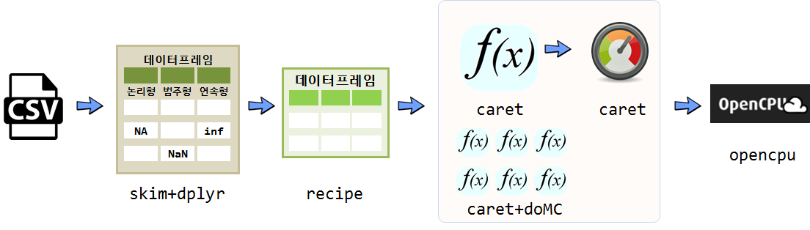

 
``` {r, include=FALSE}
source("tools/chunk-options.R")

knitr::opts_chunk$set(echo = TRUE, message=FALSE, warning=FALSE,
                      comment="", digits = 3, tidy = FALSE, prompt = TRUE, fig.align = 'center')

options(width = 90)
library(knitr)
library(ggplot2)
library(caret)
library(recipes)
library(lattice)
theme_set(theme_bw() + theme(legend.position = "top"))
```

## 예측모형 작업흐름

