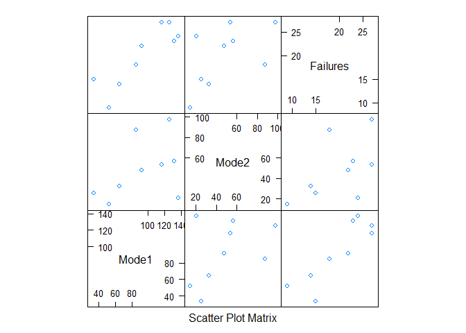
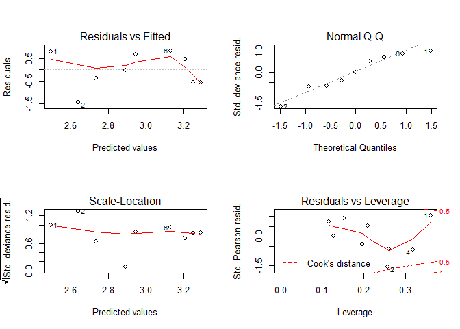
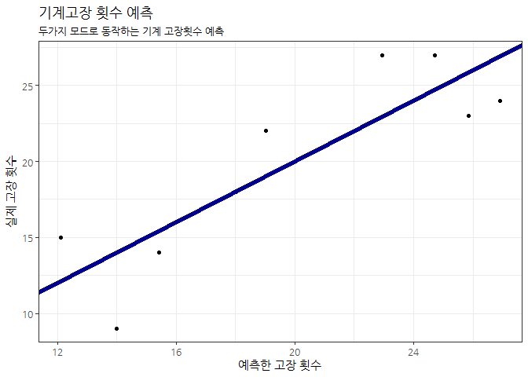

# xwMOOC 기계학습
 

## 1. 기계고장 예측 [^glm-poisson-failure]

[^glm-poisson-failure]: [Generalized Linear Models – Poisson Regression](http://www.wekaleamstudios.co.uk/posts/generalized-linear-models-poisson-regression/)

데이터는 다소 오래되었지만, 두가지 모드에서 동작하는 전자제품에 대해 9 기간에 대해 고장횟수를 측정한 데이터다. [^failure-data]

[^failure-data]: Jorgenson, D.W. (1961). Multiple regression analysis of a Poisson process. Journal of the American Statistical Association,
56, 235-245.

### 1.1. 환경설정과 데이터 가져오기

`tribble` 함수를 통하면 작은 데이터셋을 R로 가져오기 편리한 경우가 많다.

~~~{.r}
# 0. 환경설정 -------------------------
# library(tidyverse)
# library(lattice)
# library(extrafont)
# library(ggthemes)
# loadfonts()

# 1. 데이터 가져오기 ------------------
failure_df <- tribble(
  ~Mode1, ~Mode2, ~Failures,
    33.3,  25.3 ,      15,
    52.2,  14.4 ,       9,
    64.7,  32.5 ,      14,
   137.0,  20.5 ,      24,
   125.9,  97.6 ,      27,
   116.3,  53.6 ,      27,
   131.7,  56.6 ,      23,
    85.0,  87.3 ,      18,
    91.9,  47.8 ,      22)

# 2. 탐색적 데이터 분석 ----------------
DT::datatable(failure_df)
~~~

<!--html_preserve-->

<!--/html_preserve-->

~~~{.r}
splom(failure_df)
~~~

### 1.2. 포아송 모형 

실패횟수가 계수형(Count) 데이터라 포아송 모형에 적합시킨다.
다만, 두가지 모드로 동작하기 때문에 두가지 모드 사이에 교호작용(interaction)이 있을 수도 있어,
두가지 모두 가법(additive) 효과와 함께 교호작용을 모두 넣어 유의성을 검정하고 나서,
비유의적인 효과는 제거하는 방식으로 강건한 모형을 만들어 간다.

~~~{.r}
# 3. 포아송 회귀분석   ----------------
## 3.1. 모든 변수를 다 넣은 모형
failure_fmla <- as.formula("Failures ~ Mode1 * Mode2")

failure_mod <- glm(failure_fmla, data = failure_df, family = poisson)
summary(failure_mod)
~~~

~~~{.output}

Call:
glm(formula = failure_fmla, family = poisson, data = failure_df)

Deviance Residuals: 
       1         2         3         4         5         6         7  
 0.91003  -1.15601  -0.28328  -0.10398   0.03526   0.84825  -0.49211  
       8         9  
-0.57298   0.64821  

Coefficients:
              Estimate Std. Error z value Pr(>|z|)    
(Intercept)  2.105e+00  4.481e-01   4.698 2.63e-06 ***
Mode1        7.687e-03  4.285e-03   1.794   0.0729 .  
Mode2        4.703e-03  1.163e-02   0.405   0.6858    
Mode1:Mode2 -1.978e-05  1.037e-04  -0.191   0.8487    
---
Signif. codes:  0 '***' 0.001 '**' 0.01 '*' 0.05 '.' 0.1 ' ' 1

(Dispersion parameter for poisson family taken to be 1)

    Null deviance: 16.996  on 8  degrees of freedom
Residual deviance:  3.967  on 5  degrees of freedom
AIC: 55.024

Number of Fisher Scoring iterations: 4

~~~

~~~{.r}
## 3.2. 모형 최적화
remove_interaction_mod <- update(failure_mod, .~. -Mode1:Mode2)
summary(remove_interaction_mod)
~~~

~~~{.output}

Call:
glm(formula = Failures ~ Mode1 + Mode2, family = poisson, data = failure_df)

Deviance Residuals: 
     Min        1Q    Median        3Q       Max  
-1.21984  -0.44735  -0.05893   0.68351   0.87510  

Coefficients:
            Estimate Std. Error z value Pr(>|z|)    
(Intercept) 2.175168   0.255456   8.515  < 2e-16 ***
Mode1       0.007015   0.002429   2.888  0.00387 ** 
Mode2       0.002549   0.002835   0.899  0.36852    
---
Signif. codes:  0 '***' 0.001 '**' 0.01 '*' 0.05 '.' 0.1 ' ' 1

(Dispersion parameter for poisson family taken to be 1)

    Null deviance: 16.9964  on 8  degrees of freedom
Residual deviance:  4.0033  on 6  degrees of freedom
AIC: 53.06

Number of Fisher Scoring iterations: 4

~~~

~~~{.r}
remove_mode2_mod <- update(remove_interaction_mod, .~. -Mode2)
summary(remove_mode2_mod)
~~~

~~~{.output}

Call:
glm(formula = Failures ~ Mode1, family = poisson, data = failure_df)

Deviance Residuals: 
     Min        1Q    Median        3Q       Max  
-1.43194  -0.56958  -0.00745   0.66742   0.82231  

Coefficients:
            Estimate Std. Error z value Pr(>|z|)    
(Intercept) 2.237196   0.243053   9.205  < 2e-16 ***
Mode1       0.007705   0.002264   3.403 0.000667 ***
---
Signif. codes:  0 '***' 0.001 '**' 0.01 '*' 0.05 '.' 0.1 ' ' 1

(Dispersion parameter for poisson family taken to be 1)

    Null deviance: 16.9964  on 8  degrees of freedom
Residual deviance:  4.8078  on 7  degrees of freedom
AIC: 51.865

Number of Fisher Scoring iterations: 4

~~~

~~~{.r}
# 4. 모형 검진 ------------------------

par(mfrow=c(2,2))
plot(remove_mode2_mod)
~~~

### 1.3. 모형 예측

예측모형을 만들었다면, 실제로 모형을 활용하여 기계고장 횟수를 예측해 본다.

~~~{.r}
# 5. 기계고장 예측 ------------------------
## 5.1. 기존 데이터 -----------------------
failure_df$pred <- predict(remove_mode2_mod, newdata = failure_df, type="response")

DT::datatable(failure_df) %>% 
  DT::formatRound(c("pred"), digits=1)
~~~

<!--html_preserve-->

<!--/html_preserve-->

~~~{.r}
ggplot(failure_df, aes(x = pred, y = Failures)) +
  geom_point() +
  geom_abline(color = "darkblue", size=2) +
  theme_bw(base_family="NanumGothic") +
  labs(title="기계고장 횟수 예측", x="예측한 고장 횟수", y="실제 고장 횟수", subtitle="두가지 모드로 동작하는 기계 고장횟수 예측") +
  scale_y_continuous(labels=scales::comma) +
  scale_x_continuous(labels=scales::comma)
~~~

~~~{.r}
## 5.2. 신규 데이터 ----------------------
predict(remove_mode2_mod, newdata = data.frame(Mode1 = seq(30, 140, 10)), type="response")
~~~

~~~{.output}
       1        2        3        4        5        6        7        8 
11.80294 12.74832 13.76942 14.87231 16.06353 17.35017 18.73987 20.24087 
       9       10       11       12 
21.86211 23.61319 25.50454 27.54737 

~~~
