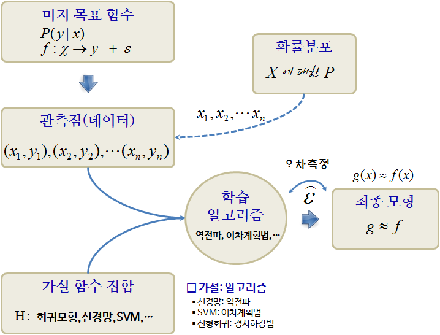

# 기계학습 기본사항 {#ml-basics}

기계학습은 다음 세가지 사항을 기반으로 하고 있다.
패턴은 존재한다고 가정하는 부분에서 통계학의 회귀분석과 유사하나,
수학적으로 명세를 할 수 없다는 점에서 차이가 난다. 기계학습이나 회귀모형이나 둘다 데이터를 기반으로 한다.

1. 패턴이 존재한다.
1. 수학적으로 명시적으로 명세할 수 없다.
1. 데이터를 갖고 있다.

기계학습을 구성하는 이론은 편향-분산(bias-variance), 복잡성, [Vapnik–Chervonenkis 이론](https://en.wikipedia.org/wiki/Vapnik%E2%80%93Chervonenkis_theory), 베이즈통계가 이론이 되고,
선형회귀모형을 비롯한 다양한 모형이 존재하고, 모형의 성능과 신뢰성을 높이고자 데이터 전처리, 
교차타당성(cross validation), 정규화(regularization)등이 동원된다.

[^ml-map]: [The Map of Machine Learning](https://work.caltech.edu/library/181.pdf)

## 기계학습/회귀모형 구성요소 {#ml-basic-elements}

일반 모형을 "신호 + 잡음(signal + noise)"로 가정하고 다음과 같은 수식으로 표현할 수 있다.

$$y = f(x) + \epsilon$$

1. 출력 : $y$, 관심갖고 있는 결과변수
1. 입력 : $x$, 설명/예측 변수
    - $y$의 변동성을 설명하는 목적의 모형을 구축하는 경우 $x$는 설명변수
    - $y$의 변동성을 예측하는 목적의 모형을 구축하는 경우 $x$는 예측변수
1. 가설: : $g: x \rightarrow y$, $x$는 $y$에 영향을 주는 인과관계가 존재한다.
1. 목적함수 : $f: x \rightarrow y$, $y$와 $x$를 연관시켜주는 함수
1. 데이터: $(x_1 , y_1 ), (x_2 , y_2 ), \dots, (x_n , y_n )$
1. 오차: $\epsilon$, $f: x \rightarrow y$으로 설명되지 않는 부분

결국, 잡음이 낀 데이터에서 잡음을 제거하고 신호만 뽑아내는 것이 회귀모형, 기계학습 모형이라고 볼 수 있다.
회귀모형과 기계학습 모형은 회귀모형이 특정 함수형태를 가정하고 데이터에서 신호와 잡음을 구부하는데 초점이 과거 맞춰졌다면,
기계학습모형은 $x$는 $y$의 인과관계를 가정으로 놓고 신호와 잡음을 가장 잘 발라낼 수 있는 함수를 찾아내는데 초점을 두고 있다.

