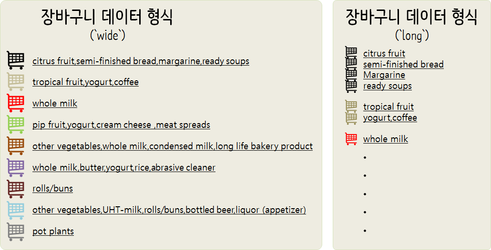
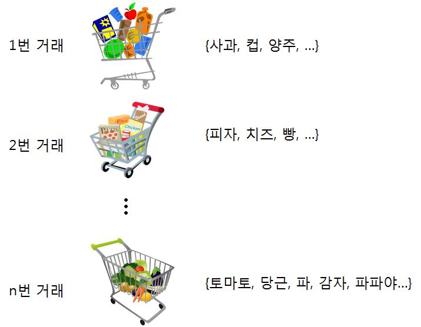
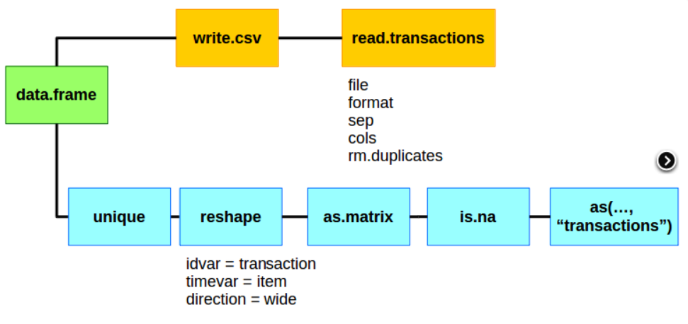

```{r setup, include=FALSE}
knitr::opts_chunk$set(echo = TRUE, message=FALSE, warning=FALSE,
                      comment="", digits = 3, tidy = FALSE, prompt = FALSE, fig.align = 'center')


library(arules)
library(arulesViz)
library(wordcloud)
library(tidyverse)
```


# 장바구니 분석 {#market-data-analysis}

카트에 담는 장바구니(Market Basket) 데이터를 이해하고, 기초적인 장바구니 데이터 분석방법을 학습한다. 아래 동영상을 참조한다.

**연관규칙(association rule)**이란 특정 항목 집합이 발생하였을 때 또 다른 항목 집합이 발생하는 규칙을 의미하고, **연관규칙분석(association rule analysis)**은 원본 데이터에서 대상들의 연관된 규칙을 찾는 방향이 없는 데이터 과학 기법으로 기존 데이터 마이닝(data mining) 용어가 일반적으로 사용되었을 때 많이 자주 활용된 기법이다. 마케팅에서 장바구니(cart)에 들어있는 품목 간의 관계를 탐색하기 위해 많이 사용된 기법으로 장바구니 분석(Market basket analysis)를 통해 팩키지 상품 발굴, 효과적인 매장진열, 교차판매(cross-selling) 전략 수립등에 활용될 수 있다.

<style>
div.blue { background-color:#e6f0ff; border-radius: 5px; padding: 10px;}
</style>
<div class = "blue">

**R - Association Rules - Market Basket Analysis**

| 장바구니 분석 1부 | 장바구니분석 2부 |
|:-------------------------:|:-------------------:|
| <iframe width="250" height="180" src="https://www.youtube.com/embed/b5hgDPa7a2k" frameborder="0" allowfullscreen></iframe> | <iframe width="250" height="180" src="https://www.youtube.com/embed/Gy_nqzJMNrI" frameborder="0" allowfullscreen></iframe> |

</div>

## 장바구니 확장 {#extend-basket}

마트에서 구매하는 상품을 장바구니나 카트에 담게 되면 이를 장바구니 분석(Market Basket Analysis)를 수행하지만, 장바구니를 확장할 수 있다. 예를 들어,

- 넥플릭스와 같은 온라인 영화 대여 서비스에서 사용자가 본 영화
- 대학교 학생들이 교양과목으로 수강한 과목
- 국회의원이 발의한 법안

## MBA 활용 {#extend-basket-application}

고객이 장바구니에 담은 데이터를 잘 활용하면 다음과 같은 질문에 대한 답을 구할 수 있다.

- A 상품을 구매한 사람이 B 상품도 구매했다.
- 진열장에 A 상품과 B 상품을 함께 놓아두고, A상품과 B상품을 묶음 판매한다.
- 영화와 드라마를 추천한다.

<style>
div.blue { background-color:#e6f0ff; border-radius: 5px; padding: 10px;}
</style>
<div class = "blue">

**왜 연관분석인가?**

연관분석은 "Association Rules"을 번역한 것으로 결국 "**If..., then ...** 만약 ... 라면, ... 가 될 것이다" 라는 연관성이 결과로 도출된다.
연관분석은 다음과 같이 실행에 옮길 수 있는 규칙이 도출된다는 면에서 실무자의 많은 관심을 끌고 있다. 

* 제품추천: A,B,C 제품을 구매한 다음에 다음에 구매 가능성이 높은 제품 추천.  
* 콘텐츠 최적화: 잡지 웹사이트, 블로그 콘텐츠 추천, 웹페이지 개인화  
* 의료진단: 자세한 사항 논문 참조, [Implementation of Apriori Algorithm in Health Care Sector: A Survey](http://static.ijcsce.org/wp-content/uploads/2013/12/IJCSCE110513.pdf)  
* 교차마케팅, 우편-주문 캠페인 프로모션에 적용

</div>


# 수학 - 장바구니 표현 {#market-basket-analysis-math}

## 글로 서술 {#mba-text}

장바구니 A에 "김밥", "사과", "참치캔"을 구매해서 들고 있고,
장바구니 B에 "라면", "배", "김밥"을 구매해서 들고 있는데 
두 장바구니에 공통된 상품은 무엇이고 두 장바구니 통틀어 담긴 모든 상품은 무엇인지 알아보자.

## 수학 표현 {#mba-math-basket}

수학적으로 표현하면 다음과 같다.

먼저, 장바구니 A, 장바구니 B에 담긴 상품은 집합기호를 사용해서 다음과 같이 표현한다.

- $장바구니_A = \{ 김밥, 사과, 참치캔 \}$
- $장바구니_B = \{ 라면, 배, 김밥 \}$

그 다음 두 장바구니에 공통으로 담긴 상품을 파악하고, 두 장바구니 모두에 담긴 상품 전체를 살펴보자.
이를 위해서 합집합($\cup$), 교집합($\cap$) 개념을 도입하여 수식을 전개한다.

- $$장바구니_A \cap 장바구니_B = \{ 깁밥\}$$
- $$장바구니_A \cup 장바구니_B = \{ 김밥, 사과, 참치캔, 라면, 배 \}$$

## R 코드 표현 {#mba-math-code}

장바구니를 벡터로 가정하고 벡터의 원소를 편의점에서 구매한 상품이라고 간주하자.
이를 `dplyr` 팩키지 `intersect()`, `union()` 함수를 사용해서 집합연산 작업을 수행할 수 있다.

```{r mba-math}
library(tidyverse)

cart_A <- c("김밥", "사과", "참치캔")
cart_B <- c("라면", "배", "김밥")

dplyr::intersect(cart_A, cart_B)
dplyr::union(cart_A, cart_B)
```

## 장바구니 크기 {#market-basket-analysis-size}

다음으로 상품이 $N$개 있는 경우, $n$개를 고른 장바구니가 얼마나 존재하는지 수학적으로 파악해 보자.
$N$개에서 $n$개를 뽑는 조합의 수를 계산하는 것과 같다. 

$${ N\choose n} = \frac{N!}{(N-n)!n!}$$

그런데 $n$를 `0`에서부터 `N`개를 뽑는 모든 경우의 수를 따져야 하기 때문에 다음과 같이 가능한 모든  장바구니를 표현할 수 있다. [Newton's Binomial Theorem](https://www.whitman.edu/mathematics/cgt_online/book/section03.01.html)에 따라 다음과 같이 정리할 수 있다.

$$ \sum_{n=0}^{N} { N\choose n} = 2^n$$

예를 들어, 전체 판매 상품이 4개인 경우, 2개 상품을 골라 장바구니 넣는 경우의 수를 따져보자.

$${4\choose 2} = \frac{4!}{(4-2)!2!} =  \frac{4 \times 3 \times 2 \times 1}{2 \times 2} = 6$$

R 코드로 작성하면 다음과 같다. `choose()` 함수를 사용해서 조합의 수를 구할 수 있다.

```{r baskets-size}
total_items <- 4
items_in_basket <- 2
choose(total_items, items_in_basket)
```

전체 상품 4개에서 2개를 뽑는 경우를 살펴봤는데, 이번에는 모든 경우의 수를 따져보자.
장바구니에 상품이 없는 경우와 4개 상품이 다양한 조합으로 담긴 경우와 모든 상품이 장바구니에 담긴 사례는 다음과 같이 `choose()` 함수와 `for` 루프를 조합시켜 모든 경우의 수에 대한 합을 계산한다. 이를 수식을 통해 확인해보자.

$$2^4 = 16$$

```{r all-possible-baskets}
total_items <- 4
combi_basket <- c()

for(i in 0:total_items) {
  combi_basket[i+1] <- choose(total_items, i)
}

(basket_cases <- tibble(basket_size = 0:total_items, combi_basket))

basket_cases %>% 
  summarise(basket_size = sum(combi_basket))
```

장바구니에 담기는 상품 조합을 전체 상품수에 맞춰 생기는 경우의 수를 시각화해보자.

```{r basket-viz}
total_items = 100
choose_items = function(x) choose(total_items, x)

tibble(x = 0) %>% 
  ggplot(aes(x=x)) +
    stat_function(fun = choose_items)+
    xlim(0, total_items) +
    labs(x="장바구니 크기", ylab="장바구니 빈도수")
```


# 장바구니 데이터 [^arules] {#market-basket-data}

[^arules]: [Market Basket Analysis with R](http://www.salemmarafi.com/code/market-basket-analysis-with-r/)

장바구니 분석을 위해서 데이터는 크게 두가지 형태 크게 나뉜다. 데이터 형태(wide 형태, long 형태)에 관계없이 장바구니에 담긴 데이터를 행렬로 나타내면 성긴(sparse) 행렬이 되기 때문에 이를 효율적으로 압축한 형태인 `transactions` 자료형으로 바꿔야 된다.

장바구니 분석용 데이터로 가장 유명한 것 중 하나가 [`Groceries`](http://www.salemmarafi.com/wp-content/uploads/2014/03/groceries.csv) 데이터다. [^Michael-Hahsler-Kurt-Hornik]

[`Groceries`](http://www.salemmarafi.com/wp-content/uploads/2014/03/groceries.csv) 데이터를 열어보면 이는 `wide`형태를 취한 것으로 알 수 있다. 이와 반대로 `long` 형태 데이터도 있는데 이를 각각 `transactions` 자료형으로 바꿔 후속 분석작업을 수행해 나간다.

[^Michael-Hahsler-Kurt-Hornik]: Michael Hahsler, Kurt Hornik, and Thomas Reutterer (2006) Implications of probabilistic data modeling for mining association rules. In M. Spiliopoulou, R. Kruse, C. Borgelt, A. Nuernberger, and W. Gaul, editors, From Data and Information Analysis to Knowledge Engineering, Studies in Classification, Data Analysis, and Knowledge Organization, pages 598–605. Springer-Verlag.



## 데이터프레임 &rarr; 장바구니 데이터 - `wide` [^market-basket-dataframe] {#dataframe-to-market-basket-data}

[^market-basket-dataframe]: [Working with arules transactions and read.transactions](http://www.learnbymarketing.com/1043/working-with-arules-transactions-and-read-transactions/)

일반적인 CSV 파일을 장바구니 데이터 분석을 위해서 자료구조를 먼저 맞춰야만 된다.
장바구니 데이터는 고객별로 혹은 고객이 중복구매를 하지 않는다면 날짜별로 구매한 생필품이 장바구니(카트)에 담기 텍스트 형태로 원자료가 구성된다.

``` {r ml-groceries-dataset-df}
cart_txt  <- read_lines("data/groceries.csv")

cart_txt %>% 
    tbl_df() %>%
    rename(items=value) %>% 
    sample_n(10) %>% 
    DT::datatable()
```


장바구니 데이터는 마트에서 카드에 담긴 물품을 생각하면 쉽다. 각 고객마다 마트에서 장바구니 카드를 밀게 되거나,
인터넷에서 주문을 할 때 가상의 장바구니에 담게 된다. 담겨진 물건은 물품마다 고유 제품번호가 부여되어 있고, 해당 제품에 대한 라벨이 함께 붙어 있다. 고유 제품번호는 컴퓨터 전산처리를 위해 부여된 것이고, 해당 제품에 대한 라벨은 사람이 제품을 이해하기 위해 부여된 것이다.



``` {r ml-groceries-dataset-df-wide}
cart_df <- cart_txt %>% tbl_df %>% 
    rename(items=value) %>% 
    mutate(transaction_id = paste0("trans_", row_number())) %>% 
    select(transaction_id, items)

cart_df %>% 
    sample_n(100) %>% 
    DT::datatable()
```

`arules` 팩키지에 소속된 `read.transactions` 함수를 사용해서 장바구니 데이터를 연관분석을 위한 자료형으로 불러 읽어온다.
즉, 데이터가 이미 `basket`에 담긴 형태로 된 경우 구분자를 지정하여 바로 불러 읽어온다.

``` {r ml-groceries-dataset}
##======================================================================================
## 01. 장바구니 분석 데이터 가져오기
##======================================================================================

cart  <- read.transactions("data/groceries.csv", format = "basket", sep=",")
head(cart)

library(datasets)
data(Groceries)

# 데이터가 동일한지 확인

# G <- inspect(Groceries)
# C <- inspect(cart)
# identical(G, C)
```

`library(datasets)` 팩키지에 `Groceries` 데이터가 기본으로 포함되어 있어, 이를 바로 활용해도 좋다.

## 데이터프레임 &rarr; 장바구니 데이터 - `long` {#dataframe-to-market-basket-data-long}

혹은 데이터가 이와는 달리 다음과 같은 형태로 긴(long) 텍스트 데이터 형태로 구성되는 경우도 있다. [How to prep transaction data into basket for arules](https://stackoverflow.com/questions/32997410/how-to-prep-transaction-data-into-basket-for-arules)에 나와있는 데이터가 좋은 형태가 된다.



데이터가 아래와 같이 긴(long)형태로 되어 있는 경우, 

거래ID(transaction ID)는 "order", 아이템명은 "part_desc"로 지정한다. 이를 `image()` 함수로 시각화하고 이를 다시 `inspect()` 함수로 제대로 되었는지 확인한다.
두가지 작업 흐름이 있지만 데이터프레임을 `.csv` 파일로 떨어뜨리고 이를 `read.transactions()` 함수로 불러오는 경우를 살펴본다. 하지만, 한글로 된 경우 가능하면 `split()` 함수를 사용하는 것이 직접 한글문자가 들어있는 `.csv` 파일을 불러 읽어들이는 것보다 문자가 깨지는 문제를 겪게되지 않을 가능성이 크다.

### `csv` 파일로 떨어 뜨려 읽어오는 경우 {#dataframe-to-market-basket-data-long-csv}

데이터프레임으로 거래 장바구니 데이터를 불러온 후에 `read.transactions()` 함수를 사용해서 즉접 `transactions` 객체로 전환시켜서 후속 연관분석용 데이터를 준비한다.

``` {r ml-groceries-dataset-df-long-direct}
order_df <- tribble(
    ~"order", ~"part", ~"part_desc",
    1, "A", "PartA", 
    1, "B", "PartB", 
    1, "G", "PartG",
    2, "R", "PartR", 
    3, "A", "PartA",
    3, "B", "PartB",
    4, "E", "PartE", 
    5, "Y", "PartY",
    6, "A", "PartA", 
    6, "B", "PartB", 
    6, "F", "PartF",
    6, "V", "PartV" 
)

order_df %>% write_csv("data/order_df.csv", col_names = TRUE)

order_tr <- read.transactions("data/order_df.csv", 
                              format = "single", 
                              sep = ",",
                              cols = c("order","part_desc"),
                              header = TRUE)

image(order_tr)

inspect(order_tr)
```

거래를 통해 장바구니가 6개가 만들어지고 총 상품이 8개라고 하면 
$6 \times 8 = 48$ 이 되고, 이중 총 12개만 상품이 장바구니에 담겼으니 성김(sparsity), 즉 밀도(density)는 $\frac{12}{48} = 0.25$가 된다. 보통 retail 유통 비즈니스에서 고객이 수십에서 수백만이고 상품도 수십에서 수백만이라 밀도는 엄청나게 적게 나온다.

### `split()` 함수로 읽어오는 경우 {#dataframe-to-market-basket-data-long-split}

한글이 들어있는 경우 깨지는 경우가 있기 때문에 이를 방비하기 위해서 `split()`함수로 장바구니로 나누고 이를 `as()` 함수로 `transactions` 객체로 변환시킨다.
`read.transactions()` 함수 대신에 `split()`을 사용하는 이유는 윈도우에서 한글이 깨져 후속 연관분석에서 원하는 결과를 얻지 못하기 때문이다. 이것이 유일한 이유다. 

``` {r ml-groceries-dataset-df-long-split}
order_split <- split(order_df$part_desc, order_df$order)

order_split_tr <- as(order_split, "transactions")

image(order_split_tr)

inspect(order_split_tr)
```

## 장바구니 데이터 분석 환경설정 {#market-basket-data-configure}

가장 먼저 장바구니 데이터 분석을 위한 환경을 설정한다. 연관규칙 추출을 위한 `arules`, 추출된 연관규칙 시각화를 위한 `arulesViz` 팩키지가 기본적으로 필요하다. 여기에 `wordcloud` 팩키지를 사용해서
사용된 장바구니에 가장 많이 든 물품이 무엇인지 텍스트 마이닝에 많이 사용되는 시각화도구도 활용한다.


``` {r ml-market-basket-packages}
##======================================================================================
## 00. 장바구니 분석 환경 설정
##======================================================================================
# arules, arulesViz, wordcloud 팩키지 설치
# install.packages("arules")
# install.packages("arulesViz")
# install.packages("wordcloud")

library(arules)
library(arulesViz)
library(wordcloud)
library(tidyverse)
```


# 연관분석 핵심 개념 {#association-rules-core-concept}

## 연관분석 주요 구성요소 {#association-rules-core-component}

{김밥} &rarr; {생수} 라는 연관 규칙을 찾았다고 하면 이에 따려오는 중요 개념은 다음과 같다.

- {김밥}: 선행사건(antecedent)
- {생수}: 결과(consequent)
- 측도: 지지도, 신뢰도, 향상도

연관분석결과 산출물에 인용되는 주요 용어에 대해 이해하고 넘어가야 된다.

- 제품에 대한 인기도 
    * 지지도(Support) : 확률 $Support(A) = P(A)$, 하나 이상의 빈발 제품 집합 식별에 활용됨, 물품 두개로 확장하게 되면 $S(X \rightarrow Y) = \frac{n(X \cap Y )}{N}$로 표현되며 전체 물품($N$) 중에서 $X, Y$가 모두 출현하는 횟수로 둘을 나누면 산출된다.
- 연관규칙이 얼마나 많이 참인가?
    * 신뢰도(Confidence) : 조건부 확률 $Confidence(A \rightarrow B) = \frac{P(A,B)}{P(A)}$, 제품 집합 간의 연관성 강도를 측정하는데 활용됨. 즉, $C(X \rightarrow Y) = \frac{n(X \cap Y )}{n(X)}$로 $X$가 포함된 거래중에서 $X, Y$가 모두 모함된 장바구니를 의미한다.
- 연관관계가 얼마나 강한가?    
    * 향상도(Lift) : $lift(A \rightarrow B) = \frac{P(A,B)}{P(A) \dot P(B)}$ 도출된 연관규칙의 효용성을 측정하는데 활용됨. 향상도는 $lift = \frac{\text{신뢰도}}{\text{지지도}}$로 계산되고 1이면 서로 독립으로 관련이 없는 것으로 판정하고 1보다 크거나 작으면 관련이 있는 것으로 파악한다. 즉, 향상도가 1보다 크면 A를 사면 B도 더 살 것이고, 1보다 작으면 A를 사면 B는 덜 살 것을 나타낸다.

생성 가능한 모든 규칙을 생성하고, 지지도, 신뢰도, 향상도를 판단기준으로 놓고 가장 최선의 규칙을 선택하면 되지만, 현실적으로 제품개수가 증가하게 되면 컴퓨터 연산시간이 이를 감당하지 못한다. 대안으로 가장 빈발하는 제품집합만을 기준으로 삼아 연관규칙을 생성해 나간다.

"Support of an item set never exceeds the support of its subsets, which is known as anti-monotoneproperty of support." 즉, 지지도 특성 중에 제품 집합 지지도는 절대로 하위집합 지지도를 넘어서지 못하는 특징이 있다. 이를 활용하여 빈발집합을 우선 고려하고, 지지도와 최소지지도를 
모수로 적당한 값 예를 들어, 기준 지지도 30%, 기준 신뢰도 70%로 설정하여 연관규칙 도출에 필요한 연산시간을 급격히 줄인다. 
**지지도(support)**는 좋은 규칙(빈도가 많은, 구성비가 높은)을 찾거나, 불필요한 연산을 줄일 때(pruning, 가지치기)의 기준으로 사용하고, **신뢰도(confidence)**가 높을 수록 유용한 규칙일 가능성 높다고 본다. 통계전문가나 기계학습 전문가의 경우 신뢰도(confidence)와 향상도(lift)가 높은 연관규칙을 선호하는 경향이 있는 반면, 매출과 이익을 책임져야 하는 현업의 실무 담당자의 경우는 **지지도(Support)**가 높아서 전체 거래 건수 중에서 해당 연관규칙이 포함된 거래건수가 많아야 높은 매출 증가를 기대할 수 있기 때문에 지지도를 중요한 지표로 여긴다.

Apriori 알고리즘이 대표적인 연관규칙 도출 알고리즘이고, `apriori()` 함수 기본디폴트 설정값은 다음과 같다.

|  매개변수  | 기본디폴트 설정값  |      의미          |
|------------|--------------------|--------------------|
| `support`  |        0.1         | 연관규칙 최소 지지도   |
| `confidence` | 0.8              | 연관규칙의 최소 신뢰도 |
| `minlen`  |     1               | 연관 규칙에 포함되는 최소 물품 수 |
| `maxlen`  |        10           | 연관규칙에 포함되는 최대 물품 수  |
| `smax`    |   1                 | 연관규칙의 최대 지지도 |


# 장바구니 분석 {#association-rules-descriptive-stat}

장바구니 데이터를 R 로 불러왔고, 이에 대해 본격적으로 연관규칙 도출을 위한 Apriori 알고리즘을 적용하기 위한 기술통계 분석을 수행한다.

`summary(cart)`를 통해 itemMatrix에 대한 정보가 제일 처음 나오고, 가장 빈발하는 제품(most frequent items), 제품집합에 대한 정보가 순차적으로 출력된다.

**itemMatrix** 에서 장바구니 분석에 행렬이 성긴 행렬(Sparse Matrix)로 $9835 \times 169$ 크기를 갖는데 밀도가 `0.02609146`에 불과하다.
즉, $9835 * 169 * 0.02609146 = 43,367$ 개 제품만이 장바구니 분석에 포함되어 있다.

``` {r ml-groceries-eda}
##================================================================================
## 02. 장바구니 기술통계 분석
##================================================================================
cart_raw <- cart_df %>% 
  mutate(items = str_split(items, ",")) %>% 
  select(tid=transaction_id, items) %>% 
  unnest(items)

cart_raw_split <- split(cart_raw$items, cart_raw$tid)

cart_trx <- as(cart_raw_split, "transactions")

summary(cart_trx)
```

## `aprior` 제품 빈도 분석 {#apriori-frequent}

먼저, 매출에 신경을 많이 신경을 쓰는 실무자 입장에서 `apriori` 알고리즘을 통해서 빈도가 높은 제품을 분석해보자.

``` {r ml-groceries-eda-frequent}
cart_supp <- apriori(cart_trx,
                     parameter = list(supp=0.1,
                                     target="frequent itemsets"),
                     control = list(verbose=FALSE))

cart_supp %>% 
  sort(by="support") %>% 
  head(5) %>% 
  arules::inspect(.)
``` 


## `aprior` 제품 빈도 시각화 {#apriori-frequent-viz}

`itemFrequencyPlot()` 함수를 사용해서 상위 10개 인기 제품을 `absolute`, `relative` 기준으로 뽑아내고 색상등을 넣어준다.

``` {r ml-groceries-eda-frequent-viz}
par(mfrow=c(1,2))

itemFrequencyPlot(cart_trx, topN=10, 
                  type="absolute", 
                  horiz=FALSE, 
                  # col=rainbow(10),
                  ylab="")

itemFrequencyPlot(cart_trx, topN=10, 
                  type="relative", 
                  horiz=TRUE, 
                  col=rainbow(10),
                  ylab="",
                  xlab="상대 제품 빈도",
                  main="상위 10개 제품",
                  cex.names=1.1)
```

# 연관규칙 도출 {#association-rules-derive}

`apriori` 함수에 지지도 0.001, 신뢰도 0.8 값을 설정하고 연관규칙을 도출한다. 410개 규칙 중 도출된 연관규칙 중 상위 5개만 뽑아 출력한다.

``` {r ml-groceries-apriori}
##================================================================================## 03. Apriori 알고리즘: 연관규칙 도출
##================================================================================
# 연관규칙 도출
rules <- apriori(cart_trx, parameter = list(supp = 0.001, conf = 0.8))
rules

# 상위 5개 규칙만 출력
options(digits=2)
inspect(rules[1:5])
```

## 유의미한 연관규칙 탐색 {#association-rules-explore}

연관규칙이 너무 많이 도출되기 때문에 이중에서 가장 유의미한 규칙을 뽑아낼 필요가 있다.
이런 경우 **신뢰도(Confidence)** 혹은 **향상도(Lift)** 를 기준으로 내림차순 정렬하면 유의미한 연관규칙을 빠르게 탐색할 수 있다.

특히 연관규칙집합의 길이가 긴 경우 `maxlen=3` 인자를 조정하여 설정한다.

``` {r ml-groceries-rules-sorting}
#---------------------------------------------------------------------------------
# 01. 정렬
#---------------------------------------------------------------------------------
# 최대 길이 3인 집합으로 한정
rules <- apriori(cart_trx, parameter = list(supp = 0.001, conf = 0.8, minlen=2, maxlen=5))
rules <- sort(rules, by="confidence", decreasing=TRUE)
inspect(rules[1:10])
```

# 인터랙티브 분석 {#association-rules-explore-interactive}

## 연관규칙 도우미: `DT` {#association-rules-explore-DT}

`arulesViz` 팩키지 `inspectDT()` 함수를 이용하면 DT의 강력한 인터랙티브 테이블 기능을 사용해서 유용한 연관규칙을 찾아내는데 도움을 준다.

``` {r ml-groceries-rules-DT}
arulesViz::inspectDT(rules)
```

## 연관규칙 도우미: `plotly` {#association-rules-explore-plotly}

`plotly` 팩키지는 지지도, 신뢰도, 향상도를 산점도로 인터랙티브 방식으로 시각화할 수 있게 도움을 준다. `engine = "plotly"`로 지정하게 되면 인터랙티브 방식을 활성화시키게 된다.

``` {r ml-groceries-rules-plotly}
plot(rules, measure = c("confidence", "lift"),
     shading = "support",
     method = "scatterplot",
     engine = "plotly")
```

## 연관규칙 도우미: `network` {#association-rules-explore-network}

`plot()`에서 `method="graph"`로, `engine =  "htmlwidget"`으로 지정하게 되면 네트워크 시각화가 가능하다. 너무 복잡한 네트워크 시각화는 큰 도움이 되지 않기 때문에 유의미한 규칙으로 축소한 후에 네트워크 시각화 작업을 수행한다.

나중에 필요한 경우 `saveWidget()` 함수를 사용해서 로컬파일에 저장한 후 재사용한다.

``` {r ml-groceries-rules-network}
network_rules_html <- rules %>% 
  sort(by="confidence") %>% 
  head(10) %>% 
  plot(., method = "graph",
       engine = "htmlwidget")

network_rules_html

# library(htmlwidgets)
# saveWidget(network_rules_html, file = "data/rules_network.html")

# saveAsGraph(rules, file = "data/rules.graphml")
```


## 중복 연관집합 제거 {#association-rules-remove}

흔히, 연관규칙이 반복된다. 특정 제품이 거의 모든 연관규칙에 포함된 경우 해당 제품을
데이터에서 제거하고 연관규칙을 찾아내는 것도 방법이고, 대안으로 생성된 중복규칙을 
제거하는 것도 바람직하다.

``` {r ml-groceries-rules-redundancy, eval=FALSE}
#---------------------------------------------------------------------------------
# 02. 중복 집합 제거
#---------------------------------------------------------------------------------
# 중복규칙 제거 -----
rules
rules <- rules[!is.redundant(rules)]
rules
```

## 목표 제품 집중 분석 {#association-rules-analysis}

지금까지 연관규칙을 생성하는 방법을 학습했고, 생성된 규칙이 통상적으로 많기 때문에 
이를 제거하거나 축약하는 방식을 살펴봤다. 이제 특정 제품에 집중해서 연관규칙을 활용하는 
방법을 살펴보자.

* 특정 제품(`whole milk`)을 장바구니에 넣기 전에, 고객이 구매할 가능성이 많은 제품은 무엇인가?
* 특정 제품(`whole milk`)을 장바구니에 넣어 구매했다면, 고객이 추가로 구매할 가능성이 높은 제품은 무엇인가?

위와 같은 질문이 특정 제품을 기준으로 제기되는 상황이 전개된는데, 이를 R 코드로 구현하는 것은 
어렵지 않다. 즉, `lhs`, `rhs` 인자를 제어하면서 풀 수 있다.

``` {r ml-groceries-rules-target-before, warning=FALSE}
rules_before <-apriori(data=Groceries, parameter=list(supp=0.001,conf = 0.08), 
               appearance = list(default="lhs",rhs="whole milk"),
               control = list(verbose=F))
rules_before <-sort(rules_before , decreasing=TRUE,by="confidence")
inspect(rules_before [1:5])
```

`supp`, `conf` 인자를 조정하여 연관규칙이 적절히 도출되도록 제어한다.


``` {r ml-groceries-rules-target-after}
rules_after <-apriori(data=Groceries, parameter=list(supp=0.001,conf = 0.15,minlen=2), 
               appearance = list(default="rhs",lhs="whole milk"),
               control = list(verbose=F))
rules_after <-sort(rules_after , decreasing=TRUE,by="confidence")
inspect(rules_after [1:5])
```

# 시각화 {#association-rules-viz}

## 단어구름 {#association-rules-wordcloud}

연관규칙을 시각화하는데 네트워크 도표와 더불어 가장 빈발하는 제품을 `wordcloud`를 통해 
살펴보는 것도 시각화의 한 좋은 사례다. `worldcloud()` 함수에 들어갈 자료형을 먼저 맞추고 나서 시각화한다. 단어와 단어 빈도수로 key-value 형태의 자료형이라 이를 `tibble()`에 넣어 시각화를 한다. 
`letterCloud()`를 통해 시각화도 가능한데 현재 버그가 있어 구현이 되는 경우도 있고 구현이 되지 않는 경우도 있다. [^wordcloud2-bug]

[^wordcloud2-bug]: [No plot in Rstudio, wordcloud2 #262](https://github.com/ramnathv/htmlwidgets/issues/262)


``` {r ml-groceries-rules-wordcloud}
#--------------------------------------------------------------------------------------
# 01. 단어 구름
#--------------------------------------------------------------------------------------
library(wordcloud)
library(wordcloud2)
col.pal <- brewer.pal(9, "Blues")

wordcloud_df <- tibble(
  product_name = itemLabels(cart),
  product_cnt  = itemFrequency(cart, type="absolute")
)

wordcloud(words = wordcloud_df$product_name, 
          freq  = wordcloud_df$product_cnt, 
          min.freq = 1, scale = c(3, 0.2), col = col.pal , random.order = FALSE)

# letterCloud(words = wordcloud_df, word="W")

```

## 연관규칙 시각화 {#association-rules-viz-arules}

### 인터랙티브 연관규칙 산점도 {#association-rules-viz-arules-plotly}

연관규칙을 시각화하는데 `arulesViz` 팩키지를 활용한다. 특히, `plotly_arules()` 함수를 사용하면 유용한 규칙을 뽑아내는 것을 시각적으로 수월하게 진행할 수도 있고, `DT` 팩키지를 함께 사용하면 시너지를 극대화할 수 있을 듯 싶다.

``` {r ml-groceries-rules-arulesViz-plotly}
#--------------------------------------------------------------------------------------
# 02. 연관규칙 시각화
#--------------------------------------------------------------------------------------
library(arulesViz)
# 연관분석 유용한 규칙 -----
plotly_arules(rules,  measure = c("support", "confidence"), shading = "lift")
```

### 인터랙티브 연관규칙 표 {#association-rules-viz-arules-DT}

`plotly`를 사용하여 인터랙티브 그래픽으로 품질 좋은 연관규칙을 찾아내는 것도 가능하지만 `DT` 팩키지의 인터랙티브 표기능을 사용해서도 가능하다.

``` {r ml-groceries-rules-arulesViz-table}
# 데이터프레임 변환 -----
rules_df <- tibble(
  lhs = labels( lhs(rules) ), 
  rhs = labels( rhs(rules) ))

rules_df <- bind_cols(rules_df, quality(rules)) %>% 
  arrange(desc(lift))

rules_df %>% 
  DT::datatable() %>% 
    DT::formatRound(c("support", "confidence", "lift"), digits=2) %>% 
    DT::formatRound(c("count"), digits=0)
```

### 인터랙티브 네트워크 시각화 [^arules-viz] {#association-rules-viz-arules-network}

[^arules-viz]: [R Friend - R arules package로 연관규칙 분석하기](http://rfriend.tistory.com/193)

네트워크 시각화를 할 때 노드가 너무 많은 경우 유용한 연관규칙을 발견하기 어려운 경우가 많기 때문에 30개로 추려 시각화 대상을 축소한다. 그리고 나서 네트워크 객체로 변환을 시키고 나서 이를 다시 `visNetwork()` 함수에 넣기 위해 데이터프레임으로 변환시킨다. 즉,

- `arules` 객체 &rarr; `igraph` 객체 &rarr; 데이터프레임 변환 &rarr; `visNetwork()` 시각화

```{r arules-support-confidence-network-viz-interactive}
library(visNetwork)
library(igraph)

# rules_30 <- head(sort(rules, by="lift"), 30)
rules_30 <- sort(rules, by="lift") %>% 
  head(30)

rules_30_ig <- plot(rules_30, method="graph", control=list(type="items") )

# rules_30_ig_df <- toVisNetworkData(rules_30_ig, idToLabel = FALSE)
rules_30_ig_df <- get.data.frame(rules_30_ig, what = "both" )

visNetwork(
  nodes = data.frame(
    id = rules_30_ig_df$vertices$name,
    value = rules_30_ig_df$vertices$lift, # lift, confidence, support
    title = ifelse(rules_30_ig_df$vertices$label == "",rules_30_ig_df$vertices$name, rules_30_ig_df$vertices$label),
    rules_30_ig_df$vertices),
  edges = rules_30_ig_df$edges) %>% 
    visNodes(size = 10) %>%
    visLegend() %>%
    visEdges(smooth = FALSE) %>%
    visOptions(highlightNearest = TRUE, nodesIdSelection = TRUE) %>%
    visInteraction(navigationButtons = TRUE) %>%
    visEdges(arrows = 'from') %>%
    visPhysics(
      solver = "barnesHut",
      maxVelocity = 35,
      forceAtlas2Based = list(gravitationalConstant = -6000))
```

`items` 기준이 아니라 `itemsets`기준으로 시각화를 한다.

```{r arules-support-confidence-network-viz-itemsets}
# rules_30_ig <- plot(rules_30, method="graph", control=list(type="items") )
ig <- plot(rules_30, method="graph", control=list(type="itemsets") )

ig_df <- get.data.frame(ig, what = "both" )

visNetwork(
  nodes = data.frame(
    id = ig_df$vertices$name,
    value = ig_df$vertices$lift, # lift, confidence, support
    title = ifelse(ig_df$vertices$label == "",ig_df$vertices$name, ig_df$vertices$label),
    ig_df$vertices),
  edges = ig_df$edges) %>% 
    visNodes(size = 10) %>%
    visLegend() %>%
    visEdges(smooth = FALSE) %>%
    visOptions(highlightNearest = TRUE, nodesIdSelection = TRUE) %>%
    visInteraction(navigationButtons = TRUE) %>%
    visEdges(arrows = 'from') %>%
    visPhysics(
      solver = "barnesHut",
      maxVelocity = 35,
      forceAtlas2Based = list(gravitationalConstant = -6000))
```


