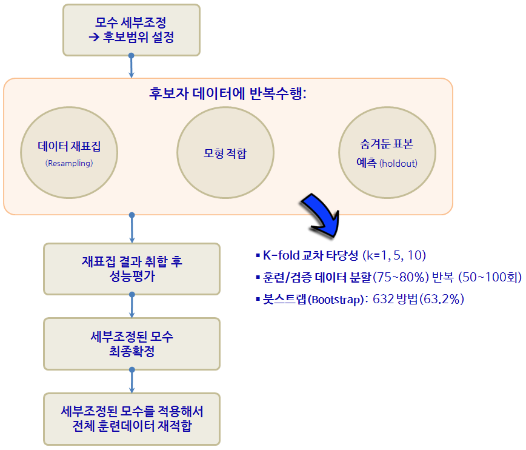

 
> ## 학습목표 {.objectives}
>
> * 전통적 통계모형과 비교하여 예측모형에 대해 이해한다.
> * 예측모형을 R에서 직접 실행한다.
> * `caret` 팩키지의 10년에 걸친 여정을 살펴본다.

## 1. 전통적 통계모형과 예측모형 비교

[예측모형(Predictive Model)](https://en.wikipedia.org/wiki/Predictive_modelling)은 정확도가 높은 모형을 개발하는 과정이다. 따라서, 전통적 통계학에서 강조하는 추론, 타당성, 유의성, 가정과 같은 개념적인 것보다는 "실질적으로 정확하게 예측을 할 수 있는가?" 라는 문제늘 더 중요하게 다루고 있다.

> ### 예측모형 정의(Predictive Modeling) {.callout}
>
> "Predictive Modeling is the process of creating a model whose primary goal is to achieve high
levels of accuracy."  
> -- Max Kuhn from Pfizer R&D

**예측모형에서 중요하게 고려되는 사항**

* 예측모형 성능
* 예측의 단순성
* 복잡성과 컴퓨팅 비용을 줄이도록 변수(특성, Feature) 축소
* 예측수식 평활(smoothness)
* 예측모형의 강건성

## 2. `caret` 팩키지 

`caret` 팩키지와 같은 예측모형 전용 팩키지가 필요한 이유는 너무나 많은 예측모형이 존재하고,
더 큰 문제는 사용법과 해석이 모두 다르다는데 있다. 너무 많은 사람이들이 오랜기간에 걸쳐 개발하다보니 어쩌면 
당연한 문제라고 볼 수도 있다.

### 2.1. R 팩키지 구문

기계학습에서 가장 많이 작업하는 것 중에 하나가 분류문제에 대한 예측 알고리즘을 제시하는 것이다.
데이터도 다양하지만, 분류문제에 대한 다양한 이론이 존재하고, R로 구현된 팩키지도 정말 다양한다.
예를 들어, `lda`는 판별분석(Linear Discrimant Analsyis)을 돌릴 때 사용되는 것으로 `MASS` 팩키지에 포함되어 있고, 
훈련데이터 혹은 검증데이터에 예측값을 구할 경우 `predict` 함수에 `lda` 반환값을 넣어주면 되고 추가설정은 필요없다.
`glm`은 일반화 선형모형을 적합할 때 특히 링크함수로 `logit`을 넣어 설정하고 `stats` 팩키지에 포함되어 있고,
구문은 `lda`와 확연한 차이를 볼 수 있다.
`gbm`, `mda`, `rpart`, `Weka`, `LogitBoost`등 다양한 예측 알고리즘이 존재한다. 다음은 **Max Kuhn** 박사가 `caret`을 개발한 주요한 사유로 정리한 표다. 이를 일관된 인터페이스로 제공하고 나아가 각 모형의 성능을 객관적으로 비교할 수 있는 성능평가 지표 도출 및 확정을 위해서 꼭 필요한 것으로 판단된다. (본인이 필요해서 개발하지 않았을까 생각되고, 누구나 이런 코드는 갖고 있는데 체계적으로 정리해서 공개한 후, 10년에 걸쳐 시간을 투여한 Kuhn 박사님께 감사드립니다.) 

| 예측함수명    | 팩키지명  | `predict` 함수 예측구문                 |
|:----------:|:------:|--------------------------------------|
| lda        |MASS    | predict(obj) (추가 인자설정 불필요)     |
| glm        |stats   | predict(obj, type = "response")      |
| gbm        |gbm     | predict(obj, type = "response", n.trees) |  
| mda        |mda     | predict(obj, type = "posterior")     |
| rpart      |rpart   | predict(obj, type = "prob")          |
| Weka       |RWeka   | predict(obj, type = "probability")   |
| LogitBoost |caTools | predict(obj, type = "raw", nIter)    |

### 2.2. 기계학습 알고리듬 [^pedro]

컴퓨터 기계가 학습을 하는 것은 흥미로운 주제로 5가지 패러다임으로 페드로 박사님께서 범주화하셨습니다.

* 기호주의자(symbolist) : 역추론(inverse deduction) &rarr; 전문가 시스템(Expert System)
* 연결주의자(connectionist) : 역전파(backpropagation) &rarr; 신경망/딥러닝
* 진화론자(evolutionist) : 유전자 프로그래밍(genetic programming) &rarr; 유전자 알고리듬(Genetic Programming)
* 베이즈(Bayesian) : 베이즈 추론(Bayesian inference) &rarr; 깁스 표집, MCMC
* 유사주의자(analogizer) : 통계적 학습(Statistical Learning) &rarr; 지지도 벡터 머신(Support vector machine)

[^pedro]: [Domingos, Pedro. The Master Algorithm: How the Quest for the Ultimate Learning Machine Will Remake Our World. Basic Books, 2015.](http://www.amazon.com/Master-Algorithm-Ultimate-Learning-Machine/dp/0465065708)

`caret`에서 지원하는 예측모형 목록 중 일부는 다음과 같고, 전체 목록은 [예측모형 caret 목록](http://topepo.github.io/caret/modelList.html)을 참조한다. 2014년 2월 기준 예측모형과 예측함수 147개, 2016년 1월 기준 216개 폭증.

|    모형   | 예측함수명  |  팩키지 | 세부조정 모수 |
|----------|----------|--------|--------------------------|
|재귀적 분할 | rpart | rpart | maxdepth |
| Boosted trees | gbm | gbm | interaction.depth, n.trees, shrinkage |
| Random forests | rf | randomForest | mtry |
| 신경망 | nnet | nnet | decay, size |
| Support Vector Machine (RBF 커널) | svmRadial | kernlab | sigma, C |
| Support Vector Machine (다항식 커널) | svmPoly | kernlab | scale, degree, C |
| 선형회귀 | lm | stats | 없음 |
| ... | ... | ... | ... |

## 3. 고객 이탈 예측 사례

고객 이탈(churn)은 마케팅을 통한 고객획득과 마찬가지로 상당히 중요한 의미를 갖는다. 고객이탈을 고객유지(retention)의 반대쪽 면으로 볼 수 있고, 고객평생가치적인 측면에서도 상당히 중요한 사업적 의미를 갖는다. [SGI, Silicon Graphics International](http://www.sgi.com/tech/mlc/)에도 상당히 좋은 데이터를 많이 제공하고 있다. [churn.all, churn.data, churn.names, churn.test](http://www.sgi.com/tech/mlc/db/)데이터를 활용하여 직접 예측모형을 개발한다.

### 3.1. 고객이탈 데이터 준비

`C50` 팩키지에 `churn` 데이터로 준비되어 있어, 굳이 웹사이트에서 다운로드 받아 이를 가공하는 과정을 생략할 수 있다.
`data(churn)` 명령어를 수행하면 `ls()` 명령어를 통해서 `churnTest`, `churnTrain` 데이터프레임이 생성된 것을 확인하게 된다.

~~~{.r}
suppressMessages(library(pROC))
suppressMessages(library(C50))
data(churn)
ls()
~~~

~~~{.output}
[1] "churnTest"  "churnTrain" "hook_in"    "hook_out"  

~~~

~~~{.r}
suppressMessages(library(doMC))
registerDoMC(cores=7)
suppressMessages(library(caret))
~~~

### 3.2. 기계학습 훈련-검증 데이터 쪼개기

`churnTest`, `churnTrain` 데이터프레임을 `allData`로 결합한다. 그리고 나서,
훈련데이터와 검증데이터를 75:25 비율로 나눈다. `caret` 팩키지에 데이터를 쪼개는 다양한 방법을 제공하고 있어,
`createFolds`, `createMultiFolds`, `createResamples` 함수를 필요에 따라 사용한다.

~~~{.r}
# 데이터 나누기
allData <- rbind(churnTrain, churnTest)

inTrainingSet <- createDataPartition(allData$churn, p = .75, list = FALSE)
churnTrain <- allData[ inTrainingSet,]
churnTest <- allData[-inTrainingSet,]

# 설명변수만 추출
predictors <- names(churnTrain)[names(churnTrain) != "churn"]
~~~

### 3.3. 부스팅 나무 모수 세부조정

`부스팅(Boosted Tree)` 모형을 `caret`에 적용하기 전에 먼저 이탈여부("yes", "no")를 
재코딩해야된다. 왜냐면, `gbm`에서 종속변수를 요인 자료형을 받지 않기 때문이다.
`trainControl`에 `twoClassSummary`를 지정하면, 민감도(Sensitivity), 특이성(specificity), AUC 면적을 함께 확인하고, 제어에 활용할 수 있다.

최고성능을 내는 모수를 찾기 위해서 `expand.grid`에 `gbm`관련 설정을 한다.
`shrinkage`는 0.01과 0.1로 설정하고, `n.trees` 나무갯수는 100에서 1000까지 100만큼 증가시켜 10회 반복한다.
`interaction.depth`는 나무노드를 쪼개는 회수를 지정한다. 따라서, 나무 깊이가 1,3,5,7로 깊어지고 나무가 풍성해진다.

`metric = "ROC"` 모수 설정을 통해 최적 모수가 `ROC` 면적이 가장 큰 것이 교차타당도 결과 자동 선정된다.

~~~{.r}
## 종속변수(이탈여부, "yes", "no") 재코딩
forGBM <- churnTrain
forGBM$churn <- ifelse(forGBM$churn == "yes", 1, 0)

suppressMessages(library(gbm))
ctrl <- trainControl(method = "repeatedcv", repeats = 5,
                     classProbs = TRUE,
                     summaryFunction = twoClassSummary)

grid <- expand.grid(interaction.depth = seq(1, 7, by = 2),
                    n.trees = seq(100, 1000, by = 100),
                    shrinkage = c(0.01, 0.1), 
                    n.minobsinnode = 10)

gbmTune <- train(churn ~ ., data = churnTrain,
                 method = "gbm",
                 metric = "ROC",
                 tuneGrid = grid,
                 verbose = FALSE,
                 trControl = ctrl)
~~~

~~~{.output}
Loading required package: plyr

~~~

### 3.4. 최종 모형 성능평가 및 검증데이터 예측 

나무깊이, `shrinkage`, 노드 최소 훈련표본 갯수를 기반으로 ROC 면적이 
교차타당도 결과로 산출되고 가장 좋은 것을 선정한다.

`gbmTune` 결과를 바탕으로 `confusionMatrix`에 넣어 모형 성능을 가늠한다.

검증데이터(향후, 신규 예측이 필요한 데이터)에 고객이탈 확률과 고객보유확률을
`predict` 함수로 예측한다.

~~~{.r}
# 최적모수 선정 시각화
ggplot(gbmTune) + theme(legend.position = "top")
~~~

~~~{.r}
# 최적 모형 성능 평가
gbmPred <- predict(gbmTune, churnTest)
confusionMatrix(gbmPred, churnTest$churn)
~~~

~~~{.output}
Confusion Matrix and Statistics

          Reference
Prediction  yes   no
       yes  124    6
       no    52 1067
                                          
               Accuracy : 0.9536          
                 95% CI : (0.9404, 0.9646)
    No Information Rate : 0.8591          
    P-Value [Acc > NIR] : < 2.2e-16       
                                          
                  Kappa : 0.7847          
 Mcnemar's Test P-Value : 3.446e-09       
                                          
            Sensitivity : 0.70455         
            Specificity : 0.99441         
         Pos Pred Value : 0.95385         
         Neg Pred Value : 0.95353         
             Prevalence : 0.14091         
         Detection Rate : 0.09928         
   Detection Prevalence : 0.10408         
      Balanced Accuracy : 0.84948         
                                          
       'Positive' Class : yes             
                                          

~~~

~~~{.r}
# 검증데이터 고객이탈 확률과 고객보유확률 예측
gbmProbs <- predict(gbmTune, churnTest, type = "prob")
head(gbmProbs)
~~~

~~~{.output}
         yes        no
1 0.03023747 0.9697625
2 0.05412460 0.9458754
3 0.67664526 0.3233547
4 0.68258206 0.3174179
5 0.97999220 0.0200078
6 0.03178743 0.9682126

~~~

### 3.5. `pROC` 팩키지 ROC 곡선

`pROC` 팩키지 ROC 곡선을 통해 민감도와 특이성에 대한 자세한 정보를 확인할 수 있다.

~~~{.r}
rocCurve <- roc(response = churnTest$churn,
                predictor = gbmProbs[, "yes"],
                levels = rev(levels(churnTest$churn)))
rocCurve
~~~

~~~{.output}

Call:
roc.default(response = churnTest$churn, predictor = gbmProbs[,     "yes"], levels = rev(levels(churnTest$churn)))

Data: gbmProbs[, "yes"] in 1073 controls (churnTest$churn no) < 176 cases (churnTest$churn yes).
Area under the curve: 0.9127

~~~
