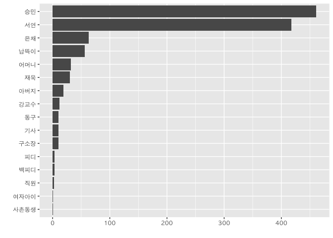

# xwMOOC 기계학습
 

## 1. 국내영화 (건축학개론)

한국영화에 출연하는 배우에 대한 출현횟수를 바탕으로 배우에 대한 중요도를 따져본다.
[필름메이커스 - 커뮤니티](http://www.filmmakers.co.kr/)에서 [한국영화 시나리오 - 건축학개론 시나리오](http://www.filmmakers.co.kr/koreanScreenplays/3547349)를 다운로드한다.
R 에서 MS 오피스 파일을 바로 읽어들이는 기능은 없기 때문에 아래한글에서 "건축학개론" 아래한글파일을 `.txt` 파일로 저장한다.

> 중요한 점은 `utf-8` 텍스트 파일로 꼭 저장한다.

### 1.1. 환경설정 및 데이터 가져오기 

`stringr`, `stringi`, `rebus` 팩키지는 텍스트, 문자열 처리를 위한 R 3종 세트 팩키지라 바로 불러오고 나서,
`tidyverse` 팩키지를 통해 데이터를 정제하는데 사용한다.

> Warning message:
>
>     In readLines("data/건축학개론.txt", encoding = "UTF-8") : incomplete final line found on 'data/嫄댁텞?숆컻濡?txt'

상기와 같은 오류가 발생하되는 이유는 아래한글을 `.txt` 파일로 저장했을 때 파일 마지막에 **엔터**를 쳐서 줄바꿈을 하지 못해서 발생되는 문제다.
따라서, `건축학개론.txt` 파일을 열어 맨 마지막에서 줄바꿈을 수행하고 저장하면 오류가 수정된다. [^enter-end-of-text]

[^enter-end-of-text]: ['Incomplete final line' warning when trying to read a .csv file into R](http://stackoverflow.com/questions/5990654/incomplete-final-line-warning-when-trying-to-read-a-csv-file-into-r)

~~~{.r}
# 0. 환경설정 ---------------------------
#library(rebus)
#library(stringr)
#library(stringi)
#library(tidyverse)

# 1. 데이터 가져오기 -------------------
arch_101 <- readLines("data/건축학개론.txt", encoding = "utf-8")
~~~

### 1.2. 데이터 정제

아래한글을 `건축학개론.txt` 파일로 저장한 후에 텍스트 편집기로 열어보면 쉽게 시작과 끝을 파악할 수 있다.
대세에 지장없고, 형식적이지만 "건축학개론" 대본 시작과 끝을 뽑아낸다.

~~~{.r}
# 2. 데이터 정제 -------------------
## 2.1. 영화 대본본문 추출 시작과 끝 ------------------
start_line <- which(str_detect(arch_101, pattern = fixed("1. 오래된 집. 오후.")))
end_line   <- max(which(str_detect(arch_101, pattern = fixed("끝."))))

## 2.2. 영화 본문 추출
text_only  <- arch_101[(start_line):(end_line-3)]
~~~

### 1.3. 정규식 적용 등장배우 추출

정규식을 적용하여 배우를 추출한다. "건축학개론" 대본에는 배우명 다음에 탭(`\t`)을 일관되게 넣어 구분을 한다.
이러한 패턴을 잡아내는 정규식을 작성한다. 
한글로 시작하는 단어(즉, 극중 배우명)가 되고 단어가 종료되는 시점에는 탭(`\t`)으로 표식이 되어 있다.

~~~{.r}
# 3. 출연 비중이 높은 배우 데이터 추출 ----------------------

## 3.1. 정규식
char_pattern <- START %R% one_or_more(char_class("가-흫")) %R% char_class("\t")
text_extract <- str_subset(text_only, char_pattern)
~~~

### 1.4. 통계작업과 등장배우 추출

앞선 정규식을 일부 변형(탭 제거)하여 등장배우만 추출한다.
`str_subset` 함수로 등장인물이 출현하는 행을 뽑아낸다.
뽑아낸 행에서 패턴에 매칭되는 등장배우를 `str_extract` 함수로 추출한다.
그리고 `table` 함수를 활용하여 등장배우 활동성을 통계내고 이를 표로 작성한다.

~~~{.r}
# 4. 출연 비중 통계 작업 ----------------------
## 4.1. 정규식 매칭 데이터 라인 추출을 위해 탭제거
text_clean <- str_replace(text_extract, "\t", " ")
char_pattern2 <- START %R% one_or_more(char_class("가-흫"))
char_lines <- str_subset(text_clean, char_pattern2)

## 4.2. 패턴에 매칭되는 배우 캐릭터 추출
characters <- str_extract(char_lines, char_pattern2)

## 4.3. 최다 출연 배우 통계
char_tbl <- table(characters)

# 5. 그래프와 표로 마무리 작업 ----------------------
arch_char_df <- char_tbl %>% as.data.frame() %>% 
    dplyr::arrange(desc(Freq)) %>% 
    mutate(pcnt_ = scales::percent(Freq/sum(Freq)),
           pcnt = Freq/sum(Freq),
           cumpcnt = scales::percent(cumsum(pcnt))) %>% 
    dplyr::select(-pcnt)

arch_char_df
~~~

~~~{.output}
   characters Freq pcnt_ cumpcnt
1        승민  461 40.8%   40.8%
2        서연  418 37.0%   77.7%
3        은채   63  5.6%   83.3%
4      납뜩이   56  5.0%   88.2%
5      어머니   32  2.8%   91.1%
6        재욱   30  2.7%   93.7%
7      아버지   19  1.7%   95.4%
8      강교수   12  1.1%   96.5%
9      구소장   10  0.9%   97.3%
10       기사   10  0.9%   98.2%
11       동구   10  0.9%   99.1%
12     백피디    3  0.3%   99.4%
13       피디    3  0.3%   99.6%
14       직원    2  0.2%   99.8%
15   사촌동생    1  0.1%   99.9%
16   여자아이    1  0.1%  100.0%

~~~

~~~{.r}
arch_char_df %>% 
    mutate(characters = factor(characters, 
                               levels = arch_char_df$characters[order(arch_char_df$Freq)])) %>% 
    ggplot(aes(x=characters, y=Freq)) +
        geom_bar(stat="identity") +
        coord_flip() +
        labs(x="", y="")
~~~

