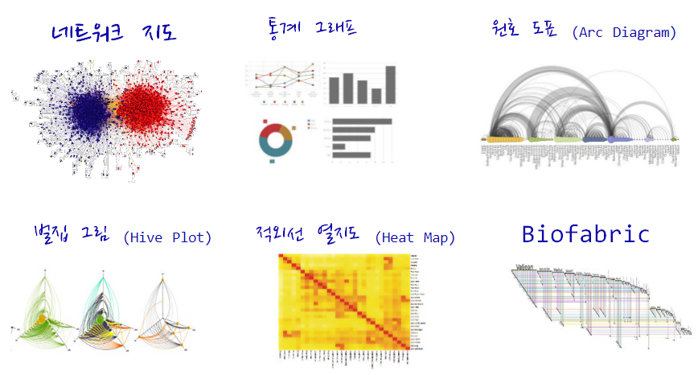
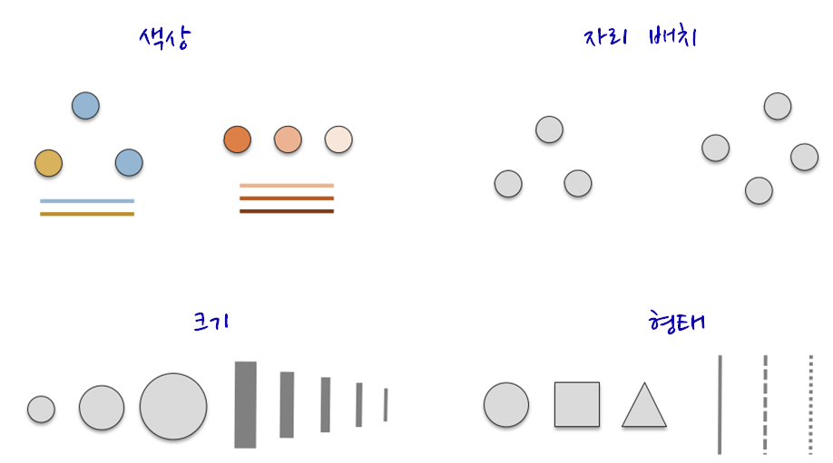
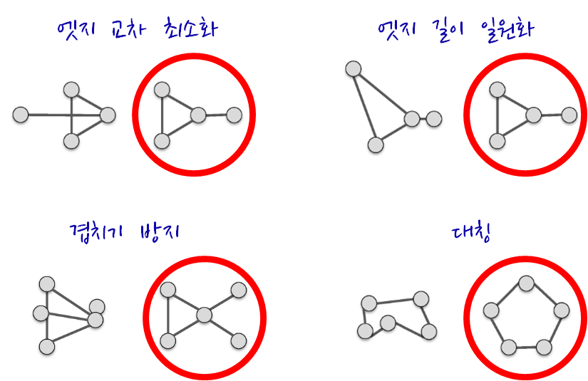

 
``` {r, include=FALSE}
source("tools/chunk-options.R")
```

### 1. 네트워크 시각화 [^Katherine-Ognyanova]

네트워크 시각화는 다양한 목표를 갖고 있다.

* 주요 행위자를 식별하고 관계를 찾아냄
* 구조적 특성(Structural Properties)
* 관계 강도(Relationship Strength)
* 커뮤니티 식별
* 지도로 역할하는 네트워크
* 확산 패턴(Diffusion Patterns)



네트워크 시각화 목표를 구현한 일부 사례가 다음에 나타나 있다. 목표를 구현하는데 있어
결과를 제어하는데 사용되는 핵심 요소에는 다음이 포함된다.

* 색상
* 위치
* 크기
* 형태

색상, 위치, 크기, 형태 외에도 화살표를 통해 방향을 나타내고 라벨을 달아 표식을 한다.



최근에 개발된 그래프 배치는 속도와 심미적인 면을 고려하여 최적화 된다. 
특히, 겹치는 것과 엣지 교차(Edge Crossing)을 최소화하고 그래프에 전반에
엣지 길이가 비슷하도록 조정한다.




> #### 네트워크 시각화 핵심 팩키지 {.callout}
>
> * [igraph - The network analysis package](http://igraph.org/)
> * [sna - Tools for Social Network Analysis](https://cran.r-project.org/web/packages/sna/)
> * [network - Classes for Relational Data](https://cran.r-project.org/web/packages/network/)
> * [ndtv - Network Dynamic Temporal Visualizations](https://cran.r-project.org/web/packages/ndtv/)

[^Katherine-Ognyanova]: [Katherine Ognyanova, Network Analysis and Visualization with R and igraph, Sunbelt 2016 Workshop, Newport Beach, CA
](http://kateto.net/networks-r-igraph) 


### 2. 기본 색상

Base R에 포함된 시각화를 할 경우 시각화 요소를 제어하는데 사용되는 기본요소는 
다음과 같다. 자세한 사항은 `? par` 도움말을 참조한다.

* `x`, `y` : 점 좌표
* `pch` : 점 기호모양
* `cex` : 점 크기
* `col` : 점 색상

``` {r network-viz-basic, warning=FALSE}
plot(x=1:10, y=rep(5,10), pch=19, cex=3, col="dark red")
points(x=1:10, y=rep(6, 10), pch=19, cex=3, col="557799")
points(x=1:10, y=rep(4, 10), pch=19, cex=3, col=rgb(.25, .5, .3))
```

Base R에 포함된 그래프 기능에는 RGB 값이 0 -- 1 사이 값을 갖게 된다. 만약 0 -- 255
값으로 변환하고자 할 경우 `rgb(10, 100, 100, maxColorValue=255)` 처럼 `maxColorValue=255`로 
설정한다.

0 -- 1 범위를 갖는 `alpha` 값을 조정하여 불투명도/투명도를 제어한다.

``` {r network-viz-alpha, warning=FALSE}
plot(x=1:5, y=rep(5,5), pch=19, cex=12, col=rgb(.25, .5, .3, alpha=.5), xlim=c(0,6))
```

[http://www.color-hex.com/](http://www.color-hex.com/) 웹사이트에서 16진수
색상체계를 사용해서도 R에서 색상을 표현할 수 있다. 앞에서 투명도 알파값을 사용하고,
`grDevices` 팩키지에 포함된 `adjustcolor` 함수도 사용한다.


``` {r network-viz-hex, warning=FALSE}
par(bg="gray40")
col.tr <- grDevices::adjustcolor("#e14150", alpha=0.7)
plot(x=1:5, y=rep(5,5), pch=19, cex=12, col=col.tr, xlim=c(0,6))
```

`rainbow()`, `heat.colors()`, `terrain.colors()`, `topo.colors()`, 
`cm.colors()` 팔레트가 `grDevices` 팩키지에 포함되어 있다.
예를 들어, `heat.colors(5, alpha=1)` 명령어는 heat 팔레트에서 불투명한 색상 5개를
갖는 팔레트를 생성한다는 의미가 된다.

``` {r network-viz-palette, warning=FALSE}
# heat 팔레트에서 불투명한 색상 5개 생성
pal1 <- heat.colors(5, alpha=1)
plot(x=1:10, y=1:10, pch=19, cex=5, col=pal1)
# 무지개 팔레트에서 투명한 색상 7개 생성
pal2 <- rainbow(7, alpha=.5)
plot(x=1:10, y=1:10, pch=19, cex=5, col=pal2)
```

`colorRampPalette`를 통해 계조도(Gradient) 색상을 설정하는 것도 가능하다.
즉, 회색에서 어두운 붉은색으로 계조를 두어 색상을 점차적으로 변화해 나가는
팔레트를 통해 색상을 만들어낸다.

``` {r network-viz-gradient, warning=FALSE}
# 계조도(gradient) 적용
palf <- colorRampPalette(c("gray80", "dark red"))
plot(x=10:1, y=1:10, pch=19, cex=5, col=palf(10))
```

``` {r network-viz-gradient-alpha, warning=FALSE}
# 투명도를 가미한 계조도 적용
palf <- colorRampPalette(c(rgb(1,1,1, .2),rgb(.8,0,0, .7)), alpha=TRUE)
plot(x=10:1, y=1:10, pch=19, cex=5, col=palf(10))
```

#### 2.1. `RColorBrewer` 팔레트

적절한 색상 조합을 비전문가가 찾아내는 것은 쉬운 일이 아니다.
내장된 R 색상 팔레트는 다소 제한된 감이 없지 않다. 다행스럽게도 
`RColorBrewer` 팔레트를 사용하는 것이 가능하다.

``` {r network-viz-rColorBrewer, warning=FALSE}
library(RColorBrewer)
display.brewer.all()
display.brewer.pal(8, "Set3")
display.brewer.pal(8, "Spectral")
display.brewer.pal(8, "Blues")
```

`brewer.pal` 색상 팔레트를 활용하여 시각화가 가능하다.

`rev()` 함수를 조합해서 역순으로도 가능하다.

``` {r network-viz-rColorBrewer-ex, warning=FALSE}
pal_set3 <- brewer.pal(10, "Set3")
plot(x=10:1, y=10:1, pch=19, cex=6, col=pal_set3)
plot(x=10:1, y=10:1, pch=19, cex=6, col=rev(pal_set3))
```

### 3. 글꼴 폰트  [^pdf-hangul] [^pdf-hangul-freesearch]

R에서 다양한 폰트를 사용하려면 사전 정지작업이 필요하다.
`extrafont` 팩키지가 다양한 폰트를 사용하는데 도움이 된다.
특히, 윈도우 사용자가 많은 한국에서 다소 번거로운 과정이 필요한데, 맥이나 리눅스
사용자는 이를 건너 뛰어도 된다.

``` {r network-viz-font, warning=FALSE}
library(extrafont)
# 시간이 많이 소요
# font_import()
# 가져온 글꼴 폰트 확인
fonts()
grep("Nanum", fonts(), value=T)
windowsFonts(NanumGothicCoding=windowsFont("NanumGothicCoding"))
windowsFonts(NanumPenScript=windowsFont("`Nanum Pen Script`"))
windowsFonts(NanumBrushScript=windowsFont("`Nanum Brush Script`"))
windowsFonts(NanumMyeongjo=windowsFont("NanumMyeongjo"))

# PDF 플롯을 찍을 경우 device="pdf" 를 사용
loadfonts(device = "win")
```

원하는 글꼴 폰트를 활용하여 시각화한다.

``` {r network-viz-font-hangul, warning=FALSE}
#--------------------------------------------------------------------------------
# 한글 그래프
plot(x=10:1, y=10:1, pch=19, cex=3,
     main="한글 그래프: 글꼴 폰트", col="orange",
     family="MGungHeulim" )
```

pdf 파일에 글꼴폰트를 내장하는 과정은 다음과 같다.
먼저, [Ghostscript, GhostPCL, GhostXPS and MuPDF Downloads](http://ghostscript.com/download/)
다운로드 사이트에서 고스트스크립트를 다운로드하여 설치한다.

R에서 고스트스크립트 존재를 인식하도록 환경을 설정한다.

``` {r network-viz-font-pdf, warning=FALSE}
# 고스트스크립트를 R에 연결하는 환경설정
Sys.setenv(R_GSCMD = "C:/Program Files/gs/gs9.19/bin/gswin64c.exe")

# cairo_pdf()함수는 dev.off()가 발생되기 전까지 모든 출력결과를 pdf 파일로 전송
cairo_pdf("NanumMyeongjo.pdf", family = "NanumMyeongjo", width = 10, height = 5, antialias = "subpixel")

plot(x=10:1, y=10:1, pch=19, cex=3, main="한글 그래프 - 나눔 고딕 글꼴", col="orange")
dev.off()
embed_fonts("NanumMyeongjo.pdf", outfile="NanumMyeongjo_embed.pdf")
```


[^pdf-hangul]: [R PDF생성 시 한글폰트 깨짐 문제](http://using.tistory.com/66)
[^pdf-hangul-freesearch]: [R로 그래프 플로팅을 하기 위한 몇 가지 팁](http://freesearch.pe.kr/archives/3275)


### 4. 네트워크 데이터 구조

네트워크 데이터는 **노드(Node)** 와 **엣지(Edge)** 로 구성된다. 
노드 데이터는 네트워크 노드에 대한 상세 정보가 담겨있다.
반면에 엣지 정보는 연결된 링크 정보를 담고 있는데 `from`, `to` 형식으로
데이터를 담을 수도 있고, 노드간의 관계를 관계 없음은 `0`, 관계 있음은 `1`로
표현한다.

`head(nodes)` 명령어를 통해서 살펴보면 `head(nodes2)`와 별다른 차이가 없다.

``` {r network-data-str-node, warning=FALSE}
head(nodes)
head(nodes2)
```

반면에 엣지 정보, 링크 정보는 하나는 `from`, `to` 형식으로, 다른 하나는 
행렬로 표현된다는 점에서 차이가 있다.

``` {r network-data-str-edge, warning=FALSE}
head(links)
head(links2)
```

*igraph* 팩키지로 데이터를 시각화를 해본다. 가장 먼저
노드와 엣지 데이터프레임을 [igraph](http://igraph.org/) 네트워크 객체로 변환해야 된다.
`graph.data.frame` 함수가 노드와 엣지 데이터프레임 자료형을 
igraph 네트워크 객체로 변환하는데 사용된다.

`graph.data.frame` 함수에 인자를 두개 넣는다. 

* **d** : 네트워크 엣지(링크)를 넣어 넘긴다. `from`, `to` 형식으로 칼럼 두개가 먼저 정의되고,
`weight`, `type`, `label` 등 엣지를 표현하는 다른 정보가 나머지 칼럼에 담기게 된다.
* **vertices** : 노드 id 로 첫번째 칼럼이 정의되고, 노드를 표현하는 다른 정보가 순차적으로 
나머지 칼럼에 담기게 된다.

``` {r network-convert-data, warning=FALSE}
library(igraph)

net <- graph.data.frame(links, nodes, directed=T)
net
```

* `IGRAPH DNW- 17 49 -- ` : 
    * D 혹은 U : 방향성 있는 그래프 혹은 방향성 없는 그래프를 기술
    * N : 노드가 `name` 속성을 갖는 것을 기술
    * W : 가중값이 있는 그래프로 엣지에 `weight` 속성이 있음을 기술
    * B : 이분(Bipartite, two-mode) 그래프로 노두가 `type` 속성이 있음을 기술
    * 17 49 : 노드가 17, 엣지가 49 개가 그래프에 존재함을 기술
* `attr: name (v/c), media (v/c), media.type (v/n), type.label (v/c), audience.size (v/n), type (e/c), weight (e/n)` : 
    * (g/c) : graph-level character attribute
    * (v/c) : vertex-level character attribute
    * (e/n) : edge-level numeric attribute
    * (e/c) : edge-level character attribute

`E()` 함수를 통해 네트워크 객체에 포함된 엣지 정보를 추출한다.
`V()` 함수를 통해 네트워크 객체에 포함된 노드 정보를 추출한다.
직접 행렬 원소를 뽑아내는 것도 가능하다.

``` {r network-data-query, warning=FALSE}
#------------------------------------------------------------------------
# 네트워크 객체 조회

E(net)       # "net" 객체 엣지정보 조회 
V(net)       # "net" 객체 노드정보 조회
E(net)$type  # 엣지 속성 "type"
V(net)$media # 노드 속성 "media"

# 직접 네트워크 행렬을 조작
net[1,]
net[5,7]
```

### 5. 네트워크 데이터 시각화

`plot(net)` 명령어를 통해 시각화를 할 경우, 중복되는 엣지도 많고 해서 간략화할 필요가 있다.
이때 사용되는 명령어가 `simplify()` 함수다.

``` {r network-viz-simplify, warning=FALSE}
# plot(net)
net <- simplify(net, remove.multiple = FALSE, remove.loops = TRUE) 
# net <- simplify(net, edge.attr.comb=list(Weight="sum","ignore"))
plot(net, edge.arrow.size=.01,vertex.label=NA)
```

`dev.off()`로 장치를 초기화하고, `vertex.label.family` 인자를 통해 글꼴도 설정한다.

``` {r network-viz-simplify, warning=FALSE}
dev.off()
par(mfrow=c(1,2))
plot(net, edge.arrow.size=.01,vertex.label=NA)
plot(net, edge.arrow.size=.01, vertex.label.family="NanumMyeongjo")
```

#### 5.1. `igraph` 주요 설정 매개변수

| 노드(Node)            |   노드 매개변수 설명                                                |
|-----------------------|---------------------------------------------------------------------|
| vertex.color	 		| Node color |
| vertex.frame.color 	| Node border color |
| vertex.shape	 		| One of “none”, “circle”, “square”, “csquare”, “rectangle”, “crectangle”, “vrectangle”, “pie”, “raster”, or “sphere” |
| vertex.size	 		| Size of the node (default is 15) |
| vertex.size2	 		| The second size of the node (e.g. for a rectangle) |
| vertex.label	 		| Character vector used to label the nodes |
| vertex.label.family   | 	Font family of the label (e.g.“Times”, “Helvetica”) |
| vertex.label.font	 	| Font: 1 plain, 2 bold, 3, italic, 4 bold italic, 5 symbol |
| vertex.label.cex	 	| Font size (multiplication factor, device-dependent) |
| vertex.label.dist	 	| Distance between the label and the vertex |
| vertex.label.degree   | 	The position of the label in relation to the vertex, where 0 right, “pi” is left, “pi/2” is below, and “-pi/2” is above |

| 엣지(Edge)            | 엣지 매개변수 설명                                                  |
|-----------------------|---------------------------------------------------------------------|
|edge.color	 			| Edge color |
|edge.width	 			| Edge width, defaults to 1 |
|edge.arrow.size		| Arrow size, defaults to 1 |
|edge.arrow.width	 	| Arrow width, defaults to 1 |
|edge.lty	 			| Line type, could be 0 or “blank”, 1 or “solid”, 2 or “dashed”, 3 or “dotted”, 4 or “dotdash”, 5 or “longdash”, 6 or “twodash” |
|edge.label	 			| Character vector used to label edges |
|edge.label.family	 	| Font family of the label (e.g.“Times”, “Helvetica”) |
|edge.label.font		| Font: 1 plain, 2 bold, 3, italic, 4 bold italic, 5 symbol |
|edge.label.cex	 		| Font size for edge labels |
|edge.curved	 		| Edge curvature, range 0-1 (FALSE sets it to 0, TRUE to 0.5) |
|arrow.mode	 			| Vector specifying whether edges should have arrows, possible values: 0 no arrow, 1 back, 2 forward, 3 both |


| 기타                  | 기타 매개변수 설명                                                  |    	 
|-----------------------|---------------------------------------------------------------------|
| margin	   |  Empty space margins around the plot, vector with length 4   |
| frame	 	   |  if TRUE, the plot will be framed   |
| main	 	   |  If set, adds a title to the plot   |
| sub	 	   |  If set, adds a subtitle to the plot   |


#### 5.2. 노드와 엣지에 매개변수 반영 

노드와 엣지를 네트워크 시각화에 매개변수를 통해 반영하는 방식은 두가지가 있다.
먼저 `plot()` 함수에 노드와 엣지 매개변수를 적어 넣는다.

`edge.arrow.size=.4` 엣지 화살표 크기를 .4로 설정하고, 엣지에 곡선을 .3으로 반영한다.

``` {r network-node-edge-param-type1-ex01, warning=FALSE}
plot(net, edge.arrow.size=.4, edge.curved=.3)
```

엣지 색상은 오렌지색상으로, 노드는 회색으로, 노드 외곽 색상은 흰색으로 설정한다.
노드 라벨을 `V(net)$media` 변수를 사용하고 노드 라벨 색상은 검정색으로 설정한다.

``` {r network-node-edge-param-type1-ex02, warning=FALSE}
plot(net, edge.arrow.size=.2, edge.color="orange",
     vertex.color="dark gray", vertex.frame.color="#ffffff",
     vertex.label=V(net)$media, vertex.label.color="black") 
```

두번째 방식은 igraph 객체에 속성으로 추가하는 것이다.
예를 들어, 미디어 유형에 따라 네트워크 노드에 색상을 추가하고, 
연결 중앙성(Degree Centrality, 링크가 많으면 더 큰 노드)에 따라 크기를 조정한다.
가중치(weight)에 따라 엣지 선폭도 설정한다.

``` {r network-node-edge-param-type2, warning=FALSE}
#------------------------------------------------------------------------
# 03.02. 첫번째 방식: igraph 객체에 속성으로 적용

# 미디어 유형에 따른 색상 생성:
colrs <- c("gray50", "tomato", "gold")
V(net)$color <- colrs[V(net)$media.type]

# 노드 연결 중앙성에 따른 노드 크기 설정:
deg <- igraph::degree(net, V(net), mode="all")
V(net)$size <- deg*3

# audience size 값을 사용해서 노드 크기 설정:
V(net)$size <- V(net)$audience.size*0.6

# 노드 ID로 현재 라벨이 설정되어 있는데, 라벨이 표시되지 않도록 설정:
V(net)$label <- NA

# 엣지 선폭을 가중치(weight)에 따라 설정:
E(net)$width <- E(net)$weight/2

# 화살표 크기와 엣지 색상을 변경:
E(net)$arrow.size <- .2
E(net)$edge.color <- "gray80"
E(net)$width <- 1+E(net)$weight/12

plot(net) 
colrs <- c("gray50", "tomato", "gold")
legend(x=-1.5, y=-1.1, c("Newspaper","Television", "Online News"), pch=21,
       col="#777777", pt.bg=colrs, pt.cex=2, cex=.8, bty="n", ncol=1)
```

노드 라벨을 적용하는 것이 의미론적인 면에서 더 의미가 있을 수 있다.

``` {r network-node-edge-param-label, warning=FALSE}
#------------------------------------------------------------------------
# 03.03. 노드 라벨를 활용한 네트워크 시각화

par(mfrow=c(1,1))
plot(net, vertex.shape="none", vertex.label=V(net)$media, 
     vertex.label.font=2, vertex.label.color="gray40", edge.arrow.size=.1,
     vertex.label.cex=.7, edge.color="gray85", edge.width	= 1+E(net)$weight/12)
```

엣지 색상을 노드와 맞춰 시각화를 함으로써 노드와 엣지를 함께 이해하는 것도 가능하다.

``` {r network-node-edge-param-color, warning=FALSE}
#------------------------------------------------------------------------
# 03.04. 엣지를 노드에 맞춰 색상을 맞춤

edge.start <- ends(net, es=E(net), names=F)[,1] # get the "from" node
edge.col <- V(net)$color[edge.start]

plot(net, edge.color=edge.col, edge.curved=.1)
```

