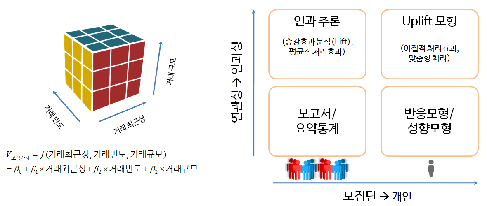
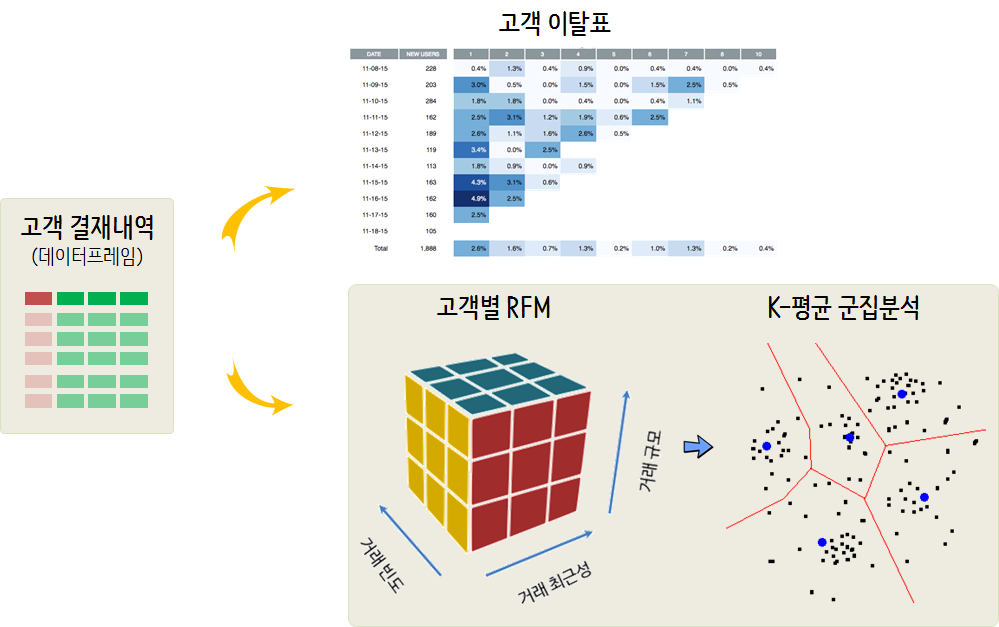

``` {r, include=FALSE}
knitr::opts_chunk$set(echo = TRUE, message=FALSE, warning=FALSE,
                      comment="", digits = 3, tidy = FALSE, prompt = FALSE, fig.align = 'center')

```


# 예측모형과 고객 {#predictive-model-customer}

고객에 대한 정의는 게임산업에서는 게임사용자가 될 수 있고, 교육분야에서는 학생이 될 수 있고, 자동차회사에서는 자동차 구매자가 될 수 있고, 
병원에서는 환자가 될 수 있다. 고객이 누구든지 관계없이 고객을 취득(Acquistion)하고 개발(Development)하고, 
유지(Retention)하는 것이 우리가 살고 있는 지금 세상에서는 일상적으로 일어나고 있고, 열심히 경주하는 일이라고도 볼 수 있다.



거시에서 미시로 들어가는 모형에 대해 살펴보자. 
모집단에 대한 이해를 하고, 연관성을 파악하고자 할 경우 RFM 분석모형이 제시되고 있다. 
고객집단과 세분화결과 생긴 군집에 대한 인과추론 작업도 만약 대조군/실험군을 통한 제어를 했다면 가능하다. 
모집단에서 개인으로 넘어가서 심하게는 각 개인별 연관성에 초점을 맞추거나 맞춤형 실험처리하는 경우 다양한 모형과 통계적 이론을 접목하여 이해한다.

# 거시에서 미시로 들어가는 고객분석 [^pm-lift] [^pm-uplift] {#predictive-model-from-to}

[^pm-lift]: [Uplift modelling](https://en.wikipedia.org/wiki/Uplift_modelling)

[^pm-uplift]: [Uplift Modeling Workshop](http://www.slideshare.net/odsc/victor-lomachinelearningpresentation)

## 반응/성향 모형 {#predictive-model-propensity}

예측모형은 다양한 분야에 활용되었는데 고객관계관리(CRM, Customer Relationship Management)에서 
**고객유치(acqusition)**, **교차판매(cross-sell)나 상향판매(upsell)**, **고객유지율(retention)** 향상을 통해 나타난다. 
일반적 캠페인의 예를 들면, 신규고객을 유치(미성년자 &rarr; 성년)하거나, 남의 집 고객을 다시 되찾아 오거나(KT &rarr; SKT), 
문제 혹은 고비용 고객을 안내하여 타사 고객으로 바꾸는 등 다양한 사례가 존재한다.

고객이 유치되면 고객에 대해 더 고급진 제품과 서비스를 통해 매출을 **신장(upselling)**하거나 다른 제품을 소개하거나 
**교차상품판매(cross-selling)** 등을 통해 고객에 대한 제품 및 서비스를 강화한다.

신규고객 유치비용은 기존고객을 유지하는 것에 비해 훨씬 비용이 많이 드는 경우가 많다. 
이유는 신규고객유치를 위해 중간 판매대리점에 보조금과 지원금을 지원하고 추가 광고비를 집행 때문에 그렇다. 
따라서 고객을 이탈을 최소화하고 다르게 보면 고객 유지를 잘 해야하는 것도 같은 맥락에서 이해될 수 있다.

### 제조사/유통사 관점 {#predictive-model-propensity-perspective}

제조사/유통사에서 바라볼 때, 중요한 기능은 서비스에 대한 고객만족도, 제품범주에 있어 브래드 가치, 제품에 대한 고급성 등이 존재한다.

* 서비스에 대한 고객만족도(customer satisfaction)
* 제품범주에 대한 브랜드 통솔력(brand leadership)
* 제품에 대한 고급성(luxury)

### 고객 관점 [^ml-pm] {#predictive-model-customer}

[^ml-pm]: [Predictive Analytics: The Power to Predict Who Will Click, Buy, Lie, or Die](https://www.youtube.com/watch?v=YVJ5cbRRvNc)

고객이냐 고객이 아니냐가 중요한게 아니다. 
미국 대선에서 공화당을 지지하느냐, 민주당을 지지하느냐가 예측 모형의 핵심이 아니라, 
우리나라의 경우 무조건 새누리, 더민주인 사람에게 예측모형을 적용하는 것은 무의미하고, 
어찌보면 접촉했을 때만 반응하는 고객을 찾아내는 것이 문제의 핵심이 될 수 있다.

* Persuadables -- 목표고객으로 설정해서 접촉했기 때문에 마케팅 행사에 반응하는 고객
* Sure Things -- 목표고객으로 설정이 되든 말든 마케팅 행사에 반응하는 고객
* Lost Causes -- 목표고객으로 설정이 되든 말든 마케팅 행사에 반응하지 않는 고객
* Do Not Disturbs or Sleeping Dogs -- 목표고객으로 설정되었기 때문에 마케팅 행사에 더 반응하지 않는 고객

## RFM 모형 [^rfm-clv] [^customer-segmentation] {#predictive-model-rfm} 

[^rfm-clv]: [Hoa K. Quach, Customer Lifetime Value (CLV), RPubs](https://rpubs.com/hoakevinquach/Customer-Lifetime-Value-CLV)

[^customer-segmentation]: [Putler, RFM Analysis For Successful Customer Segmentation](https://www.putler.com/rfm-analysis/)

RFM(Recency, Frequency, Monetary)은 고객의 가치(매출???)를 다음 세가지 측도로 평가하고, 이 모형을 바탕으로 연관성과 더불어 필요하면 가설을 도출할 수도 있다.

* **R** ecency- 거래 최근성: 고객이 얼마나 최근에 구입했는가?
* **F** requency- 거래빈도: 고객이 얼마나 빈번하게 우리 상품을 구입했나?
* **M** onetary- 거래규모: 고객이 구입했던 총 금액은 어느 정도인가? 

$$\begin{align*} V_{고객가치} &= f(거래 최근성, 거래빈도, 거래규모)\\
&= \beta_0 + \beta_1 \times 거래 최근성 + \beta_2 \times 거래빈도
+ \beta_3 \times 거래규모 + \epsilon \end{align*}$$

# 결제 데이터에서 고객 세분화 {#from-billing-to-customer-segmentation} 

결제 데이터(billing)에서 고객 세분화를 위한 작업과정은 다음과 같다.
원본 데이터를 데이터프레임으로 가져와서 고객이탈과 유지를 위한 표를 만들어 전반적인 현황을 파악하는 과정과 고객별 RFM 매트릭스를 제작하고 이를 바탕으로 K-평균 군집분석을 수행하는 방안이 있다.



## RFM 고객 세분화 {#from-billing-to-customer-segmentation-dataset}

- CDNOW 데이터셋: [http://www.brucehardie.com/datasets/](http://www.brucehardie.com/datasets/)
- UCI Online Retail Data Set : [https://archive.ics.uci.edu/ml/datasets/online+retail](https://archive.ics.uci.edu/ml/datasets/online+retail)

# CDNOW RFM 분석 사례 [^r-blogger-data-apple] [^slideshare-rfm] {#cdnow-rfm}

[^r-blogger-data-apple]: [Jack Han (2013), RFM Customer Analysis with R Language](https://www.r-bloggers.com/rfm-customer-analysis-with-r-language/)
[^slideshare-rfm]: [Kamil Bartocha, Lead Data Scientist at Schroders(2015), RFM Segmentation](https://www.slideshare.net/WhiteRavenPL/rfm-segmentation)

## 데이터 가져오기/정제 {#cdnow-data-download}

[http://www.brucehardie.com/datasets/](http://www.brucehardie.com/datasets/) 웹사이트에서 RFM 데이터 분석을 위한 데이터를 다운로드 받아 
압축을 풀고 데이터를 살펴본다.

``` {r import-cdnow-data}
# 0. 환경설정 -----------
library(tidyverse)
library(lubridate)
library(skimr)
library(extrafont)
library(ggpubr)
loadfonts()
library(knitr)
library(kableExtra)
library(DT)

# 1. 데이터 가져오기 -----------
## 1.1. 데이터 다운로드
download.file(url="http://www.brucehardie.com/datasets/CDNOW_master.zip", destfile = "data/CDNOW_master.zip")
unzip("data/CDNOW_master.zip", exdir ="data/CDNOW")
 
## 1.2. 데이터 가져오기
cdnow_dat <- read_fwf("data/CDNOW/CDNOW_master.txt", fwf_cols(cid = 6, pdate = 9, numCDs = 3, amount=8))

cdnow_dat %>% 
  sample_n(100) %>% 
  DT::datatable()
```

데이터의 자료형을 맞춰주고 나서, 거래최근성, 거래빈도, 거래규모를 원본 데이터에서 산출해서 살펴보기 전에 고객 유지율(retention)표 작성을 위해서 필요한 최소 데이터만 준비한다.


``` {r preprocessing-cdnow-data}
# 2. 데이터 정제 및 RFM -----------
cdnow_df <- cdnow_dat %>% 
    mutate(pdate = parse_date(pdate, format = "%Y%m%d")) %>% 
    select(-numCDs)
```


## 고객 유지율 표 {#cdnow-data-retention}

고객 유지율표를 다음과 같이 코드를 작성한다.
`cohort_month`를 작성하고 `cohort_index`를 통해 `cohort_month`와 구매일 경과월을 표식으로 남긴다. 그리고 나서, 이를 고객 유지율(retention)표를 작성한다.

``` {r cdnow-retention-data}
retention_df <- cdnow_df %>% 
    sample_frac(0.3) %>% 
    mutate(p_month = ymd(paste0(year(pdate), "-", month(pdate), "-", 01))) %>% 
    filter(pdate <= ymd("1997-12-31")) %>% 
    group_by(cid) %>% 
    mutate(cohort_month = min(p_month)) %>% 
    mutate(cohort_index = interval(cohort_month, pdate) %/% months(1) + 1)

retention_tbl <- retention_df %>% 
  ungroup() %>% 
  group_by(cohort_month, cohort_index) %>% 
  summarise(num_users = n()) %>% 
  spread(cohort_index, num_users)

retention_tbl %>% 
  DT::datatable()
```

CD를 구매한 고객숫자를 바탕으로 산출했다면, 다음 단계로 구매유지율을 산출한다. 기본 로직은 `cohort`모수로 전체 기간에 대해서 나눠주면 된다.

``` {r cdnow-retention-data-percentage}
data.frame(retention_tbl[,1]) %>% 
  bind_cols(retention_tbl[,-1] / retention_tbl$`1` * 100) %>% 
  mutate_at(vars(-cohort_month), round, digits=1) %>% 
  DT::datatable()
```

`ggplot` 팩키지 `geom_tile`을 활용하여 히트맵(heatmap) 기능을 구현하여 시각적으로 고객 유지율에 대한 변화내역을 수월히 확인할 수 있다.

``` {r cdnow-retention-data-percentage-heatmap}
library(plotly)
library(extrafont)
loadfonts()

retention_tbl %>% 
  gather(cohort_index, customers, -cohort_month) %>% 
  mutate(cohort_index = as.integer(cohort_index)) %>% 
  ggplot(aes(cohort_index, reorder(cohort_month, desc(cohort_month)))) +
    geom_tile(aes(fill = customers), color = "white") +
    scale_fill_gradient(low = "lightblue", high = "blue") +
    labs(x="경과월", y="가입월", fill="고객수") +
    theme_minimal(base_family="NanumGothic") +
    # scale_y_date(date_labels = "%Y-%m") +
    scale_x_continuous(breaks = c(1:12)) +
    geom_text(aes(label = scales::comma(customers)), color = "white") 
```


## 고객 데이터를 RFP 표 {#cdnow-data-retention-rfm}

고객별 RFM 점수를 만든다. $3 \times 3$ 매트릭스를 만들고 이를 묶어 총 9개의 고객 세그먼트(segment)를 생성하고 `R + F + M`을 더하여 `RFM_score`를 산출해 둔다.

``` {r cdnow-rfm-table-rfm}
cdnow_rfm_df <- cdnow_df %>% 
    mutate(recency_days = difftime(ymd("1998-07-01"), pdate, units = "day")) %>% 
    group_by(cid) %>% 
    summarize(Recency = min(recency_days),
              Frequency = n(),
              Monetary = sum(amount)) %>% 
    ungroup() %>% 
    mutate(R = ntile(max(Recency) - Recency, 3),
           F = ntile(Frequency, 3),
           M = ntile(Monetary, 3)) %>% 
    mutate(RFM_segment = str_c(R, F, M),
           RFM_score = R + F + M) 

cdnow_rfm_df %>% 
  sample_n(100) %>% 
  DT::datatable() 
```

## RFP 표 탐색적 데이터 분석 {#cdnow-data-retention-rfm-eda}

`RFM_score`를 기준으로 각 고객 세그먼트에 대한 프로파일링은 요약통계량으로 진행할 수 있다.
특히 `RFM_score`를 3개 고객 세그먼트("VVIP", "VIP", "우수고객")로 구분하고 이를 기준으로 요약 통계량을 구하게 되면 각 세그먼트 별 고객 특성을 도식화할 수 있다.

``` {r cdnow-rfm-table-rfm-eda}
cdnow_rfm_df %>% 
  group_by(RFM_score) %>% 
  summarise(num_customer = n(),
            mean_recency = mean(Recency),
            mean_frequency = mean(Frequency),
            mean_monetary = mean(Monetary))

cdnow_rfm_df %>% 
  mutate(customer_grade = case_when(RFM_score >= 9 ~ "VVIP",
                                    RFM_score < 9 & RFM_score >=6 ~ "VIP",
                                    TRUE ~ "우수고객")) %>% 
  mutate(customer_grade = factor(customer_grade, levels = c("VVIP", "VIP", "우수고객"))) %>% 
  group_by(customer_grade) %>% 
  summarise(num_customer = n(),
            mean_recency = mean(Recency),
            mean_frequency = mean(Frequency),
            mean_monetary = mean(Monetary))

```

## 고객 세그먼트 프로파일링 {#cdnow-data-retention-rfm-profiling}

RFM을 기준으로 고객을 3개 집단 "VVIP", "VIP", "우수고객"으로 나눈 후에 3개 집단에 대한 특성을 살펴보는 대표적인 시각화 방법이 **RFM 뱀 그래프(RFM Snake Plot)**을 활용하는 것이다. 

``` {r cdnow-rfm-table-rfm-eda-snakeplot}
cdnow_rfm_df %>% 
  mutate(customer_grade = case_when(RFM_score >= 9 ~ "VVIP",
                                    RFM_score < 9 & RFM_score >=6 ~ "VIP",
                                    TRUE ~ "우수고객")) %>% 
  mutate(customer_grade = factor(customer_grade, levels = c("VVIP", "VIP", "우수고객"))) %>% 
  mutate(Recency = scale(Recency),
         Frequency = scale(Frequency),
         Monetary = scale(Monetary)) %>% 
  group_by(customer_grade) %>% 
  summarise(mean_recency   = mean(Recency),
            mean_frequency = mean(Frequency),
            mean_monetary  = mean(Monetary)) %>% 
  gather(rfm_metrics, value, -customer_grade) %>% 
  ggplot(aes(x=rfm_metrics, y=value, group = customer_grade, color = customer_grade)) +
    geom_line() +
    geom_point() +
    labs(x="RFM 측도", y="표준점수", color="고객등급", title="RFM 뱀 그래프") +
    theme_bw(base_family = "NanumGothic")
```


# K-평균 군집분석 {#cdnow-data-rfm-kmeans}

RFM 측도를 임의 분위수(quantile) 기준으로 고객을 세분화하는 방법 대신 `K-평균` 방법을 판단하면 데이터에 내재된 다른 결과를 도출할 수도 있다. 

## 군집분석 데이터 전처리 {#cdnow-data-rfm-kmeans-variable}

K-평균 군집분석 기법은 다음 가정을 만족할 경우 K-평균 군집분석 성능이 나아지는 것으로 알려져 있다.

- 변수가 치우치지 않은 대칭분포
- 평균이 동일한 값을 갖는 변수로 구성
- 표준편차가 동일한 값을 갖는 변수로 구성

## 군집(`K`) 선택 {#cdnow-data-rfm-kmeans-elbow}

K-평균 기법을 적용할 때 가장 중요한 문제가 적절한 군집갯수 **K**를 선정하는 것이다. 팔꿈치 기준(Elbow)을 적용하여 군집이 4~5개가 적절한 것으로 파악된다.

``` {r visualize-cdnow-kmeans-k}
cdnow_cluster_df <- cdnow_rfm_df %>% 
  mutate(n_recency = scale(Recency),
         n_frequency = scale(Frequency),
         n_monetary  = scale(Monetary)) %>% 
  select_if(str_detect(names(.), "n_"))

# 데이터 군집내 전체 제곱합 초기화: 0
cdnow_wss <- 0

# 군집을 1개부터 15개까지 증가
for (i in 1:15) {
    cdnow_out <- kmeans(cdnow_cluster_df, i, nstart=20, iter.max = 50)
    cdnow_wss[i] <- cdnow_out$tot.withinss
}

cdnow_wss_df <- tibble(
  cluster = 1:15,
  wss     =cdnow_wss
)

cdnow_wss_df %>% 
  ggplot(aes(x=cluster, y=wss)) +
    geom_point() +
    geom_line() +
    labs(x = "군집(Cluster) 갯수", 
         y = "WSS",
         title = "CDNOW 군집(k) 선정",
         subtitle = " WSS: 군집내 전체 제곱합(Within groups sum of squares)") +
    theme_bw(base_family = "NanumGothic") +
    geom_point(data=data.frame(cluster = 4, wss = cdnow_wss_df$wss[4]), aes(x=cluster, y=wss), colour="red", size=5, shape = 1)


```

## 군집(`K`) 프로파일링 {#cdnow-data-rfm-kmeans-elbow-profiling}

적절한 군집(`K`)가 선택되었기 때문에 다음 단계로 CDNOW 고객 프로파일링으로 마무리 한다.
이를 위해서 다시 군집(K=4)로 지정하여 K-평균 군집분석을 수행하고 나서, 이를 데이터프레임에 붙여 RFM 평균을 산출한다.

``` {r visualize-cdnow-kmeans-k-profiling}
cdnow_kmeans <- kmeans(cdnow_cluster_df, 4, nstart=20, iter.max = 50)

cdnow_rfm_df$cluster <- cdnow_kmeans$cluster

cdnow_rfm_df %>% 
  group_by(cluster) %>% 
  summarise(num_customer = n(),
          mean_recency = mean(Recency),
          mean_frequency = mean(Frequency),
          mean_monetary = mean(Monetary))

```

K-평균 RFM 뱀 그래프로 군집분석 결과를 시각화한다.


``` {r visualize-cdnow-kmeans-k-profiling-viz}
cdnow_rfm_df %>% 
  mutate(Recency = scale(Recency),
         Frequency = scale(Frequency),
         Monetary = scale(Monetary)) %>% 
  group_by(cluster) %>% 
  summarise(mean_recency   = mean(Recency),
            mean_frequency = mean(Frequency),
            mean_monetary  = mean(Monetary)) %>% 
  gather(rfm_metrics, value, -cluster) %>% 
  ggplot(aes(x=rfm_metrics, y=value, group = cluster, color = as.factor(cluster))) +
    geom_line() +
    geom_point() +
    labs(x="RFM 측도", y="표준점수", color="K-평균 군집", 
         title="K-평균 RFM 뱀 그래프") +
    theme_bw(base_family = "NanumGothic")

```
