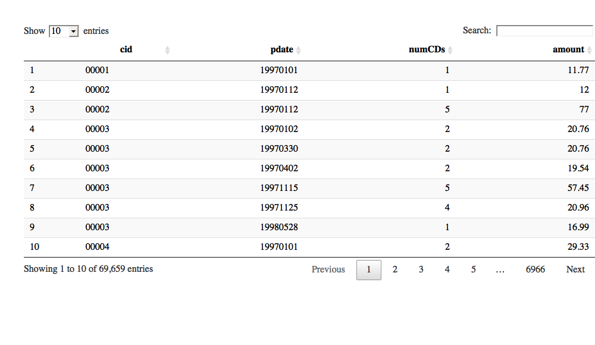
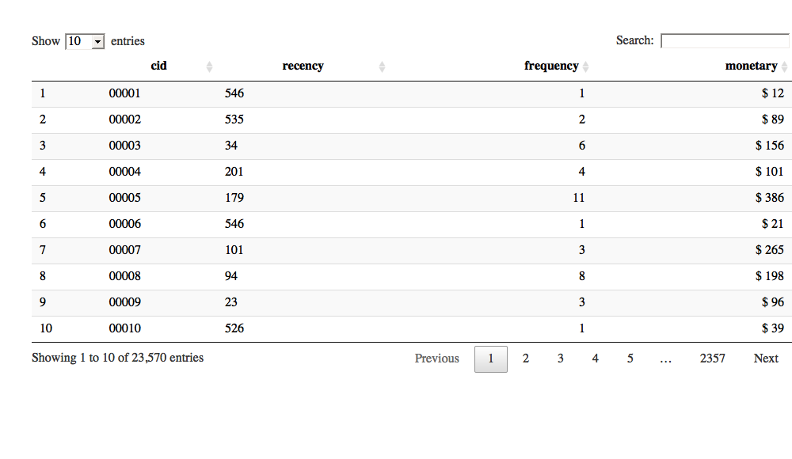
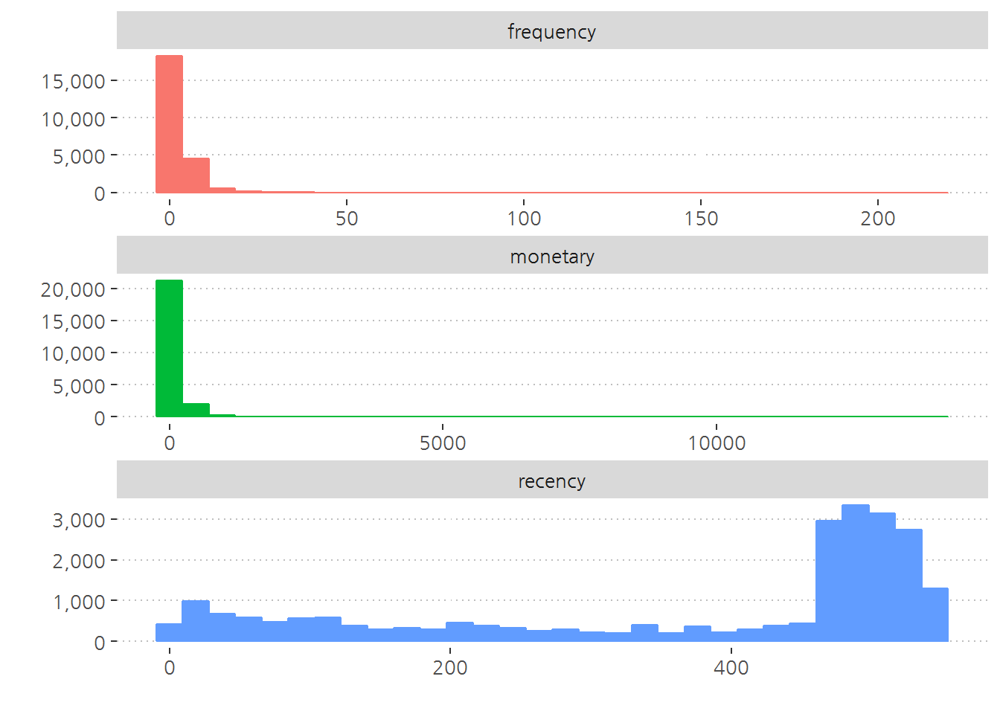
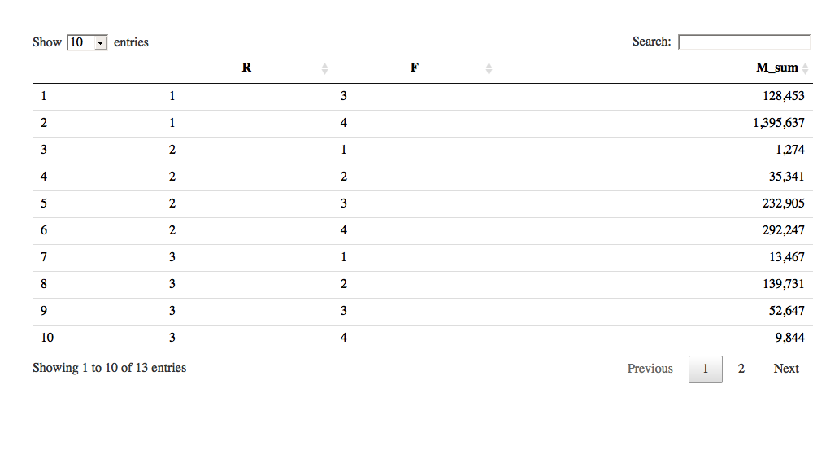
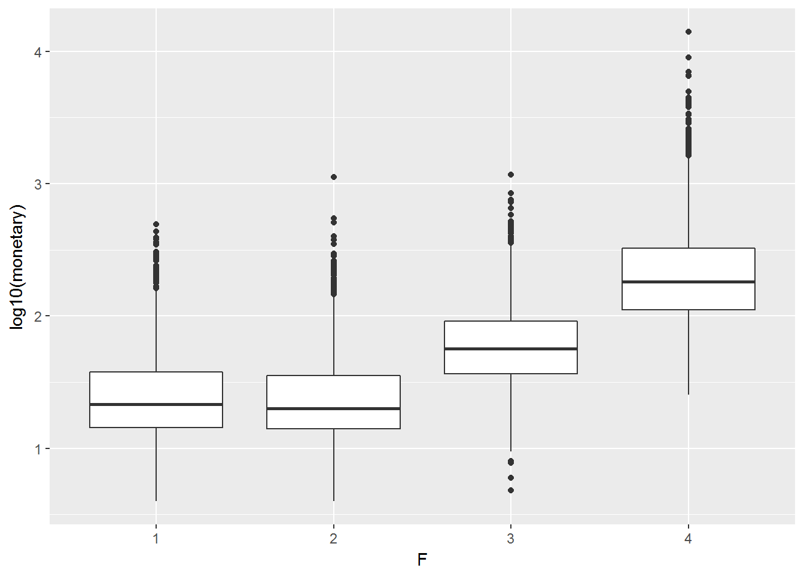
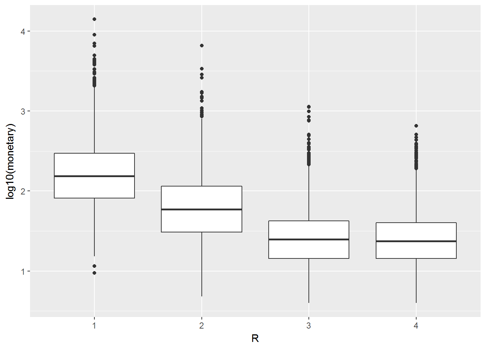
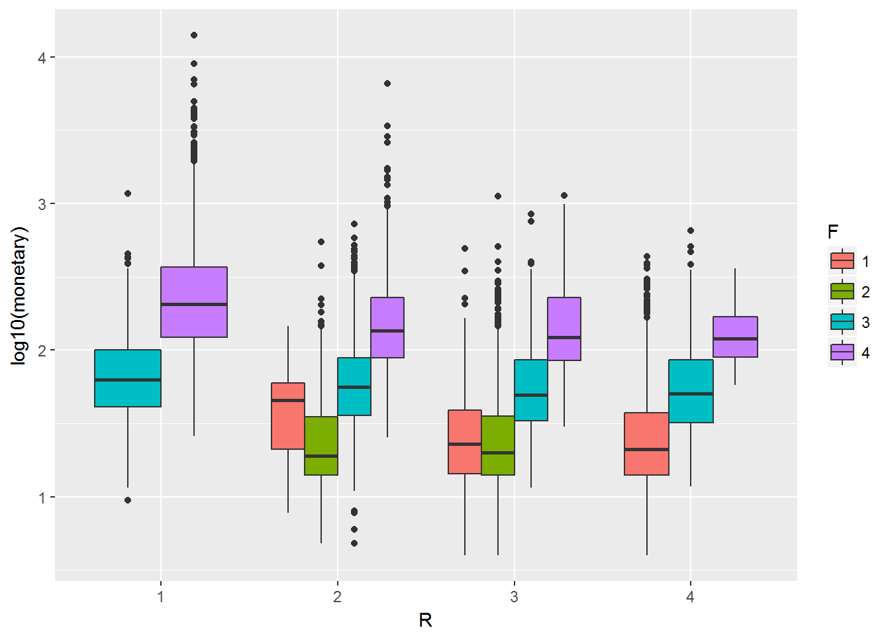

> ## 학습목표 {.objectives}
>
> * 예측모형 활용분야에 대해 살펴본다.
> * 예측모형과 적용분야에 대한 관계를 추론한다.
> * 거시에서 미시로, 미시에서 거시로 들어가는 고객분석에 대해 이해한다.

## 1. 예측모형과 고객 {#predictive-model-customer}

고객에 대한 정의는 게임산업에서는 게임사용자가 될 수 있고, 교육분야에서는 학생이 될 수 있고, 자동차회사에서는 자동차 구매자가 될 수 있고, 
병원에서는 환자가 될 수 있다. 고객이 누구든지 관계없이 고객을 취득(Acquistion)하고 개발(Development)하고, 
유지(Retention)하는 것이 우리가 살고 있는 지금 세상에서는 일상적으로 일어나고 있고, 열심히 경주하는 일이라고도 볼 수 있다.

거시에서 미시로 들어가는 모형에 대해 살펴보자. 
모집단에 대한 이해를 하고, 연관성을 파악하고자 할 경우 RFM 분석모형이 제시되고 있다. 
고객집단과 세분화결과 생긴 군집에 대한 인과추론 작업도 만약 대조군/실험군을 통한 제어를 했다면 가능하다. 
모집단에서 개인으로 넘어가서 심하게는 각 개인별 연관성에 초점을 맞추거나 맞춤형 실험처리하는 경우 다양한 모형과 통계적 이론을 접목하여 이해한다.

## 2. 거시에서 미시로 들어가는 고객분석 [^pm-lift] [^pm-uplift] {#predictive-model-from-to}

[^pm-lift]: [Uplift modelling](https://en.wikipedia.org/wiki/Uplift_modelling)

[^pm-uplift]: [Uplift Modeling Workshop](http://www.slideshare.net/odsc/victor-lomachinelearningpresentation)

### 2.1. 반응/성향 모형 {#predictive-model-propensity}

예측모형은 다양한 분야에 활용되었는데 고객관계관리(CRM, Customer Relationship Management)에서 
**고객유치(acqusition)**, **교차판매(cross-sell)나 상향판매(upsell)**, **고객유지율(retention)** 향상을 통해 나타난다. 
일반적 캠페인의 예를 들면, 신규고객을 유치(미성년자 &rarr; 성년)하거나, 남의 집 고객을 다시 되찾아 오거나(KT &rarr; SKT), 
문제 혹은 고비용 고객을 안내하여 타사 고객으로 바꾸는 등 다양한 사례가 존재한다.

고객이 유치되면 고객에 대해 더 고급진 제품과 서비스를 통해 매출을 **신장(upselling)**하거나 다른 제품을 소개하거나 
**교차상품판매(cross-selling)** 등을 통해 고객에 대한 제품 및 서비스를 강화한다.

신규고객 유치비용은 기존고객을 유지하는 것에 비해 훨씬 비용이 많이 드는 경우가 많다. 
이유는 신규고객유치를 위해 중간 판매대리점에 보조금과 지원금을 지원하고 추가 광고비를 집행 때문에 그렇다. 
따라서 고객을 이탈을 최소화하고 다르게 보면 고객 유지를 잘 해야하는 것도 같은 맥락에서 이해될 수 있다.

#### 제조사/유통사 관점

제조사/유통사에서 바라볼 때, 중요한 기능은 서비스에 대한 고객만족도, 제품범주에 있어 브래드 가치, 제품에 대한 고급성 등이 존재한다.

* 서비스에 대한 고객만족도(customer satisfaction)
* 제품범주에 대한 브랜드 통솔력(brand leadership)
* 제품에 대한 고급성(luxury)

#### 고객 관점 [^ml-pm]

[^ml-pm]: [Predictive Analytics: The Power to Predict Who Will Click, Buy, Lie, or Die](https://www.youtube.com/watch?v=YVJ5cbRRvNc)

고객이냐 고객이 아니냐가 중요한게 아니다. 
미국 대선에서 공화당을 지지하느냐, 민주당을 지지하느냐가 예측 모형의 핵심이 아니라, 
우리나라의 경우 무조건 새누리, 더민주인 사람에게 예측모형을 적용하는 것은 무의미하고, 
어찌보면 접촉했을 때만 반응하는 고객을 찾아내는 것이 문제의 핵심이 될 수 있다.

* Persuadables -- 목표고객으로 설정해서 접촉했기 때문에 마케팅 행사에 반응하는 고객
* Sure Things -- 목표고객으로 설정이 되든 말든 마케팅 행사에 반응하는 고객
* Lost Causes -- 목표고객으로 설정이 되든 말든 마케팅 행사에 반응하지 않는 고객
* Do Not Disturbs or Sleeping Dogs -- 목표고객으로 설정되었기 때문에 마케팅 행사에 더 반응하지 않는 고객

### 2.2. RFM 모형 [^rfm-clv] [^customer-segmentation] {#predictive-model-rfm} 

[^rfm-clv]: [Hoa K. Quach, Customer Lifetime Value (CLV), RPubs](https://rpubs.com/hoakevinquach/Customer-Lifetime-Value-CLV)

[^customer-segmentation]: [Putler, RFM Analysis For Successful Customer Segmentation](https://www.putler.com/rfm-analysis/)

RFM(Recency, Frequency, Monetary)은 고객의 가치(매출???)를 다음 세가지 측도로 평가하고, 이 모형을 바탕으로 연관성과 더불어 필요하면 가설을 도출할 수도 있다.

* **R** ecency- 거래 최근성: 고객이 얼마나 최근에 구입했는가?
* **F** requency- 거래빈도: 고객이 얼마나 빈번하게 우리 상품을 구입했나?
* **M** onetary- 거래규모: 고객이 구입했던 총 금액은 어느 정도인가? 

$$\begin{align*} V_{고객가치} &= f(거래 최근성, 거래빈도, 거래규모)\\
&= \beta_0 + \beta_1 \times 거래 최근성 + \beta_2 \times 거래빈도
+ \beta_3 \times 거래규모 + \epsilon \end{align*}$$

## 3. CDNOW RFM 분석 [^r-blogger-data-apple] [^slideshare-rfm] {#cdnow-rfm}

[^r-blogger-data-apple]: [Jack Han (2013), RFM Customer Analysis with R Language](https://www.r-bloggers.com/rfm-customer-analysis-with-r-language/)
[^slideshare-rfm]: [Kamil Bartocha, Lead Data Scientist at Schroders(2015), RFM Segmentation](https://www.slideshare.net/WhiteRavenPL/rfm-segmentation)

### 3.1. 데이터 가져오기 {#cdnow-data-download}

[http://www.brucehardie.com/datasets/](http://www.brucehardie.com/datasets/) 웹사이트에서 RFM 데이터 분석을 위한 데이터를 다운로드 받아 
압축을 풀고 데이터를 살펴본다.

~~~{.r}
# 0. 환경설정 -----------
# library(tidyverse)
# library(lubridate)
# library(skimr)
# library(extrafont)
# library(ggpubr)
# loadfonts()
# library(knitr)
# library(kableExtra)
# library(DT)

# 1. 데이터 가져오기 -----------
## 1.1. 데이터 다운로드
download.file(url="http://www.brucehardie.com/datasets/CDNOW_master.zip", destfile = "data/CDNOW_master.zip")
unzip("data/CDNOW_master.zip", exdir ="data/CDNOW")
 
## 1.2. 데이터 가져오기
cdnow_dat <- read_fwf("data/CDNOW/CDNOW_master.txt", fwf_cols(cid = 6, pdate = 9, numCDs = 3, amount=8))
~~~

~~~{.output}
Parsed with column specification:
cols(
  cid = col_character(),
  pdate = col_integer(),
  numCDs = col_integer(),
  amount = col_double()
)

~~~

~~~{.r}
DT::datatable(cdnow_dat)
~~~

~~~{.output}
Warning in instance$preRenderHook(instance): It seems your data is too
big for client-side DataTables. You may consider server-side processing:
http://rstudio.github.io/DT/server.html

~~~

### 3.2. 데이터 정제 {#cdnow-data-cleansing}

데이터의 자료형을 맞춰주고 나서, 거래최근성, 거래빈도, 거래규모를 원본 데이터에서 산출해서 살펴본다.

~~~{.r}
# 2. 데이터 정제 및 RFM -----------

cdnow_df <- cdnow_dat %>% 
    mutate(pdate = parse_date(pdate, format = "%Y%m%d")) %>% 
    select(-numCDs)

skim(cdnow_df)
~~~

~~~{.output}
Error in print.skim_df(x, ...): 사용되지 않은 인자 (options = list(eval = TRUE, echo = TRUE, results = "markup", tidy = FALSE, tidy.opts = NULL, collapse = FALSE, prompt = FALSE, comment = NA, highlight = TRUE, strip.white = TRUE, size = "normalsize", background = "#F7F7F7", cache = 0, cache.path = "cache/", cache.vars = NULL, cache.lazy = TRUE, dependson = NULL, autodep = FALSE, cache.rebuild = FALSE, fig.keep = "high", fig.show = "asis", fig.align = "center", fig.path = "fig/", dev = "png", dev.args = NULL, dpi = 72, fig.ext = "png", fig.width = 7, 
    fig.height = 7, fig.env = "figure", fig.cap = NULL, fig.scap = NULL, fig.lp = "fig:", fig.subcap = NULL, fig.pos = "", out.width = NULL, out.height = NULL, out.extra = NULL, fig.retina = 1, external = TRUE, sanitize = FALSE, interval = 1, aniopts = "controls,loop", warning = TRUE, error = TRUE, message = TRUE, render = NULL, ref.label = NULL, child = NULL, engine = "R", split = FALSE, include = TRUE, purl = TRUE, label = "preprocessing-cdnow-data", out.width.px = 504, out.height.px = 504, code = c("# 2. 데이터 정제 및 RFM -----------", 
    "", "cdnow_df <- cdnow_dat %>% ", "    mutate(pdate = parse_date(pdate, format = \"%Y%m%d\")) %>% ", "    select(-numCDs)", "", "skim(cdnow_df)", "", "cdnow_rfm_df <- cdnow_df %>% ", "    mutate(purchase_gap = difftime(ymd(\"1998-07-01\"), pdate, units = \"day\")) %>% ", "    group_by(cid) %>% ", "    summarize(recency = min(purchase_gap),", "              frequency = n(),", "              monetary = sum(amount))", "", "DT::datatable(cdnow_rfm_df) %>% ", "    DT::formatCurrency(c(\"monetary\"), currency=\"$ \", interval = 3, digits = 0)"
    ), params.src = "preprocessing-cdnow-data"))

~~~

~~~{.r}
cdnow_rfm_df <- cdnow_df %>% 
    mutate(purchase_gap = difftime(ymd("1998-07-01"), pdate, units = "day")) %>% 
    group_by(cid) %>% 
    summarize(recency = min(purchase_gap),
              frequency = n(),
              monetary = sum(amount))

DT::datatable(cdnow_rfm_df) %>% 
    DT::formatCurrency(c("monetary"), currency="$ ", interval = 3, digits = 0)
~~~

~~~{.output}
Warning in instance$preRenderHook(instance): It seems your data is too
big for client-side DataTables. You may consider server-side processing:
http://rstudio.github.io/DT/server.html

~~~

### 3.3. RFM 데이터 시각화 {#cdnow-data-rfm-viz}

세가지 지표를 시각화하여 대략적인 분포를 이해한다.

~~~{.r}
cdnow_rfm_df %>% 
    gather(rfm_key, rfm_value, -cid) %>%
    ggplot(aes(x=rfm_value, color=rfm_key, fill= rfm_key)) +
      geom_histogram() +
      facet_wrap(~rfm_key, scale="free", nrow=3) +
      theme_pubclean(base_family = "NanumGothic") +
      theme(legend.position = "none") +
      labs(x="", y="") +
      scale_y_continuous(labels = scales::comma)
~~~

~~~{.output}
Warning: attributes are not identical across measure variables; they will
be dropped

~~~

~~~{.output}
`stat_bin()` using `bins = 30`. Pick better value with `binwidth`.

~~~

~~~{.output}
Warning in grid.Call(C_textBounds, as.graphicsAnnot(x$label), x$x, x$y, :
페밀리 "NanumGothic"를 위한 폰트를 찾을 수 없습니다

~~~

~~~{.output}
Warning in grid.Call(C_textBounds, as.graphicsAnnot(x$label), x$x, x$y, :
페밀리 "NanumGothic"를 위한 폰트를 찾을 수 없습니다

Warning in grid.Call(C_textBounds, as.graphicsAnnot(x$label), x$x, x$y, :
페밀리 "NanumGothic"를 위한 폰트를 찾을 수 없습니다

Warning in grid.Call(C_textBounds, as.graphicsAnnot(x$label), x$x, x$y, :
페밀리 "NanumGothic"를 위한 폰트를 찾을 수 없습니다

Warning in grid.Call(C_textBounds, as.graphicsAnnot(x$label), x$x, x$y, :
페밀리 "NanumGothic"를 위한 폰트를 찾을 수 없습니다

Warning in grid.Call(C_textBounds, as.graphicsAnnot(x$label), x$x, x$y, :
페밀리 "NanumGothic"를 위한 폰트를 찾을 수 없습니다

Warning in grid.Call(C_textBounds, as.graphicsAnnot(x$label), x$x, x$y, :
페밀리 "NanumGothic"를 위한 폰트를 찾을 수 없습니다

Warning in grid.Call(C_textBounds, as.graphicsAnnot(x$label), x$x, x$y, :
페밀리 "NanumGothic"를 위한 폰트를 찾을 수 없습니다

Warning in grid.Call(C_textBounds, as.graphicsAnnot(x$label), x$x, x$y, :
페밀리 "NanumGothic"를 위한 폰트를 찾을 수 없습니다

Warning in grid.Call(C_textBounds, as.graphicsAnnot(x$label), x$x, x$y, :
페밀리 "NanumGothic"를 위한 폰트를 찾을 수 없습니다

Warning in grid.Call(C_textBounds, as.graphicsAnnot(x$label), x$x, x$y, :
페밀리 "NanumGothic"를 위한 폰트를 찾을 수 없습니다

Warning in grid.Call(C_textBounds, as.graphicsAnnot(x$label), x$x, x$y, :
페밀리 "NanumGothic"를 위한 폰트를 찾을 수 없습니다

Warning in grid.Call(C_textBounds, as.graphicsAnnot(x$label), x$x, x$y, :
페밀리 "NanumGothic"를 위한 폰트를 찾을 수 없습니다

Warning in grid.Call(C_textBounds, as.graphicsAnnot(x$label), x$x, x$y, :
페밀리 "NanumGothic"를 위한 폰트를 찾을 수 없습니다

Warning in grid.Call(C_textBounds, as.graphicsAnnot(x$label), x$x, x$y, :
페밀리 "NanumGothic"를 위한 폰트를 찾을 수 없습니다

Warning in grid.Call(C_textBounds, as.graphicsAnnot(x$label), x$x, x$y, :
페밀리 "NanumGothic"를 위한 폰트를 찾을 수 없습니다

Warning in grid.Call(C_textBounds, as.graphicsAnnot(x$label), x$x, x$y, :
페밀리 "NanumGothic"를 위한 폰트를 찾을 수 없습니다

Warning in grid.Call(C_textBounds, as.graphicsAnnot(x$label), x$x, x$y, :
페밀리 "NanumGothic"를 위한 폰트를 찾을 수 없습니다

Warning in grid.Call(C_textBounds, as.graphicsAnnot(x$label), x$x, x$y, :
페밀리 "NanumGothic"를 위한 폰트를 찾을 수 없습니다

Warning in grid.Call(C_textBounds, as.graphicsAnnot(x$label), x$x, x$y, :
페밀리 "NanumGothic"를 위한 폰트를 찾을 수 없습니다

Warning in grid.Call(C_textBounds, as.graphicsAnnot(x$label), x$x, x$y, :
페밀리 "NanumGothic"를 위한 폰트를 찾을 수 없습니다

Warning in grid.Call(C_textBounds, as.graphicsAnnot(x$label), x$x, x$y, :
페밀리 "NanumGothic"를 위한 폰트를 찾을 수 없습니다

Warning in grid.Call(C_textBounds, as.graphicsAnnot(x$label), x$x, x$y, :
페밀리 "NanumGothic"를 위한 폰트를 찾을 수 없습니다

Warning in grid.Call(C_textBounds, as.graphicsAnnot(x$label), x$x, x$y, :
페밀리 "NanumGothic"를 위한 폰트를 찾을 수 없습니다

Warning in grid.Call(C_textBounds, as.graphicsAnnot(x$label), x$x, x$y, :
페밀리 "NanumGothic"를 위한 폰트를 찾을 수 없습니다

Warning in grid.Call(C_textBounds, as.graphicsAnnot(x$label), x$x, x$y, :
페밀리 "NanumGothic"를 위한 폰트를 찾을 수 없습니다

Warning in grid.Call(C_textBounds, as.graphicsAnnot(x$label), x$x, x$y, :
페밀리 "NanumGothic"를 위한 폰트를 찾을 수 없습니다

Warning in grid.Call(C_textBounds, as.graphicsAnnot(x$label), x$x, x$y, :
페밀리 "NanumGothic"를 위한 폰트를 찾을 수 없습니다

Warning in grid.Call(C_textBounds, as.graphicsAnnot(x$label), x$x, x$y, :
페밀리 "NanumGothic"를 위한 폰트를 찾을 수 없습니다

Warning in grid.Call(C_textBounds, as.graphicsAnnot(x$label), x$x, x$y, :
페밀리 "NanumGothic"를 위한 폰트를 찾을 수 없습니다

Warning in grid.Call(C_textBounds, as.graphicsAnnot(x$label), x$x, x$y, :
페밀리 "NanumGothic"를 위한 폰트를 찾을 수 없습니다

Warning in grid.Call(C_textBounds, as.graphicsAnnot(x$label), x$x, x$y, :
페밀리 "NanumGothic"를 위한 폰트를 찾을 수 없습니다

Warning in grid.Call(C_textBounds, as.graphicsAnnot(x$label), x$x, x$y, :
페밀리 "NanumGothic"를 위한 폰트를 찾을 수 없습니다

Warning in grid.Call(C_textBounds, as.graphicsAnnot(x$label), x$x, x$y, :
페밀리 "NanumGothic"를 위한 폰트를 찾을 수 없습니다

Warning in grid.Call(C_textBounds, as.graphicsAnnot(x$label), x$x, x$y, :
페밀리 "NanumGothic"를 위한 폰트를 찾을 수 없습니다

Warning in grid.Call(C_textBounds, as.graphicsAnnot(x$label), x$x, x$y, :
페밀리 "NanumGothic"를 위한 폰트를 찾을 수 없습니다

Warning in grid.Call(C_textBounds, as.graphicsAnnot(x$label), x$x, x$y, :
페밀리 "NanumGothic"를 위한 폰트를 찾을 수 없습니다

Warning in grid.Call(C_textBounds, as.graphicsAnnot(x$label), x$x, x$y, :
페밀리 "NanumGothic"를 위한 폰트를 찾을 수 없습니다

Warning in grid.Call(C_textBounds, as.graphicsAnnot(x$label), x$x, x$y, :
페밀리 "NanumGothic"를 위한 폰트를 찾을 수 없습니다

Warning in grid.Call(C_textBounds, as.graphicsAnnot(x$label), x$x, x$y, :
페밀리 "NanumGothic"를 위한 폰트를 찾을 수 없습니다

Warning in grid.Call(C_textBounds, as.graphicsAnnot(x$label), x$x, x$y, :
페밀리 "NanumGothic"를 위한 폰트를 찾을 수 없습니다

Warning in grid.Call(C_textBounds, as.graphicsAnnot(x$label), x$x, x$y, :
페밀리 "NanumGothic"를 위한 폰트를 찾을 수 없습니다

Warning in grid.Call(C_textBounds, as.graphicsAnnot(x$label), x$x, x$y, :
페밀리 "NanumGothic"를 위한 폰트를 찾을 수 없습니다

Warning in grid.Call(C_textBounds, as.graphicsAnnot(x$label), x$x, x$y, :
페밀리 "NanumGothic"를 위한 폰트를 찾을 수 없습니다

Warning in grid.Call(C_textBounds, as.graphicsAnnot(x$label), x$x, x$y, :
페밀리 "NanumGothic"를 위한 폰트를 찾을 수 없습니다

Warning in grid.Call(C_textBounds, as.graphicsAnnot(x$label), x$x, x$y, :
페밀리 "NanumGothic"를 위한 폰트를 찾을 수 없습니다

Warning in grid.Call(C_textBounds, as.graphicsAnnot(x$label), x$x, x$y, :
페밀리 "NanumGothic"를 위한 폰트를 찾을 수 없습니다

Warning in grid.Call(C_textBounds, as.graphicsAnnot(x$label), x$x, x$y, :
페밀리 "NanumGothic"를 위한 폰트를 찾을 수 없습니다

Warning in grid.Call(C_textBounds, as.graphicsAnnot(x$label), x$x, x$y, :
페밀리 "NanumGothic"를 위한 폰트를 찾을 수 없습니다

Warning in grid.Call(C_textBounds, as.graphicsAnnot(x$label), x$x, x$y, :
페밀리 "NanumGothic"를 위한 폰트를 찾을 수 없습니다

Warning in grid.Call(C_textBounds, as.graphicsAnnot(x$label), x$x, x$y, :
페밀리 "NanumGothic"를 위한 폰트를 찾을 수 없습니다

Warning in grid.Call(C_textBounds, as.graphicsAnnot(x$label), x$x, x$y, :
페밀리 "NanumGothic"를 위한 폰트를 찾을 수 없습니다

Warning in grid.Call(C_textBounds, as.graphicsAnnot(x$label), x$x, x$y, :
페밀리 "NanumGothic"를 위한 폰트를 찾을 수 없습니다

Warning in grid.Call(C_textBounds, as.graphicsAnnot(x$label), x$x, x$y, :
페밀리 "NanumGothic"를 위한 폰트를 찾을 수 없습니다

Warning in grid.Call(C_textBounds, as.graphicsAnnot(x$label), x$x, x$y, :
페밀리 "NanumGothic"를 위한 폰트를 찾을 수 없습니다

Warning in grid.Call(C_textBounds, as.graphicsAnnot(x$label), x$x, x$y, :
페밀리 "NanumGothic"를 위한 폰트를 찾을 수 없습니다

Warning in grid.Call(C_textBounds, as.graphicsAnnot(x$label), x$x, x$y, :
페밀리 "NanumGothic"를 위한 폰트를 찾을 수 없습니다

Warning in grid.Call(C_textBounds, as.graphicsAnnot(x$label), x$x, x$y, :
페밀리 "NanumGothic"를 위한 폰트를 찾을 수 없습니다

Warning in grid.Call(C_textBounds, as.graphicsAnnot(x$label), x$x, x$y, :
페밀리 "NanumGothic"를 위한 폰트를 찾을 수 없습니다

Warning in grid.Call(C_textBounds, as.graphicsAnnot(x$label), x$x, x$y, :
페밀리 "NanumGothic"를 위한 폰트를 찾을 수 없습니다

Warning in grid.Call(C_textBounds, as.graphicsAnnot(x$label), x$x, x$y, :
페밀리 "NanumGothic"를 위한 폰트를 찾을 수 없습니다

Warning in grid.Call(C_textBounds, as.graphicsAnnot(x$label), x$x, x$y, :
페밀리 "NanumGothic"를 위한 폰트를 찾을 수 없습니다

Warning in grid.Call(C_textBounds, as.graphicsAnnot(x$label), x$x, x$y, :
페밀리 "NanumGothic"를 위한 폰트를 찾을 수 없습니다

Warning in grid.Call(C_textBounds, as.graphicsAnnot(x$label), x$x, x$y, :
페밀리 "NanumGothic"를 위한 폰트를 찾을 수 없습니다

Warning in grid.Call(C_textBounds, as.graphicsAnnot(x$label), x$x, x$y, :
페밀리 "NanumGothic"를 위한 폰트를 찾을 수 없습니다

Warning in grid.Call(C_textBounds, as.graphicsAnnot(x$label), x$x, x$y, :
페밀리 "NanumGothic"를 위한 폰트를 찾을 수 없습니다

Warning in grid.Call(C_textBounds, as.graphicsAnnot(x$label), x$x, x$y, :
페밀리 "NanumGothic"를 위한 폰트를 찾을 수 없습니다

Warning in grid.Call(C_textBounds, as.graphicsAnnot(x$label), x$x, x$y, :
페밀리 "NanumGothic"를 위한 폰트를 찾을 수 없습니다

Warning in grid.Call(C_textBounds, as.graphicsAnnot(x$label), x$x, x$y, :
페밀리 "NanumGothic"를 위한 폰트를 찾을 수 없습니다

Warning in grid.Call(C_textBounds, as.graphicsAnnot(x$label), x$x, x$y, :
페밀리 "NanumGothic"를 위한 폰트를 찾을 수 없습니다

Warning in grid.Call(C_textBounds, as.graphicsAnnot(x$label), x$x, x$y, :
페밀리 "NanumGothic"를 위한 폰트를 찾을 수 없습니다

Warning in grid.Call(C_textBounds, as.graphicsAnnot(x$label), x$x, x$y, :
페밀리 "NanumGothic"를 위한 폰트를 찾을 수 없습니다

Warning in grid.Call(C_textBounds, as.graphicsAnnot(x$label), x$x, x$y, :
페밀리 "NanumGothic"를 위한 폰트를 찾을 수 없습니다

Warning in grid.Call(C_textBounds, as.graphicsAnnot(x$label), x$x, x$y, :
페밀리 "NanumGothic"를 위한 폰트를 찾을 수 없습니다

Warning in grid.Call(C_textBounds, as.graphicsAnnot(x$label), x$x, x$y, :
페밀리 "NanumGothic"를 위한 폰트를 찾을 수 없습니다

Warning in grid.Call(C_textBounds, as.graphicsAnnot(x$label), x$x, x$y, :
페밀리 "NanumGothic"를 위한 폰트를 찾을 수 없습니다

Warning in grid.Call(C_textBounds, as.graphicsAnnot(x$label), x$x, x$y, :
페밀리 "NanumGothic"를 위한 폰트를 찾을 수 없습니다

Warning in grid.Call(C_textBounds, as.graphicsAnnot(x$label), x$x, x$y, :
페밀리 "NanumGothic"를 위한 폰트를 찾을 수 없습니다

Warning in grid.Call(C_textBounds, as.graphicsAnnot(x$label), x$x, x$y, :
페밀리 "NanumGothic"를 위한 폰트를 찾을 수 없습니다

Warning in grid.Call(C_textBounds, as.graphicsAnnot(x$label), x$x, x$y, :
페밀리 "NanumGothic"를 위한 폰트를 찾을 수 없습니다

Warning in grid.Call(C_textBounds, as.graphicsAnnot(x$label), x$x, x$y, :
페밀리 "NanumGothic"를 위한 폰트를 찾을 수 없습니다

Warning in grid.Call(C_textBounds, as.graphicsAnnot(x$label), x$x, x$y, :
페밀리 "NanumGothic"를 위한 폰트를 찾을 수 없습니다

Warning in grid.Call(C_textBounds, as.graphicsAnnot(x$label), x$x, x$y, :
페밀리 "NanumGothic"를 위한 폰트를 찾을 수 없습니다

Warning in grid.Call(C_textBounds, as.graphicsAnnot(x$label), x$x, x$y, :
페밀리 "NanumGothic"를 위한 폰트를 찾을 수 없습니다

Warning in grid.Call(C_textBounds, as.graphicsAnnot(x$label), x$x, x$y, :
페밀리 "NanumGothic"를 위한 폰트를 찾을 수 없습니다

Warning in grid.Call(C_textBounds, as.graphicsAnnot(x$label), x$x, x$y, :
페밀리 "NanumGothic"를 위한 폰트를 찾을 수 없습니다

Warning in grid.Call(C_textBounds, as.graphicsAnnot(x$label), x$x, x$y, :
페밀리 "NanumGothic"를 위한 폰트를 찾을 수 없습니다

Warning in grid.Call(C_textBounds, as.graphicsAnnot(x$label), x$x, x$y, :
페밀리 "NanumGothic"를 위한 폰트를 찾을 수 없습니다

Warning in grid.Call(C_textBounds, as.graphicsAnnot(x$label), x$x, x$y, :
페밀리 "NanumGothic"를 위한 폰트를 찾을 수 없습니다

Warning in grid.Call(C_textBounds, as.graphicsAnnot(x$label), x$x, x$y, :
페밀리 "NanumGothic"를 위한 폰트를 찾을 수 없습니다

Warning in grid.Call(C_textBounds, as.graphicsAnnot(x$label), x$x, x$y, :
페밀리 "NanumGothic"를 위한 폰트를 찾을 수 없습니다

Warning in grid.Call(C_textBounds, as.graphicsAnnot(x$label), x$x, x$y, :
페밀리 "NanumGothic"를 위한 폰트를 찾을 수 없습니다

Warning in grid.Call(C_textBounds, as.graphicsAnnot(x$label), x$x, x$y, :
페밀리 "NanumGothic"를 위한 폰트를 찾을 수 없습니다

Warning in grid.Call(C_textBounds, as.graphicsAnnot(x$label), x$x, x$y, :
페밀리 "NanumGothic"를 위한 폰트를 찾을 수 없습니다

Warning in grid.Call(C_textBounds, as.graphicsAnnot(x$label), x$x, x$y, :
페밀리 "NanumGothic"를 위한 폰트를 찾을 수 없습니다

Warning in grid.Call(C_textBounds, as.graphicsAnnot(x$label), x$x, x$y, :
페밀리 "NanumGothic"를 위한 폰트를 찾을 수 없습니다

Warning in grid.Call(C_textBounds, as.graphicsAnnot(x$label), x$x, x$y, :
페밀리 "NanumGothic"를 위한 폰트를 찾을 수 없습니다

Warning in grid.Call(C_textBounds, as.graphicsAnnot(x$label), x$x, x$y, :
페밀리 "NanumGothic"를 위한 폰트를 찾을 수 없습니다

Warning in grid.Call(C_textBounds, as.graphicsAnnot(x$label), x$x, x$y, :
페밀리 "NanumGothic"를 위한 폰트를 찾을 수 없습니다

Warning in grid.Call(C_textBounds, as.graphicsAnnot(x$label), x$x, x$y, :
페밀리 "NanumGothic"를 위한 폰트를 찾을 수 없습니다

Warning in grid.Call(C_textBounds, as.graphicsAnnot(x$label), x$x, x$y, :
페밀리 "NanumGothic"를 위한 폰트를 찾을 수 없습니다

Warning in grid.Call(C_textBounds, as.graphicsAnnot(x$label), x$x, x$y, :
페밀리 "NanumGothic"를 위한 폰트를 찾을 수 없습니다

Warning in grid.Call(C_textBounds, as.graphicsAnnot(x$label), x$x, x$y, :
페밀리 "NanumGothic"를 위한 폰트를 찾을 수 없습니다

Warning in grid.Call(C_textBounds, as.graphicsAnnot(x$label), x$x, x$y, :
페밀리 "NanumGothic"를 위한 폰트를 찾을 수 없습니다

Warning in grid.Call(C_textBounds, as.graphicsAnnot(x$label), x$x, x$y, :
페밀리 "NanumGothic"를 위한 폰트를 찾을 수 없습니다

Warning in grid.Call(C_textBounds, as.graphicsAnnot(x$label), x$x, x$y, :
페밀리 "NanumGothic"를 위한 폰트를 찾을 수 없습니다

Warning in grid.Call(C_textBounds, as.graphicsAnnot(x$label), x$x, x$y, :
페밀리 "NanumGothic"를 위한 폰트를 찾을 수 없습니다

Warning in grid.Call(C_textBounds, as.graphicsAnnot(x$label), x$x, x$y, :
페밀리 "NanumGothic"를 위한 폰트를 찾을 수 없습니다

Warning in grid.Call(C_textBounds, as.graphicsAnnot(x$label), x$x, x$y, :
페밀리 "NanumGothic"를 위한 폰트를 찾을 수 없습니다

Warning in grid.Call(C_textBounds, as.graphicsAnnot(x$label), x$x, x$y, :
페밀리 "NanumGothic"를 위한 폰트를 찾을 수 없습니다

Warning in grid.Call(C_textBounds, as.graphicsAnnot(x$label), x$x, x$y, :
페밀리 "NanumGothic"를 위한 폰트를 찾을 수 없습니다

Warning in grid.Call(C_textBounds, as.graphicsAnnot(x$label), x$x, x$y, :
페밀리 "NanumGothic"를 위한 폰트를 찾을 수 없습니다

Warning in grid.Call(C_textBounds, as.graphicsAnnot(x$label), x$x, x$y, :
페밀리 "NanumGothic"를 위한 폰트를 찾을 수 없습니다

Warning in grid.Call(C_textBounds, as.graphicsAnnot(x$label), x$x, x$y, :
페밀리 "NanumGothic"를 위한 폰트를 찾을 수 없습니다

Warning in grid.Call(C_textBounds, as.graphicsAnnot(x$label), x$x, x$y, :
페밀리 "NanumGothic"를 위한 폰트를 찾을 수 없습니다

Warning in grid.Call(C_textBounds, as.graphicsAnnot(x$label), x$x, x$y, :
페밀리 "NanumGothic"를 위한 폰트를 찾을 수 없습니다

Warning in grid.Call(C_textBounds, as.graphicsAnnot(x$label), x$x, x$y, :
페밀리 "NanumGothic"를 위한 폰트를 찾을 수 없습니다

Warning in grid.Call(C_textBounds, as.graphicsAnnot(x$label), x$x, x$y, :
페밀리 "NanumGothic"를 위한 폰트를 찾을 수 없습니다

Warning in grid.Call(C_textBounds, as.graphicsAnnot(x$label), x$x, x$y, :
페밀리 "NanumGothic"를 위한 폰트를 찾을 수 없습니다

Warning in grid.Call(C_textBounds, as.graphicsAnnot(x$label), x$x, x$y, :
페밀리 "NanumGothic"를 위한 폰트를 찾을 수 없습니다

Warning in grid.Call(C_textBounds, as.graphicsAnnot(x$label), x$x, x$y, :
페밀리 "NanumGothic"를 위한 폰트를 찾을 수 없습니다

Warning in grid.Call(C_textBounds, as.graphicsAnnot(x$label), x$x, x$y, :
페밀리 "NanumGothic"를 위한 폰트를 찾을 수 없습니다

Warning in grid.Call(C_textBounds, as.graphicsAnnot(x$label), x$x, x$y, :
페밀리 "NanumGothic"를 위한 폰트를 찾을 수 없습니다

Warning in grid.Call(C_textBounds, as.graphicsAnnot(x$label), x$x, x$y, :
페밀리 "NanumGothic"를 위한 폰트를 찾을 수 없습니다

Warning in grid.Call(C_textBounds, as.graphicsAnnot(x$label), x$x, x$y, :
페밀리 "NanumGothic"를 위한 폰트를 찾을 수 없습니다

Warning in grid.Call(C_textBounds, as.graphicsAnnot(x$label), x$x, x$y, :
페밀리 "NanumGothic"를 위한 폰트를 찾을 수 없습니다

Warning in grid.Call(C_textBounds, as.graphicsAnnot(x$label), x$x, x$y, :
페밀리 "NanumGothic"를 위한 폰트를 찾을 수 없습니다

Warning in grid.Call(C_textBounds, as.graphicsAnnot(x$label), x$x, x$y, :
페밀리 "NanumGothic"를 위한 폰트를 찾을 수 없습니다

Warning in grid.Call(C_textBounds, as.graphicsAnnot(x$label), x$x, x$y, :
페밀리 "NanumGothic"를 위한 폰트를 찾을 수 없습니다

Warning in grid.Call(C_textBounds, as.graphicsAnnot(x$label), x$x, x$y, :
페밀리 "NanumGothic"를 위한 폰트를 찾을 수 없습니다

Warning in grid.Call(C_textBounds, as.graphicsAnnot(x$label), x$x, x$y, :
페밀리 "NanumGothic"를 위한 폰트를 찾을 수 없습니다

Warning in grid.Call(C_textBounds, as.graphicsAnnot(x$label), x$x, x$y, :
페밀리 "NanumGothic"를 위한 폰트를 찾을 수 없습니다

Warning in grid.Call(C_textBounds, as.graphicsAnnot(x$label), x$x, x$y, :
페밀리 "NanumGothic"를 위한 폰트를 찾을 수 없습니다

Warning in grid.Call(C_textBounds, as.graphicsAnnot(x$label), x$x, x$y, :
페밀리 "NanumGothic"를 위한 폰트를 찾을 수 없습니다

Warning in grid.Call(C_textBounds, as.graphicsAnnot(x$label), x$x, x$y, :
페밀리 "NanumGothic"를 위한 폰트를 찾을 수 없습니다

Warning in grid.Call(C_textBounds, as.graphicsAnnot(x$label), x$x, x$y, :
페밀리 "NanumGothic"를 위한 폰트를 찾을 수 없습니다

Warning in grid.Call(C_textBounds, as.graphicsAnnot(x$label), x$x, x$y, :
페밀리 "NanumGothic"를 위한 폰트를 찾을 수 없습니다

~~~

~~~{.output}
Error in grid.Call(C_textBounds, as.graphicsAnnot(x$label), x$x, x$y, : 다각형의 끝점을 찾을 수 없습니다

~~~

### 3.4. RFM 매트릭스 {#cdnow-data-rfm-matrix}

RFM을 4개 집단으로 나눠 고객 각각이 속한 집단을 명세하고 총거래금액 별로 살펴본다.

~~~{.r}
# 3. RFM 매트릭스 -----------

cdnow_rfm_df <- cdnow_rfm_df %>% 
    mutate(R = factor(ntile(recency, 4)),
           F = factor(ntile(frequency, 4)),
           M = factor(ntile(monetary, 4)))

cdnow_rfm_df %>% group_by(R, F) %>% 
    summarise(M_sum = sum(monetary)) %>% 
    DT::datatable() %>% 
    formatCurrency('M_sum', currency="", digits =0, interval =3) %>% 
    formatStyle(
        c('R'),
        target = 'row',
        backgroundColor = styleEqual(c(1,2,3,4), c('white', 'white', 'white', 'yellow'))
    )
~~~

### 3.4. 구매금액별 RFM 군집 비교 {#cdnow-data-rfm-matrix-comparison}

거래빈도(F), 거래최근성(R)에 따라 구매금액변화를 상용로그(log10) 척도로 비교한다.

~~~{.r}
# 4. 시각화 -----------
## 4.1. 단변량
cdnow_rfm_df %>% 
    ggplot(aes(y=log10(monetary), x=F)) +
    geom_boxplot()
~~~

~~~{.output}
Warning: Removed 68 rows containing non-finite values (stat_boxplot).

~~~

~~~{.r}
cdnow_rfm_df %>% 
    ggplot(aes(y=log10(monetary), x=R)) +
    geom_boxplot()
~~~

~~~{.output}
Warning: Removed 68 rows containing non-finite values (stat_boxplot).

~~~

~~~{.r}
## 4.2. 다변량

cdnow_rfm_df %>% 
    ggplot(aes(y=log10(monetary), x=R, fill=F)) +
    geom_boxplot()
~~~

~~~{.output}
Warning: Removed 68 rows containing non-finite values (stat_boxplot).

~~~

