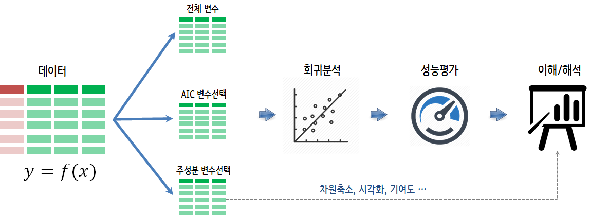

 

``` {r, include=FALSE}
source("tools/chunk-options.R")
knitr::opts_chunk$set(echo=TRUE, message=FALSE, warning=FALSE)
```

# 보스턴 집값 예측모형 {#boston-housing-price}

보스턴 집값 데이터는 `MASS` 팩키지 내부 `data(Boston)` 을 통해 확인이 가능하다.
참고로 `data(package="팩키지명")`을 실행시키면 팩키지에 내장된 데이터셋을 확인할 수 있다.

보스턴 중위수 집값(`medv`) 연속형 변수를 제외한 나머지 모든 변수를 집값예측 변수로 동원한다.
변수 갯수가 증가할수록 집값에 대한 예측력은 높아지지만 반대급부로 예측된 집값의 분산이 커지는 단점도 함께 증가한다.

따라서, 적절하게 변수 갯수를 통제해서 예측모형을 만드는 것이 중요한데 다른 한편으로는 
예측모형에 대한 설명도 필요하기 때문에 주성분분석(Pricipal Component Analysis, PCA)를 동원해서 
수십가지 변수를 작은 갯수의 주성분으로 축약해서 회귀분석을 돌리고 각 주성분을 집값 예측모형을 이해하고 설명하는데 
활용한다. 



``` {r boston-housing-setup}
# 0. 환경설정 -----
library(tidyverse)
library(MASS)
library(corrplot)
library(broom)
library(extrafont)
loadfonts()
library(factoextra)

# 1. 데이터 -----
data(Boston)

boston_df <- Boston %>% 
    as_tibble()

DT::datatable(boston_df)
```

# 예측모형 사전검토 {#boston-housing-price-investigate}

회귀분석 모형을 개발하기 전에 변수선택과 차원축소 주성분 방법론 적용을 위한 사전 조치로 
`rms` 팩키지 `vif()` 함수를 사용해서 **5** 이상 값이 존재하는지 파악한다.
차원축소 PCA 기법 적용을 사전에 검토하기 위해서 `cor()` 함수로 변수간 상관관계 존재 유무를 파악하고 
`corrplot(order="AOE")` 방법론을 통해 변수간 상관관계에 군집이 존재하는지 파악한다.

``` {r boston-housing-investigate}
# 2. 회귀분석 -----
## 2.1. 다공선성 방지 및 차원 축소 필요성 검토
boston_lm <- lm(medv ~ ., data = boston_df)

boston_vif <- rms::vif(boston_lm)

boston_vif %>% as.data.frame() %>% 
    rownames_to_column(var="변수명") %>% 
    rename(VIF = ".") %>% 
    arrange(-VIF)

## 2.2. 차원축소(PCA) - 상관분석 ----
boston_df %>% 
    cor() %>% corrplot(order="AOE") 

## 2.3. 주성분 추출 ----
boston_pca <- boston_df %>% 
    dplyr::select(-medv) %>% 
    prcomp(scale = TRUE, center = TRUE)

boston_pc <- boston_pca$x[,1:3] %>% 
    as_tibble()
```

# 회귀모형 개발 {#boston-housing-price-reg-model}

다공선성 문제를 고려하지 않고 모든 변수를 다 넣어 개발한 전체 모형(full model)으로 모형성능의 상한을 파악한다.
그리고, 강건한 회귀모형 개발(AIC)을 위해서 변수선택 혹은 주성분 회귀분석 모형(PCR)을 순차적으로 적합시킨다.

`broom` 팩키지 `glance()` 함수를 사용해서 결정계수, 조정 결정계수 등 모형 성능측도를 통해 
최종 회귀모형 선택에 참고지표로 활용한다.

``` {r boston-housing-reg-model}
# 3. 회귀분석 비교 -----
## 3.1. 주성분 회귀모형 -----
boston_pc_df <- boston_df %>% dplyr::select(medv) %>% 
    bind_cols(boston_pc) 

boston_pc_lm <- lm(medv ~., data=boston_pc_df)

boston_pc_broom <- boston_pc_lm %>% glance %>% 
    gather(통계량, 통계수치) %>% 
    mutate(모형 = "주성분 회귀") %>% 
    dplyr::select(모형, everything())

## 3.2. 다중 선형회귀모형 -----
boston_lm <- lm(medv ~., data=boston_df)

boston_lm_broom <- boston_lm %>% glance %>% 
    gather(통계량, 통계수치) %>% 
    mutate(모형 = "다중회귀") %>% 
    dplyr::select(모형, everything())

## 3.3. 변수선택 다중 선형회귀모형 -----
boston_aic_lm <- stepAIC(boston_lm, trace=0) 
boston_parsi_fm <- as.formula(summary(boston_aic_lm)$call)

boston_parsi_broom <- lm(boston_parsi_fm, data=boston_df) %>% glance %>% 
    gather(통계량, 통계수치) %>% 
    mutate(모형 = "변수선택 회귀") %>% 
    dplyr::select(모형, everything())

## 3.4. 회귀모형 비교 -----
boston_model <- bind_rows(boston_pc_broom, boston_lm_broom) %>% 
    bind_rows(boston_parsi_broom)

boston_model %>% 
    filter(통계량 == "adj.r.squared") %>% 
    ggplot(aes(x=모형, y=통계수치)) +
      geom_bar(stat="identity", width=0.3, fill="lightgreen") +
      coord_flip() +
      labs(y="조정결정계수(Adjusted R Squared)", x="모형") +
      theme_minimal(base_family = "NanumGothic") +
      geom_text(aes(label=round(통계수치,2)), position=position_dodge(width=1), vjust=-0.0, hjust=-0.1)
```

# 회귀모형 설명 [^reg-model-explain] {#boston-housing-price-reg-model-explain}

[^reg-model-explain]: [Principal Component Analysis in R](https://poissonisfish.wordpress.com/2017/01/23/principal-component-analysis-in-r/)

AIC를 통해서 변수선택한 모형을 주택가격 예측에 활용하는 것도 가능하지만 변수가 너무 많고 
각 변수간 상관관계가 여전히 존재하기 때문에 PCA기법으로 추출한 주성분을 변수로 해서 회귀모형을 
구축하는 것이 다소 성능에 있어 하락은 있지만 여러가지 장점이 있다.

## 주성분과 변수 시각화 {#boston-housing-price-reg-model-explain-viz}

주택가격 예측을 위해서 선택된 3가지 주성분과 변수들 관계를 시각화한다.
첫번째 두번째 주성분과 두번째 세번째 주성분, 첫번째와 세번째 주성분을 차례로 시각화한다.

``` {r boston-housing-reg-model-explain-viz, fig.width=10, fig.height=7}
# 4. 주성분 회귀 모형 설명 -----
fviz_eig(boston_pca)

boston_dim_12 <- fviz_pca_var(boston_pca, axes = c(1, 2),
             col.var = "contrib", # Color by contributions to the PC
             gradient.cols = c("#00AFBB", "#E7B800", "#FC4E07"),
             repel = TRUE     # Avoid text overlapping
)

boston_dim_13 <- fviz_pca_var(boston_pca, axes = c(1, 3), 
             col.var = "contrib", # Color by contributions to the PC
             gradient.cols = c("#00AFBB", "#E7B800", "#FC4E07"),
             repel = TRUE     # Avoid text overlapping
)

boston_dim_23 <- fviz_pca_var(boston_pca, axes = c(2, 3), 
             col.var = "contrib", # Color by contributions to the PC
             gradient.cols = c("#00AFBB", "#E7B800", "#FC4E07"),
             repel = TRUE     # Avoid text overlapping
)

gridExtra::grid.arrange(boston_dim_12, boston_dim_13, boston_dim_23, nrow=1 )
```

## 주성분과 변수 로딩 {#boston-housing-price-reg-model-explain-loading}

주성분과 각 변수의 기여분에 대한 로딩(loadings)를 표를 통해 확인한다.

``` {r boston-housing-reg-model-explain-table}
boston_pca$rotation[,1:5] %>% round(2)
```

## 주성분에 대한 기여분 {#boston-housing-price-reg-model-explain-contribution}

[Principal Component Analysis in R: prcomp vs princomp](http://www.sthda.com/english/articles/31-principal-component-methods-in-r-practical-guide/118-principal-component-analysis-in-r-prcomp-vs-princomp/)
내용을 참고하여 주성분에 대한 각 변수 기여도를 파악한다.

``` {r boston-housing-reg-model-explain-contribution}
# Helper function 
#::::::::::::::::::::::::::::::::::::::::
var_coord_func <- function(loadings, comp.sdev){
    loadings*comp.sdev
}
# Compute Coordinates
#::::::::::::::::::::::::::::::::::::::::
loadings <- boston_pca$rotation
sdev <- boston_pca$sdev
var.coord <- t(apply(loadings, 1, var_coord_func, sdev)) 

# Compute Cos2
#::::::::::::::::::::::::::::::::::::::::
var.cos2 <- var.coord^2

# Compute contributions
#::::::::::::::::::::::::::::::::::::::::
comp.cos2 <- apply(var.cos2, 2, sum)
contrib <- function(var.cos2, comp.cos2){var.cos2*100/comp.cos2}
var.contrib <- t(apply(var.cos2,1, contrib, comp.cos2))

# 데이터 정제 -----
boston_var_df <- var.contrib[, 1:3] %>% as_tibble() %>% 
    mutate(변수명 = rownames(var.contrib)) %>% 
    dplyr::select(변수명, everything())

boston_var_df %>% arrange(-PC1) %>% 
    DT::datatable() %>% 
    DT::formatRound(c(2:4), digits=1)
```


