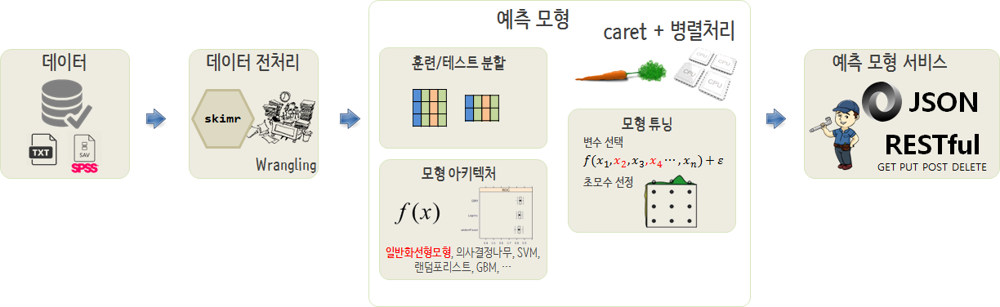

 

``` {r, include=FALSE}
source("tools/chunk-options.R")

knitr::opts_knit$set(echo=TRUE, verbose = FALSE, message=FALSE, warning=FALSE)

library(tidyverse)
library(corrplot)
library(gridExtra)
library(ggthemes)
library(caret)
library(randomForest)
library(party)
library(purrr)
library(extrafont)
library(forcats)
library(skimr)
loadfonts()
library(doParallel)

churn_dat <- read_csv("https://community.watsonanalytics.com/wp-content/uploads/2015/03/WA_Fn-UseC_-Telco-Customer-Churn.csv")

```


# 고객이탈(Churn) [^mca-churn] [^logistic-churn] {#customer-attrition-basics} 

[^mca-churn]: [Data Science +, "Using MCA and variable clustering in R for insights in customer attrition"](https://datascienceplus.com/using-mca-and-variable-clustering-in-r-for-insights-in-customer-attrition/)

[^logistic-churn]: [Data Science +, "Predict Customer Churn – Logistic Regression, Decision Tree and Random Forest"](https://datascienceplus.com/predict-customer-churn-logistic-regression-decision-tree-and-random-forest/)


고객이탈은 영어로 "Customer Churn" 혹은 "Customer Attrition"이라고 하는데 통상적으로 고객이 
더이상 서비스 이용이나 제품구매를 멈출 때 발생된다.
거의 모든 사업영역에서 고객이탈이 문제가 되지만, 
특히 문제가 되는 분야가 통신(텔코, Tele-communication)산업으로 KT, SKT, U+ 등 통신3사가 거의 과점을 하고 있는 
산업분야로 이해하면 된다.

# 데이터셋 {#customer-attrition-dataset}

고객이탈 데이터셋으로 [IBM Watson Analytics, Guide to Sample Data Sets](https://www.ibm.com/communities/analytics/watson-analytics-blog/guide-to-sample-datasets/) 
웹사이트에 다양한 데이터가 공개되어 있으며, 
그중 고객지원(Customer Support), [WA_Fn UseC_ Telco Customer Churn.csv](https://community.watsonanalytics.com/wp-content/uploads/2015/03/WA_Fn-UseC_-Telco-Customer-Churn.csv)
데이터를 다운로드 받아 **"고객이탈 예측모형"**을 개발해 보자.

# 고객이탈 예측모형 작업흐름 {#customer-attrition-workflow}

고객이탈 예측모형은 일반적인 예측모형(predictive model)과 작업흐름이 다르지 않다.
예측하고자 하는 변수가 **이탈(churn)** 여부(0/1, yes/no, 1/2, 이탈/정상 등)로 다양하게 인코딩한다.

데이터를 분석환경으로 불러와서 데이터를 전처리하고, 탐색적 데이터 분석 및 변수공학을 동원하여 
고객이탈 예측을 높일 수 있는 변수를 찾아내고 가공한다. 
그리고 나서 고객이탈을 예측할 수 있는 다양한 모형 아키텍쳐를 식별하여 
선정된 최종 예측모형 아키텍쳐에 대해서 변수선정 및 초모수 미세조정을 통한 모형 튜닝작업을 수행한다.
고객이탈 예측모형에 대한 모형성능을 평가하고 나서, 예측모형 배포 및 서비스를 실시한다.

1. 데이터 가져오기
1. 데이터 전처리
    - 탐색적 데이터 분석
    - 변수 공학(Feature Engineering) 
    - 단/다변량 변수 시각화
1. 예측모형 개발 
    - 훈련/테스트 데이터 분할
    - 예측모형 아키텍처 선정
    - 선정된 예측모형 아키텍쳐 기반 변수선정 및 초모수(hyper parameter) 미세조정을 통한 모형 튜팅
    - 모형성능 평가
1. 예측모형 배포 및 서비스    



## 데이터 가져오기 및 전처리 {#import-attrition-dataset}

고객이탈 [WA_Fn UseC_ Telco Customer Churn.csv](https://community.watsonanalytics.com/wp-content/uploads/2015/03/WA_Fn-UseC_-Telco-Customer-Churn.csv) 데이터를 
웹사이트에서 바로 불러들인다. 

그리고 나서 `skimr` 팩키지 `skim` 함수를 통해 전반적인 데이터 현황을 살펴보고 나서,
전처리에 대한 전략을 수립한다. 전처리 전략에 바탕을 두고 차근차근 데이터 전처리 작업을 진행한다.

``` {r import-attrition-data}
# 0. 환경설정 --------------------------------------------------------------
# library(tidyverse)
# library(corrplot)
# library(gridExtra)
# library(ggthemes)
# library(caret)
# library(randomForest)
# library(party)
# library(purrr)
# library(extrafont)
# library(forcats)
# library(skimr)
# library(doParallel)
# loadfonts()

# 1. 데이터 가져오기 --------------------------------------------------------------

# churn_dat <- read_csv("https://community.watsonanalytics.com/wp-content/uploads/2015/03/WA_Fn-UseC_-Telco-Customer-Churn.csv")

# 2. 데이터 전처리 --------------------------------------------------------------
## 2.0. 현황파악 --------------
skim(churn_dat)

## 2.1. 변수 결측값 --------------
map(churn_dat, ~ sum(is.na(.))) %>% keep( function(x) x > 0)

churn_dat <- churn_dat %>% 
  filter(complete.cases(TotalCharges))

## 2.2. 주요 변수 Recode --------

churn_dat <- churn_dat %>% 
  mutate(OnlineSecurity   = ifelse(OnlineSecurity =="No internet service", "No", OnlineSecurity),
         OnlineBackup     = ifelse(OnlineBackup =="No internet service", "No", OnlineBackup),
         DeviceProtection = ifelse(DeviceProtection =="No internet service", "No", DeviceProtection),
         TechSupport      = ifelse(TechSupport =="No internet service", "No", TechSupport),
         StreamingTV      = ifelse(StreamingTV =="No internet service", "No", StreamingTV),
         StreamingMovies  = ifelse(StreamingMovies =="No internet service", "No", StreamingMovies),
         MultipleLines    = ifelse(MultipleLines =="No phone service", "No", MultipleLines))

churn_dat %>% select(OnlineSecurity, OnlineBackup, DeviceProtection, TechSupport, StreamingTV, StreamingMovies, MultipleLines) %>%
  purrr::map(., table)

churn_dat <- churn_dat %>% 
  mutate(tenure_grp = case_when( tenure <= 12 ~ "00-12개월",
                                 tenure <= 24 ~ "13-24개월",
                                 tenure <= 36 ~ "25-36개월",
                                 tenure <= 48 ~ "37-48개월",
                                 tenure <= 60 ~ "49-60개월",
                                 tenure  > 60 ~ "60개월이상"))

churn_dat <- churn_dat %>% 
  mutate(SeniorCitizen  = ifelse(SeniorCitizen == 0, "No", "Yes"))

## 2.3. 무의미한 변수 제거 --------
churn_dat <- churn_dat %>% 
  select(-customerID, -tenure)

## 2.4. 자료형 변환 --------
churn_df <- map_if(churn_dat, is.character, as.factor) %>% 
  as_data_frame()

## 2.5. 데이터 내보내기 - 저장 --------

# dir.create("data_processed")
# saveRDS(churn_df, "data_processed/churn_df.rds")
```


## 탐색적 데이터 분석(EDA) {#eda-attrition-dataset}

데이터를 숫자형 데이터와 범주형 데이터로 나눠서 연속형 변수의 경우 상관관계를 `corrplot` 팩키지를 통해 탐색적으로 분석하고,
범주형 변수는 "고객이탈" 변수와 교차분석을 막대그래프로 수행하여 살펴본다.

``` {r eda-attrition-data, fig.width=12}
# 2. 탐색적 데이터 분석(EDA) --------------------------------------------------------------

## 2.1. 상관 분석

numeric_var <- map(churn_df, is.numeric) %>% keep(., function(x) x == TRUE) %>% names

churn_df %>% 
  select(numeric_var) %>% 
    cor() %>% 
    corrplot(main="숫자형 변수에 대한 상관도", method="number")

## 2.2. 단변량 분석

barplot_univariate <-  function(df, var, var_name) {
  ggplot(df, aes_string(x=var)) + 
    geom_bar(aes(y = 100*(..count..)/sum(..count..)), width = 0.5) + 
    labs(x=var_name, y="비율", title=var_name) +
    coord_flip() + 
    theme_few(base_family = "NanumGothic")
}

uni_p1 <- barplot_univariate(churn_df, "gender", "성별")
uni_p2 <- barplot_univariate(churn_df, "SeniorCitizen", "노인우대")
uni_p3 <- barplot_univariate(churn_df, "Partner", "파트너사")
uni_p4 <- barplot_univariate(churn_df, "Dependents", "결합")
uni_p5 <- barplot_univariate(churn_df, "PhoneService", "유선전화")
uni_p6 <- barplot_univariate(churn_df, "MultipleLines", "다중회선")
uni_p7 <- barplot_univariate(churn_df, "InternetService", "인터넷")
uni_p8 <- barplot_univariate(churn_df, "OnlineSecurity", "온라인 보안 서비스")

grid.arrange(uni_p1, uni_p2, uni_p3, uni_p4, uni_p5, uni_p6, uni_p7, uni_p8, ncol=2)

uni_p9 <- barplot_univariate(churn_df, "OnlineBackup", "온라인 백업")
uni_p10 <- barplot_univariate(churn_df, "DeviceProtection", "디바이스 보호")
uni_p11 <- barplot_univariate(churn_df, "TechSupport", "기술지원")
uni_p12 <- barplot_univariate(churn_df, "StreamingTV", "TV 스트리밍")
uni_p13 <- barplot_univariate(churn_df, "StreamingMovies", "영화 스트리밍")
uni_p14 <- barplot_univariate(churn_df, "Contract", "계약관련")
uni_p15 <- barplot_univariate(churn_df, "PaperlessBilling", "전자고지서")
uni_p16 <- barplot_univariate(churn_df, "PaymentMethod", "지불방법")
uni_p17 <- barplot_univariate(churn_df, "tenure_grp", "가입기간")

grid.arrange(uni_p9, uni_p10, uni_p11, uni_p12, uni_p13, uni_p14, uni_p15, uni_p16, uni_p17, ncol=3)
```


