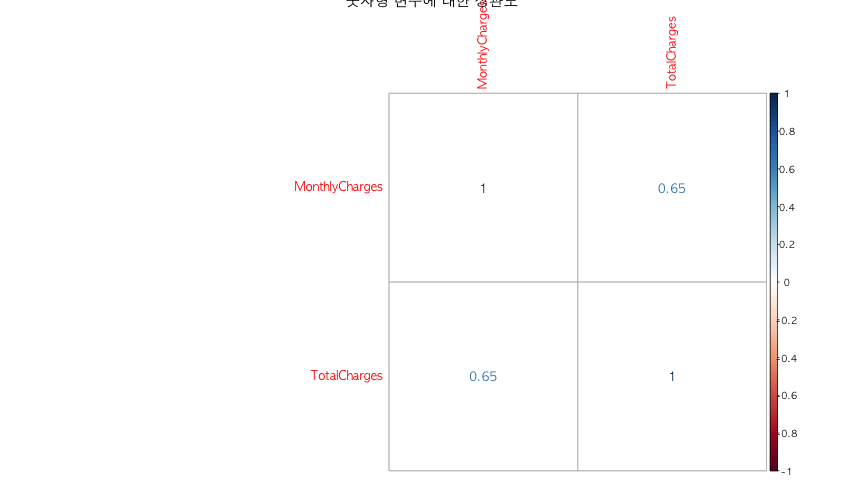
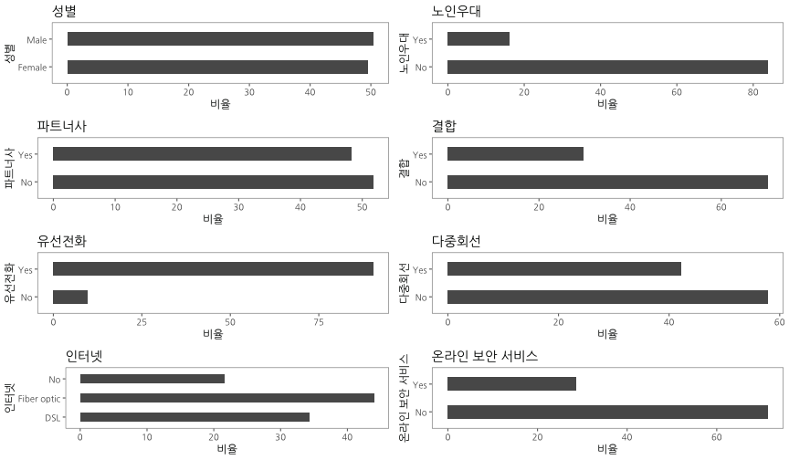

 

## 데이터 가져오기 및 전처리 {#import-attrition-dataset}

고객이탈 [WA_Fn UseC_ Telco Customer Churn.csv](https://community.watsonanalytics.com/wp-content/uploads/2015/03/WA_Fn-UseC_-Telco-Customer-Churn.csv) 데이터를 
웹사이트에서 바로 불러들인다. 

그리고 나서 `skimr` 팩키지 `skim` 함수를 통해 전반적인 데이터 현황을 살펴보고 나서,
전처리에 대한 전략을 수립한다. 전처리 전략에 바탕을 두고 차근차근 데이터 전처리 작업을 진행한다.

~~~{.r}
# 0. 환경설정 --------------------------------------------------------------
# library(tidyverse)
# library(corrplot)
# library(gridExtra)
# library(ggthemes)
# library(caret)
# library(randomForest)
# library(party)
# library(purrr)
# library(extrafont)
# library(forcats)
# library(skimr)
# library(doParallel)
# loadfonts()

# 1. 데이터 가져오기 --------------------------------------------------------------

# churn_dat <- read_csv("https://community.watsonanalytics.com/wp-content/uploads/2015/03/WA_Fn-UseC_-Telco-Customer-Churn.csv")

# 2. 데이터 전처리 --------------------------------------------------------------
## 2.0. 현황파악 --------------
skim(churn_dat)
~~~

~~~{.output}
Numeric Variables
# A tibble: 4 x 13
  var    type  missing complete     n    mean      sd   min `25% quantile`
  <chr>  <chr>   <dbl>    <dbl> <dbl>   <dbl>   <dbl> <dbl>          <dbl>
1 Month… nume…     0       7043  7043 6.48e⁺¹ 3.01e⁺¹  18.2          35.5 
2 Senio… inte…     0       7043  7043 1.62e⁻¹ 3.69e⁻¹   0             0   
3 tenure inte…     0       7043  7043 3.24e⁺¹ 2.46e⁺¹   0             9.00
4 Total… nume…    11.0     7032  7043 2.28e⁺³ 2.27e⁺³  18.8         401   
# ... with 4 more variables: median <dbl>, `75% quantile` <dbl>,
#   max <dbl>, hist <chr>

Character Variables
# A tibble: 17 x 9
   var           type    complete missing empty     n   min   max n_unique
   <chr>         <chr>      <dbl>   <dbl> <dbl> <dbl> <dbl> <dbl>    <dbl>
 1 Churn         charac…     7043       0     0  7043  2.00  3.00     2.00
 2 Contract      charac…     7043       0     0  7043  8.00 14.0      3.00
 3 customerID    charac…     7043       0     0  7043 10.0  10.0   7043   
 4 Dependents    charac…     7043       0     0  7043  2.00  3.00     2.00
 5 DeviceProtec… charac…     7043       0     0  7043  2.00 19.0      3.00
 6 gender        charac…     7043       0     0  7043  4.00  6.00     2.00
 7 InternetServ… charac…     7043       0     0  7043  2.00 11.0      3.00
 8 MultipleLines charac…     7043       0     0  7043  2.00 16.0      3.00
 9 OnlineBackup  charac…     7043       0     0  7043  2.00 19.0      3.00
10 OnlineSecuri… charac…     7043       0     0  7043  2.00 19.0      3.00
11 PaperlessBil… charac…     7043       0     0  7043  2.00  3.00     2.00
12 Partner       charac…     7043       0     0  7043  2.00  3.00     2.00
13 PaymentMethod charac…     7043       0     0  7043 12.0  25.0      4.00
14 PhoneService  charac…     7043       0     0  7043  2.00  3.00     2.00
15 StreamingMov… charac…     7043       0     0  7043  2.00 19.0      3.00
16 StreamingTV   charac…     7043       0     0  7043  2.00 19.0      3.00
17 TechSupport   charac…     7043       0     0  7043  2.00 19.0      3.00

~~~

~~~{.r}
## 2.1. 변수 결측값 --------------
map(churn_dat, ~ sum(is.na(.))) %>% keep( function(x) x > 0)
~~~

~~~{.output}
$TotalCharges
[1] 11

~~~

~~~{.r}
churn_dat <- churn_dat %>% 
  filter(complete.cases(TotalCharges))

## 2.2. 주요 변수 Recode --------

churn_dat <- churn_dat %>% 
  mutate(OnlineSecurity   = ifelse(OnlineSecurity =="No internet service", "No", OnlineSecurity),
         OnlineBackup     = ifelse(OnlineBackup =="No internet service", "No", OnlineBackup),
         DeviceProtection = ifelse(DeviceProtection =="No internet service", "No", DeviceProtection),
         TechSupport      = ifelse(TechSupport =="No internet service", "No", TechSupport),
         StreamingTV      = ifelse(StreamingTV =="No internet service", "No", StreamingTV),
         StreamingMovies  = ifelse(StreamingMovies =="No internet service", "No", StreamingMovies),
         MultipleLines    = ifelse(MultipleLines =="No phone service", "No", MultipleLines))

churn_dat %>% select(OnlineSecurity, OnlineBackup, DeviceProtection, TechSupport, StreamingTV, StreamingMovies, MultipleLines) %>%
  purrr::map(., table)
~~~

~~~{.output}
$OnlineSecurity

  No  Yes 
5017 2015 

$OnlineBackup

  No  Yes 
4607 2425 

$DeviceProtection

  No  Yes 
4614 2418 

$TechSupport

  No  Yes 
4992 2040 

$StreamingTV

  No  Yes 
4329 2703 

$StreamingMovies

  No  Yes 
4301 2731 

$MultipleLines

  No  Yes 
4065 2967 

~~~

~~~{.r}
churn_dat <- churn_dat %>% 
  mutate(tenure_grp = case_when( tenure <= 12 ~ "00-12개월",
                                 tenure <= 24 ~ "13-24개월",
                                 tenure <= 36 ~ "25-36개월",
                                 tenure <= 48 ~ "37-48개월",
                                 tenure <= 60 ~ "49-60개월",
                                 tenure  > 60 ~ "60개월이상"))

churn_dat <- churn_dat %>% 
  mutate(SeniorCitizen  = ifelse(SeniorCitizen == 0, "No", "Yes"))

## 2.3. 무의미한 변수 제거 --------
churn_dat <- churn_dat %>% 
  select(-customerID, -tenure)

## 2.4. 자료형 변환 --------
churn_df <- map_if(churn_dat, is.character, as.factor) %>% 
  as_data_frame()

## 2.5. 데이터 내보내기 - 저장 --------

# dir.create("data_processed")
# saveRDS(churn_df, "data_processed/churn_df.rds")
~~~

## 탐색적 데이터 분석(EDA) {#eda-attrition-dataset}

데이터를 숫자형 데이터와 범주형 데이터로 나눠서 연속형 변수의 경우 상관관계를 `corrplot` 팩키지를 통해 탐색적으로 분석하고,
범주형 변수는 "고객이탈" 변수와 교차분석을 막대그래프로 수행하여 살펴본다.

~~~{.r}
# 2. 탐색적 데이터 분석(EDA) --------------------------------------------------------------

## 2.1. 상관 분석

numeric_var <- map(churn_df, is.numeric) %>% keep(., function(x) x == TRUE) %>% names

churn_df %>% 
  select(numeric_var) %>% 
    cor() %>% 
    corrplot(main="숫자형 변수에 대한 상관도", method="number")
~~~

~~~{.r}
## 2.2. 단변량 분석

barplot_univariate <-  function(df, var, var_name) {
  ggplot(df, aes_string(x=var)) + 
    geom_bar(aes(y = 100*(..count..)/sum(..count..)), width = 0.5) + 
    labs(x=var_name, y="비율", title=var_name) +
    coord_flip() + 
    theme_few(base_family = "NanumGothic")
}

uni_p1 <- barplot_univariate(churn_df, "gender", "성별")
uni_p2 <- barplot_univariate(churn_df, "SeniorCitizen", "노인우대")
uni_p3 <- barplot_univariate(churn_df, "Partner", "파트너사")
uni_p4 <- barplot_univariate(churn_df, "Dependents", "결합")
uni_p5 <- barplot_univariate(churn_df, "PhoneService", "유선전화")
uni_p6 <- barplot_univariate(churn_df, "MultipleLines", "다중회선")
uni_p7 <- barplot_univariate(churn_df, "InternetService", "인터넷")
uni_p8 <- barplot_univariate(churn_df, "OnlineSecurity", "온라인 보안 서비스")

grid.arrange(uni_p1, uni_p2, uni_p3, uni_p4, uni_p5, uni_p6, uni_p7, uni_p8, ncol=2)
~~~

~~~{.r}
uni_p9 <- barplot_univariate(churn_df, "OnlineBackup", "온라인 백업")
uni_p10 <- barplot_univariate(churn_df, "DeviceProtection", "디바이스 보호")
uni_p11 <- barplot_univariate(churn_df, "TechSupport", "기술지원")
uni_p12 <- barplot_univariate(churn_df, "StreamingTV", "TV 스트리밍")
uni_p13 <- barplot_univariate(churn_df, "StreamingMovies", "영화 스트리밍")
uni_p14 <- barplot_univariate(churn_df, "Contract", "계약관련")
uni_p15 <- barplot_univariate(churn_df, "PaperlessBilling", "전자고지서")
uni_p16 <- barplot_univariate(churn_df, "PaymentMethod", "지불방법")
uni_p17 <- barplot_univariate(churn_df, "tenure_grp", "가입기간")

grid.arrange(uni_p9, uni_p10, uni_p11, uni_p12, uni_p13, uni_p14, uni_p15, uni_p16, uni_p17, ncol=3)
~~~

