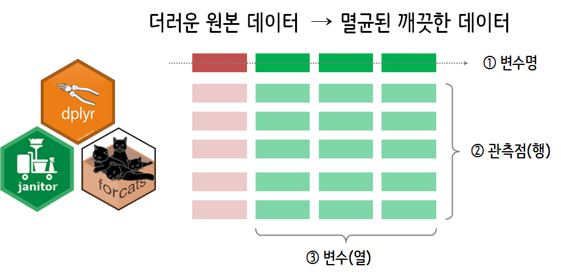
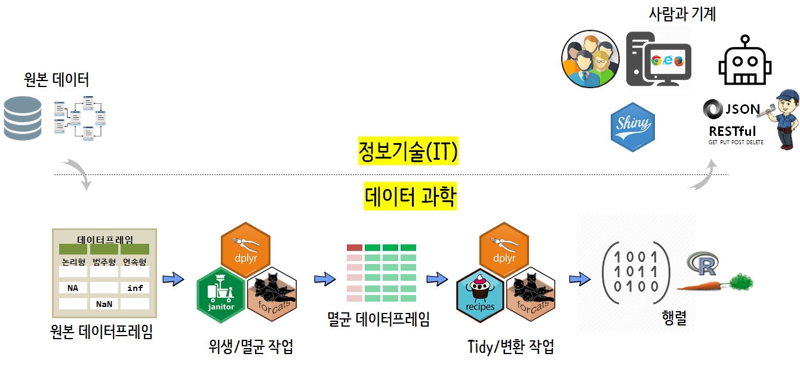

 

``` {r, include=FALSE}
source("tools/chunk-options.R")

knitr::opts_chunk$set(echo = TRUE, message=FALSE, warning=FALSE,
                      comment="", digits = 3, tidy = FALSE, prompt = TRUE, fig.align = 'center')


```


# 데이터 위생관리 {#import-attrition-dataset}

고객이탈 [WA_Fn UseC_ Telco Customer Churn.csv](https://community.watsonanalytics.com/wp-content/uploads/2015/03/WA_Fn-UseC_-Telco-Customer-Churn.csv) 데이터를 
웹사이트에서 바로 불러들인다. 

그리고 나서 `skimr` 팩키지 `skim` 함수를 통해 전반적인 데이터 현황을 살펴보고 나서,
더러운 데이터에 대한 위생관리에 대한 전략을 수립한다. 
데이터 전처리 전략에 바탕을 두고 차근차근 데이터 전처리 작업을 진행한다.



더러운 데이터를 멸균하여 깨끗한 상태를 만드는데 다음과 같은 팩키지가 도구로 활용된다.

- `dplyr`
- [`janitor`](https://github.com/sfirke/janitor)
- `forctas`
- `skimr`

# 위생상태 점검 {#attrition-dataset-sanity-check}

전산(IT) 담당자들이 생각하는 잘 정제된 멸균상태의 깨끗한 데이터와 데이터 분석과 모형개발을 위한 
데이터는 차이가 크다. 설사 전산담당자가 보기에 깨끗한 질좋은 데이터라 할지라도 
데이터 과학자가 보기에는 더럽기 그지없는 데이터도 참 많다.

데이터에 대한 위생상태 점검에 들어가보자. 크게 세가지 영역으로 나눠서 살펴본다.

- 변수명: 변수명에 공백, 특수문자, 변수명 규칙 등을 R 문화에 맞게 위생상태를 개선한다.
- 관측점(행): 중복된 관측점(행, 레코드)이 있는지, 결측값이 존재하는지 파악하고 이에 대한 위생개선 대책을 마련한다.
- 변수(열, 칼럼): 자료형이 시각화와 모형개발을 위한 적합한 자료구조인지 파악하고 이상점, 특이 범주에 대한 위생대책도 함께 마련한다.

위생상태 점검을 위해서 [`janitor`](https://github.com/sfirke/janitor) 팩키지 함수를 두루 익혀 사용한다.
결측값 시각화를 위해서 `Amelia` 팩키지 `missmap()` 함수도 함께 사용한다. 

``` {r attrition-data-sanitize-check}
# 0. 환경설정 ------
library(tidyverse)
library(caret)
library(janitor)
library(ggridges)
library(ggthemes)
library(cowplot)
library(corrplot)
library(corrr)
library(plotly)
library(crosstalk)
library(skimr)
library(viridis)

# 1. 데이터 ------
## 1.1. 데이터 가져오기 -----
churn_dat <- read_csv("https://community.watsonanalytics.com/wp-content/uploads/2015/03/WA_Fn-UseC_-Telco-Customer-Churn.csv")
```

## 변수명  {#import-attrition-dataset-varname}

다양한 방식으로 변수명을 사람들이 나름대로 규칙을 만들어서 데이터에 붙이게 된다.
이를 `janitor` 팩키지 `clean_names()` 함수를 사용해서 R 관계를 따르는 변수명으로 변환시킨다.

<div class = "row">
  <div class = "col-md-6">
**원본 데이터 변수명**

``` {r attrition-data-sanitize-check-names}
## 1.2. 데이터 위생점검 -----
### 변수명
names(churn_dat)
```

  </div>
  <div class = "col-md-6">
**R 관계를 따르는 변수명**

``` {r attrition-data-sanitize-check-names-new}
## 1.2. 데이터 위생점검 -----
### 변수명
churn_dat %>% 
    clean_names() %>% 
    names()
```
  </div>
</div>

## 관측점 중복 확인  {#import-attrition-dataset-dedup}

관측점(행)에 중복이 있게 되면 기계학습 모형 함수에서 받아들여지지 않는 경우도 다반사다. 
이를 위해서 중복된 관측점을 제거하는 것이 필요하다. 
이를 위해서 `janitor` 팩키지 `get_dupes()` 함수를 사용해서 중복된 관측점도 위생점검 대상에 포함시킨다.

``` {r attrition-data-sanitize-check-dedup}
### 데이터프레임 행에 대한 위생점검
#### 중복 확인
churn_dat %>% 
    clean_names() %>% 
    get_dupes(customer_id)
```


## 결측점 위생점검 {#import-attrition-dataset-missing}

모든 변수에 대해서 존재하는 결측값에 대해서 `summarize_all()` 함수와 `is.na()` 함수를 사용해서 파악하고,
`Amelia` 팩키지 `missmap()` 함수를 사용해서 시각적으로도 확인한다.

``` {r attrition-data-sanitize-check-missing}
#### 결측점 확인: total_charges 결측값 제거 
churn_dat %>% 
    summarise_all(funs(sum(is.na(.)))) %>% 
    gather(variable, missing_cnt) %>% 
    arrange(desc(missing_cnt))

# map(churn_df, ~ sum(is.na(.))) %>% keep( function(x) x > 0)

#### 결측값 시각화
Amelia::missmap(churn_dat, main = "결측값과 관측값")
```

## 행과 열에 빈데이터 {#import-attrition-dataset-missing-empty}

`janitor` 팩키지 `remove_empty()` 함수를 사용해서 빈행과 빈열을 점검한다.

``` {r attrition-data-sanitize-check-missing-empty}
### 데이터프레임 빈 행과 열에 대한 위생점검
churn_dat %>%
    remove_empty(c("rows", "cols")) %>% dim()
```

## 변수별 자료형 확인 {#import-attrition-dataset-variable-class}

`class` 함수를 사용해서 데이터프레임 변수 자료형을 파악한다.

``` {r attrition-data-sanitize-check-data-type}
map_df(churn_dat, class) %>% 
    gather(variable, value) %>% 
    count(value)
```

# 위생점검 결과 보고서 {#import-attrition-dataset-sanity-check-report}

`janitor`, `dplyr`, `Amelia` 등 팩키지를 활용하여 고객이탈 원본 데이터에 대한 위생점검 결과 다음 사항이 파악되어 조치가 필요하다.

1. 변수명이 난잡하여 이를 R 관례에 맞게 조치한다.
1. 키값으로 사용된 변수에 중복 관측점은 없음.
1. 1개 변수(TotalCharges)에 대해서 결측값이 11개 발견되어 조치가 필요함
1. 엑셀에서 흔히 발견되는 빈 행과 열은 존재하지 않음.
1. 변수별 자료형이 문자 자료구조를 갖는 변수가 17 개로 요인(factor)형으로 자료변환이 필요함.
1. 정수형 변수 1개(`senior_citizen`)도 요인(factor)형으로 자료변환이 필요함.

# 멸균 위생작업 실시 {#import-attrition-dataset-sanity}

위생점검 결과 보고서를 바탕으로 변수명 변환, 결측값처리, 문자열 변수 자료변환 등의 일련의 과정을 `sanitize_data()` 함수에 적어 일괄적으로 반영시킨다.

``` {r attrition-data-sanitize-data}
### 위생점검 결과 반영 코드 
sanitize_data <- function(df) {
    res_df <- df %>% 
        clean_names() %>% 
        select(-customer_id) %>% 
        filter(complete.cases(.)) %>% 
        mutate_if(is.character, as.factor) %>% 
        mutate(senior_citizen = factor(senior_citizen, levels = c(0, 1), labels = c("No", "Yes")))
    return(res_df)
}

churn_df <- sanitize_data(churn_dat)
```

# 모형과 시각화를 위한 작업 {#import-attrition-dataset-task}

원본데이터를 정보기술 영역에서 데이터 과학 영역으로 가져온 후에 위생/멸균 작업을 거쳤다. 다음 단계로 모형과 시각화를 위한 데이터 정제작업을 추가로 수행한다.
이를 위해서 `recipes`와 같은 특별한 팩키지가 동원되기도 하지만, 현재로는 `tidyverse` 팩키지의 핵심기능만 사용해서 모형과 시각화를 위한 데이터 정제작업을 진행한다.



## 범주형 변수 [^visualize-multiplot] {#import-attrition-dataset-task-factor}

[^visualize-multiplot]: [stackoverflow - plotting list of plots on one page using ggplot2](https://stackoverflow.com/questions/48066939/plotting-list-of-plots-on-one-page-using-ggplot2)

문자형 변수를 범주형 즉, 요인형(factor) 자료구조로 변환시키게 되면 다양한 연산작업이 가능하다. 대표적인 것이 각 요인별로 수준(level)이 몇개씩인지 파악하고, 최빈값을 갖는 범주가 무엇인지 파악도 가능하다 이를 통해서 불필요한 범주는 없애고 유사 범주는 묶는 작업을 통해 시각화와 모형 개발을 위한 적절한 범주형 변수에 대한 작업을 사전에 취할 수 있다.

### 범주형 변수별 수준 갯수 {#attrition-dataset-task-factor-levels}

`nlevels()` 함수를 통해 범주형 변수별로 수준 갯수를 파악할 수 있다.

``` {r attrition-data-task-factor}
## 1.3. 모형 데이터프레임 -----
### 범주형 데이터
#### 범주형 변수 범주(level) 개수
churn_df %>% 
    select_if(is.factor) %>% 
    summarise_all(nlevels) %>% 
    gather(variable, cnt)
```


### 범주형 변수별 요약통계량 {#attrition-dataset-task-factor-descriptive}

`skim()` 함수에 범주형 변수만 넣어서 단변량 기초 요약통계량 산출도 가능하다. 관심있는 변수(`churn`)와 교차분석은 아래에서 추가로 진행한다.

``` {r attrition-data-task-factor-descriptive}
#### 범주형 변수 요약 통계량
churn_df %>% 
    select_if(is.factor) %>% 
    skim()
```

### 범주형 변수 시각화 {#attrition-dataset-task-factor-viz-one}

`ggplot` 팩키지와 `tidy evaluation`을 결합하여 고객이탈 변수(`churn`)와 교차하여 시각화도 가능하다. 인용부호를 넣어 변수를 전달하는 경우와 인용부호없이 변수를 전달하는 경우에 따라 달리 확인하고 사용한다.

``` {r attrition-data-task-factor-viz-one}
#### 범주형 변수
cat_var <- churn_df %>% 
    select_if(is.factor) %>% 
    colnames()

#### 범주형 변수 시각화
visualize_category <- function(variable) {
    # var <- enquo(variable)
    var <- sym(variable)
    churn_df %>% 
        select_if(is.factor) %>% 
        count(!!var, churn) %>% 
        ggplot(aes(x=!!var, y=n, fill=churn)) +
        geom_col() +
        labs(x=rlang::quo_text(var), y="") +
        scale_y_continuous(labels = scales::comma) +
        scale_fill_viridis_d() +
        theme(legend.position = "none") +
        scale_x_discrete(label = function(x) abbreviate(x, minlength=7))
}

# visualize_category(gender)
visualize_category("gender")
```

고객이탈 변수(`churn`)와 교차하여 모든 범주형 변수를 시각화하고자 할 경우 각 범주형 변수를 고객이탈 변수와 교차분석하여 시각화한 객체를 리스트 객체로 담아내고 이를 `multiplot()` 함수의 도움으로 한장에 시각화하여 담아낸다.

``` {r attrition-data-task-factor-viz-many, fig.width=12}
multiplot <- function(..., plotlist=NULL, file, cols=1, layout=NULL) {
    require(grid)
    plots <- c(list(...), plotlist)
    numPlots = length(plots)
    
    if (is.null(layout)) {
        layout <- matrix(seq(1, cols * ceiling(numPlots/cols)), ncol = cols, nrow = ceiling(numPlots/cols))
    }
    
    if (numPlots==1) {
        print(plots[[1]])
    } 
    else {
        grid.newpage()
        pushViewport(viewport(layout = grid.layout(nrow(layout), ncol(layout))))
        for (i in 1:numPlots) {
            matchidx <- as.data.frame(which(layout == i, arr.ind = TRUE))
            print(plots[[i]], vp = viewport(layout.pos.row = matchidx$row, layout.pos.col = matchidx$col))
        }
    }
}

cat_barplot_lst <- map(setdiff(cat_var, "churn"), visualize_category)

multiplot(plotlist=cat_barplot_lst, cols=4)
```

아니요("No")로 범주를 묶는 것이 타당한 것으로 앞선 시각화 결과를 반영하여 범주를 묶는 작업을 해당 범주형 변수별로 작업을 수행하고 나서, 범주형 변수 기술 통계량도 산출해본다.

``` {r attrition-data-task-factor-viz-many-descriptive}
#### 범주형 범주 결합
churn_m_df <- churn_df %>% 
    mutate(multiple_lines    = ifelse(str_detect(multiple_lines, "No"), "No", "Yes"),
           internet_service  = ifelse(str_detect(internet_service, "No"), "No", "Yes"),
           online_security   = ifelse(str_detect(online_security, "No"), "No", "Yes"),
           online_backup     = ifelse(str_detect(online_backup, "No"), "No", "Yes"),
           device_protection = ifelse(str_detect(device_protection, "No"), "No", "Yes"),
           tech_support      = ifelse(str_detect(tech_support, "No"), "No", "Yes"),
           streaming_tv      = ifelse(str_detect(streaming_tv, "No"), "No", "Yes"),
           streaming_movies  = ifelse(str_detect(streaming_movies, "No"), "No", "Yes")) 

cat_desc_table <- function(variable) {
    var <- sym(variable)
    churn_m_df %>% 
        tabyl(!!var, churn) %>% 
        adorn_totals("row") %>%
        adorn_percentages("row") %>%
        adorn_pct_formatting() %>%
        adorn_ns() %>%
        adorn_title("combined") %>% 
        tbl_df()
}

# cat_desc_table("gender")

cat_desc_table_list <- map(setdiff(cat_var, "churn"), cat_desc_table)

names(cat_desc_table_list) <- setdiff(cat_var, "churn")

listviewer::jsonedit(cat_desc_table_list)
```

## 연속형 변수 {#attrition-dataset-task-continuous}


### 연속형 변수 교차 시각화 {#attrition-dataset-task-continuous-viz}

`is.numeric()` 함수를 통해 연속형 변수를 발래내고 이를 `churn` 변수와 교차하여 고객이탈별로 연속형 변수에 어떠한 변동이 있는지 시각적으로 확인해본다.

``` {r attrition-data-task-cont-viz, fig.width=10}
### 연속형 데이터
cont_var <- churn_df %>% 
    select_if(is.numeric) %>% 
    names()

y_p <- churn_df %>%
    select(cont_var, churn) %>% 
    ggplot(aes(x = churn, fill = churn)) +
    geom_bar(alpha = 0.8) +
    scale_fill_viridis_d() +
    guides(fill = FALSE)

x_p <- churn_df %>%
    select(cont_var, churn) %>% 
    gather(variable, value, -churn) %>%
    ggplot(aes(x = value, y = churn, color = churn, fill = churn)) +
    facet_wrap( ~ variable, scale = "free", ncol = 3) +
    scale_color_viridis_d() +
    scale_fill_viridis_d() +
    geom_density_ridges(alpha = 0.8) +
    guides(fill = FALSE, color = FALSE)

plot_grid(y_p, x_p, rel_widths = c(1,3))
```


### 연속형 변수 기술통계 {#attrition-dataset-task-continuous-descriptive}

고객이탈 유무를 기준으로 연속형 변수에 대한 기술통계를 `skim()` 함수로 산출해 본다.

``` {r attrition-data-task-cont-descriptive}
churn_df %>% 
    select(cont_var, churn) %>% 
    group_by(churn) %>% 
    skim
```


# 시각화/모형 데이터프레임 {#attrition-dataset-task-viz-model-dataframe}

멸균 위생작업이 완료된 데이터프레임에 대해서 범주형 변수와 연속형 변수로 나누어서 시각화와 모형개발을 위해 적절한 형태로 정제작업을 수행한다. 그리고 나서 이를 저장하여 다음 모형화 작업을 수행하도록 준비한다.

``` {r attrition-data-task-viz-model-dataframe}
# 시각화/모형 데이터프레임 정제작업 ------
churn_m_df <- churn_df %>% 
    mutate(multiple_lines    = ifelse(str_detect(multiple_lines, "No"), "No", "Yes"),
           internet_service  = ifelse(str_detect(internet_service, "No"), "No", "Yes"),
           online_security   = ifelse(str_detect(online_security, "No"), "No", "Yes"),
           online_backup     = ifelse(str_detect(online_backup, "No"), "No", "Yes"),
           device_protection = ifelse(str_detect(device_protection, "No"), "No", "Yes"),
           tech_support      = ifelse(str_detect(tech_support, "No"), "No", "Yes"),
           streaming_tv      = ifelse(str_detect(streaming_tv, "No"), "No", "Yes"),
           streaming_movies  = ifelse(str_detect(streaming_movies, "No"), "No", "Yes")) 


# 시각화/모형 데이터프레임 저장 ------

# churn_m_df %>% write_rds("data/churn_m_df.rds")
```