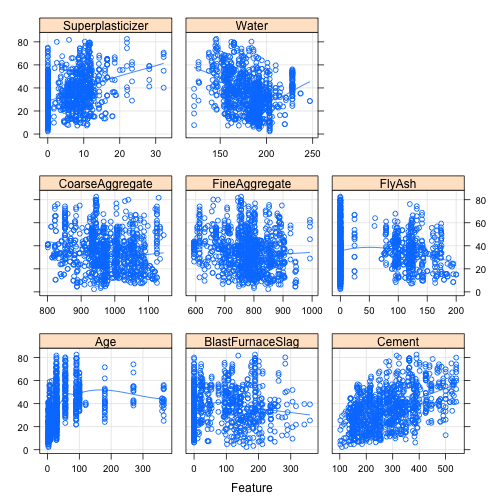
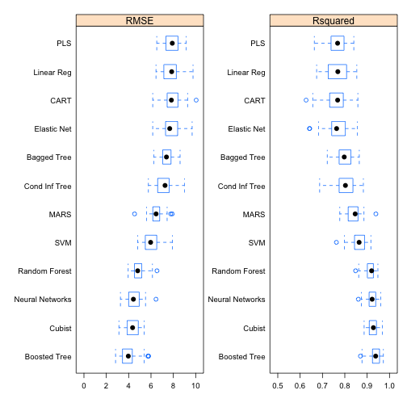

 
> ## 학습목표 {.objectives}
>
> * UCI 콘크리트 강도 데이터로 예측모형을 개발한다.

## 1. UCI 콘크리트 데이터

UCI 콘크리트 강도 데이터는 [Concrete Compressive Strength Data Set ](https://archive.ics.uci.edu/ml/datasets/Concrete+Compressive+Strength) 데이터를 사용해서 강도를 예측한다.

* Name -- Data Type -- Measurement -- Description 
    * 
    * Cement (component 1) -- quantitative -- kg in a m3 mixture -- Input Variable 
    * Blast Furnace Slag (component 2) -- quantitative -- kg in a m3 mixture -- Input Variable 
    * Fly Ash (component 3) -- quantitative -- kg in a m3 mixture -- Input Variable 
    * Water (component 4) -- quantitative -- kg in a m3 mixture -- Input Variable 
    * Superplasticizer (component 5) -- quantitative -- kg in a m3 mixture -- Input Variable 
    * Coarse Aggregate (component 6) -- quantitative -- kg in a m3 mixture -- Input Variable 
    * Fine Aggregate (component 7)	-- quantitative -- kg in a m3 mixture -- Input Variable 
    * Age -- quantitative -- Day (1~365) -- Input Variable 
    * **Concrete compressive strength** -- quantitative -- MPa -- Output Variable 

예측변수 및 종속변수 모두 연속형 변수이며 결측값도 없고 전형적인 공학 데이터 형태를 띄고 있다.

## 2. 콘크리트 데이터 예측모형 적용

데이터는 `AppliedPredictiveModeling` 팩키지에 `concrete`로 저장되어 있고, 
**Applied Predictive Modeling** 책에 적용된 모형을 그대로 실행한다.

`mixtures` 데이터셋은 `concrete` 데이터의 짝꿍으로 이해하면 된다.

~~~{.r}
# 0.0 환경설정, 각자 컴퓨터 코어 숫자를 확인하고 설정한다.
# 기본원칙은 최대 코어숫자에서 1개를 뺀 숫자를 작업에 할당한다.
suppressMessages(library(doMC))
registerDoMC(cores=7)

# 1.1. 데이터 불러오기
suppressMessages(library(caret))
suppressMessages(library(AppliedPredictiveModeling))
suppressMessages(library(dplyr))
suppressMessages(library(plyr))
data(concrete) 
str(concrete)
~~~

~~~{.output}
'data.frame':	1030 obs. of  9 variables:
 $ Cement             : num  540 540 332 332 199 ...
 $ BlastFurnaceSlag   : num  0 0 142 142 132 ...
 $ FlyAsh             : num  0 0 0 0 0 0 0 0 0 0 ...
 $ Water              : num  162 162 228 228 192 228 228 228 228 228 ...
 $ Superplasticizer   : num  2.5 2.5 0 0 0 0 0 0 0 0 ...
 $ CoarseAggregate    : num  1040 1055 932 932 978 ...
 $ FineAggregate      : num  676 676 594 594 826 ...
 $ Age                : int  28 28 270 365 360 90 365 28 28 28 ...
 $ CompressiveStrength: num  80 61.9 40.3 41 44.3 ...

~~~

~~~{.r}
# 1.2. 훈련데이터, 검증데이터
averaged <- ddply(mixtures, 
                  .(Cement, BlastFurnaceSlag, FlyAsh, Water, 
                    Superplasticizer, CoarseAggregate, 
                    FineAggregate, Age), 
                  function(x) c(CompressiveStrength = 
                                  mean(x$CompressiveStrength)))

forTraining <- createDataPartition(averaged$CompressiveStrength, 
                                   p = 3/4)[[1]] 
trainingSet <- averaged[ forTraining,] 
testSet <- averaged[-forTraining,]

##==============================================================================================
## 02. EDA
##==============================================================================================
# describe in Hmisc 
# featurePlot in caret
featurePlot(x = concrete[, -9], 
            y = concrete$CompressiveStrength, 
            between = list(x = 1, y = 1), 
            type = c("g", "p", "smooth"))
~~~

~~~{.r}
##==============================================================================================
## 03. 예측 모형 적합
##==============================================================================================
# 모형 공식 생성
modFormula <- paste("CompressiveStrength ~ (.)^2 + I(Cement^2) + ", 
                    "I(BlastFurnaceSlag^2) + I(FlyAsh^2) + I(Water^2) +", 
                    " I(Superplasticizer^2) + I(CoarseAggregate^2) + ",
                    "I(FineAggregate^2) + I(Age^2)")

modFormula <- as.formula(modFormula)

##==============================================================================================
## 04. 컴퓨팅 기반 예측모형 
##==============================================================================================

#------------------------------------------------------------------------------------
# 제어변수 설정

controlObject <- trainControl(method = "repeatedcv",
                              repeats = 5, number = 10, 
                              verboseIter = TRUE)
# 1. 선형회귀
linearReg <- train(modFormula, 
                   data = trainingSet, 
                   method = "lm", 
                   trControl = controlObject)
~~~

~~~{.output}
Aggregating results
Fitting final model on full training set

~~~

~~~{.r}
linearReg
~~~

~~~{.output}
Linear Regression 

745 samples
  8 predictor

No pre-processing
Resampling: Cross-Validated (10 fold, repeated 5 times) 
Summary of sample sizes: 671, 672, 670, 670, 672, 671, ... 
Resampling results:

  RMSE      Rsquared 
  7.827657  0.7663913

 

~~~

~~~{.r}
# 2. 부분최소자승
library(pls)
~~~

~~~{.output}

Attaching package: 'pls'

~~~

~~~{.output}
The following object is masked from 'package:caret':

    R2

~~~

~~~{.output}
The following object is masked from 'package:stats':

    loadings

~~~

~~~{.r}
plsModel <- train(modFormula, data = trainingSet, 
                  method = "pls", 
                  preProc = c("center", "scale"), 
                  tuneLength = 15, 
                  trControl = controlObject)
~~~

~~~{.output}
Aggregating results
Selecting tuning parameters
Fitting ncomp = 14 on full training set

~~~

~~~{.r}
plsModel
~~~

~~~{.output}
Partial Least Squares 

745 samples
  8 predictor

Pre-processing: centered (44), scaled (44) 
Resampling: Cross-Validated (10 fold, repeated 5 times) 
Summary of sample sizes: 670, 671, 670, 670, 670, 670, ... 
Resampling results across tuning parameters:

  ncomp  RMSE       Rsquared 
   1     10.469934  0.5859361
   2      9.597069  0.6539237
   3      8.993094  0.6938509
   4      8.701087  0.7127472
   5      8.598575  0.7197502
   6      8.492277  0.7272336
   7      8.361139  0.7360860
   8      8.172535  0.7472110
   9      8.067677  0.7527347
  10      7.952607  0.7596684
  11      7.890755  0.7632097
  12      7.869661  0.7645728
  13      7.842505  0.7661859
  14      7.842303  0.7662396
  15      7.860962  0.7652092

RMSE was used to select the optimal model using  the smallest value.
The final value used for the model was ncomp = 14. 

~~~

~~~{.r}
# 3. 부분 최소자승회귀
library(elasticnet)
~~~

~~~{.output}
Loading required package: lars

~~~

~~~{.output}
Loaded lars 1.2

~~~

~~~{.r}
enetGrid <- expand.grid(.lambda = c(0, .001, .01, .1), 
                        .fraction = seq(0.05, 1, length = 20))

enetModel <- train(modFormula, data = trainingSet, 
                   method = "enet", 
                   preProc = c("center", "scale"), 
                   tuneGrid = enetGrid, 
                   trControl = controlObject)
~~~

~~~{.output}
Aggregating results
Selecting tuning parameters
Fitting fraction = 0.85, lambda = 0.001 on full training set

~~~

~~~{.r}
enetModel
~~~

~~~{.output}
Elasticnet 

745 samples
  8 predictor

Pre-processing: centered (44), scaled (44) 
Resampling: Cross-Validated (10 fold, repeated 5 times) 
Summary of sample sizes: 670, 672, 670, 669, 669, 672, ... 
Resampling results across tuning parameters:

  lambda  fraction  RMSE       Rsquared 
  0.000   0.05      10.233940  0.7148749
  0.000   0.10      11.502359  0.7297934
  0.000   0.15      13.075486  0.7350323
  0.000   0.20      14.739863  0.7386965
  0.000   0.25      16.435817  0.7405137
  0.000   0.30      18.176221  0.7406766
  0.000   0.35      19.919789  0.7405557
  0.000   0.40      21.677065  0.7400437
  0.000   0.45      23.432753  0.7393767
  0.000   0.50      25.189734  0.7389091
  0.000   0.55      26.960807  0.7385522
  0.000   0.60      28.726051  0.7382460
  0.000   0.65      30.473696  0.7379091
  0.000   0.70      32.244064  0.7376582
  0.000   0.75      34.001379  0.7374302
  0.000   0.80      35.762249  0.7371662
  0.000   0.85      37.522856  0.7369376
  0.000   0.90      39.299547  0.7367353
  0.000   0.95      41.045844  0.7365261
  0.000   1.00      42.827084  0.7363385
  0.001   0.05      12.910906  0.5611504
  0.001   0.10      10.657531  0.6448004
  0.001   0.15       9.399920  0.6747986
  0.001   0.20       8.835720  0.7055791
  0.001   0.25       8.425155  0.7313052
  0.001   0.30       8.170552  0.7460932
  0.001   0.35       8.024667  0.7542983
  0.001   0.40       7.922790  0.7600381
  0.001   0.45       7.884706  0.7621296
  0.001   0.50       7.879841  0.7624465
  0.001   0.55       7.867200  0.7632229
  0.001   0.60       7.853977  0.7640366
  0.001   0.65       7.842672  0.7647296
  0.001   0.70       7.832530  0.7653509
  0.001   0.75       7.825437  0.7657931
  0.001   0.80       7.821534  0.7660601
  0.001   0.85       7.819694  0.7661986
  0.001   0.90       7.819878  0.7662061
  0.001   0.95       7.822447  0.7660754
  0.001   1.00       7.826402  0.7658626
  0.010   0.05      14.038922  0.5423599
  0.010   0.10      12.341566  0.5898114
  0.010   0.15      10.982845  0.6344810
  0.010   0.20       9.975221  0.6615204
  0.010   0.25       9.357547  0.6763428
  0.010   0.30       9.011376  0.6933070
  0.010   0.35       8.718177  0.7126453
  0.010   0.40       8.479760  0.7274074
  0.010   0.45       8.299786  0.7380222
  0.010   0.50       8.175166  0.7453177
  0.010   0.55       8.075873  0.7510898
  0.010   0.60       8.001591  0.7553620
  0.010   0.65       7.946108  0.7585918
  0.010   0.70       7.913488  0.7604457
  0.010   0.75       7.894637  0.7615509
  0.010   0.80       7.880642  0.7624138
  0.010   0.85       7.869227  0.7631234
  0.010   0.90       7.861162  0.7636318
  0.010   0.95       7.854782  0.7640307
  0.010   1.00       7.849270  0.7643702
  0.100   0.05      14.786441  0.5250918
  0.100   0.10      13.609119  0.5477314
  0.100   0.15      12.574285  0.5787233
  0.100   0.20      11.653822  0.6121577
  0.100   0.25      10.888703  0.6371317
  0.100   0.30      10.243449  0.6548767
  0.100   0.35       9.742154  0.6652949
  0.100   0.40       9.396008  0.6717463
  0.100   0.45       9.198710  0.6781475
  0.100   0.50       9.047714  0.6866395
  0.100   0.55       8.891617  0.6971206
  0.100   0.60       8.748564  0.7065868
  0.100   0.65       8.625492  0.7147161
  0.100   0.70       8.532413  0.7209443
  0.100   0.75       8.448422  0.7266066
  0.100   0.80       8.376248  0.7315540
  0.100   0.85       8.323501  0.7353332
  0.100   0.90       8.280535  0.7384671
  0.100   0.95       8.244806  0.7411632
  0.100   1.00       8.221168  0.7431089

RMSE was used to select the optimal model using  the smallest value.
The final values used for the model were fraction = 0.85 and lambda
 = 0.001. 

~~~

~~~{.r}
# 4. MARS
earthModel <- train(CompressiveStrength ~ ., data = trainingSet, 
                    method = "earth", 
                    tuneGrid = expand.grid(.degree = 1, 
                                           .nprune = 2:25),
                    trControl = controlObject)
~~~

~~~{.output}
Loading required package: earth

~~~

~~~{.output}
Loading required package: plotmo

~~~

~~~{.output}
Loading required package: plotrix

~~~

~~~{.output}
Warning: package 'plotrix' was built under R version 3.2.5

~~~

~~~{.output}
Loading required package: TeachingDemos

~~~

~~~{.output}
Aggregating results
Selecting tuning parameters
Fitting nprune = 14, degree = 1 on full training set

~~~

~~~{.r}
earthModel
~~~

~~~{.output}
Multivariate Adaptive Regression Spline 

745 samples
  8 predictor

No pre-processing
Resampling: Cross-Validated (10 fold, repeated 5 times) 
Summary of sample sizes: 672, 669, 670, 670, 670, 671, ... 
Resampling results across tuning parameters:

  nprune  RMSE       Rsquared 
   2      13.217239  0.3315035
   3      10.902538  0.5461674
   4       9.710060  0.6392253
   5       8.001621  0.7537420
   6       7.655195  0.7748832
   7       7.385465  0.7911602
   8       7.147759  0.8046879
   9       6.798765  0.8241164
  10       6.723706  0.8281599
  11       6.663956  0.8316837
  12       6.537721  0.8379031
  13       6.509434  0.8389718
  14       6.473406  0.8407430
  15       6.475444  0.8405577
  16       6.476547  0.8404977
  17       6.476176  0.8405178
  18       6.476176  0.8405178
  19       6.476176  0.8405178
  20       6.476176  0.8405178
  21       6.476176  0.8405178
  22       6.476176  0.8405178
  23       6.476176  0.8405178
  24       6.476176  0.8405178
  25       6.476176  0.8405178

Tuning parameter 'degree' was held constant at a value of 1
RMSE was used to select the optimal model using  the smallest value.
The final values used for the model were nprune = 14 and degree = 1. 

~~~

~~~{.r}
# 5. SVM
svmRModel <- train(CompressiveStrength ~ ., data = trainingSet, 
                   method = "svmRadial", 
                   tuneLength = 15, 
                   preProc = c("center", "scale"),
                   trControl = controlObject)
~~~

~~~{.output}
Loading required package: kernlab

~~~

~~~{.output}

Attaching package: 'kernlab'

~~~

~~~{.output}
The following object is masked from 'package:ggplot2':

    alpha

~~~

~~~{.output}
Aggregating results
Selecting tuning parameters
Fitting sigma = 0.134, C = 8 on full training set

~~~

~~~{.r}
svmRModel  
~~~

~~~{.output}
Support Vector Machines with Radial Basis Function Kernel 

745 samples
  8 predictor

Pre-processing: centered (8), scaled (8) 
Resampling: Cross-Validated (10 fold, repeated 5 times) 
Summary of sample sizes: 670, 672, 671, 670, 671, 672, ... 
Resampling results across tuning parameters:

  C        RMSE       Rsquared 
     0.25   7.919993  0.7735554
     0.50   7.135836  0.8102028
     1.00   6.613951  0.8340189
     2.00   6.268750  0.8494828
     4.00   6.066346  0.8586312
     8.00   6.030180  0.8607362
    16.00   6.091549  0.8588459
    32.00   6.233316  0.8536742
    64.00   6.444386  0.8452716
   128.00   6.741179  0.8328030
   256.00   7.082860  0.8181738
   512.00   7.451044  0.8025593
  1024.00   7.888276  0.7842988
  2048.00   8.763058  0.7499307
  4096.00  10.398710  0.6927043

Tuning parameter 'sigma' was held constant at a value of 0.1337875
RMSE was used to select the optimal model using  the smallest value.
The final values used for the model were sigma = 0.1337875 and C = 8. 

~~~

~~~{.r}
# 6. 신경망
nnetGrid <- expand.grid(.decay = c(0.001, .01, .1), 
                        .size = seq(1, 27, by = 2), 
                        .bag = FALSE) 

nnetModel <- train(CompressiveStrength ~ ., 
                   data = trainingSet, 
                   method = "avNNet", 
                   tuneGrid = nnetGrid, 
                   preProc = c("center", "scale"), 
                   linout = TRUE, 
                   trace = FALSE, 
                   maxit = 1000, 
                   trControl = controlObject)
~~~

~~~{.output}
Loading required package: nnet

~~~

~~~{.output}
Aggregating results
Selecting tuning parameters
Fitting size = 27, decay = 0.1, bag = FALSE on full training set

~~~

~~~{.r}
nnetModel
~~~

~~~{.output}
Model Averaged Neural Network 

745 samples
  8 predictor

Pre-processing: centered (8), scaled (8) 
Resampling: Cross-Validated (10 fold, repeated 5 times) 
Summary of sample sizes: 670, 672, 671, 670, 670, 670, ... 
Resampling results across tuning parameters:

  decay  size  RMSE      Rsquared 
  0.001   1    9.245021  0.6757759
  0.001   3    6.566393  0.8355458
  0.001   5    5.899618  0.8670546
  0.001   7    5.495055  0.8851372
  0.001   9    5.224613  0.8956497
  0.001  11    5.137862  0.8989170
  0.001  13    4.991205  0.9043528
  0.001  15    4.865077  0.9089803
  0.001  17    4.909675  0.9079373
  0.001  19    4.820298  0.9110518
  0.001  21    4.776985  0.9126719
  0.001  23    4.671820  0.9159418
  0.001  25    4.696531  0.9150107
  0.001  27    4.740909  0.9135586
  0.010   1    9.216162  0.6754679
  0.010   3    6.548643  0.8357666
  0.010   5    5.949384  0.8649658
  0.010   7    5.405518  0.8886921
  0.010   9    5.167768  0.8980505
  0.010  11    5.066312  0.9018705
  0.010  13    4.900505  0.9079740
  0.010  15    4.887311  0.9086391
  0.010  17    4.879321  0.9094461
  0.010  19    4.803387  0.9117719
  0.010  21    4.727508  0.9144982
  0.010  23    4.679822  0.9157506
  0.010  25    4.611752  0.9179259
  0.010  27    4.665022  0.9170558
  0.100   1    9.211633  0.6757589
  0.100   3    6.574855  0.8350409
  0.100   5    5.969657  0.8638165
  0.100   7    5.455949  0.8859664
  0.100   9    5.255053  0.8948422
  0.100  11    5.124435  0.9000535
  0.100  13    4.899006  0.9083760
  0.100  15    4.789076  0.9117375
  0.100  17    4.769145  0.9128706
  0.100  19    4.701299  0.9155569
  0.100  21    4.629544  0.9177907
  0.100  23    4.567601  0.9199507
  0.100  25    4.584428  0.9195117
  0.100  27    4.528964  0.9213253

Tuning parameter 'bag' was held constant at a value of FALSE
RMSE was used to select the optimal model using  the smallest value.
The final values used for the model were size = 27, decay = 0.1 and bag
 = FALSE. 

~~~

~~~{.r}
# 7. 나무 모형(Tree Model)
rpartModel <- train(CompressiveStrength ~ ., 
                    data = trainingSet, 
                    method = "rpart", 
                    tuneLength = 30, 
                    trControl = controlObject)
~~~

~~~{.output}
Loading required package: rpart

~~~

~~~{.output}
Warning in nominalTrainWorkflow(x = x, y = y, wts = weights, info =
trainInfo, : There were missing values in resampled performance measures.

~~~

~~~{.output}
Aggregating results
Selecting tuning parameters
Fitting cp = 0.00368 on full training set

~~~

~~~{.r}
ctreeModel <- train(CompressiveStrength ~ ., 
                    data = trainingSet, 
                    method = "ctree", 
                    tuneLength = 10, 
                    trControl = controlObject)
~~~

~~~{.output}
Loading required package: party

~~~

~~~{.output}
Loading required package: grid

~~~

~~~{.output}
Loading required package: mvtnorm

~~~

~~~{.output}
Loading required package: modeltools

~~~

~~~{.output}
Loading required package: stats4

~~~

~~~{.output}

Attaching package: 'modeltools'

~~~

~~~{.output}
The following object is masked from 'package:kernlab':

    prior

~~~

~~~{.output}
The following object is masked from 'package:plyr':

    empty

~~~

~~~{.output}
Loading required package: strucchange

~~~

~~~{.output}
Loading required package: zoo

~~~

~~~{.output}

Attaching package: 'zoo'

~~~

~~~{.output}
The following objects are masked from 'package:base':

    as.Date, as.Date.numeric

~~~

~~~{.output}
Loading required package: sandwich

~~~

~~~{.output}
Aggregating results
Selecting tuning parameters
Fitting mincriterion = 0.119 on full training set

~~~

~~~{.r}
mtModel <- train(CompressiveStrength ~ ., 
                 data = trainingSet, 
                 method = "M5", 
                 trControl = controlObject)
~~~

~~~{.output}
Loading required package: RWeka

~~~

~~~{.output}
Warning in train.default(x, y, weights = w, ...): Models using Weka will
not work with parallel processing with multicore/doMC

~~~

~~~{.output}
Error in names(resamples) <- gsub("^\\.", "", names(resamples)): NULL 객체에 속성부여를 시도했습니다

~~~

~~~{.r}
# 8. 나무 투표 모형

treebagModel <- train(CompressiveStrength ~ ., 
                      data = trainingSet, 
                      method = "treebag", 
                      trControl = controlObject)
~~~

~~~{.output}
Loading required package: ipred

~~~

~~~{.output}
Loading required package: e1071

~~~

~~~{.output}
Aggregating results
Fitting final model on full training set

~~~

~~~{.r}
treebagModel
~~~

~~~{.output}
Bagged CART 

745 samples
  8 predictor

No pre-processing
Resampling: Cross-Validated (10 fold, repeated 5 times) 
Summary of sample sizes: 670, 670, 671, 670, 670, 671, ... 
Resampling results:

  RMSE     Rsquared 
  7.41497  0.7982754

 

~~~

~~~{.r}
rfModel <- train(CompressiveStrength ~ ., 
                 data = trainingSet, 
                 method = "rf", 
                 tuneLength = 10, 
                 ntrees = 1000, 
                 n.minobsinnode = 10,
                 importance = TRUE, 
                 trControl = controlObject) 
~~~

~~~{.output}
Loading required package: randomForest

~~~

~~~{.output}
randomForest 4.6-12

~~~

~~~{.output}
Type rfNews() to see new features/changes/bug fixes.

~~~

~~~{.output}

Attaching package: 'randomForest'

~~~

~~~{.output}
The following object is masked from 'package:dplyr':

    combine

~~~

~~~{.output}
The following object is masked from 'package:ggplot2':

    margin

~~~

~~~{.output}
note: only 7 unique complexity parameters in default grid. Truncating the grid to 7 .

Aggregating results
Selecting tuning parameters
Fitting mtry = 5 on full training set

~~~

~~~{.r}
rfModel
~~~

~~~{.output}
Random Forest 

745 samples
  8 predictor

No pre-processing
Resampling: Cross-Validated (10 fold, repeated 5 times) 
Summary of sample sizes: 672, 673, 672, 670, 669, 670, ... 
Resampling results across tuning parameters:

  mtry  RMSE      Rsquared 
  2     5.449490  0.9069392
  3     5.015396  0.9148810
  4     4.900793  0.9152297
  5     4.887780  0.9135193
  6     4.907166  0.9117007
  7     4.907462  0.9110631
  8     4.935334  0.9095045

RMSE was used to select the optimal model using  the smallest value.
The final value used for the model was mtry = 5. 

~~~

~~~{.r}
gbmGrid <- expand.grid(.interaction.depth = seq(1, 7, by = 2), 
                       .n.trees = seq(100, 1000, by = 50),
                       .n.minobsinnode = 10,
                       .shrinkage = c(0.01, 0.1)) 

gbmModel <- train(CompressiveStrength ~ ., 
                  data = trainingSet, 
                  method = "gbm", 
                  tuneGrid = gbmGrid, 
                  verbose = TRUE, 
                  trControl = controlObject)
~~~

~~~{.output}
Loading required package: gbm

~~~

~~~{.output}
Loading required package: survival

~~~

~~~{.output}

Attaching package: 'survival'

~~~

~~~{.output}
The following object is masked from 'package:caret':

    cluster

~~~

~~~{.output}
Loading required package: splines

~~~

~~~{.output}
Loaded gbm 2.1.1

~~~

~~~{.output}
Aggregating results
Selecting tuning parameters
Fitting n.trees = 1000, interaction.depth = 7, shrinkage = 0.1, n.minobsinnode = 10 on full training set
Iter   TrainDeviance   ValidDeviance   StepSize   Improve
     1      227.2475             nan     0.1000   32.4531
     2      200.0900             nan     0.1000   26.2640
     3      176.8332             nan     0.1000   22.7123
     4      158.0615             nan     0.1000   17.4367
     5      140.0638             nan     0.1000   14.7215
     6      127.1221             nan     0.1000   11.8599
     7      115.8085             nan     0.1000    9.7702
     8      104.7368             nan     0.1000    9.7489
     9       96.4255             nan     0.1000    7.2871
    10       88.3543             nan     0.1000    7.6860
    20       44.3126             nan     0.1000    1.5141
    40       21.5360             nan     0.1000    0.2888
    60       15.6660             nan     0.1000   -0.0722
    80       12.5525             nan     0.1000   -0.0214
   100       10.6044             nan     0.1000   -0.0877
   120        9.4160             nan     0.1000   -0.0349
   140        8.4488             nan     0.1000   -0.0739
   160        7.6339             nan     0.1000    0.0392
   180        7.0170             nan     0.1000   -0.0826
   200        6.4295             nan     0.1000   -0.0714
   220        5.9887             nan     0.1000   -0.0457
   240        5.5616             nan     0.1000   -0.0349
   260        5.2350             nan     0.1000   -0.0433
   280        4.9629             nan     0.1000   -0.0472
   300        4.6683             nan     0.1000   -0.0255
   320        4.4894             nan     0.1000   -0.0492
   340        4.2931             nan     0.1000   -0.0225
   360        4.0825             nan     0.1000   -0.0296
   380        3.9347             nan     0.1000   -0.0448
   400        3.7687             nan     0.1000   -0.0290
   420        3.6272             nan     0.1000   -0.0513
   440        3.4675             nan     0.1000   -0.0715
   460        3.3542             nan     0.1000   -0.0292
   480        3.2187             nan     0.1000   -0.0355
   500        3.1064             nan     0.1000   -0.0408
   520        3.0064             nan     0.1000   -0.0284
   540        2.9188             nan     0.1000   -0.0270
   560        2.8344             nan     0.1000   -0.0344
   580        2.7521             nan     0.1000   -0.0377
   600        2.6773             nan     0.1000   -0.0429
   620        2.5796             nan     0.1000   -0.0261
   640        2.5308             nan     0.1000   -0.0364
   660        2.4715             nan     0.1000   -0.0260
   680        2.4068             nan     0.1000   -0.0318
   700        2.3395             nan     0.1000   -0.0377
   720        2.3081             nan     0.1000   -0.0353
   740        2.2485             nan     0.1000   -0.0296
   760        2.1760             nan     0.1000   -0.0156
   780        2.1355             nan     0.1000   -0.0234
   800        2.0954             nan     0.1000   -0.0258
   820        2.0498             nan     0.1000   -0.0266
   840        1.9970             nan     0.1000   -0.0219
   860        1.9442             nan     0.1000   -0.0245
   880        1.9142             nan     0.1000   -0.0208
   900        1.8645             nan     0.1000   -0.0227
   920        1.8209             nan     0.1000   -0.0230
   940        1.7946             nan     0.1000   -0.0278
   960        1.7689             nan     0.1000   -0.0200
   980        1.7404             nan     0.1000   -0.0254
  1000        1.7170             nan     0.1000   -0.0182

~~~

~~~{.r}
cubistGrid <- expand.grid(.committees = c(1, 5, 10, 50, 75, 100), 
                          .neighbors = c(0, 1, 3, 5, 7, 9))

cbModel <- train(CompressiveStrength ~ ., 
                 data = trainingSet, 
                 method = "cubist", 
                 tuneGrid = cubistGrid, 
                 verbose = TRUE,
                 trControl = controlObject)
~~~

~~~{.output}
Loading required package: Cubist

~~~

~~~{.output}
Aggregating results
Selecting tuning parameters
Fitting committees = 100, neighbors = 3 on full training set

~~~

~~~{.r}
#------------------------------------------------------------------------------------
# 모형평가 시각화

allResamples <- resamples(list("Linear Reg" = linearReg, 
                               "PLS" = plsModel, 
                               "Elastic Net" = enetModel, 
                               MARS = earthModel, 
                               SVM = svmRModel, 
                               "Neural Networks" = nnetModel, 
                               CART = rpartModel, 
                               "Cond Inf Tree" = ctreeModel, 
                               "Bagged Tree" = treebagModel, 
                               "Boosted Tree" = gbmModel, 
                               "Random Forest" = rfModel, 
                               Cubist = cbModel))

bwplot(allResamples,  layout = c(2, 1),scales = list(relation = "free"),
       xlim = list(c(0, 10), c(0.5, 1)))
~~~

