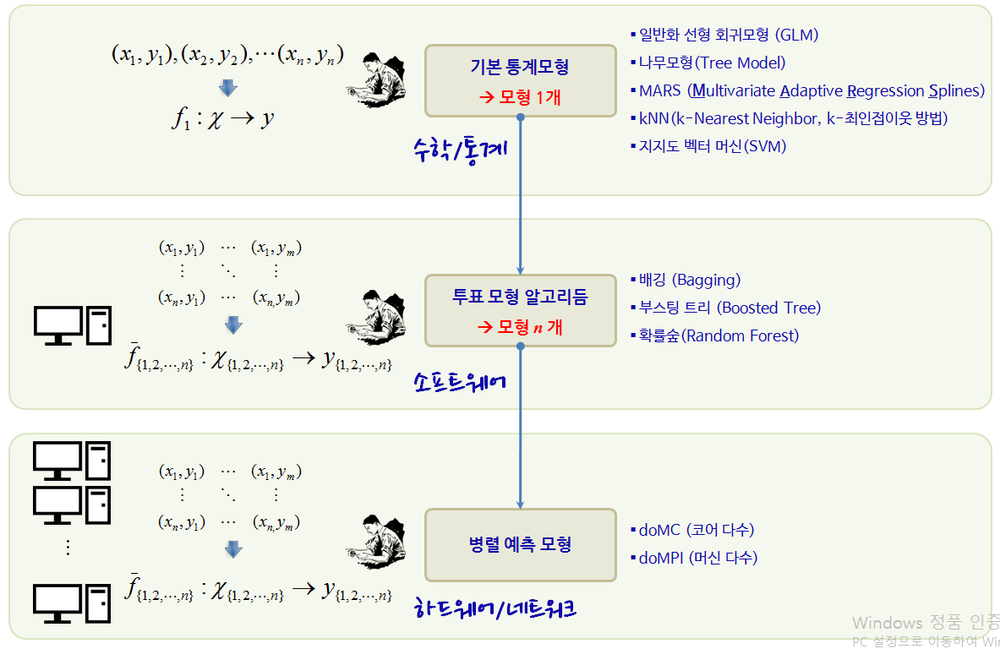
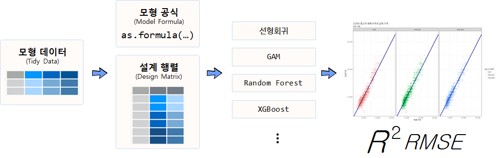

 
> ## 학습목표 {.objectives}
>
> * 가격 등 연속형 변수를 예측하는 지도학습 모형을 살펴본다.
> * 선형회귀모형에서 출발하여 `xgboost` 모형을 적용하여 데이터를 고문한다.
> * 컴퓨팅 자원을 최대한 활용하는 예측모형을 개발하고, $RMSE$와 $R^2$ 기준 예측모형 성능을 평가한다.


``` {r, include=FALSE}
source("tools/chunk-options.R")
knitr::opts_chunk$set(echo = TRUE, warning=FALSE, message=FALSE)

library(tidyverse)
library(caret)
library(gridExtra)
library(elasticnet)
library(MASS)
library(pls)

library(DT)
library(skimr)
library(ggthemes)
library(extrafont)
loadfonts()

library(mgcv)
library(ranger)
library(xgboost)
library(recipes)
library(xgboost)
```

## 1. 도요타 중고차 가격 예측 사례 [^toyota-data] {#toyota-data}

[^toyota-data]: [TOYOTA COROLLA 데이터 설명 및 R 코드](http://hedibert.org/wp-content/uploads/2014/03/toyotacorolla-R.txt)

Shmueli et al. (2010)[^toyota]에서 소개된 데이터로 도요타 코롤라 중고차 가격을 정확하게 예측하는 것이 목표다.

[^toyota]: [Shmueli, G., Patel, N.R., and Bruce, P.C.: Data Mining for Business Intelligence. Second edition. Hoboken, NJ: John Wiley & Sons, Inc., 2010](http://as.wiley.com/WileyCDA/WileyTitle/productCd-EHEP002378.html)

[ToyotaCorolla.csv](https://raw.githubusercontent.com/datailluminations/PredictingToyotaPricesBlog/master/ToyotaCorolla.csv) 
데이터는 GitHub에서도 다운로드 받아 바로 분석에 사용될 수 있다. 데이터는 도요타 중고차 가격이 종속변수로 예측변수는 연속형 변수와 범주형 변수가 섞여있다.

$$\text{중고차 가격} = f(\text{년식, 주행거리, 연료유형, 마력,} \cdots) + \epsilon$$

- Price: 가격 (유로)
- Age: 년식 (2004년 8월 기준)
- KM: 주행킬로미터 (kilometers driven)
- FuelType: 경유/휴발유 (petrol, diesel, CNG)
- HP: 마력(horsepower)
- MetColor: 메탈 색상 여부 (Yes=1, No=0)
- Automatic: 변속기(자동, 수동)
- Doors: 차량 문짝 갯수 
- Weight: 차체중량 (단위: 파운드)


## 2. `caret` 패러다임 예측모형 방법론 적용 {#caret-paradigm}

데이터가 주어진 상태에서 어떤 예측모형이 가장 최적인지는 알 수가 없다.
단 하나의 모형으로 모든 데이터에 대한 예측모형으로 최적이라고 단언하는 예측모형도 존재하지 않는다.

즉, 데이터가 주어지면 최적의 모형을 예측하는데 있어 "공짜 점심"은 없다.
전통적인 방식부터 가장 정확도가 높은 모형까지 순차적으로 개발해 나가보자.



1. 가장 단순한 모형을 데이터에 한번 적합시키고, 예측모형 개발자의 경험과 지식을 사용하여 가장 예측을 잘하는 모형을 추출해낸다.
1. 다양한 예측모형을 모형개발자가 설정하고, R이 자동으로 특정 조건 예를 들어, $R^2$, $RMSE$, $정확도$, $민감도$, $ROC$ 등을 최적화하는 모형을 교차타당도, 훈련/검증 데이터 기준, 붓스트랩 등의 방식으로 찾아낸다.
1. 컴퓨터와 R을 사용한 예측모형개발의 경우, 시간과 자원이 많이 소요되기 때문에 가장 병렬 컴퓨팅 개념을 확장하여 작업의 효율성과 더불어 더욱 크고 복잡한 문제에 대한 예측모형을 제시한다.


### 2.1. 데이터 준비 {#prepare-toyota-data}

`readr` 팩키지를 사용하면 `read_csv` 함수에 인자로 웹URL을 넣으면 내부적으로 인터넷 데이터처리 핸들러가 있어 자동으로 불러올 수 있게 된다. `tuc.df` 데이터프레임으로 작명(Toyota Used Car)하여 데이터를 불러오고, 
`caret` 팩키지 `createDataPartition` 함수로 7:3으로 훈련데이터와 검증데이터로 쪼갠다.

```{r pm-toyota-data, tidy=FALSE}
# library(tidyverse)
# library(caret)

# 01. 데이터 가져오기-----------------------------
# 1.1. 데이터 불러오기

tuc.df <- read_csv("https://raw.githubusercontent.com/datailluminations/PredictingToyotaPricesBlog/master/ToyotaCorolla.csv")
dim(tuc.df)

# 1.2. 훈련데이터, 검증데이터
in_train <- createDataPartition(tuc.df$Price, p = .7, list = FALSE)

tuc.train.df <- tuc.df[in_train, ]
tuc.test.df <- tuc.df[-in_train, ]
```

### 2.2. 데이터 정제 {#clean-toyota-data}

도요타 중고차 데이터가 이미 전처리되어 정제되어 있기 때문에 데이터 정제 및 전처리 과정은 생략한다.

```{r pm-toyota-clean, tidy=FALSE}
# 02. 데이터 정제 및 전처리 ---------------------
# 생략
```

## 3. 예측모형 개발 {#predictive-model-toyota-data}

전통적인 수작업 예측모형개발 과정을 살펴보고 컴퓨팅 자원과 지식을 활용한 예측모형개발 과정을 순차적으로 살펴본다.

### 3.1. 전통 수작업 예측모형 개발 {#predictive-model-in-old-way}

훈련데이터와 검증데이터로 우선 나누고 나서, 각 모형에 훈련데이터를 넣고, 적합시킨 예측모형에 검증데이터를 넣어 예측을 순서대로 진행해 나간다. 선형회귀모형, 강건 선형회귀모형, PLS(Partial Least Square, 부분최소자승법), 능선회귀모형을 예측모형으로 사용하고, 검증데이터를 넣어 성능을 예측한다.

```{r pm-toyota-old-model, tidy=FALSE}
# 03. 예측 모형 개발 ----------------------------
# Y변수와 X변수 구분 ----------------------------

# 훈련 데이터
tuc.train.Y <- tuc.train.df$Price
tuc.train.X <- tuc.train.df %>% dplyr::select(-Price)

# 검증 데이터
tuc.test.Y <- tuc.test.df$Price
tuc.test.X <- tuc.test.df %>% dplyr::select(-Price)

# 예측모형 적합------------------------------

# 3.1. 선형회귀모형
tuc.lm.m <- lm(Price ~ ., data = tuc.train.df)
tuc.lm.pred <- predict(tuc.lm.m, tuc.test.X) 

tuc.lm.values <- data.frame(obs = tuc.test.Y, pred = tuc.lm.pred) 
defaultSummary(tuc.lm.values)

# 3.2. 강건 선형회귀모형
# library(MASS)
tuc.rlm.m <- rlm(Price ~ ., data = tuc.train.df)
tuc.rlm.pred <- predict(tuc.rlm.m, tuc.test.X) 

tuc.rlm.values <- data.frame(obs = tuc.test.Y, pred = tuc.rlm.pred) 
defaultSummary(tuc.rlm.values)

# 3.3. PLS (Partial Least Square)
# library(pls)
tuc.plsr.m <- plsr(Price ~ ., data = tuc.train.df)
tuc.plsr.pred <- predict(tuc.plsr.m, tuc.test.X, ncomp = 1:2) 

# 3.4. 능선 회귀모형(Ridge Regression)
# library(elasticnet)
tuc.ridge.m <- enet(x = as.matrix(tuc.train.X[,-3]), y = tuc.train.Y, lambda = 0.001)

tuc.ridge.pred <- predict(tuc.ridge.m, newx = as.matrix(tuc.test.X[,-3]), 
                          s = 1, mode = "fraction", type = "fit")

tuc.ridge.coef <- predict(tuc.ridge.m, newx = as.matrix(tuc.test.X[,-3]),  
                    s = .1, mode = "fraction", type = "coefficients")

tuc.ridge.coef$coefficients
```

검증데이터의 종속변수와 예측모형에서 나온 종속변수 예측값과 산점도를 그려본다.
모형에서 예측된 값을 잔차와 함께 산점도로 도식화한다.

```{r pm-toyota-old-diagnostic, tidy=FALSE}
# 모형 시각화 -----------------------------------------------------
# 1. 선형회귀모형

p.fit <- xyplot(tuc.test.Y ~ predict(tuc.lm.m),
       type = c("p", "g"), xlab = "Predicted", ylab = "Observed")
p.resid <- xyplot(resid(tuc.lm.m) ~ predict(tuc.lm.m), add=TRUE,
       type = c("p", "g"), 
       xlab = "Predicted", ylab = "Residuals")
grid.arrange(p.fit, p.resid, ncol=2)
```

### 3.2. 컴퓨팅을 활용한 예측모형 개발  {#predictive-model-in-automatic-way}

교차타당도(cross-validation) 방법(10개 집단)을 사용해서 선형회귀모형, 강건 선형회귀모형, PLS(Partial Least Square, 부분최소자승법), 능선회귀모형, 라소 회귀방법을 적용하여 가장 최적의 모형을 선정한다.

```{r pm-toyota-pm, tidy=FALSE}
# 컴퓨팅을 활용한 예측모형 ------------------------------------------

# 0. 교차타당도 제어조건 설정
ctrl <- trainControl(method = "cv", number = 10)

# 1. 선형회귀모형
tuc.lm.tune <- train(Price ~ ., data = tuc.train.df, 
                      method = "lm", 
                      trControl = ctrl)
tuc.lm.tune

# 2. 강건 선형회귀모형
tuc.rlm.tune <- train(Price ~ ., data = tuc.train.df, 
                      method = "rlm", 
                      trControl = ctrl)
tuc.rlm.tune

# 3. 부분최소자승모형
tuc.plsr.tune <- train(Price ~ ., data = tuc.train.df, 
                       method = "pls",
                       preProc = c("center", "scale"),
                       tuneLength = 20, 
                       trControl = ctrl)
tuc.plsr.tune

# 4. 능선회귀모형
ridgeGrid <- data.frame(.lambda = seq(0, .1, length = 15))
tuc.ridge.tune <- train(tuc.train.X[,-3], tuc.train.Y, 
                        method = "ridge", 
                        tuneGrid = ridgeGrid, 
                        trControl = ctrl)
tuc.ridge.tune

# 5. 라소 회귀모형
enetGrid <- expand.grid(.lambda = c(0, 0.01, .1), 
                        .fraction = seq(.05, 1, length = 20))
tuc.lasso.tune <- train(tuc.train.X[,-3], tuc.train.Y,  
                        method = "enet", 
                        tuneGrid = enetGrid, 
                        trControl = ctrl)
tuc.lasso.tune
```

5개 모형을 $RMSE$와 $R^2$ 기준으로 가장 성능이 좋은 모형을 선정한다.

```{r pm-toyota-pm-comp, tidy=FALSE}
tuc.comp <- resamples(list( 
  LM =tuc.lm.tune,
  RLM = tuc.rlm.tune,
  PLS = tuc.plsr.tune,
  Lasso = tuc.lasso.tune, Ridge = tuc.ridge.tune))

bwplot(tuc.comp,  layout = c(2, 1),scales = list(relation = "free"),
       xlim = list(c(0, 2500), c(0.5, 1)))
```

## 4. 예측모형 실무 {#practical-predictive-model-toyota-data}

예측모형을 실무적으로 개발할 경우 모형데이터가 준비되면 이를 모형공식과 설계행렬(design matrix)로 나누어 준비한다.
모형공식과 설계행렬을 구분할 경우 예측모형이 갈수록 복잡해지고 정교해짐에 따라 관련 실수를 사전에 바로잡을 수 있는 장점이 있다.
모형공식과 설계행렬이 준비되면 `lm`, `glm`, `ranger`, `xgboost` 등 다양한 예측모형을 적합시킨다.

도요타 중고차 가격예측같은 지도학습 예측모형 개발은 **RMSE(제곱근평균제곱오차, root mean square error)**가 최소화되는 모형을 선정한다.
물론 $R^2$ 결정계수도 활용하기도 한다. 



- mgcv: `gam` 일반화 가법모형(Generalized Additive Model)
- ranger: `Random Forest` 모형 
- xgboost: `xgboost` 모형
- recipes: 모형설계행렬 구축 

### 4.1. 데이터 전처리 {#preprocessing}

도요타 중고차 데이터를 불러와서 연속형과 범주형으로 나누고 범주형 데이터는 요인으로 정의하고 각 요인 내부 수준을 설정한다.

``` {r practical-predictive-model}
# 0. 환경설정 -------------------------
# library(mgcv)
# library(ranger)
# library(xgboost)
# library(recipes)
# library(ranger)

# 1. 데이터 가져오기 -------------------------
tuc_dat <- read_csv("https://raw.githubusercontent.com/datailluminations/PredictingToyotaPricesBlog/master/ToyotaCorolla.csv")

# 2. 데이터 전처리 -------------------------
tuc_df <- tuc_dat %>% mutate(MetColor = factor(MetColor, levels=c(0, 1), labels=c("No Metallic", "Metallic")),
                  FuelType = factor(FuelType, levels=c("CNG", "Diesel", "Petrol")),
                  Automatic = factor(Automatic, levels=c(0, 1), labels=c("Manual", "Automatic")))

datatable(tuc_df) %>% 
    formatRound(c(1,3,8,10), digits=0)
```

### 4.2. 모형 공식 및 선형 회귀 모형 적합 {#linear-regression}

데이터가 준비되면 모형공식에 따라 예측변수와 설명변수를 공식으로 지정하고 기본 선형예측 모형을 적합해본다.

``` {r practical-predictive-model-linear}
# 3. 예측 회귀 모형 -------------------------
## 3.0. 회귀 모형 수식 --------------------------------
y_var <- "Price"
x_var <- setdiff(names(tuc_df), y_var)

fmla <- as.formula(paste(y_var, "~", paste(x_var, collapse="+")))

## 3.1. 기본 모형적합 --------------------------------

tuc_lm <- lm(fmla, data = tuc_dat)

tuc_df$pred <- predict(tuc_lm)

tuc_df %>% 
    mutate(resid = pred - Price) %>% 
    summarise(rmse = sqrt(mean(resid^2)))

ggplot(tuc_df, aes(x = pred, y = Price)) +
    geom_point() +
    geom_abline(color = "darkblue", size=2) +
    theme_bw(base_family="NanumGothic") +
    labs(title="도요타 중고차 예측가격과 실제 가격", x="예측가격", y="실제가격", subtitle="단위: 유로") +
    scale_y_continuous(labels=scales::comma) +
    scale_x_continuous(labels=scales::comma)
```

### 4.3. `Y` 중고차 가격 변수 변환 {#log-transformation}

예측값과 실제 중고차 가격이 값이 커질수록 오차가 커지는 것과 함께, 
원래 중고차 가격 데이터가 정규분포와 차이가 나서 로그 변환을 하여 예측모형을 개발해본다.


``` {r practical-predictive-model-y-transformation}
## 3.2. Y 변수 변환 --------------------------------
### 3.2.1. 정규분포 적합 -------------------------
tuc_normal_g <- tuc_df %>% 
    ggplot(aes(x=Price)) +
    geom_histogram(aes(y = ..density..), binwidth=1000) +
    stat_function(fun = dnorm, 
                  args = list(mean = mean(tuc_df$Price), sd = sd(tuc_df$Price)), 
                  lwd = 2, col = 'red') +
    theme_bw(base_family="NanumGothic") +
    labs(title="도요타 중고차 가격 분포", x="중고차 가격", y="확률밀도(density)", subtitle="단위: 유로") +
    scale_x_continuous(labels=scales::comma)

tuc_log_g <- tuc_df %>% 
    ggplot(aes(x=log(Price))) +
    geom_histogram(aes(y = ..density..)) +
    stat_function(fun = dnorm, 
                  args = list(mean = mean(log(tuc_df$Price)), sd = sd(log(tuc_df$Price))), 
                  lwd = 2, col = 'red') +
    theme_bw(base_family="NanumGothic") +
    labs(title="도요타 중고차 로그 변환가격 분포", x="중고차 가격(로그변환)", y="", subtitle="단위: 유로") +
    scale_x_continuous(labels=scales::comma)

grid.arrange(tuc_normal_g, tuc_log_g, nrow=1)

### 3.2.2. 중고차 가격 로그변환 전후 빈도수 -------------------------
tuc_df %>% mutate(log_Price = log(Price)) %>% 
    gather(key=y_type, value=y_val, Price, log_Price) %>% 
    mutate(y_type = factor(y_type, levels=c("Price", "log_Price"))) %>% 
    ggplot(aes(x=y_val, color=y_type)) +
    geom_histogram(aes(y = ..count..)) +
    facet_wrap(~y_type, scale="free") +
    theme_bw(base_family="NanumGothic") +
    labs(title="중고차 가격 로그변환 전후 분포 비교", x="중고차 가격", y="빈도수", subtitle="단위: 유로") +
    scale_x_continuous(labels=scales::comma) +
    scale_y_continuous(labels=scales::comma) +
    theme(legend.position = "none")
```

로그로 예측가격을 변환한 후에 모형적합을 시키고 로그의 역변환 지수함수로 원래 값을 복원한다.
그리고 나서 선형모형과 성능을 RMSE로 비교한다.

``` {r practical-predictive-model-y}
### 3.2.4. 변수 변환 모형적합 --------------------------------
fmla_log <- as.formula(paste("log(Price)", "~", paste(x_var, collapse="+")))    

tuc_log_lm <- lm(fmla_log, data = tuc_dat)

tuc_df$pred_log <- exp(predict(tuc_log_lm))

tuc_df %>% 
    mutate(resid = pred - Price,
           resid_log = pred_log - Price) %>% 
    summarise(rmse = sqrt(mean(resid^2)),
              rmse_log = sqrt(mean(resid_log^2))) %>% 
    bind_cols(data.frame(rsq=broom::glance(tuc_lm)$r.squared,
                         rsq_log=broom::glance(tuc_log_lm)$r.squared))

tuc_df %>% gather(key=reg_model, value=reg_pred, pred, pred_log) %>% 
    ggplot(aes(x = reg_pred, y = Price, color=reg_model)) +
        geom_point(alpha=0.3) +
        geom_abline(size=1.3, color = "darkblue") +
        theme_bw(base_family="NanumGothic") +
        labs(title="도요타 중고차 예측가격과 실제 가격", x="예측가격", y="실제가격", subtitle="단위: 유로") +
        scale_y_continuous(labels=scales::comma) +
        scale_x_continuous(labels=scales::comma)
```

### 4.3. `X` 변수 변환 {#gam}

`Y` 중고차 가격을 변환해서 일정부분 성능을 높였다면 중고차 가격 `Y`와 연속형 설명변수들 간의 관계가 비선형인 것을 식별하여
GAM 모형을 통해 이를 잡아낸다.

``` {r practical-predictive-model-x-transformation}
## 3.3. X 변수 변환 --------------------------------
tuc_df %>% 
    select_if(is.numeric) %>% 
    dplyr::select(-contains("pred")) %>% 
    pairs
```

`mgcv` 팩키지 `gam`함수를 통해 비선형성을 잡아낸 예측모형 성능을 앞선 모형과 RMSE 값을 기준으로 비교한다.

``` {r practical-predictive-model-gam}
fmla_gam <- as.formula(paste("Price", "~", "s(Age)+s(KM)+FuelType+s(HP)+MetColor+Automatic+s(CC)+Doors+s(Weight)"))

tuc_gam <- gam(fmla_gam, data=tuc_df, family=gaussian)

tuc_df$pred_gam <- as.numeric(predict(tuc_gam))

tuc_df %>% 
    mutate(resid = pred - Price,
           resid_log = pred_log - Price,
           resid_gam = pred_gam - Price) %>% 
    summarise(rmse = sqrt(mean(resid^2)),
              rmse_log = sqrt(mean(resid_log^2)),
              rmse_gam = sqrt(mean(resid_gam^2)))

tuc_df %>% gather(key=reg_model, value=reg_pred, pred, pred_log, pred_gam) %>% 
    mutate(reg_model = factor(reg_model, levels=c("pred", "pred_log", "pred_gam"))) %>% 
    ggplot(aes(x = reg_pred, y = Price, color=reg_model)) +
    geom_point(alpha=0.3) +
    geom_abline(size=1.3, color = "darkblue") +
    theme_bw(base_family="NanumGothic") +
    labs(title="도요타 중고차 예측가격과 실제 가격", x="예측가격", y="실제가격", subtitle="단위: 유로") +
    scale_y_continuous(labels=scales::comma) +
    scale_x_continuous(labels=scales::comma) +
    facet_wrap(~reg_model)
```

### 4.4. Random Forest 모형 {#random-forest}

xgboost가 캐글 대회를 휩쓸기 전까지 SVM과 함께 한 세대를 풍미한 `Random Forest` 모형을 적합시켜 성능이 얼마나 개선될 수 있는지 살펴보자.

``` {r practical-predictive-model-rf}
## 3.4. Random Forest --------------------------------
tuc_rf <- ranger(fmla,
                 tuc_df, 
                 num.trees = 500, 
                 respect.unordered.factors = "order")

tuc_df$pred_rf <- predict(tuc_rf, tuc_df)$predictions

tuc_df %>% 
    mutate(resid = pred - Price,
           resid_log = pred_log - Price,
           resid_gam = pred_gam - Price,
           resid_rf = pred_rf - Price) %>% 
    summarise(rmse = sqrt(mean(resid^2)),
              rmse_log = sqrt(mean(resid_log^2)),
              rmse_gam = sqrt(mean(resid_gam^2)),
              rmse_rf = sqrt(mean(resid_rf^2)))

tuc_df %>% gather(key=reg_model, value=reg_pred, pred, pred_log, pred_gam, pred_rf) %>% 
    mutate(reg_model = factor(reg_model, levels=c("pred", "pred_log", "pred_gam", "pred_rf"))) %>% 
    ggplot(aes(x = reg_pred, y = Price, color=reg_model)) +
    geom_point(alpha=0.3) +
    geom_abline(size=1.3, color = "darkblue") +
    theme_bw(base_family="NanumGothic") +
    theme(axis.text.y = element_text(vjust = 0),
          legend.position = "top",
          legend.box = "horizontal",
          legend.direction = "horizontal") +
    labs(title="도요타 중고차 예측가격과 실제 가격", x="예측가격", y="실제가격", 
         subtitle="단위: 유로", color="모형") +
    scale_y_continuous(labels=scales::comma) +
    scale_x_continuous(labels=scales::comma) +
    facet_wrap(~reg_model) +
    guides(fill = guide_legend(nrow = 1))
```

### 4.5. XGBoost 모형 {#xgboost}

[캐글(Kaggle)](https://www.kaggle.com/) 대회를 통해 `xgboost`가 두각을 나타내면서 
[xgboost: Extreme Gradient Boosting](https://cran.r-project.org/web/packages/xgboost/) 팩키지도 많이 사용되고 있다.
특히, xgboost 팩키지는 2016년 [John Chambers 상](http://stat-computing.org/awards/jmc/winners.html)을 수상하기도 했다.
xgboost를 사용할 때 R에서 요인형 데이터를 자체 변환하는 기능을 제공하지 않기 때문에 가변수코딩(원핫인코딩, one-hot-encoding)을 
사전에 실시하고 나서 `xgboost` 예측모형함수에 넣어줘야 기대했던 결과가 나올 수 있는 점을 유념한다.

``` {r practical-predictive-model-xgboost}
## 3.5. xgboost --------------------------------
tuc_rec <- recipe(fmla, data=tuc_df)

tuc_rec <- tuc_rec %>% 
    step_dummy(all_nominal())

tuc_dm <- prepare(tuc_rec)

tuc_clean_df <- bake(tuc_dm, newdata = tuc_df) 


tuc_xgb <- xgboost(data = as.matrix(tuc_clean_df), 
             label = tuc_df$Price,
             nrounds = 100,
             objective = "reg:linear",
             eta = 0.3,
             max_depth = 6,
             verbose = 0)

tuc_df$pred_xgb <- predict(tuc_xgb, as.matrix(tuc_clean_df))

tuc_df %>% 
    mutate(resid = pred - Price,
           resid_log = pred_log - Price,
           resid_gam = pred_gam - Price,
           resid_rf = pred_rf - Price,
           resid_xgb = pred_xgb - Price) %>% 
    summarise(rmse = sqrt(mean(resid^2)),
              rmse_log = sqrt(mean(resid_log^2)),
              rmse_gam = sqrt(mean(resid_gam^2)),
              rmse_rf = sqrt(mean(resid_rf^2)),
              rmse_xgb = sqrt(mean(resid_xgb^2)))

tuc_df %>% gather(key=reg_model, value=reg_pred, pred, pred_log, pred_gam, pred_rf, pred_xgb) %>% 
    mutate(reg_model = factor(reg_model, levels=c("pred", "pred_log", "pred_gam", "pred_rf", "pred_xgb"))) %>% 
    ggplot(aes(x = reg_pred, y = Price, color=reg_model)) +
    geom_point(alpha=0.3) +
    geom_abline(size=1.0, color = "darkblue") +
    theme_bw(base_family="NanumGothic") +
    theme(axis.text.y = element_text(vjust = 0),
          legend.position = "top",
          legend.box = "horizontal",
          legend.direction = "horizontal") +
    labs(title="도요타 중고차 예측가격과 실제 가격", x="예측가격", y="실제가격", 
         subtitle="단위: 유로", color="모형") +
    scale_y_continuous(labels=scales::comma) +
    scale_x_continuous(labels=scales::comma) +
    facet_wrap(~reg_model) +
    guides(fill = guide_legend(nrow = 1))
```