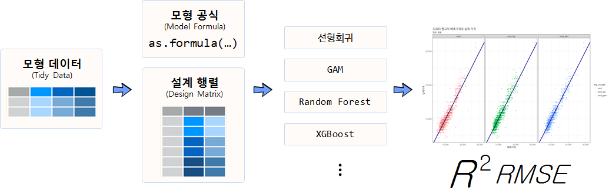
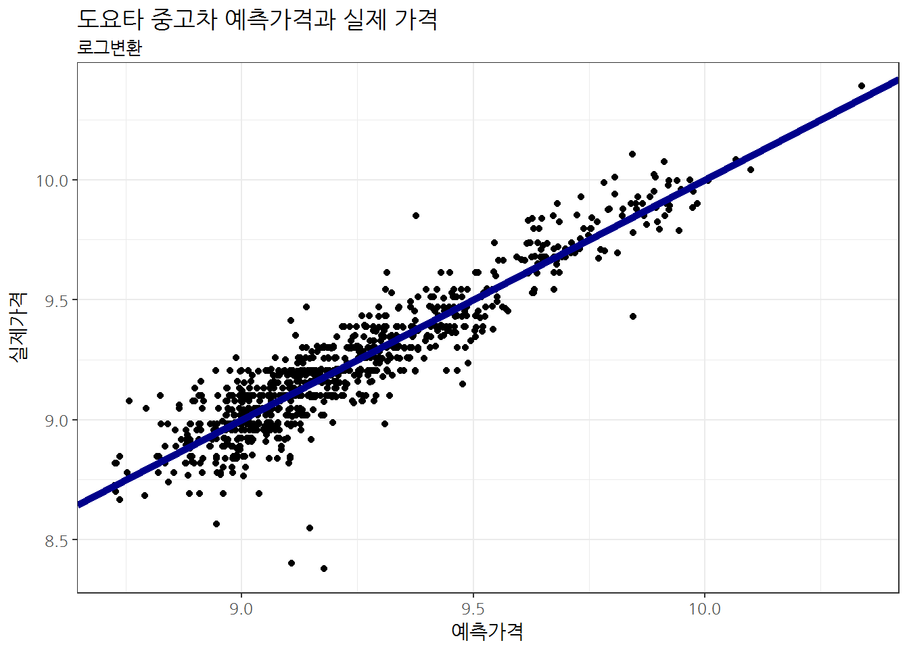
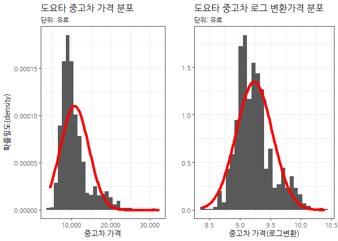
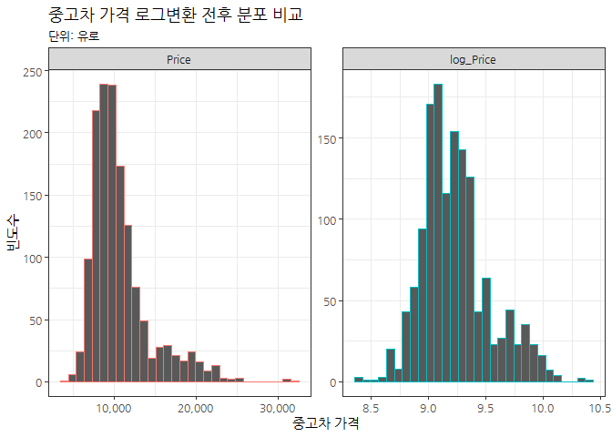
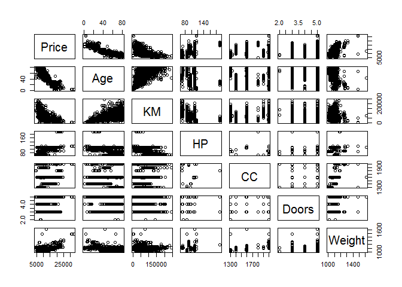
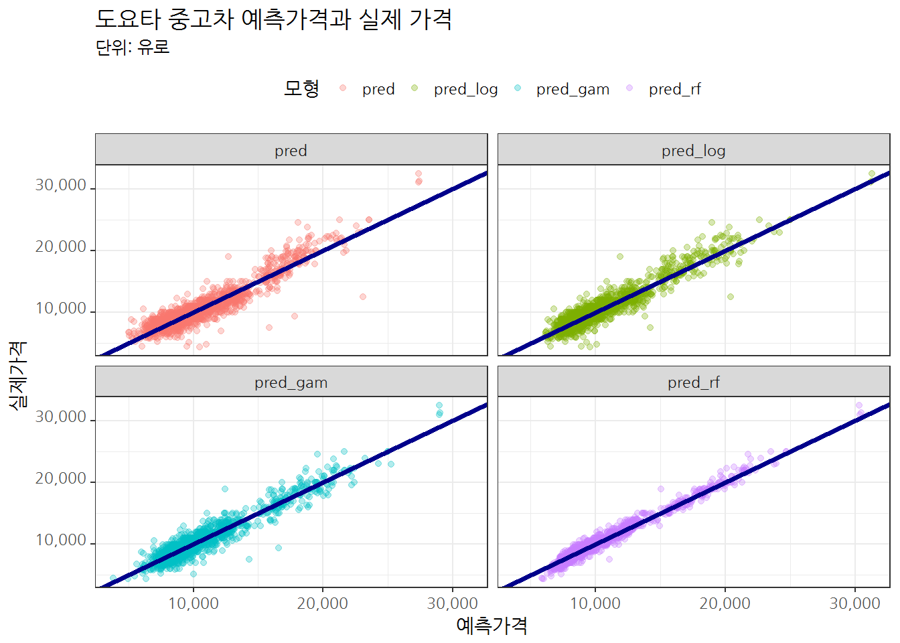

# xwMOOC 기계학습
 
> ## 학습목표 {.objectives}
>
> * 가격 등 연속형 변수를 예측하는 지도학습 모형을 살펴본다.
> * 선형회귀모형에서 출발하여 `xgboost` 모형을 적용하여 데이터를 고문한다.
> * 컴퓨팅 자원을 최대한 활용하는 예측모형을 개발하고, $RMSE$와 $R^2$ 기준 예측모형 성능을 평가한다.

## 1. 도요타 중고차 가격 예측 사례 [^toyota-data] {#toyota-data}

[^toyota-data]: [TOYOTA COROLLA 데이터 설명 및 R 코드](http://hedibert.org/wp-content/uploads/2014/03/toyotacorolla-R.txt)

Shmueli et al. (2010)[^toyota]에서 소개된 데이터로 도요타 코롤라 중고차 가격을 정확하게 예측하는 것이 목표다.

[^toyota]: [Shmueli, G., Patel, N.R., and Bruce, P.C.: Data Mining for Business Intelligence. Second edition. Hoboken, NJ: John Wiley & Sons, Inc., 2010](http://as.wiley.com/WileyCDA/WileyTitle/productCd-EHEP002378.html)

[ToyotaCorolla.csv](https://raw.githubusercontent.com/datailluminations/PredictingToyotaPricesBlog/master/ToyotaCorolla.csv) 
데이터는 GitHub에서도 다운로드 받아 바로 분석에 사용될 수 있다. 데이터는 도요타 중고차 가격이 종속변수로 예측변수는 연속형 변수와 범주형 변수가 섞여있다.

$$\text{중고차 가격} = f(\text{년식, 주행거리, 연료유형, 마력,} \cdots) + \epsilon$$

- Price: 가격 (유로)
- Age: 년식 (2004년 8월 기준)
- KM: 주행킬로미터 (kilometers driven)
- FuelType: 경유/휴발유 (petrol, diesel, CNG)
- HP: 마력(horsepower)
- MetColor: 메탈 색상 여부 (Yes=1, No=0)
- Automatic: 변속기(자동, 수동)
- Doors: 차량 문짝 갯수 
- Weight: 차체중량 (단위: 파운드)

## 2. `caret` 패러다임 예측모형 방법론 적용 {#caret-paradigm}

데이터가 주어진 상태에서 어떤 예측모형이 가장 최적인지는 알 수가 없다.
단 하나의 모형으로 모든 데이터에 대한 예측모형으로 최적이라고 단언하는 예측모형도 존재하지 않는다.

즉, 데이터가 주어지면 최적의 모형을 예측하는데 있어 "공짜 점심"은 없다.
전통적인 방식부터 가장 정확도가 높은 모형까지 순차적으로 개발해 나가보자.

1. 가장 단순한 모형을 데이터에 한번 적합시키고, 예측모형 개발자의 경험과 지식을 사용하여 가장 예측을 잘하는 모형을 추출해낸다.
1. 다양한 예측모형을 모형개발자가 설정하고, R이 자동으로 특정 조건 예를 들어, $R^2$, $RMSE$, $정확도$, $민감도$, $ROC$ 등을 최적화하는 모형을 교차타당도, 훈련/검증 데이터 기준, 붓스트랩 등의 방식으로 찾아낸다.
1. 컴퓨터와 R을 사용한 예측모형개발의 경우, 시간과 자원이 많이 소요되기 때문에 가장 병렬 컴퓨팅 개념을 확장하여 작업의 효율성과 더불어 더욱 크고 복잡한 문제에 대한 예측모형을 제시한다.

### 2.1. 데이터 준비 {#prepare-toyota-data}

`readr` 팩키지를 사용하면 `read_csv` 함수에 인자로 웹URL을 넣으면 내부적으로 인터넷 데이터처리 핸들러가 있어 자동으로 불러올 수 있게 된다. `tuc.df` 데이터프레임으로 작명(Toyota Used Car)하여 데이터를 불러오고, 
`caret` 팩키지 `createDataPartition` 함수로 7:3으로 훈련데이터와 검증데이터로 쪼갠다.

~~~{.r}
# library(tidyverse)
# library(caret)

# 01. 데이터 가져오기-----------------------------
# 1.1. 데이터 불러오기

tuc.df <- read_csv("https://raw.githubusercontent.com/datailluminations/PredictingToyotaPricesBlog/master/ToyotaCorolla.csv")
dim(tuc.df)
~~~

~~~{.output}
[1] 1436   10

~~~

~~~{.r}
# 1.2. 훈련데이터, 검증데이터
in_train <- createDataPartition(tuc.df$Price, p = .7, list = FALSE)

tuc.train.df <- tuc.df[in_train, ]
tuc.test.df <- tuc.df[-in_train, ]
~~~

### 2.2. 데이터 정제 {#clean-toyota-data}

도요타 중고차 데이터가 이미 전처리되어 정제되어 있기 때문에 데이터 정제 및 전처리 과정은 생략한다.

~~~{.r}
# 02. 데이터 정제 및 전처리 ---------------------
# 생략
~~~

## 3. 예측모형 개발 {#predictive-model-toyota-data}

전통적인 수작업 예측모형개발 과정을 살펴보고 컴퓨팅 자원과 지식을 활용한 예측모형개발 과정을 순차적으로 살펴본다.

### 3.1. 전통 수작업 예측모형 개발 {#predictive-model-in-old-way}

훈련데이터와 검증데이터로 우선 나누고 나서, 각 모형에 훈련데이터를 넣고, 적합시킨 예측모형에 검증데이터를 넣어 예측을 순서대로 진행해 나간다. 선형회귀모형, 강건 선형회귀모형, PLS(Partial Least Square, 부분최소자승법), 능선회귀모형을 예측모형으로 사용하고, 검증데이터를 넣어 성능을 예측한다.

~~~{.r}
# 03. 예측 모형 개발 ----------------------------
# Y변수와 X변수 구분 ----------------------------

# 훈련 데이터
tuc.train.Y <- tuc.train.df$Price
tuc.train.X <- tuc.train.df %>% dplyr::select(-Price)

# 검증 데이터
tuc.test.Y <- tuc.test.df$Price
tuc.test.X <- tuc.test.df %>% dplyr::select(-Price)

# 예측모형 적합------------------------------

# 3.1. 선형회귀모형
tuc.lm.m <- lm(Price ~ ., data = tuc.train.df)
tuc.lm.pred <- predict(tuc.lm.m, tuc.test.X) 

tuc.lm.values <- data.frame(obs = tuc.test.Y, pred = tuc.lm.pred) 
defaultSummary(tuc.lm.values)
~~~

~~~{.output}
        RMSE     Rsquared 
1415.9880844    0.8482112 

~~~

~~~{.r}
# 3.2. 강건 선형회귀모형
# library(MASS)
tuc.rlm.m <- rlm(Price ~ ., data = tuc.train.df)
tuc.rlm.pred <- predict(tuc.rlm.m, tuc.test.X) 

tuc.rlm.values <- data.frame(obs = tuc.test.Y, pred = tuc.rlm.pred) 
defaultSummary(tuc.rlm.values)
~~~

~~~{.output}
        RMSE     Rsquared 
1522.7557333    0.8260103 

~~~

~~~{.r}
# 3.3. PLS (Partial Least Square)
# library(pls)
tuc.plsr.m <- plsr(Price ~ ., data = tuc.train.df)
tuc.plsr.pred <- predict(tuc.plsr.m, tuc.test.X, ncomp = 1:2) 

# 3.4. 능선 회귀모형(Ridge Regression)
# library(elasticnet)
tuc.ridge.m <- enet(x = as.matrix(tuc.train.X[,-3]), y = tuc.train.Y, lambda = 0.001)

tuc.ridge.pred <- predict(tuc.ridge.m, newx = as.matrix(tuc.test.X[,-3]), 
                          s = 1, mode = "fraction", type = "fit")

tuc.ridge.coef <- predict(tuc.ridge.m, newx = as.matrix(tuc.test.X[,-3]),  
                    s = .1, mode = "fraction", type = "coefficients")

tuc.ridge.coef$coefficients
~~~

~~~{.output}
      Age        KM        HP  MetColor Automatic        CC     Doors 
-28.68506   0.00000   0.00000   0.00000   0.00000   0.00000   0.00000 
   Weight 
  0.00000 

~~~

검증데이터의 종속변수와 예측모형에서 나온 종속변수 예측값과 산점도를 그려본다.
모형에서 예측된 값을 잔차와 함께 산점도로 도식화한다.

~~~{.r}
# 모형 시각화 -----------------------------------------------------
# 1. 선형회귀모형

p.fit <- xyplot(tuc.test.Y ~ predict(tuc.lm.m),
       type = c("p", "g"), xlab = "Predicted", ylab = "Observed")
p.resid <- xyplot(resid(tuc.lm.m) ~ predict(tuc.lm.m), add=TRUE,
       type = c("p", "g"), 
       xlab = "Predicted", ylab = "Residuals")
grid.arrange(p.fit, p.resid, ncol=2)
~~~

### 3.2. 컴퓨팅을 활용한 예측모형 개발  {#predictive-model-in-automatic-way}

교차타당도(cross-validation) 방법(10개 집단)을 사용해서 선형회귀모형, 강건 선형회귀모형, PLS(Partial Least Square, 부분최소자승법), 능선회귀모형, 라소 회귀방법을 적용하여 가장 최적의 모형을 선정한다.

~~~{.r}
# 컴퓨팅을 활용한 예측모형 ------------------------------------------

# 0. 교차타당도 제어조건 설정
ctrl <- trainControl(method = "cv", number = 10)

# 1. 선형회귀모형
tuc.lm.tune <- train(Price ~ ., data = tuc.train.df, 
                      method = "lm", 
                      trControl = ctrl)
tuc.lm.tune
~~~

~~~{.output}
Linear Regression 

1007 samples
   9 predictor

No pre-processing
Resampling: Cross-Validated (10 fold) 
Summary of sample sizes: 907, 907, 906, 906, 906, 905, ... 
Resampling results:

  RMSE      Rsquared 
  1330.448  0.8675114

Tuning parameter 'intercept' was held constant at a value of TRUE

~~~

~~~{.r}
# 2. 강건 선형회귀모형
tuc.rlm.tune <- train(Price ~ ., data = tuc.train.df, 
                      method = "rlm", 
                      trControl = ctrl)
tuc.rlm.tune
~~~

~~~{.output}
Robust Linear Model 

1007 samples
   9 predictor

No pre-processing
Resampling: Cross-Validated (10 fold) 
Summary of sample sizes: 905, 905, 907, 907, 907, 906, ... 
Resampling results across tuning parameters:

  intercept  psi           RMSE      Rsquared 
  FALSE      psi.huber     1297.549  0.8723313
  FALSE      psi.hampel    1295.224  0.8722098
  FALSE      psi.bisquare  1298.952  0.8726905
   TRUE      psi.huber     1289.887  0.8681079
   TRUE      psi.hampel    1289.203  0.8682386
   TRUE      psi.bisquare  1290.586  0.8677184

RMSE was used to select the optimal model using  the smallest value.
The final values used for the model were intercept = TRUE and psi
 = psi.hampel.

~~~

~~~{.r}
# 3. 부분최소자승모형
tuc.plsr.tune <- train(Price ~ ., data = tuc.train.df, 
                       method = "pls",
                       preProc = c("center", "scale"),
                       tuneLength = 20, 
                       trControl = ctrl)
tuc.plsr.tune
~~~

~~~{.output}
Partial Least Squares 

1007 samples
   9 predictor

Pre-processing: centered (10), scaled (10) 
Resampling: Cross-Validated (10 fold) 
Summary of sample sizes: 907, 906, 906, 905, 907, 906, ... 
Resampling results across tuning parameters:

  ncomp  RMSE      Rsquared 
  1      1530.116  0.8195204
  2      1412.055  0.8470548
  3      1339.521  0.8606164
  4      1314.052  0.8659769
  5      1316.014  0.8649616
  6      1315.552  0.8643103
  7      1323.640  0.8627928
  8      1325.289  0.8628011
  9      1324.128  0.8631256

RMSE was used to select the optimal model using  the smallest value.
The final value used for the model was ncomp = 4.

~~~

~~~{.r}
# 4. 능선회귀모형
ridgeGrid <- data.frame(.lambda = seq(0, .1, length = 15))
tuc.ridge.tune <- train(tuc.train.X[,-3], tuc.train.Y, 
                        method = "ridge", 
                        tuneGrid = ridgeGrid, 
                        trControl = ctrl)
tuc.ridge.tune
~~~

~~~{.output}
Ridge Regression 

1007 samples
   8 predictor

No pre-processing
Resampling: Cross-Validated (10 fold) 
Summary of sample sizes: 905, 906, 907, 907, 906, 906, ... 
Resampling results across tuning parameters:

  lambda       RMSE      Rsquared 
  0.000000000  1321.485  0.8688630
  0.007142857  1320.629  0.8690568
  0.014285714  1320.024  0.8692102
  0.021428571  1319.646  0.8693284
  0.028571429  1319.475  0.8694157
  0.035714286  1319.493  0.8694760
  0.042857143  1319.685  0.8695123
  0.050000000  1320.037  0.8695277
  0.057142857  1320.537  0.8695246
  0.064285714  1321.175  0.8695051
  0.071428571  1321.941  0.8694711
  0.078571429  1322.828  0.8694243
  0.085714286  1323.826  0.8693662
  0.092857143  1324.931  0.8692980
  0.100000000  1326.134  0.8692208

RMSE was used to select the optimal model using  the smallest value.
The final value used for the model was lambda = 0.02857143.

~~~

~~~{.r}
# 5. 라소 회귀모형
enetGrid <- expand.grid(.lambda = c(0, 0.01, .1), 
                        .fraction = seq(.05, 1, length = 20))
tuc.lasso.tune <- train(tuc.train.X[,-3], tuc.train.Y,  
                        method = "enet", 
                        tuneGrid = enetGrid, 
                        trControl = ctrl)
tuc.lasso.tune
~~~

~~~{.output}
Elasticnet 

1007 samples
   8 predictor

No pre-processing
Resampling: Cross-Validated (10 fold) 
Summary of sample sizes: 906, 906, 907, 907, 907, 907, ... 
Resampling results across tuning parameters:

  lambda  fraction  RMSE      Rsquared 
  0.00    0.05      3389.911  0.7713848
  0.00    0.10      3164.254  0.7713848
  0.00    0.15      2945.520  0.7713848
  0.00    0.20      2735.416  0.7713848
  0.00    0.25      2536.145  0.7713848
  0.00    0.30      2350.535  0.7713848
  0.00    0.35      2185.608  0.7710811
  0.00    0.40      2047.676  0.7754535
  0.00    0.45      1917.821  0.7976842
  0.00    0.50      1796.327  0.8167107
  0.00    0.55      1686.979  0.8301142
  0.00    0.60      1592.597  0.8404099
  0.00    0.65      1510.036  0.8495995
  0.00    0.70      1442.525  0.8557561
  0.00    0.75      1391.952  0.8590781
  0.00    0.80      1363.692  0.8606050
  0.00    0.85      1342.022  0.8633356
  0.00    0.90      1329.692  0.8644449
  0.00    0.95      1323.830  0.8648041
  0.00    1.00      1320.961  0.8648766
  0.01    0.05      3390.649  0.7713848
  0.01    0.10      3165.687  0.7713848
  0.01    0.15      2947.589  0.7713848
  0.01    0.20      2738.040  0.7713848
  0.01    0.25      2539.213  0.7713848
  0.01    0.30      2353.898  0.7713848
  0.01    0.35      2189.122  0.7710728
  0.01    0.40      2051.363  0.7760492
  0.01    0.45      1921.269  0.7986888
  0.01    0.50      1799.664  0.8173848
  0.01    0.55      1690.040  0.8305478
  0.01    0.60      1595.566  0.8402970
  0.01    0.65      1512.577  0.8494836
  0.01    0.70      1444.431  0.8556837
  0.01    0.75      1393.062  0.8592144
  0.01    0.80      1362.911  0.8606350
  0.01    0.85      1341.787  0.8633021
  0.01    0.90      1328.937  0.8645849
  0.01    0.95      1322.620  0.8650652
  0.01    1.00      1319.792  0.8652166
  0.10    0.05      3392.921  0.7713848
  0.10    0.10      3170.096  0.7713848
  0.10    0.15      2953.955  0.7713848
  0.10    0.20      2746.114  0.7713848
  0.10    0.25      2548.657  0.7713848
  0.10    0.30      2364.324  0.7713852
  0.10    0.35      2202.472  0.7713902
  0.10    0.40      2065.904  0.7859852
  0.10    0.45      1933.679  0.8082518
  0.10    0.50      1811.049  0.8240221
  0.10    0.55      1699.866  0.8349902
  0.10    0.60      1602.233  0.8424277
  0.10    0.65      1520.950  0.8492604
  0.10    0.70      1450.418  0.8554881
  0.10    0.75      1396.264  0.8594495
  0.10    0.80      1360.406  0.8616295
  0.10    0.85      1344.179  0.8621261
  0.10    0.90      1331.784  0.8641165
  0.10    0.95      1325.600  0.8653004
  0.10    1.00      1325.168  0.8657262

RMSE was used to select the optimal model using  the smallest value.
The final values used for the model were fraction = 1 and lambda = 0.01.

~~~

5개 모형을 $RMSE$와 $R^2$ 기준으로 가장 성능이 좋은 모형을 선정한다.

~~~{.r}
tuc.comp <- resamples(list( 
  LM =tuc.lm.tune,
  RLM = tuc.rlm.tune,
  PLS = tuc.plsr.tune,
  Lasso = tuc.lasso.tune, Ridge = tuc.ridge.tune))

bwplot(tuc.comp,  layout = c(2, 1),scales = list(relation = "free"),
       xlim = list(c(0, 2500), c(0.5, 1)))
~~~

## 4. 예측모형 실무 {#practical-predictive-model-toyota-data}

예측모형을 실무적으로 개발할 경우 모형데이터가 준비되면 이를 모형공식과 설계행렬(design matrix)로 나누어 준비한다.
모형공식과 설계행렬을 구분할 경우 예측모형이 갈수록 복잡해지고 정교해짐에 따라 관련 실수를 사전에 바로잡을 수 있는 장점이 있다.
모형공식과 설계행렬이 준비되면 `lm`, `glm`, `ranger`, `xgboost` 등 다양한 예측모형을 적합시킨다.

도요타 중고차 가격예측같은 지도학습 예측모형 개발은 **RMSE(제곱근평균제곱오차, root mean square error)**가 최소화되는 모형을 선정한다.
물론 $R^2$ 결정계수도 활용하기도 한다. 

- mgcv: `gam` 일반화 가법모형(Generalized Additive Model)
- ranger: `Random Forest` 모형 
- xgboost: `xgboost` 모형
- recipes: 모형설계행렬 구축 

### 4.1. 데이터 전처리 {#preprocessing}

도요타 중고차 데이터를 불러와서 연속형과 범주형으로 나누고 범주형 데이터는 요인으로 정의하고 각 요인 내부 수준을 설정한다.

~~~{.r}
# 0. 환경설정 -------------------------
# library(mgcv)
# library(ranger)
# library(xgboost)
# library(recipes)
# library(ranger)

# 1. 데이터 가져오기 -------------------------
tuc_dat <- read_csv("https://raw.githubusercontent.com/datailluminations/PredictingToyotaPricesBlog/master/ToyotaCorolla.csv")

# 2. 데이터 전처리 -------------------------
tuc_df <- tuc_dat %>% mutate(MetColor = factor(MetColor, levels=c(0, 1), labels=c("No Metallic", "Metallic")),
                  FuelType = factor(FuelType, levels=c("CNG", "Diesel", "Petrol")),
                  Automatic = factor(Automatic, levels=c(0, 1), labels=c("Manual", "Automatic")))

datatable(tuc_df) %>% 
    formatRound(c(1,3,8,10), digits=0)
~~~

<!--html_preserve-->

<script type="application/json" data-for="htmlwidget-62e9798365169b137ce6">{"x":{"filter":"none","data":[["1","2","3","4","5","6","7","8","9","10","11","12","13","14","15","16","17","18","19","20","21","22","23","24","25","26","27","28","29","30","31","32","33","34","35","36","37","38","39","40","41","42","43","44","45","46","47","48","49","50","51","52","53","54","55","56","57","58","59","60","61","62","63","64","65","66","67","68","69","70","71","72","73","74","75","76","77","78","79","80","81","82","83","84","85","86","87","88","89","90","91","92","93","94","95","96","97","98","99","100","101","102","103","104","105","106","107","108","109","110","111","112","113","114","115","116","117","118","119","120","121","122","123","124","125","126","127","128","129","130","131","132","133","134","135","136","137","138","139","140","141","142","143","144","145","146","147","148","149","150","151","152","153","154","155","156","157","158","159","160","161","162","163","164","165","166","167","168","169","170","171","172","173","174","175","176","177","178","179","180","181","182","183","184","185","186","187","188","189","190","191","192","193","194","195","196","197","198","199","200","201","202","203","204","205","206","207","208","209","210","211","212","213","214","215","216","217","218","219","220","221","222","223","224","225","226","227","228","229","230","231","232","233","234","235","236","237","238","239","240","241","242","243","244","245","246","247","248","249","250","251","252","253","254","255","256","257","258","259","260","261","262","263","264","265","266","267","268","269","270","271","272","273","274","275","276","277","278","279","280","281","282","283","284","285","286","287","288","289","290","291","292","293","294","295","296","297","298","299","300","301","302","303","304","305","306","307","308","309","310","311","312","313","314","315","316","317","318","319","320","321","322","323","324","325","326","327","328","329","330","331","332","333","334","335","336","337","338","339","340","341","342","343","344","345","346","347","348","349","350","351","352","353","354","355","356","357","358","359","360","361","362","363","364","365","366","367","368","369","370","371","372","373","374","375","376","377","378","379","380","381","382","383","384","385","386","387","388","389","390","391","392","393","394","395","396","397","398","399","400","401","402","403","404","405","406","407","408","409","410","411","412","413","414","415","416","417","418","419","420","421","422","423","424","425","426","427","428","429","430","431","432","433","434","435","436","437","438","439","440","441","442","443","444","445","446","447","448","449","450","451","452","453","454","455","456","457","458","459","460","461","462","463","464","465","466","467","468","469","470","471","472","473","474","475","476","477","478","479","480","481","482","483","484","485","486","487","488","489","490","491","492","493","494","495","496","497","498","499","500","501","502","503","504","505","506","507","508","509","510","511","512","513","514","515","516","517","518","519","520","521","522","523","524","525","526","527","528","529","530","531","532","533","534","535","536","537","538","539","540","541","542","543","544","545","546","547","548","549","550","551","552","553","554","555","556","557","558","559","560","561","562","563","564","565","566","567","568","569","570","571","572","573","574","575","576","577","578","579","580","581","582","583","584","585","586","587","588","589","590","591","592","593","594","595","596","597","598","599","600","601","602","603","604","605","606","607","608","609","610","611","612","613","614","615","616","617","618","619","620","621","622","623","624","625","626","627","628","629","630","631","632","633","634","635","636","637","638","639","640","641","642","643","644","645","646","647","648","649","650","651","652","653","654","655","656","657","658","659","660","661","662","663","664","665","666","667","668","669","670","671","672","673","674","675","676","677","678","679","680","681","682","683","684","685","686","687","688","689","690","691","692","693","694","695","696","697","698","699","700","701","702","703","704","705","706","707","708","709","710","711","712","713","714","715","716","717","718","719","720","721","722","723","724","725","726","727","728","729","730","731","732","733","734","735","736","737","738","739","740","741","742","743","744","745","746","747","748","749","750","751","752","753","754","755","756","757","758","759","760","761","762","763","764","765","766","767","768","769","770","771","772","773","774","775","776","777","778","779","780","781","782","783","784","785","786","787","788","789","790","791","792","793","794","795","796","797","798","799","800","801","802","803","804","805","806","807","808","809","810","811","812","813","814","815","816","817","818","819","820","821","822","823","824","825","826","827","828","829","830","831","832","833","834","835","836","837","838","839","840","841","842","843","844","845","846","847","848","849","850","851","852","853","854","855","856","857","858","859","860","861","862","863","864","865","866","867","868","869","870","871","872","873","874","875","876","877","878","879","880","881","882","883","884","885","886","887","888","889","890","891","892","893","894","895","896","897","898","899","900","901","902","903","904","905","906","907","908","909","910","911","912","913","914","915","916","917","918","919","920","921","922","923","924","925","926","927","928","929","930","931","932","933","934","935","936","937","938","939","940","941","942","943","944","945","946","947","948","949","950","951","952","953","954","955","956","957","958","959","960","961","962","963","964","965","966","967","968","969","970","971","972","973","974","975","976","977","978","979","980","981","982","983","984","985","986","987","988","989","990","991","992","993","994","995","996","997","998","999","1000","1001","1002","1003","1004","1005","1006","1007","1008","1009","1010","1011","1012","1013","1014","1015","1016","1017","1018","1019","1020","1021","1022","1023","1024","1025","1026","1027","1028","1029","1030","1031","1032","1033","1034","1035","1036","1037","1038","1039","1040","1041","1042","1043","1044","1045","1046","1047","1048","1049","1050","1051","1052","1053","1054","1055","1056","1057","1058","1059","1060","1061","1062","1063","1064","1065","1066","1067","1068","1069","1070","1071","1072","1073","1074","1075","1076","1077","1078","1079","1080","1081","1082","1083","1084","1085","1086","1087","1088","1089","1090","1091","1092","1093","1094","1095","1096","1097","1098","1099","1100","1101","1102","1103","1104","1105","1106","1107","1108","1109","1110","1111","1112","1113","1114","1115","1116","1117","1118","1119","1120","1121","1122","1123","1124","1125","1126","1127","1128","1129","1130","1131","1132","1133","1134","1135","1136","1137","1138","1139","1140","1141","1142","1143","1144","1145","1146","1147","1148","1149","1150","1151","1152","1153","1154","1155","1156","1157","1158","1159","1160","1161","1162","1163","1164","1165","1166","1167","1168","1169","1170","1171","1172","1173","1174","1175","1176","1177","1178","1179","1180","1181","1182","1183","1184","1185","1186","1187","1188","1189","1190","1191","1192","1193","1194","1195","1196","1197","1198","1199","1200","1201","1202","1203","1204","1205","1206","1207","1208","1209","1210","1211","1212","1213","1214","1215","1216","1217","1218","1219","1220","1221","1222","1223","1224","1225","1226","1227","1228","1229","1230","1231","1232","1233","1234","1235","1236","1237","1238","1239","1240","1241","1242","1243","1244","1245","1246","1247","1248","1249","1250","1251","1252","1253","1254","1255","1256","1257","1258","1259","1260","1261","1262","1263","1264","1265","1266","1267","1268","1269","1270","1271","1272","1273","1274","1275","1276","1277","1278","1279","1280","1281","1282","1283","1284","1285","1286","1287","1288","1289","1290","1291","1292","1293","1294","1295","1296","1297","1298","1299","1300","1301","1302","1303","1304","1305","1306","1307","1308","1309","1310","1311","1312","1313","1314","1315","1316","1317","1318","1319","1320","1321","1322","1323","1324","1325","1326","1327","1328","1329","1330","1331","1332","1333","1334","1335","1336","1337","1338","1339","1340","1341","1342","1343","1344","1345","1346","1347","1348","1349","1350","1351","1352","1353","1354","1355","1356","1357","1358","1359","1360","1361","1362","1363","1364","1365","1366","1367","1368","1369","1370","1371","1372","1373","1374","1375","1376","1377","1378","1379","1380","1381","1382","1383","1384","1385","1386","1387","1388","1389","1390","1391","1392","1393","1394","1395","1396","1397","1398","1399","1400","1401","1402","1403","1404","1405","1406","1407","1408","1409","1410","1411","1412","1413","1414","1415","1416","1417","1418","1419","1420","1421","1422","1423","1424","1425","1426","1427","1428","1429","1430","1431","1432","1433","1434","1435","1436"],[13500,13750,13950,14950,13750,12950,16900,18600,21500,12950,20950,19950,19600,21500,22500,22000,22750,17950,16750,16950,15950,16950,15950,16950,16250,15950,17495,15750,16950,17950,12950,15750,15950,14950,15500,15750,15950,14950,15750,14750,13950,16750,13950,16950,16950,19000,17950,15800,17950,21950,17950,15750,20500,21950,15500,13250,15250,15250,18950,15999,14950,16500,18750,17950,17950,16950,18950,14950,22250,15950,15950,12995,18950,15750,19950,16950,18750,18450,16895,14900,18950,17250,15450,17950,16650,17450,14900,17950,15950,21950,16450,22250,19950,15950,18900,19950,15950,15950,18750,17450,18990,16250,18500,18500,19450,16950,18800,17450,17950,32500,31000,31275,24950,24950,22950,24990,21950,17900,19250,22250,18950,19950,16350,18950,16950,21750,15950,16500,17950,15850,16250,15950,16250,15950,16500,16500,18450,16250,23000,19900,16450,23950,19950,18500,18950,16450,20500,24500,19450,20950,17200,19950,18450,19500,21750,16868,19500,18900,19750,19750,18950,20750,19600,19500,17650,19950,19950,20950,20500,17795,18245,23750,19500,18950,21950,19950,18950,19950,21950,22500,18500,18700,21125,21500,17795,18245,6950,9500,11950,7750,11950,4350,4750,11750,13250,11950,11900,14750,9950,11950,11495,11250,10500,10450,12950,11500,12500,10950,11450,11950,13250,14750,11790,11450,13500,10950,13500,10950,10950,12950,11950,12450,11950,14950,12450,12950,11950,11690,12450,12750,11925,12950,11950,12900,11900,11650,10950,13950,13950,11950,10950,12450,11950,13500,11690,13500,11950,12900,13500,11750,11750,10850,11750,14950,9940,12900,13500,11750,11950,13450,11950,12495,13500,12750,12000,11950,12495,12450,14750,10950,13500,12950,13500,13450,13500,11480,13450,11495,12750,14990,12950,12950,12850,13950,11950,12950,11700,9950,11895,12950,12500,13875,10500,12295,13950,10950,12950,12850,13995,13750,12750,12500,13950,11500,13950,11895,9950,13500,11450,12450,12950,13995,11750,11650,9950,13950,12950,10950,9900,11950,11990,10750,13950,11250,12950,11950,10950,12950,12950,11695,11000,13950,11950,11750,12400,12500,12900,12200,12750,11950,11900,11950,14950,11950,12950,14950,13450,13750,12950,12750,11895,9950,12450,12500,14950,13750,12695,14990,12750,14350,12950,11500,11950,13450,12900,10500,10950,11950,11450,13250,10250,13995,11950,13250,12950,11750,11500,13500,6500,6400,7000,7750,8900,8500,8950,9900,10250,9250,7750,9450,7750,8250,9950,4450,9950,9000,9950,12450,10500,10750,8950,10500,5150,10950,9450,9950,10950,11900,9950,11950,7900,10950,8950,11950,10900,9950,9950,10950,8950,8950,10500,8950,9250,11500,9750,9950,11450,12500,10500,12950,12200,10950,10950,11290,10750,10895,11500,9750,10250,12500,11950,10750,11450,11950,11750,10950,11950,10995,11450,8900,10500,11750,11450,12000,11950,9850,10950,10950,8695,10990,9500,11950,10750,8750,8750,11450,9950,11950,13950,11250,10900,9750,9950,11950,10450,8950,10250,9930,10500,11950,11500,11500,11450,9900,9500,10500,10750,8950,12000,9940,10950,10750,9799,11750,11950,11250,11750,10950,11250,9950,9700,11950,9900,9990,9475,11500,11950,11500,10500,10900,11700,11900,13950,10950,10500,10750,11950,10000,10495,11450,9400,11950,9650,18950,11450,10250,11450,9950,10500,13750,9950,10250,10850,11895,12950,11950,10750,9550,10950,11750,10950,12450,10500,10900,12950,10950,12500,9950,10750,12500,10450,10750,12950,10995,11950,11250,11950,13750,11000,13500,10950,10750,8950,12950,9750,10900,10995,10750,10950,13000,12950,11500,10950,11710,9980,12250,11500,11950,11500,11900,11930,10500,8950,10450,10500,12950,9950,12900,9950,9950,10950,10950,9950,10950,10800,10500,10450,10600,10450,12950,11250,7500,8950,6950,7900,5950,7500,7500,6900,5751,6950,7950,7750,7950,8250,6250,9500,6900,8450,7350,8950,6900,8950,8750,7950,8950,8950,8950,7950,7750,7500,8950,9800,9450,8950,8750,10500,7995,10450,9950,9950,8950,7950,10950,9950,8600,7250,6950,8000,9950,9450,7950,9450,9950,6950,8250,9950,8250,9950,10500,7950,9750,9250,9500,9950,7750,9500,9950,9750,9750,5950,8500,8495,9250,6900,8950,9500,9250,9895,9950,7950,8750,8250,8950,8950,8950,8950,9450,8950,9250,8750,9950,9950,9900,8950,8950,12250,9250,10250,8950,7999,9900,8250,10500,8450,9900,10500,8500,9500,9450,9900,8250,8750,9500,8450,8490,8750,9750,9950,8500,8450,7900,8750,7950,6900,8150,10995,8900,9500,8950,11500,10450,10500,9250,10950,10450,9250,8750,8750,9800,8250,10450,9750,8950,7450,8450,8250,10950,8950,8750,10450,10950,8450,9950,9950,8750,9950,9500,8250,10950,7950,8250,9895,9130,10950,10500,8900,9500,10950,7950,7950,7950,9500,10950,9750,9750,9450,8950,8950,8900,9950,8750,8950,8990,8950,8950,9950,9900,8950,8950,9500,7950,7750,8950,11950,8950,11950,8950,9950,8250,8995,9995,9250,10950,8900,9500,9950,7950,8250,9450,7950,9500,8950,10950,8950,9450,8000,9900,8950,10900,9450,8450,9500,10500,6950,9750,6950,9650,9950,9250,8950,9900,10995,10500,8950,9750,10950,9750,9950,10500,10400,8800,10500,9250,7800,9950,10750,10950,9950,9950,8100,9250,7800,9000,8950,8950,9950,8500,7995,8750,9750,10950,9750,8200,8950,9500,10950,9750,9950,10450,9850,9450,10295,9750,8950,9900,8750,9950,8500,9950,10950,9795,8750,8250,9950,9950,10500,9750,11250,8900,7950,11500,9450,7995,10995,8950,8250,8950,8950,9500,7500,8950,9950,9750,9450,9950,9750,8950,8250,7750,8950,9950,9450,12950,9950,10495,7950,10500,8950,9900,9995,9950,9950,8250,9950,8950,10950,9250,9950,9995,8750,10950,10350,9950,8950,10950,10950,8950,8900,10250,9450,9250,10500,7350,10250,10250,11500,8950,7750,9500,8450,8950,8400,9250,8900,8750,10950,8950,8950,8895,9390,8750,9750,9950,10950,9900,9500,9950,9950,10500,9950,10495,9500,8500,10450,8950,9900,8900,8745,8750,10750,9750,8850,7950,9450,9950,8250,9950,9995,9950,10495,7950,8950,9695,7750,9950,9950,9950,9900,10950,8950,8950,8250,10250,8750,9750,10950,10950,9750,8900,9500,9950,9950,8250,10450,10950,9250,8900,10900,9750,11950,7900,10900,10450,10950,9950,10750,9900,10750,10450,9450,10750,10950,10000,10500,12500,8950,10500,9245,10950,9500,10900,10950,9450,5900,6950,6000,5250,4400,6750,8500,6150,6950,5750,8750,6500,5950,6500,10500,8500,7950,5800,6750,6950,5740,6550,8950,6750,7950,7950,7450,7750,6450,7900,6900,5600,5950,6950,7950,8950,7950,9500,8600,5950,7750,7950,6950,7250,6500,7250,9250,8250,7250,5250,7900,6900,7900,7250,8450,7950,7950,6450,6650,7950,7250,7450,7950,7250,8250,8950,7750,8500,7750,5750,6900,6500,6500,7600,8950,7450,7350,7750,7460,9250,7250,6500,6800,8700,7500,7750,7950,9950,6640,8750,7750,5950,6750,6500,8750,7950,6750,7950,7950,8950,7750,6450,6900,8450,6750,8050,9500,7750,8500,7795,6490,7950,6425,8950,6950,8750,8450,7950,7950,8900,8950,8900,7950,6495,7250,9250,6650,6990,7750,6950,7250,9950,9250,7200,8250,8950,8250,6250,9900,7300,8950,6500,7950,7450,7950,8500,6950,7950,6750,8450,7500,8750,8750,8950,7450,9200,8950,7850,6950,7200,7450,6750,7500,7450,7950,7250,7950,8250,8250,6750,8750,8950,8500,8250,9450,7950,7900,8500,8250,8250,8950,7950,6950,7250,7750,8700,8950,6750,7500,7950,8950,7950,7450,5950,7750,6950,8750,8950,7495,7750,6950,7990,7250,6900,7750,7250,8950,8500,7950,6950,8000,7950,8500,7490,8250,9250,7950,9500,8950,8450,7995,8750,5950,8500,8950,8750,7600,7145,8450,5950,9000,7250,7400,8800,7750,7500,8450,7400,7500,8950,8950,7950,7950,7950,8950,7750,8250,7950,7750,8500,6950,7500,7750,5950,7500,8950,7950,6900,7450,8500,7500,8750,7500,9950,7950,9950,9250,9250,9950,5950,7995,8950,7450,8250,8500,8500,9400,7250,8950,9450,8500,6750,7400,8950,6900,7750,8950,6950,8495,10000,6999,8950,8500,8750,7499,9000,8950,6950,8500,8450,8950,8250,7950,7450,9000,7150,7750,5845,8500,8250,9450,6750,8400,7900,7950,8750,9900,6495,8250,6900,7500,7950,8250,8950,9750,8250,8900,8950,6750,7950,8600,7750,7800,8750,9500,7750,9950,7750,5950,10950,9450,8250,9750,7450,8750,8750,8500,8950,7500,7250,7450,8750,9800,7500,8950,8950,7450,8950,10500,7000,8500,7750,8950,8250,9250,7900,8500,7950,9950,8750,7500,6950,8950,8750,7750,8450,8150,8500,7600,7950,7750,7950,9950,8950,8450,8950,8450,7500,10845,8500,7250,6950],[23,23,24,26,30,32,27,30,27,23,25,22,25,31,32,28,30,24,24,30,30,29,28,28,29,25,27,29,28,30,29,22,27,26,22,26,25,23,32,27,22,27,22,27,22,23,27,22,22,31,22,30,26,27,25,32,28,26,23,30,22,27,31,30,27,26,28,22,22,25,28,32,28,23,28,23,31,27,29,30,25,29,25,31,25,28,30,20,19,19,20,20,16,20,20,17,19,19,11,18,20,19,13,11,11,19,14,17,20,4,4,4,8,8,7,8,8,7,20,17,13,19,14,20,17,16,20,20,17,13,20,20,19,13,20,19,19,13,11,20,20,19,13,16,15,16,20,13,19,14,20,19,10,12,13,15,16,11,17,16,16,17,9,14,11,14,14,14,12,9,9,8,8,8,8,8,8,7,8,6,7,7,2,2,1,1,43,38,40,43,40,44,44,40,41,37,44,39,42,39,44,40,42,35,43,44,40,43,41,37,41,40,34,40,33,33,33,41,44,38,43,44,40,44,35,38,35,34,42,36,44,33,42,41,41,38,44,35,44,40,38,38,43,33,33,39,42,39,43,42,33,43,43,42,39,42,38,44,44,33,41,39,41,40,39,38,44,34,40,39,33,38,35,34,43,41,39,39,43,38,35,40,39,40,41,39,40,37,44,43,36,39,35,33,42,38,44,40,35,39,37,41,43,39,44,41,44,42,37,42,40,44,42,39,43,41,44,38,42,44,40,36,37,44,39,41,42,33,35,43,41,35,38,40,34,35,33,41,43,42,41,44,42,41,33,41,40,38,43,33,39,42,38,38,43,39,39,33,43,41,39,35,41,40,38,41,35,41,37,44,39,35,40,33,40,38,39,43,53,51,53,54,45,55,54,51,53,48,48,54,55,52,49,56,50,48,53,47,55,54,53,54,56,49,52,54,51,47,50,54,50,52,48,51,49,55,51,54,55,55,49,53,53,48,52,45,49,54,50,50,50,50,54,49,49,53,47,48,55,49,54,50,46,54,48,50,55,49,56,49,50,47,49,52,50,53,54,54,50,53,55,49,46,47,49,55,46,56,52,54,50,56,52,56,48,54,54,53,54,54,48,55,54,56,54,50,50,54,56,53,47,54,51,51,54,52,54,55,56,53,51,47,53,55,48,54,53,55,50,46,52,51,51,49,56,55,55,56,48,50,54,51,53,49,51,52,48,54,56,54,48,54,54,52,53,50,56,54,56,52,47,54,52,50,50,47,56,55,56,48,49,52,49,50,49,50,47,54,47,50,54,54,47,51,56,54,55,48,52,49,45,52,56,48,49,51,46,56,55,46,49,52,56,46,55,50,55,52,48,55,48,53,47,50,50,56,50,51,48,50,47,50,52,58,68,68,59,62,65,67,68,67,59,64,64,67,62,59,64,65,68,60,59,61,67,64,58,65,64,60,59,67,67,66,62,68,61,59,64,66,68,68,68,57,64,68,65,68,64,58,60,68,63,64,65,59,67,59,68,66,62,65,61,68,62,63,68,67,64,58,59,62,68,67,68,58,63,63,68,57,61,68,57,63,68,61,65,67,59,65,64,61,61,65,66,67,60,67,61,68,65,66,63,65,65,68,62,67,61,65,68,64,65,58,68,62,60,64,63,68,63,62,57,61,62,65,59,59,59,68,65,62,60,68,65,62,68,62,67,68,64,62,58,61,65,68,66,65,61,66,61,57,65,59,68,62,65,68,65,62,60,65,67,67,59,60,61,57,59,68,64,65,61,67,68,65,63,68,68,66,61,67,59,65,61,62,67,68,65,62,66,68,68,63,60,62,60,68,64,65,67,61,64,64,64,58,58,67,63,64,57,59,65,62,60,63,58,67,62,60,59,64,65,67,68,68,58,67,68,58,63,63,63,65,65,67,68,67,59,65,68,68,61,62,65,61,63,67,65,59,68,60,64,68,57,62,68,60,62,65,63,65,67,60,68,66,58,66,65,61,65,62,67,68,65,68,66,58,60,62,57,68,68,65,58,62,59,62,61,59,60,68,57,65,59,61,67,66,65,62,65,63,63,65,61,65,68,65,66,65,60,64,66,67,58,62,68,63,65,62,61,63,63,67,63,59,62,67,63,57,61,58,60,65,65,57,63,68,67,60,61,61,57,58,57,62,65,68,68,64,67,57,60,66,61,58,58,61,65,61,66,59,61,62,65,67,62,61,63,62,63,68,66,58,60,65,59,63,65,65,57,57,65,66,63,61,63,61,68,59,60,58,68,57,64,68,67,63,64,57,60,66,66,62,61,68,61,60,62,59,60,63,66,65,65,62,65,68,57,64,58,68,57,65,59,65,60,57,68,58,68,60,60,57,68,62,62,58,66,59,63,62,67,66,73,79,78,79,74,77,69,80,76,76,78,70,73,78,77,77,71,78,80,78,74,73,69,73,78,69,76,70,71,75,69,75,77,80,71,79,74,80,76,71,73,79,77,74,78,77,80,73,71,72,77,76,75,74,70,76,74,72,75,74,80,77,74,77,71,76,74,71,78,73,76,71,78,77,73,74,72,73,80,76,80,72,80,75,78,71,73,75,74,71,72,72,77,80,76,74,74,73,80,75,77,75,74,75,74,74,79,78,80,75,80,73,79,69,72,79,71,77,80,78,73,73,69,74,78,74,78,79,78,79,80,80,80,79,72,79,77,80,80,80,72,70,78,75,71,78,77,78,77,70,78,74,79,76,75,69,74,72,73,75,78,75,73,72,70,78,73,80,72,80,79,80,70,80,70,73,70,73,79,76,73,74,80,78,77,75,80,76,71,69,71,71,78,78,75,77,80,71,79,76,70,77,78,69,74,78,77,71,72,77,78,75,76,73,80,71,72,77,72,78,79,78,71,73,69,69,78,80,69,75,80,80,75,79,71,75,78,75,80,76,70,77,79,78,71,78,78,78,77,77,80,80,79,79,78,72,76,80,77,80,73,77,76,80,75,75,78,73,79,74,76,70,75,76,78,70,69,80,79,80,74,80,80,78,80,79,71,75,77,75,71,80,79,75,80,80,77,80,77,77,74,77,75,70,79,70,76,70,72,80,79,69,77,76,76,80,73,71,70,69,74,75,80,80,70,80,78,75,76,75,69,80,73,73,79,74,79,77,69,76,77,80,69,78,75,69,73,70,79,69,80,76,77,71,75,74,70,71,78,73,77,76,70,69,80,75,78,76,69,74,80,72,79,79,73,75,76,78,78,80,73,80,78,71,72,78,80,69,72,71,70,76],[46986,72937,41711,48000,38500,61000,94612,75889,19700,71138,31461,43610,32189,23000,34131,18739,34000,21716,25563,64359,67660,43905,56349,32220,25813,28450,34545,41415,44142,11090,9750,35199,29510,32692,41000,43000,25000,10000,25329,27500,49059,44068,46961,110404,100250,84000,79375,75048,72215,64982,62636,57086,56000,49866,49163,45725,43210,43000,39704,38950,37400,37177,36544,33511,32809,32181,30993,30400,30000,29719,29206,29198,28817,28227,28000,28000,25266,23489,22575,22000,20019,20000,17003,16238,15414,8537,7000,66966,51884,50005,48110,37500,34472,33329,31850,30351,29435,25948,24500,23902,23175,19200,18000,16123,14635,13748,11500,10000,7187,1,4000,1500,13253,13253,10000,6000,10841,1,63000,57313,57037,51099,40010,39115,36012,36000,36000,35000,33740,33477,32627,29797,29441,29371,29000,27821,27371,25170,25000,23000,22588,21684,21428,20629,20270,20105,20000,19988,18328,17896,17300,17038,13747,13634,13178,13157,13000,12500,11999,11754,11000,10000,7650,6500,6155,6000,5459,5278,5000,1,1,11000,10077,10000,9788,8574,7000,6250,5000,3000,2000,450,225,15,1,1,243000,180638,179860,178858,161000,158320,131273,130062,123425,118217,110000,108847,105699,98823,96829,96518,92204,91456,89968,89757,85389,85017,84312,82743,81106,80425,78677,78425,78108,77321,75699,75697,74846,74319,74285,74172,73042,71793,71200,67805,65988,65345,64564,63459,63451,62000,61300,61200,61000,60829,60500,59500,59000,58954,58798,58363,58277,57711,57269,56001,55968,55678,55539,55400,55350,54600,53773,53719,53644,53350,53000,52084,52000,51945,51732,50873,50856,50640,50000,49500,49332,49291,48952,48945,48928,48197,48052,48011,48000,47350,46821,46694,46515,46327,46304,45886,45713,45600,45287,45081,44830,44757,44218,43632,43427,43254,43000,42823,42560,41754,41499,41339,41000,40000,39757,39659,39650,39524,39516,39439,39000,38932,38812,38665,38653,38461,38078,37782,37576,37533,37389,37320,37000,37000,36566,36269,36074,36066,34599,34000,33623,33591,33258,33113,33000,32941,32781,32532,32431,32000,31000,30989,30742,30190,29716,29716,29640,29056,28715,28571,28362,28150,27301,27240,27170,27141,26262,26000,25228,25062,24723,24650,24553,24475,24444,24011,24000,23616,22865,22780,21904,21651,21500,21027,18500,18000,17051,16512,16325,16000,12000,10000,216000,198167,176000,174139,174000,150000,149329,146736,143513,142130,140700,138394,137000,135258,131364,129155,126110,119742,117913,117430,117175,115558,115113,115046,113997,107859,104805,103454,103018,102352,102030,101352,99865,99323,98100,98040,97600,97234,96135,96100,94401,94122,91340,90200,90097,89049,89000,87274,86221,84598,83567,83106,82805,82735,81905,80320,80090,79800,78785,78600,77780,77648,77270,76167,75249,75231,75045,74849,74715,74656,74500,74494,73634,73403,73175,73000,72242,72000,71725,71276,70440,70239,69813,69659,69574,69000,68565,68520,68414,66777,66527,66063,65471,65400,65170,65000,64193,64000,63792,63635,63135,63123,63000,63000,62987,62751,62519,62280,61672,61000,61000,60558,60348,60239,59000,58761,58745,58596,58530,58377,58142,57948,57645,57500,57475,56743,56675,55877,55500,54900,54465,53700,53561,53408,53268,53116,52448,52149,52141,52000,50967,50400,50000,50000,49969,49568,49473,49432,49417,49366,48731,48370,48071,47852,47768,47689,47451,47219,47211,46856,46500,46449,46391,46230,46029,46000,45900,45850,45336,44537,43700,43120,41710,41700,41636,41273,40836,40400,40361,40325,40000,39706,39291,39000,38900,38403,37461,37000,36406,36005,36000,36000,36000,35823,35230,35142,34890,34882,34000,33998,33230,33021,31999,31579,31000,30806,30461,29686,29650,29500,28656,27500,26938,26624,26221,22648,22500,19313,17619,17069,15000,10210,5309,1,31000,205000,204250,194545,190900,183500,176184,174833,155720,155500,154783,154462,150585,149000,147636,144521,144000,140168,140000,139800,137050,136956,135337,133769,133405,132807,132393,130270,130000,127000,126800,126452,125175,125000,123000,121626,120400,120000,119541,119500,119289,118833,118000,117955,117609,117000,116000,115715,115191,115071,115000,114846,114383,113700,113118,112827,112116,112000,112000,111769,110853,110287,109547,109230,109150,108793,106784,105942,105000,105000,104299,104000,104000,103458,103400,102807,102494,102300,102106,101889,101791,101469,101001,100748,100550,99781,98658,98500,98291,97648,97425,97173,97046,96000,96000,95750,95147,95000,95000,94606,94504,93428,93408,93296,93098,92922,92498,92226,91505,91333,91246,91000,90727,90000,89576,89145,89000,88807,88685,88667,88480,88127,88000,87821,87654,86888,86871,86714,85889,85000,85000,84976,84558,84549,84482,83908,83560,83000,82723,82421,82254,82115,82000,81965,81250,81192,81170,81083,80714,80470,80439,80430,80426,80265,80153,80121,80086,80000,80000,80000,79858,79762,79660,79150,79000,78955,78750,78521,78356,78076,78063,77821,77695,77500,77457,77029,77008,76791,76700,76569,76162,76155,75609,75569,75429,75000,75000,75000,74963,74889,74875,74747,74720,74457,74337,74308,74193,74179,73936,73894,73500,73376,73300,73172,72928,72880,72522,72000,72000,71366,71317,71000,70954,70908,70560,70552,70500,70453,70218,70116,70068,70000,70000,69103,69022,69000,68865,68723,68453,68238,68153,68000,68000,67762,67146,67110,67010,67003,66785,66550,66259,66082,66000,66000,65896,65785,65513,65463,65400,65259,65000,65000,65000,64966,64950,64914,64797,64772,64690,64630,64613,64383,64000,63881,63870,63328,63000,63000,62396,62377,62316,62292,62225,62222,62135,62024,61977,61930,61682,61568,61504,61384,61343,61254,61166,61149,61144,61127,61100,61100,61000,60724,60708,60532,60000,60000,60000,59295,59264,59000,59000,59000,59000,59000,58860,58829,58654,58300,58269,58136,58113,58058,58000,58000,57565,57413,57374,57179,57169,57124,57000,57000,57000,56259,56209,56074,55942,55844,55747,55478,55085,55061,55000,55000,54936,54875,54847,54554,54125,54000,54000,54000,54000,53285,53053,53000,53000,52968,52800,52548,52487,52383,52112,51712,51421,51235,51000,50925,50806,50469,50173,50000,49942,49585,49258,49000,48738,47750,47612,47500,47237,47171,47060,47014,46929,46000,45681,45549,45000,45000,45000,45000,45000,45000,44944,44597,44458,43818,43426,43000,43000,43000,43000,42750,42102,41586,41200,40214,40000,39222,39144,39000,38019,37759,37500,37111,37000,36954,36943,36923,36658,36000,36000,35512,35283,35000,35000,34114,34000,33847,33535,33000,32150,31588,31480,31307,31000,30634,30300,28500,28500,28000,26698,26000,25505,25000,22835,22705,22178,17345,15535,15110,232940,218118,217764,207114,203254,200732,197501,194765,191620,183277,180378,178800,176177,176000,172980,170000,164000,161775,160000,159968,159908,158492,156204,156169,155210,155000,154900,151300,151000,150000,146304,146197,145996,143560,139145,138500,137741,137178,134889,134660,134539,131500,131307,130025,130000,128960,128351,128006,127159,126478,126000,125778,125400,124910,124743,124591,124057,123403,123104,123077,122820,122290,121900,121545,120474,120263,120196,120000,120000,115877,115345,115157,115000,114258,112963,112307,112000,111602,111392,110901,110887,110634,110000,109540,109263,107516,107108,107000,106250,106150,106108,105856,105152,105135,104344,104150,104000,103121,102300,102005,102000,101855,101773,101159,101000,100732,100719,100487,100458,100192,100123,99971,99397,99374,99245,98742,98154,98000,97548,97534,97494,97085,97000,96302,96000,96000,95909,95700,95651,95000,94447,94079,93841,93090,93066,93039,93000,92830,92255,92096,91921,91900,91399,91082,90370,90345,90305,90011,90000,89983,89953,89800,89739,89520,89507,89096,88700,88500,88186,88000,87743,87613,87358,87083,87000,87000,87000,87000,86860,86109,86000,86000,85864,85565,85470,85200,85000,84988,84966,84472,84402,84123,84000,84000,84000,83850,83540,83405,83291,83133,83047,82700,82675,82595,82256,82103,82021,82000,81988,81930,81663,80486,80000,79000,78894,78689,78435,78260,78120,77000,77000,76382,76268,76151,76000,76000,75840,75799,75525,75323,75322,75226,75085,75000,75000,75000,74926,74785,74573,74567,74196,74151,74096,74093,74000,74000,73638,73460,73200,73116,73014,72703,72328,72222,72128,72090,72000,72000,71900,71825,71740,71500,71359,71263,71186,71054,71000,70939,70932,70597,70482,70124,70039,69904,69388,69320,69000,68988,68945,68285,68000,68000,67451,67266,67255,67100,67092,66880,66855,66843,66718,66168,65950,65500,65307,65254,65021,65006,64280,64000,64000,64000,63918,63634,63500,63266,62595,62581,62285,61906,61700,61648,61626,61510,61165,61000,60833,60600,60483,60476,60142,60050,60000,60000,59815,59326,59240,59164,59017,58952,58454,58341,58267,58000,57829,57787,57628,57537,57263,57144,57096,57000,56566,56307,56214,56132,55425,54439,53809,53133,52900,52700,52320,52287,52000,52000,52000,51874,49827,49640,49580,49170,48838,48576,48400,48242,47955,47633,47400,47360,45507,45410,44850,44826,44444,43720,43622,43532,42800,42317,42186,42000,40093,39800,39168,38945,36537,36000,36000,35821,34717,34000,30964,29000,26000,24000,23000,20544,19000,17016,16916,1],["Diesel","Diesel","Diesel","Diesel","Diesel","Diesel","Diesel","Diesel","Petrol","Diesel","Petrol","Petrol","Petrol","Petrol","Petrol","Petrol","Petrol","Petrol","Petrol","Petrol","Petrol","Petrol","Petrol","Petrol","Petrol","Petrol","Petrol","Petrol","Petrol","Petrol","Petrol","Petrol","Petrol","Petrol","Petrol","Petrol","Petrol","Petrol","Petrol","Petrol","Petrol","Petrol","Petrol","Diesel","Diesel","Diesel","Diesel","Petrol","Diesel","Petrol","Diesel","Petrol","Petrol","Petrol","Petrol","Petrol","Petrol","Petrol","Petrol","Petrol","Petrol","Petrol","Petrol","Petrol","Petrol","Petrol","Petrol","Petrol","Diesel","Petrol","Petrol","Petrol","Petrol","Petrol","Petrol","Petrol","Petrol","Petrol","Petrol","Petrol","Petrol","Petrol","Petrol","Petrol","Petrol","Petrol","Petrol","Diesel","Petrol","Diesel","Petrol","Diesel","Diesel","Petrol","Petrol","Diesel","Petrol","Petrol","Petrol","Petrol","Petrol","Petrol","Petrol","Petrol","Petrol","Petrol","Petrol","Petrol","Petrol","Diesel","Diesel","Diesel","Diesel","Diesel","Diesel","Diesel","Diesel","Petrol","Diesel","Diesel","Petrol","Diesel","Petrol","Petrol","Petrol","Petrol","Petrol","Petrol","Petrol","Petrol","Petrol","Petrol","Petrol","Petrol","Petrol","Petrol","Petrol","Petrol","Diesel","Petrol","Petrol","Petrol","Petrol","Petrol","Petrol","Petrol","Petrol","Petrol","Petrol","Petrol","Petrol","Petrol","Petrol","Petrol","Petrol","Petrol","Petrol","Petrol","Petrol","Petrol","Petrol","Petrol","Petrol","Petrol","Petrol","Petrol","Petrol","Petrol","Petrol","Petrol","Petrol","Petrol","Petrol","Petrol","Petrol","Petrol","Petrol","Petrol","Petrol","Petrol","Petrol","Petrol","Petrol","Petrol","Petrol","Petrol","Diesel","Diesel","Diesel","CNG","Diesel","Diesel","Diesel","Diesel","Diesel","Petrol","Diesel","Diesel","Petrol","CNG","Petrol","Petrol","Petrol","Diesel","Diesel","Petrol","Petrol","Petrol","Petrol","CNG","Diesel","Diesel","Petrol","Petrol","Diesel","Petrol","Diesel","Petrol","Petrol","Petrol","Petrol","Petrol","Petrol","CNG","Petrol","Petrol","Petrol","Petrol","Petrol","Petrol","Petrol","Petrol","Petrol","Petrol","Petrol","Petrol","Petrol","Diesel","Petrol","Petrol","Petrol","Petrol","Petrol","Diesel","Petrol","Petrol","Petrol","Petrol","Petrol","Petrol","Petrol","Petrol","Petrol","Petrol","Petrol","Petrol","Petrol","Petrol","Petrol","Petrol","Petrol","Petrol","Petrol","Petrol","Petrol","Petrol","Petrol","Petrol","Diesel","Petrol","Diesel","Petrol","Diesel","Petrol","Petrol","Petrol","Petrol","Petrol","Petrol","Petrol","Petrol","Petrol","Petrol","Petrol","Petrol","Petrol","Petrol","Petrol","Petrol","Petrol","Petrol","Petrol","Petrol","Petrol","Petrol","Petrol","CNG","Petrol","Petrol","Petrol","Petrol","Petrol","Petrol","Petrol","Petrol","Petrol","Petrol","Petrol","Petrol","Petrol","Petrol","Petrol","Petrol","Petrol","Petrol","Petrol","Petrol","Petrol","Petrol","Petrol","Petrol","Petrol","Petrol","Petrol","Petrol","Petrol","Petrol","Petrol","Petrol","Petrol","Petrol","Petrol","Petrol","Petrol","Petrol","Petrol","Petrol","Petrol","Petrol","Petrol","Petrol","Petrol","Petrol","Petrol","Petrol","Petrol","Petrol","Petrol","Petrol","Petrol","Petrol","Petrol","Petrol","Petrol","Petrol","Petrol","Petrol","Petrol","Petrol","Petrol","Petrol","Petrol","Petrol","Petrol","Petrol","Petrol","Petrol","Petrol","Petrol","Petrol","Petrol","Petrol","Petrol","Petrol","Petrol","Petrol","Petrol","Petrol","Diesel","Diesel","Diesel","Diesel","Diesel","CNG","Diesel","Petrol","Diesel","CNG","Diesel","Diesel","Diesel","Diesel","Petrol","Diesel","Petrol","Petrol","Diesel","Diesel","Petrol","Petrol","Petrol","Diesel","Diesel","Petrol","Petrol","Petrol","Diesel","Petrol","Petrol","Petrol","Petrol","Petrol","Diesel","Petrol","Petrol","Petrol","Diesel","Petrol","Diesel","Petrol","Petrol","Petrol","Diesel","Petrol","Petrol","Petrol","Petrol","Petrol","Petrol","Petrol","Petrol","Petrol","Petrol","Petrol","Petrol","Petrol","CNG","Petrol","Petrol","Petrol","Petrol","Petrol","Petrol","Petrol","Petrol","Petrol","Petrol","Diesel","Petrol","Petrol","Petrol","Petrol","Petrol","Petrol","Petrol","Petrol","Petrol","Petrol","Diesel","Petrol","Petrol","Petrol","Petrol","Diesel","Petrol","Diesel","Petrol","Petrol","Petrol","Petrol","Petrol","Petrol","Petrol","Petrol","Petrol","Petrol","Petrol","Petrol","Petrol","Petrol","Diesel","Petrol","Petrol","Petrol","Petrol","Petrol","Petrol","Diesel","Petrol","Petrol","Petrol","Petrol","Petrol","Petrol","Petrol","Petrol","Petrol","Petrol","Petrol","Petrol","Petrol","Petrol","Petrol","Petrol","Petrol","Petrol","Petrol","Petrol","Petrol","Petrol","Petrol","Petrol","Petrol","Petrol","Petrol","Petrol","Petrol","Petrol","Petrol","Petrol","Petrol","Petrol","Petrol","Petrol","Petrol","Petrol","Petrol","Petrol","Petrol","Petrol","Petrol","Petrol","Petrol","Petrol","Petrol","Petrol","Petrol","Petrol","Petrol","Petrol","Petrol","Petrol","Petrol","Petrol","Petrol","Petrol","Petrol","Petrol","Petrol","Petrol","Petrol","Petrol","Petrol","Petrol","Petrol","Petrol","Petrol","Petrol","Petrol","Petrol","Petrol","Petrol","Petrol","Petrol","Petrol","Petrol","Petrol","Petrol","Petrol","Petrol","Petrol","Petrol","Petrol","Petrol","Petrol","Petrol","Petrol","Petrol","Petrol","Petrol","Petrol","Petrol","Petrol","Petrol","Petrol","Petrol","Petrol","Petrol","Petrol","Petrol","Petrol","Petrol","Petrol","Petrol","Petrol","Petrol","Petrol","Petrol","Petrol","Petrol","Petrol","Diesel","Petrol","Diesel","Diesel","Petrol","Diesel","Diesel","Diesel","Diesel","Petrol","Petrol","Diesel","Diesel","Petrol","Diesel","Diesel","Diesel","CNG","Diesel","Petrol","Diesel","CNG","Petrol","CNG","Diesel","Diesel","Diesel","Diesel","Petrol","Diesel","Diesel","Diesel","Petrol","Diesel","Diesel","Diesel","Petrol","Petrol","Diesel","Petrol","Petrol","Petrol","Petrol","Diesel","Petrol","Petrol","Diesel","Petrol","Petrol","CNG","Petrol","CNG","Petrol","Diesel","Petrol","Petrol","Petrol","Petrol","Petrol","Diesel","Petrol","Petrol","Petrol","Petrol","Petrol","Petrol","Petrol","Petrol","Petrol","Petrol","Petrol","Petrol","Petrol","Petrol","Petrol","Petrol","Petrol","Petrol","Diesel","Petrol","Petrol","Diesel","Petrol","Petrol","Petrol","Petrol","Petrol","Petrol","Petrol","Petrol","Petrol","Petrol","Petrol","Petrol","Petrol","Diesel","Petrol","Petrol","Petrol","Petrol","Petrol","Petrol","Petrol","Petrol","Petrol","Petrol","Diesel","Petrol","Petrol","Diesel","Petrol","Petrol","Petrol","Petrol","Petrol","Petrol","Petrol","Petrol","Petrol","Petrol","Petrol","Petrol","Petrol","Petrol","Petrol","Petrol","Petrol","Petrol","Petrol","Petrol","Petrol","Petrol","Petrol","Petrol","Petrol","Petrol","Petrol","Petrol","Petrol","Petrol","Petrol","Petrol","Petrol","Petrol","Petrol","Petrol","Petrol","Petrol","Petrol","Petrol","Petrol","Petrol","Petrol","Petrol","Petrol","Petrol","Petrol","Petrol","Petrol","Petrol","Petrol","Petrol","Petrol","Petrol","Petrol","Petrol","Petrol","Diesel","Petrol","Petrol","Petrol","Petrol","Petrol","Petrol","Petrol","Petrol","Petrol","Petrol","Petrol","Petrol","Petrol","Petrol","Petrol","Petrol","Diesel","Petrol","Petrol","Petrol","Petrol","Petrol","Petrol","Petrol","Petrol","Petrol","Petrol","Petrol","Petrol","Petrol","Petrol","Petrol","Petrol","Petrol","Petrol","Petrol","Petrol","Petrol","Petrol","Petrol","Petrol","Petrol","Petrol","Petrol","Petrol","Petrol","Petrol","Petrol","Petrol","Petrol","Diesel","Petrol","Petrol","Petrol","Petrol","Petrol","Petrol","Petrol","Petrol","Petrol","Petrol","Petrol","Petrol","Petrol","Petrol","Petrol","Petrol","Petrol","Petrol","Petrol","Petrol","Petrol","Petrol","Petrol","Petrol","Petrol","Petrol","Petrol","Petrol","Petrol","Petrol","Petrol","Petrol","Petrol","Petrol","Petrol","Petrol","Petrol","Petrol","Petrol","Petrol","Petrol","Petrol","Petrol","Petrol","Petrol","Petrol","Diesel","Petrol","Petrol","Petrol","Petrol","Petrol","Petrol","Petrol","Petrol","Petrol","Petrol","Petrol","Petrol","Petrol","Petrol","Petrol","Petrol","Petrol","Petrol","Petrol","Petrol","Petrol","Petrol","Petrol","Petrol","Petrol","Petrol","Petrol","Petrol","Petrol","Petrol","Petrol","Petrol","Petrol","Petrol","Petrol","Petrol","Petrol","Petrol","Petrol","Petrol","Petrol","Petrol","Petrol","Petrol","Petrol","Petrol","Petrol","Petrol","Petrol","Petrol","Petrol","Petrol","Petrol","Petrol","Petrol","Petrol","Petrol","Petrol","Petrol","Petrol","Petrol","Petrol","Petrol","Petrol","Petrol","Petrol","Petrol","Petrol","Petrol","Petrol","Petrol","Petrol","Petrol","Petrol","Petrol","Petrol","Petrol","Petrol","Petrol","Petrol","Petrol","Petrol","Petrol","Petrol","Petrol","Petrol","Petrol","Petrol","Petrol","Petrol","Petrol","Petrol","Petrol","Petrol","Petrol","Petrol","Petrol","Petrol","Petrol","Petrol","Petrol","Petrol","Petrol","Petrol","Petrol","Petrol","Petrol","Petrol","Petrol","Petrol","Petrol","Petrol","Petrol","Petrol","Petrol","Petrol","Petrol","Petrol","Petrol","Petrol","Petrol","Petrol","Petrol","Petrol","CNG","Petrol","Petrol","Petrol","Petrol","Petrol","Petrol","Petrol","Petrol","Petrol","Petrol","Petrol","Petrol","Petrol","Petrol","Petrol","Petrol","Petrol","Petrol","Petrol","Petrol","Petrol","Petrol","Petrol","Petrol","Petrol","Petrol","Petrol","Petrol","Petrol","Petrol","Petrol","Petrol","Petrol","Petrol","Petrol","Petrol","Petrol","Petrol","Petrol","Petrol","Petrol","Petrol","Petrol","Petrol","Petrol","Petrol","Petrol","Petrol","Petrol","Petrol","Petrol","Petrol","Diesel","Diesel","Diesel","CNG","Diesel","Diesel","Diesel","Diesel","Diesel","Diesel","Diesel","Diesel","Petrol","Petrol","Diesel","Diesel","Petrol","Petrol","Petrol","Diesel","Petrol","Petrol","Diesel","Petrol","Petrol","Diesel","Diesel","Diesel","CNG","Diesel","Diesel","Petrol","Petrol","Petrol","Diesel","Petrol","Diesel","Diesel","Diesel","Diesel","Petrol","Diesel","Petrol","Petrol","Petrol","Petrol","Petrol","Petrol","Diesel","Petrol","Petrol","Petrol","Petrol","Diesel","Petrol","Petrol","Petrol","Petrol","Petrol","Petrol","Petrol","Petrol","Petrol","Petrol","Diesel","Diesel","Petrol","Petrol","Petrol","Petrol","Petrol","Petrol","Petrol","Petrol","Diesel","Petrol","Petrol","Petrol","CNG","Petrol","Petrol","Petrol","Petrol","Petrol","Petrol","Petrol","Petrol","Petrol","Petrol","Petrol","Petrol","Petrol","Petrol","Petrol","Petrol","Petrol","Petrol","Petrol","Petrol","Petrol","Petrol","Petrol","Petrol","Petrol","Petrol","Petrol","Petrol","Petrol","Petrol","Petrol","Petrol","Petrol","Petrol","Petrol","Petrol","Petrol","Petrol","Petrol","Petrol","Petrol","Petrol","Petrol","Petrol","Petrol","Petrol","Petrol","Petrol","Petrol","Petrol","Petrol","Petrol","Petrol","Petrol","Petrol","Petrol","Petrol","Petrol","Petrol","Petrol","Petrol","Petrol","Petrol","Petrol","Petrol","Petrol","Petrol","Petrol","Petrol","Petrol","Petrol","Petrol","Diesel","Petrol","Petrol","Petrol","Petrol","Petrol","Petrol","Diesel","Petrol","Petrol","Petrol","Petrol","Petrol","Petrol","Petrol","Petrol","Petrol","Petrol","Petrol","Petrol","Petrol","Diesel","Petrol","Petrol","Petrol","Petrol","Petrol","Petrol","Petrol","Petrol","Petrol","Petrol","Petrol","Petrol","Petrol","Petrol","Petrol","Petrol","Petrol","Petrol","Petrol","Petrol","Petrol","Petrol","Petrol","Petrol","Petrol","Petrol","Petrol","Petrol","Petrol","Petrol","Petrol","Petrol","Petrol","Petrol","Petrol","Petrol","Petrol","Petrol","Petrol","Petrol","Petrol","Petrol","Petrol","Petrol","Petrol","Petrol","Petrol","Petrol","Petrol","Petrol","Petrol","Petrol","Petrol","Petrol","Petrol","Petrol","Petrol","Petrol","Petrol","Petrol","Petrol","Petrol","Petrol","Petrol","Petrol","Petrol","Petrol","Petrol","Petrol","Petrol","Petrol","Petrol","Petrol","Petrol","Petrol","Petrol","Petrol","Petrol","Petrol","Petrol","Petrol","Petrol","Petrol","Petrol","Petrol","Petrol","Petrol","Petrol","Petrol","Petrol","Petrol","Petrol","Petrol","Petrol","Petrol","Petrol","Petrol","Petrol","Petrol","Petrol","Petrol","Petrol","Petrol","Diesel","Petrol","Petrol","Petrol","Petrol","Petrol","Petrol","Petrol","Petrol","Petrol","Diesel","Petrol","Petrol","Petrol","Petrol","Petrol","Petrol","Petrol","Petrol","Petrol","Petrol","Petrol","Petrol","Petrol","Petrol","Petrol","Petrol","Petrol","Petrol","Petrol","Petrol","Petrol","Petrol","Petrol","Petrol","Petrol","Petrol","Petrol","Petrol","Petrol","Petrol","Petrol","Petrol","Petrol","Petrol","Petrol","Petrol","Petrol","Petrol","Petrol","Petrol","Petrol","Petrol","Petrol","Petrol","Petrol","Petrol","Petrol","Petrol","Petrol","Petrol","Petrol","Petrol","Petrol","Petrol","Petrol","Petrol","Petrol","Petrol","Petrol","Petrol","Petrol","Petrol","Petrol","Petrol","Petrol","Petrol","Petrol","Petrol","Petrol","Petrol","Petrol","Petrol","Petrol","Petrol","Petrol","Petrol","Petrol","Petrol","Petrol","Petrol","Petrol","Petrol","Petrol","Petrol","Petrol","Petrol","Petrol","Petrol","Petrol","Petrol","Petrol","Petrol","Petrol","Petrol","Petrol","Petrol","Petrol","Petrol","Petrol","Petrol","Petrol","Petrol","Petrol","Petrol","Petrol"],[90,90,90,90,90,90,90,90,192,69,192,192,192,192,192,192,192,110,110,110,110,110,110,110,110,110,110,110,110,110,97,97,97,97,97,97,97,97,97,97,97,97,97,90,90,90,90,97,90,192,90,97,110,192,110,110,97,97,110,110,97,110,110,110,97,110,110,97,110,97,97,97,110,97,110,110,110,110,110,97,110,110,97,110,97,110,97,90,97,110,97,90,90,97,110,90,97,97,110,97,110,97,71,110,110,97,110,97,110,116,116,116,116,116,116,90,90,110,90,110,110,90,110,110,110,110,110,97,97,110,97,97,97,110,97,97,97,110,116,110,97,192,110,110,110,97,110,110,110,110,97,110,97,110,110,97,110,110,110,110,110,110,110,110,97,110,110,110,110,98,110,110,97,97,110,110,110,110,110,110,110,97,97,110,98,110,69,90,90,110,69,69,69,69,69,110,69,90,97,110,110,97,110,69,69,110,110,97,110,110,69,90,110,110,90,110,69,97,97,110,110,110,110,110,110,110,110,97,110,97,97,110,97,110,110,110,110,69,110,110,110,110,110,90,110,110,110,110,110,110,110,110,110,110,110,110,110,97,97,110,97,110,110,110,97,110,110,110,90,110,69,110,69,110,110,110,97,110,97,110,97,110,97,110,110,110,110,97,97,110,110,110,110,110,110,110,110,110,110,110,110,110,110,97,97,97,97,110,97,110,110,110,97,97,97,110,110,97,97,110,110,110,110,110,110,110,97,110,110,110,110,110,110,110,97,110,110,110,110,110,116,110,110,97,110,110,110,110,110,110,97,97,110,97,110,110,110,110,110,110,110,97,97,110,110,86,97,97,110,110,110,110,97,97,110,97,110,97,69,69,69,72,69,110,72,110,69,110,69,69,72,69,110,69,110,110,69,90,110,110,97,69,72,97,97,110,69,110,97,110,110,110,69,110,110,110,72,110,72,86,110,97,69,97,110,110,110,110,110,110,110,97,110,110,97,110,110,110,110,110,110,97,110,110,110,110,110,69,97,110,110,110,97,110,110,97,110,110,69,110,97,86,97,69,110,72,97,110,110,110,97,97,97,110,110,97,110,110,110,110,69,110,110,110,97,97,110,69,110,110,110,110,97,97,110,110,110,110,110,97,110,110,110,110,97,110,110,97,110,97,97,110,110,97,97,97,110,97,97,110,97,86,110,110,110,110,110,97,110,110,97,110,110,110,110,110,110,97,86,110,110,110,110,97,110,97,110,97,86,97,110,97,110,97,110,97,110,86,110,110,110,97,97,110,97,97,110,97,110,110,110,110,97,110,97,110,110,110,110,110,97,97,97,97,86,110,86,110,97,97,110,97,97,97,97,97,110,97,97,97,110,90,97,72,72,86,72,72,72,72,86,110,72,72,110,90,72,72,110,72,110,72,110,110,110,72,72,72,72,110,72,72,72,110,116,72,72,86,110,72,110,110,110,110,72,110,86,72,86,110,110,110,110,110,90,110,86,86,110,110,72,110,110,110,110,110,110,110,110,86,86,86,110,86,86,86,110,86,110,72,110,110,72,110,110,110,110,110,86,110,86,110,110,86,86,110,72,110,110,110,110,110,86,110,86,110,110,72,110,110,72,110,86,110,110,110,110,86,110,110,110,110,110,86,86,86,86,110,86,110,110,110,86,110,110,110,110,110,86,107,86,110,110,110,86,86,110,110,110,86,110,110,110,110,110,86,110,110,110,110,86,86,110,86,86,110,110,86,90,86,86,86,107,110,110,110,110,86,86,110,86,86,110,110,86,72,110,110,86,110,107,86,110,110,110,110,86,110,110,110,86,110,110,110,86,110,110,86,110,86,86,110,110,110,110,86,110,110,110,72,110,110,110,107,86,110,86,110,110,86,110,86,110,110,86,110,110,86,110,110,86,86,110,110,86,110,110,110,110,110,86,110,110,110,110,86,110,110,110,110,86,110,110,86,110,86,72,86,86,86,110,110,110,110,110,110,86,110,86,110,110,110,110,110,110,110,110,86,110,110,86,110,110,86,86,110,86,86,86,86,86,110,86,110,110,110,110,110,110,86,110,110,107,110,110,110,86,107,110,110,110,110,110,110,86,86,107,86,110,86,86,86,107,110,86,110,110,110,110,110,110,110,110,86,110,110,110,110,86,110,86,110,110,86,110,110,110,86,86,110,86,110,110,110,110,110,110,110,110,86,86,86,110,86,110,86,86,86,110,86,110,110,110,86,110,107,110,86,86,110,110,110,110,110,86,110,110,110,110,86,86,86,110,110,110,110,110,110,86,110,110,86,110,86,110,110,86,110,86,110,110,86,110,110,110,86,110,110,110,110,86,86,110,86,110,107,86,110,110,110,86,110,86,86,72,72,72,110,72,72,72,72,72,72,72,72,110,86,72,72,110,86,86,72,110,86,72,86,110,72,72,72,110,72,72,86,110,86,73,86,90,90,72,72,110,72,110,110,86,110,110,110,72,110,110,110,110,72,110,110,110,110,110,86,86,110,110,110,72,72,110,110,110,110,110,110,107,86,72,110,86,86,110,110,110,86,110,110,110,110,110,110,110,86,110,86,86,110,110,110,86,86,86,107,86,110,110,110,86,86,110,110,110,110,110,110,86,86,110,110,110,110,86,110,110,110,110,86,86,110,110,110,110,86,110,110,110,86,110,110,110,86,107,86,86,86,110,110,86,86,86,86,86,110,110,72,86,110,86,110,110,110,72,110,110,86,110,110,110,110,86,86,110,110,86,110,72,110,107,110,110,110,110,110,110,110,110,110,110,110,110,110,110,86,86,110,86,86,110,86,86,110,110,110,110,110,110,86,110,110,86,110,110,86,110,110,86,86,110,110,86,110,110,86,110,110,86,110,86,86,110,110,110,86,110,110,110,110,110,86,86,110,110,110,110,110,110,110,107,110,110,110,86,110,110,110,110,86,110,86,110,110,110,107,110,110,110,110,86,110,110,86,110,110,110,86,86,86,110,110,72,110,110,110,110,86,110,86,110,86,72,86,110,107,110,110,110,110,110,110,110,110,110,86,110,110,86,110,107,110,110,86,110,110,110,110,110,110,110,110,110,110,107,110,86,86,110,110,110,86,110,86,110,110,86,86,110,110,86,110,110,86,110,110,110,110,110,110,110,110,110,86,86,110,110,86,110,86,110,86,110,110,86,86,110,86,110,110,110,110,86,110,110,107,110,110,110,107,86,110,110,86,110,86,86,86,110,86,86,86,86,86,86,86,86,110],["Metallic","Metallic","Metallic","No Metallic","No Metallic","No Metallic","Metallic","Metallic","No Metallic","No Metallic","No Metallic","No Metallic","No Metallic","Metallic","Metallic","No Metallic","Metallic","Metallic","No Metallic","Metallic","Metallic","No Metallic","Metallic","Metallic","Metallic","Metallic","Metallic","Metallic","No Metallic","Metallic","Metallic","Metallic","Metallic","Metallic","Metallic","No Metallic","No Metallic","Metallic","Metallic","No Metallic","No Metallic","Metallic","No Metallic","No Metallic","No Metallic","No Metallic","Metallic","Metallic","Metallic","Metallic","Metallic","Metallic","Metallic","Metallic","No Metallic","Metallic","No Metallic","No Metallic","Metallic","Metallic","Metallic","No Metallic","Metallic","Metallic","Metallic","Metallic","Metallic","Metallic","Metallic","Metallic","Metallic","Metallic","Metallic","Metallic","No Metallic","Metallic","Metallic","No Metallic","Metallic","Metallic","Metallic","Metallic","Metallic","Metallic","Metallic","Metallic","Metallic","Metallic","Metallic","Metallic","Metallic","Metallic","Metallic","Metallic","No Metallic","Metallic","Metallic","Metallic","Metallic","Metallic","Metallic","Metallic","No Metallic","Metallic","Metallic","Metallic","Metallic","Metallic","Metallic","No Metallic","Metallic","Metallic","Metallic","Metallic","Metallic","Metallic","Metallic","Metallic","Metallic","Metallic","No Metallic","Metallic","Metallic","Metallic","No Metallic","Metallic","Metallic","Metallic","Metallic","Metallic","Metallic","Metallic","Metallic","Metallic","No Metallic","No Metallic","No Metallic","Metallic","Metallic","Metallic","Metallic","Metallic","Metallic","Metallic","Metallic","No Metallic","No Metallic","Metallic","No Metallic","Metallic","Metallic","No Metallic","Metallic","Metallic","Metallic","Metallic","Metallic","Metallic","Metallic","No Metallic","Metallic","No Metallic","Metallic","Metallic","Metallic","No Metallic","Metallic","Metallic","Metallic","Metallic","Metallic","Metallic","Metallic","Metallic","Metallic","Metallic","No Metallic","Metallic","Metallic","No Metallic","No Metallic","Metallic","Metallic","Metallic","Metallic","Metallic","No Metallic","No Metallic","Metallic","No Metallic","Metallic","No Metallic","Metallic","Metallic","Metallic","Metallic","Metallic","Metallic","Metallic","Metallic","Metallic","Metallic","Metallic","Metallic","Metallic","Metallic","Metallic","No Metallic","No Metallic","Metallic","Metallic","Metallic","Metallic","Metallic","Metallic","Metallic","No Metallic","Metallic","Metallic","Metallic","Metallic","Metallic","Metallic","Metallic","Metallic","Metallic","Metallic","Metallic","Metallic","Metallic","No Metallic","Metallic","Metallic","Metallic","No Metallic","Metallic","No Metallic","Metallic","No Metallic","Metallic","Metallic","Metallic","Metallic","Metallic","Metallic","Metallic","No Metallic","Metallic","Metallic","No Metallic","No Metallic","No Metallic","Metallic","Metallic","Metallic","No Metallic","Metallic","Metallic","No Metallic","Metallic","Metallic","Metallic","No Metallic","Metallic","Metallic","Metallic","Metallic","Metallic","Metallic","No Metallic","Metallic","Metallic","Metallic","Metallic","Metallic","Metallic","Metallic","No Metallic","No Metallic","Metallic","Metallic","Metallic","Metallic","Metallic","Metallic","Metallic","Metallic","No Metallic","Metallic","Metallic","Metallic","Metallic","No Metallic","Metallic","Metallic","No Metallic","Metallic","Metallic","Metallic","Metallic","Metallic","Metallic","No Metallic","Metallic","Metallic","No Metallic","Metallic","Metallic","No Metallic","Metallic","Metallic","Metallic","No Metallic","Metallic","No Metallic","Metallic","Metallic","Metallic","Metallic","No Metallic","No Metallic","Metallic","Metallic","Metallic","Metallic","Metallic","Metallic","Metallic","Metallic","Metallic","Metallic","Metallic","No Metallic","Metallic","Metallic","No Metallic","Metallic","No Metallic","Metallic","Metallic","Metallic","Metallic","No Metallic","Metallic","Metallic","No Metallic","Metallic","Metallic","Metallic","Metallic","Metallic","Metallic","Metallic","Metallic","Metallic","Metallic","Metallic","Metallic","Metallic","Metallic","Metallic","No Metallic","Metallic","Metallic","Metallic","Metallic","No Metallic","No Metallic","Metallic","Metallic","No Metallic","Metallic","No Metallic","Metallic","Metallic","Metallic","Metallic","Metallic","No Metallic","No Metallic","No Metallic","Metallic","Metallic","Metallic","Metallic","Metallic","No Metallic","No Metallic","Metallic","Metallic","Metallic","Metallic","Metallic","No Metallic","No Metallic","Metallic","Metallic","Metallic","Metallic","Metallic","Metallic","Metallic","Metallic","No Metallic","Metallic","Metallic","No Metallic","Metallic","Metallic","No Metallic","Metallic","Metallic","Metallic","No Metallic","Metallic","No Metallic","No Metallic","Metallic","No Metallic","Metallic","Metallic","No Metallic","Metallic","Metallic","No Metallic","Metallic","No Metallic","No Metallic","No Metallic","Metallic","Metallic","Metallic","Metallic","Metallic","Metallic","No Metallic","Metallic","Metallic","No Metallic","No Metallic","Metallic","Metallic","Metallic","Metallic","Metallic","Metallic","Metallic","No Metallic","No Metallic","Metallic","No Metallic","Metallic","Metallic","No Metallic","No Metallic","Metallic","Metallic","No Metallic","Metallic","No Metallic","Metallic","No Metallic","No Metallic","Metallic","Metallic","Metallic","No Metallic","No Metallic","Metallic","Metallic","Metallic","Metallic","Metallic","Metallic","Metallic","Metallic","Metallic","Metallic","Metallic","Metallic","Metallic","No Metallic","No Metallic","No Metallic","No Metallic","Metallic","No Metallic","No Metallic","Metallic","Metallic","No Metallic","Metallic","Metallic","No Metallic","Metallic","Metallic","No Metallic","Metallic","Metallic","Metallic","No Metallic","Metallic","No Metallic","No Metallic","Metallic","Metallic","Metallic","Metallic","No Metallic","Metallic","Metallic","Metallic","Metallic","Metallic","No Metallic","Metallic","Metallic","No Metallic","Metallic","No Metallic","Metallic","Metallic","No Metallic","Metallic","No Metallic","Metallic","Metallic","Metallic","Metallic","Metallic","No Metallic","Metallic","No Metallic","No Metallic","Metallic","Metallic","Metallic","No Metallic","No Metallic","Metallic","No Metallic","Metallic","Metallic","No Metallic","Metallic","No Metallic","Metallic","No Metallic","Metallic","Metallic","No Metallic","Metallic","Metallic","No Metallic","No Metallic","Metallic","Metallic","No Metallic","No Metallic","Metallic","Metallic","No Metallic","Metallic","No Metallic","No Metallic","Metallic","Metallic","Metallic","Metallic","No Metallic","Metallic","No Metallic","No Metallic","No Metallic","No Metallic","Metallic","Metallic","No Metallic","No Metallic","Metallic","No Metallic","No Metallic","No Metallic","Metallic","Metallic","Metallic","No Metallic","Metallic","No Metallic","Metallic","Metallic","No Metallic","Metallic","Metallic","Metallic","No Metallic","No Metallic","Metallic","Metallic","No Metallic","Metallic","Metallic","No Metallic","Metallic","No Metallic","No Metallic","Metallic","Metallic","Metallic","No Metallic","Metallic","Metallic","Metallic","Metallic","Metallic","Metallic","No Metallic","Metallic","Metallic","Metallic","Metallic","No Metallic","Metallic","No Metallic","Metallic","Metallic","Metallic","Metallic","No Metallic","No Metallic","Metallic","Metallic","No Metallic","Metallic","No Metallic","Metallic","No Metallic","No Metallic","No Metallic","No Metallic","No Metallic","Metallic","Metallic","No Metallic","Metallic","Metallic","No Metallic","No Metallic","No Metallic","No Metallic","Metallic","Metallic","No Metallic","Metallic","No Metallic","Metallic","Metallic","Metallic","Metallic","Metallic","No Metallic","No Metallic","Metallic","Metallic","No Metallic","No Metallic","No Metallic","Metallic","No Metallic","No Metallic","Metallic","No Metallic","Metallic","No Metallic","Metallic","Metallic","Metallic","No Metallic","No Metallic","Metallic","No Metallic","Metallic","No Metallic","Metallic","No Metallic","No Metallic","Metallic","Metallic","Metallic","Metallic","No Metallic","Metallic","Metallic","No Metallic","Metallic","Metallic","No Metallic","Metallic","Metallic","No Metallic","Metallic","No Metallic","Metallic","Metallic","No Metallic","Metallic","Metallic","Metallic","Metallic","No Metallic","No Metallic","Metallic","Metallic","Metallic","No Metallic","No Metallic","No Metallic","Metallic","Metallic","No Metallic","No Metallic","Metallic","Metallic","No Metallic","No Metallic","Metallic","Metallic","Metallic","Metallic","Metallic","No Metallic","Metallic","Metallic","Metallic","Metallic","No Metallic","Metallic","Metallic","No Metallic","Metallic","No Metallic","Metallic","No Metallic","Metallic","Metallic","Metallic","No Metallic","Metallic","Metallic","No Metallic","Metallic","No Metallic","Metallic","Metallic","Metallic","No Metallic","No Metallic","No Metallic","Metallic","No Metallic","No Metallic","Metallic","Metallic","Metallic","No Metallic","Metallic","Metallic","Metallic","Metallic","No Metallic","Metallic","Metallic","Metallic","Metallic","Metallic","Metallic","Metallic","Metallic","Metallic","Metallic","Metallic","Metallic","Metallic","Metallic","Metallic","Metallic","Metallic","Metallic","No Metallic","Metallic","No Metallic","Metallic","No Metallic","Metallic","Metallic","No Metallic","No Metallic","No Metallic","No Metallic","Metallic","Metallic","Metallic","Metallic","No Metallic","Metallic","Metallic","Metallic","Metallic","Metallic","Metallic","No Metallic","No Metallic","No Metallic","No Metallic","No Metallic","No Metallic","Metallic","No Metallic","Metallic","No Metallic","Metallic","Metallic","Metallic","Metallic","Metallic","No Metallic","Metallic","Metallic","Metallic","No Metallic","Metallic","No Metallic","Metallic","No Metallic","Metallic","Metallic","Metallic","Metallic","Metallic","Metallic","No Metallic","No Metallic","Metallic","No Metallic","Metallic","No Metallic","Metallic","Metallic","Metallic","Metallic","Metallic","Metallic","Metallic","No Metallic","No Metallic","No Metallic","Metallic","Metallic","Metallic","Metallic","No Metallic","No Metallic","Metallic","No Metallic","No Metallic","No Metallic","No Metallic","No Metallic","Metallic","No Metallic","No Metallic","Metallic","Metallic","Metallic","Metallic","No Metallic","Metallic","Metallic","Metallic","Metallic","No Metallic","Metallic","Metallic","Metallic","Metallic","No Metallic","Metallic","Metallic","Metallic","Metallic","Metallic","Metallic","Metallic","Metallic","Metallic","Metallic","No Metallic","Metallic","Metallic","No Metallic","No Metallic","No Metallic","Metallic","No Metallic","Metallic","No Metallic","Metallic","No Metallic","Metallic","Metallic","Metallic","Metallic","Metallic","Metallic","Metallic","Metallic","Metallic","No Metallic","Metallic","Metallic","Metallic","Metallic","Metallic","No Metallic","Metallic","No Metallic","Metallic","No Metallic","Metallic","Metallic","No Metallic","No Metallic","No Metallic","Metallic","Metallic","No Metallic","Metallic","Metallic","No Metallic","Metallic","Metallic","Metallic","Metallic","No Metallic","Metallic","Metallic","Metallic","Metallic","No Metallic","Metallic","Metallic","No Metallic","Metallic","No Metallic","Metallic","No Metallic","No Metallic","Metallic","Metallic","Metallic","No Metallic","Metallic","Metallic","Metallic","No Metallic","No Metallic","Metallic","No Metallic","No Metallic","Metallic","No Metallic","Metallic","No Metallic","Metallic","No Metallic","Metallic","Metallic","No Metallic","No Metallic","Metallic","Metallic","Metallic","No Metallic","Metallic","Metallic","No Metallic","Metallic","No Metallic","No Metallic","No Metallic","Metallic","Metallic","Metallic","No Metallic","No Metallic","Metallic","Metallic","Metallic","No Metallic","No Metallic","Metallic","Metallic","Metallic","Metallic","Metallic","Metallic","No Metallic","Metallic","No Metallic","Metallic","No Metallic","No Metallic","No Metallic","Metallic","Metallic","Metallic","Metallic","Metallic","Metallic","No Metallic","No Metallic","Metallic","No Metallic","No Metallic","Metallic","Metallic","Metallic","Metallic","Metallic","Metallic","Metallic","Metallic","No Metallic","No Metallic","No Metallic","No Metallic","Metallic","Metallic","Metallic","Metallic","Metallic","Metallic","Metallic","No Metallic","No Metallic","No Metallic","Metallic","Metallic","Metallic","Metallic","No Metallic","No Metallic","No Metallic","No Metallic","Metallic","No Metallic","Metallic","No Metallic","Metallic","No Metallic","Metallic","Metallic","No Metallic","No Metallic","No Metallic","No Metallic","Metallic","Metallic","No Metallic","No Metallic","Metallic","Metallic","Metallic","Metallic","Metallic","No Metallic","No Metallic","Metallic","No Metallic","No Metallic","Metallic","Metallic","Metallic","No Metallic","No Metallic","No Metallic","Metallic","Metallic","No Metallic","Metallic","Metallic","Metallic","Metallic","Metallic","Metallic","No Metallic","No Metallic","No Metallic","Metallic","Metallic","Metallic","Metallic","Metallic","Metallic","No Metallic","No Metallic","Metallic","Metallic","Metallic","Metallic","Metallic","No Metallic","No Metallic","No Metallic","Metallic","Metallic","Metallic","Metallic","Metallic","Metallic","Metallic","Metallic","No Metallic","Metallic","Metallic","Metallic","Metallic","No Metallic","No Metallic","Metallic","Metallic","Metallic","No Metallic","No Metallic","Metallic","No Metallic","No Metallic","Metallic","Metallic","Metallic","Metallic","Metallic","Metallic","Metallic","Metallic","Metallic","No Metallic","Metallic","No Metallic","Metallic","No Metallic","No Metallic","No Metallic","Metallic","Metallic","Metallic","No Metallic","Metallic","Metallic","No Metallic","Metallic","Metallic","No Metallic","Metallic","Metallic","Metallic","No Metallic","Metallic","Metallic","Metallic","Metallic","No Metallic","Metallic","Metallic","No Metallic","Metallic","No Metallic","Metallic","Metallic","Metallic","Metallic","Metallic","No Metallic","Metallic","Metallic","Metallic","Metallic","Metallic","Metallic","Metallic","Metallic","No Metallic","Metallic","No Metallic","No Metallic","Metallic","Metallic","Metallic","No Metallic","Metallic","Metallic","Metallic","Metallic","Metallic","No Metallic","No Metallic","Metallic","No Metallic","Metallic","Metallic","Metallic","Metallic","No Metallic","Metallic","Metallic","No Metallic","Metallic","No Metallic","No Metallic","Metallic","Metallic","Metallic","No Metallic","Metallic","Metallic","No Metallic","No Metallic","Metallic","Metallic","Metallic","Metallic","Metallic","Metallic","No Metallic","Metallic","No Metallic","No Metallic","Metallic","Metallic","Metallic","Metallic","Metallic","Metallic","No Metallic","No Metallic","Metallic","Metallic","No Metallic","No Metallic","No Metallic","No Metallic","No Metallic","Metallic","No Metallic","No Metallic","Metallic","Metallic","Metallic","No Metallic","Metallic","No Metallic","Metallic","Metallic","Metallic","Metallic","No Metallic","No Metallic","No Metallic","Metallic","Metallic","Metallic","Metallic","Metallic","Metallic","No Metallic","Metallic","Metallic","Metallic","No Metallic","Metallic","Metallic","Metallic","Metallic","Metallic","Metallic","Metallic","Metallic","Metallic","Metallic","Metallic","Metallic","No Metallic","Metallic","No Metallic","Metallic","Metallic","Metallic","No Metallic","No Metallic","No Metallic","Metallic","Metallic","Metallic","Metallic","Metallic","Metallic","Metallic","No Metallic","No Metallic","Metallic","Metallic","Metallic","Metallic","Metallic","Metallic","Metallic","Metallic","Metallic","No Metallic","Metallic","Metallic","Metallic","Metallic","Metallic","Metallic","Metallic","No Metallic","Metallic","Metallic","Metallic","Metallic","Metallic","No Metallic","No Metallic","Metallic","No Metallic","No Metallic","Metallic","Metallic","Metallic","Metallic","No Metallic","Metallic","Metallic","No Metallic","Metallic","No Metallic","No Metallic","Metallic","Metallic","Metallic","No Metallic","Metallic","Metallic","No Metallic","Metallic","Metallic","No Metallic","Metallic","Metallic","Metallic","No Metallic","Metallic","Metallic","Metallic","Metallic","Metallic","No Metallic","No Metallic","No Metallic","No Metallic","Metallic","Metallic","Metallic","Metallic","No Metallic","Metallic","Metallic","No Metallic","No Metallic","No Metallic","Metallic","Metallic","Metallic","Metallic","No Metallic","No Metallic","No Metallic","No Metallic","Metallic","Metallic","No Metallic","Metallic","Metallic","Metallic","No Metallic","No Metallic","Metallic","Metallic","Metallic","Metallic","Metallic","Metallic","No Metallic","Metallic","Metallic","Metallic","No Metallic","Metallic","Metallic","Metallic","No Metallic","Metallic","Metallic","Metallic","Metallic","No Metallic","No Metallic","No Metallic","Metallic","No Metallic","No Metallic","Metallic","No Metallic","No Metallic","Metallic","No Metallic","Metallic","No Metallic","Metallic","No Metallic","Metallic","No Metallic","No Metallic","Metallic","No Metallic"],["Manual","Manual","Manual","Manual","Manual","Manual","Manual","Manual","Manual","Manual","Manual","Manual","Manual","Manual","Manual","Manual","Manual","Manual","Manual","Manual","Manual","Automatic","Manual","Manual","Manual","Manual","Manual","Manual","Manual","Manual","Manual","Manual","Manual","Manual","Manual","Manual","Manual","Manual","Manual","Manual","Manual","Manual","Manual","Manual","Manual","Manual","Manual","Manual","Manual","Manual","Manual","Manual","Automatic","Manual","Automatic","Manual","Manual","Manual","Automatic","Manual","Manual","Manual","Manual","Manual","Manual","Manual","Manual","Manual","Manual","Manual","Manual","Manual","Manual","Manual","Manual","Manual","Manual","Manual","Manual","Manual","Automatic","Manual","Manual","Automatic","Manual","Manual","Manual","Manual","Manual","Manual","Manual","Manual","Manual","Manual","Manual","Manual","Manual","Manual","Manual","Manual","Manual","Manual","Manual","Manual","Automatic","Manual","Manual","Manual","Manual","Manual","Manual","Manual","Manual","Manual","Manual","Manual","Manual","Manual","Manual","Manual","Manual","Manual","Manual","Manual","Manual","Manual","Manual","Manual","Manual","Manual","Manual","Manual","Manual","Manual","Manual","Manual","Manual","Manual","Manual","Manual","Manual","Manual","Manual","Manual","Manual","Manual","Automatic","Manual","Manual","Automatic","Manual","Manual","Manual","Manual","Manual","Manual","Manual","Manual","Manual","Automatic","Manual","Manual","Manual","Manual","Manual","Manual","Manual","Automatic","Manual","Manual","Manual","Manual","Manual","Manual","Manual","Manual","Manual","Manual","Manual","Manual","Manual","Manual","Manual","Manual","Manual","Manual","Manual","Manual","Manual","Manual","Manual","Manual","Manual","Manual","Manual","Manual","Manual","Manual","Manual","Manual","Manual","Manual","Manual","Manual","Manual","Manual","Manual","Manual","Manual","Manual","Manual","Manual","Automatic","Manual","Manual","Manual","Manual","Manual","Manual","Manual","Manual","Manual","Manual","Manual","Manual","Manual","Manual","Manual","Manual","Manual","Manual","Manual","Manual","Manual","Manual","Manual","Manual","Manual","Automatic","Manual","Manual","Manual","Manual","Manual","Manual","Manual","Manual","Manual","Manual","Manual","Manual","Manual","Manual","Automatic","Manual","Manual","Manual","Manual","Manual","Manual","Manual","Manual","Manual","Manual","Manual","Manual","Manual","Manual","Manual","Manual","Manual","Manual","Manual","Manual","Manual","Manual","Manual","Manual","Manual","Manual","Manual","Manual","Manual","Automatic","Manual","Manual","Manual","Manual","Manual","Manual","Manual","Manual","Manual","Manual","Manual","Manual","Manual","Manual","Manual","Manual","Manual","Manual","Manual","Manual","Manual","Manual","Manual","Manual","Manual","Manual","Manual","Manual","Manual","Manual","Manual","Manual","Manual","Manual","Manual","Manual","Manual","Manual","Automatic","Manual","Manual","Manual","Manual","Manual","Manual","Manual","Automatic","Manual","Manual","Manual","Manual","Manual","Manual","Manual","Manual","Manual","Manual","Automatic","Manual","Manual","Manual","Manual","Manual","Manual","Manual","Manual","Manual","Manual","Manual","Manual","Manual","Manual","Automatic","Manual","Manual","Manual","Manual","Manual","Manual","Manual","Manual","Manual","Manual","Manual","Manual","Manual","Manual","Manual","Manual","Manual","Manual","Manual","Manual","Manual","Manual","Manual","Manual","Manual","Manual","Manual","Manual","Manual","Manual","Manual","Manual","Manual","Manual","Manual","Manual","Manual","Manual","Manual","Manual","Manual","Manual","Manual","Manual","Manual","Manual","Manual","Manual","Manual","Manual","Manual","Manual","Manual","Manual","Manual","Manual","Manual","Manual","Manual","Manual","Manual","Manual","Manual","Manual","Manual","Manual","Manual","Manual","Manual","Manual","Manual","Manual","Manual","Manual","Manual","Manual","Automatic","Manual","Manual","Manual","Manual","Manual","Manual","Manual","Manual","Manual","Manual","Manual","Automatic","Manual","Manual","Manual","Manual","Manual","Manual","Manual","Manual","Automatic","Manual","Manual","Manual","Manual","Manual","Manual","Manual","Manual","Manual","Manual","Manual","Manual","Manual","Manual","Manual","Manual","Manual","Manual","Manual","Manual","Manual","Manual","Manual","Manual","Manual","Manual","Manual","Manual","Manual","Manual","Manual","Manual","Manual","Manual","Manual","Manual","Manual","Manual","Manual","Manual","Manual","Manual","Manual","Manual","Manual","Manual","Manual","Manual","Manual","Manual","Manual","Manual","Manual","Manual","Manual","Manual","Manual","Manual","Manual","Manual","Manual","Manual","Manual","Manual","Manual","Manual","Manual","Manual","Manual","Manual","Manual","Manual","Manual","Manual","Manual","Manual","Manual","Manual","Manual","Manual","Manual","Manual","Manual","Manual","Manual","Manual","Manual","Manual","Manual","Manual","Manual","Manual","Manual","Manual","Manual","Manual","Manual","Manual","Manual","Automatic","Manual","Manual","Manual","Manual","Manual","Manual","Manual","Manual","Manual","Manual","Manual","Manual","Manual","Manual","Manual","Automatic","Manual","Manual","Manual","Manual","Manual","Manual","Manual","Manual","Manual","Manual","Manual","Manual","Manual","Manual","Automatic","Manual","Manual","Manual","Manual","Manual","Manual","Manual","Manual","Manual","Manual","Manual","Manual","Manual","Manual","Automatic","Manual","Manual","Manual","Manual","Manual","Manual","Manual","Manual","Manual","Manual","Manual","Manual","Manual","Manual","Manual","Manual","Manual","Manual","Manual","Manual","Manual","Manual","Manual","Manual","Manual","Manual","Manual","Manual","Manual","Manual","Manual","Manual","Manual","Manual","Manual","Manual","Manual","Manual","Manual","Manual","Manual","Manual","Manual","Manual","Automatic","Manual","Manual","Manual","Manual","Manual","Manual","Manual","Manual","Manual","Manual","Manual","Manual","Manual","Manual","Manual","Manual","Manual","Manual","Manual","Manual","Manual","Manual","Automatic","Manual","Manual","Manual","Manual","Manual","Manual","Manual","Manual","Manual","Manual","Manual","Manual","Manual","Manual","Manual","Manual","Manual","Manual","Manual","Manual","Manual","Manual","Manual","Manual","Manual","Manual","Manual","Manual","Manual","Manual","Manual","Manual","Manual","Manual","Manual","Manual","Manual","Manual","Manual","Manual","Manual","Manual","Manual","Manual","Manual","Manual","Manual","Manual","Manual","Manual","Manual","Manual","Manual","Manual","Manual","Manual","Manual","Automatic","Manual","Manual","Manual","Manual","Manual","Manual","Manual","Manual","Manual","Manual","Manual","Manual","Automatic","Manual","Manual","Manual","Manual","Manual","Manual","Manual","Manual","Manual","Manual","Manual","Manual","Manual","Manual","Manual","Manual","Manual","Manual","Manual","Manual","Manual","Manual","Manual","Manual","Automatic","Manual","Manual","Manual","Manual","Manual","Manual","Manual","Automatic","Manual","Manual","Manual","Manual","Manual","Manual","Manual","Manual","Manual","Manual","Manual","Manual","Manual","Manual","Manual","Manual","Manual","Automatic","Manual","Manual","Manual","Manual","Manual","Manual","Manual","Manual","Manual","Manual","Manual","Manual","Manual","Manual","Manual","Manual","Manual","Manual","Manual","Manual","Manual","Manual","Manual","Manual","Manual","Manual","Manual","Manual","Manual","Manual","Manual","Manual","Automatic","Manual","Manual","Manual","Manual","Manual","Manual","Manual","Manual","Manual","Manual","Manual","Manual","Manual","Manual","Manual","Manual","Automatic","Manual","Manual","Manual","Manual","Manual","Manual","Manual","Automatic","Manual","Manual","Manual","Manual","Manual","Manual","Manual","Manual","Manual","Manual","Manual","Manual","Manual","Manual","Manual","Manual","Manual","Manual","Automatic","Automatic","Automatic","Manual","Manual","Manual","Manual","Manual","Manual","Manual","Manual","Manual","Manual","Manual","Manual","Manual","Manual","Manual","Manual","Manual","Manual","Manual","Manual","Manual","Manual","Manual","Manual","Manual","Manual","Automatic","Manual","Manual","Manual","Manual","Manual","Manual","Manual","Manual","Manual","Manual","Manual","Manual","Manual","Manual","Manual","Automatic","Manual","Manual","Manual","Manual","Automatic","Manual","Manual","Manual","Manual","Manual","Manual","Manual","Manual","Automatic","Manual","Manual","Manual","Manual","Manual","Automatic","Manual","Manual","Manual","Manual","Manual","Manual","Manual","Manual","Manual","Manual","Manual","Manual","Manual","Manual","Automatic","Manual","Manual","Manual","Manual","Manual","Manual","Manual","Manual","Automatic","Manual","Manual","Manual","Manual","Manual","Manual","Manual","Manual","Manual","Manual","Manual","Manual","Manual","Manual","Manual","Manual","Manual","Manual","Manual","Manual","Manual","Manual","Manual","Manual","Manual","Manual","Manual","Manual","Automatic","Manual","Manual","Manual","Manual","Manual","Automatic","Manual","Manual","Manual","Manual","Manual","Manual","Manual","Manual","Manual","Automatic","Manual","Manual","Manual","Manual","Manual","Manual","Manual","Manual","Manual","Manual","Manual","Manual","Manual","Manual","Manual","Manual","Manual","Manual","Manual","Manual","Manual","Manual","Manual","Manual","Manual","Manual","Manual","Manual","Manual","Automatic","Manual","Manual","Manual","Automatic","Manual","Manual","Manual","Manual","Manual","Manual","Automatic","Manual","Manual","Manual","Manual","Manual","Manual","Manual","Manual","Manual","Manual","Manual","Manual","Manual","Manual","Manual","Manual","Manual","Manual","Manual","Manual","Manual","Manual","Manual","Manual","Manual","Manual","Manual","Manual","Manual","Manual","Manual","Manual","Manual","Manual","Automatic","Manual","Manual","Manual","Manual","Manual","Manual","Manual","Manual","Manual","Manual","Manual","Manual","Manual","Manual","Manual","Manual","Manual","Manual","Manual","Manual","Manual","Manual","Manual","Manual","Manual","Manual","Manual","Manual","Manual","Manual","Manual","Manual","Manual","Manual","Manual","Manual","Manual","Manual","Automatic","Manual","Manual","Manual","Manual","Manual","Manual","Manual","Manual","Manual","Manual","Manual","Manual","Manual","Manual","Manual","Manual","Manual","Manual","Manual","Manual","Manual","Manual","Manual","Manual","Manual","Manual","Automatic","Manual","Manual","Manual","Manual","Manual","Automatic","Manual","Manual","Manual","Manual","Manual","Manual","Manual","Manual","Manual","Manual","Manual","Manual","Manual","Manual","Manual","Manual","Manual","Manual","Manual","Manual","Manual","Manual","Manual","Manual","Manual","Manual","Manual","Manual","Manual","Manual","Manual","Manual","Automatic","Manual","Manual","Manual","Manual","Manual","Manual","Manual","Manual","Automatic","Manual","Manual","Manual","Manual","Manual","Manual","Manual","Manual","Manual","Manual","Manual","Manual","Manual","Manual","Manual","Manual","Manual","Manual","Manual","Manual","Manual","Manual","Manual","Manual","Manual","Manual","Automatic","Manual","Manual","Manual","Manual","Manual","Manual","Manual","Manual","Manual","Manual","Manual","Manual","Manual","Manual","Manual","Automatic","Manual","Manual","Manual","Manual","Manual","Manual","Manual","Manual","Manual","Manual","Manual","Manual","Manual","Manual","Manual","Manual","Manual","Manual","Manual","Manual","Manual","Manual","Manual","Manual","Manual","Manual","Manual","Manual","Manual","Manual","Manual","Manual","Manual","Manual","Manual","Manual","Manual","Manual","Manual","Manual","Manual","Manual","Manual","Manual","Manual","Automatic","Manual","Manual","Manual","Manual","Manual","Manual","Manual","Automatic","Manual","Manual","Manual","Manual","Manual","Manual","Manual","Manual","Manual","Manual","Automatic","Manual","Automatic","Manual","Automatic","Manual","Manual","Manual","Manual","Manual","Manual","Manual","Manual","Manual","Manual","Manual","Automatic","Manual","Manual","Manual","Manual","Manual","Manual","Manual","Manual","Manual","Manual","Manual","Manual","Manual","Manual","Manual","Manual","Manual","Automatic","Manual","Manual","Manual","Manual","Manual","Manual","Manual","Manual","Manual","Automatic","Manual","Manual","Manual","Manual","Automatic","Manual","Manual","Manual","Manual","Manual","Manual","Manual","Manual","Manual","Manual","Manual","Manual","Manual","Automatic","Manual","Manual","Automatic","Manual","Manual","Manual","Manual","Manual","Manual","Manual","Manual","Manual","Manual","Manual","Manual","Manual","Manual","Manual","Manual","Manual","Manual","Manual","Manual","Manual","Manual","Manual","Manual","Automatic","Manual","Manual","Manual","Manual","Manual","Manual","Manual","Manual","Manual","Manual","Manual","Manual","Manual","Manual","Manual","Manual","Manual","Manual","Manual","Manual","Manual","Manual","Automatic","Manual","Manual","Manual","Automatic","Manual","Manual","Automatic","Automatic","Manual","Automatic","Manual","Manual","Automatic","Automatic","Manual","Automatic","Manual","Manual","Manual","Manual","Manual","Manual"],[2000,2000,2000,2000,2000,2000,2000,2000,1800,1900,1800,1800,1800,1800,1800,1800,1800,1600,1600,1600,1600,1600,1600,1600,1600,1600,1600,1600,1600,1600,1400,1400,1400,1400,1400,1400,1400,1400,1400,1400,1400,1400,1400,2000,2000,2000,2000,1400,2000,1800,2000,1400,1600,1800,1600,1600,1400,1400,1600,1600,1400,1600,1600,1600,1400,1600,1600,1400,2000,1400,1400,1400,1598,1400,1600,1600,1600,1600,1600,1400,1600,1600,1400,1600,1400,1600,1400,2000,1400,2000,1400,2000,1995,1400,1600,1995,1400,1400,1600,1400,1600,1400,1400,1600,1600,1400,1600,1400,1600,2000,2000,2000,2000,2000,2000,2000,2000,1600,2000,2000,1600,2000,1600,1600,1600,1600,1600,1400,1400,1600,1400,1400,1400,1600,1400,1400,1400,1600,2000,1600,1400,1800,1600,1600,1600,1400,1600,1600,1600,1600,1400,1600,1400,1600,1600,1400,1600,1600,1600,1600,1600,1598,1600,1600,1400,1600,1600,1600,1600,1400,1600,1600,1400,1400,1600,1600,1600,1600,1600,1600,1600,1400,1400,1600,1400,1600,1900,2000,2000,1600,1900,1800,1800,1900,1900,1600,1900,2000,1400,1600,1600,1400,1600,1900,1900,1600,1600,1400,1600,1600,1900,2000,1600,1600,2000,1600,1900,1400,1400,1600,1600,1600,1598,1600,1600,1600,1600,1400,1600,1400,1400,1600,1400,1600,1600,1600,1600,1900,1600,1600,1600,1600,1600,2000,1600,1600,1600,1600,1600,1600,1600,1600,1600,1600,1600,1600,1600,1400,1400,1600,1400,1600,1600,1600,1400,1600,1600,1600,2000,1600,1900,1600,1900,1600,1600,1600,1400,1600,1400,1600,1400,1600,1400,1600,1600,1600,1600,1400,1400,1600,1600,1600,1600,1600,1600,1600,1600,1600,1600,1600,1600,1600,1600,1398,1400,1400,1400,1600,1400,1600,1600,1600,1400,1400,1400,1600,1600,1400,1400,1600,1600,1600,1600,1600,1600,1600,1400,1600,1600,1600,1600,1600,1600,1600,1400,1600,1600,1600,1600,1600,1600,1600,1600,1400,1600,1600,1600,1600,1600,1600,1400,1400,1600,1400,1600,1600,1600,1600,1600,1600,1600,1400,1400,1600,1600,1300,1400,1400,1600,1600,1600,1600,1400,1400,1600,1400,1600,1400,1900,1900,1900,2000,1900,1600,2000,1600,1900,1600,1900,1900,2000,1900,1600,1800,1600,1600,1900,2000,1600,1600,1400,1900,2000,1400,1400,1600,1900,1600,1400,1600,1600,1600,1900,1600,1600,1600,2000,1600,2000,1300,1600,1400,1900,1400,1600,1600,1600,1600,1600,1600,1600,1400,1600,1600,1400,1600,1600,1600,1600,1600,1600,1400,1600,1600,1600,1600,1600,1900,1400,1600,1587,1600,1400,1600,1600,1400,1600,1600,1900,1600,1400,1300,1400,1900,1600,2000,1400,1600,1600,1600,1400,1400,1400,1600,1600,1400,1600,1600,1600,1600,1900,1600,1600,1600,1400,1400,1600,2000,1600,1600,1600,1600,1400,1300,1600,1600,1600,1600,1600,1400,1600,1600,1600,1600,1400,1600,1600,1400,1600,1400,1400,1600,1600,1400,1400,1400,1600,1400,1400,1600,1400,1300,1600,1600,1600,1600,1600,1400,1600,1600,1400,1600,1600,1600,1600,1600,1600,1400,1300,1600,1600,1600,1600,1400,1600,1400,1600,1400,1300,1400,1600,1400,1600,1400,1600,1400,1600,1300,1600,1600,1600,1400,1400,1600,1400,1400,1600,1400,1600,1600,1600,1600,1400,1600,1400,1600,1600,1600,1600,1600,1400,1400,1400,1400,1300,1600,1300,1600,1400,1400,1600,1400,1400,1400,1400,1400,1600,1400,1400,1400,1600,2000,1398,2000,2000,1300,2000,2000,2000,2000,1300,1600,2000,2000,1600,2000,2000,2000,1600,2000,1600,2000,1600,1600,1600,2000,2000,2000,2000,1600,2000,2000,2000,1600,2000,2000,2000,1300,1600,2000,1600,1600,1600,1600,2000,1600,1300,2000,1300,1600,1600,1600,1600,1600,2000,1600,1300,1300,1600,1600,2000,1600,1600,1600,1600,1600,1600,1600,1600,1300,1300,1300,1600,1300,1300,1300,1600,1300,1600,2000,1600,1600,2000,1600,1600,1600,1600,1600,1300,1600,1300,1600,1600,1300,1300,1600,2000,1600,1600,1600,1600,1600,1300,1600,1300,1600,1600,2000,1600,1600,2000,1600,1300,1600,1600,1600,1600,1300,1600,1600,1600,1600,1600,1300,1300,1300,1300,1600,1300,1600,1600,1600,1300,1600,1600,1600,1600,1600,1300,1600,1300,1600,1600,1600,1300,1300,1600,1600,1600,1300,1600,1600,1600,1600,1600,1300,1600,1600,1600,1600,1300,1300,1600,1300,1300,1600,1600,1300,1975,1300,1300,1300,1600,1600,1600,1600,1600,1300,1300,1600,1300,1300,1600,1600,1300,2000,1600,1600,1300,1600,1600,1300,1600,1600,1600,1600,1300,1600,1600,1600,1300,1600,1600,1600,1300,1600,1600,1332,1600,1300,1300,1600,1600,1600,1600,1300,1600,1600,1600,2000,1600,1600,1600,1587,1300,1600,1300,1600,1600,1300,1600,1300,1600,1600,1300,1600,1600,1300,1600,1600,1300,1332,1600,1600,1300,1600,1600,1600,1600,1600,1300,1600,1600,1600,1600,1300,1600,1600,1600,1600,1300,1600,1600,1300,1600,1300,2000,1300,1300,1300,1600,1600,1600,1600,1600,1600,1300,1600,1300,1600,1600,1600,1600,1600,1600,1600,1600,1300,1600,1600,1300,1600,1600,1300,1300,1600,1300,1300,1300,1300,1300,1600,1300,1600,1600,1600,1600,1600,1600,1300,1600,1600,1600,1600,1600,1600,1300,1600,1600,1600,1600,1600,1600,1600,1300,1300,1600,1300,1600,1300,1300,1300,1600,1600,1300,1600,1600,1600,1600,1600,1600,1600,1600,1300,1600,1600,1600,1587,1300,1600,1300,1600,1600,1300,1600,1600,1600,1300,1300,1600,1300,1600,1600,1600,1600,1600,1600,1600,1600,1300,1300,1300,1600,1300,1600,1300,1300,1300,1600,1300,1600,1600,1600,1300,1600,1600,1600,1300,1300,1600,1600,1600,1600,1600,1300,1600,1600,1600,1600,1300,1300,1300,1600,1600,1600,1600,1600,1600,1300,1600,1600,1300,1600,1300,1600,1600,1300,1600,1300,1600,1600,1300,1600,1600,1600,1300,1600,1600,1600,1600,1300,1300,1600,1300,1600,1600,1300,1600,1600,1600,1300,1600,1300,1300,2000,2000,2000,1600,2000,2000,2000,2000,2000,2000,2000,2000,1600,1300,2000,2000,1600,1300,1300,2000,1600,1300,2000,1300,1600,2000,2000,2000,1600,2000,2000,1300,1600,1300,2000,1300,2000,2000,2000,2000,1600,2000,1600,1600,1300,1600,1600,1600,2000,1600,1600,1600,1600,2000,1600,1600,1600,1600,1600,1300,1300,1600,1600,1600,2000,2000,1600,1600,1600,1600,1600,1600,1600,1300,2000,1600,1300,1300,1598,1600,1600,1300,1600,1600,1600,1600,1600,1600,1600,1300,1600,1300,1300,1600,1600,1600,1300,1300,1300,1600,1300,1600,1600,1600,1300,1300,1600,1600,1600,1600,1600,1600,1300,1300,1600,1600,1600,1600,1300,1600,1600,1600,1600,1300,1300,1600,1600,1600,1600,1300,1600,1600,1600,1300,1600,1600,1600,1300,1600,1300,1300,1300,1600,1600,1300,1300,1300,1300,1300,1600,1600,2000,1300,1600,1300,1600,1600,1600,2000,1600,1600,1300,1600,1600,1600,1600,1300,1300,1600,1600,1300,1600,2000,1600,1600,1600,1600,1600,1600,1600,1600,1600,1600,1600,1600,1600,1600,1600,1600,1300,1300,1600,1300,1300,1600,1300,1300,1600,1600,1600,1600,1600,1600,1300,1600,1600,1300,1600,1600,1300,1600,1600,1300,1300,1600,1600,1300,1600,1600,1300,1600,1600,1300,1600,1300,1300,1600,1600,1600,1300,1600,1600,1600,1600,1600,1300,1300,1600,1600,1600,1600,1600,1600,1600,1600,1600,1600,1600,1300,1600,1600,1600,1600,1300,1600,1300,1600,1600,1600,1600,1600,1600,1600,1600,1300,1600,1600,1300,1600,1600,1600,1300,1300,1300,1600,1600,2000,1600,1600,1600,1600,1300,1600,1300,1600,1300,2000,1300,1600,1600,1600,1600,1600,1600,1600,1600,1600,1600,1600,1300,1600,1600,1300,1600,1600,1600,1600,1300,1600,1600,1600,1600,1600,1600,1587,1600,1600,1600,1600,1600,1300,1300,1600,1600,1600,1300,1600,1300,1600,1600,1300,1300,1600,1600,1300,1600,1600,1300,1600,1600,1600,1600,1600,1600,1600,1600,1600,1300,1300,1600,1600,1300,1600,1300,1600,1300,1600,1600,1300,1300,1600,1300,1600,1600,1600,1600,1300,1600,1600,1600,1600,1600,1600,1600,1300,1600,1600,1300,1600,1300,1300,1300,1600,1300,1300,1300,1300,1300,1300,1300,1300,1600],[3,3,3,3,3,3,3,3,3,3,3,3,3,3,3,3,3,3,3,3,3,3,3,3,3,3,3,3,3,3,3,3,3,3,3,3,3,3,3,3,3,3,3,5,5,5,5,5,5,5,5,5,5,5,5,5,5,5,5,5,5,5,5,5,5,5,5,5,5,5,5,5,5,5,5,5,5,5,5,5,5,5,5,5,5,5,5,3,3,3,3,3,3,3,3,3,3,3,3,3,3,3,3,3,3,3,3,3,3,5,5,5,5,5,5,5,5,3,5,5,5,5,5,5,5,5,5,5,5,5,5,5,5,4,5,5,5,5,5,5,5,5,5,4,5,5,5,5,5,4,5,5,5,5,5,4,4,5,5,5,4,5,5,4,5,5,5,4,5,4,5,5,5,5,5,5,5,5,5,5,5,5,5,5,4,5,3,4,5,3,3,5,5,5,5,5,5,5,3,5,5,3,5,3,5,3,5,5,5,5,5,5,5,5,3,5,3,3,3,5,5,5,5,4,5,5,3,5,5,5,3,5,3,3,5,5,5,3,5,5,5,3,3,3,5,5,3,4,5,5,5,4,5,5,5,5,5,3,3,5,3,5,4,5,5,5,5,3,5,3,3,5,3,4,5,5,5,3,5,3,5,5,5,5,5,5,5,3,5,5,3,5,3,5,5,3,5,5,5,3,5,3,3,3,5,5,3,3,3,5,5,5,3,5,3,5,5,3,3,4,5,5,5,3,5,5,3,5,5,5,5,5,5,3,5,3,5,3,3,5,5,3,3,5,5,5,3,5,3,5,5,5,5,5,3,5,4,3,5,5,3,3,3,5,5,5,3,3,5,5,4,5,5,5,5,5,5,5,3,4,3,4,5,3,5,5,5,5,5,4,5,5,5,5,3,5,5,3,4,4,3,5,5,5,3,5,5,5,5,5,4,3,5,5,3,5,3,5,3,3,3,3,5,5,5,3,3,5,5,5,3,3,5,3,3,5,5,5,3,4,4,5,4,5,3,4,5,3,3,5,5,5,3,3,3,3,4,5,3,3,3,3,5,5,4,3,3,5,5,5,5,3,3,5,3,3,5,4,3,4,5,4,5,3,3,5,5,5,3,4,4,5,3,5,4,3,5,3,5,3,5,4,3,3,3,5,4,5,5,5,5,5,5,3,3,3,5,3,5,5,3,5,5,3,3,3,3,3,3,5,3,4,3,5,3,5,5,5,5,4,5,3,4,3,5,5,5,3,3,3,3,3,5,5,3,5,5,5,5,5,3,3,3,3,3,3,4,5,5,5,3,5,3,3,3,5,5,5,3,5,3,3,3,5,5,3,3,3,3,3,3,5,3,5,3,3,4,3,3,5,3,3,3,4,3,4,3,5,3,4,3,5,3,5,3,5,5,5,3,3,5,3,3,3,5,3,5,5,5,3,4,5,5,5,5,3,5,5,5,4,3,5,4,3,5,4,3,3,5,5,4,3,3,5,3,5,3,5,5,3,4,3,5,3,5,3,5,4,3,5,3,5,5,3,3,3,5,5,5,5,3,5,3,3,5,5,5,5,3,5,4,3,5,3,4,3,4,5,3,3,3,3,4,5,3,5,5,4,3,3,3,3,3,5,3,3,4,3,5,3,5,4,3,3,3,3,5,3,5,4,3,3,3,4,5,5,5,5,3,5,3,3,5,3,3,5,3,3,4,3,5,5,4,3,3,3,5,5,4,5,5,2,4,3,5,5,3,5,5,3,3,3,5,5,4,3,3,3,3,5,5,3,5,4,3,3,3,5,3,5,3,3,5,5,5,5,5,3,3,3,5,3,3,5,3,5,5,3,3,3,3,3,3,5,3,5,3,5,5,5,3,4,5,3,3,4,5,3,3,3,5,5,5,5,3,3,5,5,3,4,3,3,3,5,3,3,3,5,4,5,4,3,3,5,4,3,5,5,5,3,3,5,5,3,5,3,5,5,5,3,3,5,3,3,3,5,5,5,3,4,3,4,4,3,5,5,3,5,5,3,3,5,3,3,5,3,4,3,3,5,3,3,5,5,5,3,3,3,5,3,3,5,3,3,3,3,5,5,5,5,3,3,3,3,5,3,3,4,5,5,3,5,5,5,3,5,5,5,3,3,5,3,5,5,3,5,5,3,3,3,3,3,4,3,4,3,5,4,3,5,3,5,5,5,3,5,4,3,5,5,3,5,3,3,4,3,3,5,3,3,5,3,5,5,4,3,4,3,3,5,5,4,5,5,3,3,5,5,5,3,4,3,3,5,5,5,5,3,3,3,5,5,3,3,3,3,3,3,5,3,5,4,4,3,5,3,3,5,4,5,4,3,5,3,3,3,5,5,3,5,3,3,4,5,5,5,5,5,3,4,5,3,5,3,4,3,5,5,5,4,3,3,3,3,3,3,3,5,3,3,5,5,5,3,3,3,4,3,2,5,5,5,3,5,5,5,3,3,5,5,5,3,3,4,5,3,3,5,3,5,3,3,5,3,5,3,4,5,3,5,3,5,5,4,5,3,5,5,5,5,3,3,3,5,3,3,4,5,5,3,3,3,5,3,3,3,3,3,3,3,3,5,3,5,3,5,3,5,3,4,5,4,5,3,3,3,5,5,5,5,3,5,5,5,5,5,4,3,3,5,5,5,5,5,3,5,5,5,5,3,5,3,5,5,3,3,5,3,5,5,3,3,3,3,5,3,5,3,3,5,3,5,3,3,3,3,3,4,4,4,3,3,5,3,5,3,5,5,3,3,3,3,5,5,4,3,5,5,5,3,5,5,5,3,3,3,3,3,3,3,5,5,5,5,3,5,4,3,5,4,3,3,5,3,3,3,3,3,3,5,5,3,3,5,4,4,5,5,4,4,5,5,5,3,5,3,3,5,3,3,4,5,5,5,5,3,5,5,5,5,4,3,3,5,5,4,3,3,3,3,3,5,3,3,5,3,3,5,3,5,5,5,5,3,5,3,4,5,5,5,3,3,5,5,3,3,5,3,3,3,3,3,4,3,5,3,4,4,3,4,3,5,5,5,5,5,5,4,3,4,4,3,5,5,3,3,3,3,3,5,3,4,3,3,3,4,5,3,3,3,5,5,3,5,3,4,3,3,3,4,5,3,3,5,4,3,5,5,5,3,4,4,5,4,4,3,3,3,5,5,5,5,5,3,3,5,3,5,3,5,4,5,3,5,3,3,5,3,3,3,4,3,3,3,3,4,3,3,3,5,3,3,3,3,3,5],[1165,1165,1165,1165,1170,1170,1245,1245,1185,1105,1185,1185,1185,1185,1185,1185,1185,1105,1065,1105,1105,1170,1120,1120,1120,1120,1120,1120,1120,1120,1100,1100,1100,1100,1100,1100,1100,1100,1100,1100,1100,1100,1100,1255,1255,1270,1255,1110,1255,1195,1255,1110,1180,1195,1165,1075,1110,1110,1180,1130,1110,1130,1130,1130,1110,1075,1130,1110,1275,1110,1110,1060,1130,1110,1130,1115,1130,1115,1115,1110,1180,1115,1110,1180,1110,1130,1100,1245,1100,1265,1100,1260,1260,1100,1120,1260,1100,1100,1120,1100,1120,1100,1125,1105,1155,1100,1045,1100,1105,1480,1480,1480,1320,1320,1270,1280,1270,1105,1255,1275,1115,1255,1115,1130,1130,1130,1075,1110,1135,1075,1110,1110,1110,1105,1110,1110,1135,1105,1320,1130,1110,1185,1130,1090,1130,1110,1165,1130,1130,1150,1110,1130,1110,1115,1130,1085,1105,1115,1130,1180,1105,1105,1115,1100,1110,1130,1130,1150,1130,1065,1075,1130,1110,1110,1130,1130,1115,1115,1130,1130,1075,1110,1110,1130,1100,1075,1110,1160,1205,1084,1105,1110,1110,1140,1140,1075,1095,1205,1025,1119,1075,1025,1075,1110,1140,1045,1075,1060,1080,1121,1140,1205,1105,1075,1170,1075,1105,1025,1025,1075,1075,1615,1075,1067,1075,1075,1040,1060,1080,1060,1025,1075,1030,1045,1075,1075,1075,1110,1110,1080,1075,1055,1045,1165,1075,1075,1050,1030,1085,1075,1075,1030,1075,1105,1075,1075,1075,1025,1025,1075,1025,1075,1030,1075,1060,1075,1080,1040,1205,1040,1105,1075,1105,1030,1075,1075,1060,1040,1025,1055,1060,1080,1085,1105,1075,1075,1075,1025,1060,1075,1040,1075,1050,1075,1080,1040,1103,1080,1075,1055,1075,1045,1055,1025,1060,1060,1025,1040,1025,1075,1080,1080,1025,1060,1030,1075,1080,1025,1025,1075,1090,1075,1075,1040,1075,1075,1025,1075,1075,1075,1075,1080,1075,1040,1060,1040,1075,1045,1040,1075,1075,1070,1055,1060,1075,1090,1040,1075,1040,1075,1060,1060,1075,1060,1045,1080,1060,1055,1080,1030,1040,1025,1025,1075,1075,1035,1025,1025,1030,1080,1030,1075,1060,1085,1080,1060,1075,1060,1110,1095,1105,1100,1095,1075,1135,1080,1140,1119,1110,1095,1135,1140,1075,1110,1055,1080,1110,1165,1035,1035,1025,1140,1135,1060,1025,1075,1140,1080,1060,1080,1035,1055,1140,1080,1045,1080,1115,1080,1115,1015,1055,1025,1140,1060,1075,1040,1045,1075,1075,1075,1040,1030,1105,1070,1030,1075,1119,1075,1040,1030,1035,1060,1035,1080,1055,1060,1080,1105,1025,1075,1075,1075,1030,1055,1070,1025,1035,1080,1105,1040,1025,1025,1065,1140,1030,1115,1025,1090,1080,1090,1060,1025,1025,1075,1040,1025,1075,1035,1050,1035,1140,1035,1080,1050,1025,1060,1075,1140,1050,1105,1030,1075,1025,1060,1035,1045,1075,1050,1080,1025,1080,1105,1040,1045,1025,1075,1035,1060,1075,1060,1060,1080,1080,1025,1025,1085,1070,1025,1060,1080,1025,1045,1075,1105,1055,1050,1045,1025,1055,1080,1025,1030,1055,1075,1055,1080,1070,1060,1035,1035,1075,1055,1030,1025,1075,1060,1080,1025,1025,1030,1040,1025,1105,1060,1075,1060,1090,1045,1080,1080,1040,1025,1025,1055,1025,1025,1035,1065,1075,1080,1070,1075,1025,1055,1025,1075,1075,1080,1050,1080,1030,1025,1025,1060,1050,1075,1025,1055,1085,1025,1040,1060,1025,1060,1025,1025,1030,1025,1025,1065,1070,1260,1025,1100,1115,1000,1115,1140,1115,1100,1015,1050,1120,1135,1065,1135,1135,1135,1065,1115,1085,1115,1078,1065,1120,1120,1135,1135,1135,1050,1135,1135,1135,1085,1150,1115,1135,1050,1090,1100,1055,1070,1035,1065,1150,1065,1015,1115,1045,1070,1079,1055,1109,1075,1260,1065,1020,1040,1070,1065,1135,1065,1070,1050,1075,1050,1075,1035,1050,1040,1015,1040,1085,1020,1015,1025,1075,1055,1090,1135,1050,1075,1115,1065,1075,1070,1075,1085,1020,1075,1000,1065,1075,1015,1000,1050,1100,1070,1050,1050,1050,1065,1000,1075,1015,1090,1075,1100,1050,1065,1115,1050,1015,1075,1050,1050,1035,1025,1085,1050,1070,1040,1050,1015,1020,1015,1065,1050,1040,1035,1065,1050,1025,1035,1120,1075,1075,1070,1015,1100,1015,1065,1050,1055,1015,1035,1050,1065,1040,1015,1075,1085,1035,1065,1055,1015,1070,1070,1035,1075,1015,1015,1040,1015,1065,1075,1050,1045,1155,1015,1015,1015,1100,1075,1035,1050,1055,1015,1015,1070,1035,1020,1075,1035,1015,1120,1065,1075,1015,1070,1085,1015,1070,1075,1085,1075,1035,1050,1050,1050,1050,1065,1050,1070,1015,1075,1075,1015,1050,1015,1015,1065,1050,1070,1050,1035,1050,1075,1035,1135,1050,1035,1075,1065,1015,1035,1035,1065,1065,1025,1070,1050,1085,1075,1015,1065,1075,1035,1065,1035,1045,1010,1065,1070,1015,1050,1065,1075,1070,1070,1000,1050,1050,1070,1035,1020,1075,1070,1075,1050,1020,1070,1085,1015,1075,1015,1135,1065,1065,1050,1050,1075,1050,1065,1050,1075,1035,1075,1015,1035,1050,1035,1035,1050,1075,1075,1050,1040,1090,1050,1015,1075,1050,1015,1045,1050,1030,1015,1015,1035,1015,1050,1035,1075,1070,1050,1055,1050,1070,1015,1050,1075,1085,1065,1050,1065,1035,1115,1075,1075,1065,1065,1050,1050,1035,1015,1080,1000,1070,1045,1020,1045,1105,1070,1015,1075,1075,1070,1050,1065,1035,1055,1075,1035,1135,1075,1075,1075,1015,1050,1015,1050,1035,1015,1035,1050,1105,1000,1015,1070,1480,1070,1075,1075,1065,1085,1035,1050,1055,1040,1015,1035,1050,1015,1035,1015,1025,1035,1050,1015,1050,1050,1075,1035,1035,1085,1035,1015,1015,1070,1070,1114,1035,1075,1015,1050,1075,1114,1070,1025,1000,1045,1050,1075,1070,1070,1085,1050,1015,1050,1070,1050,1050,1015,1065,1065,1015,1050,1045,1050,1075,1000,1035,1050,1085,1015,1065,1070,1035,1075,1000,1045,1075,1015,1055,1085,1035,1075,1050,1075,1015,1050,1030,1035,1172,1150,1135,1114,1135,1100,1135,1120,1150,1115,1100,1115,1075,1035,1135,1100,1050,1015,1015,1115,1050,1015,1115,1035,1050,1115,1140,1150,1094,1135,1115,1015,1035,1045,1115,1050,1135,1135,1115,1135,1070,1140,1050,1050,1015,1070,1070,1050,1115,1035,1050,1050,1050,1135,1050,1075,1050,1050,1070,1015,1040,1050,1035,1070,1115,1135,1050,1085,1075,1035,1070,1050,1100,1050,1135,1070,1015,1015,1083,1085,1055,1015,1035,1085,1070,1050,1050,1050,1070,1015,1050,1015,1015,1050,1050,1050,1010,1035,1015,1105,1015,1070,1050,1085,1015,1030,1070,1035,1085,1050,1050,1050,1035,1035,1114,1085,1050,1065,1035,1070,1085,1085,1035,1015,1015,1085,1070,1085,1070,1035,1050,1085,1070,1035,1075,1050,1075,1015,1105,1035,1020,1015,1070,1050,1035,1035,1015,1045,1015,1055,1114,1115,1035,1050,1015,1085,1050,1075,1115,1050,1055,1015,1050,1035,1035,1035,1015,1015,1075,1055,1040,1050,1135,1070,1080,1050,1055,1050,1070,1070,1035,1050,1075,1065,1085,1055,1070,1070,1070,1015,1045,1050,1015,1015,1050,1015,1035,1075,1070,1070,1050,1070,1065,1015,1070,1035,1015,1050,1075,1015,1050,1055,1015,1015,1050,1070,1035,1050,1114,1050,1115,1035,1035,1075,1000,1000,1075,1070,1085,1015,1075,1050,1050,1075,1050,1015,1015,1070,1070,1075,1075,1050,1075,1070,1100,1070,1035,1055,1015,1075,1070,1035,1050,1015,1050,1045,1050,1100,1050,1080,1075,1050,1050,1070,1010,1070,1075,1035,1085,1050,1075,1045,1000,1035,1085,1075,1115,1055,1075,1075,1050,1015,1070,1015,1055,1015,1115,1015,1035,1085,1070,1055,1035,1035,1050,1035,1050,1075,1075,1065,1070,1070,1035,1035,1080,1035,1035,1060,1075,1114,1050,1050,1050,1050,1055,1085,1050,1035,1080,1050,1015,1030,1070,1055,1050,1015,1075,1050,1050,1070,1025,1000,1050,1050,1015,1035,1075,1015,1050,1070,1075,1050,1070,1114,1075,1050,1065,1000,1035,1035,1035,1045,1055,1015,1075,1035,1070,1075,1040,1010,1050,1035,1050,1075,1050,1070,1000,1070,1050,1100,1050,1050,1114,1080,1015,1050,1075,1045,1050,1015,1015,1000,1080,1045,1015,1065,1015,1025,1015,1015,1015,1114]],"container":"<table class=\"display\">\n  <thead>\n    <tr>\n      <th> <\/th>\n      <th>Price<\/th>\n      <th>Age<\/th>\n      <th>KM<\/th>\n      <th>FuelType<\/th>\n      <th>HP<\/th>\n      <th>MetColor<\/th>\n      <th>Automatic<\/th>\n      <th>CC<\/th>\n      <th>Doors<\/th>\n      <th>Weight<\/th>\n    <\/tr>\n  <\/thead>\n<\/table>","options":{"crosstalkOptions":{"key":null,"group":null},"columnDefs":[{"className":"dt-right","targets":[1,2,3,5,8,9,10]},{"orderable":false,"targets":0}],"order":[],"autoWidth":false,"orderClasses":false,"rowCallback":"function(row, data) {\nDTWidget.formatRound(this, row, data, 1, 0, 3, ',', '.');\nDTWidget.formatRound(this, row, data, 3, 0, 3, ',', '.');\nDTWidget.formatRound(this, row, data, 8, 0, 3, ',', '.');\nDTWidget.formatRound(this, row, data, 10, 0, 3, ',', '.');\n}"},"selection":{"mode":"multiple","selected":null,"target":"row"}},"evals":["options.rowCallback"],"jsHooks":[]}</script><!--/html_preserve-->

### 4.2. 모형 공식 및 선형 회귀 모형 적합 {#linear-regression}

데이터가 준비되면 모형공식에 따라 예측변수와 설명변수를 공식으로 지정하고 기본 선형예측 모형을 적합해본다.

~~~{.r}
# 3. 예측 회귀 모형 -------------------------
## 3.0. 회귀 모형 수식 --------------------------------
y_var <- "Price"
x_var <- setdiff(names(tuc_df), y_var)

fmla <- as.formula(paste(y_var, "~", paste(x_var, collapse="+")))

## 3.1. 기본 모형적합 --------------------------------

tuc_lm <- lm(fmla, data = tuc_dat)

tuc_df$pred <- predict(tuc_lm)

tuc_df %>% 
    mutate(resid = pred - Price) %>% 
    summarise(rmse = sqrt(mean(resid^2)))
~~~

~~~{.output}
# A tibble: 1 x 1
      rmse
     <dbl>
1 1310.665

~~~

~~~{.r}
ggplot(tuc_df, aes(x = pred, y = Price)) +
    geom_point() +
    geom_abline(color = "darkblue", size=2) +
    theme_bw(base_family="NanumGothic") +
    labs(title="도요타 중고차 예측가격과 실제 가격", x="예측가격", y="실제가격", subtitle="단위: 유로") +
    scale_y_continuous(labels=scales::comma) +
    scale_x_continuous(labels=scales::comma)
~~~

### 4.3. `Y` 중고차 가격 변수 변환 {#log-transformation}

예측값과 실제 중고차 가격이 값이 커질수록 오차가 커지는 것과 함께, 
원래 중고차 가격 데이터가 정규분포와 차이가 나서 로그 변환을 하여 예측모형을 개발해본다.

~~~{.r}
## 3.2. Y 변수 변환 --------------------------------
### 3.2.1. 정규분포 적합 -------------------------
tuc_normal_g <- tuc_df %>% 
    ggplot(aes(x=Price)) +
    geom_histogram(aes(y = ..density..), binwidth=1000) +
    stat_function(fun = dnorm, 
                  args = list(mean = mean(tuc_df$Price), sd = sd(tuc_df$Price)), 
                  lwd = 2, col = 'red') +
    theme_bw(base_family="NanumGothic") +
    labs(title="도요타 중고차 가격 분포", x="중고차 가격", y="확률밀도(density)", subtitle="단위: 유로") +
    scale_x_continuous(labels=scales::comma)

tuc_log_g <- tuc_df %>% 
    ggplot(aes(x=log(Price))) +
    geom_histogram(aes(y = ..density..)) +
    stat_function(fun = dnorm, 
                  args = list(mean = mean(log(tuc_df$Price)), sd = sd(log(tuc_df$Price))), 
                  lwd = 2, col = 'red') +
    theme_bw(base_family="NanumGothic") +
    labs(title="도요타 중고차 로그 변환가격 분포", x="중고차 가격(로그변환)", y="", subtitle="단위: 유로") +
    scale_x_continuous(labels=scales::comma)

grid.arrange(tuc_normal_g, tuc_log_g, nrow=1)
~~~

~~~{.r}
### 3.2.2. 중고차 가격 로그변환 전후 빈도수 -------------------------
tuc_df %>% mutate(log_Price = log(Price)) %>% 
    gather(key=y_type, value=y_val, Price, log_Price) %>% 
    mutate(y_type = factor(y_type, levels=c("Price", "log_Price"))) %>% 
    ggplot(aes(x=y_val, color=y_type)) +
    geom_histogram(aes(y = ..count..)) +
    facet_wrap(~y_type, scale="free") +
    theme_bw(base_family="NanumGothic") +
    labs(title="중고차 가격 로그변환 전후 분포 비교", x="중고차 가격", y="빈도수", subtitle="단위: 유로") +
    scale_x_continuous(labels=scales::comma) +
    scale_y_continuous(labels=scales::comma) +
    theme(legend.position = "none")
~~~

로그로 예측가격을 변환한 후에 모형적합을 시키고 로그의 역변환 지수함수로 원래 값을 복원한다.
그리고 나서 선형모형과 성능을 RMSE로 비교한다.

~~~{.r}
### 3.2.4. 변수 변환 모형적합 --------------------------------
fmla_log <- as.formula(paste("log(Price)", "~", paste(x_var, collapse="+")))    

tuc_log_lm <- lm(fmla_log, data = tuc_dat)

tuc_df$pred_log <- exp(predict(tuc_log_lm))

tuc_df %>% 
    mutate(resid = pred - Price,
           resid_log = pred_log - Price) %>% 
    summarise(rmse = sqrt(mean(resid^2)),
              rmse_log = sqrt(mean(resid_log^2))) %>% 
    bind_cols(data.frame(rsq=broom::glance(tuc_lm)$r.squared,
                         rsq_log=broom::glance(tuc_log_lm)$r.squared))
~~~

~~~{.output}
# A tibble: 1 x 4
      rmse rmse_log       rsq   rsq_log
     <dbl>    <dbl>     <dbl>     <dbl>
1 1310.665 1184.187 0.8693229 0.8482905

~~~

~~~{.r}
tuc_df %>% gather(key=reg_model, value=reg_pred, pred, pred_log) %>% 
    ggplot(aes(x = reg_pred, y = Price, color=reg_model)) +
        geom_point(alpha=0.3) +
        geom_abline(size=1.3, color = "darkblue") +
        theme_bw(base_family="NanumGothic") +
        labs(title="도요타 중고차 예측가격과 실제 가격", x="예측가격", y="실제가격", subtitle="단위: 유로") +
        scale_y_continuous(labels=scales::comma) +
        scale_x_continuous(labels=scales::comma)
~~~

### 4.3. `X` 변수 변환 {#gam}

`Y` 중고차 가격을 변환해서 일정부분 성능을 높였다면 중고차 가격 `Y`와 연속형 설명변수들 간의 관계가 비선형인 것을 식별하여
GAM 모형을 통해 이를 잡아낸다.

~~~{.r}
## 3.3. X 변수 변환 --------------------------------
tuc_df %>% 
    select_if(is.numeric) %>% 
    dplyr::select(-contains("pred")) %>% 
    pairs
~~~

`mgcv` 팩키지 `gam`함수를 통해 비선형성을 잡아낸 예측모형 성능을 앞선 모형과 RMSE 값을 기준으로 비교한다.

~~~{.r}
fmla_gam <- as.formula(paste("Price", "~", "s(Age)+s(KM)+FuelType+s(HP)+MetColor+Automatic+s(CC)+Doors+s(Weight)"))

tuc_gam <- gam(fmla_gam, data=tuc_df, family=gaussian)

tuc_df$pred_gam <- as.numeric(predict(tuc_gam))

tuc_df %>% 
    mutate(resid = pred - Price,
           resid_log = pred_log - Price,
           resid_gam = pred_gam - Price) %>% 
    summarise(rmse = sqrt(mean(resid^2)),
              rmse_log = sqrt(mean(resid_log^2)),
              rmse_gam = sqrt(mean(resid_gam^2)))
~~~

~~~{.output}
# A tibble: 1 x 3
      rmse rmse_log rmse_gam
     <dbl>    <dbl>    <dbl>
1 1310.665 1184.187 1111.365

~~~

~~~{.r}
tuc_df %>% gather(key=reg_model, value=reg_pred, pred, pred_log, pred_gam) %>% 
    mutate(reg_model = factor(reg_model, levels=c("pred", "pred_log", "pred_gam"))) %>% 
    ggplot(aes(x = reg_pred, y = Price, color=reg_model)) +
    geom_point(alpha=0.3) +
    geom_abline(size=1.3, color = "darkblue") +
    theme_bw(base_family="NanumGothic") +
    labs(title="도요타 중고차 예측가격과 실제 가격", x="예측가격", y="실제가격", subtitle="단위: 유로") +
    scale_y_continuous(labels=scales::comma) +
    scale_x_continuous(labels=scales::comma) +
    facet_wrap(~reg_model)
~~~

### 4.4. Random Forest 모형 {#random-forest}

xgboost가 캐글 대회를 휩쓸기 전까지 SVM과 함께 한 세대를 풍미한 `Random Forest` 모형을 적합시켜 성능이 얼마나 개선될 수 있는지 살펴보자.

~~~{.r}
## 3.4. Random Forest --------------------------------
tuc_rf <- ranger(fmla,
                 tuc_df, 
                 num.trees = 500, 
                 respect.unordered.factors = "order")

tuc_df$pred_rf <- predict(tuc_rf, tuc_df)$predictions

tuc_df %>% 
    mutate(resid = pred - Price,
           resid_log = pred_log - Price,
           resid_gam = pred_gam - Price,
           resid_rf = pred_rf - Price) %>% 
    summarise(rmse = sqrt(mean(resid^2)),
              rmse_log = sqrt(mean(resid_log^2)),
              rmse_gam = sqrt(mean(resid_gam^2)),
              rmse_rf = sqrt(mean(resid_rf^2)))
~~~

~~~{.output}
# A tibble: 1 x 4
      rmse rmse_log rmse_gam  rmse_rf
     <dbl>    <dbl>    <dbl>    <dbl>
1 1310.665 1184.187 1111.365 640.7673

~~~

~~~{.r}
tuc_df %>% gather(key=reg_model, value=reg_pred, pred, pred_log, pred_gam, pred_rf) %>% 
    mutate(reg_model = factor(reg_model, levels=c("pred", "pred_log", "pred_gam", "pred_rf"))) %>% 
    ggplot(aes(x = reg_pred, y = Price, color=reg_model)) +
    geom_point(alpha=0.3) +
    geom_abline(size=1.3, color = "darkblue") +
    theme_bw(base_family="NanumGothic") +
    theme(axis.text.y = element_text(vjust = 0),
          legend.position = "top",
          legend.box = "horizontal",
          legend.direction = "horizontal") +
    labs(title="도요타 중고차 예측가격과 실제 가격", x="예측가격", y="실제가격", 
         subtitle="단위: 유로", color="모형") +
    scale_y_continuous(labels=scales::comma) +
    scale_x_continuous(labels=scales::comma) +
    facet_wrap(~reg_model) +
    guides(fill = guide_legend(nrow = 1))
~~~

### 4.5. XGBoost 모형 {#xgboost}

[캐글(Kaggle)](https://www.kaggle.com/) 대회를 통해 `xgboost`가 두각을 나타내면서 
[xgboost: Extreme Gradient Boosting](https://cran.r-project.org/web/packages/xgboost/) 팩키지도 많이 사용되고 있다.
특히, xgboost 팩키지는 2016년 [John Chambers 상](http://stat-computing.org/awards/jmc/winners.html)을 수상하기도 했다.
xgboost를 사용할 때 R에서 요인형 데이터를 자체 변환하는 기능을 제공하지 않기 때문에 가변수코딩(원핫인코딩, one-hot-encoding)을 
사전에 실시하고 나서 `xgboost` 예측모형함수에 넣어줘야 기대했던 결과가 나올 수 있는 점을 유념한다.

~~~{.r}
## 3.5. xgboost --------------------------------
tuc_rec <- recipe(fmla, data=tuc_df)

tuc_rec <- tuc_rec %>% 
    step_dummy(all_nominal())

tuc_dm <- prepare(tuc_rec)
~~~

~~~{.output}
step 1 dummy training 

~~~

~~~{.r}
tuc_clean_df <- bake(tuc_dm, newdata = tuc_df) 

tuc_xgb <- xgboost(data = as.matrix(tuc_clean_df), 
             label = tuc_df$Price,
             nrounds = 100,
             objective = "reg:linear",
             eta = 0.3,
             max_depth = 6,
             verbose = 0)

tuc_df$pred_xgb <- predict(tuc_xgb, as.matrix(tuc_clean_df))

tuc_df %>% 
    mutate(resid = pred - Price,
           resid_log = pred_log - Price,
           resid_gam = pred_gam - Price,
           resid_rf = pred_rf - Price,
           resid_xgb = pred_xgb - Price) %>% 
    summarise(rmse = sqrt(mean(resid^2)),
              rmse_log = sqrt(mean(resid_log^2)),
              rmse_gam = sqrt(mean(resid_gam^2)),
              rmse_rf = sqrt(mean(resid_rf^2)),
              rmse_xgb = sqrt(mean(resid_xgb^2)))
~~~

~~~{.output}
# A tibble: 1 x 5
      rmse rmse_log rmse_gam  rmse_rf rmse_xgb
     <dbl>    <dbl>    <dbl>    <dbl>    <dbl>
1 1310.665 1184.187 1111.365 640.7673 316.6669

~~~

~~~{.r}
tuc_df %>% gather(key=reg_model, value=reg_pred, pred, pred_log, pred_gam, pred_rf, pred_xgb) %>% 
    mutate(reg_model = factor(reg_model, levels=c("pred", "pred_log", "pred_gam", "pred_rf", "pred_xgb"))) %>% 
    ggplot(aes(x = reg_pred, y = Price, color=reg_model)) +
    geom_point(alpha=0.3) +
    geom_abline(size=1.0, color = "darkblue") +
    theme_bw(base_family="NanumGothic") +
    theme(axis.text.y = element_text(vjust = 0),
          legend.position = "top",
          legend.box = "horizontal",
          legend.direction = "horizontal") +
    labs(title="도요타 중고차 예측가격과 실제 가격", x="예측가격", y="실제가격", 
         subtitle="단위: 유로", color="모형") +
    scale_y_continuous(labels=scales::comma) +
    scale_x_continuous(labels=scales::comma) +
    facet_wrap(~reg_model) +
    guides(fill = guide_legend(nrow = 1))
~~~

