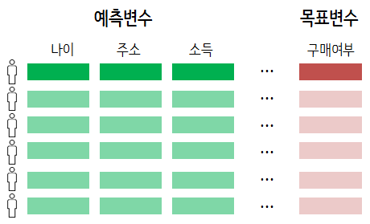
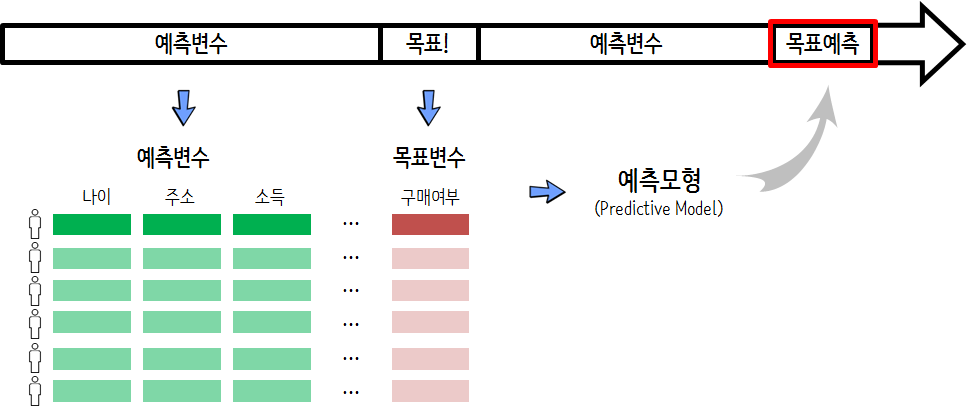

 


# 마케팅 예측 모형 [^data-mining-larose] {#fundraising-data}

[^data-mining-larose]: [Daniel T. Larose (2005), Data Mining Methods and Models, Wiley-IEEE Press](http://as.wiley.com/WileyCDA/WileyTitle/productCd-0471666564.html)

범주형 예측모형이 사업적으로 많이 활용되는 사례를 살펴보자. 
2006년 출간된 "Data Mining Methods and Models" 책에 의류회사가 직접 우편을 보내 
제품 구매를 유도하는 사례가 포함되어 있다. 
아마도, 누구나 '만원' 할인쿠폰이 들어 있는 전단지나 우편을 받아봤을 것이고, 
이것이 어떤 로직으로 돌아가는지 이해하는 것은 그 자체로 흥미로울 수 있다.

유사하게 공공목적으로 자선활동을 하는 단체도 자선행위를 통한 자금을 모으고자 유사한 프로젝트를 수행한다.

## 마케팅 예측모형 {#fundraising-predictive-model}


의류회사 제품에 관심이 있는 고객과 그렇지 못한 고객을 예측모형을 통해 점수 혹은 확률을 계산하게 되면, 
적은 고객을 접촉해도 매출이 신장되는 반면에 많은 고객을 접촉해도 예상 수익이 발생하지 못하는 경우가 종종 있다. 또한, 마케팅행사를 진행하면 고객당 적은 비용이지만 비용이 지속적으로 발생되게 된다. 
이런 관계가 최적화 문제로 변환되고, 예측모형을 통해 가장 수익이 많이 발생하는 고객을 선별해서 판정할 수 있게 된다. 


<style>
div.blue { background-color:#e6f0ff; border-radius: 5px; padding: 10px;}
</style>
<div class = "blue">

**예측모형 개발목적**: 예측모형을 통해 의류회사 제품을 구매하는 구매율 신장을 통해서 **매출증대** 와 무분별한 마케팅 자제와 쿠폰 축소를 통한 **비용절감**, 자선모금을 추진하는 단체도 동일한 효과를 기대할 수 있다.

</div>


예측모형을 개발할 경우 행과 열에 대해 적절한 작업이 필요하다. 
의류회사 할인쿠폰 반응모형의 경우 28,799 고객정보와 51개 변수가 포함된 지금으로 보면 그다지 크지 않는 데이터셋으로 구성되어 있어, 
28,799명 고객을 군집화하고, 51개 변수에 대해 적절한 차원 축소작업을 진행한다. 이러한 예측모형의 경우 반응율이 2% 심지어 0.1%도 나오지 않을 경우도 비일비재하다. 
이런 경우 과대표집, 과소표집등의 방법을 통해 불균형된 데이터에 대한 조정이 필요하다.

* 예측모형 개발전략 
    * 데이터 전처리 작업
        * 주성분 분석을 통한 예측변수 축소 &rarr; 다공선성 방지
        * 군집분석을 통한 고객 프로파일 구축  &rarr; 고객 세분화
        * 데이터 불균형 축소 &rarr; 과대표집, 과소표집
    * 예측모형 개발
        * 예측모형 적용 &rarr; 이항회귀분석부터 SVM, 신경망, 나무모형 등 예측모형 적용
    * 예측모형 평가        
        * 검증데이터를 통한 예측모형 평가
    * 예측모형 사업성
        * 예측모형 성능 기준점 설정 &rarr; 예측모형 없는 경우 사업성과
        * 예측모형에 대한 사업적 평가 

## 예측모형 사업적 함의 {#fundraising-predictive-model-biz}

예측모형에 대한 결과를 정리하면 다음과 같은 표로 요약될 수 있다.

1. 실제로 구매를 하지 않을 고객에게 예측모형이 구매를 않는 것으로 예측하면 접촉비용도 없고, 매출손실도 없음
1. 실제로 구매를 할 고객이지만, 접촉을 하지 않는 경우 예상매출 누락되어 손실, 접촉비용이 발생하지 않아 이익
1. 실제로 구매를 할 고객이지만 예측모형에서 구매를 하지 않는 것으로 예상하면 예상매출 손실이 발생
1. 예측모형에서 구매를 할 것으로 예측했지만, 실제로 구매를 하지 않을 경우 접촉비용만큼 손실 발생

|    결과      |  예측모형  |   실제  | 소요비용 | 사업적 함의 |
|:------------:|:------:|:------:|:------:|:------:|
| 참 음성(TN)   | NO      | NO    |   0원    | 접촉없음 &rarr; 매출 손실 없음 |
| 참 양성(TP)   | YES     | YES   |  -26.4원 | 예상매출 누락손실 - 접촉비용이익 |
| 거짓 음성(FN) | NO      | YES    |  +28.4원 | 예상매출 손실 |
| 거짓 양성(FP) | YES     |  NO    |  +2.0원  | 접촉비용 |

## 예측모형 성과 지표 개발 {#fundraising-predictive-model-metric}

예측모형에 대한 성과지표를 개발할 필요가 있다. "모든 고객에게 마케팅행사 할인쿠폰을 보내는 경우",
"아무에게나 마케팅행사 할인쿠폰을 보내지 않는 경우"로 구분을 하여 예측모형 성과지표로 활용한다. 즉,

|      모형          | TN (0원) | TP (-26.4원) | FN (28.4원) | FP(2원) | 총오분류율 | 총비용 | 
|:-----------------:|:------:|:------:|:------:|:------:|:------:|:------:| 
| 목표고객에만 쿠폰 발송  |   5908 |   0    |  1151  |   0    | 16.3%  | 32,688원(고객당 +4.63원) |
| 모든 고객에게 쿠폰 발송 |    0   |  1151  |   0    |  5908  | 83.7%  | -18,570(고객당 -2.63원) |

목표고객에만 쿠폰을 발송할 경우 오분류율이 16.3%로 고객당 4.63원 손실이 발생한다.
반면에 모든 고객에게 쿠폰을 발송하는 경우 오분류율이 크지만, 궁극적으로 고객당 2.63원 이익이 된다.


# 예측모형 개발 {#analytic-model-process}

기부단체에서 소아암 등 자선활동을 위한 자금을 모집하고자 한다.
기부단체는 최근 데이터과학자를 고용하여 데이터베이스 마케팅을 추진하고자 한다고 가정하다. 
기부단체에서 확보하고 있는 명단 1,000 명 있고, 이중 10% 가량의 분들이 기부를 하셨다.

기부단체에서는 자선활동을 원활히 수행하기 위한 최대한 많은 자금을 모집하는 것이 목적이다.
우선 자금 모집을 위해서 우편을 보내던가 콜센터를 통해 전화를 해야 되는데 명단에 있는 모든 분에게 연락을 취한다면 물론 더 소요될 수도 있지만 인당 1,000원을 가정하면 $1,000 \times 1,000 = 1,000,000$원 비용이 발생된다.

경우에 따라서는 마케팅 비용이 높아 전체 집행이 어려운 경우 접촉해야 되는 분들을 취사선택해야하는데 이런 경우 예측모형이 훌륭한 대안이 될 수 있다.

## 예측모형 자료구조 {#analytic-model-process-data-structure}

예측모형 자료구조(Analytic basetable)는 행과 열로 구성된 데이터프레임 자료구조를 갖추고 있다.
행은 모집단으로 기부단체의 경우 기부명단에 올라온 사람들이 된다.
행은 기부명단 사람의 인적사항과 관련된 기부이력 등이 포함된다.
다른 데이터분서과 분명히 차이가 나는 것은 **목표(Target)**가 있다는 점이다.
연속형일 수도 있지만, 목표가 있었는지 없었는지에 대한 사항이 기록된다. 즉, 0/1, 기부/비기부 등으로 인코딩된다.



축적된 데이터를 기반으로 예측모형 자료구조(Analytic basetable)를 만들고 이를 함수 형태로 구현한 것이 예측모형(Predictive Model)이 되서 목표예측에 사용한다.




## 자선모금 데이터 {#analytic-model-process-data-structure-fund}

자선모금 데이터를 가져와서 `glm()` 함수에 `family="binomial"`을 넣어 로지스틱 회귀모형을 개발한다. 그리고 변수선정을 통해서 나름 최적 모형을 도출해서 유의성을 갖는 변수와 회귀계수를 통해 유의성의 강도를 확인한다.


```r
> ## 환경설정 -----
> library(tidyverse)
> 
> ## 데이터 가져오기
> dat <- read_delim("data/fundraising.txt", delim=" ")
```

```
Error: 'data/fundraising.txt' does not exist in current working directory ('/Users/statkclee/swc/ml').
```

```r
> ## 데이터 정제
> df <- dat %>% 
+     filter(complete.cases(.)) %>% 
+     select(-no)
```

```
Error in eval(lhs, parent, parent): 객체 'dat'를 찾을 수 없습니다
```

```r
>     # mutate(donated = factor(donated))
> 
> ## 예측모형 적합
> df_glm <- glm(donated ~ ., data=df, family="binomial")
```

```
Error in terms.formula(formula, data = data): 'data' 인자의 유형이 잘못되었습니다
```

```r
> ## 예측모형 변수선정
> # df_best_glm <- MASS::stepAIC(df_glm,  trace = FALSE)
> df_best_glm <- glm(donated ~ has_children + wealth_rating + pet_owner + 
+     frequency + money, data=df, family="binomial")
```

```
Error in terms.formula(formula, data = data): 'data' 인자의 유형이 잘못되었습니다
```

```r
> ## 예측모형 회귀계수
> broom::tidy(df_best_glm)
```

```
Error in broom::tidy(df_best_glm): 객체 'df_best_glm'를 찾을 수 없습니다
```


## 예측모형 성능 {#analytic-model-process-pm-performance}

예측모형의 성능을 파악하기 위해서 앞서 기부예측에 유의적으로 식별된 변수와 기부여부, 기부예측확률로 구성된 데이터프레임을 생성한다.
누적 이득 그래프(Cumulative Gains Chart) 생성을 위해서 `caret` 팩키지 `lift()` 함수를 사용하고 이를 `ggplot`으로 파이프 연결하여 시각화한다.


```r
> library(broom)
> library(extrafont)
> loadfonts()
> 
> ## Cumulative gain 그래프를 위한 데이터 준비
> 
> pred_df <- df %>% 
+     mutate(prob = predict(df_best_glm, newdata=df, type="response") ) %>% 
+     select(donated, prob, has_children, wealth_rating, pet_owner, frequency, money) %>% 
+     mutate(donated= factor(donated, levels = c(0,1)))
```

```
Error in UseMethod("mutate_"): 클래스 "function"의 객체에 적용된 'mutate_'에 사용할수 있는 메소드가 없습니다
```

```r
> # pred_df <- augment(df_best_glm, df, type.predict = "response") #.fitted
> 
> ## caret `lift`
> 
> df_lift <- caret::lift(donated ~ prob, data=pred_df, class=1, values = 50)
```

```
Error in loadNamespace(name): there is no package called 'caret'
```

```r
> ## 참조선
> lines1 <- data.frame(x1 = 0, x2 = 100, y1 = 0, y2 = 100)
> lines2 <- data.frame(x1 = 0, x2 = df_lift$pct, y1 = 0, y2 = 100)
```

```
Error in data.frame(x1 = 0, x2 = df_lift$pct, y1 = 0, y2 = 100): 객체 'df_lift'를 찾을 수 없습니다
```

```r
> lines3 <- data.frame(x1 = df_lift$pct, x2 = 100, y1 = 100, y2 = 100)
```

```
Error in data.frame(x1 = df_lift$pct, x2 = 100, y1 = 100, y2 = 100): 객체 'df_lift'를 찾을 수 없습니다
```

```r
> ## 시각화
> ggplot(data=df_lift$data) +
+   geom_segment(data = lines1,
+                aes(x = x1, y = y1, xend = x2, yend = y2),
+                alpha = .5, lty = 1) +
+   geom_segment(data = lines2,
+                aes(x = x1, y = y1, xend = x2, yend = y2),
+                alpha = .5, lty = 2) +
+   geom_segment(data = lines3,
+                aes(x = x1, y = y1, xend = x2, yend = y2),
+                alpha = .5, lty = 2) +
+   geom_line(aes(x = CumTestedPct, y = CumEventPct, col = liftModelVar)) +
+     theme_bw(base_family = "NanumGothic") +
+     labs(x="표본시도 백분율(%)", y="목표 획득 점유율(%)") +
+     theme(legend.position = "none") +
+   geom_vline(xintercept = df %>% summarise(mean(donated)*100) %>% pull, color="blue", linetype=3) +
+     scale_x_continuous(breaks = seq(0, 100, by = 10)) +
+     scale_y_continuous(breaks = seq(0, 100, by = 10)) +
+     geom_point(aes(x = CumTestedPct, y = CumEventPct, col = liftModelVar))
```

```
Error in ggplot(data = df_lift$data): 객체 'df_lift'를 찾을 수 없습니다
```

리프트(lift) 그래프 생성을 동일하게 수행할 수 있다.


```r
> ggplot(df_lift$data) +
+     geom_line(aes(x = 1:nrow(df_lift$data), y = lift), color = "red")  +
+     geom_point(aes(x = 1:nrow(df_lift$data), y = lift), color = "red") +
+     scale_x_continuous(breaks = seq(0, 100, by = 5)) +
+     geom_hline(yintercept = 1) +
+     scale_y_continuous(limits=c(1, 2)) +
+     theme_bw(base_family = "NanumGothic") +
+     labs(x="표본시도 백분율(%)", y="리프트(Lift)")
```

```
Error in ggplot(df_lift$data): 객체 'df_lift'를 찾을 수 없습니다
```

## 예측변수 인사이트 그래프 {#analytic-model-process-pm-pig}

예측모형에 대한 전반적인 성능을 누적 이득 그래프(cumulative gains chart)와 리프트 그래프(lift graph)를 통해서 확인했으면 다음으로 예측변수를 PIG(predictor insight graph)를 통해 시각화하고 테이블 표를 통해 확인하는 것이다.

### 기부빈도와 반응율 {#analytic-model-process-pm-pig-one}

먼저 기부빈도에 따른 기부 대상숫자와 반응율을 한장의 그래프로 도식화한다. 


```r
> library(ggplot2)
> pred_df %>% 
+     mutate(donated_num = as.integer(donated)-1L) %>% 
+     group_by(frequency) %>% 
+     summarise(size = n(),
+               incidence = mean(donated_num)) %>% 
+     ggplot(aes(x=frequency, y=size)) +
+       geom_col(width = 0.3) +
+       geom_line(aes(x=frequency, y = incidence * 1000000, group=1), size=1, color="red") +
+       geom_point(aes(x=frequency, y = incidence * 1000000, group=1), size=2, color="red")+
+       scale_y_continuous(sec.axis = sec_axis( ~. /1000000, name = "반응율"),
+                          labels = scales::comma) +
+       labs(x="기부빈도", y="기부 대상숫자") +
+       theme_bw(base_family = "NanumGothic") 
```

```
Error in eval(lhs, parent, parent): 객체 'pred_df'를 찾을 수 없습니다
```

```r
> pred_df %>% 
+     mutate(donated_num = as.integer(donated)-1L) %>% 
+     group_by(frequency) %>% 
+     summarise(size = n(),
+               incidence = mean(donated_num)) %>% 
+     DT::datatable() %>% 
+     DT::formatRound("size", digits=0) %>% 
+     DT::formatPercentage("incidence", digits=1)
```

```
Error in eval(lhs, parent, parent): 객체 'pred_df'를 찾을 수 없습니다
```

### 각 변수별 반응율과 그래프 {#analytic-model-process-pm-pig-function}

먼저 기부빈도에 따른 기부 대상숫자와 반응율을 한장의 그래프로 도식화했다면, 나머지 모든 변수에 대해서 동일한 작업을 수행하도록 함수를 작성한다.


```r
> draw_pig <- function(variable) {
+     
+     # 변수명 변환
+     var_name <- enquo(variable)
+     
+     # 변수별 요약 통계량
+     tmp_df <- pred_df %>% 
+         mutate(donated_num = as.integer(donated)-1L) %>% 
+         group_by(!!var_name) %>% 
+         summarise(size = n(),
+                   incidence = mean(donated_num)) %>% 
+         ungroup()
+     
+     # 변수별 출력 요약표
+     DT_obj <- tmp_df %>% 
+         DT::datatable() %>% 
+         DT::formatRound("size", digits=0) %>% 
+         DT::formatPercentage("incidence", digits=1)
+     
+     # 변수별 출력 시각화
+     graph_obj <- tmp_df %>% 
+         ggplot(aes(x=!!var_name, y=size)) +
+           geom_bar(width = 0.3, stat ="identity") +
+           labs(y="기부 대상숫자") +
+           geom_line(aes(x=!!var_name, y = incidence * 1000000, group=1), size=1, color="red") +
+           geom_point(aes(x=!!var_name, y = incidence * 1000000, group=1), size=2, color="red")+
+  scale_y_continuous(sec.axis = sec_axis( ~. /1000000, name = "반응율"), labels = scales::comma) +
+           theme_bw(base_family = "NanumGothic") 
+ 
+     pig_list <- list(tbl = DT_obj, graph = graph_obj)
+     
+     return(pig_list)
+ }
> 
> money_list <- draw_pig(money)
```

```
Error in eval(lhs, parent, parent): 객체 'pred_df'를 찾을 수 없습니다
```

```r
> money_list$tbl
```

```
Error in eval(expr, envir, enclos): 객체 'money_list'를 찾을 수 없습니다
```

```r
> money_list$graph
```

```
Error in eval(expr, envir, enclos): 객체 'money_list'를 찾을 수 없습니다
```


### 전체 변수별 반응율과 그래프 {#analytic-model-process-pm-pig-all}

변수를 넣어 각 변수별 반응율표와 그래프로 시각화 및 요약을 했다면 모든 변수에 대해서 이를 확대해보자.


```r
> pred_varname <- pred_df %>% colnames() %>% setdiff(c("donated", "prob"))
> 
> fund_pm_pig <- list()
> 
> for(i in seq_along(pred_varname)) {
+     cat(i, ":", pred_varname[i], "\n")
+     cat(i, ":", eval(expr(sym(pred_varname[i]))), "\n")
+     fund_pm_pig[[i]] <- draw_pig(eval(expr(sym(pred_varname[i]))))
+ }
> 
> fund_pm_pig[[1]]
```


### 홍보 극대화 {#analytic-model-process-pm-pig-optim}

데이터베이스 기부고객 명단에 마케팅활동을 취할 경우 15만큼의 비용이 발생되고,
만약 기부성공으로 연결될 경우 평균 150만큼 매출이 발생된다면 이를 바탕으로 수익을 산출해 낼 수 있다. 
수익이 극대화되는 지점을 산정하여 이를 시각화하고 해당 지표를 산출한다.


```r
> max_profit_v <- df_lift$data %>% 
+     mutate(cost = n * 15,
+            revenue = events * 300,
+            profit = revenue - cost) %>% 
+     summarise(max_profit = max(profit)) %>% 
+     pull()
```

```
Error in eval(lhs, parent, parent): 객체 'df_lift'를 찾을 수 없습니다
```

```r
> df_lift$data %>% 
+     tbl_df %>% 
+     select(-liftModelVar, -Sn, -Sp) %>% 
+     mutate(cost = n * 15,
+            revenue = events * 300,
+            profit = revenue - cost) %>% 
+     ggplot(aes(x=cost, y=profit)) +
+       geom_point() +
+       geom_line() +
+       theme_bw(base_family = "NanumGothic")  +
+       scale_x_continuous(labels = scales::comma, breaks = seq(0,1200000, 100000)) +
+       scale_y_continuous(labels = scales::comma) +
+       geom_hline(yintercept = max_profit_v, color="blue")
```

```
Error in eval(lhs, parent, parent): 객체 'df_lift'를 찾을 수 없습니다
```

```r
> df_lift$data %>% 
+     mutate(cost = n * 15,
+            revenue = events * 300,
+            profit = revenue - cost) %>% 
+     filter(between(profit, max_profit_v-100, max_profit_v+100)) %>% 
+     select(-liftModelVar, -Sn, -Sp) %>% 
+     DT::datatable() %>% 
+     DT::formatRound(c("events", "n", "cost", "revenue", "profit"), digits=0) %>% 
+     DT::formatRound(c("EventPct", "CumEventPct", "lift", "CumTestedPct"), digits=1) %>% 
+     DT::formatRound(c("cuts"), digits=3)
```

```
Error in eval(lhs, parent, parent): 객체 'df_lift'를 찾을 수 없습니다
```
