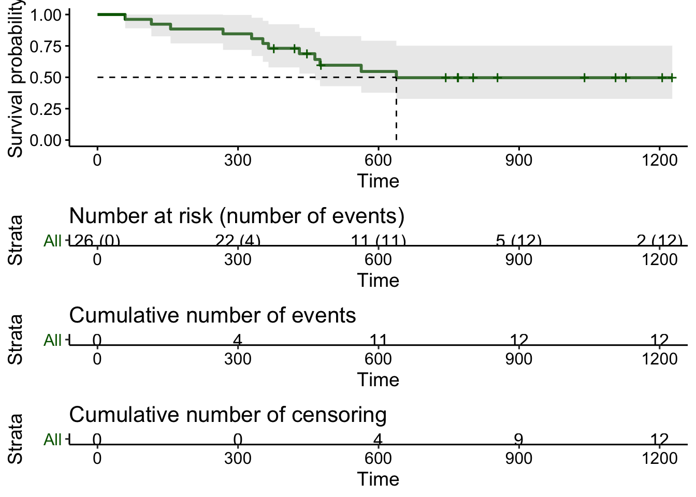
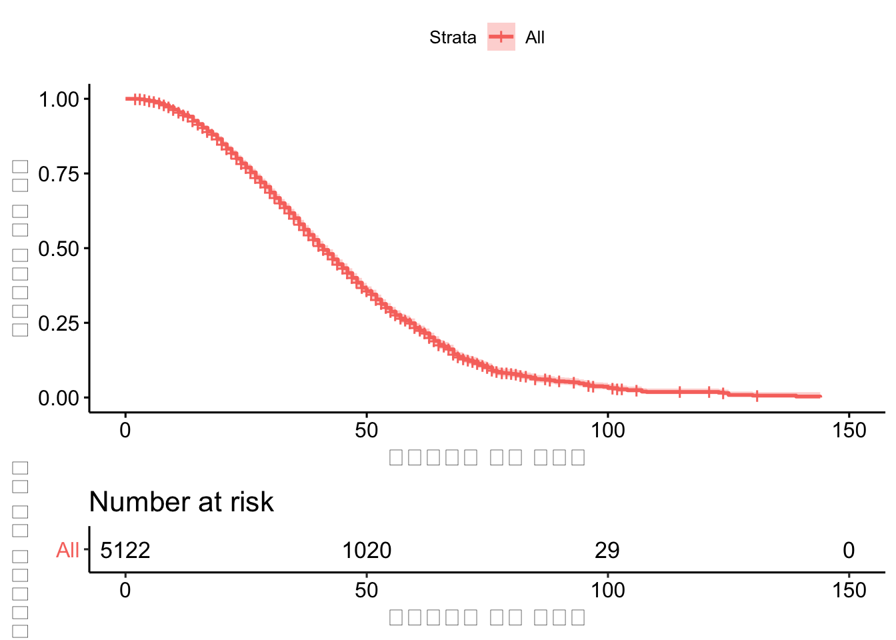
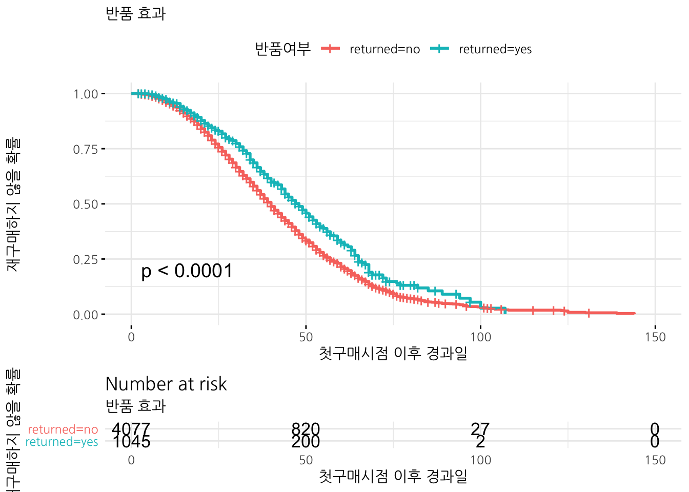
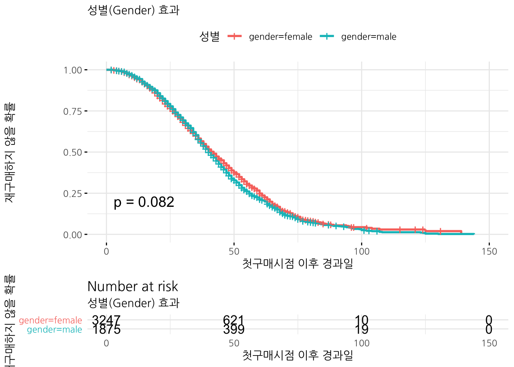

 

# 생존분석 개요 {#survival-overview}

[생존분석(Survival analysis)](https://ko.wikipedia.org/wiki/생존분석)은 통계학의 한 분야로, 
어떠한 현상이 발생하기까지에 걸리는 시간(time-to-event)에 대해 분석한다.

**중도절단(censoring)**은 데이터의 측정값이나 관찰치가 부분적으로만 알려진 상태로 생존 분석에서 손실된 데이터를 처리하는 방법이다. 
이상적으로는 표본의 생일과 사망일을 통해 생존 기간을 파악하는 것이 좋지만, 그렇지 못한 경우에 중도절단을 사용한다.
중도절단 자료가 필연적으로 발생되는 이유는 환자 거부로 인한 중도탈락, 연락두절로 인한 추적조사 불가, 사망/고장 발생 전 연구 종결 혹은 다른 원인으로 인한 사망/고장을 들 수 있다.
추적이 불가능(이사, 연락처 소실)

생존분석의 주된 관심사는 생존함수(survival function, $S(t)$)로 다음과 같이 정의한다.
시간은 항상 양수이고, 중도절단이 항상 대두되는 데이터 특성을 갖는다는 점에서 차이가 난다.

$$S(t) = 1-F(t) =\Pr(T > t)$$

생존함수는 특정한 시간 $t$ 보다 오래 생존할 확률로 $t$ 는 특정 시간, 
$T$ 는 사망에 이르는 시점을 나타내는 확률변수로 정의되며, $\Pr$은 확률함수가 된다.
특이한 점은 $$1-F(t)$$로 1에서 누적함수($F(t)$)를 뺀 것과 동일한데 항상 중도절단을 반영하게 되는 경우 차이점이 발생된다.

## 생존분석 질문 {#survival-question}

데이터에 생존분석을 통해 모형을 갖추게 되면 다음 질문에 답을 할 수 있다.

- 혈액암 진단을 받은 환자가 3년이상 생존할 확률은 얼마나 되나? 
    - 생존확률 $S(t)$.
- 택시를 잡기까지 얼마 시간을 기다려야 되는가?
    - 중위수 $t$ 시간.
- 구직자가 100명 있는데, 1년 후 얼마나 많은 사람이 직장을 구하나?
    - $100 \times S(t)$ 명.
    

## 생존분석 응용분야 [^application-of-survival] {#survival-application}

[^application-of-survival]: [Is survival analysis the right model for you?](https://www.analyticsvidhya.com/blog/2014/04/survival-analysis-model-you/)

생존분석 응용분야는 다음는 의학에서 많이 사용되지만 동일한 기법을 마케팅, 공학(신뢰성)에도 사용이 가능하다.

- 사업계획 수립 : 이탈하지 않고 잔존기간이 긴 고객의 특성을 파악하여 전략 수립
- LTV(Lifetime Value) 예측: LTV 가치에 맞춰 고객 대응
- 유효 고객 : 고객이 특정 시점까지 유효할지 예측
- 캠페인 평가 : 고객 이탈율(생존률)에 따라 캠페인 효과 모니터링
- 산업별 생존분석
    - 소매업: 신선식품구매고객이 비신선식품 구매까지 소요되는 시간
    - 제조업: 기계부품 수명(lifetime)
    - 공공: 사회적 중요사건이 발생할 때까지 걸리는 시간
    - 카탈로그 우편주문: 다음 주문까지 걸리는 시간
    - 주택모기지: 주택 모기지 상환까지 걸리는 시간
    - 보험: 보험증권권리 소멸에 걸리는 시간

## 생존분석 도구상자 {#survival-toolbox}

- 생존시간 기술
    - 생명표(Life tables)
    - 캐플란-마이어 곡선(Kaplan-Meier curves)
    - 생존함수(Survival function)
    - 위험함수(Hazard function)
- 두집단 이상 생존시간 비교     
    - 로그 순위검정(Log-rank test)
- 생존시간에 대한 연속형, 범주형 변수의 효과를 기술
    - Cox 비례위험 회귀모형 (Cox proportional hazards regression model)
    - 모수 생존모형(Parametric survival models)
    - 생존 나무모형(Survival trees)
    - 생존 확률숲(Survival random forests)

## 생존분석 R 팩키지 {#survival-toolbox-r-package}

[CRAN Task View: Survival Analysis](https://cran.r-project.org/web/views/Survival.html)에서 앞선 다양한 생존분석관련 프로젝트 관련 사항을 실시간으로 확인할 수 있다.

- [`survival`](https://cran.r-project.org/web/packages/survival/index.html): 기본 생존분석 도구 모음
- `survminer`: 생존분석 특화된 시각화 도구
- `raprt`, `partykit`: 생존 나무모형(Survival trees) [^survival-tree]
- `ranger`: 생존 확률숲(Survival random forests) [^rview-ranger] [^amunategui-survival]

[^survival-tree]: [stackoverflow, "Using a survival tree from the 'rpart' package in R to predict new observations"](https://stackoverflow.com/questions/30700627/using-a-survival-tree-from-the-rpart-package-in-r-to-predict-new-observations)

[^rview-ranger]: [Joseph Rickert(), "Survival Analysis with R" R Views](https://rviews.rstudio.com/2017/09/25/survival-analysis-with-r/)

[^amunategui-survival]: [http://amunategui.github.io, "Survival Ensembles: Survival Plus Classification for Improved Time-Based Predictions in R"](http://amunategui.github.io/survival-ensembles/index.html)

# 생존 분석 사례 [^data-camp-survival] {#survival-analysis-example}

[^data-camp-survival]: [DataCamp, Survival Analysis in R For Beginners](https://www.datacamp.com/community/tutorials/survival-analysis-R)

## 데이터 {#survival-analysis-example-data}

`ovarian`(난소) 관련 질병으로 인한 생존시간을 살펴본다. 
`survival` 팩키지에 포함된 데이터셋으로 "Survival in a randomised trial comparing two treatments for ovarian cancer" 난소암에 대한 두가지 처방을 비교하여 생존시간에 대한 차이에 대한 정보를 담고 있다.

데이터를 가져와서 필요한 데이터 정제작업을 수행한다.

~~~{.r}
# 0. 환경설정 -----
library(tidyverse)
library(survival)
library(survminer)
library(janitor)
library(extrafont)
loadfonts()

# 1. 데이터 -----
data(ovarian)

# 2. 데이터 전처리 -----
ovarian <- ovarian %>% 
  tbl_df %>% 
  mutate(rx = factor(rx, levels = c("1", "2"), labels = c("A", "B")),
         resid.ds = factor(resid.ds, levels = c("1", "2"), labels = c("no", "yes")),
         ecog.ps = factor(ecog.ps, levels = c("1", "2"), labels = c("good", "bad"))) %>% 
  mutate(age_group = ifelse(age >=50, "old", "young") %>% as.factor)

DT::datatable(ovarian)
~~~

<!--html_preserve-->

<!--/html_preserve-->

## 단변량 분석 - Kaplan-Meier 추정 {#survival-analysis-example-univariate}

이론에서 나온 생존확률($S(t)$)를 계산하기 위해서 Kaplan-Meier 추정값을 사용한다.

- 이론: $S(t) = 1-F(t) =\Pr(T > t)$
- 추정: $\hat{S}(t) = \prod\limits_{i; t_i < t} \frac{n_i - d_i}{n_i}$

여기서, $n_i$는 해당 시점($i$) 관측점수가 되고 $d_i$는 해당 시점($i$) 사건발생 건수가 된다.

[Kaplan-Meier Survival Estimates](https://www.statsdirect.com/help/survival_analysis/kaplan_meier.htm)에 나온 데이터를 바탕으로 캐플란-마이어 추정작업을 수행한다.

## 단변량 분석 {#survival-analysis-example-univariate-real-data}

단변량, 다변량 분석에 들어가기 전에 우선 생존분석 객체(`Surv()`)를 생성한다.
그후 `rx`, `resid.ds`... 변수를 생존시간에 대한 차이를 분석하는데 동원하다.
`ggsurvplot()` 시각화 함수에 `surv.median.line = "hv"` 인자를 넣어 50% 생존율을 갖는 경우 생존시간을 구하거나, 반대 얼마동안 생존해야 50% 생존율을 갖는지 시각화를 통해 쉽게 파악할 수 있고, 아울러 아래 `risk.table` 및 관련 인자를 넣어 누적 이벤트 혹은 누적 중도절단 건수도 파악할 수 있다.

~~~{.r}
# 3. 예측모형 -----
## 3.0. 생존모형 객체 -----
surv_object <- Surv(time = ovarian$futime, event = ovarian$fustat)

## 3.1. Kaplan-Meier -----
# ovarian_km <- survfit(surv_object ~ 1)
ovarian_km <- survfit(Surv(time=futime, event=fustat) ~ 1, data = ovarian)

ggsurvplot(ovarian_km, 
           conf.int = TRUE,
           palette = "darkgreen",
           risk.table = "nrisk_cumevents",
           cumevents = TRUE,
           cumcensor = TRUE,
           linetype = 1,
           tables.height = 0.2,
           surv.median.line = "hv",
           legend = "none")
~~~

집단간의 차이를 검정하는 `survfit()` 함수를 통해 log rank 검정을 수행한다.
그리고 `ggsurvplot()` 함수 `pval = TRUE` 인자를 넣게 되면 집단간 생존시간 차이에 대한 
통계검정 p-값도 산출해 준다.

~~~{.r}
# 3. 예측모형 -----

## 3.2. 생존모형: 단변량 -----
### log rank 검정(rx)
km_rx_survfit <- survfit(surv_object ~ rx, data = ovarian)

summary(km_rx_survfit)
~~~

~~~{.output}
Call: survfit(formula = surv_object ~ rx, data = ovarian)

                rx=A 
 time n.risk n.event survival std.err lower 95% CI upper 95% CI
   59     13       1    0.923  0.0739        0.789        1.000
  115     12       1    0.846  0.1001        0.671        1.000
  156     11       1    0.769  0.1169        0.571        1.000
  268     10       1    0.692  0.1280        0.482        0.995
  329      9       1    0.615  0.1349        0.400        0.946
  431      8       1    0.538  0.1383        0.326        0.891
  638      5       1    0.431  0.1467        0.221        0.840

                rx=B 
 time n.risk n.event survival std.err lower 95% CI upper 95% CI
  353     13       1    0.923  0.0739        0.789        1.000
  365     12       1    0.846  0.1001        0.671        1.000
  464      9       1    0.752  0.1256        0.542        1.000
  475      8       1    0.658  0.1407        0.433        1.000
  563      7       1    0.564  0.1488        0.336        0.946

~~~

~~~{.r}
ggsurvplot(km_rx_survfit, data = ovarian, pval = TRUE)
~~~

~~~{.r}
### log rank 검정(resid.ds)
km_resid_survfit <- survfit(surv_object ~ resid.ds, data = ovarian)

summary(km_resid_survfit)
~~~

~~~{.output}
Call: survfit(formula = surv_object ~ resid.ds, data = ovarian)

                resid.ds=no 
 time n.risk n.event survival std.err lower 95% CI upper 95% CI
  353     11       1    0.909  0.0867        0.754            1
  563      8       1    0.795  0.1306        0.577            1
  638      7       1    0.682  0.1536        0.438            1

                resid.ds=yes 
 time n.risk n.event survival std.err lower 95% CI upper 95% CI
   59     15       1    0.933  0.0644        0.815        1.000
  115     14       1    0.867  0.0878        0.711        1.000
  156     13       1    0.800  0.1033        0.621        1.000
  268     12       1    0.733  0.1142        0.540        0.995
  329     11       1    0.667  0.1217        0.466        0.953
  365     10       1    0.600  0.1265        0.397        0.907
  431      8       1    0.525  0.1310        0.322        0.856
  464      7       1    0.450  0.1321        0.253        0.800
  475      6       1    0.375  0.1296        0.190        0.738

~~~

~~~{.r}
ggsurvplot(km_resid_survfit, data = ovarian, pval = TRUE)
~~~

## 단변량 생존모형 - 와이블  {#survival-analysis-weibull-model}

Kaplan-Meier 모형을 시각화하면 계단모양으로 나타나는데 이를 부드러운 함수로 근사하고자 할 경우 와이블(weibull) 모형을 활용하면 좋다. `survfit()` 함수 대신에 `survreg()` 함수를 사용하면 기본 분포로 와이블이 지정되어 별도 `dist=`로 명시할 필요는 없다.

와이블 분포를 가정하고 생존확률 모형을 구축할 경우 `predict` 함수로 중위수 50% 생존확률과 90% 사람이 생존할 확률, 즉 10% 사망확률을 다음과 같이 계산한다.

~~~{.r}
weibull_survfit <- survreg(Surv(time=futime, event=fustat) ~ 1, data = ovarian, dist="weibull")

predict(weibull_survfit, type="quantile", p=1-0.5, newdata = data.frame(1))
~~~

~~~{.output}
       1 
880.3047 

~~~

~~~{.r}
predict(weibull_survfit, type="quantile", p=1-0.9, newdata = data.frame(1))
~~~

~~~{.output}
      1 
160.795 

~~~

### 단변량 생존모형 시각화 - 와이블  {#survival-analysis-weibull-model-viz}

생존확률을 시각화할 경우 별도 데이터프레임을 제작해야 한다.
생존확률 숫자순열을 생성하고 나서 이를 `weibull_survfit` 모형 예측값으로 넣어 예상 생존시간을 산출해낸다. 그리고 나서 이를 데이터 프레임으로 만들고 `ggsurvplot_df`에 넣어 시각화한다.

~~~{.r}
surv_prob <- seq(.99, .01, by = -.01)

surv_time <- predict(weibull_survfit, type = "quantile", p = 1 - surv_prob, newdata = data.frame(1))

surv_weibull_df <- tibble(time = surv_time, 
                          surv = surv_prob, 
                          upper = NA, 
                          lower = NA, 
                          std.err = NA) %>% as.data.frame()

ggsurvplot_df(fit = surv_weibull_df, surv.geom = geom_line)
~~~

## 다변량 분석 {#survival-analysis-example-multivariate}

각각의 변수에 대해서 일일이 생존시간의 차이를 분석하는 대신에 
`coxph()` 함수로 회귀모형을 작성해서 모형을 구축하고 중요한 변수를 식별할 수 있다.

특히, `step()` 함수로 변수선정도 가능해서 최종 보형을 `ecog.ps`가 제거된 모형이고 
콕스 모형이 가정한 사항이 맞는지를 `cox.zph()` 함수로 검정하고 모형에 대한 이해를 위해서 
`ggforest()` 함수로 1을 기준으로 생존에 긍정 혹은 부정 영향을 미치는 변수에 대한 영향도를 
시각적으로 확인한다.

~~~{.r}
## 3.3. 생존모형: 다변량 -----
### 변수선택
coxph_full <- coxph(surv_object ~ rx + resid.ds + age_group + ecog.ps, 
                   data = ovarian)

coxph_step <- step(coxph_full, direction = "both", trace = 0)

### 최종모형
coxph_survfit <- coxph(surv_object ~ rx + resid.ds + age_group, data = ovarian)

### 가설검정
cox.zph(coxph_survfit)
~~~

~~~{.output}
                  rho chisq     p
rxB             0.269 0.744 0.388
resid.dsyes    -0.415 1.550 0.213
age_groupyoung -0.226 0.660 0.417
GLOBAL             NA 3.150 0.369

~~~

~~~{.r}
par(mfrow=c(2,2))
plot(cox.zph(coxph_survfit))

### 모형 시각화
ggforest(coxph_survfit, data = ovarian)
~~~

# 재구매 사례분석 [^survival-sthda] {#survival-analysis-bought-again}

[^survival-sthda]: [STHDA: Statistical tools for high-throughput data analysis - "Cox Proportional-Hazards Model"](http://www.sthda.com/english/wiki/cox-proportional-hazards-model)

## 데이터 가져오기 {#survival-analysis-bought-again-import}

재구매 여부와 첫번째 구매 이후 경과 시간을 담은 데이터를 가져온다.

~~~{.r}
# 1. 탐색적 데이터 분석 -----

order_df  <- read_csv("data/next_order_clean.csv") %>%
    mutate_if(is.character, as.factor)

# 2. 탐색적 데이터 분석 -----
# 생략
~~~

## 재구매 확률 시각화 {#survival-analysis-bought-again-viz}

재구매 하지 않을 확률 전체를 시각화한다.

~~~{.r}
# 3. 생존분석 모형 -----
## 3.0. 생존객체 생성 
order_surv <- Surv(order_df$days, order_df$buy_again)

## 3.1. 단변량 분석
### 3.1.1. 전체 생존확률 -----
km_fit <- survfit(order_surv ~ 1, data = order_df)

ggsurvplot(km_fit, data = order_df, risk.table = TRUE,
           theme=theme_minimal(base_family="NanumGothic")) +
    labs(x="첫구매시점 이후 경과일", y="재구매하지 않은 확률")
~~~

## 단변량 분석 {#survival-analysis-bought-again-univariate}

변수가 많지는 않지만, 반품여부, 쿠폰 활용여부, 성별, 첫번째 구매시 구매총합을 대상으로 각각의
Kaplan-Meier 생존분석을 돌려 유의성 검증을 수행한다.

~~~{.r}
### 3.1.2. 유의적인 단변량 변수 -----
#### 변수명 선정
order_varname_v <- order_df %>% names %>% dput
~~~

~~~{.output}
c("days", "cart_value", "gender", "voucher", "returned", "buy_again"
)

~~~

~~~{.r}
order_covariates_v <- setdiff(order_varname_v, c("days", "buy_again"))

#### 단변량변수 생존분석 모형 적합
univ_formulas <- map(order_covariates_v,
                        function(x) as.formula(paste('Surv(days, buy_again) ~ ', x)))

univ_models <- map( univ_formulas, function(x){coxph(x, data = order_df)})

# Extract data 
univ_results <- map(univ_models,
                       function(x){ 
                           x <- summary(x)
                           p.value<-signif(x$wald["pvalue"], digits=2)
                           wald.test<-signif(x$wald["test"], digits=2)
                           beta<-signif(x$coef[1], digits=2);#coeficient beta
                           HR <-signif(x$coef[2], digits=2);#exp(beta)
                           HR.confint.lower <- signif(x$conf.int[,"lower .95"], 2)
                           HR.confint.upper <- signif(x$conf.int[,"upper .95"],2)
                           HR <- paste0(HR, " (", 
                                        HR.confint.lower, "-", HR.confint.upper, ")")
                           res<-c(beta, HR, wald.test, p.value)
                           names(res)<-c("beta", "HR (95% CI for HR)", "wald.test", 
                                         "p.value")
                           return(res)
                           #return(exp(cbind(coef(x),confint(x))))
                       })

univ_res_df <- t(as.data.frame(univ_results, check.names = FALSE)) %>% tbl_df

univ_res_df %>% 
    bind_cols(var_name = order_covariates_v) %>% 
    select(var_name, everything()) %>% 
    DT::datatable()
~~~

<!--html_preserve-->

<!--/html_preserve-->

## 단변량 분석 시각화 {#survival-analysis-bought-again-univariate-viz}

앞서 분석한 단변량 분석을 통해 유의적으로 판정된 변수를 대상으로 시각화작업을 수행한다.

~~~{.r}
### 3.1.2. 단변량 변수: 바우처 -----
km_voucher_fit <- survfit(order_surv ~ voucher, data = order_df)

ggsurvplot(km_voucher_fit, data = order_df, pval=TRUE, risk.table = TRUE,
           ggtheme=theme_minimal(base_family="NanumGothic")) +
    labs(x="첫구매시점 이후 경과일", y="재구매하지 않을 확률", 
         title="바우처 효과", color = "바우처 지급여부")
~~~

~~~{.r}
### 3.1.3. 단변량 변수: 반품 -----
km_return_fit <- survfit(order_surv ~ returned, data = order_df)

ggsurvplot(km_return_fit, data = order_df, pval=TRUE, risk.table = TRUE,
           ggtheme = theme_minimal(base_family="NanumGothic")) +
    labs(x="첫구매시점 이후 경과일", y="재구매하지 않을 확률", 
         subtitle="반품 효과", color="반품여부")
~~~

~~~{.r}
### 3.1.4. 단변량 변수: 성별 -----
km_gender_fit <- survfit(order_surv ~ gender, data = order_df)

ggsurvplot(km_gender_fit, data = order_df, pval=TRUE, risk.table = TRUE,
           ggtheme = theme_minimal(base_family="NanumGothic")) +
    labs(x="첫구매시점 이후 경과일", y="재구매하지 않을 확률", 
         subtitle="성별(Gender) 효과", color="성별")
~~~

## 다변량 분석 시각화 {#survival-analysis-bought-again-multivariate}

모든 변수를 한번에 넣어 다변량 분석을 수행하고 변수선택과정을 통해 절약의 법칙(Principle of Parsimony)을 충족시킨다.
그리고 `cox.zph()` 함수로 콕스 비례위험모형의 가정사항을 점검하고 
`ggforest()` 함수로 각 변수가 재구매에 미치는 영향도를 살펴본다.

~~~{.r}
## 3.2. 다변량 분석 -----
### 3.2.1. 변수선택
order_cph_full <- coxph(order_surv ~ cart_value  + voucher + returned + gender, data = order_df)

(coxph_step <- step(order_cph_full, direction = "both", trace = 0))
~~~

~~~{.output}
Call:
coxph(formula = order_surv ~ cart_value + voucher + returned + 
    gender, data = order_df)

                 coef exp(coef)  se(coef)     z       p
cart_value  -0.002164  0.997839  0.000284 -7.62 2.6e-14
voucheryes  -0.294615  0.744819  0.047969 -6.14 8.2e-10
returnedyes -0.314829  0.729914  0.049470 -6.36 2.0e-10
gendermale   0.108264  1.114341  0.036323  2.98  0.0029

Likelihood ratio test=155.7  on 4 df, p=<2e-16
n= 5122, number of events= 3199 

~~~

~~~{.r}
### 3.2.2. 최종모형
order_cph_fit <- coxph(order_surv ~ cart_value  + voucher + returned + gender, data = order_df)

### 3.2.3. 모형 가설 검정
cox.zph(order_cph_fit)
~~~

~~~{.output}
                rho chisq      p
cart_value  -0.0163 0.852 0.3560
voucheryes  -0.0154 0.768 0.3808
returnedyes  0.0261 2.179 0.1399
gendermale   0.0390 4.913 0.0267
GLOBAL           NA 8.478 0.0756

~~~

~~~{.r}
### 3.2.4. 모형 이해와 설명
ggforest(order_cph_fit, data = order_df)
~~~

## 다변량 분석 시각화 {#survival-analysis-bought-again-multivariate-segment}

신규 고객 세그먼트를 지정하고 나서 첫구매이후 경과일로 재구매확률 변화를 앞서 구축한 예측모형을 바탕으로 
예측한다. 5개 고객집단의 특성을 `segment_df` 데이터프레임에 정의했고 이를 `survfit()`으로 예측했다.

~~~{.r}
# 4. 재구매 예측 -----
## 신규 고객 정의 데이터
segment_df <- tribble(
    ~ days, ~cart_value, ~gender, ~voucher, ~returned,
    30,  77, "male",   1, 1,
    50,  37, "male",   0, 1,
    70,  70, "female", 0, 1,
    5,  17, "female", 0, 0,
    170, 300, "male", 1, 1) %>% 
    mutate(voucher  = factor(voucher, levels=c(0, 1), labels=c("no", "yes")),
           returned = factor(returned, levels=c(0, 1), labels=c("no", "yes")))

## 신규 고객 재구매하지 않을 확률 예측
segment_pred <- survfit(order_cph_fit, newdata = segment_df)

segment_pred %>% broom::tidy() %>% 
    select(time, contains("estimate")) %>% 
    gather(customer, purchase_prob, -time) %>% 
    # mutate(purchase_prob = 1 - purchase_prob) %>% 
    mutate(customer = str_replace(customer, "estimate", "segment")) %>% 
    ggplot(aes(x=time, y=purchase_prob, color=customer)) +
        geom_line() +
        geom_point() +
        theme_minimal(base_family="NanumGothic") +
        labs(x="첫구매시점 이후 경과일", y="재구매하지 않을 확률", 
             subtitle="경과일에 따른 고객 세그먼트별 재구매 확률 변화", color="고객 Segment") +
        scale_color_viridis_d()
~~~

~~~{.r}
segment_pred %>% broom::tidy() %>% 
    select(time, contains("estimate")) %>% 
    rename_at(vars(contains("estimate")), funs(str_replace_all(., "estimate", "segment"))) %>% 
    DT::datatable() %>% 
      DT::formatPercentage(c(2:6), digits=1)
~~~

<!--html_preserve-->

<!--/html_preserve-->

