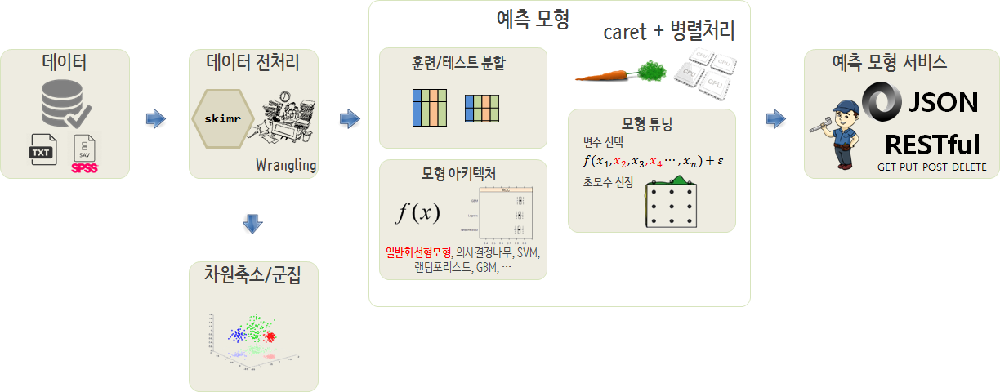

 
> ## 학습목표 {.objectives}
>
> * 실무에서 많이 활용되는 군집분석 방법론을 이해한다.
> * 다양한 군집분석 알로리즘을 비교하여 최적의 알고리즘을 추출한다.
> * 추출된 군집분석 알고리즘을 적용하여 군집의 특성을 올바르게 이해한다.


``` {r, include=FALSE}
# source("tools/chunk-options.R")

knitr::opts_chunk$set(echo = TRUE, message=FALSE, warning=FALSE,
                      comment="", digits = 3, tidy = FALSE, prompt = FALSE, fig.align = 'center')


library(tidyverse)

library(factoextra)
library(FactoMineR)
library(clustertend)
library(NbClust)
library(clValid)
library(mclust)
library(pheatmap)
library(ggthemes)
library(extrafont)
library(gridExtra)
library(ggmosaic)
loadfonts()
```

# 탐색적 다차원 데이터 분석 - 포켓몬 데이터 [^prcatical-guide-to-cluster-analaysis-in-r] {#pokemon-data-multivariate}

[^prcatical-guide-to-cluster-analaysis-in-r]: [Mr Alboukadel Kassambara (2017), Practical Guide to Cluster Analysis in R: Unsupervised Machine Learning, Amazon Digital Services LLC](https://www.amazon.com/Practical-Guide-Cluster-Analysis-Unsupervised-ebook/dp/B077KQBXTN/ref=la_B076JDHZC8_1_1?s=books&ie=UTF8&qid=1511857119&sr=1-1)

[캐글 포켓몬](https://www.kaggle.com/abcsds/pokemon) 데이터가 공개되어 721종류 포켓몬에 대한 데이터와 포켓몬 유형에 대한 정보가 담겨있다.

각 포켓몬에 대한 데이터 원본은 [http://pokemondb.net/pokedex](http://pokemondb.net/pokedex)에서 확인한다.
전통적인 군집분석에 대해서는 [포켓몬 군집분석](http://statkclee.github.io/ml/ml-pokemon-unsupervised.html)을 참조한다.

기계학습을 통해 예측모형을 개발할 경우 데이터를 가져와서 전처리 작업을 통한 데이터 정제작업과는 별개로,
데이터 과학자가 데이터와 친숙해지는 과정이 필요하다. 이런 과정을 통해서 새로운 "아하~" 통찰, 인사이트(Insight)를 발견해 낼 수도 있고,
데이터에 더 친숙해지게 된다. 추가로 새로운 피쳐공학(Feature Engineering)을 통해 새로운 변수 및 유의미한 관측점을 추려낼 수 있다.

특히, 차원축소 기법과 함께 **군집분석(cluster analysis)**이 많이 활용되는 다변량 분석기법이다.



## 군집분석 작업흐름 {#clustering-pipeline}

군집분석에 필요한 데이터를 가져온 후 다양한 군집분석 모형 탐색과정을 거쳐 최적의 군집 알고리즘을 선정하고, 
더불어 적절한 군집갯수 $k$도 선정한다.

선정된 군집갯수와 군집 알고리즘에 맞춰 데이터에 적합시켜 군집에 데이터를 접목하여 군집특성을 요약하는 절차를 거친다.


# 군집분석 {#pokemon-cluster-analysis}

## 포켓몬 데이터 불러와서 전처리 작업 {#cluster-import-preprocess-pokemon-data}

포켓몬 데이터를 캐글에서 다운로드 받아 불러온다. 
변수명을 변경하고 범주형 데이터에 대해서 범주를 재조정하고,
군집분석에 적합하게 척도(scale)를 각 변수별로 동일하게 재조정하는 
전처리 작업을 수행한다.

``` {r cluster-pokemon-import-preprocess}
# 0. 환경설정 --------------------------------------------
# library(tidyverse)
# library(purrr)

# 1. 포켓몬 데이터 가져오기 ------------------------------
pkmon_dat <- read_csv("data/Pokemon.csv", col_type = cols()) %>% as.data.frame()

pkmon_df <- pkmon_dat %>%  
    mutate(legend = ifelse(Legendary == "True", "전설", "일반")) %>% 
    dplyr::select(legend, attack = Attack, defense = Defense, sp_attack = `Sp. Atk`, sp_defense =`Sp. Def`, speed = Speed)

# 2. 데이터 전처리 ---------------------------------------

## 2.1. 척도조정
pkmon_scaled_df <- pkmon_df %>% 
    mutate_if(is.integer, scale)

row.names(pkmon_scaled_df) <- pkmon_dat$Name

# 3. 데이터 내보내기 -------------------------------------
# dir.create("data_preprocessed")
# saveRDS(pkmon_scaled_df, "data_preprocessed/pkmon_scaled_df.rds")
# saveRDS(pkmon_df, "data_preprocessed/pkmon_df.rds")
```

## 군집분석을 위한 탐색적 데이터 분석 {#cluster-eda-pokemon-data}

포켓몬 데이터를 캐글에서 다운로드 받아 불러온다. 
변수명을 변경하고 범주형 데이터에 대해서 범주를 재조정하고,
군집분석에 적합하게 척도(scale)를 각 변수별로 동일하게 재조정하는 
전처리 작업을 수행한다.

### 군집(cluster)은 존재하는가? {#cluster-eda-exist-cluster}

존재론적인 질문이 될 수 있으나, 군집은 과연 존재하는가? 이러한 철학적인 질문에 대해서
**hopkins** 통계량, `fviz_dist`함수의 시각적인 방법을 통해서 확인할 수 있다.
물론, 질문자체가 철학적이기에 이외에도 다양한 방법론이 존재한다. 예를 들어, CCC를 들 수 있다.

``` {r cluster-exist-eda-preprocess}
# library(factoextra)
# library(FactoMineR)
# library(clustertend)
# library(NbClust)
# library(clValid)
# library(mclust)
# library(pheatmap)
# library(ggthemes)
# library(ggmosaic)
# library(extrafont)
# library(gridExtra)
# loadfonts()

# 1. 포켓몬 데이터 가져오기 ------------------------------
# pkmon_scaled_df <- readRDS("data_preprocessed/pkmon_scaled_df.rds")

# 2. 군집이 있는가? clustering tendancy ------------------

## 2.1. hopkins 통계량 : H = 0.5 기준
pkmon_scaled_df %>% 
    select(-legend) %>% 
    clustertend::hopkins(., nrow(pkmon_scaled_df) -1)

## 2.2. 시각적인 방법
pkmon_scaled_df %>% 
    select(-legend) %>% 
    dist() %>% 
      fviz_dist(., show_labels = FALSE) +
      labs(title = "포켓몬 캐릭터 군집") +
      coord_fixed()
```

### 군집(cluster)은 몇개가 적절할까? {#cluster-eda-how-many-cluster}

군집이 존재한다고 판단이 되면, 다음으로 드는 의문점은 몇개의 군집이 적절한가라는 문제로 귀결된다.
적절한 군집 식별을 위해서 팔꿈치(elbow) 방법, 실루엣 방법, 갭 방법 등이 개발되었다.
이를 시각화해서 최적의 군집 갯수를 선정한다.

`NbClust` 팩키지 포함된 다양한 군집방법을 모두 시도해보고 나서 최적의 성능을 보이는 군집갯수를 선정하는 것도 가능하다.

``` {r cluster-how-many-eda-preprocess}
# 3. 군집이 존재한다면 몇개일까? ------------------
## 3.1. 팔꿈치 방법
elbow_g <- pkmon_scaled_df %>% 
    select(-legend) %>% 
    fviz_nbclust(., kmeans, method = "wss") +
      theme_few(base_family = "NanumGothic") +
      geom_vline(xintercept = 2, linetype = 2) +
      scale_y_continuous(labels = scales::comma ) +
      labs(x="군집갯수(k)", y="전체 군집내 제곱합", title="최적 군집갯수", subtitle = "팔꿈치 방법(Elbow method)") 

## 3.2. 실루엣 방법
silhouette_g <- pkmon_scaled_df %>% 
    select(-legend) %>% 
    fviz_nbclust(., kmeans, method = "silhouette") +
    theme_few(base_family = "NanumGothic") +
    geom_vline(xintercept = 2, linetype = 2) +
    scale_y_continuous(labels = scales::comma ) +
    labs(x="군집갯수(k)", y="평균 실루엣 폭", 
         title="최적 군집갯수", subtitle = "실루엣 방법(silhouette method)") 

## 3.3. 갭 방법
gap_g <- pkmon_scaled_df %>% 
    select(-legend) %>% 
    fviz_nbclust(., kmeans, nstart = 25, method = "gap_stat", nboot = 50) +
    theme_few(base_family = "NanumGothic") +
    geom_vline(xintercept = 2, linetype = 2) +
    scale_y_continuous(labels = scales::comma ) +
    labs(x="군집갯수(k)", y="갭 통계량(k)", 
         title="최적 군집갯수", subtitle = "갭 방법(gap method)") 

grid.arrange(elbow_g, silhouette_g, gap_g, nrow=3)

## 3.4. NbClust 방법

pkmon_scaled_df %>% 
    select(-legend) %>% 
      NbClust(., distance = "euclidean", min.nc = 2, max.nc = 10, method = "kmeans") %>% 
      fviz_nbclust() +
      scale_y_continuous(labels = scales::comma ) +
      labs(x="군집갯수(k)", y="추천 빈도수", 
         title="최적 군집갯수", subtitle = "NbClust 방법") 
```

## 최적 군집분석 알고리즘 선정 {#cluster-eda-optimal-algorithm-cluster}

`clValid` 팩키지는 최적 군집분석 알고리즘과 군집갯수를 선택하도록 개발되었다.
대상 군집 알고리즘(`clmethods`)을 쭉 나열하고, 군집갯수(`nClust`)도 지정하고 나서,
검증(`validation`)을 위한 조건도 지정하면 해당 데이터에 대한 최적 군집 알고리즘과 군집갯수를 제시하여 준다.

``` {r cluster-eda-optimal-algorithm}
# 4. 최적 군집 알고리즘 선택 ------------------
clmethods <- c("hierarchical", "kmeans", "diana", "fanny", "model", "sota", "pam", "clara", "agnes")

clust_algo <- pkmon_scaled_df %>% 
    select(-legend) %>% 
    sample_frac(0.5) %>%
    as.matrix %>%
    clValid(., nClust = 2:7,
       clMethods = clmethods, validation = "internal")

summary(clust_algo)
```


## 군집분석 알고리즘 적합 {#cluster-eda-fit-algorithm-cluster}

최적 군집 알고리즘과 군집갯수가 선정되면 "군집분석 알고리즘 적합"하는 과정을 거치게 된다.
군집 2개를 갖는 계층적 군집분석 알고리즘이 선정된 군집분석 알고리즘이기 때문에,
이를 포켓몬 데이터 적합시킨다. 30개 포켓몬 표본을 뽑아 수목도(dendogram)도 그려보고, 
`fviz_cluster` 함수로 시각화도 실행해 본다.

``` {r cluster-eda-fit-optimal-algorithm}
# 1. 포켓몬 데이터 가져오기 ------------------------------
# pkmon_scaled_df <- readRDS("data_preprocessed/pkmon_scaled_df.rds")

# 2. 최적 군집 알고리즘 적합: 계층적 군집 ------------------
pkmon_smpl_df <- pkmon_scaled_df %>% 
    select(-legend) %>% 
    sample_n(30)

pkmon_hclust <- pkmon_smpl_df %>% 
    get_dist(method = "euclidean") %>% 
    hclust(method = "ward.D2")

# 3. 군집분석 시각화 ------------------
## 3.1. 수목도(dendogram) 
fviz_dend(pkmon_hclust, k = 2,
          cex = 0.5,
          k_colors = c("#2E9FDF", "#FC4E07"),
          color_labels_by_k = TRUE,
          rect = TRUE) +
    theme_void(base_family="NanumGothic") + 
    labs(title="포켓몬 캐릭터 군집분석", subtitle="계층적 군집분석 알고리즘 - 군집 2개", y="")


## 3.2. 군집 시각화
pkmon_grp <- cutree(pkmon_hclust, k = 2)

fviz_cluster(list(data = pkmon_smpl_df, cluster = pkmon_grp),
             palette = c("#2E9FDF", "#FC4E07"),
             ellipse.type = "convex", 
             repel = TRUE, 
             show.clust.cent = FALSE, ggtheme = theme_minimal(base_family = "NanumGothic")) +
    labs(title="포켓몬 군집 그래프", subtitle ="계층적 군집분석 알고리즘 - 군집 2개") 
```

## 군집분석 알고리즘 - 열지도(heatmap) {#cluster-eda-fit-algorithm-cluster-heatmap}

군집분석을 관측점 관점과 변수관점으로 **열지도(heatmap)**를 생성하여 면밀하게 살펴본다.
예쁜 열지도(`pheatmap`)를 통해 정적 열지도도 그려보고, `d3heatmap`을 통해 인터랙티브 열지도도 그려본다.

``` {r cluster-eda-fit-optimal-algorithm-heatmap}
## 3.3. 열지도(heatmap)
### 3.3.1. 정적 열지도
pheatmap::pheatmap(pkmon_smpl_df, cutree_rows = 2)

### 3.3.2. 인터랙티브 열지도(heatmap)

d3heatmap::d3heatmap(pkmon_smpl_df, colors = "RdYlBu",
          k_row = 2,
          k_col = 2)
```


# 군집특성 요약 {#cluster-summary-cluster}

군집 알고리즘을 통해 해당 관측점에 대한 군집에 대한 배정이 완료되었다면,
이제는 해당 군집별 특성을 요약하는 작업을 수행한다.

## 군집특성 요약 데이터 {#cluster-summary-cluster-cbind}

군집 2개를 갖는 계층적 군집분석 알고리즘 적합시킨 데이터를 원본 `pkmon_df` 데이터프레임과 병합한다.
병합된 `pkmon_full_df` 데이터프레임에 대해 군집특성요약을 위해 추가로 필요한 데이터 정제작업도 수행한다.

군집 2개를 갖는 계층적 군집분석 알고리즘 적합시킨 데이터를 원본 `pkmon_df` 데이터프레임과 병합한다.
병합된 `pkmon_full_df` 데이터프레임에 대해 군집특성요약을 위해 추가로 필요한 데이터 정제작업도 수행한다.

``` {r cluster-summary-cluster-cbind}
# 4. 군집자체 분석 ------------------
## 4.1. 군집데이터 준비
pkmon_full_hclust <- pkmon_scaled_df %>% 
    get_dist(method = "euclidean") %>% 
    hclust(method = "ward.D2")

pkmon_full_grp <- cutree(pkmon_full_hclust, k = 2) %>% as_data_frame()

pkmon_full_df <- bind_cols(pkmon_df, pkmon_full_grp) %>% 
    select(group=value, everything())

# 5. 데이터 내보내기 ------------------
# saveRDS(pkmon_full_df, "data_preprocessed/pkmon_full_df.rds")
```

## 군집특성 요약 데이터 - 병렬그래프 {#cluster-summary-cluster-parallel}

병렬그래프(parallel plot)를 통해 군집을 잘 식별하는 변수가 어떤 것인지 활용한다.

``` {r cluster-summary-cluster-parallel, eval=TRUE}
# 2. 포켓몬 군집 해석 ------------------
## 2.1. 전체적인 능력값
pkmon_full_df %>% 
    mutate(ID = 1:n()) %>% 
    gather(key, value, -group, -legend, -ID) %>% 
    ggplot(aes(x = key, y = value, color= as.factor(group), group = ID)) +
    geom_path(alpha = 0.5, lineend = 'round', linejoin = 'round') +
    geom_point(size=1, shape=21, colour="grey50") +
    scale_fill_manual(values=c("red","blue")) +
    theme_bw(base_family = "NanumGothic") +
    labs(x="", y="능력치", color="군집", title="포켓몬 캐릭터 군집 평행그림")

```

## 군집특성 요약 데이터 - 모자이크 그래프 {#cluster-summary-cluster-mosaic}

군집은 태생이 범주형인데, 범주형 변수가 포함된 경우 군집과 교차하여 군집별 특성도 함께 살펴본다.
이를 위해서 모자이크 그래프를 활용한다.

``` {r cluster-summary-cluster-mosaic, eval=FALSE}
## 2.2. 범주형 변수에 대한 군집
pkmon_full_df %>% 
    mutate(group = factor(group),
           legend = factor(legend)) %>% 
    ggplot() +
    geom_mosaic(aes(x = product(legend, group), fill=product(group)), na.rm=TRUE, divider=mosaic("v")) +
    theme_minimal(base_family = "NanumGothic") +
    labs(x="전설여부", title='포켓몬 전설, 군집') +
    theme(legend.position = "right")
```

## 군집특성 요약 데이터 - 밀도 그래프 {#cluster-summary-cluster-mosaic}

연속형 변수와 군집을 밀도 그래프와 교차하여 각 군집별 특성도 각 변수별로 시각화하여 이해한다.

``` {r cluster-summary-cluster-density}
## 2.3. 단변량 비교
pkmon_full_df %>% 
    mutate(group = factor(group),
           legend = factor(legend)) %>% 
    ggplot(aes(attack, colour = group)) +
    geom_density() +
    theme_minimal(base_family = "NanumGothic") +
    labs(x="공격", y="분포밀도", title='포켓몬 공격력', color="군집") +
    theme(legend.position = "right")

density_univariate <-  function(df, var, var_name) {
    df %>% 
        mutate(group = factor(group),
               legend = factor(legend)) %>% 
        ggplot(aes_string(var)) +
        geom_density(aes(colour = group)) +
        theme_minimal(base_family = "NanumGothic") +
        labs(x="공격", y="분포밀도", title=var_name, color="군집") +
        theme(legend.position = "none")
}

attack_g     <- density_univariate(pkmon_full_df, "attack", "공격력")
defense_g    <- density_univariate(pkmon_full_df, "defense", "방어력")
sp_attack_g  <- density_univariate(pkmon_full_df, "sp_attack", "특수공격력")
sp_defense_g <- density_univariate(pkmon_full_df, "sp_defense", "특수방어력")
speed_g      <- density_univariate(pkmon_full_df, "speed", "속도")

grid.arrange(attack_g, defense_g, sp_attack_g, sp_defense_g,speed_g, nrow=2)
```


