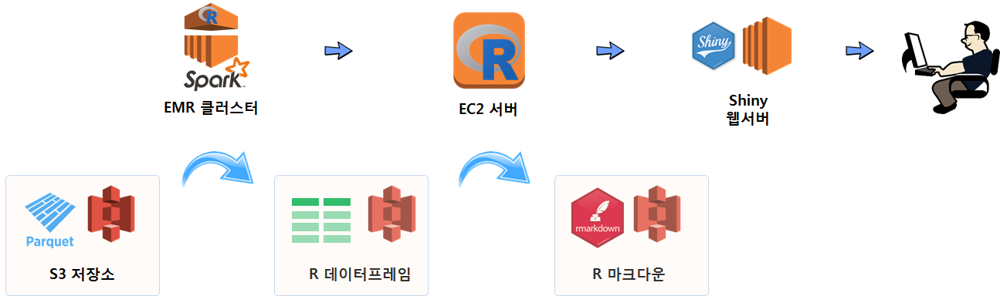

 
> ## 학습목표 {.objectives}
>
> * R 기반 빅데이터 개발 및 운영환경을 살펴본다.
> * 데이터 저장 &rarr; 하둡스파크 &rarr; EC2 병렬처리 컴퓨터 &rarr; R마크다운 &rarr; Shiny 웹서버 로 넘어가는 과정을 이해한다.

## 1. R 기반 빅데이터 개발 환경

빅데이터 기반 개발 및 운영환경을 R기반으로 구축할 경우 다양한 아키텍처 구축이 가능하다.
다양한 조합중에 한가지 사례를 소개하면 다음과 같다.

- **데이터 저장소(S3)**: 빅데이터의 경우 테라바이트가 넘는 경우가 흔해서 사람이 읽을 수 있는 `.csv` 형태 데이터를 저장소에 넣게 되면 파일 크기가 문제가 된다. 
단순히 파일 크기가 큰 것이 문제가 되는 것이 아니라 이를 다른 컴퓨터에 이동이나 복사를 할 경우 네트워크에 상당한 부하를 주고 장시간 시간도 소요된다.
이런 문제로 인해서 `파케시(Parquet)` 파일이 등장하게 된다. 즉, 동일한 정보를 높은 압축률로 압축시켜 저장한다.
- **대용량 데이터 처리(Spark)**: 빅데이터의 경우 고성능 한대의 컴퓨터에서 처리하는 것보다 작업을 나누어서 분산처리하는 것이 훨씬 더 높은 효율을 갖게 된다.
빅데이터를 R에서 읽어올 경우 시간도 오래 소요되고 컴퓨터가 다운되는 경험은 아마도 다수 사람들이 경험을 했을 것이다. 엑셀도 예외는 아니다.
이런 목적으로 하둡-스파크 EMR 클러스터를 구축하여 대용량 데이터를 모형개발에 적합한 형태로 가공한다. 수천에서 수만, 수백만분의 1로 정보를 압축한 형태로의 
R 데이터프레임으로 가공하여 저장한다.
- **모형개발 서버(EC2)**: 예측모형을 비롯한 다양한 데이터제품을 개발할 경우 Random Forest 유형의 모형개발에는 병렬처리가 적합하다. 
이를 위해 다수 코어를 갖추고 메모리도 충분한 기계학습 전용 EC2 컴퓨터를 준비하고 학습 및 모형을 개발한다.
- **R 마크다운**: 모형이 개발되었으면 이를 활용하는 단계로 넘어가는데 이때 R 마크다운이 유용한다. R 마크다운으로 `flashdashboard`, `Shiny`를 활용하여 데이터 제품을 개발해낸다.
- **Shiny 웹서버**: 최종 산출물을 Shiny 웹서버에 올려 이를 활용한다.

