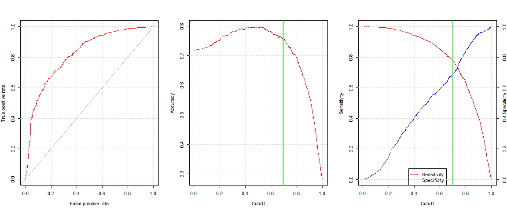

# xwMOOC 기계학습
 

## 1. 깔끔한 모형(tidy) [^tidy-model-pipeline]

[^tidy-model-pipeline]: [A tidy model pipeline with twidlr and broom](https://drsimonj.svbtle.com/a-tidy-model-pipeline-with-twidlr-and-broom)

데이터를 가져와서 정확한 예측모형을 개발하는 것이 생각보다 많은 난관을 넘어야 한다.
각 단계를 잘게 쪼개 작업을 수행하고 나서도 각 단계별 작업결과를 다음 단계로 넘기가 쉽지 않다.
특정 단계에서 작업을 수행한 후에 데이터구조가 다음 단계 데이터구조와 맞지 않는 문제등이 심심치 않게 발견된다.

이런 문제점을 극복하고자 `dplyr` 팩키지의 다양한 함수와 `tidyr` 자료구조, `tibble` 데이터프레임이 중요한 역할을 수행한다.
하지만, 데이터 전처리과정과 모형설계행렬(design matrix)일 깔끔하게 정리되어야 예측모형 `caret` 팩키지에 입력값으로 무리없이 사용할 수 있게 된다.

그리고 나면, 예측모형 결과를 배포할 수 있는 `OpenCPU` 같은 제품화 단계의 배포 팩키지도 마지막으로 필요하게 된다.

## 2. 신용위험 모형 

### 2.1. `recipes` 팩키지와 신용평점 데이터

[`recipes`](https://topepo.github.io/recipes/) 팩키지는 시각화와 예측모형을 개발하는데 필요한 모형설계행렬을 전처리하는 작업과정을 담당하는 역할을 수행하고자 개발되고 있다.
`tidyverse` 생태계위에서 [`skimr`](https://github.com/ropenscilabs/skimr) 팩키지와 함께 사용하면 작업흐름을 원활히 할 수 있어 더 큰 효과를 볼 수 있다.

`devtools::install_github("topepo/recipes")` 명령어를 통해 설치를 한다. `recipes` 팩키지를 활용한 사례를 보이기 위해서 
[신용평점](https://github.com/gastonstat/CreditScoring)데이터를 사용한다.

~~~{.r}
# 0. 환경설정 ----------------------------------------------------
# devtools::install_github("topepo/recipes")
# library(caret)
# library(tidyverse)
# library(recipes)
# library(skimr)
# library(purrr)

# 1. 데이터 가져오기 ---------------------------------------------
# credit_data <- read_csv("https://raw.githubusercontent.com/gastonstat/CreditScoring/master/CreditScoring.csv")
data("credit_data")
credit_data <- as_tibble(credit_data)

# 2. 데이터 전처리 -------------------------------------
skim(credit_data) 
~~~

~~~{.output}
Numeric Variables
# A tibble: 9 x 13
        var    type missing complete     n        mean           sd   min `25% quantile` median `75% quantile`    max
      <chr>   <chr>   <dbl>    <dbl> <dbl>       <dbl>        <dbl> <dbl>          <dbl>  <dbl>          <dbl>  <dbl>
1       Age integer       0     4454  4454   37.080377    10.984598    18          28.00     36           45.0     68
2    Amount integer       0     4454  4454 1038.918276   474.545999   100         700.00   1000         1300.0   5000
3    Assets integer      47     4407  4454 5403.979351 11574.418141     0           0.00   3000         6000.0 300000
4      Debt integer      18     4436  4454  343.025924  1245.991541     0           0.00      0            0.0  30000
5  Expenses integer       0     4454  4454   55.573417    19.515634    35          35.00     51           72.0    180
6    Income integer     381     4073  4454  141.687699    80.748398     6          90.00    125          170.0    959
7     Price integer       0     4454  4454 1462.780198   628.128120   105        1117.25   1400         1691.5  11140
8 Seniority integer       0     4454  4454    7.986753     8.174306     0           2.00      5           12.0     48
9      Time integer       0     4454  4454   46.438707    14.655462     6          36.00     48           60.0     72
# ... with 1 more variables: hist <chr>

Factor Variables
# A tibble: 5 x 7
      var   type complete missing     n n_unique
    <chr>  <chr>    <dbl>   <dbl> <dbl>    <dbl>
1    Home factor     4448       6  4454        6
2     Job factor     4452       2  4454        4
3 Marital factor     4453       1  4454        5
4 Records factor     4454       0  4454        2
5  Status factor     4454       0  4454        2
# ... with 1 more variables: stat <chr>

~~~

### 2.2. 신용평점 모형개발을 위한 전처리

신용평점 모형개발을 위해서 모형설계행렬(design matrix)을 준비해야 되는데 데이터가 숫자형과 범주형으로 얽혀있고,
숫자형과 범주형 변수 모두 결측값이 있고, 범주형 데이터의 경우 가변수 처리를 해야하고, 
연속형 변수의 경우 정규화(평균과 분산 척도조정) 과정을 거쳐야 된다. 이런 과정을 `recipes` 팩키지의 다양한 함수를 파이프 연산자와
함께 사용해서 준비를 한다.

관측점의 경우 훈련 표본(training sample)과 검증 표본(testing sample)으로 구분을 한다. 

상기 과정이 끝나게 되면 예측모형을 적합시킬 수 있는 준비가 끝난 모형설계행렬(design matrix)이 준비된다.
모형개발을 위한 일반적인 과정이고, 내부적으로 `recipes` 팩키지는 소규모 데이터에 대한 분석에 최적화된 오래전 모형설계행렬의 단점을 
최근 컴퓨팅환경에서 마주하게 되는 데이터에 맞는 예측모형개발을 위한 모형설계행렬 구축에 방점을 두고 있다.

~~~{.r}
# 3. 모형 설계행렬 -------------------------------------------
## 3.1. 모형설계행렬 -------------------------------------
cd_rec <- recipe(Status ~ ., data = credit_data)

cd_rec <- cd_rec %>% 
    step_modeimpute(all_nominal()) %>% 
    step_knnimpute(all_numeric(), K = 10) %>% 
    step_center(all_numeric()) %>%
    step_scale(all_numeric()) %>% 
    step_dummy(all_nominal(), - Status)

cd_dm <- prepare(cd_rec, training = credit_data)
~~~

~~~{.output}
step 1 modeimpute training 
step 2 knnimpute training 
step 3 center training 
step 4 scale training 
step 5 dummy training 

~~~

~~~{.r}
cd_clean_df <- bake(cd_dm, newdata = credit_data) 

cd_df <- credit_data %>% dplyr::select(Status) %>% 
    bind_cols(cd_clean_df)

## 3.2. 훈련/검증 표본 -----------------------------------
in_train <- createDataPartition(cd_df$Status, p = .7, list = FALSE)

cd_train_df <- cd_df[in_train, ]
cd_test_df <- cd_df[-in_train, ]
~~~

### 2.3. 예측모형 적합

`glm`, `rf`, `svm` 등 예측모형이 다수 존재하는데 `as.formula` 함수를 활용하여 모형을 밖으로 뺀다.
그후 `caret` 팩키지를 통한 전형적인 예측모형 구축 사용법을 적용한다.

~~~{.r}
# 4. 모형 적합 -------------------------------------------
## 4.1. 모형 수식 -----------------------------------
credit_var <- setdiff(colnames(cd_df),list('Status'))
credit_formula <- as.formula(paste('Status', paste(credit_var, collapse=' + '), sep=' ~ '))

## 4.2. 모형 적합 및 최적모형 선정 -----------------------------------
trControl <- trainControl(method = "repeatedcv", 
                          classProbs = TRUE, 
                          summaryFunction = twoClassSummary,
                          repeats = 5, number = 10, verboseIter = FALSE)

credit_glm <- train(credit_formula, data=cd_train_df,
                                  method="glm", 
                                  family="binomial", 
                                  trControl = trControl, 
                                  metric = 'ROC')
~~~

### 2.4. 예측모형 평가 [^dataschool-roc] [^understand-roc-curves] [^datascienceplus-cutoff]

[^dataschool-roc]: [ROC curves and Area Under the Curve explained (video)](http://www.dataschool.io/roc-curves-and-auc-explained/)

[^understand-roc-curves]: [Understanding ROC curves](http://www.navan.name/roc/)

[^datascienceplus-cutoff]: [Weather forecast with regression models – part 3](https://datascienceplus.com/weather-forecast-with-regression-models-part-3/)

예측모형 평가를 위해 먼저 전체적인 모형의 성능을 평가해야한다. 즉, ROC를 통해 모형 아키텍쳐를 선택하고 나하고 나서,
컷오프(cutoff)를 정한다. 이때 Sensitivity, Specificity, Accuracy 등 다양한 측도를 고려하여 주어진 상황에 적절한
대응이 되도록 컷오프(cutoff)를 정하면 된다.

<iframe width="560" height="315" src="https://www.youtube.com/embed/OAl6eAyP-yo" frameborder="0" allowfullscreen></iframe>

`glm_tune` 함수와 `glm_perf_plot`을 통해 컷오프를 잘 설정했는지 확인한다. [^so-optimal-cutoff]
Sensitivity, Specificity 합이 최대가 되는 지점을 컷오프로 설정한다. 물론 다양한 방식으로 최적 컷오프를 설정하는 것도 가능하다.

[^so-optimal-cutoff]: [Calculate the 'optimal' (=max sensitivity and specificity) cut-off value using ROCR](https://stackoverflow.com/questions/35731526/calculate-the-optimal-max-sensitivity-and-specificity-cut-off-value-using-r)

~~~{.r}
## 4.3. 모형 평가 및 예측 -----------------------------------

### 4.3.1. cutoff 설정 --------------------------------------

glm_tune <- function(glm_model, dataset) {
    results <- data.frame()
    for (q in seq(0.1, 0.9, by = 0.02)) {
        fitted_values <- glm_model$finalModel$fitted.values
        prediction <- factor(ifelse(fitted_values > q, "good", "bad"))
        cm <- confusionMatrix(prediction, dataset$Status, positive = "good")
        accuracy <- cm$overall["Accuracy"]
        specificity <- cm$byClass["Specificity"]
        sensitivity <- cm$byClass["Sensitivity"]
        results <- rbind(results, data.frame(cutoff=q, accuracy=accuracy, specificity = specificity, sensitivity=sensitivity))
    }
    rownames(results) <- NULL
    results
}

glm_tuned_df <- glm_tune(credit_glm, cd_train_df)

glm_cutoff <- glm_tuned_df[which.max(glm_tuned_df$specificity+glm_tuned_df$sensitivity),]$cutoff

glm_perf_plot <- function (prediction, cutoff) {
    perf <- performance(prediction, measure = "tpr", x.measure = "fpr")     
    par(mfrow=(c(1,3)), mex=0.9)
    plot(perf, col="red")
    abline(a = 0, b = 1, col="darkgray")
    grid()
    perf <- performance(prediction, measure = "acc", x.measure = "cutoff")    
    plot(perf, col="red")
    abline(v = cutoff, col="green")
    grid()
    perf <- performance(prediction, measure = "sens", x.measure = "cutoff")    
    plot(perf, col="red")
    abline(v = cutoff, col="green")
    grid()
    perf <- performance(prediction, measure = "spec", x.measure = "cutoff")    
    plot(perf, col="blue", add=TRUE)
    abline(v = cutoff, col="green")
    axis(side = 4)
    mtext(side = 4, line = 1, 'Specificity', cex=0.7)
    legend("bottom",
           legend=c("Sensitivity", "Specificity"),
           lty=c(1,1), pch=c(NA, NA), col=c("red", "blue"))
    grid()
    auc_res <- performance(prediction, "auc")
    auc_res@y.values[[1]]
}

credit_glm_pred <- predict(credit_glm, new=cd_test_df, type="prob")
credit_glm_pred_resp <- prediction(credit_glm_pred$good,  cd_test_df$Status)
glm_perf_plot(credit_glm_pred_resp, glm_cutoff)
~~~

~~~{.output}
[1] 0.7933026

~~~

~~~{.r}
### 4.3.2. 모형 성능 평가 --------------------------------------

summary(credit_glm$finalModel)
~~~

~~~{.output}

Call:
NULL

Deviance Residuals: 
    Min       1Q   Median       3Q      Max  
-3.2733  -0.5442   0.3604   0.6572   2.6346  

Coefficients:
                  Estimate Std. Error z value             Pr(>|z|)    
(Intercept)        0.06785    0.79061   0.086              0.93161    
Seniority          0.68111    0.07496   9.086 < 0.0000000000000002 ***
Time              -0.04330    0.06193  -0.699              0.48448    
Age               -0.14873    0.06807  -2.185              0.02889 *  
Expenses          -0.32125    0.06173  -5.204     0.00000019474986 ***
Income             0.63735    0.06934   9.192 < 0.0000000000000002 ***
Assets             0.41612    0.10374   4.011     0.00006045142711 ***
Debt              -0.22994    0.05411  -4.249     0.00002143426114 ***
Amount            -0.93951    0.09953  -9.439 < 0.0000000000000002 ***
Price              0.59653    0.09867   6.046     0.00000000148573 ***
Home_other         0.68372    0.67529   1.012              0.31131    
Home_owner         1.73317    0.65762   2.636              0.00840 ** 
Home_parents       1.58070    0.66784   2.367              0.01794 *  
Home_priv          1.05053    0.68161   1.541              0.12325    
Home_rent          1.02506    0.66130   1.550              0.12112    
Marital_married    0.82793    0.50417   1.642              0.10056    
Marital_separated -0.66523    0.55984  -1.188              0.23474    
Marital_single     0.22537    0.51040   0.442              0.65881    
Marital_widow      0.64793    0.65369   0.991              0.32159    
Records_yes       -1.98865    0.12480 -15.934 < 0.0000000000000002 ***
Job_freelance     -0.88513    0.12455  -7.107     0.00000000000119 ***
Job_others        -0.74113    0.24539  -3.020              0.00253 ** 
Job_partime       -1.40796    0.15469  -9.102 < 0.0000000000000002 ***
---
Signif. codes:  0 '***' 0.001 '**' 0.01 '*' 0.05 '.' 0.1 ' ' 1

(Dispersion parameter for binomial family taken to be 1)

    Null deviance: 3707.0  on 3117  degrees of freedom
Residual deviance: 2621.1  on 3095  degrees of freedom
AIC: 2667.1

Number of Fisher Scoring iterations: 5

~~~

~~~{.r}
pred_test <- predict(credit_glm, cd_test_df, type = "prob")
prediction  <- ifelse(pred_test$good >= glm_cutoff, "good", "bad")
confusionMatrix(prediction, cd_test_df$Status, positive="good")
~~~

~~~{.output}
Confusion Matrix and Statistics

          Reference
Prediction bad good
      bad  274  268
      good 102  692
                                             
               Accuracy : 0.7231             
                 95% CI : (0.6982, 0.7469)   
    No Information Rate : 0.7186             
    P-Value [Acc > NIR] : 0.3705             
                                             
                  Kappa : 0.3963             
 Mcnemar's Test P-Value : <0.0000000000000002
                                             
            Sensitivity : 0.7208             
            Specificity : 0.7287             
         Pos Pred Value : 0.8715             
         Neg Pred Value : 0.5055             
             Prevalence : 0.7186             
         Detection Rate : 0.5180             
   Detection Prevalence : 0.5943             
      Balanced Accuracy : 0.7248             
                                             
       'Positive' Class : good               
                                             

~~~

## 3. `twidlr` 

`tidyr`, `dplyr`을 활용한 깔끔한 데이터에 대한 작업흐름에 익숙하다면, 이를 모형에도 확장하면 어떨까하는 노력이 다방면으로 전개되고 있다.
그중 가장 많이 알려진 것이 [broom](https://github.com/tidyverse/broom)이다. 
하지만, 모형데이터가 데이터프레임, 행렬 등 다양한 상황에서 입력을 받아 출력결과를 데이터프레임으로 변환하여 일관된 작업흐름을 갖추는 것이 무엇보다 중요하다.

이런 문제로 제안된 철학을 담고 있는 것이 [twidlr: data.frame-based API for model and predict functions](https://github.com/drsimonj/twidlr) 팩키지가 된다.

### 3.1. `twidlr` 헬로월드

`devtools::install_github("drsimonj/twidlr")` 명령어로 설치를 한다.
`twidlr` 팩키지가 없다면 다음 예측모형 R코드는 오류를 생성하게 된다.

`twidlr` 팩키를 활용한 코드를 살펴본다.
예측모형(`lm`)에 데이터프레임을 넣고, 모형을 넣게 되면 예측모형이 생성되지만 이를 후속공정에서 
받아 사용하기에는 적절치 않다.

~~~{.r}
# 0. 환경설정 -----------------------------------------------------------
# devtools::install_github("drsimonj/twidlr")
library(tidyverse)
library(twidlr)
library(broom)

# 1. twidlr 헬로월드 ----------------------------------------------------
lm(mtcars, hp ~ .)
~~~

~~~{.output}

Call:
stats::lm(formula = formula, data = data)

Coefficients:
(Intercept)          mpg          cyl         disp         drat  
     79.048       -2.063        8.204        0.439       -4.619  
         wt         qsec           vs           am         gear  
    -27.660       -1.784       25.813        9.486        7.216  
       carb  
     18.749  

~~~

~~~{.r}
# 2. 예측 모형 파이프라인 -----------------------------------------------
mtcars %>% lm(hp ~ .)
~~~

~~~{.output}

Call:
stats::lm(formula = formula, data = data)

Coefficients:
(Intercept)          mpg          cyl         disp         drat  
     79.048       -2.063        8.204        0.439       -4.619  
         wt         qsec           vs           am         gear  
    -27.660       -1.784       25.813        9.486        7.216  
       carb  
     18.749  

~~~

### 3.2. `twidlr` + `broom` 파이프라인

`glance`, `tidy`, `augment`는 `broom` 팩키지 3종 셋트나 마찬가지다.
특히 `->` 연산자까지 조합하면 원본 데이터프레임이 입력값으로 들어가서 예측모형을 생성하고 나서 
결과값까지 깔끔하게 데이터프레임을 최종 결과값으로 받게 된다.

~~~{.r}
# 3. 예측 모형 결과 내보내기 --------------------------------------------

mtcars %>% lm(hp ~ .) %>% glance
~~~

~~~{.output}
  r.squared adj.r.squared    sigma statistic         p.value df    logLik
1 0.9027993     0.8565132 25.97138  19.50477 0.0000000189833 11 -142.8905
       AIC      BIC deviance df.residual
1 309.7809 327.3697 14164.76          21

~~~

~~~{.r}
mtcars %>% lm(hp ~ .) %>% tidy
~~~

~~~{.output}
          term    estimate   std.error  statistic     p.value
1  (Intercept)  79.0483879 184.5040756  0.4284371 0.672695339
2          mpg  -2.0630545   2.0905650 -0.9868407 0.334955314
3          cyl   8.2037204  10.0861425  0.8133655 0.425134929
4         disp   0.4390024   0.1492007  2.9423609 0.007779725
5         drat  -4.6185488  16.0829171 -0.2871711 0.776795845
6           wt -27.6600472  19.2703681 -1.4353668 0.165910518
7         qsec  -1.7843654   7.3639133 -0.2423121 0.810889101
8           vs  25.8128774  19.8512410  1.3003156 0.207583411
9           am   9.4862914  20.7599371  0.4569518 0.652397317
10        gear   7.2164047  14.6160152  0.4937327 0.626619355
11        carb  18.7486691   7.0287674  2.6674192 0.014412403

~~~

~~~{.r}
mtcars %>% lm(hp ~ .) %>% augment -> result
~~~
