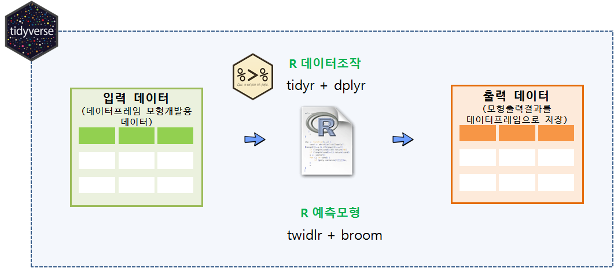

# xwMOOC 기계학습
 

## 1. 깔끔한 모형(tidy) [^tidy-model-pipeline]

[^tidy-model-pipeline]: [A tidy model pipeline with twidlr and broom](https://drsimonj.svbtle.com/a-tidy-model-pipeline-with-twidlr-and-broom)

`tidyr`, `dplyr`을 활용한 깔끔한 데이터에 대한 작업흐름에 익숙하다면, 이를 모형에도 확장하면 어떨까하는 노력이 다방면으로 전개되고 있다.
그중 가장 많이 알려진 것이 [broom](https://github.com/tidyverse/broom)이다. 
하지만, 모형데이터가 데이터프레임, 행렬 등 다양한 상황에서 입력을 받아 출력결과를 데이터프레임으로 변환하여 일관된 작업흐름을 갖추는 것이 무엇보다 중요하다.

이런 문제로 제안된 철학을 담고 있는 것이 [twidlr: data.frame-based API for model and predict functions](https://github.com/drsimonj/twidlr) 팩키지가 된다.

## 2. `twidlr` 사용법

`devtools::install_github("drsimonj/twidlr")` 명령어로 설치를 한다.
`twidlr` 팩키지가 없다면 다음 예측모형 R코드는 오류를 생성하게 된다.

### 2.1. `twidlr` 헬로월드

`twidlr` 팩키를 활용한 코드를 살펴본다.
예측모형(`lm`)에 데이터프레임을 넣고, 모형을 넣게 되면 예측모형이 생성되지만 이를 후속공정에서 
받아 사용하기에는 적절치 않다.

~~~{.r}
# 0. 환경설정 -----------------------------------------------------------
# devtools::install_github("drsimonj/twidlr")
library(tidyverse)
library(twidlr)
library(broom)

# 1. twidlr 헬로월드 ----------------------------------------------------
lm(mtcars, hp ~ .)
~~~

~~~{.output}

Call:
stats::lm(formula = formula, data = data)

Coefficients:
(Intercept)          mpg          cyl         disp         drat  
     79.048       -2.063        8.204        0.439       -4.619  
         wt         qsec           vs           am         gear  
    -27.660       -1.784       25.813        9.486        7.216  
       carb  
     18.749  

~~~

~~~{.r}
# 2. 예측 모형 파이프라인 -----------------------------------------------
mtcars %>% lm(hp ~ .)
~~~

~~~{.output}

Call:
stats::lm(formula = formula, data = data)

Coefficients:
(Intercept)          mpg          cyl         disp         drat  
     79.048       -2.063        8.204        0.439       -4.619  
         wt         qsec           vs           am         gear  
    -27.660       -1.784       25.813        9.486        7.216  
       carb  
     18.749  

~~~

### 2.2. `twidlr` + `broom` 파이프라인

`glance`, `tidy`, `augment`는 `broom` 팩키지 3종 셋트나 마찬가지다.
특히 `->` 연산자까지 조합하면 원본 데이터프레임이 입력값으로 들어가서 예측모형을 생성하고 나서 
결과값까지 깔끔하게 데이터프레임을 최종 결과값으로 받게 된다.

~~~{.r}
# 3. 예측 모형 결과 내보내기 --------------------------------------------

mtcars %>% lm(hp ~ .) %>% glance
~~~

~~~{.output}
  r.squared adj.r.squared    sigma statistic     p.value df    logLik
1 0.9027993     0.8565132 25.97138  19.50477 1.89833e-08 11 -142.8905
       AIC      BIC deviance df.residual
1 309.7809 327.3697 14164.76          21

~~~

~~~{.r}
mtcars %>% lm(hp ~ .) %>% tidy
~~~

~~~{.output}
          term    estimate   std.error  statistic     p.value
1  (Intercept)  79.0483879 184.5040756  0.4284371 0.672695339
2          mpg  -2.0630545   2.0905650 -0.9868407 0.334955314
3          cyl   8.2037204  10.0861425  0.8133655 0.425134929
4         disp   0.4390024   0.1492007  2.9423609 0.007779725
5         drat  -4.6185488  16.0829171 -0.2871711 0.776795845
6           wt -27.6600472  19.2703681 -1.4353668 0.165910518
7         qsec  -1.7843654   7.3639133 -0.2423121 0.810889101
8           vs  25.8128774  19.8512410  1.3003156 0.207583411
9           am   9.4862914  20.7599371  0.4569518 0.652397317
10        gear   7.2164047  14.6160152  0.4937327 0.626619355
11        carb  18.7486691   7.0287674  2.6674192 0.014412403

~~~

~~~{.r}
mtcars %>% lm(hp ~ .) %>% augment -> result
~~~
