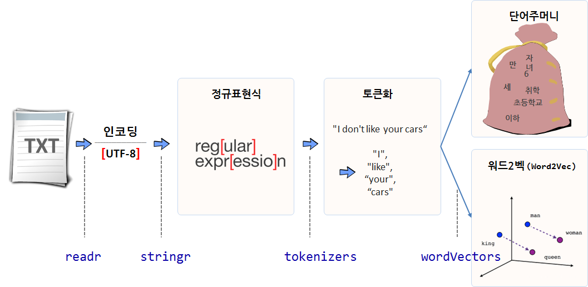

 
``` {r, include=FALSE}
source("tools/chunk-options.R")
knitr::opts_chunk$set(echo = TRUE, warning=FALSE, message=FALSE)

library(tidyverse)
library(wordVectors) # devtools::install_github("bmschmidt/wordVectors")
library(tokenizers)
library(stringr)

```

## 1. 텍스트 데이터 분석 방법론

텍스트 데이터를 분석하는 시작은 정규표현식(Regular Expression)으로 시작된다.
정규표현식을 바탕으로 텍스트를 토큰(token)으로 유의미한 조각으로 쪼개고 나서,
이를 단어주머니(Bag of Words), 워드2벡(Word2Vec) 등을 통해 분석한다.



- 텍스트 인코딩: `readr` 팩키지 `guess_encoding()` 함수
- 정규표현식: `stringr` 팩키지 `str_` 계열 함수
- 토큰화: `tokenizers` 팩키지 `tokenize_` 계열 함수
- 단어주머니: `tidytext`
- 워드2벡(word2vec): `[wordVectors(word2vec)](https://github.com/bmschmidt/wordVectors)`
- 텍스트2벡(text2vec): `[text2vec](https://github.com/dselivanov/text2vec)`

특히, `word2vec`은 초기 단어 유사도, 기계번역, 질의응답(QnA), 개체명 인식(NER, Named Entity Recognition)등에 주로 사용되었으나,
최근에는 추천시스템까지 영역을 확대하고 있다.

## 2. 참고문헌

- [MORE AGILE - 보다 나은 개발자의 삶을 위하여: 자연어 기계학습의 혁명적 진화 - Word2Vec에 대하여](http://www.moreagile.net/2014/11/word2vec.html)
- [최규민, Word2Vec 그리고 추천 시스템의 Item2Vec - 마이크로소프트웨어 AI특집 복간호 기고글](https://brunch.co.kr/@goodvc78/16)
- [최규민, 2015 파이콘, word2vec이 추천시스템을 만났을 때](https://www.slideshare.net/ssuser2fe594/2015-py-con-word2vec)

## 3. 대통령 취임사 [^glove-word2vec] [^japan-word2vec]

[^glove-word2vec]: [GloVe vs word2vec revisited](http://dsnotes.com/post/glove-enwiki/)
[^japan-word2vec]: ["An R package for creating and exploring word2vec and other vector models"を試す（+ GloVeと比較）](http://yamano357.hatenadiary.com/entry/2015/11/04/000332)


16대부터 19대까지 대통령 취임사는 다음 웹사이트에서 받아올 수 있다. 이를 바탕으로 Word2Vec 분석을 구현해 본다.

- [문재인 대통령 취임사](http://www.huffingtonpost.kr/2017/05/10/story_n_16523900.html)
- [박근혜 대통령 취임사](http://news.khan.co.kr/kh_news/khan_art_view.html?artid=201302251134391&code=910100)
- [이명박 대통령 취임사](http://www.pressian.com/news/article.html?no=13064)
- [노무현 대통령 취임사](http://legacy.www.hani.co.kr/section-003000000/2003/02/003000000200302251026287.html)

### 3.1. 텍스트 인코딩 확인 {#encoding}

텍스트 데이터가 있다면 아마도 가장 먼저 작업해야 되는 사항은 인코딩을 확인하는 작업이다.
`readr` 팩키지 `guess_encoding()` 함수를 통해 각 대통령별 연설문 인코딩을 확인하면 `UTF-8`이다. 
그리고 불필요한 공백이 들어간 줄을 제거하여 전처리 작업을 수행한다.

``` {r president-speech-data}

guess_encoding("data/president/문재인_대통령.txt", n_max=100)
guess_encoding("data/president/박근혜_대통령.txt", n_max=100)
guess_encoding("data/president/이명박_대통령.txt", n_max=100)
guess_encoding("data/president/노무현_대통령.txt", n_max=100)

moon_19_txt <- readLines("data/president/문재인_대통령.txt", encoding = "UTF-8")
moon_19_txt <- moon_19_txt[which(moon_19_txt != "")]

park_18_txt <- readLines("data/president/박근혜_대통령.txt", encoding = "UTF-8")
park_18_txt <- park_18_txt[which(park_18_txt != "")]

lee_17_txt <- readLines("data/president/이명박_대통령.txt", encoding = "UTF-8")
lee_17_txt <- lee_17_txt[which(lee_17_txt != "")]

roh_16_txt <- readLines("data/president/노무현_대통령.txt", encoding = "UTF-8")
roh_16_txt <- roh_16_txt[which(roh_16_txt != "")]
```

### 3.2. 토큰화 과정 {#token}

`tokenizers` 팩키지에 포함된 적당한 `tokenize_` 계열 함수를 사용하여 문장을 토큰으로 잘라 놓는다.


``` {r president-token}
# 2. 토큰화 과정 ----------------------------------------

moon_19_token <- tokenize_words(moon_19_txt)
park_18_token <- tokenize_words(park_18_txt)
lee_17_token  <- tokenize_words(lee_17_txt)
roh_16_token  <- tokenize_words(roh_16_txt)
```

### 3.3. `word2vec` 첫걸음 {#token}

대통령 모두의 취임사가 담긴 디렉토리 `data`d의 텍스트를 하나로 모은다.
그리고 나서 `train_word2vec` 명령어를 실행시켜 `word2vec` 모형을 생성시킨다.
즉 벡터 20개로 단어를 벡터공간에 재배열시킨다.

``` {r president-word2vec}
# 3. Word2Vec  ----------------------------------------

prep_word2vec(origin="data/president", destination="data/president/president_speech.txt", lowercase=TRUE, bundle_ngrams=2)

word2vec_model <- wordVectors::train_word2vec(
    train_file = "data/president/president_speech.txt", output_file = "model/president_speech_20.bin",
    vectors = 20, window = 10, threads = 2,  min_count = 3)

word2vec_model

word2vec_model[["국민"]]

word2vec_model %>% 
   wordVectors::nearest_to(vector = word2vec_model[["국민"]], n = 10)

word2vec_model %>% 
    wordVectors::nearest_to(vector = word2vec_model[[c("민주", "국민")]], n = 10)

wordVectors::plot(
    x = word2vec_model,
    y = word2vec_model[[c("국민", "민주")]]
)

```