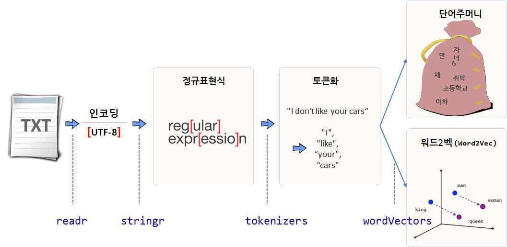

# xwMOOC 기계학습
 

## 1. 텍스트 데이터 분석 방법론

텍스트 데이터를 분석하는 시작은 정규표현식(Regular Expression)으로 시작된다.
정규표현식을 바탕으로 텍스트를 토큰(token)으로 유의미한 조각으로 쪼개고 나서,
이를 단어주머니(Bag of Words), 워드2벡(Word2Vec) 등을 통해 분석한다.

- 텍스트 인코딩: `readr` 팩키지 `guess_encoding()` 함수
- 정규표현식: `stringr` 팩키지 `str_` 계열 함수
- 토큰화: `tokenizers` 팩키지 `tokenize_` 계열 함수
- 단어주머니: `tidytext`
- 워드2벡(word2vec): `[wordVectors(word2vec)](https://github.com/bmschmidt/wordVectors)`
- 텍스트2벡(text2vec): `[text2vec](https://github.com/dselivanov/text2vec)`

특히, `word2vec`은 초기 단어 유사도, 기계번역, 질의응답(QnA), 개체명 인식(NER, Named Entity Recognition)등에 주로 사용되었으나,
최근에는 추천시스템까지 영역을 확대하고 있다.

## 2. 참고문헌

- [MORE AGILE - 보다 나은 개발자의 삶을 위하여: 자연어 기계학습의 혁명적 진화 - Word2Vec에 대하여](http://www.moreagile.net/2014/11/word2vec.html)
- [최규민, Word2Vec 그리고 추천 시스템의 Item2Vec - 마이크로소프트웨어 AI특집 복간호 기고글](https://brunch.co.kr/@goodvc78/16)
- [최규민, 2015 파이콘, word2vec이 추천시스템을 만났을 때](https://www.slideshare.net/ssuser2fe594/2015-py-con-word2vec)

## 3. 대통령 취임사 [^glove-word2vec] [^japan-word2vec]

[^glove-word2vec]: [GloVe vs word2vec revisited](http://dsnotes.com/post/glove-enwiki/)
[^japan-word2vec]: ["An R package for creating and exploring word2vec and other vector models"を試す（+ GloVeと比較）](http://yamano357.hatenadiary.com/entry/2015/11/04/000332)

16대부터 19대까지 대통령 취임사는 다음 웹사이트에서 받아올 수 있다. 이를 바탕으로 Word2Vec 분석을 구현해 본다.

- [문재인 대통령 취임사](http://www.huffingtonpost.kr/2017/05/10/story_n_16523900.html)
- [박근혜 대통령 취임사](http://news.khan.co.kr/kh_news/khan_art_view.html?artid=201302251134391&code=910100)
- [이명박 대통령 취임사](http://www.pressian.com/news/article.html?no=13064)
- [노무현 대통령 취임사](http://legacy.www.hani.co.kr/section-003000000/2003/02/003000000200302251026287.html)

### 3.1. 텍스트 인코딩 확인 {#encoding}

텍스트 데이터가 있다면 아마도 가장 먼저 작업해야 되는 사항은 인코딩을 확인하는 작업이다.
`readr` 팩키지 `guess_encoding()` 함수를 통해 각 대통령별 연설문 인코딩을 확인하면 `UTF-8`이다. 
그리고 불필요한 공백이 들어간 줄을 제거하여 전처리 작업을 수행한다.

~~~{.r}
guess_encoding("data/president/문재인_대통령.txt", n_max=100)
~~~

~~~{.output}
# A tibble: 1 x 2
  encoding confidence
     <chr>      <dbl>
1    UTF-8          1

~~~

~~~{.r}
guess_encoding("data/president/박근혜_대통령.txt", n_max=100)
~~~

~~~{.output}
# A tibble: 1 x 2
  encoding confidence
     <chr>      <dbl>
1    UTF-8          1

~~~

~~~{.r}
guess_encoding("data/president/이명박_대통령.txt", n_max=100)
~~~

~~~{.output}
# A tibble: 1 x 2
  encoding confidence
     <chr>      <dbl>
1    UTF-8          1

~~~

~~~{.r}
guess_encoding("data/president/노무현_대통령.txt", n_max=100)
~~~

~~~{.output}
# A tibble: 1 x 2
  encoding confidence
     <chr>      <dbl>
1    UTF-8          1

~~~

~~~{.r}
moon_19_txt <- readLines("data/president/문재인_대통령.txt", encoding = "UTF-8")
moon_19_txt <- moon_19_txt[which(moon_19_txt != "")]

park_18_txt <- readLines("data/president/박근혜_대통령.txt", encoding = "UTF-8")
park_18_txt <- park_18_txt[which(park_18_txt != "")]

lee_17_txt <- readLines("data/president/이명박_대통령.txt", encoding = "UTF-8")
lee_17_txt <- lee_17_txt[which(lee_17_txt != "")]

roh_16_txt <- readLines("data/president/노무현_대통령.txt", encoding = "UTF-8")
roh_16_txt <- roh_16_txt[which(roh_16_txt != "")]
~~~

### 3.2. 토큰화 과정 {#token}

`tokenizers` 팩키지에 포함된 적당한 `tokenize_` 계열 함수를 사용하여 문장을 토큰으로 잘라 놓는다.

~~~{.r}
# 2. 토큰화 과정 ----------------------------------------

moon_19_token <- tokenize_words(moon_19_txt)
park_18_token <- tokenize_words(park_18_txt)
lee_17_token  <- tokenize_words(lee_17_txt)
roh_16_token  <- tokenize_words(roh_16_txt)
~~~

### 3.3. `word2vec` 첫걸음 {#token}

대통령 모두의 취임사가 담긴 디렉토리 `data`d의 텍스트를 하나로 모은다.
그리고 나서 `train_word2vec` 명령어를 실행시켜 `word2vec` 모형을 생성시킨다.
즉 벡터 20개로 단어를 벡터공간에 재배열시킨다.

~~~{.r}
# 3. Word2Vec  ----------------------------------------

prep_word2vec(origin="data/president", destination="data/president/president_speech.txt", lowercase=TRUE, bundle_ngrams=2)
~~~

~~~{.output}
Starting training using file data/president/president_speech.txt

Vocab size (unigrams + bigrams): 3921
Words in train file: 5097

~~~

~~~{.r}
word2vec_model <- wordVectors::train_word2vec(
    train_file = "data/president/president_speech.txt", output_file = "model/president_speech_20.bin",
    vectors = 20, window = 10, threads = 2,  min_count = 3)
~~~

~~~{.output}
Starting training using file /Users/statkclee/swc/ml/data/president/president_speech.txt
Vocab size: 318
Words in train file: 2108

  |                                                                       
  |                                                                 |   0%
  |                                                                       
  |                                                                 |   1%
  |                                                                       
  |=                                                                |   1%
  |                                                                       
  |=                                                                |   2%
  |                                                                       
  |==                                                               |   3%
  |                                                                       
  |==                                                               |   4%
  |                                                                       
  |===                                                              |   4%
  |                                                                       
  |===                                                              |   5%
  |                                                                       
  |====                                                             |   6%
  |                                                                       
  |====                                                             |   7%
  |                                                                       
  |=====                                                            |   7%
  |                                                                       
  |=====                                                            |   8%
  |                                                                       
  |======                                                           |   8%
  |                                                                       
  |======                                                           |   9%
  |                                                                       
  |======                                                           |  10%
  |                                                                       
  |=======                                                          |  10%
  |                                                                       
  |=======                                                          |  11%
  |                                                                       
  |========                                                         |  12%
  |                                                                       
  |========                                                         |  13%
  |                                                                       
  |=========                                                        |  13%
  |                                                                       
  |=========                                                        |  14%
  |                                                                       
  |==========                                                       |  15%
  |                                                                       
  |==========                                                       |  16%
  |                                                                       
  |===========                                                      |  16%
  |                                                                       
  |===========                                                      |  17%
  |                                                                       
  |===========                                                      |  18%
  |                                                                       
  |============                                                     |  18%
  |                                                                       
  |============                                                     |  19%
  |                                                                       
  |=============                                                    |  19%
  |                                                                       
  |=============                                                    |  20%
  |                                                                       
  |=============                                                    |  21%
  |                                                                       
  |==============                                                   |  21%
  |                                                                       
  |==============                                                   |  22%
  |                                                                       
  |===============                                                  |  22%
  |                                                                       
  |===============                                                  |  23%
  |                                                                       
  |===============                                                  |  24%
  |                                                                       
  |================                                                 |  24%
  |                                                                       
  |================                                                 |  25%
  |                                                                       
  |=================                                                |  25%
  |                                                                       
  |=================                                                |  26%
  |                                                                       
  |=================                                                |  27%
  |                                                                       
  |==================                                               |  27%
  |                                                                       
  |==================                                               |  28%
  |                                                                       
  |===================                                              |  29%
  |                                                                       
  |===================                                              |  30%
  |                                                                       
  |====================                                             |  30%
  |                                                                       
  |====================                                             |  31%
  |                                                                       
  |=====================                                            |  32%
  |                                                                       
  |=====================                                            |  33%
  |                                                                       
  |======================                                           |  33%
  |                                                                       
  |======================                                           |  34%
  |                                                                       
  |======================                                           |  35%
  |                                                                       
  |=======================                                          |  35%
  |                                                                       
  |=======================                                          |  36%
  |                                                                       
  |========================                                         |  36%
  |                                                                       
  |========================                                         |  37%
  |                                                                       
  |=========================                                        |  38%
  |                                                                       
  |=========================                                        |  39%
  |                                                                       
  |==========================                                       |  39%
  |                                                                       
  |==========================                                       |  40%
  |                                                                       
  |==========================                                       |  41%
  |                                                                       
  |===========================                                      |  41%
  |                                                                       
  |===========================                                      |  42%
  |                                                                       
  |============================                                     |  42%
  |                                                                       
  |============================                                     |  43%
  |                                                                       
  |============================                                     |  44%
  |                                                                       
  |=============================                                    |  44%
  |                                                                       
  |=============================                                    |  45%
  |                                                                       
  |==============================                                   |  46%
  |                                                                       
  |==============================                                   |  47%
  |                                                                       
  |===============================                                  |  47%
  |                                                                       
  |===============================                                  |  48%
  |                                                                       
  |================================                                 |  49%
  |                                                                       
  |================================                                 |  50%
  |                                                                       
  |=================================                                |  50%
  |                                                                       
  |=================================                                |  51%
  |                                                                       
  |==================================                               |  52%
  |                                                                       
  |==================================                               |  53%
  |                                                                       
  |===================================                              |  53%
  |                                                                       
  |===================================                              |  54%
  |                                                                       
  |====================================                             |  55%
  |                                                                       
  |====================================                             |  56%
  |                                                                       
  |=====================================                            |  56%
  |                                                                       
  |=====================================                            |  57%
  |                                                                       
  |=====================================                            |  58%
  |                                                                       
  |======================================                           |  58%
  |                                                                       
  |======================================                           |  59%
  |                                                                       
  |=======================================                          |  59%
  |                                                                       
  |=======================================                          |  60%
  |                                                                       
  |=======================================                          |  61%
  |                                                                       
  |========================================                         |  61%
  |                                                                       
  |========================================                         |  62%
  |                                                                       
  |=========================================                        |  63%
  |                                                                       
  |=========================================                        |  64%
  |                                                                       
  |==========================================                       |  64%
  |                                                                       
  |==========================================                       |  65%
  |                                                                       
  |===========================================                      |  65%
  |                                                                       
  |===========================================                      |  66%
  |                                                                       
  |===========================================                      |  67%
  |                                                                       
  |============================================                     |  67%
  |                                                                       
  |============================================                     |  68%
  |                                                                       
  |=============================================                    |  69%
  |                                                                       
  |=============================================                    |  70%
  |                                                                       
  |==============================================                   |  70%
  |                                                                       
  |==============================================                   |  71%
  |                                                                       
  |===============================================                  |  72%
  |                                                                       
  |===============================================                  |  73%
  |                                                                       
  |================================================                 |  73%
  |                                                                       
  |================================================                 |  74%
  |                                                                       
  |================================================                 |  75%
  |                                                                       
  |=================================================                |  75%
  |                                                                       
  |=================================================                |  76%
  |                                                                       
  |==================================================               |  76%
  |                                                                       
  |==================================================               |  77%
  |                                                                       
  |==================================================               |  78%
  |                                                                       
  |===================================================              |  78%
  |                                                                       
  |===================================================              |  79%
  |                                                                       
  |====================================================             |  79%
  |                                                                       
  |====================================================             |  80%
  |                                                                       
  |====================================================             |  81%
  |                                                                       
  |=====================================================            |  81%
  |                                                                       
  |=====================================================            |  82%
  |                                                                       
  |======================================================           |  82%
  |                                                                       
  |======================================================           |  83%
  |                                                                       
  |======================================================           |  84%
  |                                                                       
  |=======================================================          |  84%
  |                                                                       
  |=======================================================          |  85%
  |                                                                       
  |========================================================         |  86%
  |                                                                       
  |========================================================         |  87%
  |                                                                       
  |=========================================================        |  87%
  |                                                                       
  |=========================================================        |  88%
  |                                                                       
  |==========================================================       |  89%
  |                                                                       
  |==========================================================       |  90%
  |                                                                       
  |===========================================================      |  90%
  |                                                                       
  |===========================================================      |  91%
  |                                                                       
  |===========================================================      |  92%
  |                                                                       
  |============================================================     |  92%
  |                                                                       
  |============================================================     |  93%
  |                                                                       
  |=============================================================    |  93%
  |                                                                       
  |=============================================================    |  94%
  |                                                                       
  |==============================================================   |  95%
  |                                                                       
  |==============================================================   |  96%
  |                                                                       
  |===============================================================  |  96%
  |                                                                       
  |===============================================================  |  97%
  |                                                                       
  |================================================================ |  98%
  |                                                                       
  |================================================================ |  99%
  |                                                                       
  |=================================================================|  99%
  |                                                                       
  |=================================================================| 100%

~~~

~~~{.r}
word2vec_model
~~~

~~~{.output}
A VectorSpaceModel object of  318  words and  20  vectors
                [,1]        [,2]        [,3]        [,4]        [,5]
</s>      0.02001343  0.02209702 -0.01915131 -0.01639023 0.006832886
합니다   -0.57032627 -0.81994563 -0.23998766  0.64663160 1.163744450
국민     -0.54292810 -1.17203772  0.55509257 -0.03018934 0.443771154
수       -0.02700470 -0.47260454  0.17067792  0.41724959 0.498200506
있습니다 -0.57138985 -0.14110938  0.25565585  0.94999272 0.593094587
것입니다 -0.17663088 -0.28786957  0.49168321  0.17762637 0.328315079
새로운   -1.17058527 -0.28484395  0.62811321 -0.15844774 0.371430278
우리     -0.76271915 -0.14197555  0.41659179  0.43282849 0.419238150
저는     -0.71469283 -0.64730197  0.24515027 -0.24974331 0.889902115
여러분   -0.34555084 -1.10179341 -0.18613563 -0.73976994 0.614374638
                [,6]
</s>      0.01510544
합니다    0.75627720
국민      0.05795119
수        0.54378068
있습니다  0.61001778
것입니다  0.97800702
새로운   -0.17156453
우리      0.52256906
저는     -0.17901438
여러분    0.38268420
attr(,".cache")
<environment: 0x7fd1b44f7db8>

~~~

~~~{.r}
word2vec_model[["국민"]]
~~~

~~~{.output}
A VectorSpaceModel object of  1  words and  20  vectors
           [,1]      [,2]      [,3]        [,4]      [,5]       [,6]
[1,] -0.5429281 -1.172038 0.5550926 -0.03018934 0.4437712 0.05795119
attr(,".cache")
<environment: 0x7fd1b4343eb0>

~~~

~~~{.r}
word2vec_model %>% 
   wordVectors::nearest_to(vector = word2vec_model[["국민"]], n = 10)
~~~

~~~{.output}
      국민 대한민국은     여러분       것을   건강하고     누구나 
 0.0000000  0.2470632  0.2599781  0.2914133  0.3011793  0.3072111 
  대한민국   여러분이     사람이       위해 
 0.3097755  0.3111862  0.3263752  0.3286224 

~~~

~~~{.r}
word2vec_model %>% 
    wordVectors::nearest_to(vector = word2vec_model[[c("민주", "국민")]], n = 10)
~~~

~~~{.output}
      국민 대한민국은     여러분       것을   건강하고     누구나 
 0.0000000  0.2470632  0.2599781  0.2914133  0.3011793  0.3072111 
  대한민국   여러분이     사람이       위해 
 0.3097755  0.3111862  0.3263752  0.3286224 

~~~

~~~{.r}
wordVectors::plot(
    x = word2vec_model,
    y = word2vec_model[[c("국민", "민주")]]
)
~~~

