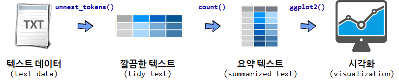
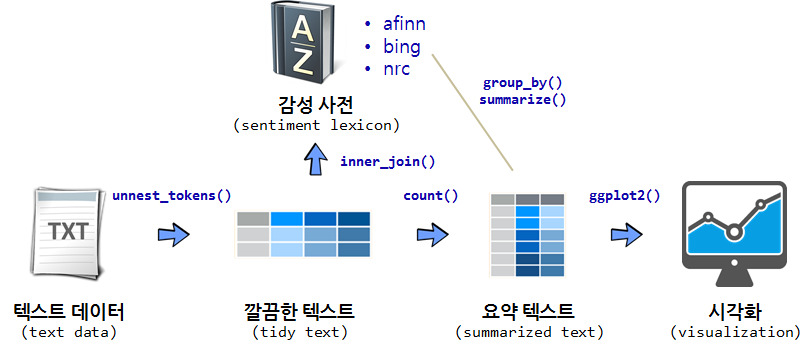

 
``` {r, include=FALSE}
source("tools/chunk-options.R")
knitr::opts_chunk$set(echo = TRUE, warning=FALSE, message=FALSE)

library(gutenbergr)
library(tidyverse)
library(DT)
library(stringr)
library(tidytext)

```

## 1. 깔끔한 텍스트 데이터 분석 방식 {#tidytext}

깔끔한(tidy) 데이터 분석 방법론이 정립되어 다양한 분야에 적용되고 있고,
텍스트 데이터(tidyverse)라고 예외는 아니다. 
사실 텍스트 데이터는 다양한 형태로 넘쳐자고 있지만 이에 대한 대응은 
특히, 한국어를 R언어로 활용한 사례는 많지 않다. 

텍스트 데이터를 분석하기 좋은 웹사이트가 여러분의 손을 기다리고 있습니다. 
단, 텍스트 데이터는 모두 영어로 되어 있습니다.

- [전자책, 구텐베르그(Gutenberg)](https://www.gutenberg.org/)
- [트위터](http://www.rdatamining.com/docs/twitter-analysis-with-r)
- [영문 팝송 가사(50 Years of Pop Music)](https://github.com/walkerkq/musiclyrics)
- [영문 TV 뉴스](http://television.gdeltproject.org/cgi-bin/iatv_ftxtsearch/iatv_ftxtsearch)

텍스트 데이터를 분석하는 다양한 방식이 존재한다. 텍스트 데이터 분석방법으로 
무료 전자책 [Text Mining with R](http://tidytextmining.com/)에 내용을 중심으로 살펴보자.



원본 텍스트 데이터가 있다면 이를 `unnest_tokens()` 함수를 통해 텍스트를 깔끔한 형태로 정제를 한후 
`dplyr`를 활용하여 데이터를 가공한 후에 요약하고 나서 이를 `ggplot`에 담아 시각화한다.

## 2. 구텐베르그 전자책 가져오기 {#gutenberg} [^gutenberg-tutorial]

[^gutenberg-tutorial]: [ropensci - gutenbergr tutorial](https://ropensci.org/tutorials/gutenbergr_tutorial.html)

`gutenbergr` 팩키지가 있어 힘들게 [구텐베르그 프로젝트](https://www.gutenberg.org/) 웹사이트 들어가서 검색하고 
이를 다운로드 받아 R로 가져오는 과정을 자동화해서 R 내부에서 처리할 수 있게 되었다.

### 2.1. 구텐베르그 메타데이터  {#gutenberg-metadata}

구텐베르그 팩키지 메타데이터(`gutenberg_metadata`)에 구텐베르그 프로젝트에서 관리하는 도서정보가 한 눈에 볼 수 있도록 
정리해놨다. 표본으로 100개 뽑아서 살펴보고, 언어별로 어떤 언어가 가장 많은 도서데이터로 추출가능하지 살펴본다.

``` {r gutenbergr}
# 0. 환경설정 ------------------------------
# https://ropensci.org/tutorials/gutenbergr_tutorial.html
# if (!require("devtools")) install.packages("devtools")
# devtools::install_github("ropenscilabs/gutenbergr")
# library(gutenbergr)
# library(tidyverse)
# library(DT)
# library(stringr)

# 1. 구텐베르그 팩키지 사용법 --------------
gutenberg_metadata %>% sample_n(100) %>% 
    datatable()

gutenberg_metadata %>% count(language, sort=TRUE) %>% 
    mutate(percent = n / sum(n),
           cumpcnt = scales::percent(cumsum(percent)))
```

### 2.2. 다운로드 가능한 도서 {#gutenberg-downloadable}

구텐베르그 프로젝트에 등록된 도서가 많지만, 텍스트 분석을 위해서 결국 원문이 이용가능해야 된다.
이를 정리한 것이 `gutenberg_works` 함수로 이중 100개만 표본으로 뽑아서 어떤 전자책이 다운로드 가능하지 살펴보자.
그리고, [위키피디어 에드거 앨런 포](https://ko.wikipedia.org/wiki/%EC%97%90%EB%93%9C%EA%B1%B0_%EC%95%A8%EB%9F%B0_%ED%8F%AC)에 대한 저작물을 
찾아보자. 

``` {r gutenbergr-downloadable}
# 2. 영문&다운로드 가능 저작물 --------------

gutenberg_works() %>% sample_n(100) %>% 
    datatable()

# gutenberg_works(str_detect(author, "Poe"))

gutenberg_works(author == "Poe, Edgar Allan") %>% 
    datatable()
```

### 2.3. 에드거 앨런 포 저작물 다운로드 {#gutenberg-poe}

전자책마다 고유한 식별자가 붙어있다. 예를 들어, 어셔가의 붕괴(The Fall of the House of Usher)는 932,
아몬틸라도의 술통(The Cask of Amontillado)는 1063번으로 고유 ID가 붙어있다.

R에서 도서정보를 저장하는 방식은 데이터프레임 한 행이 도서의 한줄에 해당된다. 따라서,
다운로드받은 두권의 책의 총 행수를 비교하는 방법은 행수를 개수하면 된다.


``` {r gutenbergr-downloadable-poe}
# 3. 저작물 다운로드 --------------
## 3.1. 책 한권 -------------------
usher_house <- gutenberg_download(932)
datatable(usher_house)

## 3.2. 책 두권 -------------------
poe_books <- gutenberg_download(c(932, 1063), meta_fields = "title")
datatable(poe_books)

poe_books %>% 
    count(title)
```

## 3. 감성어 사전

`tidytext` 팩키지에 감성어 사전(sentiment lexicon)이 3개 포함되어 있다.
`get_sentiments()` 함수에 다음 감성어 사전을 인자로 넣어 깔끔한 텍스트 데이터프레밍과 `inner_join`하여 
텍스트에 포하된 감성을 계량화한다.

- afinn: 개발자 Finn Årup Nielsen
- bing: 개발자 Bing Liu와 기여자
- nrc: 개발자 Saif Mohammad, Peter Turney




## 4. 에드가 앨런 포우 감성분석 {#poe}

에드가 앨런 포우 전자책을 다운로드 받았으면 이를 텍스트 데이터분석을 위한 형태로 변환을 해야 한다.
이를 위해서 가장 먼저 `unnest_tokens()` 함수를 활용하여 한행에 한줄로 정리된 텍스트 데이터를 
깔끔한 텍스트(tidy text) 형태로 변환을 한다. 

``` {r tidytext-conversion}
# 0. 환경설정 ------------------------------
# library(gutenbergr)
# library(tidyverse)
# library(DT)
# library(stringr)
# library(tidytext)
# library(ggthemes)
# library(extrafont)
# loadfonts()


# 2. 깔끔한 텍스트(tidytext) 변환 ---------

poe_tidy_books <- poe_books %>% 
    group_by(title) %>% 
    mutate(linenumber = row_number()) %>% 
    unnest_tokens(word, text) %>% 
    ungroup()

poe_tidy_books %>% 
    count(word, sort=TRUE)
```

### 4.1. 긍정/부정어 활용 {#poe-positive-negative}

포우 두 소설에 사용된 긍정어와 부정어를 살펴본다.
`negative`, `positive`로 감성사전이 구성된 "bing"을 활용하여 
가장 많이 언급된 긍부정어를 시각화한다.

``` {r bing-positive-negative}
# 3. 감성 분석 -------------------
## 3.1. 긍정/부정 단어 -----------
poe_word_counts <- poe_tidy_books %>% 
    inner_join(get_sentiments("bing")) %>% 
    count(word, sentiment)

top_poe_words <- poe_word_counts %>% 
    group_by(sentiment) %>% 
    top_n(20, n) %>% 
    ungroup() %>% 
    mutate(word = reorder(word, n))

ggplot(top_poe_words, aes(word, n, fill = sentiment)) +
    geom_col(show.legend = FALSE) +
    facet_wrap(~sentiment, scales = "free") +  
    coord_flip() +
    labs(x="", y="")
```

### 4.2. 감성 추세 {#poe-sentiment-trend}

감성 변화를 추세로 나타내기 위해서 소설행을 35줄마다 한 단위로 묶고,
`positive`에서 `negative`를 빼서 감성을 한 점수로 만들어 내고 이를 
각 책장마다 붙인 인덱스(index)에 맞춰 추세를 시각화한다.

``` {r bing-positive-negative-trend}
## 3.2. 시점별 감성변화 --------

poe_tidy_books %>%
    inner_join(get_sentiments("bing")) %>%
    count(title, index = linenumber %/% 35, sentiment) %>%
    spread(sentiment, n, fill = 0) %>%
    mutate(sentiment = positive - negative) %>%
    ggplot(aes(index, sentiment, fill=title)) +
    geom_col() +
    facet_wrap(~title, scales ="free_x") +
    theme_bw(base_family = "NanumGothic") +
    theme(legend.position = "none") +
    labs(x="", y="감성점수", fill="책제목")
```

### 4.3. 감성표현에 많이 사용된 단어 {#poe-words-by-sentiment}

`nrc` 감성사전을 활용하여 각 감정을 표현하는데 많이 사용된 단어를 상위 10개씩 뽑아보자.

``` {r bing-words-by-sentiment, fig.width=12, fig.height=8}
## 3.3. 감정을 표현하는데 많이 사용된 단어 -----

poe_tidy_books %>%
    anti_join(data_frame(word ="usher")) %>% 
    inner_join(get_sentiments("nrc")) %>%
    count(word, sentiment) %>%
    group_by(sentiment) %>%
    top_n(10, n) %>%
    ungroup() %>%
    mutate(word = reorder(word, n)) %>%
    ggplot(aes(word, n, fill=sentiment)) +
    geom_col(show.legend = FALSE) +
    facet_wrap(~ sentiment, scales = "free") +
    coord_flip() +
    theme_bw(base_family = "NanumGothic") +
    theme(legend.position = "none") +
    labs(x="", y="", fill="책제목")
```

### 4.4. 두 소설 특정 감성에 많이 동원된 단어 {#poe-compare}

두 소설 특정 감성(`negative`)에 많이 동원된 단어를 시각화한다.

``` {r bing-words-by-sentiment-for-two-novels}
## 3.4. 두 소설 비교 ---------------------

poe_tidy_books %>%
    anti_join(data_frame(word ="usher")) %>% 
    inner_join(get_sentiments("nrc")) %>%
    filter(sentiment %in% c("negative")) %>% 
    count(word, title) %>%
    group_by(title) %>%
    top_n(10, n) %>%
    ungroup() %>%
    mutate(word = reorder(paste(word, title, sep = "__"), n)) %>%
    ggplot(aes(word, n, fill=title)) +
    geom_col(show.legend = FALSE) +
    facet_wrap(~ title, scales = "free") +
    coord_flip() +
    theme_bw(base_family = "NanumGothic") +
    theme(legend.position = "top") +
    labs(x="", y="", fill="책제목") +
    scale_x_discrete(labels = function(x) str_replace_all(x, "__.+$", ""))
```

