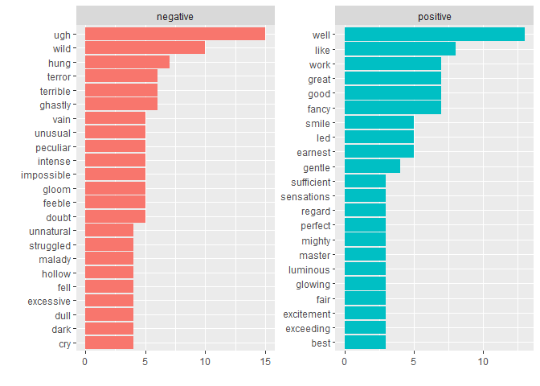
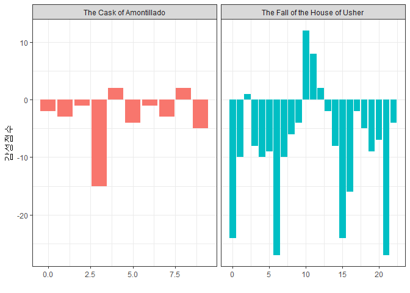
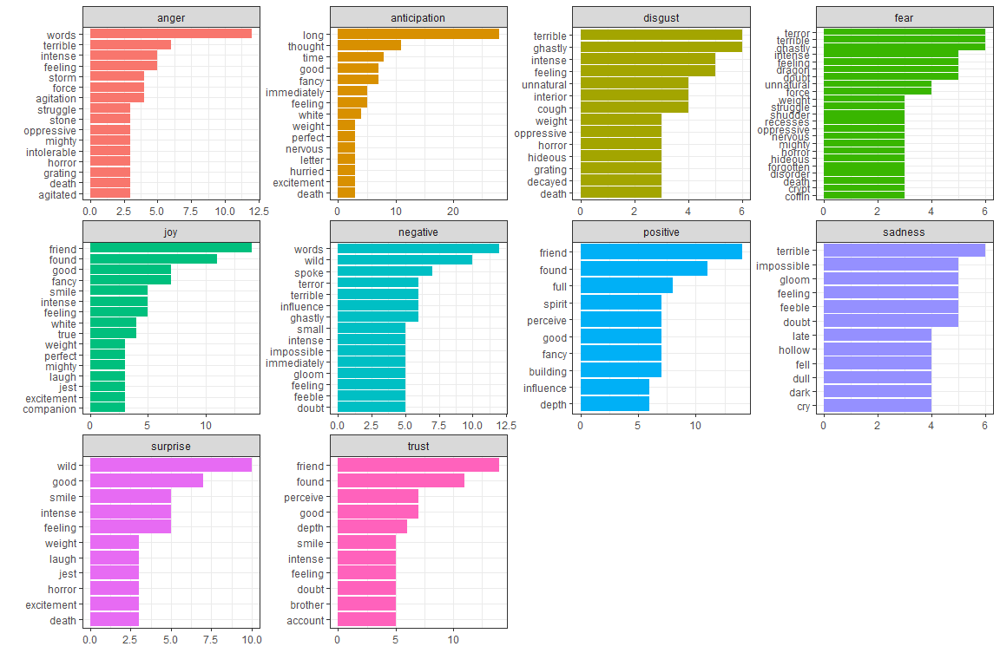
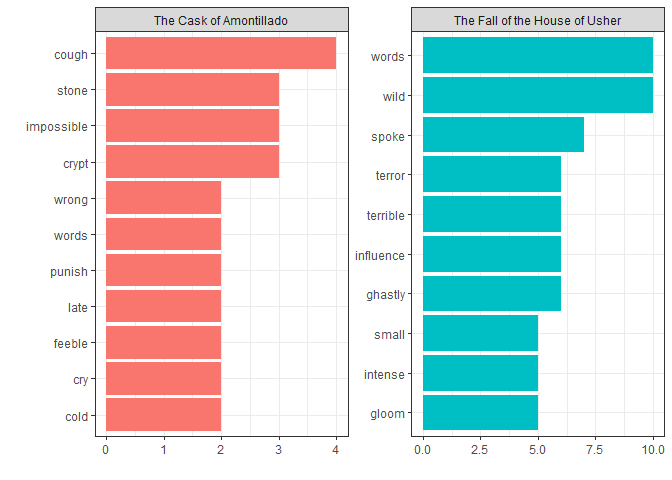

# xwMOOC 기계학습
 

## 1. 깔끔한 텍스트 데이터 분석 방식 {#tidytext}

깔끔한(tidy) 데이터 분석 방법론이 정립되어 다양한 분야에 적용되고 있고,
텍스트 데이터(tidyverse)라고 예외는 아니다. 
사실 텍스트 데이터는 다양한 형태로 넘쳐자고 있지만 이에 대한 대응은 
특히, 한국어를 R언어로 활용한 사례는 많지 않다. 

텍스트 데이터를 분석하기 좋은 웹사이트가 여러분의 손을 기다리고 있습니다. 
단, 텍스트 데이터는 모두 영어로 되어 있습니다.

- [전자책, 구텐베르그(Gutenberg)](https://www.gutenberg.org/)
- [트위터](http://www.rdatamining.com/docs/twitter-analysis-with-r)
- [영문 팝송 가사(50 Years of Pop Music)](https://github.com/walkerkq/musiclyrics)
- [영문 TV 뉴스](http://television.gdeltproject.org/cgi-bin/iatv_ftxtsearch/iatv_ftxtsearch)

텍스트 데이터를 분석하는 다양한 방식이 존재한다. 텍스트 데이터 분석방법으로 
무료 전자책 [Text Mining with R](http://tidytextmining.com/)에 내용을 중심으로 살펴보자.

원본 텍스트 데이터가 있다면 이를 `unnest_tokens()` 함수를 통해 텍스트를 깔끔한 형태로 정제를 한후 
`dplyr`를 활용하여 데이터를 가공한 후에 요약하고 나서 이를 `ggplot`에 담아 시각화한다.

## 2. 구텐베르그 전자책 가져오기 {#gutenberg} [^gutenberg-tutorial]

[^gutenberg-tutorial]: [ropensci - gutenbergr tutorial](https://ropensci.org/tutorials/gutenbergr_tutorial.html)

`gutenbergr` 팩키지가 있어 힘들게 [구텐베르그 프로젝트](https://www.gutenberg.org/) 웹사이트 들어가서 검색하고 
이를 다운로드 받아 R로 가져오는 과정을 자동화해서 R 내부에서 처리할 수 있게 되었다.

### 2.1. 구텐베르그 메타데이터  {#gutenberg-metadata}

구텐베르그 팩키지 메타데이터(`gutenberg_metadata`)에 구텐베르그 프로젝트에서 관리하는 도서정보가 한 눈에 볼 수 있도록 
정리해놨다. 표본으로 100개 뽑아서 살펴보고, 언어별로 어떤 언어가 가장 많은 도서데이터로 추출가능하지 살펴본다.

~~~{.r}
# 0. 환경설정 ------------------------------
# https://ropensci.org/tutorials/gutenbergr_tutorial.html
# if (!require("devtools")) install.packages("devtools")
# devtools::install_github("ropenscilabs/gutenbergr")
# library(gutenbergr)
# library(tidyverse)
# library(DT)
# library(stringr)

# 1. 구텐베르그 팩키지 사용법 --------------
gutenberg_metadata %>% sample_n(100) %>% 
    datatable()
~~~

<!--html_preserve-->

<!--/html_preserve-->

~~~{.r}
gutenberg_metadata %>% count(language, sort=TRUE) %>% 
    mutate(percent = n / sum(n),
           cumpcnt = scales::percent(cumsum(percent)))
~~~

~~~{.output}
# A tibble: 103 x 4
   language     n     percent cumpcnt
      <chr> <int>       <dbl>   <chr>
 1       en 42719 0.821566629   82.2%
 2       fr  2658 0.051118334   87.3%
 3       de  1387 0.026674616   89.9%
 4       fi  1341 0.025789949   92.5%
 5       nl   723 0.013904648   93.9%
 6       it   672 0.012923823   95.2%
 7       pt   537 0.010327519   96.2%
 8       es   470 0.009038983   97.1%
 9       zh   408 0.007846607   97.9%
10       el   216 0.004154086   98.3%
# ... with 93 more rows

~~~

### 2.2. 다운로드 가능한 도서 {#gutenberg-downloadable}

구텐베르그 프로젝트에 등록된 도서가 많지만, 텍스트 분석을 위해서 결국 원문이 이용가능해야 된다.
이를 정리한 것이 `gutenberg_works` 함수로 이중 100개만 표본으로 뽑아서 어떤 전자책이 다운로드 가능하지 살펴보자.
그리고, [위키피디어 에드거 앨런 포](https://ko.wikipedia.org/wiki/%EC%97%90%EB%93%9C%EA%B1%B0_%EC%95%A8%EB%9F%B0_%ED%8F%AC)에 대한 저작물을 
찾아보자. 

~~~{.r}
# 2. 영문&다운로드 가능 저작물 --------------

gutenberg_works() %>% sample_n(100) %>% 
    datatable()
~~~

<!--html_preserve-->

<!--/html_preserve-->

~~~{.r}
# gutenberg_works(str_detect(author, "Poe"))

gutenberg_works(author == "Poe, Edgar Allan") %>% 
    datatable()
~~~

<!--html_preserve-->

<!--/html_preserve-->

### 2.3. 에드거 앨런 포 저작물 다운로드 {#gutenberg-poe}

전자책마다 고유한 식별자가 붙어있다. 예를 들어, 어셔가의 붕괴(The Fall of the House of Usher)는 932,
아몬틸라도의 술통(The Cask of Amontillado)는 1063번으로 고유 ID가 붙어있다.

R에서 도서정보를 저장하는 방식은 데이터프레임 한 행이 도서의 한줄에 해당된다. 따라서,
다운로드받은 두권의 책의 총 행수를 비교하는 방법은 행수를 개수하면 된다.

~~~{.r}
# 3. 저작물 다운로드 --------------
## 3.1. 책 한권 -------------------
usher_house <- gutenberg_download(932)
datatable(usher_house)
~~~

<!--html_preserve-->

<!--/html_preserve-->

~~~{.r}
## 3.2. 책 두권 -------------------
poe_books <- gutenberg_download(c(932, 1063), meta_fields = "title")
datatable(poe_books)
~~~

<!--html_preserve-->

<script type="application/json" data-for="htmlwidget-bfcca6bbce269842a86a">{"x":{"filter":"none","data":[["1","2","3","4","5","6","7","8","9","10","11","12","13","14","15","16","17","18","19","20","21","22","23","24","25","26","27","28","29","30","31","32","33","34","35","36","37","38","39","40","41","42","43","44","45","46","47","48","49","50","51","52","53","54","55","56","57","58","59","60","61","62","63","64","65","66","67","68","69","70","71","72","73","74","75","76","77","78","79","80","81","82","83","84","85","86","87","88","89","90","91","92","93","94","95","96","97","98","99","100","101","102","103","104","105","106","107","108","109","110","111","112","113","114","115","116","117","118","119","120","121","122","123","124","125","126","127","128","129","130","131","132","133","134","135","136","137","138","139","140","141","142","143","144","145","146","147","148","149","150","151","152","153","154","155","156","157","158","159","160","161","162","163","164","165","166","167","168","169","170","171","172","173","174","175","176","177","178","179","180","181","182","183","184","185","186","187","188","189","190","191","192","193","194","195","196","197","198","199","200","201","202","203","204","205","206","207","208","209","210","211","212","213","214","215","216","217","218","219","220","221","222","223","224","225","226","227","228","229","230","231","232","233","234","235","236","237","238","239","240","241","242","243","244","245","246","247","248","249","250","251","252","253","254","255","256","257","258","259","260","261","262","263","264","265","266","267","268","269","270","271","272","273","274","275","276","277","278","279","280","281","282","283","284","285","286","287","288","289","290","291","292","293","294","295","296","297","298","299","300","301","302","303","304","305","306","307","308","309","310","311","312","313","314","315","316","317","318","319","320","321","322","323","324","325","326","327","328","329","330","331","332","333","334","335","336","337","338","339","340","341","342","343","344","345","346","347","348","349","350","351","352","353","354","355","356","357","358","359","360","361","362","363","364","365","366","367","368","369","370","371","372","373","374","375","376","377","378","379","380","381","382","383","384","385","386","387","388","389","390","391","392","393","394","395","396","397","398","399","400","401","402","403","404","405","406","407","408","409","410","411","412","413","414","415","416","417","418","419","420","421","422","423","424","425","426","427","428","429","430","431","432","433","434","435","436","437","438","439","440","441","442","443","444","445","446","447","448","449","450","451","452","453","454","455","456","457","458","459","460","461","462","463","464","465","466","467","468","469","470","471","472","473","474","475","476","477","478","479","480","481","482","483","484","485","486","487","488","489","490","491","492","493","494","495","496","497","498","499","500","501","502","503","504","505","506","507","508","509","510","511","512","513","514","515","516","517","518","519","520","521","522","523","524","525","526","527","528","529","530","531","532","533","534","535","536","537","538","539","540","541","542","543","544","545","546","547","548","549","550","551","552","553","554","555","556","557","558","559","560","561","562","563","564","565","566","567","568","569","570","571","572","573","574","575","576","577","578","579","580","581","582","583","584","585","586","587","588","589","590","591","592","593","594","595","596","597","598","599","600","601","602","603","604","605","606","607","608","609","610","611","612","613","614","615","616","617","618","619","620","621","622","623","624","625","626","627","628","629","630","631","632","633","634","635","636","637","638","639","640","641","642","643","644","645","646","647","648","649","650","651","652","653","654","655","656","657","658","659","660","661","662","663","664","665","666","667","668","669","670","671","672","673","674","675","676","677","678","679","680","681","682","683","684","685","686","687","688","689","690","691","692","693","694","695","696","697","698","699","700","701","702","703","704","705","706","707","708","709","710","711","712","713","714","715","716","717","718","719","720","721","722","723","724","725","726","727","728","729","730","731","732","733","734","735","736","737","738","739","740","741","742","743","744","745","746","747","748","749","750","751","752","753","754","755","756","757","758","759","760","761","762","763","764","765","766","767","768","769","770","771","772","773","774","775","776","777","778","779","780","781","782","783","784","785","786","787","788","789","790","791","792","793","794","795","796","797","798","799","800","801","802","803","804","805","806","807","808","809","810","811","812","813","814","815","816","817","818","819","820","821","822","823","824","825","826","827","828","829","830","831","832","833","834","835","836","837","838","839","840","841","842","843","844","845","846","847","848","849","850","851","852","853","854","855","856","857","858","859","860","861","862","863","864","865","866","867","868","869","870","871","872","873","874","875","876","877","878","879","880","881","882","883","884","885","886","887","888","889","890","891","892","893","894","895","896","897","898","899","900","901","902","903","904","905","906","907","908","909","910","911","912","913","914","915","916","917","918","919","920","921","922","923","924","925","926","927","928","929","930","931","932","933","934","935","936","937","938","939","940","941","942","943","944","945","946","947","948","949","950","951","952","953","954","955","956","957","958","959","960","961","962","963","964","965","966","967","968","969","970","971","972","973","974","975","976","977","978","979","980","981","982","983","984","985","986","987","988","989","990","991","992","993","994","995","996","997","998","999","1000","1001","1002","1003","1004","1005","1006","1007","1008","1009","1010","1011","1012","1013","1014","1015","1016","1017","1018","1019","1020","1021","1022","1023","1024","1025","1026","1027","1028","1029","1030","1031","1032","1033","1034","1035","1036","1037","1038","1039","1040","1041","1042","1043","1044","1045","1046","1047","1048","1049","1050","1051","1052","1053","1054","1055","1056","1057","1058","1059","1060","1061","1062","1063","1064","1065","1066","1067","1068","1069","1070","1071","1072","1073","1074","1075","1076","1077","1078","1079","1080","1081","1082","1083","1084","1085","1086","1087","1088","1089","1090","1091","1092","1093","1094","1095","1096","1097","1098","1099","1100","1101","1102","1103","1104","1105","1106","1107","1108","1109","1110","1111","1112","1113","1114","1115","1116","1117","1118","1119"],[932,932,932,932,932,932,932,932,932,932,932,932,932,932,932,932,932,932,932,932,932,932,932,932,932,932,932,932,932,932,932,932,932,932,932,932,932,932,932,932,932,932,932,932,932,932,932,932,932,932,932,932,932,932,932,932,932,932,932,932,932,932,932,932,932,932,932,932,932,932,932,932,932,932,932,932,932,932,932,932,932,932,932,932,932,932,932,932,932,932,932,932,932,932,932,932,932,932,932,932,932,932,932,932,932,932,932,932,932,932,932,932,932,932,932,932,932,932,932,932,932,932,932,932,932,932,932,932,932,932,932,932,932,932,932,932,932,932,932,932,932,932,932,932,932,932,932,932,932,932,932,932,932,932,932,932,932,932,932,932,932,932,932,932,932,932,932,932,932,932,932,932,932,932,932,932,932,932,932,932,932,932,932,932,932,932,932,932,932,932,932,932,932,932,932,932,932,932,932,932,932,932,932,932,932,932,932,932,932,932,932,932,932,932,932,932,932,932,932,932,932,932,932,932,932,932,932,932,932,932,932,932,932,932,932,932,932,932,932,932,932,932,932,932,932,932,932,932,932,932,932,932,932,932,932,932,932,932,932,932,932,932,932,932,932,932,932,932,932,932,932,932,932,932,932,932,932,932,932,932,932,932,932,932,932,932,932,932,932,932,932,932,932,932,932,932,932,932,932,932,932,932,932,932,932,932,932,932,932,932,932,932,932,932,932,932,932,932,932,932,932,932,932,932,932,932,932,932,932,932,932,932,932,932,932,932,932,932,932,932,932,932,932,932,932,932,932,932,932,932,932,932,932,932,932,932,932,932,932,932,932,932,932,932,932,932,932,932,932,932,932,932,932,932,932,932,932,932,932,932,932,932,932,932,932,932,932,932,932,932,932,932,932,932,932,932,932,932,932,932,932,932,932,932,932,932,932,932,932,932,932,932,932,932,932,932,932,932,932,932,932,932,932,932,932,932,932,932,932,932,932,932,932,932,932,932,932,932,932,932,932,932,932,932,932,932,932,932,932,932,932,932,932,932,932,932,932,932,932,932,932,932,932,932,932,932,932,932,932,932,932,932,932,932,932,932,932,932,932,932,932,932,932,932,932,932,932,932,932,932,932,932,932,932,932,932,932,932,932,932,932,932,932,932,932,932,932,932,932,932,932,932,932,932,932,932,932,932,932,932,932,932,932,932,932,932,932,932,932,932,932,932,932,932,932,932,932,932,932,932,932,932,932,932,932,932,932,932,932,932,932,932,932,932,932,932,932,932,932,932,932,932,932,932,932,932,932,932,932,932,932,932,932,932,932,932,932,932,932,932,932,932,932,932,932,932,932,932,932,932,932,932,932,932,932,932,932,932,932,932,932,932,932,932,932,932,932,932,932,932,932,932,932,932,932,932,932,932,932,932,932,932,932,932,932,932,932,932,932,932,932,932,932,932,932,932,932,932,932,932,932,932,932,932,932,932,932,932,932,932,932,932,932,932,932,932,932,932,932,932,932,932,932,932,932,932,932,932,932,932,932,932,932,932,932,932,932,932,932,932,932,932,932,932,932,932,932,932,932,932,932,932,932,932,932,932,932,932,932,932,932,932,932,932,932,932,932,932,932,932,932,932,932,932,932,932,932,932,932,932,932,932,932,932,932,932,932,932,932,932,932,932,932,932,932,932,932,932,932,932,932,932,932,932,932,932,932,932,932,932,932,932,932,932,932,932,932,932,932,932,932,932,932,932,932,932,932,932,932,932,932,932,932,932,932,932,932,932,932,932,932,932,932,932,932,932,932,932,932,1063,1063,1063,1063,1063,1063,1063,1063,1063,1063,1063,1063,1063,1063,1063,1063,1063,1063,1063,1063,1063,1063,1063,1063,1063,1063,1063,1063,1063,1063,1063,1063,1063,1063,1063,1063,1063,1063,1063,1063,1063,1063,1063,1063,1063,1063,1063,1063,1063,1063,1063,1063,1063,1063,1063,1063,1063,1063,1063,1063,1063,1063,1063,1063,1063,1063,1063,1063,1063,1063,1063,1063,1063,1063,1063,1063,1063,1063,1063,1063,1063,1063,1063,1063,1063,1063,1063,1063,1063,1063,1063,1063,1063,1063,1063,1063,1063,1063,1063,1063,1063,1063,1063,1063,1063,1063,1063,1063,1063,1063,1063,1063,1063,1063,1063,1063,1063,1063,1063,1063,1063,1063,1063,1063,1063,1063,1063,1063,1063,1063,1063,1063,1063,1063,1063,1063,1063,1063,1063,1063,1063,1063,1063,1063,1063,1063,1063,1063,1063,1063,1063,1063,1063,1063,1063,1063,1063,1063,1063,1063,1063,1063,1063,1063,1063,1063,1063,1063,1063,1063,1063,1063,1063,1063,1063,1063,1063,1063,1063,1063,1063,1063,1063,1063,1063,1063,1063,1063,1063,1063,1063,1063,1063,1063,1063,1063,1063,1063,1063,1063,1063,1063,1063,1063,1063,1063,1063,1063,1063,1063,1063,1063,1063,1063,1063,1063,1063,1063,1063,1063,1063,1063,1063,1063,1063,1063,1063,1063,1063,1063,1063,1063,1063,1063,1063,1063,1063,1063,1063,1063,1063,1063,1063,1063,1063,1063,1063,1063,1063,1063,1063,1063,1063,1063,1063,1063,1063,1063,1063,1063,1063,1063,1063,1063,1063,1063,1063,1063,1063,1063,1063,1063,1063,1063,1063,1063,1063,1063,1063,1063,1063,1063,1063,1063,1063,1063,1063,1063,1063,1063,1063,1063,1063,1063,1063,1063,1063,1063,1063,1063,1063,1063,1063,1063,1063,1063,1063,1063,1063,1063,1063,1063,1063,1063,1063,1063,1063,1063,1063,1063,1063,1063,1063,1063,1063,1063,1063,1063,1063,1063],["The Fall of the House of Usher","","","  Son coeur est un luth suspendu;","  Sitot qu'on le touche il resonne.","    DE BERANGER.","","","","During the whole of a dull, dark, and soundless day in the","autumn of the year, when the clouds hung oppressively low in the","heavens, I had been passing alone, on horseback, through a","singularly dreary tract of country; and at length found myself,","as the shades of the evening drew on, within view of the","melancholy House of Usher.  I know not how it was--but, with the","first glimpse of the building, a sense of insufferable gloom","pervaded my spirit.  I say insufferable; for the feeling was","unrelieved by any of that half-pleasureable, because poetic,","sentiment, with which the mind usually receives even the sternest","natural images of the desolate or terrible.  I looked upon the","scene before me--upon the mere house, and the simple landscape","features of the domain--upon the bleak walls--upon the vacant","eye-like windows--upon a few rank sedges--and upon a few white","trunks of decayed trees--with an utter depression of soul which I","can compare to no earthly sensation more properly than to the","after-dream of the reveller upon opium--the bitter lapse into","everyday life--the hideous dropping off of the veil.  There was","an iciness, a sinking, a sickening of the heart--an unredeemed","dreariness of thought which no goading of the imagination could","torture into aught of the sublime.  What was it--I paused to","think--what was it that so unnerved me in the contemplation of","the House of Usher?  It was a mystery all insoluble; nor could I","grapple with the shadowy fancies that crowded upon me as I","pondered.  I was forced to fall back upon the unsatisfactory","conclusion, that while, beyond doubt, there are combinations","of very simple natural objects which have the power of thus","affecting us, still the analysis of this power lies among","considerations beyond our depth.  It was possible, I reflected,","that a mere different arrangement of the particulars of the","scene, of the details of the picture, would be sufficient to","modify, or perhaps to annihilate its capacity for sorrowful","impression; and, acting upon this idea, I reined my horse","to the precipitous brink of a black and lurid tarn that lay in","unruffled lustre by the dwelling, and gazed down--but with a","shudder even more thrilling than before--upon the remodelled and","inverted images of the grey sedge, and the ghastly tree-stems,","and the vacant and eye-like windows.","","Nevertheless, in this mansion of gloom I now proposed to","myself a sojourn of some weeks.  Its proprietor, Roderick Usher,","had been one of my boon companions in boyhood; but many years had","elapsed since our last meeting.  A letter, however, had lately","reached me in a distant part of the country--a letter from","him--which, in its wildly importunate nature, had admitted of no","other than a personal reply.  The MS gave evidence of nervous","agitation.  The writer spoke of acute bodily illness--of a mental","disorder which oppressed him--and of an earnest desire to see me,","as his best, and indeed his only personal friend, with a view of","attempting, by the cheerfulness of my society, some alleviation","of his malady.  It was the manner in which all this, and much","more, was said--it was the apparent heart that went with his","request--which allowed me no room for hesitation; and I","accordingly obeyed forthwith what I still considered a very","singular summons.","","Although, as boys, we had been even intimate associates, yet","I really knew little of my friend.  His reserve had been always","excessive and habitual.  I was aware, however, that his very","ancient family had been noted, time out of mind, for a peculiar","sensibility of temperament, displaying itself, through long ages,","in many works of exalted art, and manifested, of late, in","repeated deeds of munificent yet unobtrusive charity, as well as","in a passionate devotion to the intricacies, perhaps even more","than to the orthodox and easily recognisable beauties of musical","science.  I had learned, too, the very remarkable fact, that the","stem of the Usher race, all time-honoured as it was, had put","forth, at no period, any enduring branch; in other words, that","the entire family lay in the direct line of descent, and had","always, with very trifling and very temporary variation, so lain.","It was this deficiency, I considered, while running over in","thought the perfect keeping of the character of the premises with","the accredited character of the people, and while speculating","upon the possible influence which the one, in the long","lapse of centuries, might have exercised upon the other--it was","this deficiency, perhaps, of collateral issue, and the consequent","undeviating transmission, from sire to son, of the patrimony with","the name, which had, at length, so identified the two as to merge","the original title of the estate in the quaint and equivocal","appellation of the \"House of Usher\"--an appellation which seemed","to include, in the minds of the peasantry who used it, both the","family and the family mansion.","","I have said that the sole effect of my somewhat childish","experiment--that of looking down within the tarn--had been to","deepen the first singular impression.  There can be no doubt that","the consciousness of the rapid increase of my superstition--for","why should I not so term it?--served mainly to accelerate the","increase itself.  Such, I have long known, is the paradoxical law","of all sentiments having terror as a basis.  And it might have","been for this reason only, that, when I again uplifted my eyes to","the house itself, from its image in the pool, there grew in my","mind a strange fancy--a fancy so ridiculous, indeed, that I but","mention it to show the vivid force of the sensations which","oppressed me.  I had so worked upon my imagination as really to","believe that about the whole mansion and domain there hung an","atmosphere peculiar to themselves and their immediate vicinity--an","atmosphere which had no affinity with the air of heaven, but","which had reeked up from the decayed trees, and the grey wall,","and the silent tarn--a pestilent and mystic vapour, dull,","sluggish, faintly discernible, and leaden-hued.","","Shaking off from my spirit what must have been a dream,","I scanned more narrowly the real aspect of the building.  Its","principal feature seemed to be that of an excessive antiquity.","The discoloration of ages had been great.  Minute fungi","overspread the whole exterior, hanging in a fine tangled web-work","from the eaves.  Yet all this was apart from any extraordinary","dilapidation.  No portion of the masonry had fallen; and there","appeared to be a wild inconsistency between its still perfect","adaptation of parts, and the crumbling condition of the","individual stones.  In this there was much that reminded me of","the specious totality of old wood-work which has rotted for long","years in some neglected vault, with no disturbance from the","breath of the external air.  Beyond  this indication of","extensive decay, however, the fabric gave little token of","instability.  Perhaps the eye of a scrutinizing observer might","have discovered a barely perceptible fissure, which, extending","from the roof of the building in front, made its way down the","wall in a zigzag direction, until it became lost in the sullen","waters of the tarn.","","Noticing these things, I rode over a short causeway to the","house.  A servant in waiting took my horse, and I entered the","Gothic archway of the hall.  A valet, of stealthy step, thence","conducted me, in silence, through many dark and intricate","passages in my progress to the studio of his master.  Much","that I encountered on the way contributed, I know not how, to","heighten the vague sentiments of which I have already spoken.","While the objects around me--while the carvings of the ceilings,","the sombre tapestries of the walls, the ebon blackness of the","floors, and the phantasmagoric armorial trophies which rattled as","I strode, were but matters to which, or to such as which, I had","been accustomed from my infancy--while I hesitated not to","acknowledge how familiar was all this--I still wondered to find","how unfamiliar were the fancies which ordinary images were","stirring up.  On one of the staircases, I met the physician of","the family.  His countenance, I thought, wore a mingled","expression of low cunning and perplexity.  He accosted me with","trepidation and passed on.  The valet now threw open a door and","ushered me into the presence of his master.","","The room in which I found myself was very large and lofty.","The windows were long, narrow, and pointed, and at so vast a","distance from the black oaken floor as to be altogether inaccessible","from within.  Feeble gleams of encrimsoned light made their way","through the trellised panes, and served to render sufficiently","distinct the more prominent objects around; the eye, however,","struggled in vain to reach the remoter angles of the chamber, or","the recesses of the vaulted and fretted ceiling.  Dark draperies","hung upon the walls.  The general furniture was profuse,","comfortless, antique, and tattered.  Many books and musical","instruments lay scattered about, but failed to give any vitality","to the scene.  I felt that I breathed an atmosphere of sorrow.","An air of stern, deep, and irredeemable gloom hung over and","pervaded all.","","Upon my entrance, Usher rose from a sofa on which he had","been lying at full length, and greeted me with a vivacious warmth","which had much in it, I at first thought, of an overdone","cordiality--of the constrained effort of the ennuye man of","the world.  A glance, however, at his countenance, convinced me","of his perfect sincerity.  We sat down; and for some moments,","while he spoke not, I gazed upon him with a feeling half of pity,","half of awe.  Surely, man had never before so terribly altered,","in so brief a period, as had Roderick Usher!  It was with","difficulty that I could bring myself to admit the identity of the","wan being before me with the companion of my early boyhood.  Yet","the character of his face had been at all times remarkable.  A","cadaverousness of complexion; an eye large, liquid, and luminous","beyond comparison; lips somewhat thin and very pallid, but of a","surpassingly beautiful curve; a nose of a delicate Hebrew model,","but with a breadth of nostril unusual in similar formations; a","finely-moulded chin, speaking, in its want of prominence, of a","want of moral energy; hair of a more than web-like softness and","tenuity; these features, with an inordinate expansion above the","regions of the temple, made up altogether a countenance not","easily to be forgotten.  And now in the mere exaggeration of the","prevailing character of these features, and of the expression","they were wont to convey, lay so much of change that I doubted to","whom I spoke.  The now ghastly pallor of the skin, and the now","miraculous lustre of the eye, above all things startled and even","awed me.  The silken hair, too, had been suffered to grow all","unheeded, and as, in its wild gossamer texture, it floated rather","than fell about the face, I could not, even with effort, connect","its Arabesque expression with any idea of simple humanity.","","In the manner of my friend I was at once struck with an","incoherence--an inconsistency; and I soon found this to arise","from a series of feeble and futile struggles to overcome an","habitual trepidancy--an excessive nervous agitation.  For","something of this nature I had indeed been prepared, no less by","his letter, than by reminiscences of certain boyish traits, and","by conclusions deduced from his peculiar physical conformation","and temperament.  His action was alternately vivacious and","sullen.  His voice varied rapidly from a tremulous indecision","(when the animal spirits seemed utterly in abeyance) to","that species of energetic concision--that abrupt, weighty,","unhurried, and hollow-sounding enunciation--that leaden,","self-balanced and perfectly modulated guttural utterance, which may","be observed in the lost drunkard, or the irreclaimable eater of","opium, during the periods of his most intense excitement.","","It was thus that he spoke of the object of my visit, of his","earnest desire to see me, and of the solace he expected me to","afford him.  He entered, at some length, into what he conceived","to be the nature of his malady.  It was, he said, a","constitutional and a family evil, and one for which he despaired","to find a remedy--a mere nervous affection, he immediately added,","which would undoubtedly soon pass off.  It displayed itself in a","host of unnatural sensations.  Some of these, as he detailed","them, interested and bewildered me; although, perhaps, the terms,","and the general manner of the narration had their weight.  He","suffered much from a morbid acuteness of the senses; the most","insipid food was alone endurable; he could wear only garments of","certain texture; the odours of all flowers were oppressive; his","eyes were tortured by even a faint light; and there were but","peculiar sounds, and these from stringed instruments, which did","not inspire him with horror.","","To an anomalous species of terror I found him a bounden","slave.  \"I shall perish,\" said he, \"I must perish in this","deplorable folly.  Thus, thus, and not otherwise, shall I be","lost.  I dread the events of the future, not in themselves, but","in their results.  I shudder at the thought of any, even the most","trivial, incident, which may operate upon this intolerable","agitation of soul.  I have, indeed, no abhorrence of danger,","except in its absolute effect--in terror.  In this unnerved--in","this pitiable condition--I feel that the period will sooner or","later arrive when I must abandon life and reason together, in","some struggle with the grim phantasm, FEAR.\"","","I learned, moreover, at intervals, and through broken and","equivocal hints, another singular feature of his mental","condition.  He was enchained by certain superstitious impressions","in regard to the dwelling which he tenanted, and whence, for many","years, he had never ventured forth--in regard to an influence","whose supposititious force was conveyed in terms too shadowy here","to be re-stated--an influence which some peculiarities in the","mere form and substance of his family mansion, had, by","dint of long sufferance, he said, obtained over his spirit--an","effect which the physique of the grey walls and turrets, and","of the dim tarn into which they all looked down, had, at length,","brought about upon the morale of his existence.","","He admitted, however, although with hesitation, that much of","the peculiar gloom which thus afflicted him could be traced to a","more natural and far more palpable origin--to the severe and","long-continued illness--indeed to the evidently approaching","dissolution--of a tenderly beloved sister--his sole companion for","long years--his last and only relative on earth.  \"Her decease,\"","he said, with a bitterness which I can never forget, \"would leave","him (him the hopeless and the frail) the last of the ancient race","of the Ushers.\"  While he spoke, the lady Madeline (for so was","she called) passed slowly through a remote portion of the","apartment, and, without having noticed my presence, disappeared.","I regarded her with an utter astonishment not unmingled with","dread--and yet I found it impossible to account for such","feelings.  A sensation of stupor oppressed me, as my eyes","followed her retreating steps.  When a door, at length, closed","upon her, my glance sought instinctively and eagerly the","countenance of the brother--but he had buried his face in his","hands, and I could only perceive that a far more than ordinary","wanness had overspread the emaciated fingers through which","trickled many passionate tears.","","The disease of the lady Madeline had long baffled the skill","of her physicians.  A settled apathy, a gradual wasting away of","the person, and frequent although transient affections of a","partially cataleptical character, were the unusual diagnosis.","Hitherto she had steadily borne up against the pressure of her","malady, and had not betaken herself finally to bed; but, on the","closing in of the evening of my arrival at the house, she","succumbed (as her brother told me at night with inexpressible","agitation) to the prostrating power of the destroyer; and I","learned that the glimpse I had obtained of her person would thus","probably be the last I should obtain--that the lady, at least","while living, would be seen by me no more.","","For several days ensuing, her name was unmentioned by either","Usher or myself: and during this period I was busied in earnest","endeavours to alleviate the melancholy of my friend.  We","painted and read together; or I listened, as if in a dream, to","the wild improvisations of his speaking guitar.  And thus, as a","closer and still closer intimacy admitted me more unreservedly","into the recesses of his spirit, the more bitterly did I perceive","the futility of all attempt at cheering a mind from which","darkness, as if an inherent positive quality, poured forth upon","all objects of the moral and physical universe, in one unceasing","radiation of gloom.","","I shall ever bear about me a memory of the many solemn hours","I thus spent alone with the master of the House of Usher.  Yet I","should fail in any attempt to convey an idea of the exact","character of the studies, or of the occupations, in which he","involved me, or led me the way.  An excited and highly","distempered ideality threw a sulphureous lustre over all.  His","long improvised dirges will ring for ever in my ears.  Among","other things, I hold painfully in mind a certain singular","perversion and amplification of the wild air of the last waltz of","Von Weber.  From the paintings over which his elaborate fancy","brooded, and which grew, touch by touch, into vagueness at which","I shuddered the more thrillingly, because I shuddered knowing not","why;--from these paintings (vivid as their images now are before","me) I would in vain endeavour to educe more than a small portion","which should lie within the compass of merely written words.  By","the utter simplicity, by the nakedness of his designs, he","arrested and overawed attention.  If ever mortal painted an idea,","that mortal was Roderick Usher.  For me at least--in the","circumstances then surrounding me--there arose out of the pure","abstractions which the hypochondriac contrived to throw upon his","canvas, an intensity of intolerable awe, no shadow of which felt","I ever yet in the contemplation of the certainly glowing yet too","concrete reveries of Fuseli.","","One of the phantasmagoric conceptions of my friend,","partaking not so rigidly of the spirit of abstraction, may be","shadowed forth, although feebly, in words.  A small picture","presented the interior of an immensely long and rectangular vault","or tunnel, with low walls, smooth, white, and without","interruption or device.  Certain accessory points of the design","served well to convey the idea that this excavation lay at an","exceeding depth below the surface of the earth.  No outlet was","observed in any portion of its vast extent, and no torch,","or other artificial source of light was discernible; yet a flood","of intense rays rolled throughout, and bathed the whole in a","ghastly and inappropriate splendour.","","I have just spoken of that morbid condition of the auditory","nerve which rendered all music intolerable to the sufferer, with","the exception of certain effects of stringed instruments.  It","was, perhaps, the narrow limits to which he thus confined himself","upon the guitar, which gave birth, in great measure, to the","fantastic character of the performances.  But the fervid","facility of his impromptus could not be so accounted for.","They must have been, and were, in the notes, as well as in the","words of his wild fantasias (for he not unfrequently accompanied","himself with rhymed verbal improvisations), the result of that","intense mental collectedness and concentration to which I have","previously alluded as observable only in particular moments of","the highest artificial excitement.  The words of one of these","rhapsodies I have easily remembered.  I was, perhaps, the more","forcibly impressed with it, as he gave it, because, in the under","or mystic current of its meaning, I fancied that I perceived, and","for the first time, a full consciousness on the part of Usher, of","the tottering of his lofty reason upon her throne.  The verses,","which were entitled \"The Haunted Palace,\" ran very nearly, if not","accurately, thus:","","","                            I.","","               In the greenest of our valleys,","                 By good angels tenanted,","               Once a fair and stately palace--","                 Radiant palace--reared its head.","               In the monarch Thought's dominion--","                 It stood there!","               Never seraph spread a pinion","                 Over fabric half so fair.","","","                           II.","","               Banners yellow, glorious, golden,","                 On its roof did float and flow;","               (This--all this--was in the olden","                 Time long ago)","               And every gentle air that dallied,","                 In that sweet day,","               Along the ramparts plumed and pallid,","                 A winged odour went away.","","","                           III.","","               Wanderers in that happy valley","                 Through two luminous windows saw","               Spirits moving musically","                 To a lute's well tuned law,","               Round about a throne, where sitting","                 (Porphyrogene!)","               In state his glory well befitting,","                 The ruler of the realm was seen.","","","                           IV.","","               And all with pearl and ruby glowing","                 Was the fair palace door,","               Through which came flowing, flowing, flowing","                 And sparkling evermore,","               A troop of Echoes whose sweet duty","                 Was but to sing,","               In voices of surpassing beauty,","                 The wit and wisdom of their king.","","","                            V.","","               But evil things, in robes of sorrow,","                 Assailed the monarch's high estate;","               (Ah, let us mourn, for never morrow","                 Shall dawn upon him, desolate!)","               And, round about his home, the glory","                 That blushed and bloomed","               Is but a dim-remembered story,","                 Of the old time entombed.","","","                           VI.","","               And travellers now within that valley,","                 Through the red-litten windows, see","               Vast forms that move fantastically","                 To a discordant melody;","               While, like a rapid ghastly river,","                 Through the pale door,","               A hideous throng rush out forever,","                 And laugh--but smile no more.","","","I well remember that suggestions arising from this ballad,","led us into a train of thought wherein there became manifest an","opinion of Usher's which I mention not so much on account of its","novelty (for other men* have thought thus,) as on account of the","pertinacity with which he maintained it.  This opinion, in its","general form, was that of the sentience of all vegetable things.","But, in his disordered fancy, the idea had assumed a more daring","character, and trespassed, under certain conditions, upon the","kingdom of inorganization.  I lack words to express the full","extent, or the earnest abandon of his persuasion.  The","belief, however, was connected (as I have previously hinted) with","the gray stones of the home of his forefathers.  The conditions","of the sentience had been here, he imagined, fulfilled in the","method of collocation of these stones--in the order of their","arrangement, as well as in that of the many fungi which","overspread them, and of the decayed trees which stood around--above","all, in the long undisturbed endurance of this arrangement,","and in its reduplication in the still waters of the tarn.  Its","evidence--the evidence of the sentience--was to be seen, he said,","(and I here started as he spoke,) in the gradual yet certain","condensation of an atmosphere of their own about the waters and","the walls.  The result was discoverable, he added, in that","silent, yet importunate and terrible influence which for","centuries had moulded the destinies of his family, and which made","him what I now saw him--what he was.  Such opinions need no","comment, and I will make none.","","Our books--the books which, for years, had formed no small","portion of the mental existence of the invalid--were, as might be","supposed, in strict keeping with this character of phantasm.  We","pored together over such works as the Ververt et Chartreuse","of Gresset; the Belphegor of Machiavelli; the Heaven and","Hell of Swedenborg; the Subterranean Voyage of Nicholas Klimm by","Holberg; the Chiromancy of Robert Flud, of Jean D'Indagine,","and of De la Chambre; the Journey into the Blue Distance of","Tieck; and the City of the Sun by Campanella.  One favourite","volume was a small octavo edition of the Directorium","Inquisitorum, by the Dominican Eymeric de Gironne; and there","were passages in Pomponius Mela, about the old African Satyrs","and OEgipans, over which Usher would sit dreaming for hours.  His","chief delight, however, was found in the perusal of an","exceedingly rare and curious book in quarto Gothic--the manual of","a forgotten church--the Vigiliae Mortuorum Secundum Chorum Ecclesiae","Maguntinae.","","I could not help thinking of the wild ritual of this work,","and of its probable influence upon the hypochondriac, when, one","evening, having informed me abruptly that the lady Madeline was","no more, he stated his intention of preserving her corpse for a","fortnight, (previously to its final interment), in one of the","numerous vaults within the main walls of the building.  The","worldly reason, however, assigned for this singular proceeding,","was one which I did not feel at liberty to dispute.  The brother","had been led to his resolution (so he told me) by consideration","of the unusual character of the malady of the deceased, of","certain obtrusive and eager inquiries on the part of her medical","men, and of the remote and exposed situation of the burial-ground","of the family.  I will not deny that when I called to mind the","sinister countenance of the person whom I met upon the staircase,","on the day of my arrival at the house, I had no desire to oppose","what I regarded as at best but a harmless, and by no means an","unnatural, precaution.","","At the request of Usher, I personally aided him in the","arrangements for the temporary entombment.  The body having been","encoffined, we two alone bore it to its rest.  The vault in which","we placed it (and which had been so long unopened that our","torches, half smothered in its oppressive atmosphere, gave us","little opportunity for investigation) was small, damp, and","entirely without means of admission for light; lying, at great","depth, immediately beneath that portion of the building in which","was my own sleeping apartment.  It had been used, apparently, in","remote feudal times, for the worst purposes of a donjon-keep, and,","in later days, as a place of deposit for powder, or some other","highly combustible substance, as a portion of its floor,","and the whole interior of a long archway through which we reached","it, were carefully sheathed with copper.  The door, of massive","iron, had been, also, similarly protected.  Its immense weight","caused an unusually sharp grating sound, as it moved upon its hinges.","","Having deposited our mournful burden upon tressels within","this region of horror, we partially turned aside the yet","unscrewed lid of the coffin, and looked upon the face of the","tenant.  A striking similitude between the brother and sister now","first arrested my attention; and Usher, divining, perhaps, my","thoughts, murmured out some few words from which I learned that","the deceased and himself had been twins, and that sympathies of a","scarcely intelligible nature had always existed between them.","Our glances, however, rested not long upon the dead--for we could","not regard her unawed.  The disease which had thus entombed the","lady in the maturity of youth, had left, as usual in all maladies","of a strictly cataleptical character, the mockery of a faint","blush upon the bosom and the face, and that suspiciously","lingering smile upon the lip which is so terrible in death.  We","replaced and screwed down the lid, and, having secured the door","of iron, made our way, with toil, into the scarcely less gloomy","apartments of the upper portion of the house.","","And now, some days of bitter grief having elapsed, an","observable change came over the features of the mental disorder","of my friend.  His ordinary manner had vanished.  His ordinary","occupations were neglected or forgotten.  He roamed from chamber","to chamber with hurried, unequal, and objectless step.  The","pallor of his countenance had assumed, if possible, a more","ghastly hue--but the luminousness of his eye had utterly gone","out.  The once occasional huskiness of his tone was heard no","more; and a tremulous quaver, as if of extreme terror, habitually","characterized his utterance.  There were times, indeed, when I","thought his unceasingly agitated mind was labouring with some","oppressive secret, to divulge which he struggled for the","necessary courage.  At times, again, I was obliged to resolve all","into the mere inexplicable vagaries of madness, for I beheld him","gazing upon vacancy for long hours, in an attitude of the","profoundest attention, as if listening to some imaginary","sound.  It was no wonder that his condition terrified--that it","infected me.  I felt creeping upon me, by slow yet certain","degrees, the wild influences of his own fantastic yet impressive","superstitions.","","It was, especially, upon retiring to bed late in the night","of the seventh or eighth day after the placing of the lady","Madeline within the donjon, that I experienced the full power of","such feelings.  Sleep came not near my couch--while the hours","waned and waned away.  I struggled to reason off the nervousness","which had dominion over me.  I endeavoured to believe that much,","if not all of what I felt, was due to the bewildering influence","of the gloomy furniture of the room--of the dark and tattered","draperies, which, tortured into motion by the breath of a rising","tempest, swayed fitfully to and fro upon the walls, and rustled","uneasily about the decorations of the bed.  But my efforts were","fruitless.  An irrepressible tremor gradually pervaded my frame;","and, at length, there sat upon my very heart an incubus of","utterly causeless alarm.  Shaking this off with a gasp and a","struggle, I uplifted myself upon the pillows, and, peering","earnestly within the intense darkness of the chamber, hearkened--I","know not why, except that an instinctive spirit prompted me--to","certain low and indefinite sounds which came, through the pauses","of the storm, at long intervals, I knew not whence.  Overpowered","by an intense sentiment of horror, unaccountable yet unendurable,","I threw on my clothes with haste (for I felt that I should sleep","no more during the night,) and endeavoured to arouse myself from","the pitiable condition into which I had fallen, by pacing rapidly","to and fro through the apartment.","","I had taken but few turns in this manner, when a light step","on an adjoining staircase arrested my attention.  I presently","recognized it as that of Usher.  In an instant afterwards he","rapped, with a gentle touch, at my door, and entered, bearing a","lamp.  His countenance was, as usual, cadaverously wan--but,","moreover, there was a species of mad hilarity in his eyes--an","evidently restrained hysteria in his whole demeanour.  His","air appalled me--but anything was preferable to the solitude","which I had so long endured, and I even welcomed his presence as","a relief.","","\"And you have not seen it?\" he said abruptly, after having","stared about him for some moments in silence--\"you have","not then seen it?--but, stay! you shall.\"  Thus speaking, and","having carefully shaded his lamp, he hurried to one of the","casements, and threw it freely open to the storm.","","The impetuous fury of the entering gust nearly lifted us","from our feet.  It was, indeed, a tempestuous yet sternly","beautiful night, and one wildly singular in its terror and its","beauty.  A whirlwind had apparently collected its force in our","vicinity; for there were frequent and violent alterations in the","direction of the wind; and the exceeding density of the clouds","(which hung so low as to press upon the turrets of the house) did","not prevent our perceiving the lifelike velocity with which they","flew careering from all points against each other, without","passing away into the distance.  I say that even their exceeding","density did not prevent our perceiving this--yet we had no","glimpse of the moon or stars--nor was there any flashing forth of","the lightning.  But the under surfaces of the huge masses of","agitated vapor, as well as all terrestrial objects immediately","around us, were glowing in the unnatural light of a faintly","luminous and distinctly visible gaseous exhalation which hung","about and enshrouded the mansion.","","\"You must not--you shall not behold this!\" said I,","shudderingly, to Usher, as I led him, with a gentle violence,","from the window to a seat.  \"These appearances, which bewilder","you, are merely electrical phenomena not uncommon--or it may be","that they have their ghastly origin in the rank miasma of the","tarn.  Let us close this casement;--the air is chilling and","dangerous to your frame.  Here is one of your favourite romances.","I will read, and you shall listen;--and so we will pass away this","terrible night together.\"","","The antique volume which I had taken up was the \"Mad","Trist\" of Sir Launcelot Canning; but I had called it a favourite","of Usher's more in sad jest than in earnest; for, in truth, there","is little in its uncouth and unimaginative prolixity which could","have had interest for the lofty and spiritual ideality of my","friend.  It was, however, the only book immediately at hand; and","I indulged a vague hope that the excitement which now agitated","the hypochondriac, might find relief (for the history of mental","disorder is full of similar anomalies) even in the extremeness of","the folly which I should read.  Could I have judged, indeed, by","the wild overstrained air of vivacity with which he","hearkened, or apparently hearkened, to the words of the tale, I","might well have congratulated myself upon the success of my","design.","","I had arrived at that well-known portion of the story where","Ethelred, the hero of the Trist, having sought in vain for","peaceable admission into the dwelling of the hermit, proceeds to","make good an entrance by force.  Here, it will be remembered, the","words of the narrative run thus:","","\"And Ethelred, who was by nature of a doughty heart, and who","was now mighty withal, on account of the powerfulness of the wine","which he had drunken, waited no longer to hold parley with the","hermit, who, in sooth, was of an obstinate and maliceful turn,","but, feeling the rain upon his shoulders, and fearing the rising","of the tempest, uplifted his mace outright, and, with blows, made","quickly room in the plankings of the door for his gauntleted","hand; and now pulling therewith sturdily, he so cracked, and","ripped, and tore all asunder, that the noise of the dry and","hollow-sounding wood alarmed and reverberated throughout the","forest.\"","","At the termination of this sentence I started, and for a","moment, paused; for it appeared to me (although I at once","concluded that my excited fancy had deceived me)--it appeared to","me that, from some very remote portion of the mansion, there","came, indistinctly, to my ears, what might have been, in its","exact similarity of character, the echo (but a stifled and dull","one certainly) of the very cracking and ripping sound which Sir","Launcelot had so particularly described.  It was, beyond doubt,","the coincidence alone which had arrested my attention; for, amid","the rattling of the sashes of the casements, and the ordinary","commingled noises of the still increasing storm, the sound, in","itself, had nothing, surely, which should have interested or","disturbed me.  I continued the story:","","\"But the good champion Ethelred, now entering within the","door, was sore enraged and amazed to perceive no signal of the","maliceful hermit; but, in the stead thereof, a dragon of a scaly","and prodigious demeanour, and of a fiery tongue, which sate in","guard before a palace of gold, with a floor of silver; and upon","the wall there hung a shield of shining brass with this legend","enwritten--","","     Who entereth herein, a conquerer hath bin;","     Who slayeth the dragon, the shield he shall win;","","and Ethelred uplifted his mace, and struck upon the head of the","dragon, which fell before him, and gave up his pesty breath, with","a shriek so horrid and harsh, and withal so piercing, that","Ethelred had fain to close his ears with his hands against the","dreadful noise of it, the like whereof was never before heard.\"","","Here again I paused abruptly, and now with a feeling of wild","amazement--for there could be no doubt whatever that, in this","instance, I did actually hear (although from what direction it","proceeded I found it impossible to say) a low and apparently","distant, but harsh, protracted, and most unusual screaming or","grating sound--the exact counterpart of what my fancy had already","conjured up for the dragon's unnatural shriek as described by the","romancer.","","Oppressed, as I certainly was, upon the occurrence of the","second and most extraordinary coincidence, by a thousand","conflicting sensations, in which wonder and extreme terror were","predominant, I still retained sufficient presence of mind to","avoid exciting, by any observation, the sensitive nervousness of","my companion.  I was by no means certain that he had noticed the","sounds in question; although, assuredly, a strange alteration","had, during the last few minutes, taken place in his demeanour.","From a position fronting my own, he had gradually brought round","his chair, so as to sit with his face to the door of the chamber;","and thus I could but partially perceive his features, although I","saw that his lips trembled as if he were murmuring inaudibly.","His head had dropped upon his breast--yet I knew that he was not","asleep, from the wide and rigid opening of the eye as I caught a","glance of it in profile.  The motion of his body, too, was at","variance with this idea--for he rocked from side to side with a","gentle yet constant and uniform sway.  Having rapidly taken","notice of all this, I resumed the narrative of Sir Launcelot,","which thus proceeded:","","\"And now, the champion, having escaped from the terrible","fury of the dragon, bethinking himself of the brazen shield, and","of the breaking up of the enchantment which was upon it, removed","the carcass from out of the way before him, and approached","valorously over the silver pavement of the castle to where","the shield was upon the wall; which in sooth tarried not for his","full coming, but fell down at his feet upon the silver floor,","with a mighty great and terrible ringing sound.\"","","No sooner had these syllables passed my lips, than--as if a","shield of brass had indeed, at the moment, fallen heavily upon a","floor of silver--I became aware of a distinct, hollow, metallic,","and clangorous, yet apparently muffled reverberation.  Completely","unnerved, I leaped to my feet; but the measured rocking movement","of Usher was undisturbed.  I rushed to the chair in which he sat.","His eyes were bent fixedly before him, and throughout his whole","countenance there reigned a stony rigidity.  But, as I placed my","hand upon his shoulder, there came a strong shudder over his","whole person; a sickly smile quivered about his lips; and I saw","that he spoke in a low, hurried, and gibbering murmur, as if","unconscious of my presence.  Bending closely over him, I at","length drank in the hideous import of his words.","","\"Not hear it?--yes, I hear it, and have heard it.","Long--long--long--many minutes, many hours, many days, have I heard","it--yet I dared not--oh, pity me, miserable wretch that I am!--I","dared not--I dared not speak!  We have put her living in","the tomb!  Said I not that my senses were acute?  I now tell","you that I heard her first feeble movements in the hollow coffin.","I heard them--many, many days ago--yet I dared not--I dared","not speak!  And now--to-night--Ethelred--ha! ha!--the breaking","of the hermit's door, and the death-cry of the dragon, and the","clangour of the shield!--say, rather, the rending of her coffin,","and the grating of the iron hinges of her prison, and her","struggles within the coppered archway of the vault!  Oh whither","shall I fly?  Will she not be here anon?  Is she not hurrying to","upbraid me for my haste?  Have I not heard her footsteps on the","stair?  Do I not distinguish that heavy and horrible beating of","her heart?  Madman!\" here he sprang furiously to his feet, and","shrieked out his syllables, as if in the effort he were giving up","his soul--\"Madman!  I tell you that she now stands without the","door!\"","","As if in the superhuman energy of his utterance there had","been found the potency of a spell--the huge antique panels to","which the speaker pointed, threw slowly back, upon the instant,","their ponderous and ebony jaws.  It was the work of the","rushing gust--but then without those doors there DID stand the","lofty and enshrouded figure of the lady Madeline of Usher.  There","was blood upon her white robes, and the evidence of some bitter","struggle upon every portion of her emaciated frame.  For a moment","she remained trembling and reeling to and fro upon the threshold,--then,","with a low moaning cry, fell heavily inward upon the person","of her brother, and in her violent and now final death-agonies,","bore him to the floor a corpse, and a victim to the terrors he","had anticipated.","","From that chamber, and from that mansion, I fled aghast.","The storm was still abroad in all its wrath as I found myself","crossing the old causeway.  Suddenly there shot along the path a","wild light, and I turned to see whence a gleam so unusual could","have issued; for the vast house and its shadows were alone behind","me.  The radiance was that of the full, setting, and blood-red","moon which now shone vividly through that once barely-discernible","fissure of which I have before spoken as extending from the roof","of the building, in a zigzag direction, to the base.  While I","gazed, this fissure rapidly widened--there came a fierce breath","of the whirlwind--the entire orb of the satellite burst at once","upon my sight--my brain reeled as I saw the mighty walls rushing","asunder--there was a long tumultuous shouting sound like the","voice of a thousand waters--and the deep and dank tarn at my feet","closed sullenly and silently over the fragments of the \"House of","Usher\".","","","* Watson, Dr Percival, Spallanzani, and especially the Bishop of Landaff.","The Cask of Amontillado","","","by","","Edgar Allan Poe","","","","The thousand injuries of Fortunato I had borne as I best could, but","when he ventured upon insult, I vowed revenge.  You, who so well know","the nature of my soul, will not suppose, however, that I gave utterance","to a threat.  _At length_ I would be avenged; this was a point definitely","settled--but the very definitiveness with which it was resolved,","precluded the idea of risk.  I must not only punish, but punish with","impunity.  A wrong is unredressed when retribution overtakes its","redresser.  It is equally unredressed when the avenger fails to make","himself felt as such to him who has done the wrong.","","It must be understood that neither by word nor deed had I given","Fortunato cause to doubt my good will.  I continued, as was my wont, to","smile in his face, and he did not perceive that my smile _now_ was at","the thought of his immolation.","","He had a weak point--this Fortunato--although in other regards he was a","man to be respected and even feared.  He prided himself on his","connoisseurship in wine.  Few Italians have the true virtuoso spirit.","For the most part their enthusiasm is adopted to suit the time and","opportunity--to practise imposture upon the British and Austrian","_millionaires_.  In painting and gemmary, Fortunato, like his countrymen,","was a quack--but in the matter of old wines he was sincere.  In this","respect I did not differ from him materially: I was skillful in the","Italian vintages myself, and bought largely whenever I could.","","It was about dusk, one evening during the supreme madness of the","carnival season, that I encountered my friend.  He accosted me with","excessive warmth, for he had been drinking much.  The man wore motley.","He had on a tight-fitting parti-striped dress, and his head was","surmounted by the conical cap and bells.  I was so pleased to see him,","that I thought I should never have done wringing his hand.","","I said to him--\"My dear Fortunato, you are luckily met.  How remarkably","well you are looking to-day!  But I have received a pipe of what passes","for Amontillado, and I have my doubts.\"","","\"How?\" said he.  \"Amontillado?  A pipe?  Impossible!  And in the middle","of the carnival!\"","","\"I have my doubts,\" I replied; \"and I was silly enough to pay the full","Amontillado price without consulting you in the matter. You were not to","be found, and I was fearful of losing a bargain.\"","","\"Amontillado!\"","","\"I have my doubts.\"","","\"Amontillado!\"","","\"And I must satisfy them.\"","","\"Amontillado!\"","","\"As you are engaged, I am on my way to Luchesi.  If any one has a","critical turn, it is he.  He will tell me--\"","","\"Luchesi cannot tell Amontillado from Sherry.\"","","\"And yet some fools will have it that his taste is a match for your","own.\"","","\"Come, let us go.\"","","\"Whither?\"","","\"To your vaults.\"","","\"My friend, no; I will not impose upon your good nature.  I perceive","you have an engagement.  Luchesi--\"","","\"I have no engagement;--come.\"","","\"My friend, no.  It is not the engagement, but the severe cold with","which I perceive you are afflicted.  The vaults are insufferably damp.","They are encrusted with nitre.\"","","\"Let us go, nevertheless.  The cold is merely nothing. Amontillado!","You have been imposed upon.  And as for Luchesi, he cannot distinguish","Sherry from Amontillado.\"","","Thus speaking, Fortunato possessed himself of my arm. Putting on a mask","of black silk, and drawing a _roquelaire_ closely about my person, I","suffered him to hurry me to my palazzo.","","There were no attendants at home; they had absconded to make merry in","honour of the time.  I had told them that I should not return until the","morning, and had given them explicit orders not to stir from the house.","These orders were sufficient, I well knew, to insure their immediate","disappearance, one and all, as soon as my back was turned.","","I took from their sconces two flambeaux, and giving one to Fortunato,","bowed him through several suites of rooms to the archway that led into","the vaults.  I passed down a long and winding staircase, requesting him","to be cautious as he followed. We came at length to the foot of the","descent, and stood together on the damp ground of the catacombs of the","Montresors.","","The gait of my friend was unsteady, and the bells upon his cap jingled","as he strode.","","\"The pipe,\" said he.","","\"It is farther on,\" said I; \"but observe the white web-work which","gleams from these cavern walls.\"","","He turned towards me, and looked into my eyes with two filmy orbs that","distilled the rheum of intoxication.","","\"Nitre?\" he asked, at length.","","\"Nitre,\" I replied.  \"How long have you had that cough?\"","","\"Ugh! ugh! ugh!--ugh! ugh! ugh!--ugh! ugh! ugh!--ugh! ugh! ugh!--ugh!","ugh! ugh!\"","","My poor friend found it impossible to reply for many minutes.","","\"It is nothing,\" he said, at last.","","\"Come,\" I said, with decision, \"we will go back; your health is","precious.  You are rich, respected, admired, beloved; you are happy, as","once I was.  You are a man to be missed.  For me it is no matter.  We","will go back; you will be ill, and I cannot be responsible.  Besides,","there is Luchesi--\"","","\"Enough,\" he said; \"the cough is a mere nothing; it will not kill me.","I shall not die of a cough.\"","","\"True--true,\" I replied; \"and, indeed, I had no intention of alarming","you unnecessarily--but you should use all proper caution. A draught of","this Medoc will defend us from the damps.\"","","Here I knocked off the neck of a bottle which I drew from a long row of","its fellows that lay upon the mould.","","\"Drink,\" I said, presenting him the wine.","","He raised it to his lips with a leer.  He paused and nodded to me","familiarly, while his bells jingled.","","\"I drink,\" he said, \"to the buried that repose around us.\"","","\"And I to your long life.\"","","He again took my arm, and we proceeded.","","\"These vaults,\" he said, \"are extensive.\"","","\"The Montresors,\" I replied, \"were a great and numerous family.\"","","\"I forget your arms.\"","","\"A huge human foot d'or, in a field azure; the foot crushes a serpent","rampant whose fangs are imbedded in the heel.\"","","\"And the motto?\"","","\"_Nemo me impune lacessit_.\"","","\"Good!\" he said.","","The wine sparkled in his eyes and the bells jingled.  My own fancy grew","warm with the Medoc.  We had passed through walls of piled bones, with","casks and puncheons intermingling, into the inmost recesses of","catacombs.  I paused again, and this time I made bold to seize","Fortunato by an arm above the elbow.","","\"The nitre!\" I said; \"see, it increases.  It hangs like moss upon the","vaults.  We are below the river's bed.  The drops of moisture trickle","among the bones.  Come, we will go back ere it is too late.  Your","cough--\"","","\"It is nothing,\" he said; \"let us go on.  But first, another draught of","the Medoc.\"","","I broke and reached him a flagon of De Grave.  He emptied it at a","breath.  His eyes flashed with a fierce light.  He laughed and threw","the bottle upwards with a gesticulation I did not understand.","","I looked at him in surprise.  He repeated the movement--a grotesque one.","","\"You do not comprehend?\" he said.","","\"Not I,\" I replied.","","\"Then you are not of the brotherhood.\"","","\"How?\"","","\"You are not of the masons.\"","","\"Yes, yes,\" I said; \"yes, yes.\"","","\"You?  Impossible!  A mason?\"","","\"A mason,\" I replied.","","\"A sign,\" he said, \"a sign.\"","","\"It is this,\" I answered, producing a trowel from beneath the folds of","my _roquelaire_.","","\"You jest,\" he exclaimed, recoiling a few paces.  \"But let us proceed","to the Amontillado.\"","","\"Be it so,\" I said, replacing the tool beneath the cloak and again","offering him my arm.  He leaned upon it heavily.  We continued our","route in search of the Amontillado.  We passed through a range of low","arches, descended, passed on, and descending again, arrived at a deep","crypt, in which the foulness of the air caused our flambeaux rather to","glow than flame.","","At the most remote end of the crypt there appeared another less","spacious.  Its walls had been lined with human remains, piled to the","vault overhead, in the fashion of the great catacombs of Paris.  Three","sides of this interior crypt were still ornamented in this manner.","From the fourth side the bones had been thrown down, and lay","promiscuously upon the earth, forming at one point a mound of some","size.  Within the wall thus exposed by the displacing of the bones, we","perceived a still interior recess, in depth about four feet in width","three, in height six or seven.  It seemed to have been constructed for","no especial use within itself, but formed merely the interval between","two of the colossal supports of the roof of the catacombs, and was","backed by one of their circumscribing walls of solid granite.","","It was in vain that Fortunato, uplifting his dull torch, endeavoured to","pry into the depth of the recess.  Its termination the feeble light did","not enable us to see.","","\"Proceed,\" I said; \"herein is the Amontillado.  As for Luchesi--\"","","\"He is an ignoramus,\" interrupted my friend, as he stepped unsteadily","forward, while I followed immediately at his heels.  In an instant he","had reached the extremity of the niche, and finding his progress","arrested by the rock, stood stupidly bewildered.  A moment more and I","had fettered him to the granite.  In its surface were two iron staples,","distant from each other about two feet, horizontally.  From one of","these depended a short chain, from the other a padlock.  Throwing the","links about his waist, it was but the work of a few seconds to secure","it.  He was too much astounded to resist.  Withdrawing the key I","stepped back from the recess.","","\"Pass your hand,\" I said, \"over the wall; you cannot help feeling the","nitre.  Indeed, it is _very_ damp.  Once more let me _implore_ you to","return.  No?  Then I must positively leave you.  But I must first","render you all the little attentions in my power.\"","","\"The Amontillado!\" ejaculated my friend, not yet recovered from his","astonishment.","","\"True,\" I replied; \"the Amontillado.\"","","As I said these words I busied myself among the pile of bones of which","I have before spoken.  Throwing them aside, I soon uncovered a quantity","of building stone and mortar.  With these materials and with the aid of","my trowel, I began vigorously to wall up the entrance of the niche.","","I had scarcely laid the first tier of the masonry when I discovered","that the intoxication of Fortunato had in a great measure worn off. The","earliest indication I had of this was a low moaning cry from the depth","of the recess.  It was _not_ the cry of a drunken man. There was then a","long and obstinate silence.  I laid the second tier, and the third, and","the fourth; and then I heard the furious vibrations of the chain.  The","noise lasted for several minutes, during which, that I might hearken to","it with the more satisfaction, I ceased my labours and sat down upon","the bones. When at last the clanking subsided, I resumed the trowel,","and finished without interruption the fifth, the sixth, and the seventh","tier.  The wall was now nearly upon a level with my breast.  I again","paused, and holding the flambeaux over the mason-work, threw a few","feeble rays upon the figure within.","","A succession of loud and shrill screams, bursting suddenly from the","throat of the chained form, seemed to thrust me violently back.  For a","brief moment I hesitated--I trembled.  Unsheathing my rapier, I began","to grope with it about the recess; but the thought of an instant","reassured me.  I placed my hand upon the solid fabric of the catacombs,","and felt satisfied.  I reapproached the wall; I replied to the yells of","him who clamoured.  I re-echoed--I aided--I surpassed them in volume","and in strength.  I did this, and the clamourer grew still.","","It was now midnight, and my task was drawing to a close.  I had","completed the eighth, the ninth, and the tenth tier.  I had finished a","portion of the last and the eleventh; there remained but a single stone","to be fitted and plastered in.  I struggled with its weight; I placed","it partially in its destined position.  But now there came from out the","niche a low laugh that erected the hairs upon my head.  It was","succeeded by a sad voice, which I had difficulty in recognizing as that","of the noble Fortunato.  The voice said--","","\"Ha! ha! ha!--he! he! he!--a very good joke indeed--an excellent jest.","We shall have many a rich laugh about it at the palazzo--he! he!","he!--over our wine--he! he! he!\"","","\"The Amontillado!\" I said.","","\"He! he! he!--he! he! he!--yes, the Amontillado.  But is it not getting","late?  Will not they be awaiting us at the palazzo, the Lady Fortunato","and the rest?  Let us be gone.\"","","\"Yes,\" I said, \"let us be gone.\"","","\"_For the love of God, Montresor!_\"","","\"Yes,\" I said, \"for the love of God!\"","","But to these words I hearkened in vain for a reply.  I grew impatient.","I called aloud--","","\"Fortunato!\"","","No answer.  I called again--","","\"Fortunato--\"","","No answer still.  I thrust a torch through the remaining aperture and","let it fall within.  There came forth in reply only a jingling of the","bells.  My heart grew sick on account of the dampness of the catacombs.","I hastened to make an end of my labour.  I forced the last stone into","its position; I plastered it up.  Against the new masonry I re-erected","the old rampart of bones.  For the half of a century no mortal has","disturbed them.  _In pace requiescat!_"],["The Fall of the House of Usher","The Fall of the House of Usher","The Fall of the House of Usher","The Fall of the House of Usher","The Fall of the House of Usher","The Fall of the House of Usher","The Fall of the House of Usher","The Fall of the House of Usher","The Fall of the House of Usher","The Fall of the House of Usher","The Fall of the House of Usher","The Fall of the House of Usher","The Fall of the House of Usher","The Fall of the House of Usher","The Fall of the House of Usher","The Fall of the House of Usher","The Fall of the House of Usher","The Fall of the House of Usher","The Fall of the House of Usher","The Fall of the House of Usher","The Fall of the House of Usher","The Fall of the House of Usher","The Fall of the House of Usher","The Fall of the House of Usher","The Fall of the House of Usher","The Fall of the House of Usher","The Fall of the House of Usher","The Fall of the House of Usher","The Fall of the House of Usher","The Fall of the House of Usher","The Fall of the House of Usher","The Fall of the House of Usher","The Fall of the House of Usher","The Fall of the House of Usher","The Fall of the House of Usher","The Fall of the House of Usher","The Fall of the House of Usher","The Fall of the House of Usher","The Fall of the House of Usher","The Fall of the House of Usher","The Fall of the House of Usher","The Fall of the House of Usher","The Fall of the House of Usher","The Fall of the House of Usher","The Fall of the House of Usher","The Fall of the House of Usher","The Fall of the House of Usher","The Fall of the House of Usher","The Fall of the House of Usher","The Fall of the House of Usher","The Fall of the House of Usher","The Fall of the House of Usher","The Fall of the House of Usher","The Fall of the House of Usher","The Fall of the House of Usher","The Fall of the House of Usher","The Fall of the House of Usher","The Fall of the House of Usher","The Fall of the House of Usher","The Fall of the House of Usher","The Fall of the House of Usher","The Fall of the House of Usher","The Fall of the House of Usher","The Fall of the House of Usher","The Fall of the House of Usher","The Fall of the House of Usher","The Fall of the House of Usher","The Fall of the House of Usher","The Fall of the House of Usher","The Fall of the House of Usher","The Fall of the House of Usher","The Fall of the House of Usher","The Fall of the House of Usher","The Fall of the House of Usher","The Fall of the House of Usher","The Fall of the House of Usher","The Fall of the House of Usher","The Fall of the House of Usher","The Fall of the House of Usher","The Fall of the House of Usher","The Fall of the House of Usher","The Fall of the House of Usher","The Fall of the House of Usher","The Fall of the House of Usher","The Fall of the House of Usher","The Fall of the House of Usher","The Fall of the House of Usher","The Fall of the House of Usher","The Fall of the House of Usher","The Fall of the House of Usher","The Fall of the House of Usher","The Fall of the House of Usher","The Fall of the House of Usher","The Fall of the House of Usher","The Fall of the House of Usher","The Fall of the House of Usher","The Fall of the House of Usher","The Fall of the House of Usher","The Fall of the House of Usher","The Fall of the House of Usher","The Fall of the House of Usher","The Fall of the House of Usher","The Fall of the House of Usher","The Fall of the House of Usher","The Fall of the House of Usher","The Fall of the House of Usher","The Fall of the House of Usher","The Fall of the House of Usher","The Fall of the House of Usher","The Fall of the House of Usher","The Fall of the House of Usher","The Fall of the House of Usher","The Fall of the House of Usher","The Fall of the House of Usher","The Fall of the House of Usher","The Fall of the House of Usher","The Fall of the House of Usher","The Fall of the House of Usher","The Fall of the House of Usher","The Fall of the House of Usher","The Fall of the House of Usher","The Fall of the House of Usher","The Fall of the House of Usher","The Fall of the House of Usher","The Fall of the House of Usher","The Fall of the House of Usher","The Fall of the House of Usher","The Fall of the House of Usher","The Fall of the House of Usher","The Fall of the House of Usher","The Fall of the House of Usher","The Fall of the House of Usher","The Fall of the House of Usher","The Fall of the House of Usher","The Fall of the House of Usher","The Fall of the House of Usher","The Fall of the House of Usher","The Fall of the House of Usher","The Fall of the House of Usher","The Fall of the House of Usher","The Fall of the House of Usher","The Fall of the House of Usher","The Fall of the House of Usher","The Fall of the House of Usher","The Fall of the House of Usher","The Fall of the House of Usher","The Fall of the House of Usher","The Fall of the House of Usher","The Fall of the House of Usher","The Fall of the House of Usher","The Fall of the House of Usher","The Fall of the House of Usher","The Fall of the House of Usher","The Fall of the House of Usher","The Fall of the House of Usher","The Fall of the House of Usher","The Fall of the House of Usher","The Fall of the House of Usher","The Fall of the House of Usher","The Fall of the House of Usher","The Fall of the House of Usher","The Fall of the House of Usher","The Fall of the House of Usher","The Fall of the House of Usher","The Fall of the House of Usher","The Fall of the House of Usher","The Fall of the House of Usher","The Fall of the House of Usher","The Fall of the House of Usher","The Fall of the House of Usher","The Fall of the House of Usher","The Fall of the House of Usher","The Fall of the House of Usher","The Fall of the House of Usher","The Fall of the House of Usher","The Fall of the House of Usher","The Fall of the House of Usher","The Fall of the House of Usher","The Fall of the House of Usher","The Fall of the House of Usher","The Fall of the House of Usher","The Fall of the House of Usher","The Fall of the House of Usher","The Fall of the House of Usher","The Fall of the House of Usher","The Fall of the House of Usher","The Fall of the House of Usher","The Fall of the House of Usher","The Fall of the House of Usher","The Fall of the House of Usher","The Fall of the House of Usher","The Fall of the House of Usher","The Fall of the House of Usher","The Fall of the House of Usher","The Fall of the House of Usher","The Fall of the House of Usher","The Fall of the House of Usher","The Fall of the House of Usher","The Fall of the House of Usher","The Fall of the House of Usher","The Fall of the House of Usher","The Fall of the House of Usher","The Fall of the House of Usher","The Fall of the House of Usher","The Fall of the House of Usher","The Fall of the House of Usher","The Fall of the House of Usher","The Fall of the House of Usher","The Fall of the House of Usher","The Fall of the House of Usher","The Fall of the House of Usher","The Fall of the House of Usher","The Fall of the House of Usher","The Fall of the House of Usher","The Fall of the House of Usher","The Fall of the House of Usher","The Fall of the House of Usher","The Fall of the House of Usher","The Fall of the House of Usher","The Fall of the House of Usher","The Fall of the House of Usher","The Fall of the House of Usher","The Fall of the House of Usher","The Fall of the House of Usher","The Fall of the House of Usher","The Fall of the House of Usher","The Fall of the House of Usher","The Fall of the House of Usher","The Fall of the House of Usher","The Fall of the House of Usher","The Fall of the House of Usher","The Fall of the House of Usher","The Fall of the House of Usher","The Fall of the House of Usher","The Fall of the House of Usher","The Fall of the House of Usher","The Fall of the House of Usher","The Fall of the House of Usher","The Fall of the House of Usher","The Fall of the House of Usher","The Fall of the House of Usher","The Fall of the House of Usher","The Fall of the House of Usher","The Fall of the House of Usher","The Fall of the House of Usher","The Fall of the House of Usher","The Fall of the House of Usher","The Fall of the House of Usher","The Fall of the House of Usher","The Fall of the House of Usher","The Fall of the House of Usher","The Fall of the House of Usher","The Fall of the House of Usher","The Fall of the House of Usher","The Fall of the House of Usher","The Fall of the House of Usher","The Fall of the House of Usher","The Fall of the House of Usher","The Fall of the House of Usher","The Fall of the House of Usher","The Fall of the House of Usher","The Fall of the House of Usher","The Fall of the House of Usher","The Fall of the House of Usher","The Fall of the House of Usher","The Fall of the House of Usher","The Fall of the House of Usher","The Fall of the House of Usher","The Fall of the House of Usher","The Fall of the House of Usher","The Fall of the House of Usher","The Fall of the House of Usher","The Fall of the House of Usher","The Fall of the House of Usher","The Fall of the House of Usher","The Fall of the House of Usher","The Fall of the House of Usher","The Fall of the House of Usher","The Fall of the House of Usher","The Fall of the House of Usher","The Fall of the House of Usher","The Fall of the House of Usher","The Fall of the House of Usher","The Fall of the House of Usher","The Fall of the House of Usher","The Fall of the House of Usher","The Fall of the House of Usher","The Fall of the House of Usher","The Fall of the House of Usher","The Fall of the House of Usher","The Fall of the House of Usher","The Fall of the House of Usher","The Fall of the House of Usher","The Fall of the House of Usher","The Fall of the House of Usher","The Fall of the House of Usher","The Fall of the House of Usher","The Fall of the House of Usher","The Fall of the House of Usher","The Fall of the House of Usher","The Fall of the House of Usher","The Fall of the House of Usher","The Fall of the House of Usher","The Fall of the House of Usher","The Fall of the House of Usher","The Fall of the House of Usher","The Fall of the House of Usher","The Fall of the House of Usher","The Fall of the House of Usher","The Fall of the House of Usher","The Fall of the House of Usher","The Fall of the House of Usher","The Fall of the House of Usher","The Fall of the House of Usher","The Fall of the House of Usher","The Fall of the House of Usher","The Fall of the House of Usher","The Fall of the House of Usher","The Fall of the House of Usher","The Fall of the House of Usher","The Fall of the House of Usher","The Fall of the House of Usher","The Fall of the House of Usher","The Fall of the House of Usher","The Fall of the House of Usher","The Fall of the House of Usher","The Fall of the House of Usher","The Fall of the House of Usher","The Fall of the House of Usher","The Fall of the House of Usher","The Fall of the House of Usher","The Fall of the House of Usher","The Fall of the House of Usher","The Fall of the House of Usher","The Fall of the House of Usher","The Fall of the House of Usher","The Fall of the House of Usher","The Fall of the House of Usher","The Fall of the House of Usher","The Fall of the House of Usher","The Fall of the House of Usher","The Fall of the House of Usher","The Fall of the House of Usher","The Fall of the House of Usher","The Fall of the House of Usher","The Fall of the House of Usher","The Fall of the House of Usher","The Fall of the House of Usher","The Fall of the House of Usher","The Fall of the House of Usher","The Fall of the House of Usher","The Fall of the House of Usher","The Fall of the House of Usher","The Fall of the House of Usher","The Fall of the House of Usher","The Fall of the House of Usher","The Fall of the House of Usher","The Fall of the House of Usher","The Fall of the House of Usher","The Fall of the House of Usher","The Fall of the House of Usher","The Fall of the House of Usher","The Fall of the House of Usher","The Fall of the House of Usher","The Fall of the House of Usher","The Fall of the House of Usher","The Fall of the House of Usher","The Fall of the House of Usher","The Fall of the House of Usher","The Fall of the House of Usher","The Fall of the House of Usher","The Fall of the House of Usher","The Fall of the House of Usher","The Fall of the House of Usher","The Fall of the House of Usher","The Fall of the House of Usher","The Fall of the House of Usher","The Fall of the House of Usher","The Fall of the House of Usher","The Fall of the House of Usher","The Fall of the House of Usher","The Fall of the House of Usher","The Fall of the House of Usher","The Fall of the House of Usher","The Fall of the House of Usher","The Fall of the House of Usher","The Fall of the House of Usher","The Fall of the House of Usher","The Fall of the House of Usher","The Fall of the House of Usher","The Fall of the House of Usher","The Fall of the House of Usher","The Fall of the House of Usher","The Fall of the House of Usher","The Fall of the House of Usher","The Fall of the House of Usher","The Fall of the House of Usher","The Fall of the House of Usher","The Fall of the House of Usher","The Fall of the House of Usher","The Fall of the House of Usher","The Fall of the House of Usher","The Fall of the House of Usher","The Fall of the House of Usher","The Fall of the House of Usher","The Fall of the House of Usher","The Fall of the House of Usher","The Fall of the House of Usher","The Fall of the House of Usher","The Fall of the House of Usher","The Fall of the House of Usher","The Fall of the House of Usher","The Fall of the House of Usher","The Fall of the House of Usher","The Fall of the House of Usher","The Fall of the House of Usher","The Fall of the House of Usher","The Fall of the House of Usher","The Fall of the House of Usher","The Fall of the House of Usher","The Fall of the House of Usher","The Fall of the House of Usher","The Fall of the House of Usher","The Fall of the House of Usher","The Fall of the House of Usher","The Fall of the House of Usher","The Fall of the House of Usher","The Fall of the House of Usher","The Fall of the House of Usher","The Fall of the House of Usher","The Fall of the House of Usher","The Fall of the House of Usher","The Fall of the House of Usher","The Fall of the House of Usher","The Fall of the House of Usher","The Fall of the House of Usher","The Fall of the House of Usher","The Fall of the House of Usher","The Fall of the House of Usher","The Fall of the House of Usher","The Fall of the House of Usher","The Fall of the House of Usher","The Fall of the House of Usher","The Fall of the House of Usher","The Fall of the House of Usher","The Fall of the House of Usher","The Fall of the House of Usher","The Fall of the House of Usher","The Fall of the House of Usher","The Fall of the House of Usher","The Fall of the House of Usher","The Fall of the House of Usher","The Fall of the House of Usher","The Fall of the House of Usher","The Fall of the House of Usher","The Fall of the House of Usher","The Fall of the House of Usher","The Fall of the House of Usher","The Fall of the House of Usher","The Fall of the House of Usher","The Fall of the House of Usher","The Fall of the House of Usher","The Fall of the House of Usher","The Fall of the House of Usher","The Fall of the House of Usher","The Fall of the House of Usher","The Fall of the House of Usher","The Fall of the House of Usher","The Fall of the House of Usher","The Fall of the House of Usher","The Fall of the House of Usher","The Fall of the House of Usher","The Fall of the House of Usher","The Fall of the House of Usher","The Fall of the House of Usher","The Fall of the House of Usher","The Fall of the House of Usher","The Fall of the House of Usher","The Fall of the House of Usher","The Fall of the House of Usher","The Fall of the House of Usher","The Fall of the House of Usher","The Fall of the House of Usher","The Fall of the House of Usher","The Fall of the House of Usher","The Fall of the House of Usher","The Fall of the House of Usher","The Fall of the House of Usher","The Fall of the House of Usher","The Fall of the House of Usher","The Fall of the House of Usher","The Fall of the House of Usher","The Fall of the House of Usher","The Fall of the House of Usher","The Fall of the House of Usher","The Fall of the House of Usher","The Fall of the House of Usher","The Fall of the House of Usher","The Fall of the House of Usher","The Fall of the House of Usher","The Fall of the House of Usher","The Fall of the House of Usher","The Fall of the House of Usher","The Fall of the House of Usher","The Fall of the House of Usher","The Fall of the House of Usher","The Fall of the House of Usher","The Fall of the House of Usher","The Fall of the House of Usher","The Fall of the House of Usher","The Fall of the House of Usher","The Fall of the House of Usher","The Fall of the House of Usher","The Fall of the House of Usher","The Fall of the House of Usher","The Fall of the House of Usher","The Fall of the House of Usher","The Fall of the House of Usher","The Fall of the House of Usher","The Fall of the House of Usher","The Fall of the House of Usher","The Fall of the House of Usher","The Fall of the House of Usher","The Fall of the House of Usher","The Fall of the House of Usher","The Fall of the House of Usher","The Fall of the House of Usher","The Fall of the House of Usher","The Fall of the House of Usher","The Fall of the House of Usher","The Fall of the House of Usher","The Fall of the House of Usher","The Fall of the House of Usher","The Fall of the House of Usher","The Fall of the House of Usher","The Fall of the House of Usher","The Fall of the House of Usher","The Fall of the House of Usher","The Fall of the House of Usher","The Fall of the House of Usher","The Fall of the House of Usher","The Fall of the House of Usher","The Fall of the House of Usher","The Fall of the House of Usher","The Fall of the House of Usher","The Fall of the House of Usher","The Fall of the House of Usher","The Fall of the House of Usher","The Fall of the House of Usher","The Fall of the House of Usher","The Fall of the House of Usher","The Fall of the House of Usher","The Fall of the House of Usher","The Fall of the House of Usher","The Fall of the House of Usher","The Fall of the House of Usher","The Fall of the House of Usher","The Fall of the House of Usher","The Fall of the House of Usher","The Fall of the House of Usher","The Fall of the House of Usher","The Fall of the House of Usher","The Fall of the House of Usher","The Fall of the House of Usher","The Fall of the House of Usher","The Fall of the House of Usher","The Fall of the House of Usher","The Fall of the House of Usher","The Fall of the House of Usher","The Fall of the House of Usher","The Fall of the House of Usher","The Fall of the House of Usher","The Fall of the House of Usher","The Fall of the House of Usher","The Fall of the House of Usher","The Fall of the House of Usher","The Fall of the House of Usher","The Fall of the House of Usher","The Fall of the House of Usher","The Fall of the House of Usher","The Fall of the House of Usher","The Fall of the House of Usher","The Fall of the House of Usher","The Fall of the House of Usher","The Fall of the House of Usher","The Fall of the House of Usher","The Fall of the House of Usher","The Fall of the House of Usher","The Fall of the House of Usher","The Fall of the House of Usher","The Fall of the House of Usher","The Fall of the House of Usher","The Fall of the House of Usher","The Fall of the House of Usher","The Fall of the House of Usher","The Fall of the House of Usher","The Fall of the House of Usher","The Fall of the House of Usher","The Fall of the House of Usher","The Fall of the House of Usher","The Fall of the House of Usher","The Fall of the House of Usher","The Fall of the House of Usher","The Fall of the House of Usher","The Fall of the House of Usher","The Fall of the House of Usher","The Fall of the House of Usher","The Fall of the House of Usher","The Fall of the House of Usher","The Fall of the House of Usher","The Fall of the House of Usher","The Fall of the House of Usher","The Fall of the House of Usher","The Fall of the House of Usher","The Fall of the House of Usher","The Fall of the House of Usher","The Fall of the House of Usher","The Fall of the House of Usher","The Fall of the House of Usher","The Fall of the House of Usher","The Fall of the House of Usher","The Fall of the House of Usher","The Fall of the House of Usher","The Fall of the House of Usher","The Fall of the House of Usher","The Fall of the House of Usher","The Fall of the House of Usher","The Fall of the House of Usher","The Fall of the House of Usher","The Fall of the House of Usher","The Fall of the House of Usher","The Fall of the House of Usher","The Fall of the House of Usher","The Fall of the House of Usher","The Fall of the House of Usher","The Fall of the House of Usher","The Fall of the House of Usher","The Fall of the House of Usher","The Fall of the House of Usher","The Fall of the House of Usher","The Fall of the House of Usher","The Fall of the House of Usher","The Fall of the House of Usher","The Fall of the House of Usher","The Fall of the House of Usher","The Fall of the House of Usher","The Fall of the House of Usher","The Fall of the House of Usher","The Fall of the House of Usher","The Fall of the House of Usher","The Fall of the House of Usher","The Fall of the House of Usher","The Fall of the House of Usher","The Fall of the House of Usher","The Fall of the House of Usher","The Fall of the House of Usher","The Fall of the House of Usher","The Fall of the House of Usher","The Fall of the House of Usher","The Fall of the House of Usher","The Fall of the House of Usher","The Fall of the House of Usher","The Fall of the House of Usher","The Fall of the House of Usher","The Fall of the House of Usher","The Fall of the House of Usher","The Fall of the House of Usher","The Fall of the House of Usher","The Fall of the House of Usher","The Fall of the House of Usher","The Fall of the House of Usher","The Fall of the House of Usher","The Fall of the House of Usher","The Fall of the House of Usher","The Fall of the House of Usher","The Fall of the House of Usher","The Fall of the House of Usher","The Fall of the House of Usher","The Fall of the House of Usher","The Fall of the House of Usher","The Fall of the House of Usher","The Fall of the House of Usher","The Fall of the House of Usher","The Fall of the House of Usher","The Fall of the House of Usher","The Fall of the House of Usher","The Fall of the House of Usher","The Fall of the House of Usher","The Fall of the House of Usher","The Fall of the House of Usher","The Fall of the House of Usher","The Fall of the House of Usher","The Fall of the House of Usher","The Fall of the House of Usher","The Fall of the House of Usher","The Fall of the House of Usher","The Fall of the House of Usher","The Fall of the House of Usher","The Fall of the House of Usher","The Fall of the House of Usher","The Fall of the House of Usher","The Fall of the House of Usher","The Fall of the House of Usher","The Fall of the House of Usher","The Fall of the House of Usher","The Fall of the House of Usher","The Fall of the House of Usher","The Fall of the House of Usher","The Fall of the House of Usher","The Fall of the House of Usher","The Fall of the House of Usher","The Fall of the House of Usher","The Fall of the House of Usher","The Fall of the House of Usher","The Fall of the House of Usher","The Fall of the House of Usher","The Fall of the House of Usher","The Fall of the House of Usher","The Fall of the House of Usher","The Fall of the House of Usher","The Fall of the House of Usher","The Fall of the House of Usher","The Fall of the House of Usher","The Fall of the House of Usher","The Fall of the House of Usher","The Fall of the House of Usher","The Fall of the House of Usher","The Fall of the House of Usher","The Fall of the House of Usher","The Fall of the House of Usher","The Fall of the House of Usher","The Fall of the House of Usher","The Fall of the House of Usher","The Fall of the House of Usher","The Fall of the House of Usher","The Fall of the House of Usher","The Fall of the House of Usher","The Fall of the House of Usher","The Fall of the House of Usher","The Fall of the House of Usher","The Fall of the House of Usher","The Fall of the House of Usher","The Fall of the House of Usher","The Fall of the House of Usher","The Fall of the House of Usher","The Fall of the House of Usher","The Fall of the House of Usher","The Fall of the House of Usher","The Fall of the House of Usher","The Fall of the House of Usher","The Fall of the House of Usher","The Fall of the House of Usher","The Fall of the House of Usher","The Fall of the House of Usher","The Fall of the House of Usher","The Fall of the House of Usher","The Fall of the House of Usher","The Fall of the House of Usher","The Fall of the House of Usher","The Fall of the House of Usher","The Fall of the House of Usher","The Fall of the House of Usher","The Fall of the House of Usher","The Fall of the House of Usher","The Fall of the House of Usher","The Fall of the House of Usher","The Fall of the House of Usher","The Fall of the House of Usher","The Fall of the House of Usher","The Fall of the House of Usher","The Fall of the House of Usher","The Fall of the House of Usher","The Fall of the House of Usher","The Fall of the House of Usher","The Fall of the House of Usher","The Fall of the House of Usher","The Fall of the House of Usher","The Fall of the House of Usher","The Fall of the House of Usher","The Fall of the House of Usher","The Fall of the House of Usher","The Fall of the House of Usher","The Fall of the House of Usher","The Fall of the House of Usher","The Fall of the House of Usher","The Fall of the House of Usher","The Fall of the House of Usher","The Fall of the House of Usher","The Fall of the House of Usher","The Cask of Amontillado","The Cask of Amontillado","The Cask of Amontillado","The Cask of Amontillado","The Cask of Amontillado","The Cask of Amontillado","The Cask of Amontillado","The Cask of Amontillado","The Cask of Amontillado","The Cask of Amontillado","The Cask of Amontillado","The Cask of Amontillado","The Cask of Amontillado","The Cask of Amontillado","The Cask of Amontillado","The Cask of Amontillado","The Cask of Amontillado","The Cask of Amontillado","The Cask of Amontillado","The Cask of Amontillado","The Cask of Amontillado","The Cask of Amontillado","The Cask of Amontillado","The Cask of Amontillado","The Cask of Amontillado","The Cask of Amontillado","The Cask of Amontillado","The Cask of Amontillado","The Cask of Amontillado","The Cask of Amontillado","The Cask of Amontillado","The Cask of Amontillado","The Cask of Amontillado","The Cask of Amontillado","The Cask of Amontillado","The Cask of Amontillado","The Cask of Amontillado","The Cask of Amontillado","The Cask of Amontillado","The Cask of Amontillado","The Cask of Amontillado","The Cask of Amontillado","The Cask of Amontillado","The Cask of Amontillado","The Cask of Amontillado","The Cask of Amontillado","The Cask of Amontillado","The Cask of Amontillado","The Cask of Amontillado","The Cask of Amontillado","The Cask of Amontillado","The Cask of Amontillado","The Cask of Amontillado","The Cask of Amontillado","The Cask of Amontillado","The Cask of Amontillado","The Cask of Amontillado","The Cask of Amontillado","The Cask of Amontillado","The Cask of Amontillado","The Cask of Amontillado","The Cask of Amontillado","The Cask of Amontillado","The Cask of Amontillado","The Cask of Amontillado","The Cask of Amontillado","The Cask of Amontillado","The Cask of Amontillado","The Cask of Amontillado","The Cask of Amontillado","The Cask of Amontillado","The Cask of Amontillado","The Cask of Amontillado","The Cask of Amontillado","The Cask of Amontillado","The Cask of Amontillado","The Cask of Amontillado","The Cask of Amontillado","The Cask of Amontillado","The Cask of Amontillado","The Cask of Amontillado","The Cask of Amontillado","The Cask of Amontillado","The Cask of Amontillado","The Cask of Amontillado","The Cask of Amontillado","The Cask of Amontillado","The Cask of Amontillado","The Cask of Amontillado","The Cask of Amontillado","The Cask of Amontillado","The Cask of Amontillado","The Cask of Amontillado","The Cask of Amontillado","The Cask of Amontillado","The Cask of Amontillado","The Cask of Amontillado","The Cask of Amontillado","The Cask of Amontillado","The Cask of Amontillado","The Cask of Amontillado","The Cask of Amontillado","The Cask of Amontillado","The Cask of Amontillado","The Cask of Amontillado","The Cask of Amontillado","The Cask of Amontillado","The Cask of Amontillado","The Cask of Amontillado","The Cask of Amontillado","The Cask of Amontillado","The Cask of Amontillado","The Cask of Amontillado","The Cask of Amontillado","The Cask of Amontillado","The Cask of Amontillado","The Cask of Amontillado","The Cask of Amontillado","The Cask of Amontillado","The Cask of Amontillado","The Cask of Amontillado","The Cask of Amontillado","The Cask of Amontillado","The Cask of Amontillado","The Cask of Amontillado","The Cask of Amontillado","The Cask of Amontillado","The Cask of Amontillado","The Cask of Amontillado","The Cask of Amontillado","The Cask of Amontillado","The Cask of Amontillado","The Cask of Amontillado","The Cask of Amontillado","The Cask of Amontillado","The Cask of Amontillado","The Cask of Amontillado","The Cask of Amontillado","The Cask of Amontillado","The Cask of Amontillado","The Cask of Amontillado","The Cask of Amontillado","The Cask of Amontillado","The Cask of Amontillado","The Cask of Amontillado","The Cask of Amontillado","The Cask of Amontillado","The Cask of Amontillado","The Cask of Amontillado","The Cask of Amontillado","The Cask of Amontillado","The Cask of Amontillado","The Cask of Amontillado","The Cask of Amontillado","The Cask of Amontillado","The Cask of Amontillado","The Cask of Amontillado","The Cask of Amontillado","The Cask of Amontillado","The Cask of Amontillado","The Cask of Amontillado","The Cask of Amontillado","The Cask of Amontillado","The Cask of Amontillado","The Cask of Amontillado","The Cask of Amontillado","The Cask of Amontillado","The Cask of Amontillado","The Cask of Amontillado","The Cask of Amontillado","The Cask of Amontillado","The Cask of Amontillado","The Cask of Amontillado","The Cask of Amontillado","The Cask of Amontillado","The Cask of Amontillado","The Cask of Amontillado","The Cask of Amontillado","The Cask of Amontillado","The Cask of Amontillado","The Cask of Amontillado","The Cask of Amontillado","The Cask of Amontillado","The Cask of Amontillado","The Cask of Amontillado","The Cask of Amontillado","The Cask of Amontillado","The Cask of Amontillado","The Cask of Amontillado","The Cask of Amontillado","The Cask of Amontillado","The Cask of Amontillado","The Cask of Amontillado","The Cask of Amontillado","The Cask of Amontillado","The Cask of Amontillado","The Cask of Amontillado","The Cask of Amontillado","The Cask of Amontillado","The Cask of Amontillado","The Cask of Amontillado","The Cask of Amontillado","The Cask of Amontillado","The Cask of Amontillado","The Cask of Amontillado","The Cask of Amontillado","The Cask of Amontillado","The Cask of Amontillado","The Cask of Amontillado","The Cask of Amontillado","The Cask of Amontillado","The Cask of Amontillado","The Cask of Amontillado","The Cask of Amontillado","The Cask of Amontillado","The Cask of Amontillado","The Cask of Amontillado","The Cask of Amontillado","The Cask of Amontillado","The Cask of Amontillado","The Cask of Amontillado","The Cask of Amontillado","The Cask of Amontillado","The Cask of Amontillado","The Cask of Amontillado","The Cask of Amontillado","The Cask of Amontillado","The Cask of Amontillado","The Cask of Amontillado","The Cask of Amontillado","The Cask of Amontillado","The Cask of Amontillado","The Cask of Amontillado","The Cask of Amontillado","The Cask of Amontillado","The Cask of Amontillado","The Cask of Amontillado","The Cask of Amontillado","The Cask of Amontillado","The Cask of Amontillado","The Cask of Amontillado","The Cask of Amontillado","The Cask of Amontillado","The Cask of Amontillado","The Cask of Amontillado","The Cask of Amontillado","The Cask of Amontillado","The Cask of Amontillado","The Cask of Amontillado","The Cask of Amontillado","The Cask of Amontillado","The Cask of Amontillado","The Cask of Amontillado","The Cask of Amontillado","The Cask of Amontillado","The Cask of Amontillado","The Cask of Amontillado","The Cask of Amontillado","The Cask of Amontillado","The Cask of Amontillado","The Cask of Amontillado","The Cask of Amontillado","The Cask of Amontillado","The Cask of Amontillado","The Cask of Amontillado","The Cask of Amontillado","The Cask of Amontillado","The Cask of Amontillado","The Cask of Amontillado","The Cask of Amontillado","The Cask of Amontillado","The Cask of Amontillado","The Cask of Amontillado","The Cask of Amontillado","The Cask of Amontillado","The Cask of Amontillado","The Cask of Amontillado","The Cask of Amontillado","The Cask of Amontillado","The Cask of Amontillado","The Cask of Amontillado","The Cask of Amontillado","The Cask of Amontillado","The Cask of Amontillado","The Cask of Amontillado","The Cask of Amontillado","The Cask of Amontillado","The Cask of Amontillado","The Cask of Amontillado","The Cask of Amontillado","The Cask of Amontillado","The Cask of Amontillado","The Cask of Amontillado","The Cask of Amontillado","The Cask of Amontillado","The Cask of Amontillado","The Cask of Amontillado","The Cask of Amontillado","The Cask of Amontillado","The Cask of Amontillado","The Cask of Amontillado","The Cask of Amontillado","The Cask of Amontillado","The Cask of Amontillado","The Cask of Amontillado","The Cask of Amontillado","The Cask of Amontillado","The Cask of Amontillado","The Cask of Amontillado","The Cask of Amontillado","The Cask of Amontillado","The Cask of Amontillado","The Cask of Amontillado","The Cask of Amontillado","The Cask of Amontillado","The Cask of Amontillado","The Cask of Amontillado","The Cask of Amontillado","The Cask of Amontillado","The Cask of Amontillado","The Cask of Amontillado","The Cask of Amontillado","The Cask of Amontillado","The Cask of Amontillado","The Cask of Amontillado","The Cask of Amontillado","The Cask of Amontillado","The Cask of Amontillado","The Cask of Amontillado","The Cask of Amontillado"]],"container":"<table class=\"display\">\n  <thead>\n    <tr>\n      <th> <\/th>\n      <th>gutenberg_id<\/th>\n      <th>text<\/th>\n      <th>title<\/th>\n    <\/tr>\n  <\/thead>\n<\/table>","options":{"crosstalkOptions":{"key":null,"group":null},"columnDefs":[{"className":"dt-right","targets":1},{"orderable":false,"targets":0}],"order":[],"autoWidth":false,"orderClasses":false},"selection":{"mode":"multiple","selected":null,"target":"row"}},"evals":[],"jsHooks":[]}</script><!--/html_preserve-->

~~~{.r}
poe_books %>% 
    count(title)
~~~

~~~{.output}
# A tibble: 2 x 2
                           title     n
                           <chr> <int>
1        The Cask of Amontillado   330
2 The Fall of the House of Usher   789

~~~

## 3. 감성어 사전

`tidytext` 팩키지에 감성어 사전(sentiment lexicon)이 3개 포함되어 있다.
`get_sentiments()` 함수에 다음 감성어 사전을 인자로 넣어 깔끔한 텍스트 데이터프레밍과 `inner_join`하여 
텍스트에 포하된 감성을 계량화한다.

- afinn: 개발자 Finn Årup Nielsen
- bing: 개발자 Bing Liu와 기여자
- nrc: 개발자 Saif Mohammad, Peter Turney

## 4. 에드가 앨런 포우 감성분석 {#poe}

에드가 앨런 포우 전자책을 다운로드 받았으면 이를 텍스트 데이터분석을 위한 형태로 변환을 해야 한다.
이를 위해서 가장 먼저 `unnest_tokens()` 함수를 활용하여 한행에 한줄로 정리된 텍스트 데이터를 
깔끔한 텍스트(tidy text) 형태로 변환을 한다. 

~~~{.r}
# 0. 환경설정 ------------------------------
# library(gutenbergr)
# library(tidyverse)
# library(DT)
# library(stringr)
# library(tidytext)
# library(ggthemes)
# library(extrafont)
# loadfonts()

# 2. 깔끔한 텍스트(tidytext) 변환 ---------

poe_tidy_books <- poe_books %>% 
    group_by(title) %>% 
    mutate(linenumber = row_number()) %>% 
    unnest_tokens(word, text) %>% 
    ungroup()

poe_tidy_books %>% 
    count(word, sort=TRUE)
~~~

~~~{.output}
# A tibble: 2,474 x 2
    word     n
   <chr> <int>
 1   the   732
 2    of   492
 3   and   306
 4     i   282
 5     a   225
 6    in   178
 7    to   171
 8   was   109
 9    he   107
10   his   105
# ... with 2,464 more rows

~~~

### 4.1. 긍정/부정어 활용 {#poe-positive-negative}

포우 두 소설에 사용된 긍정어와 부정어를 살펴본다.
`negative`, `positive`로 감성사전이 구성된 "bing"을 활용하여 
가장 많이 언급된 긍부정어를 시각화한다.

~~~{.r}
# 3. 감성 분석 -------------------
## 3.1. 긍정/부정 단어 -----------
poe_word_counts <- poe_tidy_books %>% 
    inner_join(get_sentiments("bing")) %>% 
    count(word, sentiment)

top_poe_words <- poe_word_counts %>% 
    group_by(sentiment) %>% 
    top_n(20, n) %>% 
    ungroup() %>% 
    mutate(word = reorder(word, n))

ggplot(top_poe_words, aes(word, n, fill = sentiment)) +
    geom_col(show.legend = FALSE) +
    facet_wrap(~sentiment, scales = "free") +  
    coord_flip() +
    labs(x="", y="")
~~~

### 4.2. 감성 추세 {#poe-sentiment-trend}

감성 변화를 추세로 나타내기 위해서 소설행을 35줄마다 한 단위로 묶고,
`positive`에서 `negative`를 빼서 감성을 한 점수로 만들어 내고 이를 
각 책장마다 붙인 인덱스(index)에 맞춰 추세를 시각화한다.

~~~{.r}
## 3.2. 시점별 감성변화 --------

poe_tidy_books %>%
    inner_join(get_sentiments("bing")) %>%
    count(title, index = linenumber %/% 35, sentiment) %>%
    spread(sentiment, n, fill = 0) %>%
    mutate(sentiment = positive - negative) %>%
    ggplot(aes(index, sentiment, fill=title)) +
    geom_col() +
    facet_wrap(~title, scales ="free_x") +
    theme_bw(base_family = "NanumGothic") +
    theme(legend.position = "none") +
    labs(x="", y="감성점수", fill="책제목")
~~~

### 4.3. 감성표현에 많이 사용된 단어 {#poe-words-by-sentiment}

`nrc` 감성사전을 활용하여 각 감정을 표현하는데 많이 사용된 단어를 상위 10개씩 뽑아보자.

~~~{.r}
## 3.3. 감정을 표현하는데 많이 사용된 단어 -----

poe_tidy_books %>%
    anti_join(data_frame(word ="usher")) %>% 
    inner_join(get_sentiments("nrc")) %>%
    count(word, sentiment) %>%
    group_by(sentiment) %>%
    top_n(10, n) %>%
    ungroup() %>%
    mutate(word = reorder(word, n)) %>%
    ggplot(aes(word, n, fill=sentiment)) +
    geom_col(show.legend = FALSE) +
    facet_wrap(~ sentiment, scales = "free") +
    coord_flip() +
    theme_bw(base_family = "NanumGothic") +
    theme(legend.position = "none") +
    labs(x="", y="", fill="책제목")
~~~

### 4.4. 두 소설 특정 감성에 많이 동원된 단어 {#poe-compare}

두 소설 특정 감성(`negative`)에 많이 동원된 단어를 시각화한다.

~~~{.r}
## 3.4. 두 소설 비교 ---------------------

poe_tidy_books %>%
    anti_join(data_frame(word ="usher")) %>% 
    inner_join(get_sentiments("nrc")) %>%
    filter(sentiment %in% c("negative")) %>% 
    count(word, title) %>%
    group_by(title) %>%
    top_n(10, n) %>%
    ungroup() %>%
    mutate(word = reorder(paste(word, title, sep = "__"), n)) %>%
    ggplot(aes(word, n, fill=title)) +
    geom_col(show.legend = FALSE) +
    facet_wrap(~ title, scales = "free") +
    coord_flip() +
    theme_bw(base_family = "NanumGothic") +
    theme(legend.position = "top") +
    labs(x="", y="", fill="책제목") +
    scale_x_discrete(labels = function(x) str_replace_all(x, "__.+$", ""))
~~~

