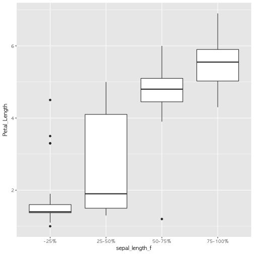

 

## 1. R과 스파크 [^datacamp-sparklyr]

R은 데이터분석 코드를 빠르고 가독성 좋게 작성하기 좋은 언어다.
마찬가지로 아파치 스파크(Apache Spark)은 엄청 큰 빅데이터를 빠르게 분석하기 좋도록 설계되었다.
`sparklyr`은 스파크 클러스터에 `dplyr` R코드를 작성해서 돌릴 수 있는 팩키지다.
즉, `dplyr` 팩키지 다양한 기능을 스파크 데이터프레임에 적용하여 데이터 분석 작업을 수행할 수 있다는 의미가 된다.

[^datacamp-sparklyr]: [Introduction to Spark in R using sparklyr](https://www.datacamp.com/courses/introduction-to-spark-in-r-using-sparklyr)

R이 데이터분석에 최적화되어 있어 시각화나 데이터를 다루는데 뛰어난 성능과 기능을 자랑하지만 한가지 한계가 **메모리(memory)**를 넘어서는 데이터는 다루지 못하는 한계가 있다.
반면에 스파크는 오픈소스 클러스터 컴퓨팅 플랫폼이라 거의 무한대 크기의 데이터를 다룰 수 있다.

따라서, R과 스파크의 장점을 결합하고자 하는 노력이 있었고, 그 일환으로 `sparklyr`이 개발되어 빅데이터를 `dplyr` 사상에 따라 자유로이 분석할 수 있게 되었다.
빅데이터를 스파크 클러스터에 올려 `dplyr` 구문으로 분석할 수 있는 길이 열린 것이다.

## 2. 스파크 헬로우 월드

R에서 로컬 컴퓨터에 스파크를 설치하고 이를 운영하는 것은 간단하다.
`spark_install()` 명령어로 설치하고 나서 `spark_connect()`를 통해 로컬 컴퓨터에 구축된
스파크 클러스트에 연결한다. `spark_version()`을 확인하고 나서, `spark_disconnect()` 명령어로 
스파크 클러스트 연결을 종료한다.

~~~{.r}
# 1. 설치
install.packages("sparklyr")
library(sparklyr)
spark_install()

# 2. 스파크 클러스터 연결
sc <-spark_connect(master="local")

## 2.1. 스파크 버젼 확인
spark_version(sc=sc)

# 3. 스파크 연결해제
spark_disconnect(sc=sc)
~~~

## 3. `csv` 파일 불러오기

스파크 클러스터가 완료되면 가장 먼저 해야 할 일은 스파크 클러스터에서 분석할 데이터를 불러오는 것이다.
`.csv` 파일을 R로 `read_csv()` 함수로 불러오는 것과 마찬가지로 `spark_read_csv()` 함수를 통해 직접 불러오거나,
이미 데이터프레임으로 R에서 분석가능한 형태로 존재하게 되면 `copy_to()` 명령어를 통해 스파크에 전달한다.

> ### 주의할 점 {.callout}
>
> `copy_to()` 명령어는 기본적으로 **복사(copy)** 작업으로 느린 특성이 있다.
> 따라서 이런 작업은 가능하면 회피하고 다른 최적의 전략을 탐색한다.
> `copy_to()`에 대응되는 `collect()` 작업도 마찬가지로 특별한 경우나 당위성이 없다면 다른 최적화 방법을 탐색한다.

`iris` 데이터프레임을 스파크 클러스터로 전달하는 명령어는 `copy_to(sc, iris)`으로 스파크 클러스트(sc)에 `iris`를 복사해 보낸다.
`src_tbls`

~~~{.r}
glimpse(iris)
~~~

~~~{.output}
Observations: 150
Variables: 5
$ Sepal.Length <dbl> 5.1, 4.9, 4.7, 4.6, 5.0, 5.4, 4.6, 5.0, 4.4, 4.9,...
$ Sepal.Width  <dbl> 3.5, 3.0, 3.2, 3.1, 3.6, 3.9, 3.4, 3.4, 2.9, 3.1,...
$ Petal.Length <dbl> 1.4, 1.4, 1.3, 1.5, 1.4, 1.7, 1.4, 1.5, 1.4, 1.5,...
$ Petal.Width  <dbl> 0.2, 0.2, 0.2, 0.2, 0.2, 0.4, 0.3, 0.2, 0.2, 0.1,...
$ Species      <fctr> setosa, setosa, setosa, setosa, setosa, setosa, ...

~~~

~~~{.r}
# Sys.setenv(SPARK_HOME="C:/spark-1.6.2-bin-hadoop2.6")

sc <-spark_connect(master="local")

iris_tbl <- copy_to(sc, iris)

src_tbls(sc)
~~~

~~~{.output}
[1] "iris"

~~~

### 3.1. 빅데이터와 `tibble()` 자료구조

`copy_to()` 명령어를 통해 반환되는 객체는 `tibble()`이다. 티블은 data.frame 객체를 내부에 갖고 있을 수도 있고,
원격 객체 (데이터베이스 등)를 갖을 수 있고 다양한 출력명령어를 지원한다.
따라서, 티블(tibble)로 데이터를 반환받게 되면 크기는 매우 작고 다양한 출력기능을 활용할 수 있고, 실제 데이터는 스파크 클러스터에 존재한다.

~~~{.r}
# iris_tbl 티블 객체에 `iris` 스파크 데이터프레임을 `tbl()` 명령어로 연결
iris_tbl <- tbl(sc, "iris")

dim(iris_tbl)
~~~

~~~{.output}
[1] 150   5

~~~

~~~{.r}
pryr::object_size(iris_tbl)
~~~

~~~{.output}
9.89 kB

~~~

~~~{.r}
# 출력
print(iris_tbl, n=6, width = Inf)
~~~

~~~{.output}
Source:   query [150 x 5]
Database: spark connection master=local[8] app=sparklyr local=TRUE

# A tibble: 150 x 5
  Sepal_Length Sepal_Width Petal_Length Petal_Width Species
         <dbl>       <dbl>        <dbl>       <dbl>   <chr>
1          5.1         3.5          1.4         0.2  setosa
2          4.9         3.0          1.4         0.2  setosa
3          4.7         3.2          1.3         0.2  setosa
4          4.6         3.1          1.5         0.2  setosa
5          5.0         3.6          1.4         0.2  setosa
6          5.4         3.9          1.7         0.4  setosa
# ... with 144 more rows

~~~

~~~{.r}
# 스파크 데이터프레임 자료구조 확인
glimpse(iris_tbl)
~~~

~~~{.output}
Observations: 150
Variables: 5

~~~

~~~{.output}
Error in if (width[i] <= max_width[i]) next: TRUE/FALSE가 필요한 곳에 값이 없습니다

~~~

`pryr::object_size` 명령어를 통해 크기를 확인할 수 있다.

## 4. `dplyr` 데이터 처리

### 4.1. `dplyr` 기본 

스파크 데이터프레임을 `sparklyr` 팩키지를 통해 `tibble()` 자료형으로 연결시키고 나면 `dplyr` 명령어를 다수 활용할 수 있다.
가장 기본적인 `dplyr` 명령어는 다음과 같다.

- select: 변수 선택
- filter: 관측점 선택
- arrange: 정렬
- mutate: 변수 생성
- summarize: 총합/요약

~~~{.r}
copy_to(sc, iris, overwrite = TRUE)
~~~

~~~{.output}
Source:   query [150 x 5]
Database: spark connection master=local[8] app=sparklyr local=TRUE

# A tibble: 150 x 5
   Sepal_Length Sepal_Width Petal_Length Petal_Width Species
          <dbl>       <dbl>        <dbl>       <dbl>   <chr>
 1          5.1         3.5          1.4         0.2  setosa
 2          4.9         3.0          1.4         0.2  setosa
 3          4.7         3.2          1.3         0.2  setosa
 4          4.6         3.1          1.5         0.2  setosa
 5          5.0         3.6          1.4         0.2  setosa
 6          5.4         3.9          1.7         0.4  setosa
 7          4.6         3.4          1.4         0.3  setosa
 8          5.0         3.4          1.5         0.2  setosa
 9          4.4         2.9          1.4         0.2  setosa
10          4.9         3.1          1.5         0.1  setosa
# ... with 140 more rows

~~~

~~~{.r}
iris_sdf_tbl <- tbl(sc, "iris")
glimpse(iris_sdf_tbl)
~~~

~~~{.output}
Observations: 150
Variables: 5

~~~

~~~{.output}
Error in if (width[i] <= max_width[i]) next: TRUE/FALSE가 필요한 곳에 값이 없습니다

~~~

~~~{.r}
# 2. 기본 데이터 처리 ------------------------------------------
## 2.1. select
iris_sdf_tbl %>% dplyr::select(Sepal_Length, Petal_Length, Species)
~~~

~~~{.output}
Source:   query [150 x 3]
Database: spark connection master=local[8] app=sparklyr local=TRUE

# A tibble: 150 x 3
   Sepal_Length Petal_Length Species
          <dbl>        <dbl>   <chr>
 1          5.1          1.4  setosa
 2          4.9          1.4  setosa
 3          4.7          1.3  setosa
 4          4.6          1.5  setosa
 5          5.0          1.4  setosa
 6          5.4          1.7  setosa
 7          4.6          1.4  setosa
 8          5.0          1.5  setosa
 9          4.4          1.4  setosa
10          4.9          1.5  setosa
# ... with 140 more rows

~~~

~~~{.r}
## 2.2. filter
iris_sdf_tbl %>% dplyr::select(Sepal_Length, Petal_Length, Species) %>% 
  dplyr::filter(Sepal_Length > 5.0, Petal_Length > 5)
~~~

~~~{.output}
Source:   query [42 x 3]
Database: spark connection master=local[8] app=sparklyr local=TRUE

# A tibble: 42 x 3
   Sepal_Length Petal_Length    Species
          <dbl>        <dbl>      <chr>
 1          6.0          5.1 versicolor
 2          6.3          6.0  virginica
 3          5.8          5.1  virginica
 4          7.1          5.9  virginica
 5          6.3          5.6  virginica
 6          6.5          5.8  virginica
 7          7.6          6.6  virginica
 8          7.3          6.3  virginica
 9          6.7          5.8  virginica
10          7.2          6.1  virginica
# ... with 32 more rows

~~~

~~~{.r}
## 2.3. arrange
iris_sdf_tbl %>% dplyr::select(Sepal_Length, Petal_Length, Species) %>% 
  dplyr::filter(Sepal_Length > 5.0, Petal_Length > 5) %>% 
  arrange(Species, desc(Petal_Length), Sepal_Length)
~~~

~~~{.output}
Source:   query [42 x 3]
Database: spark connection master=local[8] app=sparklyr local=TRUE

# A tibble: 42 x 3
   Sepal_Length Petal_Length    Species
          <dbl>        <dbl>      <chr>
 1          6.0          5.1 versicolor
 2          7.7          6.9  virginica
 3          7.7          6.7  virginica
 4          7.7          6.7  virginica
 5          7.6          6.6  virginica
 6          7.9          6.4  virginica
 7          7.3          6.3  virginica
 8          7.2          6.1  virginica
 9          7.4          6.1  virginica
10          7.7          6.1  virginica
# ... with 32 more rows

~~~

~~~{.r}
## 2.4. mutate
iris_sdf_tbl %>% dplyr::select(Sepal_Length, Petal_Length, Species) %>% 
  dplyr::filter(Sepal_Length > 5.0, Petal_Length > 5) %>% 
  arrange(Species, desc(Petal_Length), Sepal_Length) %>% 
  mutate(log_Sepal_Length = log(Sepal_Length))
~~~

~~~{.output}
Source:   query [42 x 4]
Database: spark connection master=local[8] app=sparklyr local=TRUE

# A tibble: 42 x 4
   Sepal_Length Petal_Length    Species log_Sepal_Length
          <dbl>        <dbl>      <chr>            <dbl>
 1          6.0          5.1 versicolor        0.5581106
 2          7.7          6.9  virginica        0.4899030
 3          7.7          6.7  virginica        0.4899030
 4          7.7          6.7  virginica        0.4899030
 5          7.6          6.6  virginica        0.4930606
 6          7.9          6.4  virginica        0.4838251
 7          7.3          6.3  virginica        0.5030499
 8          7.2          6.1  virginica        0.5065648
 9          7.4          6.1  virginica        0.4996303
10          7.7          6.1  virginica        0.4899030
# ... with 32 more rows

~~~

~~~{.r}
## 2.5. summarize
iris_sdf_tbl %>% dplyr::select(Sepal_Length, Petal_Length, Species) %>% 
  dplyr::filter(Sepal_Length > 5.0, Petal_Length > 5) %>% 
  arrange(Species, desc(Petal_Length), Sepal_Length) %>% 
  mutate(log_Sepal_Length = log(Sepal_Length)) %>% 
  dplyr::summarise(mean_sepal_length = mean(Sepal_Length),
                   max_petal_legnth = max(Petal_Length))
~~~

~~~{.output}
Source:   query [1 x 2]
Database: spark connection master=local[8] app=sparklyr local=TRUE

# A tibble: 1 x 2
  mean_sepal_length max_petal_legnth
              <dbl>            <dbl>
1          6.721429              6.9

~~~

### 4.2. `dplyr` 고급 기능

변수를 선택할 때 `starts_with`, `ends_with`, `contain` 등을 활용할 수 있고,
`distinct`도 변수내 포함된 범주를 식별할 때 도움이 많이 된다.
특히, 범주형 변수의 경우 `count` 함수에 정렬 `sort=TRUE`를 넣고 `top_n` 을 통해
상위 출현빈도가 많은 범주를 찾아내는 것도 많이 활용되는 패턴이다.

`group_by` 함수를 함께 넣어 집단별로 요약통계량을 계산하는 것도 가능히다.

`dplyr`에서 데이터를 다루는 R 코드를 작성하면 내부적으로 이를 SQL 문으로 변환시켜 스파크 클러스터에 전달시킨다.
따라서, `spark_connect`에서 정의한 SPARK Context를 인자로 넣고 SQL 문장을 넣으면 R 코드로 작성한 동일한 결과를 얻게 된다.
`dplyr` R 코드가 SQL 코드로 변환한 것을 확인하고자 할 경우, 혹은 R을 모르는 다른 개발자와 SQL로 의사소통을 하고자 할 때,
`explain` 명령어를 통해 SQL 코드를 얻을 수 있다.

~~~{.r}
# 3. 고급 데이터 처리 ------------------------------------------
## 3.1. select 
iris_sdf_tbl %>% dplyr::select(starts_with("Sepal"), Species)
~~~

~~~{.output}
Source:   query [150 x 3]
Database: spark connection master=local[8] app=sparklyr local=TRUE

# A tibble: 150 x 3
   Sepal_Length Sepal_Width Species
          <dbl>       <dbl>   <chr>
 1          5.1         3.5  setosa
 2          4.9         3.0  setosa
 3          4.7         3.2  setosa
 4          4.6         3.1  setosa
 5          5.0         3.6  setosa
 6          5.4         3.9  setosa
 7          4.6         3.4  setosa
 8          5.0         3.4  setosa
 9          4.4         2.9  setosa
10          4.9         3.1  setosa
# ... with 140 more rows

~~~

~~~{.r}
## 3.2. filter
iris_sdf_tbl %>% distinct(Species)
~~~

~~~{.output}
Source:   query [3 x 1]
Database: spark connection master=local[8] app=sparklyr local=TRUE

# A tibble: 3 x 1
     Species
       <chr>
1  virginica
2 versicolor
3     setosa

~~~

~~~{.r}
## 3.3. 계수(count)
iris_sdf_tbl %>% dplyr::count(Species, sort=TRUE) %>% 
  dplyr::top_n(3) %>% 
  explain() #버그 https://github.com/rstudio/sparklyr/issues/645
## 3.4. group_by
iris_sdf_tbl %>% dplyr::select(Sepal_Length, Petal_Length, Species) %>% 
  dplyr::filter(Sepal_Length > 1.0, Petal_Length > 1.5) %>% 
  mutate(log_Sepal_Length = log(Sepal_Length)) %>% 
  group_by(Species) %>% 
  dplyr::summarise(mean_sepal_length = mean(Sepal_Length),
                   max_petal_legnth = max(Petal_Length)) %>% 
  arrange(mean_sepal_length)
~~~

~~~{.output}
Source:   query [3 x 3]
Database: spark connection master=local[8] app=sparklyr local=TRUE

# A tibble: 3 x 3
     Species mean_sepal_length max_petal_legnth
       <chr>             <dbl>            <dbl>
1     setosa          5.069231              1.9
2 versicolor          5.936000              5.1
3  virginica          6.588000              6.9

~~~

~~~{.r}
## 3.5. SQL
iris_sdf_tbl %>% dplyr::select(Sepal_Length, Petal_Length, Species) %>% 
  dplyr::filter(Sepal_Length > 1.0, Petal_Length > 1.5) %>% 
  mutate(log_Sepal_Length = log(Sepal_Length)) %>% 
  group_by(Species) %>% 
  dplyr::summarise(mean_sepal_length = mean(Sepal_Length),
                   max_petal_legnth = max(Petal_Length)) %>% 
  arrange(mean_sepal_length) %>% 
  explain()

DBI::dbGetQuery(sc, 
        "SELECT `Species`, AVG(`Sepal_Length`) AS `mean_sepal_length`, MAX(`Petal_Length`) AS `max_petal_legnth`
                FROM (SELECT `Sepal_Length`, `Petal_Length`, `Species`, ln(`Sepal_Length`) AS `log_Sepal_Length`
                FROM (SELECT *
                FROM (SELECT `Sepal_Length` AS `Sepal_Length`, `Petal_Length` AS `Petal_Length`, `Species` AS `Species`
                FROM `iris`) `rvbmbsphdh`
                WHERE ((`Sepal_Length` > 1.0) AND (`Petal_Length` > 1.5))) `stgslkujqx`) `uwmrkgahqh`
                GROUP BY `Species`
                ORDER BY `mean_sepal_length`")
~~~

~~~{.output}
     Species mean_sepal_length max_petal_legnth
1     setosa          5.069231              1.9
2 versicolor          5.936000              5.1
3  virginica          6.588000              6.9

~~~

## 5. 데이터프레임 변환과 중간결과 저장

영구저장소에 저장된 `.csv` 파일을 메모리로 불러올릴 때 `read_csv` 함수를 사용해서 
R 데이터 프레임으로 변환시킨다. 마찬가지로 R 데이터프레임을 스파크 클러스터 데이터프레임으로 보낼 때 
`copy_to` 함수를 사용해서 복사를 한다. 

이제 반대로 스파크 클러스터에 있는 스파크 데이터프레임을 R 데이터프레임으로 변환시키는 작업이 필요한데
이런 경우 `collect()` 함수를 활용하여 스파크 데이터프레임을 R 데이터프레임으로 변환시키게 된다.

`dplyr` 툴체인을 사용하게 되면 파이프 연산이 길어질 경우 중간에 "뻑(?)"이 나거나 다운되는 경우도 흔하다.
이런 경우 중간 결과를 저장하기 위해서 `compute` 명령어에 인자값으로 스파크 데이터프레임 이름을 붙이게 되면
안정적인 후속작업도 가능하다.

~~~{.r}
# 1. 데이터프레임 변환 -----------------------------------------------
iris_df <- iris_sdf_tbl %>% 
  dplyr::select(starts_with("Sepal"), Species) %>% 
  collect()

class(iris_df)
~~~

~~~{.output}
[1] "tbl_df"     "tbl"        "data.frame"

~~~

~~~{.r}
# 2. 중간결과 저장 -----------------------------------------------
iris_sepal <- iris_sdf_tbl %>%
  dplyr::select(starts_with("Sepal"), Species) %>% 
  compute("iris_sepal")

src_tbls(sc)
~~~

~~~{.output}
[1] "iris"       "iris_sepal"

~~~

~~~{.r}
class(iris_sepal)
~~~

~~~{.output}
[1] "tbl_spark" "tbl_sql"   "tbl_lazy"  "tbl"      

~~~

## 6. 기계학습 사전 준비

### 6.1. 스파크, R 스키마 비교

스파크는 엄격한 자료형을 갖고 있고 동시에 
통계학이나 데이터분석에서 많이 활용되는 요인(factor)에 대한 개념이 없기 때문에
이를 별도로 구현해야 하고 데이터분석 과정에 반영을 시켜야 된다.

| R 자료형 (한글)| R 자료형  | 스파크 자료형|
|----------------|-----------|--------------|
|   논리형       | logical   | BooleanType  |
|   숫자형       | numeric   | DoubleType   |
|   정수형       | integer   | IntegerType  |
|   문자형       | character | StringType   |
|   리스트       | list      | ArrayType    |

### 6.2. 스파크에서 제공하는 기능(함수)

`dplyr`에서 제공되는 함수 외에 함수명 시작이 `ft_`, `sdf_`, `ml_`로 시작되는 함수들이 있다.

- `sdf_` : 스파크에서 지원하는 함수
- `ft_` : 변수 변환(feature transformation)으로 예측모형의 전처리로 사용되는 함수
- `ml_` : 기계학습 기능을 지원하는 함수

연속형 변수를 이산화하여 범주형 변수로 만들 경우 `ft_binarizer` 함수나
`ft_bucketizer` 함수를 활용한다. `ft_bucketizer` 함수는 R환경에서 
`cut()` + `quantile()` 함수를 조합한 기능을 한방에 지원한다.

~~~{.r}
# 1. 스파크 데이터프레임 스키마
(iris_schema <- sdf_schema(iris_sdf_tbl))
~~~

~~~{.output}
$Sepal_Length
$Sepal_Length$name
[1] "Sepal_Length"

$Sepal_Length$type
[1] "DoubleType"

$Sepal_Width
$Sepal_Width$name
[1] "Sepal_Width"

$Sepal_Width$type
[1] "DoubleType"

$Petal_Length
$Petal_Length$name
[1] "Petal_Length"

$Petal_Length$type
[1] "DoubleType"

$Petal_Width
$Petal_Width$name
[1] "Petal_Width"

$Petal_Width$type
[1] "DoubleType"

$Species
$Species$name
[1] "Species"

$Species$type
[1] "StringType"

~~~

~~~{.r}
iris_schema %>% 
  lapply(function(x) do.call(data.frame, x)) %>% 
  bind_rows()
~~~

~~~{.output}
          name       type
1 Sepal_Length DoubleType
2  Sepal_Width DoubleType
3 Petal_Length DoubleType
4  Petal_Width DoubleType
5      Species StringType

~~~

~~~{.r}
# 2. 스파크 요인(Factor) -----------------------------------------------
## 2.1. 요인(factor) 변환
iris_sdf_df <- iris_sdf_tbl %>%
  dplyr::select(Sepal_Length) %>%
  ft_binarizer("Sepal_Length", "sepal_length_f", 4.8) %>%
  collect() %>%
  mutate(sepal_length_f = as.logical(sepal_length_f))

ggplot(iris_sdf_df, aes(sepal_length_f)) +
  geom_bar()
~~~

~~~{.r}
## 2.2. 연속형 변수를 범주형 변환 (I)

sepal_split <- quantile(iris$Sepal.Length, c(0, 0.25, 0.5, 0.75, 1))
sepal_split_labels <- c("-25%", "25-50%", "50-75%", "75-100%")

iris_sdf_df <- iris_sdf_tbl %>%
  dplyr::select(Sepal_Length, Petal_Length) %>%
  mutate(Sepal_Length = as.numeric(Sepal_Length)) %>% 
  ft_bucketizer("Sepal_Length", "sepal_length_f", splits = sepal_split) %>%
  collect() %>% 
  mutate(sepal_length_f = factor(sepal_length_f, labels=sepal_split_labels))

ggplot(iris_sdf_df, aes(sepal_length_f, Petal_Length)) +
  geom_boxplot()
~~~

~~~{.r}
## 2.2. 연속형 변수를 범주형 변환 (II)

iris_sdf_tbl %>%
  dplyr::select(Sepal_Length, Petal_Length) %>%
  mutate(Sepal_Length = as.numeric(Sepal_Length)) %>% 
  ft_quantile_discretizer("Sepal_Length", "sepal_length_f", n.buckets = 4) %>%
  collect() %>% 
  mutate(sepal_length_f = factor(sepal_length_f, labels=sepal_split_labels)) %>% 
  ggplot(aes(sepal_length_f, Petal_Length)) +
  geom_boxplot()
~~~

### 6.3. 기계학습 예측 모형 

기계학습을 위한 모형이 준비되었다면 다음 단계로 스파크 빅데이터에서 
`sdf_sample` 함수를 사용하여 표본을 추출(10%)하여 탐색적 데이터분석(EDA)을 진행하는 것도 권장된다.

예측모형을 개발하고자 하는 경우 `sdf_partition` 함수를 통해 훈련데이터와 검증 데이터로 나눠서 
훈련데이터를 예측모형(Random Forest) `ml_random_forest` 함수에 넣어 예측모형을 개발하고 나서,
검증 데이터로 예측모형의 성능을 점검한다. 

~~~{.r}
# 1. 기계학습 -----------------------------------------------
## 1.1. 표본추출 --------------------------------------------
iris_sdf_tbl %>% 
  sdf_sample(fraction = 0.1, replacement=FALSE) %>% 
  compute("iris_10_pcnt")
~~~

~~~{.output}
Source:   query [10 x 5]
Database: spark connection master=local[8] app=sparklyr local=TRUE

# A tibble: 10 x 5
   Sepal_Length Sepal_Width Petal_Length Petal_Width    Species
          <dbl>       <dbl>        <dbl>       <dbl>      <chr>
 1          4.4         2.9          1.4         0.2     setosa
 2          5.7         4.4          1.5         0.4     setosa
 3          5.4         3.9          1.3         0.4     setosa
 4          5.0         3.2          1.2         0.2     setosa
 5          5.9         3.0          4.2         1.5 versicolor
 6          6.4         3.2          5.3         2.3  virginica
 7          6.9         3.2          5.7         2.3  virginica
 8          5.6         2.8          4.9         2.0  virginica
 9          7.2         3.2          6.0         1.8  virginica
10          7.4         2.8          6.1         1.9  virginica

~~~

~~~{.r}
src_tbls(sc)
~~~

~~~{.output}
[1] "iris"         "iris_10_pcnt" "iris_sepal"  

~~~

~~~{.r}
iris_10_pcnt_tbl <- tbl(sc, "iris_10_pcnt")

glimpse(iris_10_pcnt_tbl)
~~~

~~~{.output}
Observations: 10
Variables: 5

~~~

~~~{.output}
Error in if (width[i] <= max_width[i]) next: TRUE/FALSE가 필요한 곳에 값이 없습니다

~~~

~~~{.r}
## 1.2. 훈련/테스트 데이터셋 -------------------------------
iris_split_tbl <- iris_sdf_tbl %>% 
  sdf_partition(training = 0.7, testing = 0.3)

iris_split_tbl$training %>% count
~~~

~~~{.output}
Source:   query [1 x 1]
Database: spark connection master=local[8] app=sparklyr local=TRUE

# A tibble: 1 x 1
      n
  <dbl>
1   113

~~~

~~~{.r}
iris_split_tbl$testing %>% count
~~~

~~~{.output}
Source:   query [1 x 1]
Database: spark connection master=local[8] app=sparklyr local=TRUE

# A tibble: 1 x 1
      n
  <dbl>
1    37

~~~

~~~{.r}
## 1.3. 모형적합 --------------------------------------------

feature_columns <- iris_split_tbl$training %>% 
  colnames(iris_split_tbl$training) %>% 
  stringr::str_subset("[^Species]")

iris_rf <- iris_split_tbl$training %>%
  ml_random_forest("Species", feature_columns)

iris_responses <- iris_split_tbl$testing %>%
  select(Species) %>%
  collect() %>%
  mutate(
    predicted_species = predict(
      iris_rf,
      iris_split_tbl$testing
    )
  )

table(iris_responses)
~~~

~~~{.output}
            predicted_species
Species      setosa versicolor virginica
  setosa         10          2         0
  versicolor      1          6         2
  virginica       0          3        13

~~~

~~~{.r}
ggplot(iris_responses, aes(Species, predicted_species)) +
  geom_jitter(width = 0.15, height=0.15, aes(colour = Species), alpha=0.3) +
  geom_abline(intercept=0, slope=1)
~~~

