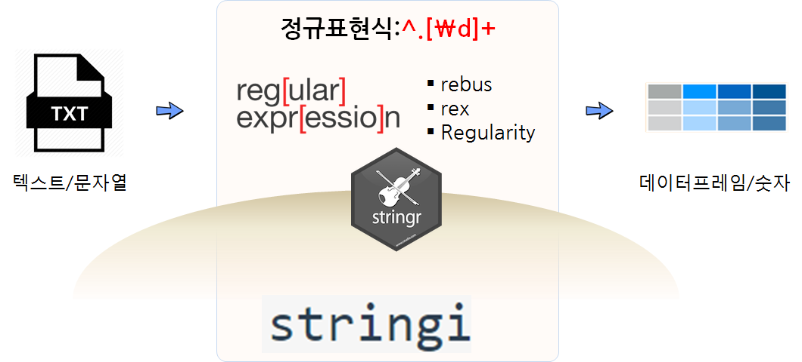

 
``` {r, include=FALSE}
source("tools/chunk-options.R")
devtools::install_github("richierocks/rebus")
library(rebus)
library(stringr)
library(stringi)
```

## 텍스트/문자열을 다루는 R 툴체인

텍스트 데이터는 신문기사, 책, 블로그, 채팅로그 등 다양한 형태로 나타난다. 이런 텍스트를 다루는데 별도 언어가 필요한데 
이것이 **정규표현식(regular expression)**이다. 강력한 정규표현식을 사용하기 위해서 기본적으로 R에서 문자열을 불러오고 패턴을 매칭하고,
문자열 일부를 떼어내고 등등 다양한 기능을 수행하는 팩키지가 있다. 물론 R `Base`의 기본 기능함수도 있지만, `stringi`, `stringr`, `rebus` 팩키지를 조합하여 
사용하는 것이 생산성을 최대한 끌어올릴 수 있다.



- [rebus: Regular Expression Builder, Um, Something](https://github.com/richierocks/rebus): 사람이 읽고 사용하기 쉬운 형태로 바꾼 정규식 구현 팩키지
- [stringr](https://github.com/tidyverse/stringr): RStudio 개발환경에서 `str_` + 탭완성 기능을 조합하여 일관성을 갖고 가장 많이 사용되는 문자열 처리 기능을 함수로 제공하는 팩키지
- [stringi](https://github.com/gagolews/stringi): 속도 및 확장성, 기능에서 R 환경에서 타의 추종을 불허하는 기본 문자열 처리 R 팩키지

텍스트/문자열 처리작업을 수행할 때 `tidyverse` 팩키지와 마찬가지로 복잡하고 난잡한 부분을 가능하면 숨기고 나서 가장 많이 활용되는 기능만 뽑아서 가장 생산성 높게 사용하는 툴체인으로 활용가능하다.

## 문자열 기본 작업

### 문자열 찾고, 문자열 쪼개고, 문자열 치환

기본적으로 작업하는 기본 문자열 작업은 문자열을 찾고, 문자열을 쪼개고, 문자열을 치환하는 작업이다.
`stringr`에서 문자열 매칭에 문자열을 탐지하고, 탐지된 문자열을 뽑아내고, 매칭된 문자열 갯수를 찾아내는 기본작업을 지원한다.
이런 기본기 작업에 활용되는 다음과 같다.

- `str_detect()`
- `str_subset()`
- `str_count()`

문자열을 특정 패터에 맞춰 쪼개고 나면 `str_split()` 함수를 통해 반환되는 객체는 리스트 자료형이 된다. 왜냐하면 고정된 길이를 갖지 않을 수 있기 때문에
반환되는 리스트를 `lapply()` 함수와 연동하여 길이를 바로 구하는 것도 많이 작어되는 기본 작업 패턴이다. 
그리고 `str_replace()`, `str_replace_all()` 함수를 활용하여 문자열을 치환하는 것도 많이 사용되는 패턴이다.

``` {r basic-string-manipulation, warning=FALSE, message=FALSE}
# 1. 문자열 매칭하기 -------------------------
hangul <- c("자동차", "한국", "한국산 자동차와 손수레")

str_detect(string = hangul, pattern = "자동차")
str_detect(string = hangul, pattern = fixed("자동차"))
str_subset(string = hangul, pattern = fixed("자동차"))
str_count(string = hangul, pattern = fixed("자동차"))

# 2. 문자열 쪼개기 -------------------------
hangul <- c("한국산 자동차와 손수레 그리고 오토바이")

str_split(hangul, pattern = " 그리고 |와")
str_split(hangul, pattern = " 그리고 |와", n=2)

hanguls <- c("한국산 자동차와 손수레 그리고 오토바이",
             "독일산 자동차 그리고 아우토반")

str_split(hanguls, pattern = " 그리고 |와", simplify = TRUE)

hanguls_split <- str_split(hanguls, pattern = " 그리고 |와")

lapply(hanguls_split, length)

# 3. 매칭된 문자열 치환 --------------------

str_replace_all(hanguls,
                pattern = "와",
                replacement = " 그리고")
```

## 정규(표현)식

정규(표현)식을 문자열에 적용할 경우 기본적으로 다음과 같이 코드를 준비한다.

- 입력 문자열을 별도로 떼어내어 준비: 예를 들어, `auto_v`
- 정규식 패턴을 별도로 떼어내어 작성: 예를 들어, `regex_pattern`
- 문자열 작업에 맞는 함수를 선택: 예를 들어 문자열을 매칭하려면, `str_detect()`

입력 문자열과 문자열 작업에 맞는 함수를 선택하는 것은 상대적으로 변수가 많이 없는데 정규표현식 패턴을 작성하는 작업은 별도로 작성하는 것이 정신건강에 좋다.
특히, `str_view()` 함수를 사용하게 되면 패턴에 매칭된 결과를 시각적으로 빠르게 확인할 수 있다.

### `rebus` 정규식

`^.\\d+` 정규표현식은 다른 언어에서 `^.\d+`와 같은 것으로 `\` 한번 더 들어가는 것을 유의한다.
의미는 `^` 시작한다는 의미가 되는데 `.` 한 문자로 시작되고 `\\d` 숫자 하나를 의미하는데 `+`가 있어 숫자를 다수 의미한다.


|         문자열 패턴        |        정규표현식            |           `rebus`             |
|----------------------------|:----------------------------:|:-----------------------------:|
| 문자열 시작                |             `^`              |             START             |
| 문자열 끝                  |             `$`              |              END              |
| 임의 문자 하나             |             `.`              |           ANY_CHAR            |
| 또는(alternation)          |             `|`              |              or / or1         |
| 문자 클래스(character class) |         `[Aa]`             |           char_class("Aa")    |
| 여문자 클래스              |          `[^Aa]`             |   negated_char_class("Aa")    |
| 선택옵션                   |            `?`               |      optional()               |
| 0번 혹은 그 이상           |            `*`               |     zero_or_more()            |
| 1번 혹은 그 이상           |            `+`               |     one_or_more()             |
| n번에서 m번까지            |            `{n}{m}`          |     repeated()                |
| 숫자만                     |           `[0-9]`            |     DGT 혹은 char_class("0-9") |
| 단어                       |       `[a-zA-z0-9_]`         |  WRD 혹은 char_class("a-zA-z0-9_") |
| 화이트스페이스 문자        |             `\s`             |         SPC                   |
| 한글                       |          `[가-흫]`           |      char_class("가-흫")      |


``` {r basic-rebus-basic, warning=FALSE, message=FALSE}
# 1. 정규식 들어가며 -------------------------
auto_v <- c("자동차", "Korean 자동차", "한국산 자동차와 손수레", "2017년식 한국형")

regex_pattern <- "^.\\d+"

str_detect(auto_v, pattern = regex_pattern)

rebus_pattern <- START %R% 
    ANY_CHAR %R%
    one_or_more(DGT)

str_detect(auto_v, pattern = rebus_pattern)

str_view(auto_v, pattern = rebus_pattern)
```

### 한글 정규식

숫자(DGT), 단어(WRD), 화이트스페이스(SPC)와 같이 한글이 별도로 정의된 것이 없어 `char_class` 함수에 
한글 정규표현식을 담아 사용한다. 즉, 한글 한글자 추출 `char_class("가-흫")`, 한글 단어 추출은 
`one_or_more(char_class("가-흫"))` 표현식을 사용한다.

``` {r basic-rebus-hangul, warning=FALSE, message=FALSE}
# 2. 본격 정규식 -------------------------
auto_v <- c("자동차", "Korean 자동차", "한국산 자동차와 손수레", "2017년식 한국형")

regex_pattern <- fixed("손수레")
str_view(auto_v, pattern = regex_pattern)

hangul_pattern <- char_class("가-흫")
str_view(auto_v, pattern = hangul_pattern)

hangul_pattern <- one_or_more(char_class("가-흫"))
str_view(auto_v, pattern = hangul_pattern)

hangul_pattern <- repeated(one_or_more(char_class("가-흫")), 4)
str_view(auto_v, pattern = hangul_pattern)
```

### 포획(Capture)

포획(capture)을 잘 설명하는 예제는 달러의 달러부분과 센트 부분을 나누는 예제를 생각해볼 수 있다.
이런 경우 `caputre` 함수를 사용해서 결과 값을 달러와 센트로 나눠 저장하여 분석한다.

``` {r basic-rebus-capture, warning=FALSE, message=FALSE}
# 1. 포획(Catpure) -------------------------
## 1.1. 달러 -------------------------------
money_v <- c("$7.47", "$73.67", "$37.56")

money_pattern <- DOLLAR %R%
    capture(DGT %R% optional(DGT)) %R%
    DOT %R%
    capture(dgt(2))

str_match(money_v, pattern = money_pattern)

## 1.2. 원화 -------------------------------
kmoney_v <- c("\u20A97.47", "\u20A973.67", "\u20A937.56")

kmoney_pattern <- char_class("\u20A9") %R%
    capture(DGT %R% optional(DGT)) %R%
    DOT %R%
    capture(dgt(2))

str_match(kmoney_v, pattern = kmoney_pattern)
```

### 역참조(back reference) [^regex-blog]

[^regex-blog]: [Regex, 역참조 사용하기](http://minsone.github.io/regex/regexp-backreference)

역참조는 중복된 것을 찾아낼 때 사용할 수 있다. 즉, "자동차"가 두번 중복된 것을 찾아내고 
역참조 기능을 사용하여 `str_replace` 함수를 활용하여 공백으로 치환하여 제거한다.

``` {r basic-rebus-backreference, warning=FALSE, message=FALSE}
# 2. 역참조(backreferencing) -----------------------
## 2.1. 역참조하여 중복 찾아내기
auto_v <- c("자동차 한국", "한국산 자동차 자동차와 손수레")

str_view(auto_v,
         SPC %R%
             capture(one_or_more(char_class("가-흫"))) %R%
             SPC %R%
             REF1)

## 2.2. 역참조하여 치환
str_replace(auto_v,
         SPC %R%
             capture(one_or_more(char_class("가-흫"))) %R%
             SPC %R%
             REF1,
         replacement = str_c(" ", REF1))
```


## 정규표현식 사례 [^regex-email]

[^regex-email]: [Using a regular expression to validate an email address
](http://stackoverflow.com/questions/201323/using-a-regular-expression-to-validate-an-email-address/201378#201378)


정규표현식을 모든 문제에 대해 작성하는 것도 가능하지만, 전화번호, 전자우편, IP 주소와 같이 일반적으로 많이 사용되는 경우 
미리 검증된 정규표현식을 활용하는 것도 권장된다. 


``` {r regex-example, warning=FALSE, message=FALSE}
# 1. 전자우편 -------------------------

email_v <- c("email@example.com", "firstname.lastname@example.com", "email@subdomain.example.com")
email_pattern <- "^[[:alnum:].-_]+@[[:alnum:].-]+$"

str_match(email_v, email_pattern)

# 2. 전화번호 -------------------------
phone_v <- c("10.255.255.255", "(777) 757 0221", "Pick the phone at 751-525-1177", "567 Wall St", "유선전화: 577.665.2191 모바일: 888.777.0191")

separator <-  char_class("-.() ")
phone_pattern <- capture(dgt(3)) %R% zero_or_more(separator) %R% 
    capture(dgt(3)) %R% zero_or_more(separator) %R%
    capture(dgt(4))

phone_numbers <- str_match(phone_v, phone_pattern)

str_c(
    "(",
    phone_numbers[,2],
    ")",
    phone_numbers[,3],
    "-",
    phone_numbers[,4])

# 3. IP 주소 ----------------------------

ip_v <- c("10.0.0.0", "10.255.255.255", "16777216")

ip_element <- group(
    "25" %R% char_range(0, 5) %|%
        "2" %R% char_range(0, 4) %R% ascii_digit() %|%
        optional(char_class("01")) %R% optional(ascii_digit()) %R% ascii_digit()
)

ip_pattern <- BOUNDARY %R% 
    repeated(group(ip_element %R% DOT), 3) %R% 
    ip_element %R%
    BOUNDARY

str_match(ip_v, ip_pattern)
```