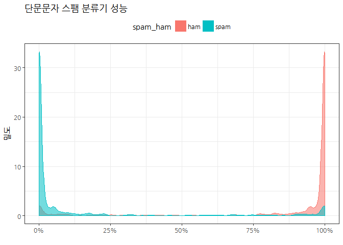

# xwMOOC 기계학습
 

## 1. 텍스트 분류(Text classification) [^apac-machine-learning-summit]

[^apac-machine-learning-summit]: [송치성, "Naïve or not", 바벨피쉬, APAC 머신러닝, 데이터 사이언스 커뮤니티 서밋](http://onoffmix.com/event/97444)

분류기는 사전 분류될 집단이 정해진 경우 어떤 집단에 속할 것인지 판별하여 지정하는 역할 수행한다.
텍스트 분류의 종류는 다음과 같은 것이 있다.

- 주제(Topic): 텍스트가 무엇에 관한 것인가 분류.
- 감정(Sentiment): 다양한 감정 상태 중 어떤 감정 상태에 가까운가 분류.
- 언어(Language): 어느 나라, 어느 민족 텍스트인지 분류.
- 쟝르(Genre): 텍스트가 어떤 쟝르(시, 소설, 등)에 속하는지 분류.
- 저자(Author): 텍스트를 보고 누구의 글인지 판별.
- ...

## 2. 베이즈 정리를 활용한 텍스트 분류기

전자우편/채팅이 스팸일 확률을 찾고자 하는데 베이즈 정리로 출발해서, 
단어가 하나인 경우를 경유하여 단어를 다수 포함한 전자우편/채팅으로 확장해 보자.

### 2.1. 베이즈 정리 

특정 단어가 나오면 그 전자우편/채팅이 스팸일 확률을 베이즈 정리를 활용하면 다음과 같다.

$$ P(s|w) = \frac {P(s,w)}{P(w)} = \frac {P(w|s)P(s)}{P(w)} $$

여기서, $P(w):$ 전자우편이나 채팅에서 특정단어가 출현할 확률(예를 들어, Sell, 팔아요 등), $P(s)$는 전자우편이나 채팅이 스팸일 확률

$$P(w) = P(w, s) + P(w, \sim s)$$

### 2.2. 단어 한개를 가정한 베이즈 정리

상기 관계를 이용하여 단어가 주어졌을 때 스팸일 확률을 다음과 같이 정리할 수 있다.

$$ P(s|w) = \frac {P(w|s)P(s)}{P(w)} = \frac {P(w|s)P(s)}{P(w, s) + P(w, \sim s)} = \frac {P(w|s)P(s)}{P(w|s)P(s) + P(w| \sim s)P(\sim s)}$$

즉, 스팸중에서 특정 단어가 출현할 조건부 확률 $P(w|s)$ 과 스팸이 아닌 것 중에 특정 단어가 출현할 확률 $P(w|\sim s)$만 알게 된다면 
단어가 주어졌을 때 스팸일 확률을 계산할 수 있게 된다.

### 2.2. 다수 단어를 가정한 베이즈 정리

우선 다수 단어를 $W$라고 가정한다. 즉, $W = w_1 , w_2 , \cdots , w_n$ 라고 다수 단어를 표현한다.
그리고, 각 단어가 서로 독립적이라는 가정을 넣으면 수식은 다음과 같이 단순화된다.

$$\begin{aligned} 
   P(s|W) &= \frac {P(W|s) P(s)}{P(W)} \\
          &= P(w_1 , w_2 , \cdots , w_n |s) P(s) \\
          &= P(w_1 |s)P(w_2 |s) \cdots P(w_n |s)
\end{aligned}
$$

## 3. SMS 단문문자 스팸 분류 [^nb-spam-classifier]

[^nb-spam-classifier]: [Jesus M. Castagnetto (2015-01-03), SPAM/HAM SMS classification using caret and Naive Bayes](https://rpubs.com/jesuscastagnetto/caret-naive-bayes-spam-ham-sms)

나이브 베이즈를 활용해서 SMS 단문문자 스팸 분류기 모형을 다음과 같이 개발할 수 있다.
가장 먼저, 데이터는 국내에도 SMS 단문문자 스팸데이터가 있다면 공유되면 좋을텐데 아쉽게도 해외 
Tiago A. Almeida, José Maria Gómez Hidalgo 분들이 생성한 `SMS Spam Collection v.1` 데이터를 활용한다.

### 3.1. 환경설정과 데이터 가져오기 

[http://www.dt.fee.unicamp.br/~tiago/smsspamcollection/smsspamcollection.zip](http://www.dt.fee.unicamp.br/~tiago/smsspamcollection/smsspamcollection.zip) 
웹사이트에서 직접 다운로드 해서 모형 개발 디렉토리 넣고 압축을 풀어 분석을 수행해도 된다.

~~~{.r}
# 0. 환경설정 -------------------------------------
# library(tidyverse)
# library(caret)
# library(tm)
# library(extrafont)
# loadfonts()
# library(ggthemes)
# library(doMC)
# registerDoMC(cores=4)

# 1. 데이터 가져오기 -------------------------------------

# if (!file.exists("smsspamcollection.zip")) {
#     download.file(url="http://www.dt.fee.unicamp.br/~tiago/smsspamcollection/smsspamcollection.zip",
#                   destfile="smsspamcollection.zip", method="curl")}
# 
# unzip("data/smsspamcollection.zip", exdir="./data")

sms_raw <- read_delim("data/SMSSpamCollection/SMSSpamCollection.txt", delim="\t", col_names = FALSE)
colnames(sms_raw) <- c("type", "text")
~~~

### 3.2. 데이터 전처리

기본적으로 스팸이냐 아니냐는 `sms_raw$type` 변수에 저장되어 있다.
즉, 스팸이냐 아니냐는 SMS 단문 메시지에 담긴 문자내용이 핵심인데, 
나이브 베이즈 모형에 넣도록 단어를 추출해서 이를 문선단어행렬(DocumentTermMatrix)로 변환한다.
그리고 훈련과 검증 데이터로 분할한다.

~~~{.r}
# 2. 데이터 전처리 -------------------------------------
sms_raw$type <- factor(sms_raw$type)

sms_corpus <- Corpus(VectorSource(sms_raw$text))
sms_corpus_clean <- sms_corpus %>%
    tm_map(content_transformer(tolower)) %>% 
    tm_map(removeNumbers) %>%
    tm_map(removeWords, stopwords(kind="en")) %>%
    tm_map(removePunctuation) %>%
    tm_map(stripWhitespace)

sms_dtm <- DocumentTermMatrix(sms_corpus_clean)

# 3. 기계학습 모형 -------------------------------------
## 3.1. 훈련/검증 데이터 -------------------------------
train_index <- createDataPartition(sms_raw$type, p=0.75, list=FALSE)
# 훈련/검증 데이터
sms_raw_train <- sms_raw[train_index,]
sms_raw_test <- sms_raw[-train_index,]

# 훈련/검증 텍스트 코퍼스
sms_corpus_clean_train <- sms_corpus_clean[train_index]
sms_corpus_clean_test <- sms_corpus_clean[-train_index]

# 훈련/검증 문서단어행렬
sms_dtm_train <- sms_dtm[train_index,]
sms_dtm_test <- sms_dtm[-train_index,]

## 3.2. 모형설계행렬 -------------------------------
sms_dict <- findFreqTerms(sms_dtm_train, lowfreq=5)
sms_train <- DocumentTermMatrix(sms_corpus_clean_train, list(dictionary=sms_dict))
sms_test <- DocumentTermMatrix(sms_corpus_clean_test, list(dictionary=sms_dict))

convert_counts <- function(x) {
    x <- ifelse(x > 0, 1, 0)
    x <- factor(x, levels = c(0, 1), labels = c("Absent", "Present"))
}

sms_train <- sms_train %>% apply(MARGIN=2, FUN=convert_counts)
sms_test <- sms_test %>% apply(MARGIN=2, FUN=convert_counts)

sms_train %>% tbl_df %>% 
    sample_n(100) %>% 
    dplyr::select(1:10) %>% 
    DT::datatable()
~~~

<!--html_preserve-->

<!--/html_preserve-->

### 3.3. 나이브 베이즈 모형

`caret` 팩키지에 내장된 나이브베이즈 모형에 적합시키고 성능을 시각화한다.
나이브베이즈 모형의 성능평가는 훈련데이터가 아니라 검증데이터를 활용하여 성능을 평가한다.
그리고, `ggplot`을 활용하여 스팸과 정상 SMS 확률을 시각화한다.

~~~{.r}
## 3.3. 베이즈모형 적합 -------------------------------
ctrl <- trainControl(method="cv", number=10, repeats=3)
nb_grid <- data.frame(.fL=c(1), .usekernel=c(FALSE), .adjust=c(FALSE))

system.time(
sms_nb_mod <- train(sms_train, sms_raw_train$type, 
                    method="nb",
                    tuneGrid = nb_grid,
                    trControl=ctrl)
)
~~~

~~~{.output}
   user  system elapsed 
  36.85    0.40   37.39 

~~~

~~~{.r}
sms_nb_mod
~~~

~~~{.output}
Naive Bayes 

3629 samples
1270 predictors
   2 classes: 'ham', 'spam' 

No pre-processing
Resampling: Cross-Validated (10 fold) 
Summary of sample sizes: 3267, 3266, 3266, 3266, 3266, 3266, ... 
Resampling results:

  Accuracy   Kappa    
  0.9767303  0.8915933

Tuning parameter 'fL' was held constant at a value of 1
Tuning
 parameter 'usekernel' was held constant at a value of FALSE

Tuning parameter 'adjust' was held constant at a value of FALSE

~~~

~~~{.r}
## 3.4. 베이즈모형 성능평가 -------------------------------

sms_nb_pred <- predict(sms_nb_mod, sms_test)
cm_nb <- confusionMatrix(sms_nb_pred, sms_raw_test$type, positive="spam")
cm_nb
~~~

~~~{.output}
Confusion Matrix and Statistics

          Reference
Prediction ham spam
      ham  944  136
      spam 105   23
                                          
               Accuracy : 0.8005          
                 95% CI : (0.7768, 0.8227)
    No Information Rate : 0.8684          
    P-Value [Acc > NIR] : 1.0000          
                                          
                  Kappa : 0.0486          
 Mcnemar's Test P-Value : 0.0533          
                                          
            Sensitivity : 0.14465         
            Specificity : 0.89990         
         Pos Pred Value : 0.17969         
         Neg Pred Value : 0.87407         
             Prevalence : 0.13162         
         Detection Rate : 0.01904         
   Detection Prevalence : 0.10596         
      Balanced Accuracy : 0.52228         
                                          
       'Positive' Class : spam            
                                          

~~~

~~~{.r}
## 3.5. 베이즈 모형평가 시각화 -------------------------------

sms_nb_prob <- predict(sms_nb_mod, sms_test, type="prob")

sms_nb_prob %>% 
  gather(spam_ham, prob) %>% 
  ggplot(., aes(x=prob)) +
    geom_density(aes(color=spam_ham, fill=spam_ham, alpha=0.3)) +
    theme_bw(base_family = "NanumGothic") +
    scale_x_continuous(labels = scales::percent) +
    labs(x="", y="밀도", title="단문문자 스팸 분류기 성능") +
    theme(legend.position = "top") +
    guides(alpha=FALSE)
~~~

## 4. 유방암 발병 예측 [^navie-bayes-breast-cancer]

[^navie-bayes-breast-cancer]: [Naive Bayes Classification in R (Part 2)](https://sw23993.wordpress.com/2017/02/17/naive-bayes-classification-in-r-part-2/)

슬로베니아 (구, 유고슬라비아) Matjaz Zwitter, Milan Soklic가 공개한 
[유방암(Breast Cancer Data Set) 데이터셋](https://archive.ics.uci.edu/ml/datasets/Breast+Cancer)은 현재 
UCI에 담당자에게 전자우편을 전달하면 2--3일 후 전달받을 수 있다.
나이브 베이즈를 활용하여 유방암 발병예측하는데 좋은 데이터셋으로 전체 변수가 모두 범주형으로 되어 있다.

### 4.1. 데이터 설명 

- class: 유방암 발병 여부
- age: 연령대 20-29 ~ 70-79
- menopause: 진단시 환자가 폐경인지 폐경이 아닌지 여부 
- tumor.size: 최대 절제 암 크기 직경(mm)
- inv.nodes: 림프노드 갯수(number of axillary lymph nodes)
- node.caps: 림프 노드 캡술에 전싱성 암이 포함되었는지 여부
- deg.malign: 암에 대한 조직학적 등급 분류 (1--3, 3 = 매우 비정상 세포)
- breast: 암이 왼쪽 오른쪽 어느 유방에 위치했나 
- breast.quad: 유방암이 발병한 지역 (유두를 중심으로 4분면)
- irradiat: 환자가 방사선 치료를 받았는지 여부 

### 4.1. 사전 준비 

UCI 담당자에게서 전달받은 데이터를 불러와서, 
데이터분석을 위해 변수명을 부여하고 문자형 데이터를 요인형 데이터로 변환시켜 `naiveBayes` 모형 적합시킬 준비를 한다.

~~~{.r}
# 0. 환경설정 -----------------------
# library(tidyverse)
# library(e1071)

# 1. 데이터 가져오기 -----------------------
breast_cancer <- read_csv("data/breast-cancer/breast-cancer.data", col_names = FALSE)

# 2. 데이터 전처리 -----------------------
names(breast_cancer) <- c("class", "age", "menopause", "tumor.size", "inv.nodes", "node.caps","deg.malign","breast","breast.quad","irradia")

breast_cancer <- breast_cancer %>% 
    mutate_all(funs(as.factor(.)))

# glimpse(breast_cancer)    
~~~

### 4.2. 나이브 베이즈 모형 적합

`e1071` 팩키지에 포함된 `naiveBayes` 모형을 활용하여 예측 모형을 생성한다.
그리고, 오차행렬을 통해 전체 데이터에 대한 예측 정확도를 평가한다.

~~~{.r}
# 3. 나이브 베이즈 모형 -----------------------
model <- naiveBayes(class ~ ., data = breast_cancer)
summary(model)
~~~

~~~{.output}
        Length Class  Mode     
apriori 2      table  numeric  
tables  9      -none- list     
levels  2      -none- character
call    4      -none- call     

~~~

~~~{.r}
# 4. 모형 성능평가 -----------------------
preds <- predict(model, newdata = breast_cancer)
(conf_matrix <- table(preds, breast_cancer$class))
~~~

~~~{.output}
                      
preds                  no-recurrence-events recurrence-events
  no-recurrence-events                  169                38
  recurrence-events                      32                47

~~~
