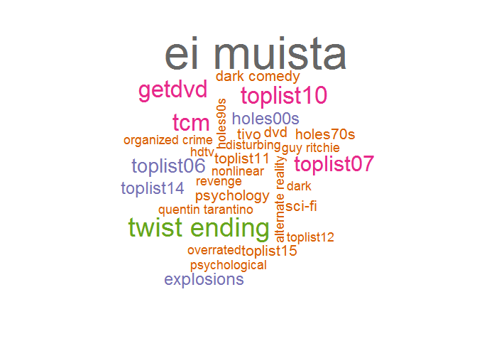

# xwMOOC 기계학습
 

## 1. 영화 

누구나 관심을 갖는 것이 영화다. 누구나 영화에 대한 추억, 회상, 시원함, 애틋한 감정 등이 있을것이다.
물론 해외 영화지만 가장 좋은 평점을 받은 데이터는 어떤 것인지 살펴보는 것도 큰 의미가 있을 듯하다.
또한, 참고한 해외 블로그가 무비렌즈 데이터를 예제로 하여 다양한 최근 R 기법을 소개하고 있어 더불어 익히는 것도 
좋을 듯 하다.

`ggplot2`에 IMDB 영화 데이터셋이 포함되어 있다. 과거에 그렇다는 것이다. `ggplot2` 팩키지 크기가 커져 
밖으로 빼서 [ggplot2movies](https://cran.r-project.org/web/packages/ggplot2movies/) 팩키지에서 새로이 제공되고 있으니,
평점 데이터를 가지고 데이터 분석을 시작하는 분들에게 좋은 출발점이 될 듯 하다.

- [ggplot2movies: Movies Data](https://cran.r-project.org/web/packages/ggplot2movies/)

## 2. 영화 데이터 분석

### 2.1. 무비렌즈 데이터

[무비렌즈(movieLens)](https://grouplens.org/datasets/movielens/) 데이터에 대한 내용을 확인하고 나서,
[movielens 웹사이트](http://files.grouplens.org/datasets/movielens/)에서 크롤링하여 가져온다.

~~~{.r}
# 0. 환경설정 --------------------------------
library(tidyverse)
library(skimr)
library(lubridate)
library(stringr)
library(rvest)
library(XML)
library(tidytext)
library(wordcloud)
library(ggthemes)
library(extrafont)
loadfonts()
library(doParallel)

# 1. 데이터 가져오기 -------------------------
## 1.1. 가져올 데이터 설정
url <- "http://files.grouplens.org/datasets/movielens/"
dataset_small <- "ml-latest-small"
dataset_full <- "ml-latest"
data_folder <- "data"
archive_type <- ".zip"

## 1.2. 작업 데이터 지정
dataset <- dataset_small
dataset_zip <- paste0(dataset, archive_type)

## 1.3. 데이터 가져와서 압축풀기
if (!file.exists(file.path(data_folder, dataset_zip))) {
    download.file(paste0(url, dataset_zip), file.path(data_folder, dataset_zip))
}

unzip(file.path(data_folder, dataset_zip), exdir = "data", overwrite = TRUE)

## 1.4. 작업결과 재확인
list.files('data/', recursive=TRUE)
~~~

### 2.2. 무비렌즈 데이터 전처리

다운로드 받은 압축파일을 풀 경우, "movies", "ratings", "links", "tags" CSV 파일이 풀린다.
이를 각각 불러와서 파일크기를 확인한다. 

사용자 평점 데이터, 영화데이터, 태그 데이터, 링크 데이터를 살펴보고 적절한 전처리를 수행한다.

~~~{.r}
## 1.5. 데이터 크기 확인
dataset_files <- c("movies", "ratings", "links", "tags")
suffix <- ".csv"

for (f in dataset_files) {
    path <- file.path(data_folder, dataset, paste0(f, suffix))
    assign(f, read_csv(path, col_types = cols()))
    print(paste(f, "파일크기:", format(object.size(get(f)), units="Mb")))
}
~~~

~~~{.output}
[1] "movies 파일크기: 0.9 Mb"
[1] "ratings 파일크기: 1.9 Mb"
[1] "links 파일크기: 0.6 Mb"
[1] "tags 파일크기: 0.1 Mb"

~~~

~~~{.r}
# 2. 데이터 전처리 -------------------------------
## 2.1. 사용자 평점 데이터 
ratings_df <- ratings %>%
    mutate(timestamp = as_datetime(timestamp))

glimpse(ratings_df)
~~~

~~~{.output}
Observations: 100,004
Variables: 4
$ userId    <int> 1, 1, 1, 1, 1, 1, 1, 1, 1, 1, 1, 1, 1, 1, 1, 1, 1, 1...
$ movieId   <int> 31, 1029, 1061, 1129, 1172, 1263, 1287, 1293, 1339, ...
$ rating    <dbl> 2.5, 3.0, 3.0, 2.0, 4.0, 2.0, 2.0, 2.0, 3.5, 2.0, 2....
$ timestamp <dttm> 2009-12-14 02:52:24, 2009-12-14 02:52:59, 2009-12-1...

~~~

~~~{.r}
skim(ratings_df)
~~~

~~~{.output}
Numeric Variables
# A tibble: 3 x 13
      var    type missing complete      n         mean           sd   min
    <chr>   <chr>   <dbl>    <dbl>  <dbl>        <dbl>        <dbl> <dbl>
1 movieId integer       0   100004 100004 12548.664363 26369.198969   1.0
2  rating numeric       0   100004 100004     3.543608     1.058064   0.5
3  userId integer       0   100004 100004   347.011310   195.163838   1.0
# ... with 5 more variables: `25% quantile` <dbl>, median <dbl>, `75%
#   quantile` <dbl>, max <dbl>, hist <chr>

~~~

~~~{.r}
## 2.2. 영화 데이터
movies_df <- movies %>%
    mutate(title = str_trim(title)) %>%
    extract(title, c("title_tmp", "year"), regex = "^(.*) \\(([0-9 \\-]*)\\)$", remove = FALSE) %>%
    mutate(year = ifelse(str_length(year) > 4, as.integer(str_split(year, "-", simplify = TRUE)[1]), as.integer(year))) %>%
    mutate(title = ifelse(is.na(title_tmp), title, title_tmp)) %>%
    select(-title_tmp)  %>%
    mutate(genres = ifelse(genres == "(no genres listed)", `is.na<-`(genres), genres))

glimpse(movies_df)
~~~

~~~{.output}
Observations: 9,125
Variables: 4
$ movieId <int> 1, 2, 3, 4, 5, 6, 7, 8, 9, 10, 11, 12, 13, 14, 15, 16,...
$ title   <chr> "Toy Story", "Jumanji", "Grumpier Old Men", "Waiting t...
$ year    <int> 1995, 1995, 1995, 1995, 1995, 1995, 1995, 1995, 1995, ...
$ genres  <chr> "Adventure|Animation|Children|Comedy|Fantasy", "Advent...

~~~

~~~{.r}
skim(movies_df)
~~~

~~~{.output}
Numeric Variables
# A tibble: 2 x 13
      var    type missing complete     n      mean          sd   min
    <chr>   <chr>   <dbl>    <dbl> <dbl>     <dbl>       <dbl> <dbl>
1 movieId integer       0     9125  9125 31123.292 40782.63360     1
2    year integer       4     9121  9125  1991.972    19.35909  1902
# ... with 5 more variables: `25% quantile` <dbl>, median <dbl>, `75%
#   quantile` <dbl>, max <dbl>, hist <chr>

Character Variables
# A tibble: 2 x 9
     var      type complete missing empty     n   min   max n_unique
*  <chr>     <chr>    <dbl>   <dbl> <dbl> <dbl> <dbl> <dbl>    <dbl>
1 genres character     9107      18     0  9125     3    77      901
2  title character     9125       0     0  9125     1   151     8893

~~~

~~~{.r}
## 2.3. 태그 데이터
tags_df <- tags %>%
    mutate(timestamp = as_datetime(timestamp))

glimpse(tags_df)
~~~

~~~{.output}
Observations: 1,296
Variables: 4
$ userId    <int> 15, 15, 15, 15, 15, 15, 15, 15, 15, 15, 15, 23, 68, ...
$ movieId   <int> 339, 1955, 7478, 32892, 34162, 35957, 37729, 45950, ...
$ tag       <chr> "sandra 'boring' bullock", "dentist", "Cambodia", "R...
$ timestamp <dttm> 2006-01-29 12:29:30, 2007-10-26 21:44:21, 2007-02-0...

~~~

~~~{.r}
skim(tags_df)
~~~

~~~{.output}
Numeric Variables
# A tibble: 2 x 13
      var    type missing complete     n       mean         sd   min
    <chr>   <chr>   <dbl>    <dbl> <dbl>      <dbl>      <dbl> <dbl>
1 movieId integer       0     1296  1296 42278.9498 44628.3456     1
2  userId integer       0     1296  1296   417.0262   142.1834    15
# ... with 5 more variables: `25% quantile` <dbl>, median <dbl>, `75%
#   quantile` <dbl>, max <dbl>, hist <chr>

Character Variables
# A tibble: 1 x 9
    var      type complete missing empty     n   min   max n_unique
* <chr>     <chr>    <dbl>   <dbl> <dbl> <dbl> <dbl> <dbl>    <dbl>
1   tag character     1296       0     0  1296     2    55      582

~~~

~~~{.r}
## 2.4. 링크 데이터
glimpse(links)
~~~

~~~{.output}
Observations: 9,125
Variables: 3
$ movieId <int> 1, 2, 3, 4, 5, 6, 7, 8, 9, 10, 11, 12, 13, 14, 15, 16,...
$ imdbId  <chr> "0114709", "0113497", "0113228", "0114885", "0113041",...
$ tmdbId  <int> 862, 8844, 15602, 31357, 11862, 949, 11860, 45325, 909...

~~~

~~~{.r}
skim(links)
~~~

~~~{.output}
Numeric Variables
# A tibble: 2 x 13
      var    type missing complete     n     mean       sd   min
    <chr>   <chr>   <dbl>    <dbl> <dbl>    <dbl>    <dbl> <dbl>
1 movieId integer       0     9125  9125 31123.29 40782.63     1
2  tmdbId integer      13     9112  9125 39104.55 62814.52     2
# ... with 5 more variables: `25% quantile` <dbl>, median <dbl>, `75%
#   quantile` <dbl>, max <dbl>, hist <chr>

Character Variables
# A tibble: 1 x 9
     var      type complete missing empty     n   min   max n_unique
*  <chr>     <chr>    <dbl>   <dbl> <dbl> <dbl> <dbl> <dbl>    <dbl>
1 imdbId character     9125       0     0  9125     7     7     9125

~~~

## 3. 탐색적 데이터 분석

csv 파일을 데이터프레임으로 불러오게 되면 이제 데이터를 분석할 준비가 완료되어 있다.
탐색적 데이터 분석을 위해서 데이터를 통해 해결하려는 질문을 뽑아보자.

- 연도별 출하되는 영화는 몇편이나 될까?
- 각 쟝르별로 출하되는 영화편수는 어떨까?
- 각 쟝르를 특정 짓는 태그는 어떤 것이 있을까?
- 사용자 평점에 기초한 시대별 최고 영화는 무엇일까?
- 사용자 평점에 기초한 쟝르별 최고 영화는 무엇일까?

### 3.1. 연도별 출하되는 영화는 몇편이나 될까?

~~~{.r}
# 3. 탐색적 데이터 분석 --------------------------------------
## 3.1. 연도별 영화 출하 분석 --------------------------------
movies_per_year <- movies_df %>%
    na.omit() %>%
    select(movieId, year) %>%
    group_by(year) %>%
    summarise(count = n())  %>%
    arrange(year)

movies_per_year %>%
    complete(year = full_seq(year, 1), fill = list(count = 0)) %>% 
    filter(year <=2015) %>% 
    ggplot(aes(x = year, y = count)) +
    geom_line(color="blue", size=1.5) +
    scale_y_continuous(labels=scales::comma) +
    theme_tufte(base_family="NanumGothic") +
    labs(x="", y="연도별 출시 영화빈도수")
~~~

### 3.2. 각 쟝르별로 출하되는 영화편수는 어떨까?

~~~{.r}
## 3.1. 연도별 영화 쟝르 출하 분석 --------------------------------
movies_df %>%
    separate_rows(genres, sep = "\\|") %>% 
    count(genres) %>% 
    arrange(desc(n)) %>% 
    mutate(비율 = scales::percent(n/sum(n, na.rm=TRUE)),
             누적비율 = scales::percent(cumsum(n/sum(n, na.rm=TRUE)))) %>% 
    select(영화장르 = genres, 쟝르빈도수=n, 쟝르비율=비율, 누적비율) %>% 
    DT::datatable() %>% 
    DT::formatRound("쟝르빈도수", interval=3, digits=0)
~~~

<!--html_preserve-->

<!--/html_preserve-->

~~~{.r}
movies_df %>%
    separate_rows(genres, sep = "\\|") %>%
    na.omit() %>% 
    mutate(genres = as.factor(genres)) %>% 
    group_by(year, genres) %>%
    summarise(number = n()) %>%
    complete(year = full_seq(year, 1), genres, fill = list(number = 0)) %>% 
    filter(genres %in% c("Drama", "Comedy", "Thriller", "Romance", "Action", "Horror")) %>%
    filter(year >= 1900 & year <= 2015) %>% 
    ggplot(aes(x = year, y = number)) +
    geom_line(aes(color=genres)) +
    scale_fill_brewer(palette = "Paired") +
    theme_tufte(base_family="NanumGothic") +
    labs(x="", y="연도별 출시 영화빈도수", color="쟝르") +
    theme(legend.position = "top")
~~~

### 3.3. 각 쟝르를 특정 짓는 태그는 어떤 것이 있을까? {.tabset .tabset-fade .tabset-pills}

~~~{.r}
## 3.3. 각 쟝르별 태그 --------------------------------
genres_tags <- movies_df %>%
    na.omit() %>%
    select(movieId, year, genres) %>%
    separate_rows(genres, sep = "\\|") %>%
    inner_join(tags_df, by = "movieId") %>%
    select(genres, tag) %>%
    group_by(genres) %>%
    nest()
~~~

#### 액션(Action)

~~~{.r}
genre<-"Action"
genre_words <- genres_tags %>%
    filter(genres == genre) %>%
    unnest() %>%
    mutate(tag = str_to_lower(tag, "en")) %>%
    anti_join(tibble(tag=c(tolower(genre)))) %>%
    count(tag)

wordcloud(genre_words$tag, genre_words$n, max.words = 50, colors=brewer.pal(8, "Dark2"))
~~~

#### 코메디(Comedy)

~~~{.r}
# plot wordcloud per genre
genre<-"Comedy"
genre_words <- genres_tags %>%
  filter(genres == genre) %>%
  unnest() %>%
  mutate(tag = str_to_lower(tag, "en")) %>%
  anti_join(tibble(tag=c(tolower(genre)))) %>%
  count(tag)

  wordcloud(genre_words$tag, genre_words$n, max.words = 50, colors=brewer.pal(8, "Dark2"))
~~~

#### 드라마(Drama)

~~~{.r}
# plot wordcloud per genre
genre<-"Drama"
genre_words <- genres_tags %>%
  filter(genres == genre) %>%
  unnest() %>%
  mutate(tag = str_to_lower(tag, "en")) %>%
  anti_join(tibble(tag=c(tolower(genre)))) %>%
  count(tag)

  wordcloud(genre_words$tag, genre_words$n, max.words = 50, colors=brewer.pal(8, "Dark2"))
~~~

#### 스릴러물(Thriller)

~~~{.r}
# plot wordcloud per genre
genre<-"Thriller"
genre_words <- genres_tags %>%
  filter(genres == genre) %>%
  unnest() %>%
  mutate(tag = str_to_lower(tag, "en")) %>%
  anti_join(tibble(tag=c(tolower(genre)))) %>%
  count(tag)

  wordcloud(genre_words$tag, genre_words$n, max.words = 50, colors=brewer.pal(8, "Dark2"))
~~~

#### 공포(Horror)

~~~{.r}
# plot wordcloud per genre
genre<-"Horror"
genre_words <- genres_tags %>%
  filter(genres == genre) %>%
  unnest() %>%
  mutate(tag = str_to_lower(tag, "en")) %>%
  anti_join(tibble(tag=c(tolower(genre)))) %>%
  count(tag)

  wordcloud(genre_words$tag, genre_words$n, max.words = 50, colors=brewer.pal(8, "Dark2"))
~~~

#### 아동(Children)

~~~{.r}
# plot wordcloud per genre
genre<-"Children"
genre_words <- genres_tags %>%
  filter(genres == genre) %>%
  unnest() %>%
  mutate(tag = str_to_lower(tag, "en")) %>%
  anti_join(tibble(tag=c(tolower(genre), "animation"))) %>%
  count(tag)

  wordcloud(genre_words$tag, genre_words$n, max.words = 50, colors=brewer.pal(8, "Dark2"))
~~~

#### 범죄(Crime)

~~~{.r}
# plot wordcloud per genre
genre<-"Crime"
genre_words <- genres_tags %>%
  filter(genres == genre) %>%
  unnest() %>%
  mutate(tag = str_to_lower(tag, "en")) %>%
  anti_join(tibble(tag=c(tolower(genre)))) %>%
  count(tag)

  wordcloud(genre_words$tag, genre_words$n, max.words = 50, colors=brewer.pal(8, "Dark2"))
~~~

#### 로맨스(Romance)

~~~{.r}
# plot wordcloud per genre
genre<-"Romance"
genre_words <- genres_tags %>%
  filter(genres == genre) %>%
  unnest() %>%
  mutate(tag = str_to_lower(tag, "en")) %>%
  anti_join(tibble(tag=c(tolower(genre)))) %>%
  count(tag)

  wordcloud(genre_words$tag, genre_words$n, max.words = 50, colors=brewer.pal(8, "Dark2"))
~~~

### 3.4. 사용자 평점에 기초한 시대별 최고 영화는 무엇일까?

~~~{.r}
## 3.4. 사용자 평점에 기초한 시대별 최고 영화
# https://districtdatalabs.silvrback.com/computing-a-bayesian-estimate-of-star-rating-means

avg_rating <- ratings_df %>%
    inner_join(movies_df, by = "movieId") %>%
    na.omit() %>%
    select(movieId, title, rating, year) %>%
    group_by(movieId, title, year) %>%
    summarise(count = n(), mean = mean(rating), min = min(rating), max = max(rating)) %>%
    ungroup() %>%
    arrange(desc(mean))

weighted_rating <- function(R, v, m, C) {
    return (v/(v+m))*R + (m/(v+m))*C
}

# R = average for the movie (mean) = (Rating)
# v = number of votes for the movie = (votes)
# m = minimum votes required to be listed in the Top 250
# C = the mean vote across the whole report
avg_rating <- avg_rating %>%
    mutate(wr = weighted_rating(mean, count, 500, mean(mean))) %>%
    arrange(desc(wr))

avg_rating 
~~~

~~~{.output}
# A tibble: 9,048 x 8
   movieId                              title  year count     mean   min
     <int>                              <chr> <int> <int>    <dbl> <dbl>
 1     356                       Forrest Gump  1994   341 4.054252   1.0
 2     296                       Pulp Fiction  1994   324 4.256173   0.5
 3     318          Shawshank Redemption, The  1994   311 4.487138   1.0
 4     593          Silence of the Lambs, The  1991   304 4.138158   0.5
 5     260 Star Wars: Episode IV - A New Hope  1977   291 4.221649   0.5
 6     480                      Jurassic Park  1993   274 3.706204   0.5
 7    2571                        Matrix, The  1999   259 4.183398   1.0
 8       1                          Toy Story  1995   247 3.872470   1.0
 9     527                   Schindler's List  1993   244 4.303279   0.5
10     589         Terminator 2: Judgment Day  1991   237 4.006329   1.0
# ... with 9,038 more rows, and 2 more variables: max <dbl>, wr <dbl>

~~~

~~~{.r}
avg_rating %>%
    mutate(decade = year  %/% 10 * 10) %>%
    arrange(year, desc(wr)) %>%
    group_by(decade) %>%
    summarise(title = first(title), wr = first(wr), mean = first(mean), count = first(count)) %>% 
    DT::datatable() %>% 
    DT::formatRound("count", digits = 0, interval = 3)
~~~

<!--html_preserve-->

<!--/html_preserve-->

### 3.5. 사용자 평점에 기초한 쟝르별 최고 영화는 무엇일까?

~~~{.r}
## 3.5. 사용자 평점에 기초한 쟝르별 최고 영화

genres_rating <- movies_df %>%
    na.omit() %>%
    select(movieId, year, genres) %>%
    inner_join(ratings_df, by = "movieId") %>%
    select(-timestamp, -userId) %>%
    mutate(decade = year  %/% 10 * 10) %>%
    separate_rows(genres, sep = "\\|") %>%
    group_by(year, genres) %>%
    summarise(count = n(), avg_rating = mean(rating)) %>%
    ungroup() %>%
    mutate(wr = weighted_rating(mean, count, 500, mean(mean))) %>%
    arrange(year)

genres_rating %>%
    filter(genres %in% c("Action", "Romance", "Sci-Fi", "Western")) %>%
    ggplot(aes(x = year, y = wr)) +
    geom_line(aes(group=genres, color=genres)) +
    geom_smooth(aes(group=genres, color=genres)) +
    facet_wrap(~genres)
~~~

## 4. 웹크로링

무비렌즈 영화 데이터에 담겨있지 못한 정보를 [IMDB](http://www.imdb.com) 웹사이트에서 
긁어와서 이를 병합하여 추가 분석을 실시한다.

~~~{.r}
# 4. 웹크롤링 ----------------------------
## 4.1. 데이터 긁어오기 ----------------------------
# Get movie cast ----------------------------------------------------------
get_cast <- function(link) {
    cast <- foreach(d=iter(link, by='row'), .combine=rbind) %dopar% {
        tmp <- d %>%
            read_html() %>%
            html_nodes("#titleCast .itemprop span") %>%
            html_text(trim = T) %>%
            paste(collapse="|")
    }
    rownames(cast) <- c()
    return(as.vector(cast))
}

# Get movie budget --------------------------------------------------------
get_budget <- function(link) {
    budget <- foreach(d=iter(link, by='row'), .combine=rbind) %dopar% {
        tmp <- d %>%
            read_html() %>%
            html_nodes(css='#titleDetails > .txt-block') %>%
            html_text(trim = T) %>%
            tibble() %>% filter(str_detect(., "Budget"))
        ifelse(length(tmp) == 0, NA, parse_number(unlist(tmp)))
    }
    rownames(budget) <- c()
    return(as.vector(budget))
}

# Get movie director ------------------------------------------------------
get_director <- function(link) {
    
    director <- foreach(d=iter(link, by='row'), .combine=rbind) %dopar% {
        tmp <- d %>%
            read_html() %>%
            html_nodes(css='.credit_summary_item >  span[itemprop="director"]') %>%
            html_text(trim = T) %>%
            str_replace(",", "") %>%
            paste(collapse="|")
    }
    rownames(director) <- c()
    return(as.vector(director))
}

# Get movie running time ------------------------------------------------  
get_time <- function(link) {
    
    time <- foreach(d=iter(link, by='row'), .combine=rbind) %dopar% {
        tmp <- d %>%
            read_html() %>%
            html_nodes(css='#titleDetails > .txt-block') %>%
            html_text(trim = T) %>%
            tibble() %>% filter(str_detect(., "Runtime"))
        ifelse(length(tmp) == 0, NA, parse_number(unlist(tmp)))
    }
    rownames(time) <- c()
    return(as.vector(time))
}

imdb_url = "http://www.imdb.com/title/tt"

imdb_df <- movies_df %>%
    inner_join(links, by = "movieId") %>%
    select(-tmdbId) %>%
    mutate(link = paste0(imdb_url, imdbId))

# Toy Story, Star Wars V 웹크롤링 확인
get_cast(c("http://www.imdb.com/title/tt0114709", "http://www.imdb.com/title/tt0076759"))
~~~

~~~{.output}
[1] "Tom Hanks|Tim Allen|Don Rickles|Jim Varney|Wallace Shawn|John Ratzenberger|Annie Potts|John Morris|Erik von Detten|Laurie Metcalf|R. Lee Ermey|Sarah Freeman|Penn Jillette|Jack Angel|Spencer Aste"     
[2] "Mark Hamill|Harrison Ford|Carrie Fisher|Peter Cushing|Alec Guinness|Anthony Daniels|Kenny Baker|Peter Mayhew|David Prowse|Phil Brown|Shelagh Fraser|Jack Purvis|Alex McCrindle|Eddie Byrne|Drewe Henley"

~~~

~~~{.r}
get_budget(c("http://www.imdb.com/title/tt0114709", "http://www.imdb.com/title/tt0076759"))
~~~

~~~{.output}
[1] 30000000 11000000

~~~

~~~{.r}
get_director(c("http://www.imdb.com/title/tt0114709", "http://www.imdb.com/title/tt0076759"))
~~~

~~~{.output}
[1] "John Lasseter" "George Lucas" 

~~~

~~~{.r}
get_time(c("http://www.imdb.com/title/tt0114709", "http://www.imdb.com/title/tt0076759"))
~~~

~~~{.output}
[1]  81 121

~~~

~~~{.r}
# imdb_df <- imdb_df %>%
#     mutate(director = get_director(link))
# 
# ## 4.2. 최고 감독 ----------------------------
# 
# imdb_df %>%
#     inner_join(movies_df, by = "movieId") %>%
#     na.omit() %>%
#     select(director, wr, mean) %>%
#     separate_rows(director, sep = "\\|") %>%
#     group_by(director) %>%
#     summarise(count = n(), avg_rating = mean(mean)) %>%
#     mutate(wr = weighted_rating(mean, count, 30, mean(mean))) %>%
#     arrange(desc(wr), count)
~~~
