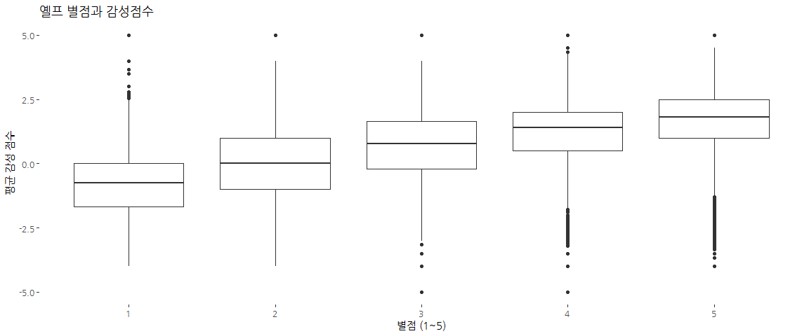
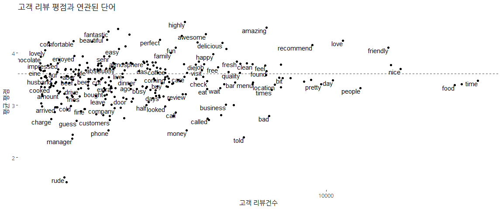
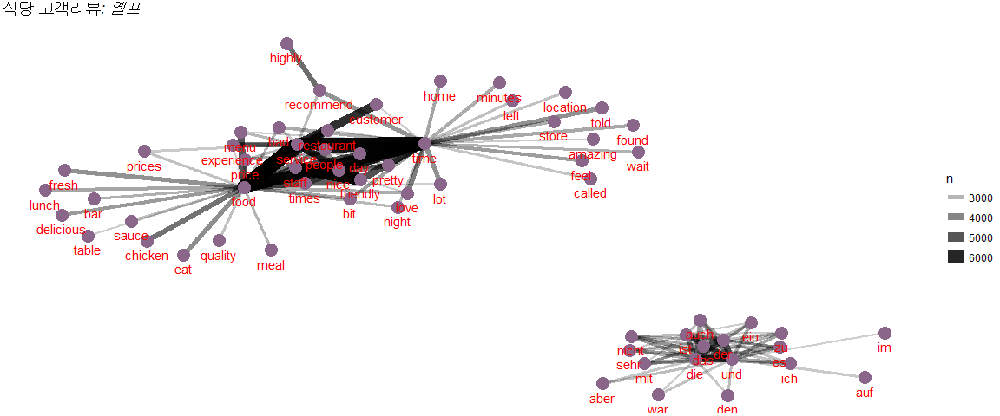
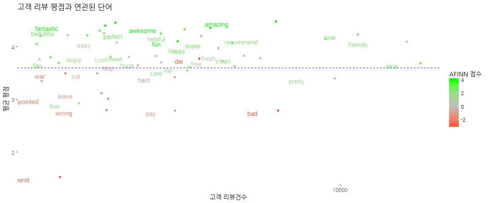

# xwMOOC 기계학습
 

## 1. 고객 방문후기 데이터 

고객이 식당을 방문하고 후기를 남기게 되면 그 자체로 재앙이다. 
데이터 분석하는 입장에서 남긴 후기 텍스트 데이터와 숫자형 평점 데이터(별점 1개 ... 별점 5개)가 결합된 형식의 데이터라 
어떻게 분석을 하게 되면 가장 많은 정보를 추출하여 유용하게 사용할 수 있을 것인가 !!!

## 2. 옐프 고객 후기 평점 데이터 [^variance-explianed-yelp] [^juliasilge-tidytext]

[^variance-explianed-yelp]: [Does sentiment analysis work? A tidy analysis of Yelp reviews](http://varianceexplained.org/r/yelp-sentiment/)

[^juliasilge-tidytext]: [THE LIFE-CHANGING MAGIC OF TIDYING TEXT](https://juliasilge.com/blog/life-changing-magic/)

### 2.1. 옐프 고객 후기 데이터

[Yelp Dataset Challenge](https://www.yelp.com/dataset_challenge)에서 데이터를 다운로드 받아 보게 되면 크게 두가지를 사실을 파악하게 된다.
고객후기 데이터가 정말 많다. 그리고, 고객후기 데이터의 전형적인 패턴을 볼 수 있다.

옐프 고객후기 데이터가 JSON으로 되어 있어 `read_lines()` 함수로 읽어온 후 `fromJSON`으로 읽기 위해 전처리작업을 수행하고 나서 데이터프레임으로 변환시킨다.

~~~{.r}
# 0. 환경설정 -------------------------------------
# library(tidyverse)
# library(extrafont)
# loadfonts()
# library(ggthemes)
# library(stringr)
# library(jsonlite)
# library(tidytext)
# library(widyr)
# library(igraph)
# library(ggraph)

# 1. 데이터 가져오기 -------------------------------------
review_lines <- read_lines("data/yelp_academic_dataset_review.json", n_max=100000, progress=TRUE)
~~~

~~~{.output}

|                                                           |   0%   24 MB
|                                                           |   1%   33 MB
|                                                           |   1%   41 MB
|                                                           |   1%   49 MB
|=                                                          |   1%   57 MB
|=                                                          |   2%   66 MB
|=                                                          |   2%   74 MB
|=                                                          |   2%   82 MB
|=                                                          |   2%   82 MB

~~~

~~~{.r}
reviews_combined <- str_c("[", str_c(review_lines, collapse = ", "), "]")

review_df <- fromJSON(reviews_combined) %>%
    flatten() %>%
    tbl_df()

rm(reviews_combined, review_lines)

review_df %>% 
    sample_n(3) %>% 
    DT::datatable()
~~~

<!--html_preserve-->

<!--/html_preserve-->

### 2.2. 고객평점과 긍부정 단어 연관성

가장 먼저 평정과 고객 방문후기에 적힌 텍스트에 감정이 녹아있는지 확인해보자.
이를 위해 고객이 남긴 방문후기를 `tidytext`로 변환을 시킨 후에 감성사전을 병합한다.
그리고 나서 고객평점 별로 긍부정 점수를 상자그림을 활용하여 시각화한다.

`tidytext` 팩키지에는 3가지 감성사전이 적용되어 있어 즉석에서 감성분석이 가능한데 
감성사전 3가지 모두 특성이 다르다. 

~~~{.r}
# 2. 텍스트와 감성분석 데이터 -----------------------------------
## 2.1. 깔끔한 텍스트 ----------------------------------
review_words <- review_df %>%
    select(review_id, business_id, stars, text) %>%
    unnest_tokens(word, text) %>%
    filter(!word %in% stop_words$word,
           str_detect(word, "^[a-z']+$"))

review_words
~~~

~~~{.output}
# A tibble: 4,487,246 x 4
                review_id            business_id stars       word
                    <chr>                  <chr> <int>      <chr>
 1 NxL8SIC5yqOdnlXCg18IBg 2aFiy99vNLklCx3T_tGS9A     5      enjoy
 2 NxL8SIC5yqOdnlXCg18IBg 2aFiy99vNLklCx3T_tGS9A     5    service
 3 NxL8SIC5yqOdnlXCg18IBg 2aFiy99vNLklCx3T_tGS9A     5  competent
 4 NxL8SIC5yqOdnlXCg18IBg 2aFiy99vNLklCx3T_tGS9A     5 personable
 5 NxL8SIC5yqOdnlXCg18IBg 2aFiy99vNLklCx3T_tGS9A     5  recommend
 6 NxL8SIC5yqOdnlXCg18IBg 2aFiy99vNLklCx3T_tGS9A     5      corey
 7 NxL8SIC5yqOdnlXCg18IBg 2aFiy99vNLklCx3T_tGS9A     5     kaplan
 8 NxL8SIC5yqOdnlXCg18IBg 2aFiy99vNLklCx3T_tGS9A     5     highly
 9 NxL8SIC5yqOdnlXCg18IBg 2aFiy99vNLklCx3T_tGS9A     5       time
10 NxL8SIC5yqOdnlXCg18IBg 2aFiy99vNLklCx3T_tGS9A     5      spent
# ... with 4,487,236 more rows

~~~

~~~{.r}
## 2.2. 감성사전 ----------------------------------
AFINN <- sentiments %>%
    filter(lexicon == "AFINN") %>%
    select(word, afinn_score = score)

AFINN
~~~

~~~{.output}
# A tibble: 2,476 x 2
         word afinn_score
        <chr>       <int>
 1    abandon          -2
 2  abandoned          -2
 3   abandons          -2
 4   abducted          -2
 5  abduction          -2
 6 abductions          -2
 7      abhor          -3
 8   abhorred          -3
 9  abhorrent          -3
10     abhors          -3
# ... with 2,466 more rows

~~~

~~~{.r}
bing <- sentiments %>%
    filter(lexicon == "bing") %>%
    select(word, bing_score = sentiment)

bing
~~~

~~~{.output}
# A tibble: 6,788 x 2
          word bing_score
         <chr>      <chr>
 1     2-faced   negative
 2     2-faces   negative
 3          a+   positive
 4    abnormal   negative
 5     abolish   negative
 6  abominable   negative
 7  abominably   negative
 8   abominate   negative
 9 abomination   negative
10       abort   negative
# ... with 6,778 more rows

~~~

~~~{.r}
nrc <- sentiments %>%
    filter(lexicon == "nrc") %>%
    select(word, nrc_score = sentiment)

nrc
~~~

~~~{.output}
# A tibble: 13,901 x 2
          word nrc_score
         <chr>     <chr>
 1      abacus     trust
 2     abandon      fear
 3     abandon  negative
 4     abandon   sadness
 5   abandoned     anger
 6   abandoned      fear
 7   abandoned  negative
 8   abandoned   sadness
 9 abandonment     anger
10 abandonment      fear
# ... with 13,891 more rows

~~~

~~~{.r}
# 3. 텍스트 감성분석 -----------------------------------
## 3.1. 평점과 감성분석 연관성
reviews_sentiment <- review_words %>%
    inner_join(AFINN, by = "word") %>%
    group_by(review_id, stars) %>%
    summarize(sentiment = mean(afinn_score))

reviews_sentiment
~~~

~~~{.output}
# A tibble: 94,147 x 3
# Groups:   review_id [?]
                review_id stars sentiment
                    <chr> <int>     <dbl>
 1 --_lgetOolR3U4ntiICuGA     3  1.000000
 2 --5X1FSpOqrRuBMLZls0zA     1 -1.454545
 3 --aGVrDsKsmhta6HDM47yw     5  1.777778
 4 --j4mgdN9s_ugDbGVXUW_w     4 -1.000000
 5 --M88mpupd2LvF_hB-J6ug     5  3.500000
 6 --mirtiVi9kmkJppPUll4A     3 -3.000000
 7 --NyImvY7i6LrHK1ToK4Vw     4  1.333333
 8 --oGVSuHeVB0oTPLpdJHCw     5  3.000000
 9 --PHB3nACoT8ETKpTlKuuA     3  1.000000
10 --PYx_szZyli7oo8-VCRJA     5  4.000000
# ... with 94,137 more rows

~~~

~~~{.r}
ggplot(reviews_sentiment, aes(stars, sentiment, group = stars)) +
    geom_boxplot() +
    theme_tufte(base_family="NanumGothic") +
    labs(y="평균 감성 점수",x="별점 (1~5)", title="옐프 별점과 감성점수")
~~~

예상한 바와 같이 별점이 높아질수록 평균감성 점수도 함께 올라간다. 하지만, 이상점도 함께 증가하는 것이 파악되어 
추가 작업은 필요해 보인다.

### 2.3. 긍정/부정이 높은 단어

고객방문 후기에 담긴 텍스트를 통해 긍정/부정이 높은 단어는 어떤 것이 있는지 확인해본다.
식당(`business_id`)에서 고객(`review_id`)이 남긴 평점(stars)별로 남긴 단어 출현횟수를 센다.
이를 바탕으로 단어를 중심으로 사업장별(`businesses`), 방문후기별(`reviews`), 총 사용빈도별로(`uses`), 
평점을 평균(`average_stars`)내서 데이터프레임으로 준비한다.

고객 방문후기가 최소 200, 사업장은 10 회 이상되는 곳만 지정하여 평점을 높이는데 기여한 단어와
반대의 경우를 뽑아보고 시각화한다.

~~~{.r}
## 3.2. 긍정/부정과 연관된 평점
review_words_counted <- review_words %>%
    count(review_id, business_id, stars, word) %>%
    ungroup()

review_words_counted
~~~

~~~{.output}
# A tibble: 3,749,313 x 5
                review_id            business_id stars     word     n
                    <chr>                  <chr> <int>    <chr> <int>
 1 --_lgetOolR3U4ntiICuGA 1qw65j15MqKqYkljH_iSyA     3   buffet     1
 2 --_lgetOolR3U4ntiICuGA 1qw65j15MqKqYkljH_iSyA     3  buffets     1
 3 --_lgetOolR3U4ntiICuGA 1qw65j15MqKqYkljH_iSyA     3  chinese     1
 4 --_lgetOolR3U4ntiICuGA 1qw65j15MqKqYkljH_iSyA     3 crawdads     1
 5 --_lgetOolR3U4ntiICuGA 1qw65j15MqKqYkljH_iSyA     3   dinner     1
 6 --_lgetOolR3U4ntiICuGA 1qw65j15MqKqYkljH_iSyA     3     fill     1
 7 --_lgetOolR3U4ntiICuGA 1qw65j15MqKqYkljH_iSyA     3     fire     1
 8 --_lgetOolR3U4ntiICuGA 1qw65j15MqKqYkljH_iSyA     3      fun     1
 9 --_lgetOolR3U4ntiICuGA 1qw65j15MqKqYkljH_iSyA     3 hankerin     1
10 --_lgetOolR3U4ntiICuGA 1qw65j15MqKqYkljH_iSyA     3     lots     1
# ... with 3,749,303 more rows

~~~

~~~{.r}
word_summaries <- review_words_counted %>%
    group_by(word) %>%
    summarize(businesses = n_distinct(business_id),
              reviews = n(),
              uses = sum(n),
              average_stars = mean(stars)) %>%
    ungroup()

word_summaries
~~~

~~~{.output}
# A tibble: 118,764 x 5
                        word businesses reviews  uses average_stars
                       <chr>      <int>   <int> <int>         <dbl>
 1                    a'ight          1       1     1      3.000000
 2                      a'la          3       3     4      4.666667
 3                 a'manager          1       1     1      1.000000
 4                        aa         23      30    46      4.300000
 5                       aaa         52      67    91      3.611940
 6                     aaa's          1       2     2      4.500000
 7                     aaaaa          1       1     1      5.000000
 8 aaaaaaaaaahhhhhhhhhhhhhhh          1       1     1      5.000000
 9                  aaaaaand          1       1     1      4.000000
10                  aaaaaber          1       1     1      3.000000
# ... with 118,754 more rows

~~~

~~~{.r}
word_summaries_filtered <- word_summaries %>%
    filter(reviews >= 2000, businesses >= 100)

# 평점이 높은 단어
word_summaries_filtered %>%
    arrange(desc(average_stars))
~~~

~~~{.output}
# A tibble: 289 x 5
           word businesses reviews  uses average_stars
          <chr>      <int>   <int> <int>         <dbl>
 1       highly       3268    4525  4697      4.593370
 2      amazing       4434    7154  8219      4.482947
 3    wonderful       2395    3108  3416      4.461712
 4    fantastic       2349    2944  3175      4.406250
 5      awesome       3540    5085  5684      4.361849
 6 professional       2320    3310  3548      4.355287
 7    excellent       3285    4448  4954      4.330261
 8    beautiful       1922    2861  3244      4.301992
 9     favorite       2041    2925  3176      4.255385
10      perfect       2851    3933  4339      4.249428
# ... with 279 more rows

~~~

~~~{.r}
# 평점이 낮은 단어
word_summaries_filtered %>%
    arrange(average_stars)
~~~

~~~{.output}
# A tibble: 289 x 5
        word businesses reviews  uses average_stars
       <chr>      <int>   <int> <int>         <dbl>
 1     worst       1856    2326  2556      1.526655
 2      rude       1852    2296  2698      1.619774
 3   manager       1789    2400  3193      2.362083
 4      told       4259    6286  9122      2.387051
 5      paid       2011    2408  2744      2.438538
 6     phone       2229    2947  3924      2.515100
 7     money       3401    4568  5407      2.518608
 8     guess       2032    2461  2646      2.700935
 9 customers       2383    2969  3383      2.719771
10      left       3751    5172  6030      2.721578
# ... with 279 more rows

~~~

~~~{.r}
# 4. 시각화 --------------------------------------------------
## 4.1. 고객리뷰와 평균평점 시각화 ---------------------------
ggplot(word_summaries_filtered, aes(reviews, average_stars)) +
    geom_point() +
    geom_text(aes(label = word), check_overlap = TRUE, vjust = 1, hjust = 1) +
    scale_x_log10() +
    theme_tufte(base_family="NanumGothic") +
    geom_hline(yintercept = mean(review_df$stars), color = "red", lty = 2) +
    labs(x="고객 리뷰건수", y="평균 평점", title="고객 리뷰 평점과 연관된 단어")
~~~

### 2.4. 고객 방문후기 연관단어

고객 방문후기에 동시에 출현하는 단어를 뽑아내고 이를 그래프를 통해 시각화한다.

~~~{.r}
## 4.2. 연관단어 ---------------------------

word_cooccurences <- review_words %>% 
    mutate(review_key = str_c(review_id, business_id, "_")) %>% 
    pairwise_count(word, review_key, sort = TRUE) %>% 
    filter(n >= 2000)

word_cooccurences %>% 
    graph_from_data_frame() %>%
    ggraph(layout = "fr") +
    geom_edge_link(aes(edge_alpha = n, edge_width = n)) +
    geom_node_point(color = "plum4", size = 5) +
    geom_node_text(aes(label = name), color="red", vjust = 1.8) +
    ggtitle(expression(paste("식당 고객리뷰", 
                             italic(": 옐프")))) +
    theme_void()
~~~

### 2.5. 긍부정어 고객후기반영 감성 시각화

긍부정어를 `AFINN` 감성사전을 활용하여 색상을 넣어 시각화한다.

~~~{.r}
## 4.3. 평점과 연계된 긍부정 단어 ---------------------------
word_summaries_filtered %>%
    inner_join(AFINN, by = "word") %>%
    ggplot(aes(reviews, average_stars, color = afinn_score)) +
    geom_point() +
    geom_text(aes(label = word), check_overlap = TRUE, vjust = 1, hjust = 3) +
    scale_x_log10() +
    theme_tufte(base_family="NanumGothic") +
    geom_hline(yintercept = mean(review_df$stars), color = "blue", lty = 2) +
    scale_color_gradient2(low = "red", high = "green", midpoint = 0, mid = "gray") +
    labs(x="고객 리뷰건수", y="평균 평점", 
         title="고객 리뷰 평점과 연관된 단어",
         color="AFINN 점수")
~~~

